# AI 开发工作流指南

> 本文档介绍 TEngine 项目完整的 AI 辅助开发工作流，包含 wiki-query-agent 上下文隔离架构、任务等级分级机制、会话缓存策略，以及与 openspec / tengine-dev 的集成使用方式。

**更新时间**: 2026-04-01

---

## 前提条件

### 必需工具

在开始使用 TEngine AI 开发工作流之前，请确保已安装以下工具：

#### 1. Claude (claude.ai/code)

**推荐使用 Claude Code** 作为主要的 AI 编程助手：

- 官方地址：[https://claude.ai/code](https://claude.ai/code)
- 支持本地文件操作、代码编辑、Unity Editor 自动化
- 集成 openspec、tengine-dev 等技能
- 提供上下文感知的 TEngine 开发指导

**安装方法**:
```bash
# 通过官网下载并安装
# Windows: https://claude.ai/code/download
# 安装后登录 Anthropic 账号即可使用
```

#### 2. ccswitch（API 密钥管理和反代）

**ccswitch** 是一个强大的 Claude API 管理工具，支持：
- 多个 API 密钥管理
- 反向代理配置
- 自动切换和负载均衡

#### 3. claude-mem（长期记忆库）★ 强烈推荐

**claude-mem** 是 Claude 的向量数据库插件，提供跨会话的长期记忆能力：

- 🧠 **向量数据库**: 自动存储项目知识和历史经验
- 🔍 **智能搜索**: 快速查找过去的解决方案
- 📚 **知识积累**: 越用越智能，持续学习项目特性
- 🔗 **无缝集成**: 自动在 Claude Code 中启用

**安装方法**:
```bash
/plugin marketplace add thedotmack/claude-mem
/plugin install claude-mem
```

**安装完后自动会启用**


### MCP工具

#### Unity-MCP（Unity Editor 自动化）

- 通过 REST API 自动化 Unity Editor 操作
- 已集成到 `unity-skills` 技能中
- 安装方法见 [unity-mcp-guide.md](skills/tengine-dev/references/unity-mcp-guide.md)

---

## 目录

- [前提条件](#前提条件)
  - [必需工具](#必需工具)
  - [可选工具](#可选工具)
- [概述](#概述)
- [wiki-query-agent 工作流](#wiki-query-agent-工作流)
  - [整体流程总览](#整体流程总览)
  - [时序图一：上下文隔离架构](#时序图一上下文隔离架构)
  - [时序图二：会话内缓存机制](#时序图二会话内缓存机制)
  - [时序图三：并行多主题查询](#时序图三并行多主题查询)
  - [时序图四：自愈闭环](#时序图四自愈闭环)
  - [任务等级分级说明](#任务等级分级说明)
- [快速开始](#快速开始)
- [openspec 工作流](#openspec-工作流)
- [tengine-dev Skills](#tengine-dev-skills)
- [集成工作流](#集成工作流)
  - [完整开发流程图](#完整开发流程图)
  - [详细流程说明](#详细流程说明)
  - [不同场景的工作流](#不同场景的工作流)
  - [与 Claude Code 配合的最佳实践](#与-claude-code-配合的最佳实践)
- [最佳实践](#最佳实践)
  - [需求定义](#1-需求定义)
  - [代码规范](#2-代码规范)
  - [Unity Editor 自动化](#3-unity-editor-自动化)
  - [文档维护](#4-文档维护)
  - [团队协作](#5-团队协作)
  - [调试技巧](#6-调试技巧)
  - [性能优化](#7-性能优化建议)
  - [安全注意事项](#8-安全注意事项)

---

## 概述

TEngine 项目提供了一套完整的 AI 辅助开发工作流，由以下核心组件构成：

- **wiki-query-agent**: 上下文隔离的 subagent，专职处理 wiki 文档查询，保护主 Agent 上下文窗口
- **任务等级分级（L1-L4）**: 按任务复杂度决定查询深度，简单任务零开销
- **会话内缓存**: 同一主题在同一会话中只查询一次，后续任务复用
- **自愈闭环**: 主动检测 wiki 与代码冲突，自动触发文档同步
- **openspec**: 规范驱动的变更管理工具
- **tengine-dev**: Claude Code 专用的 TEngine 开发技能
- **Unity-MCP**: Unity Editor 自动化操作工具

---

## wiki-query-agent 工作流

### 整体流程总览

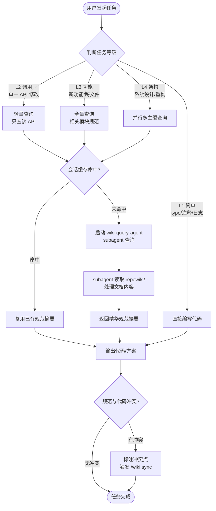

---

### 时序图一：上下文隔离架构

> **核心优势**：wiki 文档全部在 subagent 独立上下文中处理，主 Agent 只接收精华摘要，上下文窗口始终干净。

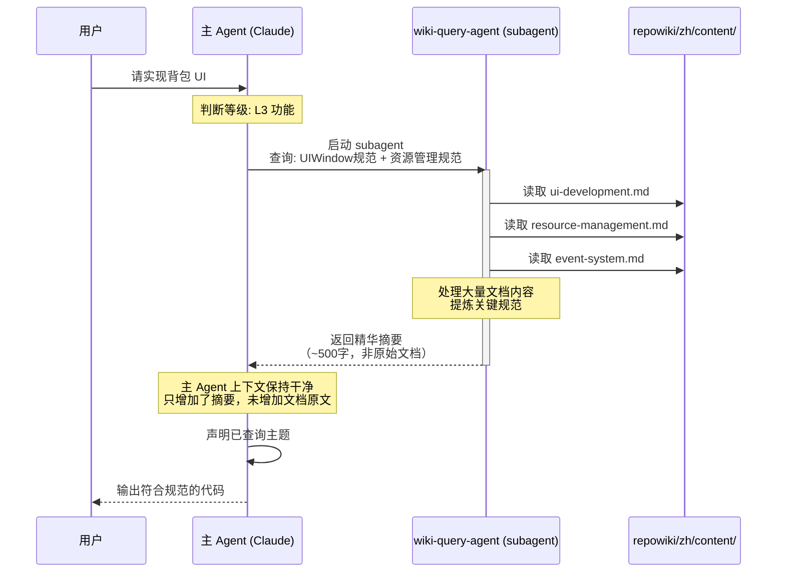

---

### 时序图二：会话内缓存机制

> **核心优势**：同一会话中相同主题只查询一次，后续任务直接复用，避免重复 token 消耗。

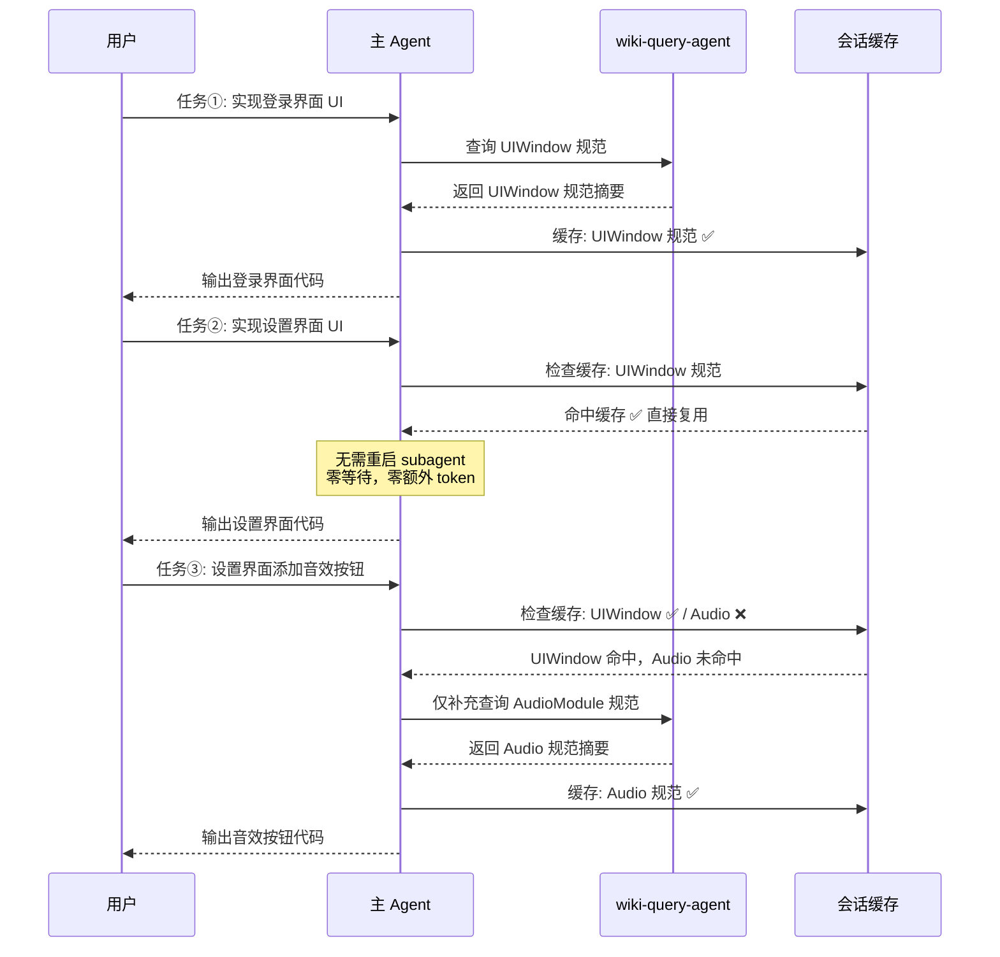

---

### 时序图三：并行多主题查询（L4 架构任务）

> **核心优势**：架构级任务并行启动多个 subagent，汇总后统一决策，大幅减少串行等待。

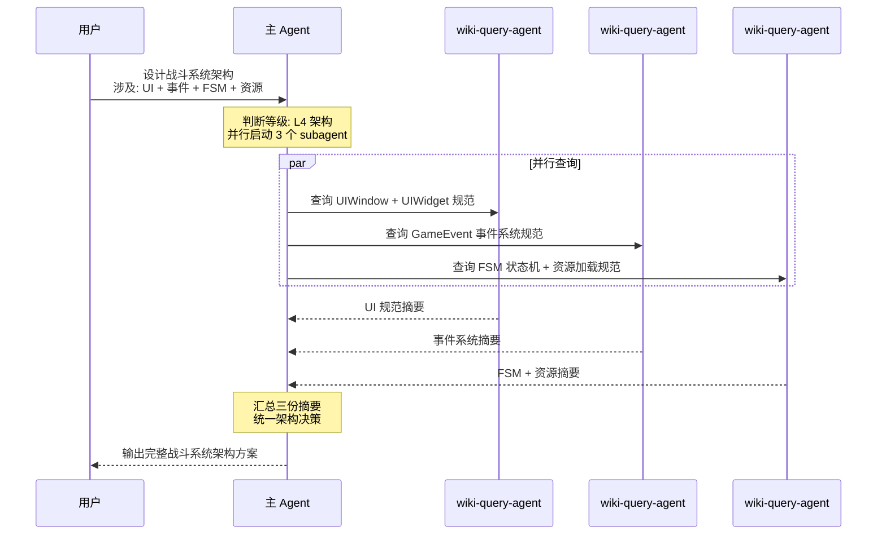

---

### 时序图四：自愈闭环（文档自动同步）

> **核心优势**：AI 主动检测 wiki 与代码的不一致，自动触发同步，形成持续改进的自愈循环。

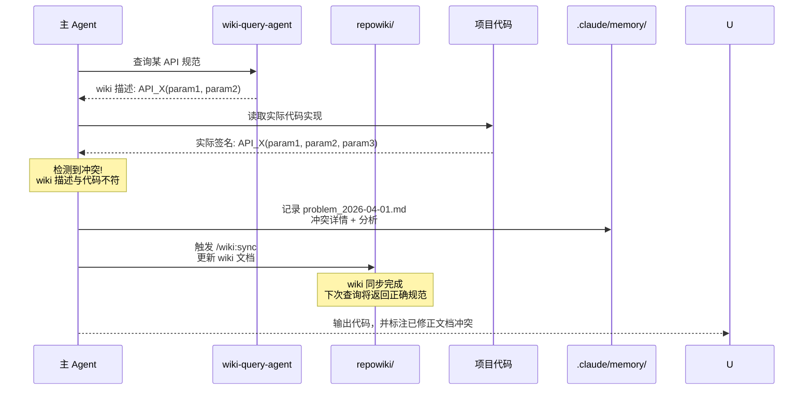

---

### 任务等级分级说明

| 等级 | 判断标准 | wiki 查询策略 | 声明步骤 |
|------|---------|-------------|---------|
| **L1 简单** | typo 修正、注释修改、日志输出、单行变量改名 | ❌ 跳过查询 | ❌ 跳过 |
| **L2 调用** | 调用已知 API、单一模块的局部修改 | ✅ 轻量查询（只查该 API） | 可选 |
| **L3 功能** | 新功能开发、跨文件修改、新增 UI/资源/事件逻辑 | ✅ 全量查询 | ✅ 必须 |
| **L4 架构** | 模块设计、系统重构、多模块协作、架构决策 | ✅ 并行多主题查询 | ✅ 必须 |

> **判断原则**：宁可高估等级，不可低估——不确定时上调一级。

### 五步工作流快速参考

```
┌─────────────────────────────────────────────────────────┐
│                   TEngine AI 工作流                      │
├─────────────────────────────────────────────────────────┤
│  Step 0  判断任务等级 L1/L2/L3/L4                        │
│  Step 1  按等级决定查询深度（缓存命中则跳过）              │
│  Step 2  wiki-query-agent 独立处理文档，返回摘要          │
│  Step 3  L3/L4 声明已查询主题 + 关键规范摘要             │
│  Step 4  基于规范输出代码/方案                            │
│  Step 5  检测冲突 → 自动触发 /wiki:sync（如有）           │
└─────────────────────────────────────────────────────────┘
```

详细规范请参考：[CLAUDE.md](../UnityProject/CLAUDE.md)

---

## 快速开始

### 5 分钟上手 TEngine AI 开发

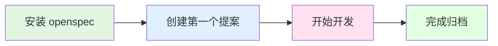

#### 第一步：安装工具

```bash
# 安装 openspec
npm install -g @fission-ai/openspec@latest

# 在 TEngine 项目根目录初始化
cd I:\WorkSpace\TEngine
openspec init

# 选择 Claude Code 作为 AI 工具
```

#### 第二步：创建第一个需求

```bash
# 创建一个简单的需求提案
opsx:propose "add-simple-button"
```

Claude 会自动生成：
- ✅ `proposal.md` - 需求描述
- ✅ `design.md` - 技术设计
- ✅ `specs/` - 详细规范
- ✅ `tasks.md` - 任务清单

#### 第三步：开始开发

```bash
# 审查生成的文档后，开始实施
opsx:apply
```

Claude 会：
1. 读取所有 artifact 内容
2. 逐个完成 tasks.md 中的任务
3. 自动触发 tengine-dev 技能（如果涉及 TEngine 代码）
4. 自动使用 unity-skills（如果需要操作 Unity Editor）

#### 第四步：测试与归档

```bash
# 所有任务完成后归档
opsx:archive

# 提交代码
git add .
git commit -m "feat: add simple button"
git push
```

### 典型工作流示例

```mermaid
sequenceDiagram
    participant Dev as 开发者
    participant Claude as Claude Code
    participant OpenSpec as OpenSpec
    participant Unity as Unity Editor

    Dev->>Claude: "帮我添加一个背包系统"
    Claude->>OpenSpec: opsx:propose "add-inventory"
    OpenSpec-->>Claude: 生成 artifacts
    Claude->>Dev: 展示提案和设计

    Dev->>Claude: "看起来不错，开始实施"
    Claude->>OpenSpec: opsx:apply
    OpenSpec-->>Claude: 加载所有上下文

    Claude->>Claude: 读取 tasks.md
    Claude->>Claude: 触发 tengine-dev 技能
    Claude->>Claude: 生成 UIInventory.cs

    Claude->>Unity: 使用 unity-skills
    Unity-->>Claude: 创建 UI Prefab

    Claude->>Dev: "已完成所有任务，请测试"

    Dev->>Unity: 测试功能
    Unity-->>Dev: ✅ 功能正常

    Dev->>Claude: "测试通过，归档"
    Claude->>OpenSpec: opsx:archive
    OpenSpec-->>Dev: ✅ 变更已归档
```

### 常见场景速查

| 场景 | 命令 | 说明 |
|------|------|------|
| 需求不明确 | `opsx:explore` | 进入探索模式，梳理需求 |
| 新功能开发 | `opsx:propose "feature-name"` | 创建提案并生成文档 |
| 开始编码 | `opsx:apply` | 开始实施任务 |
| 查找历史经验 | `"上次怎么做的？"` | 触发 claude-mem 搜索 |
| Unity 自动化 | `"帮我创建..."`| 自动触发 unity-skills |
| 完成归档 | `opsx:archive` | 归档变更 |

---

## openspec 工作流

### 什么是 openspec？

OpenSpec 是一个为AI编码助手设计的规范驱动开发工具，它通过轻量级的工作流程，确保人类开发者和AI助手在编写任何代码之前就能对需求达成明确共识。它通过以下方式帮助团队：

- 创建标准化的提案 (Proposal)
- 生成技术设计文档 (Design)
- 定义详细的规范 (Specs)
- 跟踪实施任务 (Tasks)

核心特点
- 🚀 轻量级：无需API密钥，最小化设置
- 🔄 现有项目优先：特别适合修改现有功能 (1→n)
- 📋 变更跟踪：提案、任务和规范差异的完整生命周期管理
- 🤖 AI工具集成：支持多种主流AI编码助手
2.为什么需要OpenSpec？
传统AI编码助手的问题
当您使用AI编码助手时，是否遇到过以下情况：
- ❌ AI根据模糊提示生成不符合需求的代码
- ❌ 遗漏重要功能要求
- ❌ 添加了不必要的功能
- ❌ 代码行为不可预测
OpenSpec的解决方案
OpenSpec通过规范驱动开发解决这些问题：
✅ 明确共识：在编码前确定所有要求
✅ 结构化变更：所有相关文档集中管理
✅ 可审查输出：AI根据明确规范生成代码
✅ 版本控制：完整追踪所有变更历史

### 安装

```bash
npm install -g @fission-ai/openspec@latest

cd your-project-directory

openspec init
```
初始化过程会：
1. 询问您使用的AI工具（Claude Code、Cursor等）
2. 自动配置相应的斜杠命令
3. 创建 openspec/ 目录结构

### 基础命令

```bash
# 新建议题
opsx:propose 新建议题我要做什么

# 开始执行
opex:apply 我还要附加什么条件

# 修改完成手动归档
opex:archive

# 获取指令帮助
openspec instructions <artifact-id> --change "my-feature"
```

### 推荐配合claude-mem 内有向量数据库长久记忆！

### 变更结构

每个变更包含以下 artifacts：

| Artifact | 描述 |
|----------|------|
| proposal.md | 变更提案，说明"为什么"和"做什么" |
| design.md | 技术设计文档，说明"如何实现" |
| specs/*.md | 详细规范，定义系统行为 |
| tasks.md | 实施任务清单 |

---

## tengine-dev Skills

### 什么是 tengine-dev？

`tengine-dev` 是 Claude Code 的技能，专门用于 TEngine 框架开发指导。

### 触发条件

在 TEngine 项目中编写或修改代码时，以下关键词会触发 tengine-dev 技能：

- **模块系统**: ResourceModule, AudioModule, TimerModule, GameModule
- **UI 开发**: UIWindow, UIWidget, UIModule
- **事件系统**: GameEvent, EventInterface, AddUIEvent
- **资源管理**: YooAsset, LoadAssetAsync, UnloadAsset
- **热更代码**: HybridCLR, GameApp, HotFix
- **配置表**: Luban, ConfigSystem

### 核心原则

tengine-dev 技能遵循以下核心原则：

1. **异步优先**: IO 操作用 `UniTask`，禁止同步加载/Coroutine
2. **模块访问**: 通过 `GameModule.XXX` 访问
3. **资源必须释放**: `LoadAssetAsync` 对应 `UnloadAsset`
4. **热更边界**: `GameScripts/Main` 不热更，`GameScripts/HotFix/` 全部热更
5. **事件解耦**: 模块间用 `GameEvent`，UI 内部用 `AddUIEvent`

### 程序集分层

```
GameScripts/Main/       → 主包（不热更）
GameScripts/HotFix/
  ├── GameProto/        → Luban 配置代码
  └── GameLogic/        → 业务逻辑（GameApp.cs 入口）
```

---

## 集成工作流

### 完整开发流程图

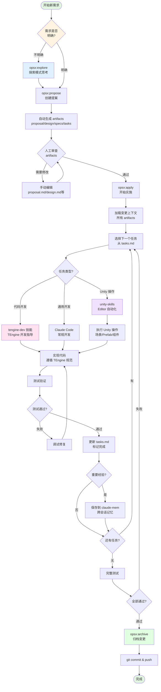

### 详细流程说明

#### 阶段 1: 需求探索与提案创建

```bash
# 如果需求不明确，先进入探索模式
opsx:explore
# 在探索模式中思考：
# - 这个需求的真正目标是什么？
# - 有哪些技术方案可选？
# - 需要考虑哪些边界情况？

# 需求明确后，创建提案
opsx:propose "add-user-inventory-system"
```

**自动生成的 artifacts**:
- `proposal.md` - 需求描述和目标
- `design.md` - 技术设计方案
- `specs/*.md` - 详细规范文档
- `tasks.md` - 实施任务清单

#### 阶段 2: 人工审查与完善

在 `openspec/changes/<change-name>/` 目录中检查生成的文档：

```bash
# 检查生成的文档
ls openspec/changes/add-user-inventory-system/

# 如果需要修改，直接编辑文件
# 修改后无需额外命令，opsx:apply 会自动加载最新内容
```

#### 阶段 3: 实施开发

```bash
# 开始实施，可以附加额外条件
opsx:apply "使用 UniTask 异步加载，遵循 TEngine 资源管理规范"
```

**Claude Code 会自动**:
1. 加载所有 artifact 内容作为上下文
2. 读取 `tasks.md` 中的任务列表
3. 逐个实施任务

**开发过程中**:

- **TEngine 代码开发** → 自动触发 `tengine-dev` 技能
  - 提供模块系统、UI 开发、事件系统、资源管理等指导
  - 确保代码符合 TEngine 规范（异步优先、资源释放、热更边界等）

- **Unity Editor 操作** → 使用 `unity-skills`
  - 创建/修改 GameObject、Prefab、Scene
  - 配置组件、材质、动画
  - UI 布局和组件绑定

- **通用代码开发** → Claude Code 常规能力
  - C# 代码编写
  - 算法实现
  - 工具脚本

#### 阶段 4: 测试与验证

每完成一个任务后：
1. 运行相关测试
2. 在 Unity 中验证功能
3. 更新 `tasks.md` 标记完成状态

#### 阶段 5: 记忆保存（可选）

如果遇到重要问题或发现有价值的经验：

```bash
# Claude Code 会自动使用 claude-mem 保存
# 无需手动操作，AI 会判断是否值得记录
```

**会保存的内容**:
- 解决的技术难题
- TEngine 特定的最佳实践
- 常见错误的解决方案
- 项目特定的约定

#### 阶段 6: 归档与提交

```bash
# 所有任务完成并测试通过后
opsx:archive

# 提交代码
git add .
git commit -m "feat: add user inventory system"
git push
```

### 不同场景的工作流

#### 场景 1: 新功能开发

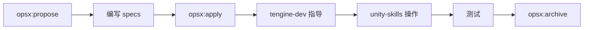

```bash
# 示例：添加背包系统
opsx:propose "add-inventory-system"
# 审查生成的 artifacts
opsx:apply "使用 TEngine 模块系统"
# 开发...
opsx:archive
```

#### 场景 2: Bug 修复

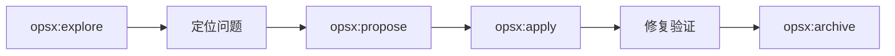

```bash
# 示例：修复资源泄漏
opsx:explore  # 先调查问题根源
opsx:propose "fix-resource-leak-in-ui"
opsx:apply
opsx:archive
```

#### 场景 3: 重构优化

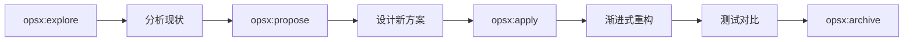

```bash
# 示例：优化 UI 加载性能
opsx:explore  # 分析性能瓶颈
opsx:propose "optimize-ui-loading"
# 在 design.md 中详细设计优化方案
opsx:apply
opsx:archive
```

#### 场景 4: Unity Editor 自动化操作

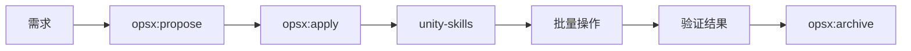

```bash
# 示例：批量创建 UI Prefab
opsx:propose "create-ui-panels-batch"
opsx:apply "使用 unity-skills 批量创建 10 个 UI 面板预制体"
# AI 会调用 unity-skills 自动化操作 Unity Editor
opsx:archive
```

### 与 Claude Code 配合的最佳实践

#### 1. 利用技能自动触发

**无需手动调用技能**，只需在描述中包含关键词：

```
❌ 不好：请使用 tengine-dev 技能帮我创建一个 UIWindow
✅ 好的：帮我创建一个背包 UIWindow，需要加载道具图标资源
→ 自动触发 tengine-dev，提供 UIWindow、资源管理指导
```

#### 2. 分阶段处理复杂任务

```bash
# 第一阶段：UI 框架
opsx:propose "inventory-ui-framework"
opsx:apply
opsx:archive

# 第二阶段：数据逻辑
opsx:propose "inventory-data-logic"
opsx:apply
opsx:archive

# 第三阶段：网络同步
opsx:propose "inventory-network-sync"
opsx:apply
opsx:archive
```

#### 3. 充分利用 claude-mem

```
"上次我们是怎么处理 UI 资源释放的？"
→ 触发 claude-mem:mem-search，查找历史经验

"帮我探索一下如何实现技能系统"
→ 使用 claude-mem:smart-explore 高效扫描代码结构
```

#### 4. Unity Editor 操作自动化

```
"帮我在场景中创建一个包含 10 个道具槽位的背包 UI"
→ 自动触发 unity-skills
→ 调用 manage_ui、manage_gameobject 等工具
→ 直接在 Unity Editor 中创建完整结构
```

### 常用命令速查

| 操作 | 命令 |
|------|------|
| 探索需求 | `opsx:explore` |
| 创建变更 | `opsx:propose "<name>"` |
| 开始实施 | `opsx:apply "额外条件"` |
| 归档完成 | `opsx:archive` |
| 查看帮助 | `openspec instructions <artifact-id>` |

---

## 最佳实践

### 1. 需求定义

#### 使用探索模式澄清模糊需求

```bash
# 场景：需求不明确时
opsx:explore

# 在探索模式中，Claude 会帮你思考：
# - 需求的核心价值是什么？
# - 有哪些隐含的边界条件？
# - 是否有现成的解决方案？
# - 需要考虑哪些技术约束？
```

#### 编写清晰的 Specs

在 `specs/*.md` 中使用场景驱动描述：

```markdown
## 场景 1: 用户打开背包

**前置条件**:
- 用户已登录
- 拥有至少 1 个道具

**操作流程**:
1. 点击主界面的背包按钮
2. 异步加载背包 UI Prefab
3. 从服务器获取道具列表
4. 渲染道具图标（异步加载）

**预期结果**:
- 背包界面在 1 秒内打开
- 所有道具图标正确显示
- 支持滚动查看更多道具

**异常情况**:
- 网络超时：显示错误提示
- 资源加载失败：使用默认图标
```

### 2. 代码规范

#### TEngine 核心原则检查清单

在每次开发完成后，确认：

- [ ] **异步优先**: 所有 IO 操作使用 `UniTask`
  ```csharp
  ✅ await GameModule.Resource.LoadAssetAsync<Sprite>(path);
  ❌ Resources.Load<Sprite>(path);  // 禁止
  ❌ StartCoroutine(LoadSprite());   // 禁止
  ```

- [ ] **资源释放**: 每个 `LoadAssetAsync` 都有对应的 `UnloadAsset`
  ```csharp
  ✅ private AssetHandle _handle;
      _handle = await GameModule.Resource.LoadAssetAsync<Sprite>(path);
      // 使用完毕后
      GameModule.Resource.UnloadAsset(_handle);

  ❌ await GameModule.Resource.LoadAssetAsync<Sprite>(path);
      // 没有保存 handle，无法释放
  ```

- [ ] **模块访问**: 通过 `GameModule.XXX` 访问
  ```csharp
  ✅ GameModule.Audio.PlaySound("click");
  ❌ ModuleSystem.GetModule<AudioModule>().PlaySound("click");
  ```

- [ ] **热更边界**: 代码放在正确的目录
  ```
  ✅ GameScripts/HotFix/GameLogic/UI/UIInventory.cs
  ❌ GameScripts/Main/UI/UIInventory.cs  // 不热更，错误！
  ```

- [ ] **事件解耦**: 使用正确的事件类型
  ```csharp
  ✅ 模块间：GameEvent.Send(EventName.OnInventoryChanged);
  ✅ UI 内：AddUIEvent(btnClose, OnCloseClicked);
  ❌ 直接引用：otherModule.OnInventoryChanged();
  ```

### 3. Unity Editor 自动化

#### 使用 unity-skills 提高效率

**批量创建 UI 结构**:
```
"帮我创建一个背包 UI，包含：
- 顶部标题栏（包含标题文本和关闭按钮）
- 中间 ScrollView（网格布局，3列）
- 底部按钮区（整理按钮、出售按钮）"

→ AI 自动调用 unity-skills 创建完整结构
```

**批量配置组件**:
```
"帮我给场景中所有名称包含 'Item' 的 GameObject 添加 BoxCollider 组件"

→ AI 批量操作，节省大量时间
```

**资源导入设置**:
```
"帮我将 Assets/UI/Icons 目录下的所有图片设置为：
- Texture Type: Sprite (2D and UI)
- Max Size: 512
- Compression: High Quality"

→ AI 批量修改导入设置
```

### 4. 文档维护

#### 及时更新项目文档

```bash
# 发现新的最佳实践时
# 直接告诉 Claude：
"这个资源释放的方案很好用，请记住：
在 UIWindow 中使用 List<AssetHandle> 统一管理所有加载的资源，
在 OnDestroy 时批量释放"

→ Claude 会自动保存到 claude-mem
→ 未来遇到类似场景会自动应用
```

#### 记录常见问题

创建 `troubleshooting.md` 记录解决方案：

```markdown
### 问题：UI 加载后资源未释放

**现象**: 内存持续增长，Unity Profiler 显示大量未释放的 Sprite

**原因**:
1. 忘记保存 AssetHandle
2. 在 OnDestroy 之前就销毁了窗口

**解决方案**:
使用 List<AssetHandle> 统一管理
...
```

### 5. 团队协作

#### 统一使用 openspec

```bash
# 团队成员 A：创建需求
opsx:propose "add-friend-system"
git add openspec/
git commit -m "docs: add friend system proposal"
git push

# 团队成员 B：审查需求
git pull
# 查看 openspec/changes/add-friend-system/
# 如有修改，直接编辑 proposal.md 等文件
git commit -m "docs: refine friend system design"
git push

# 团队成员 C：实施开发
git pull
opsx:apply
# 开发...
opsx:archive
git push
```

#### Code Review 检查点

提交 PR 前的自检清单：

- [ ] `tasks.md` 中的所有任务已完成
- [ ] 代码符合 TEngine 规范（异步、资源释放等）
- [ ] 已在 Unity 中测试功能
- [ ] 重要改动已记录到文档
- [ ] 变更已归档（`opsx:archive`）

### 6. 调试技巧

#### 利用 Claude 快速定位问题

```
"为什么我的 UI 加载后背景图显示不出来？
代码在 GameScripts/HotFix/GameLogic/UI/UIInventory.cs"

→ Claude 会：
1. 读取相关代码
2. 检查资源加载逻辑
3. 验证 TEngine 规范
4. 提供具体修复建议
```

#### 使用 claude-mem 查找历史解决方案

```
"我记得上次遇到过类似的 UI 显示问题，是怎么解决的？"

→ 触发 claude-mem:mem-search
→ 查找历史经验
→ 直接应用之前的解决方案
```

### 7. 性能优化建议

#### 资源加载优化

```csharp
// ✅ 批量预加载
private async UniTask PreloadResources()
{
    var tasks = new List<UniTask<AssetHandle>>();
    foreach (var path in iconPaths)
    {
        tasks.Add(GameModule.Resource.LoadAssetAsync<Sprite>(path));
    }
    _handles = (await UniTask.WhenAll(tasks)).ToList();
}

// ❌ 逐个加载
private async UniTask LoadResourcesOneByOne()
{
    foreach (var path in iconPaths)
    {
        await GameModule.Resource.LoadAssetAsync<Sprite>(path);
    }
}
```

#### UI 实例化优化

```csharp
// ✅ 使用对象池
var item = await GameModule.UI.CreateUIWidgetFromPool<UIInventoryItem>(prefabPath);

// ❌ 每次都创建新对象
var item = await GameModule.Resource.LoadGameObjectAsync(prefabPath);
```

### 8. 安全注意事项

#### 防止资源泄漏

```csharp
public class UIInventory : UIWindow
{
    private List<AssetHandle> _handles = new();

    // ✅ 统一管理资源句柄
    protected override async UniTask OnCreate()
    {
        var handle = await GameModule.Resource.LoadAssetAsync<Sprite>(path);
        _handles.Add(handle);  // 保存句柄
    }

    // ✅ 确保释放
    protected override void OnDestroy()
    {
        foreach (var handle in _handles)
        {
            GameModule.Resource.UnloadAsset(handle);
        }
        _handles.Clear();
        base.OnDestroy();
    }
}
```

#### 热更边界检查

```bash
# 在提交前检查热更边界
"帮我检查一下 GameScripts/ 目录下的代码是否放在了正确的热更目录"

→ Claude 会扫描代码结构
→ 指出不符合规范的文件
→ 提供修正建议
```

---

## 工具链总览

### 完整技术栈

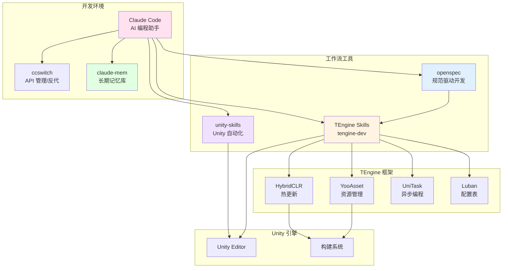

### 工具职责说明

| 工具 | 职责 | 使用场景 |
|------|------|----------|
| **Claude Code** | AI 编程助手核心 | 所有开发场景 |
| **ccswitch** | API 管理和反代 | 密钥管理、访问加速 |
| **claude-mem** | 长期记忆库 | 知识积累、历史查询 |
| **openspec** | 规范驱动开发 | 需求管理、文档生成 |
| **tengine-dev** | TEngine 开发指导 | 代码开发、规范检查 |
| **unity-skills** | Unity 自动化 | Editor 操作、资源管理 |

### 数据流向

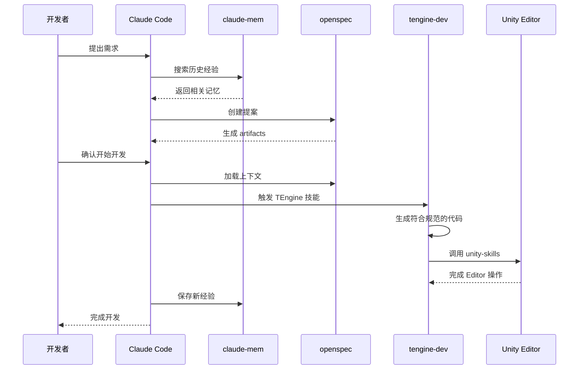

---

## 相关文档

- [openspec 官方文档](https://github.com/openspec/openspec)
- [TEngine 框架文档](Books/0-介绍.md)
- [tengine-dev 技能参考](skills/tengine-dev/references/)
- [claude-mem 插件](https://github.com/fission-ai/claude-mem)
- [Unity-MCP 指南](skills/tengine-dev/references/unity-mcp-guide.md)

---

## 常见问题

### Q: 为什么需要 ccswitch？

A: ccswitch 提供以下核心功能：
- **多密钥管理**: 自动在多个 API 密钥间切换，提高可用性
- **反向代理**: 在网络受限环境下加速访问
- **负载均衡**: 避免单个密钥的请求限制

### Q: claude-mem 的记忆会占用很多空间吗？

A: 不会。claude-mem 使用向量数据库高效存储：
- 只保存关键信息和经验
- 自动去重和压缩
- 可配置保留策略

### Q: 不使用 openspec 可以吗？

A: 可以，但强烈推荐使用：
- **小需求**: 可以直接让 Claude 编写代码
- **中等需求**: 建议使用 openspec 记录设计
- **大型需求**: 必须使用 openspec 确保需求清晰

### Q: tengine-dev 技能如何触发？

A: 自动触发，无需手动调用：
- 描述中包含 TEngine 关键词即可
- 如：UIWindow、GameModule、YooAsset、UniTask 等
- Claude 会自动加载相应的开发指导

### Q: 如何验证环境配置正确？

A: 检查清单：
```bash
# 1. 检查 openspec
openspec --version

# 2. 检查 ccswitch
ccswitch list

# 3. 在 Claude Code 中测试
"请帮我创建一个简单的 UIWindow"
→ 应该自动触发 tengine-dev 技能

# 4. 测试 claude-mem
"上次我们是怎么处理资源加载的？"
→ 应该能搜索到历史记忆
```

---

## 进阶使用

### 自定义 openspec 模板

可以在项目中创建自定义模板：

```bash
# 在 .openspec/templates/ 目录下创建模板
mkdir -p .openspec/templates/ui-feature

# 编辑模板文件
# proposal-template.md
# design-template.md
# spec-template.md
```

### 扩展 tengine-dev 技能

在 `skills/tengine-dev/references/` 中添加自定义参考文档：

```bash
# 添加项目特定的最佳实践
touch skills/tengine-dev/references/custom-patterns.md
```

### 配置 unity-skills 脚本模板

在 Unity Editor 中配置自定义脚本模板，unity-skills 会自动使用。

---

*如有问题，请提交 Issue 或联系维护者。*
