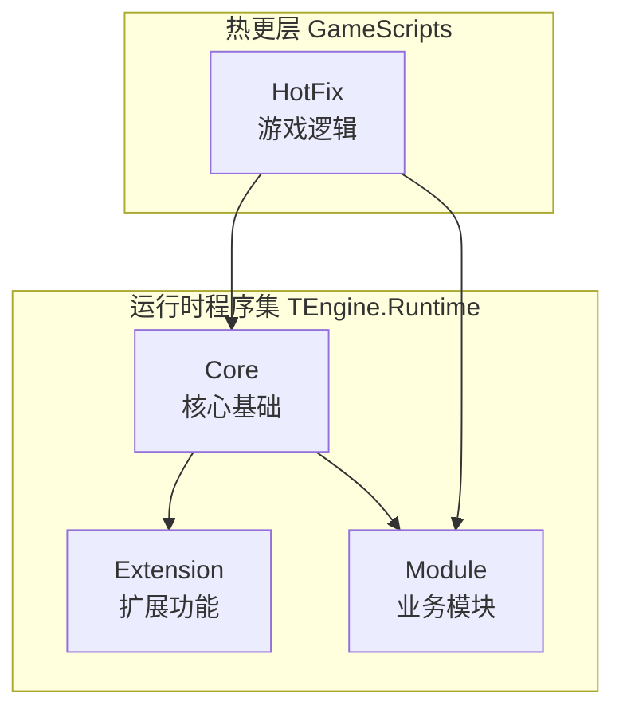
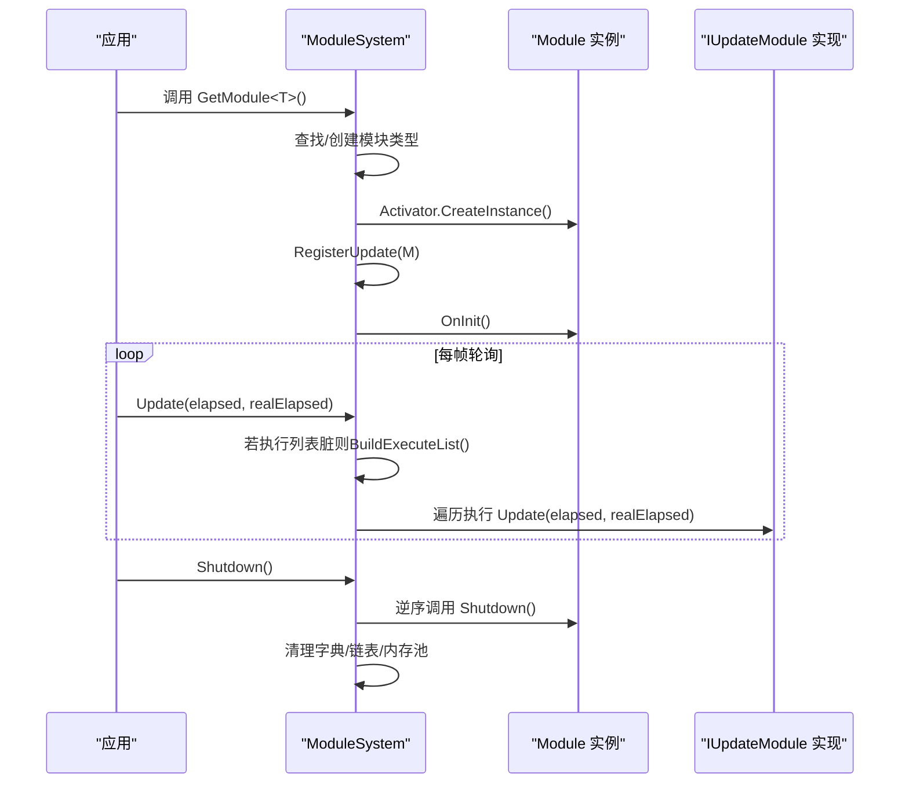
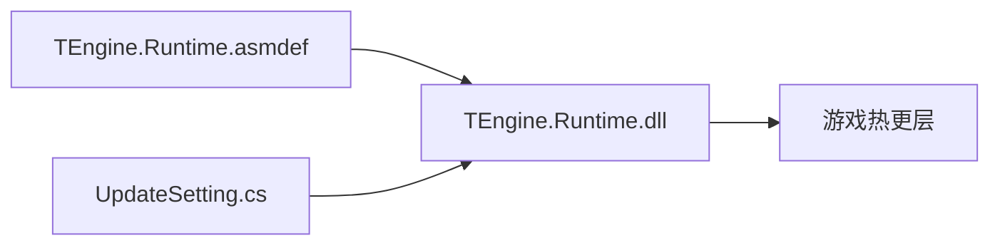

# API参考

<cite>
**本文引用的文件**
- [README.md](file://Assets/TEngine/README.md)
- [CHANGELOG.md](file://Assets/TEngine/CHANGELOG.md)
- [Module.cs](file://Assets/TEngine/Runtime/Core/Module.cs)
- [ModuleSystem.cs](file://Assets/TEngine/Runtime/Core/ModuleSystem.cs)
- [UpdateSetting.cs](file://Assets/TEngine/Runtime/Core/UpdateSetting.cs)
- [systemPatterns.md](file://memory-bank/systemPatterns.md)
- [techContext.md](file://memory-bank/techContext.md)
</cite>

## 目录
1. [简介](#简介)
2. [项目结构](#项目结构)
3. [核心组件](#核心组件)
4. [架构总览](#架构总览)
5. [详细组件分析](#详细组件分析)
6. [依赖分析](#依赖分析)
7. [性能考量](#性能考量)
8. [故障排查指南](#故障排查指南)
9. [结论](#结论)
10. [附录](#附录)

## 简介
本API参考面向TEngine框架的使用者与维护者，系统梳理框架核心模块的公共接口与类定义，覆盖模块系统、资源管理、事件系统、UI系统等关键领域。文档提供接口签名、参数说明、返回值描述、异常处理策略、使用示例与最佳实践指引，并补充版本兼容性与变更历史、性能特性与使用限制，以及便捷的索引与检索建议，帮助开发者高效定位与正确使用API。

## 项目结构
TEngine采用“模块化+分层”的架构设计，核心代码位于运行时程序集TEngine.Runtime中，按功能域划分为Core、Extension、Module三大层次，配合GameScripts热更层形成完整的开发与运行体系。

**图表来源**
- [systemPatterns.md:182-204](file://memory-bank/systemPatterns.md#L182-L204)

**章节来源**
- [README.md:61-83](file://Assets/TEngine/README.md#L61-L83)
- [systemPatterns.md:178-232](file://memory-bank/systemPatterns.md#L178-L232)

## 核心组件
本节聚焦TEngine运行时的核心公共API，包括模块系统接口与实现、模块生命周期管理、更新调度机制等。

- 模块接口与抽象基类
  - IUpdateModule：定义模块轮询接口，包含Update方法，接收逻辑流逝时间与真实流逝时间两个浮点参数。
  - Module：模块抽象基类，提供优先级属性、OnInit初始化方法、Shutdown关闭清理方法。

- 模块系统管理
  - ModuleSystem：静态管理器，负责模块注册、创建、排序、轮询与清理；提供GetModule<T>()按接口类型获取模块、RegisterModule<T>()注册自定义模块、Update()统一驱动、Shutdown()全局关闭清理等能力。
  - 更新执行列表：通过BuildExecuteList()基于优先级构建IUpdateModule执行数组，避免每帧重复排序，提升轮询性能。

- 更新设置
  - UpdateSetting：包含AOT元数据程序集列表等配置项，用于HybridCLR/AOT模式下的程序集准备与链接。

**章节来源**
- [Module.cs:1-40](file://Assets/TEngine/Runtime/Core/Module.cs#L1-L40)
- [ModuleSystem.cs:1-208](file://Assets/TEngine/Runtime/Core/ModuleSystem.cs#L1-L208)
- [UpdateSetting.cs:74-74](file://Assets/TEngine/Runtime/Core/UpdateSetting.cs#L74-L74)

## 架构总览
下图展示TEngine模块系统的运行时交互关系与调用序列，体现模块注册、优先级排序、轮询调度与关闭清理的完整流程。

**图表来源**
- [ModuleSystem.cs:29-60](file://Assets/TEngine/Runtime/Core/ModuleSystem.cs#L29-L60)
- [ModuleSystem.cs:199-206](file://Assets/TEngine/Runtime/Core/ModuleSystem.cs#L199-L206)
- [Module.cs:8-39](file://Assets/TEngine/Runtime/Core/Module.cs#L8-L39)

## 详细组件分析

### 模块系统API
- 接口与类定义
  - IUpdateModule.Update(float elapseSeconds, float realElapseSeconds)
    - 参数
      - elapseSeconds：逻辑流逝时间，以秒为单位。
      - realElapseSeconds：真实流逝时间，以秒为单位。
    - 返回值：无。
    - 异常：无显式声明，遵循实现约定。
    - 使用场景：模块每帧更新逻辑，如状态推进、计时器、输入处理等。
  - Module
    - 属性
      - Priority：模块优先级，默认0，数值越高越早初始化、越晚关闭。
    - 方法
      - OnInit()：模块初始化钩子，由系统在注册时调用。
      - Shutdown()：模块关闭清理钩子，由系统在关服时调用。
  - ModuleSystem
    - GetModule<T>()：按接口类型获取模块实例；若不存在则按命名规则反射创建；非接口类型将抛出异常。
    - RegisterModule<T>(Module module)：注册自定义模块实例；非接口类型将抛出异常。
    - Update(float, float)：统一轮询入口；内部按优先级构建执行列表并遍历调用。
    - Shutdown()：逆序关闭所有模块，清空映射与集合，触发内存池与本地缓存清理。

- 使用示例与最佳实践
  - 基本用法
    - 定义一个实现IUpdateModule的模块类，重写Update方法。
    - 在模块类中实现OnInit/Shutdown完成资源申请与释放。
    - 通过ModuleSystem.GetModule<IMyModule>()获取实例并开始使用。
  - 高级用法
    - 合理设置Priority以控制模块初始化顺序与关闭顺序。
    - 在Update中避免长时间阻塞，必要时拆分为多帧处理。
    - 使用RegisterModule<T>()注入自定义实现，便于测试与替换。
  - 异常处理
    - GetModule<T>()在传入非接口类型或无法反射到具体模块类型时抛出框架异常。
    - RegisterModule<T>()在传入非接口类型时抛出框架异常。
    - Shutdown()期间的异常应捕获并记录，确保清理流程继续执行。

- 版本兼容性与变更历史
  - 参考版本日志，TEngine在多个大版本中进行了重构与功能增强，涉及资源模块、UI框架、事件系统、内存池等模块的演进。建议在升级前查阅对应版本的变更说明，关注接口行为变化与废弃API迁移。

- 性能特性与使用限制
  - Update调度采用“脏标记+一次性重建”策略，降低每帧排序开销。
  - 设计模块数量常量与初始容量，减少扩容与GC分配。
  - 优先级链表插入与执行列表构建均按优先级有序进行，保证确定性顺序。

**章节来源**
- [Module.cs:8-39](file://Assets/TEngine/Runtime/Core/Module.cs#L8-L39)
- [ModuleSystem.cs:68-89](file://Assets/TEngine/Runtime/Core/ModuleSystem.cs#L68-L89)
- [ModuleSystem.cs:128-141](file://Assets/TEngine/Runtime/Core/ModuleSystem.cs#L128-L141)
- [ModuleSystem.cs:29-42](file://Assets/TEngine/Runtime/Core/ModuleSystem.cs#L29-L42)
- [ModuleSystem.cs:47-60](file://Assets/TEngine/Runtime/Core/ModuleSystem.cs#L47-L60)
- [ModuleSystem.cs:143-194](file://Assets/TEngine/Runtime/Core/ModuleSystem.cs#L143-L194)
- [ModuleSystem.cs:199-206](file://Assets/TEngine/Runtime/Core/ModuleSystem.cs#L199-L206)
- [CHANGELOG.md:5-11](file://Assets/TEngine/CHANGELOG.md#L5-L11)
- [CHANGELOG.md:13-15](file://Assets/TEngine/CHANGELOG.md#L13-L15)
- [CHANGELOG.md:17-19](file://Assets/TEngine/CHANGELOG.md#L17-L19)
- [CHANGELOG.md:21-23](file://Assets/TEngine/CHANGELOG.md#L21-L23)
- [CHANGELOG.md:25-27](file://Assets/TEngine/CHANGELOG.md#L25-L27)
- [CHANGELOG.md:29-31](file://Assets/TEngine/CHANGELOG.md#L29-L31)
- [CHANGELOG.md:35-39](file://Assets/TEngine/CHANGELOG.md#L35-L39)

### 资源管理API（概述）
- 模块定位
  - 资源模块位于Module/ResourceModule目录，结合YooAsset进行资源生命周期管理与异步加载。
- 常见职责
  - 资源包管理、AB依赖解析、异步加载与缓存、卸载与释放、LRU/ARC策略集成。
- 使用建议
  - 优先使用异步加载，避免主线程阻塞。
  - 明确资源引用计数与释放时机，防止泄漏。
  - 结合打包策略与分包管理，降低首包体积与热更成本。

**章节来源**
- [README.md:37-37](file://Assets/TEngine/README.md#L37-L37)
- [techContext.md:206-218](file://memory-bank/techContext.md#L206-L218)

### 事件系统API（概述）
- 模块定位
  - 事件系统位于Core/GameEvent目录，提供事件分发、委托数据封装与运行时ID管理。
- 常见职责
  - 事件注册与注销、事件分发、委托数据结构、运行时ID生成与复用。
- 使用建议
  - 事件回调应尽量短小，避免复杂计算。
  - 注意成对注册与注销，防止内存泄漏与重复回调。

**章节来源**
- [README.md:38-38](file://Assets/TEngine/README.md#L38-L38)
- [systemPatterns.md:186-186](file://memory-bank/systemPatterns.md#L186-L186)

### UI系统API（概述）
- 模块定位
  - UI模块位于Module/UI（示例：UIModule）目录，提供窗口管理、层级与遮罩、动画与过渡等能力。
- 常见职责
  - 窗口创建与销毁、显示/隐藏、层级管理、输入穿透、动画播放。
- 使用建议
  - 统一UI生命周期管理，避免重复创建与资源泄露。
  - 使用对象池与内存池减少频繁分配。

**章节来源**
- [README.md:43-43](file://Assets/TEngine/README.md#L43-L43)
- [systemPatterns.md:195-203](file://memory-bank/systemPatterns.md#L195-L203)

### 内存池与对象池API（概述）
- 模块定位
  - 内存池位于Core/MemoryPool目录，对象池位于Module/ObjectPoolModule目录。
- 常见职责
  - 内存块分配与回收、对象池租借与归还、批量回收与清理。
- 使用建议
  - 优先使用池化对象，降低GC压力。
  - 回收时确保状态复位，避免脏数据传播。

**章节来源**
- [README.md:39-39](file://Assets/TEngine/README.md#L39-L39)
- [README.md:40-40](file://Assets/TEngine/README.md#L40-L40)
- [systemPatterns.md:189-190](file://memory-bank/systemPatterns.md#L189-L190)

### 流程模块API（概述）
- 模块定位
  - 流程模块位于Module/ProcedureModule目录，提供状态机与流程编排。
- 常见职责
  - 流程节点切换、参数传递、异步流程处理、错误恢复。
- 使用建议
  - 流程节点职责单一，避免过度耦合。
  - 异步流程需明确超时与回滚策略。

**章节来源**
- [README.md:42-42](file://Assets/TEngine/README.md#L42-L42)
- [systemPatterns.md:199-200](file://memory-bank/systemPatterns.md#L199-L200)

### 定时器与时间管理API（概述）
- 模块定位
  - 定时器位于Module/TimerModule目录，时间管理位于Core/GameTime目录。
- 常见职责
  - 周期任务、一次性延时、时间缩放、帧率控制。
- 使用建议
  - 任务粒度尽量细小，避免主线程卡顿。
  - 合理设置时间缩放与暂停状态。

**章节来源**
- [README.md:43-43](file://Assets/TEngine/README.md#L43-L43)
- [systemPatterns.md:188-188](file://memory-bank/systemPatterns.md#L188-L188)

### 扩展功能API（概述）
- 模块定位
  - JSON扩展位于Extension/Json，材质扩展位于Extension/Material，动画扩展位于Extension/Tween。
- 常见职责
  - JSON序列化/反序列化、材质参数访问与修改、缓动与补间动画。
- 使用建议
  - 扩展API应保持幂等与线程安全。
  - 动画参数与生命周期需与UI/场景系统协同。

**章节来源**
- [systemPatterns.md:191-194](file://memory-bank/systemPatterns.md#L191-L194)

## 依赖分析
- 程序集与引用
  - TEngine.Runtime.asmdef声明了运行时程序集名称、命名空间、引用集合与版本定义约束，包含对输入系统等外部库的条件宏支持。
- 运行时初始化
  - UpdateSetting中包含AOT元数据程序集列表，确保HybridCLR/AOT模式下类型与方法可用。
- 构建产物
  - TEngine.Runtime.dll作为热更层依赖之一，参与打包与运行时加载。

**图表来源**
- [TEngine.Runtime.asmdef:1-29](file://Assets/TEngine/Runtime/TEngine.Runtime.asmdef#L1-L29)
- [UpdateSetting.cs:74-74](file://Assets/TEngine/Runtime/Core/UpdateSetting.cs#L74-L74)

**章节来源**
- [TEngine.Runtime.asmdef:1-29](file://Assets/TEngine/Runtime/TEngine.Runtime.asmdef#L1-L29)
- [UpdateSetting.cs:74-74](file://Assets/TEngine/Runtime/Core/UpdateSetting.cs#L74-L74)

## 性能考量
- 轮询调度
  - 采用“脏标记+一次性重建”策略，避免每帧重复排序，降低时间复杂度与GC压力。
- 内存分配
  - 设计模块数量常量与初始容量，减少扩容次数与临时对象创建。
- 异步加载
  - 资源模块建议使用异步加载与缓存策略，避免主线程阻塞与重复加载。
- 对象与内存池
  - 优先使用对象池与内存池，降低频繁分配带来的GC开销。
- DrawCall优化
  - 批量处理与合批渲染，减少渲染状态切换与DrawCall。

**章节来源**
- [ModuleSystem.cs:15-20](file://Assets/TEngine/Runtime/Core/ModuleSystem.cs#L15-L20)
- [ModuleSystem.cs:199-206](file://Assets/TEngine/Runtime/Core/ModuleSystem.cs#L199-L206)
- [techContext.md:228-232](file://memory-bank/techContext.md#L228-L232)

## 故障排查指南
- 模块获取失败
  - 现象：GetModule<T>()抛出“必须通过接口类型获取模块”或“找不到模块类型”异常。
  - 排查：确认传入类型为接口；确认模块命名空间与类型名符合反射规则；检查程序集是否正确加载。
- 轮询未生效
  - 现象：模块Update未被调用。
  - 排查：确认模块实现IUpdateModule；确认模块已成功注册且未被提前关闭；检查优先级与执行列表构建。
- 关闭异常
  - 现象：Shutdown过程中出现异常导致清理中断。
  - 排查：在Shutdown内部对每个模块的关闭逻辑增加异常捕获与日志记录，确保流程继续。
- 性能问题
  - 现象：帧时间抖动或GC压力增大。
  - 排查：检查Update中是否存在长耗时操作；评估对象池与内存池使用情况；确认资源加载策略与缓存命中率。

**章节来源**
- [ModuleSystem.cs:71-86](file://Assets/TEngine/Runtime/Core/ModuleSystem.cs#L71-L86)
- [ModuleSystem.cs:107-113](file://Assets/TEngine/Runtime/Core/ModuleSystem.cs#L107-L113)
- [ModuleSystem.cs:199-206](file://Assets/TEngine/Runtime/Core/ModuleSystem.cs#L199-L206)

## 结论
TEngine的API围绕模块系统展开，通过清晰的接口定义与高效的调度机制，为资源管理、事件系统、UI系统等模块提供了稳定可靠的运行支撑。遵循本文的使用规范、性能建议与故障排查方法，可有效提升开发效率与运行稳定性。版本升级时请关注变更日志，确保API兼容性与迁移路径清晰。

## 附录
- 版本兼容性与变更历史
  - 5.0.0：全面更新，升级YooAsset2.1.1、资源模块核心调度优化、UIWindow最新框架、I2Localization；支持边玩边下载、WebGL流程优化、异步加载缓存延迟分帧处理、框架轮询逻辑优化、支持Unity6。
  - 4.0.0：框架4.0重构发布。
  - 3.0.0：框架3.0重构发布。
  - 2.0.0：框架2.0重构发布。
  - 1.2.0：HybridCLR（HuaTuo）新版更新。
  - 1.1.0：优化TSingleton与TEngine使用体验，接入Huatuo最佳实践。
  - 1.0.0：框架1.0初始化。

- 平台与技术约束
  - iOS：必须使用HybridCLR AOT模式。
  - Android：支持Interpreter和AOT模式。
  - WebGL：部分限制。
  - 小游戏平台：需特殊适配。
  - 性能考虑：异步优先、对象池与内存池减少GC、资源按需加载与及时释放、批量处理减少DrawCall。

**章节来源**
- [CHANGELOG.md:5-11](file://Assets/TEngine/CHANGELOG.md#L5-L11)
- [CHANGELOG.md:13-15](file://Assets/TEngine/CHANGELOG.md#L13-L15)
- [CHANGELOG.md:17-19](file://Assets/TEngine/CHANGELOG.md#L17-L19)
- [CHANGELOG.md:21-23](file://Assets/TEngine/CHANGELOG.md#L21-L23)
- [CHANGELOG.md:25-27](file://Assets/TEngine/CHANGELOG.md#L25-L27)
- [CHANGELOG.md:29-31](file://Assets/TEngine/CHANGELOG.md#L29-L31)
- [CHANGELOG.md:35-39](file://Assets/TEngine/CHANGELOG.md#L35-L39)
- [techContext.md:222-232](file://memory-bank/techContext.md#L222-L232)