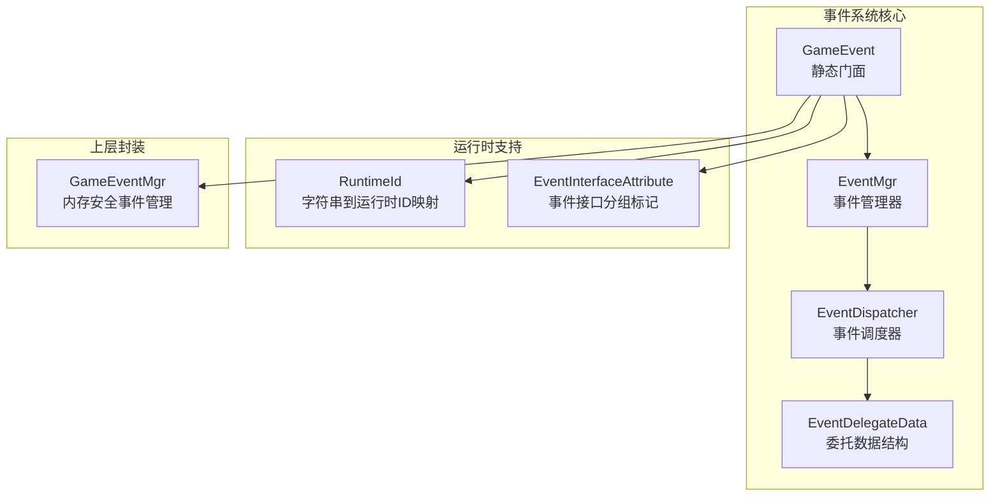
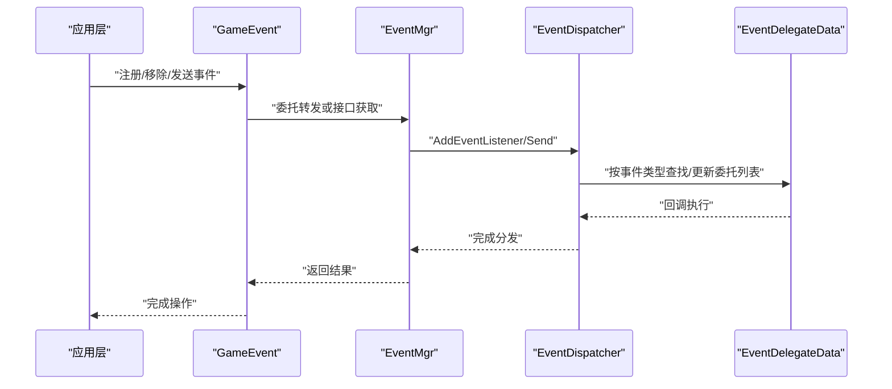
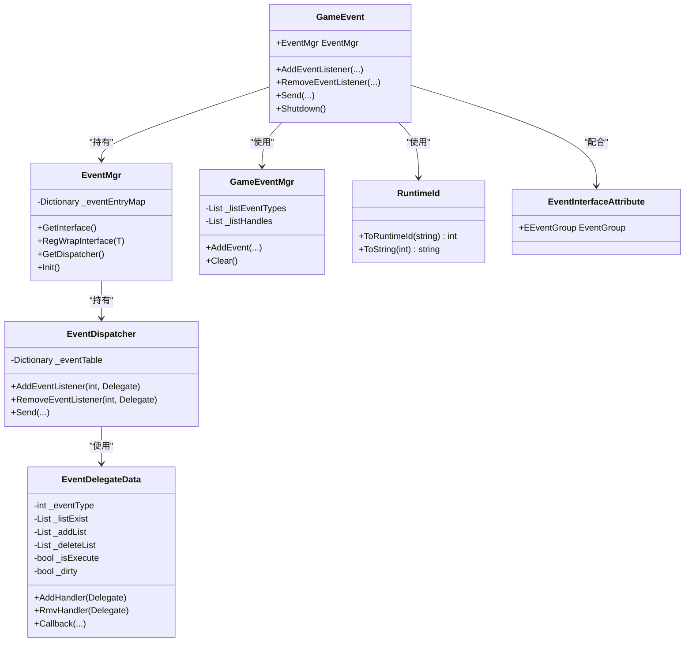
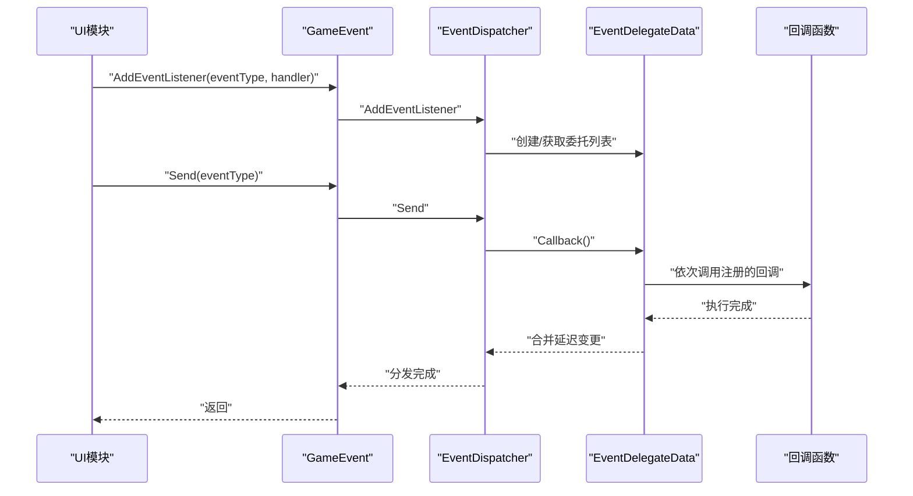

# 事件系统API

<cite>
**本文引用的文件**
- [GameEvent.cs](file://Assets/TEngine/Runtime/Core/GameEvent/GameEvent.cs)
- [EventMgr.cs](file://Assets/TEngine/Runtime/Core/GameEvent/EventMgr.cs)
- [EventDispatcher.cs](file://Assets/TEngine/Runtime/Core/GameEvent/EventDispatcher.cs)
- [EventDelegateData.cs](file://Assets/TEngine/Runtime/Core/GameEvent/EventDelegateData.cs)
- [GameEventMgr.cs](file://Assets/TEngine/Runtime/Core/GameEvent/GameEventMgr.cs)
- [RuntimeId.cs](file://Assets/TEngine/Runtime/Core/GameEvent/RuntimeId.cs)
- [EventInterfaceAttribute.cs](file://Assets/TEngine/Runtime/Core/GameEvent/EventInterfaceAttribute.cs)
- [ILoginUI.cs](file://Assets/GameScripts/HotFix/GameLogic/IEvent/ILoginUI.cs)
- [ProcedurePreload.cs](file://Assets/GameScripts/Procedure/ProcedurePreload.cs)
</cite>

## 目录
1. [简介](#简介)
2. [项目结构](#项目结构)
3. [核心组件](#核心组件)
4. [架构总览](#架构总览)
5. [详细组件分析](#详细组件分析)
6. [依赖关系分析](#依赖关系分析)
7. [性能考量](#性能考量)
8. [故障排查指南](#故障排查指南)
9. [结论](#结论)
10. [附录：完整使用示例与最佳实践](#附录完整使用示例与最佳实践)

## 简介
本文件为 TEngine 事件系统的权威参考文档，覆盖以下主题：
- GameEvent 事件类的 API 定义：事件注册、取消注册、事件触发等核心方法
- EventMgr 事件管理器的 API 接口：事件分发、优先级管理、事件过滤等机制
- EventDispatcher 事件调度器的 API 规范：事件队列管理、异步处理、错误处理等
- EventDelegateData 事件委托数据结构的使用方法
- 全局事件系统的完整使用示例：事件定义、订阅、发布、内存管理等最佳实践

## 项目结构
事件系统位于 TEngine 运行时核心模块中，采用“静态门面 + 管理器 + 调度器 + 数据结构”的分层设计，便于全局访问与高效分发。

**图表来源**
- [GameEvent.cs:1-601](file://Assets/TEngine/Runtime/Core/GameEvent/GameEvent.cs#L1-L601)
- [EventMgr.cs:1-89](file://Assets/TEngine/Runtime/Core/GameEvent/EventMgr.cs#L1-L89)
- [EventDispatcher.cs:1-188](file://Assets/TEngine/Runtime/Core/GameEvent/EventDispatcher.cs#L1-L188)
- [EventDelegateData.cs:1-266](file://Assets/TEngine/Runtime/Core/GameEvent/EventDelegateData.cs#L1-L266)
- [RuntimeId.cs:1-56](file://Assets/TEngine/Runtime/Core/GameEvent/RuntimeId.cs#L1-L56)
- [EventInterfaceAttribute.cs:1-31](file://Assets/TEngine/Runtime/Core/GameEvent/EventInterfaceAttribute.cs#L1-L31)
- [GameEventMgr.cs:1-109](file://Assets/TEngine/Runtime/Core/GameEvent/GameEventMgr.cs#L1-L109)

**章节来源**
- [GameEvent.cs:1-601](file://Assets/TEngine/Runtime/Core/GameEvent/GameEvent.cs#L1-L601)
- [EventMgr.cs:1-89](file://Assets/TEngine/Runtime/Core/GameEvent/EventMgr.cs#L1-L89)
- [EventDispatcher.cs:1-188](file://Assets/TEngine/Runtime/Core/GameEvent/EventDispatcher.cs#L1-L188)
- [EventDelegateData.cs:1-266](file://Assets/TEngine/Runtime/Core/GameEvent/EventDelegateData.cs#L1-L266)
- [RuntimeId.cs:1-56](file://Assets/TEngine/Runtime/Core/GameEvent/RuntimeId.cs#L1-L56)
- [EventInterfaceAttribute.cs:1-31](file://Assets/TEngine/Runtime/Core/GameEvent/EventInterfaceAttribute.cs#L1-L31)
- [GameEventMgr.cs:1-109](file://Assets/TEngine/Runtime/Core/GameEvent/GameEventMgr.cs#L1-L109)

## 核心组件
- GameEvent：全局静态门面，提供统一的事件注册、取消注册与事件触发入口，并支持整数与字符串两类事件标识；内部持有 EventMgr 实例。
- EventMgr：事件管理器，负责事件接口包装（Wrap）注册与获取、事件分发器的持有与初始化清理。
- EventDispatcher：事件调度器，维护事件类型到委托列表的数据表，提供事件注册、移除与分发能力。
- EventDelegateData：事件委托数据结构，内部维护现有委托列表、待添加/删除列表与执行状态，保证在回调过程中修改委托列表的安全性。
- GameEventMgr：面向上层的事件管理器封装，提供带内存管理的事件订阅接口，自动记录订阅关系并在 Clear 时批量取消订阅。
- RuntimeId：运行时 ID 工具，提供字符串到整型运行时 ID 的映射与查询，避免频繁字符串比较带来的开销。
- EventInterfaceAttribute：事件接口分组标记，用于对事件接口进行分组（如 UI、逻辑层），便于管理和组织。

**章节来源**
- [GameEvent.cs:1-601](file://Assets/TEngine/Runtime/Core/GameEvent/GameEvent.cs#L1-L601)
- [EventMgr.cs:1-89](file://Assets/TEngine/Runtime/Core/GameEvent/EventMgr.cs#L1-L89)
- [EventDispatcher.cs:1-188](file://Assets/TEngine/Runtime/Core/GameEvent/EventDispatcher.cs#L1-L188)
- [EventDelegateData.cs:1-266](file://Assets/TEngine/Runtime/Core/GameEvent/EventDelegateData.cs#L1-L266)
- [GameEventMgr.cs:1-109](file://Assets/TEngine/Runtime/Core/GameEvent/GameEventMgr.cs#L1-L109)
- [RuntimeId.cs:1-56](file://Assets/TEngine/Runtime/Core/GameEvent/RuntimeId.cs#L1-L56)
- [EventInterfaceAttribute.cs:1-31](file://Assets/TEngine/Runtime/Core/GameEvent/EventInterfaceAttribute.cs#L1-L31)

## 架构总览
下图展示了从应用层到事件内核的调用路径与职责分工：

**图表来源**
- [GameEvent.cs:1-601](file://Assets/TEngine/Runtime/Core/GameEvent/GameEvent.cs#L1-L601)
- [EventMgr.cs:1-89](file://Assets/TEngine/Runtime/Core/GameEvent/EventMgr.cs#L1-L89)
- [EventDispatcher.cs:1-188](file://Assets/TEngine/Runtime/Core/GameEvent/EventDispatcher.cs#L1-L188)
- [EventDelegateData.cs:1-266](file://Assets/TEngine/Runtime/Core/GameEvent/EventDelegateData.cs#L1-L266)

## 详细组件分析

### GameEvent 事件类 API
- 静态属性 EventMgr：提供全局事件管理器访问。
- 事件注册 API（AddEventListener）
  - 支持整数事件类型与字符串事件类型两种重载
  - 支持 Action 与 Action<TArg1..TArg6> 多参数委托
  - 返回值表示注册是否成功
- 事件移除 API（RemoveEventListener）
  - 同样支持整数与字符串事件类型
  - 支持 Action 与 Action<TArg1..TArg6> 及 Delegate 版本
- 事件触发 API（Send）
  - 支持无参与最多六参的事件触发
  - 同样支持整数与字符串事件类型
- 关闭/清理 API（Shutdown）
  - 调用 EventMgr.Init 清空事件表与接口包装

使用要点
- 字符串事件类型通过 RuntimeId 转换为整数运行时 ID，以提升性能与可维护性
- 所有注册/移除/触发均委托至 EventMgr.Dispatcher

**章节来源**
- [GameEvent.cs:1-601](file://Assets/TEngine/Runtime/Core/GameEvent/GameEvent.cs#L1-L601)
- [RuntimeId.cs:1-56](file://Assets/TEngine/Runtime/Core/GameEvent/RuntimeId.cs#L1-L56)

### EventMgr 事件管理器 API
- 接口包装注册（RegWrapInterface）
  - 泛型版本：RegWrapInterface<T>(T callerWrap)
  - 过时版本（字符串类型名）已标记为不支持
- 接口获取（GetInterface<T>）
  - 通过类型键获取已注册的 Wrap 接口实例
- 分发器访问（GetDispatcher）
  - 返回内部 EventDispatcher 实例
- 初始化/清理（Init）
  - 清空接口包装映射与事件表

使用要点
- 仅保留泛型版本的 RegWrapInterface，避免 GC 与混淆问题
- 通过 EventDispatcher 提供统一的事件分发能力

**章节来源**
- [EventMgr.cs:1-89](file://Assets/TEngine/Runtime/Core/GameEvent/EventMgr.cs#L1-L89)

### EventDispatcher 事件调度器 API
- 事件表（_eventTable）
  - 键为事件类型整数，值为 EventDelegateData
- 事件管理接口
  - AddEventListener：按事件类型添加委托，若不存在则创建 EventDelegateData
  - RemoveEventListener：按事件类型移除委托
- 事件分发接口（Send）
  - 支持无参与最多六参的事件分发
  - 内部根据事件类型查找 EventDelegateData 并触发回调

使用要点
- 事件类型必须为整数（字符串事件类型由 GameEvent 通过 RuntimeId 转换）
- 分发过程直接调用 EventDelegateData 的回调方法

**章节来源**
- [EventDispatcher.cs:1-188](file://Assets/TEngine/Runtime/Core/GameEvent/EventDispatcher.cs#L1-L188)

### EventDelegateData 事件委托数据结构
- 内部字段
  - _eventType：事件类型
  - _listExist：当前存在的委托列表
  - _addList / _deleteList：执行期间的延迟变更队列
  - _isExecute：是否正在执行回调
  - _dirty：是否存在延迟变更
- 核心方法
  - AddHandler：添加委托；若正在执行，则延迟到执行完毕后生效
  - RmvHandler：移除委托；若正在执行，则延迟到执行完毕后生效
  - Callback：遍历当前委托列表并按泛型参数类型调用对应 Action
  - CheckModify：在执行结束后合并延迟变更，清空标记

使用要点
- 在回调执行期间修改委托列表是安全的，不会破坏迭代一致性
- 重复添加同一委托会触发致命日志（建议避免）

**章节来源**
- [EventDelegateData.cs:1-266](file://Assets/TEngine/Runtime/Core/GameEvent/EventDelegateData.cs#L1-L266)

### GameEventMgr 事件管理器（内存安全封装）
- 功能
  - 记录每次订阅的事件类型与委托
  - 提供 AddEvent 多重重载（Action 与 Action<T...>）
  - Clear：自动取消所有已记录的订阅，避免内存泄漏
- 使用场景
  - UI 或模块生命周期管理中的事件订阅与释放

**章节来源**
- [GameEventMgr.cs:1-109](file://Assets/TEngine/Runtime/Core/GameEvent/GameEventMgr.cs#L1-L109)

### RuntimeId 运行时 ID 工具
- 字符串到整数映射
  - ToRuntimeId：首次出现的字符串分配自增整数 ID，并建立双向映射
  - ToString：根据整数 ID 查询原始字符串
- 使用建议
  - 事件常量推荐使用字符串形式定义，运行时转换为整数 ID

**章节来源**
- [RuntimeId.cs:1-56](file://Assets/TEngine/Runtime/Core/GameEvent/RuntimeId.cs#L1-L56)

### EventInterfaceAttribute 事件接口分组
- 枚举 EEventGroup：GroupUI、GroupLogic
- 属性 EventInterfaceAttribute：标注事件接口所属分组
- 使用建议
  - 对事件接口进行分组，便于模块化管理与维护

**章节来源**
- [EventInterfaceAttribute.cs:1-31](file://Assets/TEngine/Runtime/Core/GameEvent/EventInterfaceAttribute.cs#L1-L31)

## 依赖关系分析
事件系统各组件之间的依赖关系如下：

**图表来源**
- [GameEvent.cs:1-601](file://Assets/TEngine/Runtime/Core/GameEvent/GameEvent.cs#L1-L601)
- [EventMgr.cs:1-89](file://Assets/TEngine/Runtime/Core/GameEvent/EventMgr.cs#L1-L89)
- [EventDispatcher.cs:1-188](file://Assets/TEngine/Runtime/Core/GameEvent/EventDispatcher.cs#L1-L188)
- [EventDelegateData.cs:1-266](file://Assets/TEngine/Runtime/Core/GameEvent/EventDelegateData.cs#L1-L266)
- [GameEventMgr.cs:1-109](file://Assets/TEngine/Runtime/Core/GameEvent/GameEventMgr.cs#L1-L109)
- [RuntimeId.cs:1-56](file://Assets/TEngine/Runtime/Core/GameEvent/RuntimeId.cs#L1-L56)
- [EventInterfaceAttribute.cs:1-31](file://Assets/TEngine/Runtime/Core/GameEvent/EventInterfaceAttribute.cs#L1-L31)

**章节来源**
- [GameEvent.cs:1-601](file://Assets/TEngine/Runtime/Core/GameEvent/GameEvent.cs#L1-L601)
- [EventMgr.cs:1-89](file://Assets/TEngine/Runtime/Core/GameEvent/EventMgr.cs#L1-L89)
- [EventDispatcher.cs:1-188](file://Assets/TEngine/Runtime/Core/GameEvent/EventDispatcher.cs#L1-L188)
- [EventDelegateData.cs:1-266](file://Assets/TEngine/Runtime/Core/GameEvent/EventDelegateData.cs#L1-L266)
- [GameEventMgr.cs:1-109](file://Assets/TEngine/Runtime/Core/GameEvent/GameEventMgr.cs#L1-L109)
- [RuntimeId.cs:1-56](file://Assets/TEngine/Runtime/Core/GameEvent/RuntimeId.cs#L1-L56)
- [EventInterfaceAttribute.cs:1-31](file://Assets/TEngine/Runtime/Core/GameEvent/EventInterfaceAttribute.cs#L1-L31)

## 性能考量
- 事件类型使用整数 ID：通过 RuntimeId 将字符串事件名映射为整数，降低字典查找与字符串比较成本
- 回调执行安全：EventDelegateData 在回调执行期间对委托列表的修改采用延迟合并策略，避免迭代过程中的并发修改问题
- 事件表结构：EventDispatcher 使用字典按事件类型快速定位委托集合，分发复杂度近似 O(1)
- 内存管理：GameEventMgr 自动记录订阅关系，Clear 时统一取消订阅，防止模块销毁后的悬挂回调

[本节为通用性能讨论，无需列出具体文件来源]

## 故障排查指南
常见问题与处理建议
- 重复注册同一委托
  - 现象：日志输出重复添加处理器
  - 处理：确保同一委托只注册一次；必要时先 Remove 再 Add
  - 参考实现位置：[EventDelegateData.cs:32-51](file://Assets/TEngine/Runtime/Core/GameEvent/EventDelegateData.cs#L32-L51)
- 移除不存在的委托
  - 现象：日志输出删除失败（未找到）
  - 处理：确认委托是否正确注册；检查事件类型与委托签名一致
  - 参考实现位置：[EventDelegateData.cs:57-71](file://Assets/TEngine/Runtime/Core/GameEvent/EventDelegateData.cs#L57-L71)
- 字符串事件类型未生效
  - 现象：事件未被触发
  - 处理：确保使用字符串事件类型时，GameEvent 的 Send/注册方法与 RuntimeId 转换一致
  - 参考实现位置：[GameEvent.cs:205-371](file://Assets/TEngine/Runtime/Core/GameEvent/GameEvent.cs#L205-L371), [RuntimeId.cs:32-44](file://Assets/TEngine/Runtime/Core/GameEvent/RuntimeId.cs#L32-L44)
- 事件接口包装未获取到实例
  - 现象：GetInterface<T>() 返回默认值
  - 处理：确认已通过 RegWrapInterface<T>(instance) 注册
  - 参考实现位置：[EventMgr.cs:30-57](file://Assets/TEngine/Runtime/Core/GameEvent/EventMgr.cs#L30-L57)

**章节来源**
- [EventDelegateData.cs:1-266](file://Assets/TEngine/Runtime/Core/GameEvent/EventDelegateData.cs#L1-L266)
- [GameEvent.cs:1-601](file://Assets/TEngine/Runtime/Core/GameEvent/GameEvent.cs#L1-L601)
- [EventMgr.cs:1-89](file://Assets/TEngine/Runtime/Core/GameEvent/EventMgr.cs#L1-L89)
- [RuntimeId.cs:1-56](file://Assets/TEngine/Runtime/Core/GameEvent/RuntimeId.cs#L1-L56)

## 结论
TEngine 事件系统通过“静态门面 + 管理器 + 调度器 + 数据结构”的清晰分层，提供了高性能、易用且安全的事件分发能力。结合 RuntimeId 的整数 ID 映射与 GameEventMgr 的内存安全封装，开发者可以以最小成本构建稳定可靠的事件驱动架构。

[本节为总结性内容，无需列出具体文件来源]

## 附录：完整使用示例与最佳实践

### 示例一：定义事件接口与分组
- 定义事件接口并标注分组
  - 示例文件：[ILoginUI.cs:1-12](file://Assets/GameScripts/HotFix/GameLogic/IEvent/ILoginUI.cs#L1-L12)
  - 标注：[EventInterfaceAttribute.cs:21-31](file://Assets/TEngine/Runtime/Core/GameEvent/EventInterfaceAttribute.cs#L21-L31)

最佳实践
- 将 UI 相关事件接口标记为 GroupUI，逻辑层事件接口标记为 GroupLogic
- 接口方法尽量简洁，避免跨模块耦合

**章节来源**
- [ILoginUI.cs:1-12](file://Assets/GameScripts/HotFix/GameLogic/IEvent/ILoginUI.cs#L1-L12)
- [EventInterfaceAttribute.cs:1-31](file://Assets/TEngine/Runtime/Core/GameEvent/EventInterfaceAttribute.cs#L1-L31)

### 示例二：事件常量与运行时 ID
- 使用字符串事件常量并通过 RuntimeId 转换
  - 参考：[RuntimeId.cs:32-44](file://Assets/TEngine/Runtime/Core/GameEvent/RuntimeId.cs#L32-L44)

最佳实践
- 事件常量统一使用字符串命名，便于维护与调试
- 在启动阶段集中注册事件接口包装（RegWrapInterface<T>）

**章节来源**
- [RuntimeId.cs:1-56](file://Assets/TEngine/Runtime/Core/GameEvent/RuntimeId.cs#L1-L56)
- [EventMgr.cs:47-57](file://Assets/TEngine/Runtime/Core/GameEvent/EventMgr.cs#L47-L57)

### 示例三：订阅与发布事件
- 订阅事件（整数事件类型）
  - 方法：GameEvent.AddEventListener(eventType, handler)
  - 参考：[GameEvent.cs:28-120](file://Assets/TEngine/Runtime/Core/GameEvent/GameEvent.cs#L28-L120)
- 发布事件（字符串事件类型）
  - 方法：GameEvent.Send("事件名")
  - 参考：[ProcedurePreload.cs:48-49](file://Assets/GameScripts/Procedure/ProcedurePreload.cs#L48-L49), [GameEvent.cs:480-589](file://Assets/TEngine/Runtime/Core/GameEvent/GameEvent.cs#L480-L589)

最佳实践
- 优先使用整数事件类型进行高频事件分发
- 字符串事件类型适合配置或调试场景

**章节来源**
- [GameEvent.cs:1-601](file://Assets/TEngine/Runtime/Core/GameEvent/GameEvent.cs#L1-L601)
- [ProcedurePreload.cs:1-175](file://Assets/GameScripts/Procedure/ProcedurePreload.cs#L1-L175)

### 示例四：内存安全的事件管理
- 使用 GameEventMgr 记录订阅并统一清理
  - 订阅：AddEvent(eventType, handler)
  - 清理：Clear（自动取消所有订阅）
  - 参考：[GameEventMgr.cs:59-107](file://Assets/TEngine/Runtime/Core/GameEvent/GameEventMgr.cs#L59-L107), [GameEventMgr.cs:33-49](file://Assets/TEngine/Runtime/Core/GameEvent/GameEventMgr.cs#L33-L49)

最佳实践
- 在模块或 UI 生命周期结束时调用 Clear，避免内存泄漏
- 避免在回调中直接持有长生命周期对象导致的循环引用

**章节来源**
- [GameEventMgr.cs:1-109](file://Assets/TEngine/Runtime/Core/GameEvent/GameEventMgr.cs#L1-L109)

### 示例五：事件分发流程（序列图）

**图表来源**
- [GameEvent.cs:1-601](file://Assets/TEngine/Runtime/Core/GameEvent/GameEvent.cs#L1-L601)
- [EventDispatcher.cs:1-188](file://Assets/TEngine/Runtime/Core/GameEvent/EventDispatcher.cs#L1-L188)
- [EventDelegateData.cs:1-266](file://Assets/TEngine/Runtime/Core/GameEvent/EventDelegateData.cs#L1-L266)