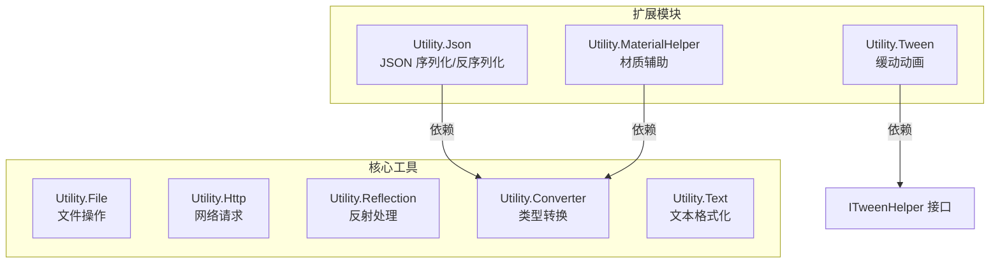
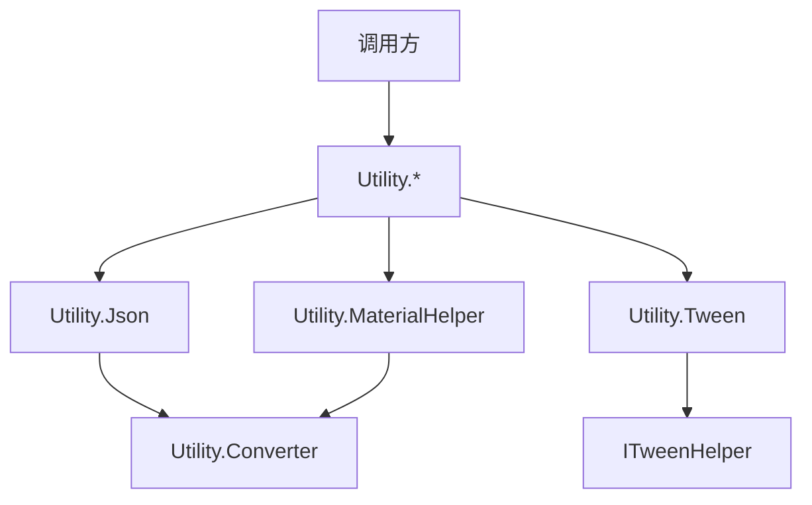
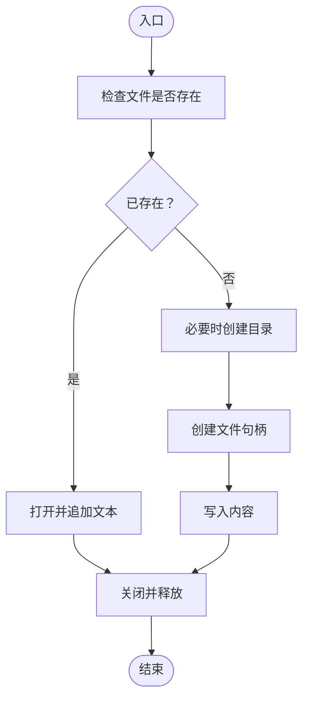
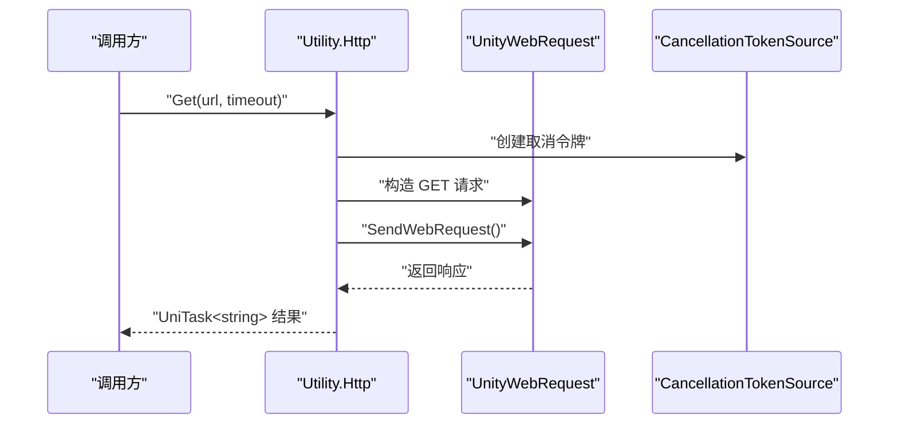
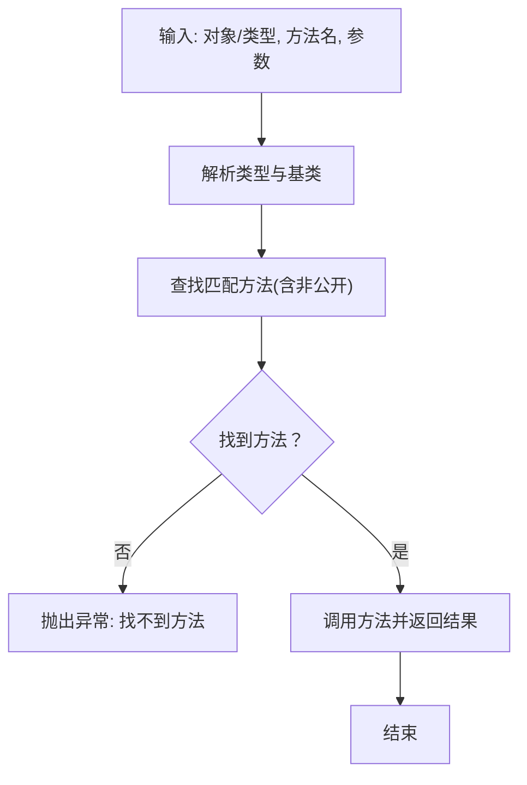
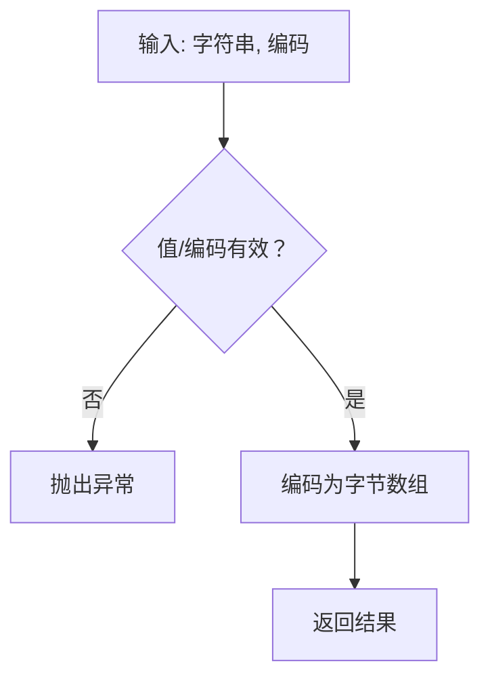
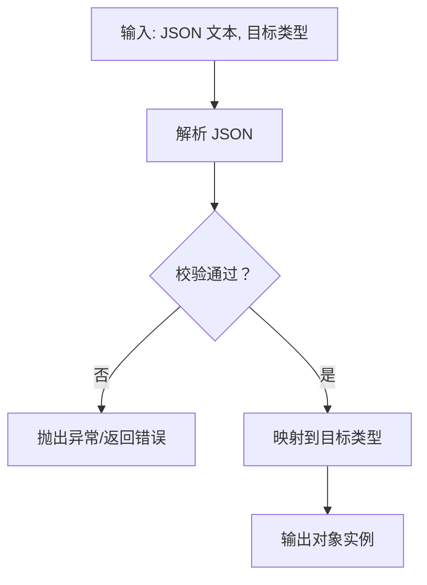
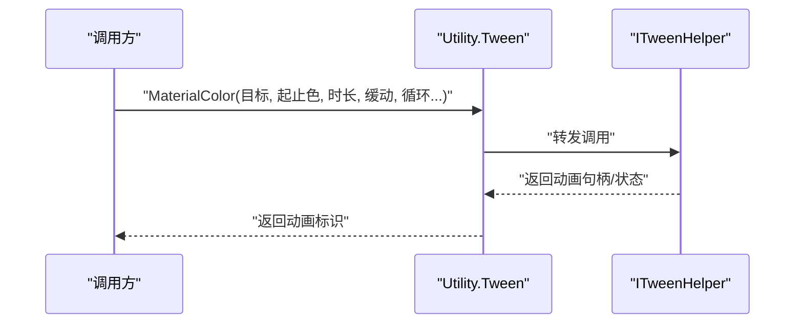
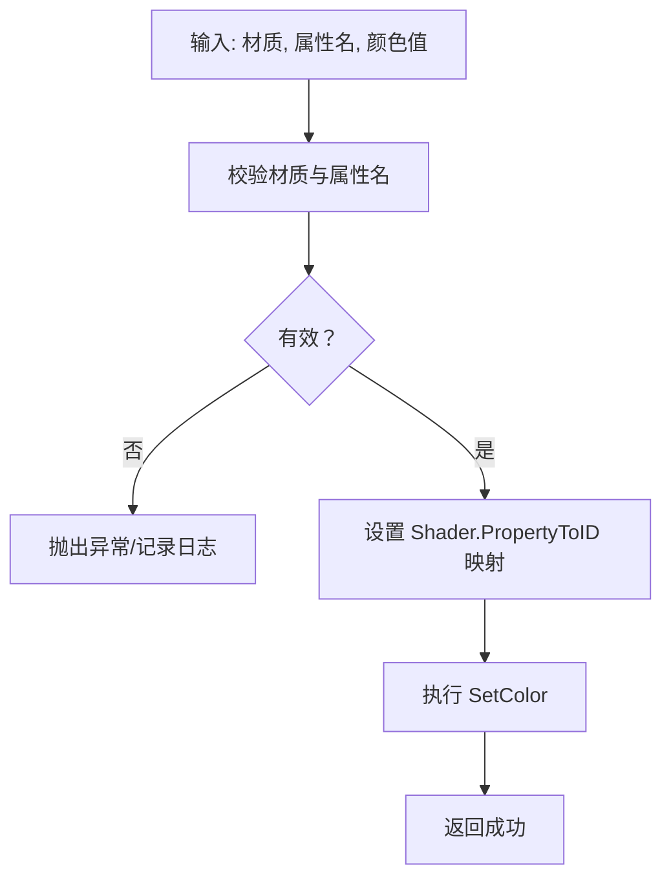
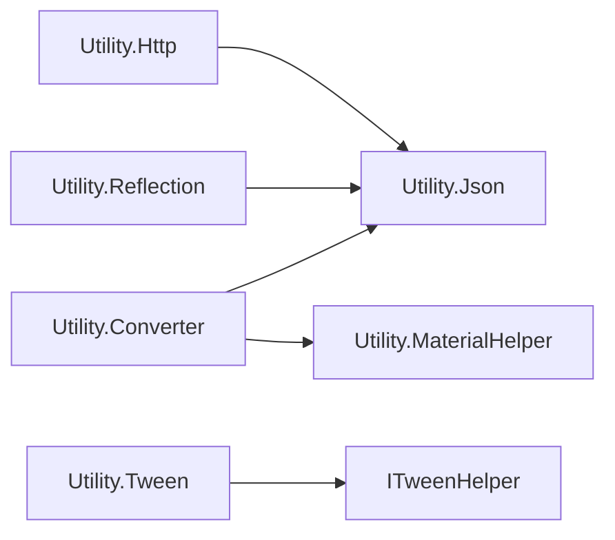

# 工具与扩展API

<cite>
**本文引用的文件**
- [Utility.cs](file://Assets/TEngine/Runtime/Core/Utility/Utility.cs)
- [Utility.File.cs](file://Assets/TEngine/Runtime/Core/Utility/Utility.File.cs)
- [Utility.Reflection.cs](file://Assets/TEngine/Runtime/Core/Utility/Utility.Reflection.cs)
- [Utility.Converter.cs](file://Assets/TEngine/Runtime/Core/Utility/Utility.Converter.cs)
- [Utility.Http.cs](file://Assets/TEngine/Runtime/Core/Utility/Utility.Http.cs)
- [Utility.Json.cs](file://Assets/TEngine/Runtime/Extension/Json/Utility.Json.cs)
- [Utility.Json.IJsonHelper.cs](file://Assets/TEngine/Runtime/Extension/Json/Utility.Json.IJsonHelper.cs)
- [Utility.Tween.cs](file://Assets/TEngine/Runtime/Extension/Tween/Utility.Tween.cs)
- [ITweenHelper.cs](file://Assets/TEngine/Runtime/Extension/Tween/ITweenHelper.cs)
- [Utility.MaterialHelper.cs](file://Assets/TEngine/Runtime/Extension/Material/Utility.MaterialHelper.cs)
</cite>

## 目录
1. [简介](#简介)
2. [项目结构](#项目结构)
3. [核心组件](#核心组件)
4. [架构总览](#架构总览)
5. [详细组件分析](#详细组件分析)
6. [依赖分析](#依赖分析)
7. [性能考虑](#性能考虑)
8. [故障排查指南](#故障排查指南)
9. [结论](#结论)
10. [附录](#附录)

## 简介
本文件为 TEngine 工具与扩展 API 的权威参考文档，覆盖以下主题：
- Utility 通用工具类：文件操作、网络请求、反射处理、类型转换等常用能力
- Utility.Json JSON 扩展：序列化/反序列化、数据校验、性能优化
- Utility.Tween 缓动扩展：缓动函数、动画控制、回调处理
- Utility.MaterialHelper 材质扩展：材质创建、参数设置、效果应用
- 提供 API 规范、调用流程图、错误处理与性能优化建议

## 项目结构
TEngine 将工具与扩展按“核心工具”和“扩展模块”分层组织：
- 核心工具位于 Runtime/Core/Utility 下，提供基础能力（文件、网络、反射、转换、文本等）
- 扩展模块位于 Runtime/Extension 下，包含 Json、Tween、Material 等高级能力

图表来源
- [Utility.File.cs:27-253](file://Assets/TEngine/Runtime/Core/Utility/Utility.File.cs#L27-L253)
- [Utility.Http.cs:17-268](file://Assets/TEngine/Runtime/Core/Utility/Utility.Http.cs#L17-L268)
- [Utility.Reflection.cs:13-356](file://Assets/TEngine/Runtime/Core/Utility/Utility.Reflection.cs#L13-L356)
- [Utility.Converter.cs:11-800](file://Assets/TEngine/Runtime/Core/Utility/Utility.Converter.cs#L11-L800)
- [Utility.Json.cs:4-200](file://Assets/TEngine/Runtime/Extension/Json/Utility.Json.cs#L4-L200)
- [Utility.Tween.cs:4-505](file://Assets/TEngine/Runtime/Extension/Tween/Utility.Tween.cs#L4-L505)
- [ITweenHelper.cs:71-200](file://Assets/TEngine/Runtime/Extension/Tween/ITweenHelper.cs#L71-L200)
- [Utility.MaterialHelper.cs:6-200](file://Assets/TEngine/Runtime/Extension/Material/Utility.MaterialHelper.cs#L6-L200)

章节来源
- [Utility.cs:1-9](file://Assets/TEngine/Runtime/Core/Utility/Utility.cs#L1-L9)

## 核心组件
本节概述 Utility 的主要子模块及其职责。

- 文件操作（Utility.File）
  - 创建文件、写入文本、计算 MD5、格式化路径、获取文件长度、单位换算等
- 网络请求（Utility.Http）
  - 异步 GET/POST、取消与超时、下载文件、获取纹理/音频、上传二进制
- 反射处理（Utility.Reflection）
  - 动态调用方法、设置/获取属性与字段、枚举成员名与类型映射
- 类型转换（Utility.Converter）
  - 屏幕 DPI 单位换算、布尔/字符/整数/浮点/字符串与字节数组互转
- 文本格式化（Utility.Text）
  - 参数化格式化、单位显示等（在 Core/Utility 下）

章节来源
- [Utility.File.cs:27-253](file://Assets/TEngine/Runtime/Core/Utility/Utility.File.cs#L27-L253)
- [Utility.Http.cs:17-268](file://Assets/TEngine/Runtime/Core/Utility/Utility.Http.cs#L17-L268)
- [Utility.Reflection.cs:13-356](file://Assets/TEngine/Runtime/Core/Utility/Utility.Reflection.cs#L13-L356)
- [Utility.Converter.cs:11-800](file://Assets/TEngine/Runtime/Core/Utility/Utility.Converter.cs#L11-L800)

## 架构总览
下图展示 Utility 与扩展模块之间的依赖关系与交互方式。

图表来源
- [Utility.Json.cs:4-200](file://Assets/TEngine/Runtime/Extension/Json/Utility.Json.cs#L4-L200)
- [Utility.Tween.cs:4-505](file://Assets/TEngine/Runtime/Extension/Tween/Utility.Tween.cs#L4-L505)
- [ITweenHelper.cs:71-200](file://Assets/TEngine/Runtime/Extension/Tween/ITweenHelper.cs#L71-L200)
- [Utility.MaterialHelper.cs:6-200](file://Assets/TEngine/Runtime/Extension/Material/Utility.MaterialHelper.cs#L6-L200)
- [Utility.Converter.cs:11-800](file://Assets/TEngine/Runtime/Core/Utility/Utility.Converter.cs#L11-L800)

## 详细组件分析

### Utility.File 文件操作
- 主要能力
  - 创建文件与目录、写入文本、追加文本
  - 平台路径拼接与沙盒路径获取
  - MD5 计算、字节大小格式化、UTF-8 BOM 处理
  - 获取文件长度、数据量单位换算
- 关键流程（创建并写入文件）

图表来源
- [Utility.File.cs:35-103](file://Assets/TEngine/Runtime/Core/Utility/Utility.File.cs#L35-L103)

章节来源
- [Utility.File.cs:27-253](file://Assets/TEngine/Runtime/Core/Utility/Utility.File.cs#L27-L253)

### Utility.Http 网络请求
- 主要能力
  - 异步 GET/POST（支持多种负载）、超时与取消
  - 下载文件、获取纹理/音频、二进制 PUT 上传
  - 回调式协程封装（兼容旧版）
- 请求序列（异步 GET）

图表来源
- [Utility.Http.cs:25-117](file://Assets/TEngine/Runtime/Core/Utility/Utility.Http.cs#L25-L117)

章节来源
- [Utility.Http.cs:17-268](file://Assets/TEngine/Runtime/Core/Utility/Utility.Http.cs#L17-L268)

### Utility.Reflection 反射处理
- 主要能力
  - 动态调用方法（支持实例与静态）
  - 设置/获取属性值（含非公开成员）
  - 设置/获取字段值（含非公开成员）
  - 获取类型的所有字段/属性名及类型映射
- 方法调用流程（InvokeMethod）

图表来源
- [Utility.Reflection.cs:22-83](file://Assets/TEngine/Runtime/Core/Utility/Utility.Reflection.cs#L22-L83)

章节来源
- [Utility.Reflection.cs:13-356](file://Assets/TEngine/Runtime/Core/Utility/Utility.Reflection.cs#L13-L356)

### Utility.Converter 类型转换
- 主要能力
  - 屏幕 DPI 单位换算（像素↔厘米/英寸）
  - 布尔/字符/整数/浮点/字符串与字节数组互转
  - 安全边界检查与异常提示
- 转换流程（字符串→字节数组）

图表来源
- [Utility.Converter.cs:718-766](file://Assets/TEngine/Runtime/Core/Utility/Utility.Converter.cs#L718-L766)

章节来源
- [Utility.Converter.cs:11-800](file://Assets/TEngine/Runtime/Core/Utility/Utility.Converter.cs#L11-L800)

### Utility.Json JSON 扩展
- 组件定位
  - 在扩展层提供 JSON 序列化/反序列化能力，内部可复用 Converter 进行类型转换
- API 范畴
  - 序列化/反序列化：将对象与 JSON 文本互转
  - 数据验证：对输入 JSON 进行合法性校验
  - 性能优化：批量处理、避免重复分配、缓存常用配置
- 典型流程（反序列化）

图表来源
- [Utility.Json.cs:4-200](file://Assets/TEngine/Runtime/Extension/Json/Utility.Json.cs#L4-L200)
- [Utility.Json.IJsonHelper.cs:4-200](file://Assets/TEngine/Runtime/Extension/Json/Utility.Json.IJsonHelper.cs#L4-L200)

章节来源
- [Utility.Json.cs:4-200](file://Assets/TEngine/Runtime/Extension/Json/Utility.Json.cs#L4-L200)
- [Utility.Json.IJsonHelper.cs:4-200](file://Assets/TEngine/Runtime/Extension/Json/Utility.Json.IJsonHelper.cs#L4-L200)

### Utility.Tween 缓动扩展
- 组件定位
  - 提供统一的缓动 API，委托给 ITweenHelper 实现具体缓动逻辑
- API 范畴
  - 缓动函数：Ease 列表与自定义曲线
  - 动画控制：时长、循环次数、循环模式、延迟
  - 回调处理：开始/更新/完成/取消回调
- 调用序列（颜色缓动）

图表来源
- [Utility.Tween.cs:489-498](file://Assets/TEngine/Runtime/Extension/Tween/Utility.Tween.cs#L489-L498)
- [ITweenHelper.cs:71-200](file://Assets/TEngine/Runtime/Extension/Tween/ITweenHelper.cs#L71-L200)

章节来源
- [Utility.Tween.cs:4-505](file://Assets/TEngine/Runtime/Extension/Tween/Utility.Tween.cs#L4-L505)
- [ITweenHelper.cs:71-200](file://Assets/TEngine/Runtime/Extension/Tween/ITweenHelper.cs#L71-L200)

### Utility.MaterialHelper 材质扩展
- 组件定位
  - 面向材质的便捷 API，常与 Converter 等工具协作
- API 范畴
  - 材质创建与克隆
  - 参数设置：着色器属性名映射、纹理/颜色/浮点值
  - 效果应用：统一管线/URP/HDRP 兼容性处理
- 典型流程（设置颜色参数）

图表来源
- [Utility.MaterialHelper.cs:6-200](file://Assets/TEngine/Runtime/Extension/Material/Utility.MaterialHelper.cs#L6-L200)

章节来源
- [Utility.MaterialHelper.cs:6-200](file://Assets/TEngine/Runtime/Extension/Material/Utility.MaterialHelper.cs#L6-L200)

## 依赖分析
- 模块内聚与耦合
  - Utility.* 作为底层工具，被扩展模块广泛依赖
  - 扩展模块之间保持低耦合，通过公共接口（如 ITweenHelper）解耦
- 外部依赖
  - UnityWebRequest、Cysharp.Threading.Tasks、Unity 游戏框架组件
- 潜在风险
  - 反射路径性能较低，应限制动态调用频率
  - 网络请求需严格处理超时与取消，避免协程泄漏

图表来源
- [Utility.Converter.cs:11-800](file://Assets/TEngine/Runtime/Core/Utility/Utility.Converter.cs#L11-L800)
- [Utility.Json.cs:4-200](file://Assets/TEngine/Runtime/Extension/Json/Utility.Json.cs#L4-L200)
- [Utility.MaterialHelper.cs:6-200](file://Assets/TEngine/Runtime/Extension/Material/Utility.MaterialHelper.cs#L6-L200)
- [Utility.Tween.cs:4-505](file://Assets/TEngine/Runtime/Extension/Tween/Utility.Tween.cs#L4-L505)
- [ITweenHelper.cs:71-200](file://Assets/TEngine/Runtime/Extension/Tween/ITweenHelper.cs#L71-L200)

## 性能考虑
- 文件与网络
  - 批量写入优于频繁小写入；网络请求使用超时与取消令牌避免阻塞
- 反射
  - 避免在热路径频繁调用；可缓存 MethodInfo/PropertyInfo
- 类型转换
  - 字节数组与字符串互转尽量复用缓冲区，减少 GC 分配
- JSON
  - 使用流式解析/序列化，避免大对象一次性反序列化
- 缓动
  - 合理设置缓动函数与循环次数；避免同时驱动大量对象
- 材质
  - 统一管理 Shader.PropertyToID，减少字符串查找开销

## 故障排查指南
- 文件操作
  - 目录不存在：启用自动创建或提前预检
  - 权限问题：检查持久化路径与平台差异
- 网络请求
  - 超时/取消：确认 CancellationTokenSource 生命周期
  - 失败重试：区分网络错误与业务错误
- 反射
  - 找不到成员：核对绑定标志位与成员可见性
  - 参数不匹配：确保参数类型与数量一致
- 类型转换
  - 边界检查：索引越界与缓冲区长度不足
  - 编码异常：明确输入编码与 BOM 处理
- JSON
  - 解析失败：先校验 JSON 结构与字符集
  - 性能瓶颈：排查大对象与嵌套层级
- 缓动
  - ITweenHelper 为空：初始化阶段确保注入
  - 回调未触发：检查生命周期与挂载对象
- 材质
  - 属性名错误：核对 Shader 属性名与类型
  - 纹理丢失：检查资源加载与打包

章节来源
- [Utility.File.cs:35-103](file://Assets/TEngine/Runtime/Core/Utility/Utility.File.cs#L35-L103)
- [Utility.Http.cs:92-117](file://Assets/TEngine/Runtime/Core/Utility/Utility.Http.cs#L92-L117)
- [Utility.Reflection.cs:22-83](file://Assets/TEngine/Runtime/Core/Utility/Utility.Reflection.cs#L22-L83)
- [Utility.Converter.cs:718-766](file://Assets/TEngine/Runtime/Core/Utility/Utility.Converter.cs#L718-L766)
- [Utility.Json.cs:4-200](file://Assets/TEngine/Runtime/Extension/Json/Utility.Json.cs#L4-L200)
- [Utility.Tween.cs:489-498](file://Assets/TEngine/Runtime/Extension/Tween/Utility.Tween.cs#L489-L498)
- [ITweenHelper.cs:71-200](file://Assets/TEngine/Runtime/Extension/Tween/ITweenHelper.cs#L71-L200)
- [Utility.MaterialHelper.cs:6-200](file://Assets/TEngine/Runtime/Extension/Material/Utility.MaterialHelper.cs#L6-L200)

## 结论
TEngine 的工具与扩展 API 形成了从底层工具到高层功能的清晰分层。通过统一的 Utility.* 与扩展模块，开发者可以快速实现文件/网络/反射/转换等基础能力，并在此基础上构建 JSON、缓动与材质等高级特性。建议在实际工程中遵循本文的性能与排错建议，以获得稳定高效的运行表现。

## 附录
- 使用示例（路径指引）
  - 文件写入：[Utility.File.cs:69-103](file://Assets/TEngine/Runtime/Core/Utility/Utility.File.cs#L69-L103)
  - 网络 GET：[Utility.Http.cs:25-32](file://Assets/TEngine/Runtime/Core/Utility/Utility.Http.cs#L25-L32)
  - 反射调用：[Utility.Reflection.cs:59-83](file://Assets/TEngine/Runtime/Core/Utility/Utility.Reflection.cs#L59-L83)
  - 类型转换：[Utility.Converter.cs:718-766](file://Assets/TEngine/Runtime/Core/Utility/Utility.Converter.cs#L718-L766)
  - JSON 反序列化：[Utility.Json.cs:4-200](file://Assets/TEngine/Runtime/Extension/Json/Utility.Json.cs#L4-L200)
  - 缓动动画：[Utility.Tween.cs:489-498](file://Assets/TEngine/Runtime/Extension/Tween/Utility.Tween.cs#L489-L498)
  - 材质参数设置：[Utility.MaterialHelper.cs:6-200](file://Assets/TEngine/Runtime/Extension/Material/Utility.MaterialHelper.cs#L6-L200)