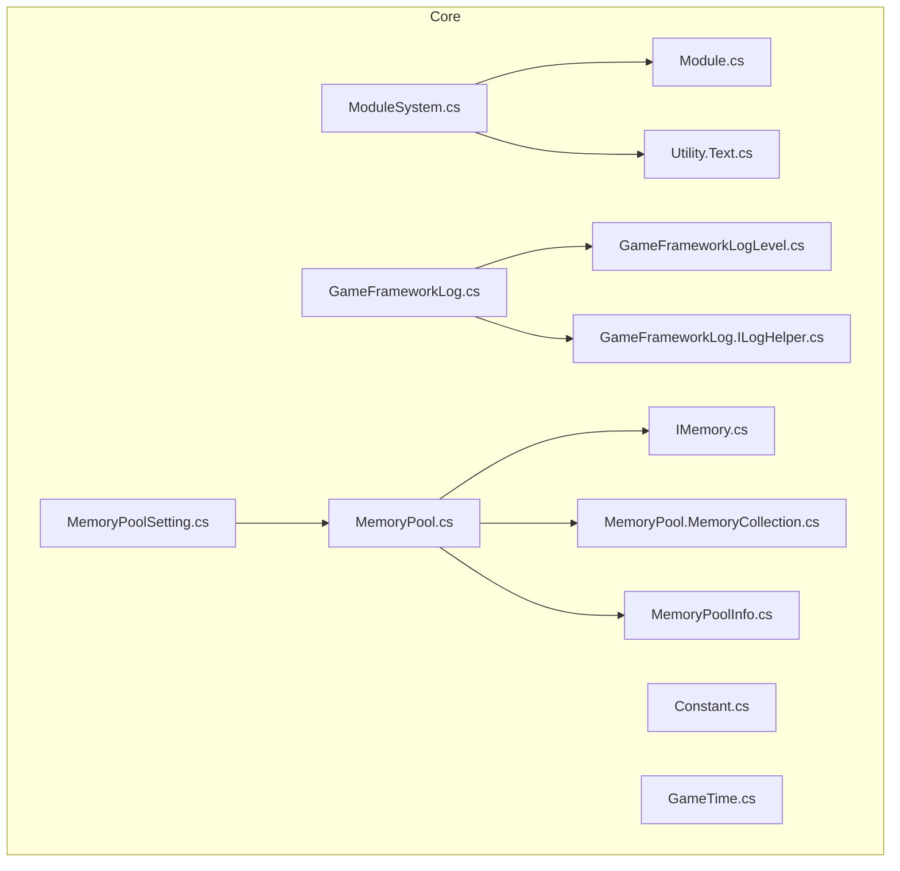
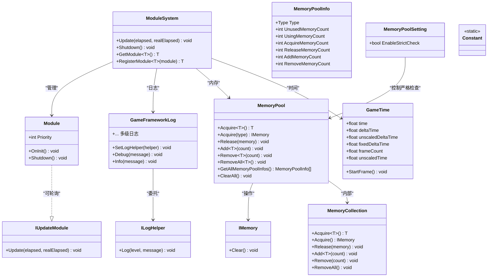
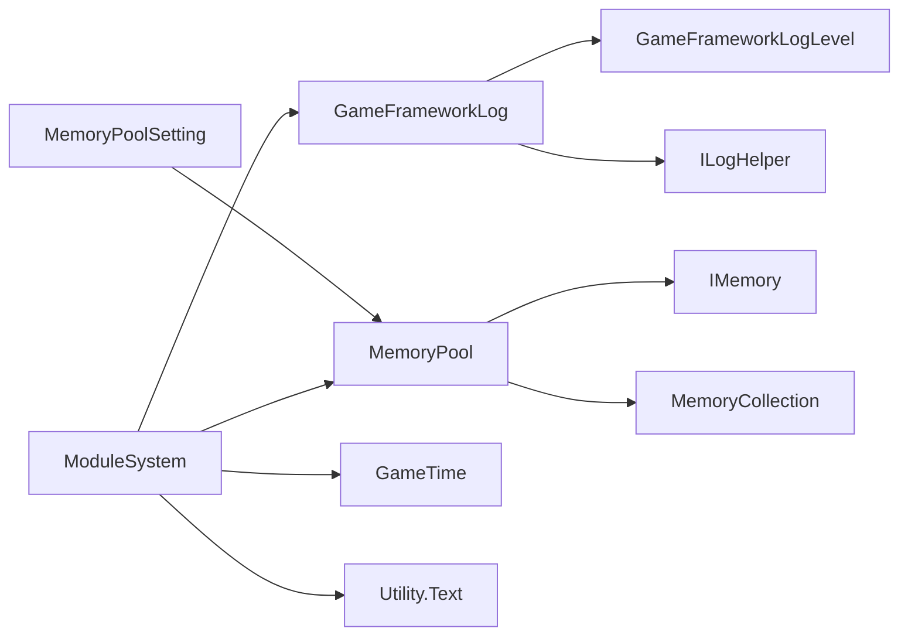

# 核心API

<cite>
**本文引用的文件**
- [ModuleSystem.cs](file://Assets/TEngine/Runtime/Core/ModuleSystem.cs)
- [Module.cs](file://Assets/TEngine/Runtime/Core/Module.cs)
- [Constant.cs](file://Assets/TEngine/Runtime/Core/Constant/Constant.cs)
- [GameTime.cs](file://Assets/TEngine/Runtime/Core/GameTime/GameTime.cs)
- [GameFrameworkLog.cs](file://Assets/TEngine/Runtime/Core/Log/GameFrameworkLog.cs)
- [GameFrameworkLogLevel.cs](file://Assets/TEngine/Runtime/Core/Log/GameFrameworkLogLevel.cs)
- [GameFrameworkLog.ILogHelper.cs](file://Assets/TEngine/Runtime/Core/Log/GameFrameworkLog.ILogHelper.cs)
- [MemoryPool.cs](file://Assets/TEngine/Runtime/Core/MemoryPool/MemoryPool.cs)
- [IMemory.cs](file://Assets/TEngine/Runtime/Core/MemoryPool/IMemory.cs)
- [MemoryPool.MemoryCollection.cs](file://Assets/TEngine/Runtime/Core/MemoryPool/MemoryPool.MemoryCollection.cs)
- [MemoryPoolInfo.cs](file://Assets/TEngine/Runtime/Core/MemoryPool/MemoryPoolInfo.cs)
- [MemoryPoolSetting.cs](file://Assets/TEngine/Runtime/Core/MemoryPool/MemoryPoolSetting.cs)
- [Utility.Text.cs](file://Assets/TEngine/Runtime/Core/Utility/Utility.Text.cs)
</cite>

## 目录
1. [简介](#简介)
2. [项目结构](#项目结构)
3. [核心组件](#核心组件)
4. [架构总览](#架构总览)
5. [详细组件分析](#详细组件分析)
6. [依赖关系分析](#依赖关系分析)
7. [性能考量](#性能考量)
8. [故障排查指南](#故障排查指南)
9. [结论](#结论)
10. [附录](#附录)

## 简介
本文件为 TEngine 核心API的权威参考文档，聚焦以下关键子系统与API：
- 模块系统：ModuleSystem 类、Module 抽象类与 IUpdateModule 接口，涵盖模块注册、生命周期与调度。
- 常量定义：Constant 常量集合，集中管理配置键名。
- 时间管理：GameTime 提供帧时间采样与访问。
- 日志系统：GameFrameworkLog 静态日志门面与日志等级、辅助器接口。
- 内存池：MemoryPool 静态内存池门面、IMemory 接口、MemoryCollection 收集器与 MemoryPoolInfo 统计信息。

文档对每个API提供参数说明、返回值描述、使用示例路径、注意事项、版本兼容性提示与性能特性说明，帮助开发者正确集成与优化。

## 项目结构
TEngine 核心API位于运行时目录下，采用“按功能域分层”的组织方式：
- Core 层：模块系统、常量、时间、日志、内存池、工具库等基础能力。
- Module 子目录：各业务模块（如音频、资源、场景等）的接口与实现模板。

**图示来源**
- [ModuleSystem.cs:1-208](file://Assets/TEngine/Runtime/Core/ModuleSystem.cs#L1-L208)
- [Module.cs:1-40](file://Assets/TEngine/Runtime/Core/Module.cs#L1-L40)
- [Constant.cs:1-21](file://Assets/TEngine/Runtime/Core/Constant/Constant.cs#L1-L21)
- [GameTime.cs:1-55](file://Assets/TEngine/Runtime/Core/GameTime/GameTime.cs#L1-L55)
- [GameFrameworkLog.cs:1-800](file://Assets/TEngine/Runtime/Core/Log/GameFrameworkLog.cs#L1-L800)
- [GameFrameworkLogLevel.cs:1-34](file://Assets/TEngine/Runtime/Core/Log/GameFrameworkLogLevel.cs#L1-L34)
- [GameFrameworkLog.ILogHelper.cs:1-19](file://Assets/TEngine/Runtime/Core/Log/GameFrameworkLog.ILogHelper.cs#L1-L19)
- [MemoryPool.cs:1-208](file://Assets/TEngine/Runtime/Core/MemoryPool/MemoryPool.cs#L1-L208)
- [IMemory.cs:1-14](file://Assets/TEngine/Runtime/Core/MemoryPool/IMemory.cs#L1-L14)
- [MemoryPool.MemoryCollection.cs:1-157](file://Assets/TEngine/Runtime/Core/MemoryPool/MemoryPool.MemoryCollection.cs#L1-L157)
- [MemoryPoolInfo.cs:1-119](file://Assets/TEngine/Runtime/Core/MemoryPool/MemoryPoolInfo.cs#L1-L119)
- [MemoryPoolSetting.cs:1-80](file://Assets/TEngine/Runtime/Core/MemoryPool/MemoryPoolSetting.cs#L1-L80)
- [Utility.Text.cs:1-615](file://Assets/TEngine/Runtime/Core/Utility/Utility.Text.cs#L1-L615)

**章节来源**
- [ModuleSystem.cs:1-208](file://Assets/TEngine/Runtime/Core/ModuleSystem.cs#L1-L208)
- [Module.cs:1-40](file://Assets/TEngine/Runtime/Core/Module.cs#L1-L40)
- [Constant.cs:1-21](file://Assets/TEngine/Runtime/Core/Constant/Constant.cs#L1-L21)
- [GameTime.cs:1-55](file://Assets/TEngine/Runtime/Core/GameTime/GameTime.cs#L1-L55)
- [GameFrameworkLog.cs:1-800](file://Assets/TEngine/Runtime/Core/Log/GameFrameworkLog.cs#L1-L800)
- [GameFrameworkLogLevel.cs:1-34](file://Assets/TEngine/Runtime/Core/Log/GameFrameworkLogLevel.cs#L1-L34)
- [GameFrameworkLog.ILogHelper.cs:1-19](file://Assets/TEngine/Runtime/Core/Log/GameFrameworkLog.ILogHelper.cs#L1-L19)
- [MemoryPool.cs:1-208](file://Assets/TEngine/Runtime/Core/MemoryPool/MemoryPool.cs#L1-L208)
- [IMemory.cs:1-14](file://Assets/TEngine/Runtime/Core/MemoryPool/IMemory.cs#L1-L14)
- [MemoryPool.MemoryCollection.cs:1-157](file://Assets/TEngine/Runtime/Core/MemoryPool/MemoryPool.MemoryCollection.cs#L1-L157)
- [MemoryPoolInfo.cs:1-119](file://Assets/TEngine/Runtime/Core/MemoryPool/MemoryPoolInfo.cs#L1-L119)
- [MemoryPoolSetting.cs:1-80](file://Assets/TEngine/Runtime/Core/MemoryPool/MemoryPoolSetting.cs#L1-L80)
- [Utility.Text.cs:1-615](file://Assets/TEngine/Runtime/Core/Utility/Utility.Text.cs#L1-L615)

## 核心组件
- 模块系统
  - ModuleSystem：静态模块管理器，负责模块注册、优先级排序、统一更新与关闭。
  - Module/IUpdateModule：模块抽象与轮询接口，定义优先级、初始化与关闭。
- 常量定义
  - Constant.Setting：集中管理语言、音量、静音等配置键名。
- 时间管理
  - GameTime：封装Unity Time系列数据，提供每帧采样入口。
- 日志系统
  - GameFrameworkLog：静态日志门面，支持多级日志输出与可插拔日志辅助器。
  - GameFrameworkLogLevel：日志等级枚举。
  - ILogHelper：日志辅助器接口。
- 内存池
  - MemoryPool：静态门面，提供获取、归还、批量增删与统计查询。
  - IMemory：内存对象必须实现的清理接口。
  - MemoryCollection：按类型维护的内存对象队列与统计。
  - MemoryPoolInfo：内存池统计信息结构体。
  - MemoryPoolSetting：内存池严格检查策略配置组件。

**章节来源**
- [ModuleSystem.cs:1-208](file://Assets/TEngine/Runtime/Core/ModuleSystem.cs#L1-L208)
- [Module.cs:1-40](file://Assets/TEngine/Runtime/Core/Module.cs#L1-L40)
- [Constant.cs:1-21](file://Assets/TEngine/Runtime/Core/Constant/Constant.cs#L1-L21)
- [GameTime.cs:1-55](file://Assets/TEngine/Runtime/Core/GameTime/GameTime.cs#L1-L55)
- [GameFrameworkLog.cs:1-800](file://Assets/TEngine/Runtime/Core/Log/GameFrameworkLog.cs#L1-L800)
- [GameFrameworkLogLevel.cs:1-34](file://Assets/TEngine/Runtime/Core/Log/GameFrameworkLogLevel.cs#L1-L34)
- [GameFrameworkLog.ILogHelper.cs:1-19](file://Assets/TEngine/Runtime/Core/Log/GameFrameworkLog.ILogHelper.cs#L1-L19)
- [MemoryPool.cs:1-208](file://Assets/TEngine/Runtime/Core/MemoryPool/MemoryPool.cs#L1-L208)
- [IMemory.cs:1-14](file://Assets/TEngine/Runtime/Core/MemoryPool/IMemory.cs#L1-L14)
- [MemoryPool.MemoryCollection.cs:1-157](file://Assets/TEngine/Runtime/Core/MemoryPool/MemoryPool.MemoryCollection.cs#L1-L157)
- [MemoryPoolInfo.cs:1-119](file://Assets/TEngine/Runtime/Core/MemoryPool/MemoryPoolInfo.cs#L1-L119)
- [MemoryPoolSetting.cs:1-80](file://Assets/TEngine/Runtime/Core/MemoryPool/MemoryPoolSetting.cs#L1-L80)

## 架构总览
TEngine 核心API通过静态门面与接口抽象实现解耦与扩展，模块系统负责生命周期与调度；日志系统提供统一输出通道；内存池降低GC压力；常量与时间管理提供通用基础设施。

**图示来源**
- [ModuleSystem.cs:1-208](file://Assets/TEngine/Runtime/Core/ModuleSystem.cs#L1-L208)
- [Module.cs:1-40](file://Assets/TEngine/Runtime/Core/Module.cs#L1-L40)
- [GameFrameworkLog.cs:1-800](file://Assets/TEngine/Runtime/Core/Log/GameFrameworkLog.cs#L1-L800)
- [GameFrameworkLog.ILogHelper.cs:1-19](file://Assets/TEngine/Runtime/Core/Log/GameFrameworkLog.ILogHelper.cs#L1-L19)
- [MemoryPool.cs:1-208](file://Assets/TEngine/Runtime/Core/MemoryPool/MemoryPool.cs#L1-L208)
- [IMemory.cs:1-14](file://Assets/TEngine/Runtime/Core/MemoryPool/IMemory.cs#L1-L14)
- [MemoryPool.MemoryCollection.cs:1-157](file://Assets/TEngine/Runtime/Core/MemoryPool/MemoryPool.MemoryCollection.cs#L1-L157)
- [MemoryPoolInfo.cs:1-119](file://Assets/TEngine/Runtime/Core/MemoryPool/MemoryPoolInfo.cs#L1-L119)
- [MemoryPoolSetting.cs:1-80](file://Assets/TEngine/Runtime/Core/MemoryPool/MemoryPoolSetting.cs#L1-L80)
- [GameTime.cs:1-55](file://Assets/TEngine/Runtime/Core/GameTime/GameTime.cs#L1-L55)
- [Constant.cs:1-21](file://Assets/TEngine/Runtime/Core/Constant/Constant.cs#L1-L21)

## 详细组件分析

### 模块系统 API（ModuleSystem）
- 功能概述
  - 维护模块字典与链表，按优先级插入；对实现 IUpdateModule 的模块构建更新列表，避免每帧重复计算。
  - 提供 GetModule<T>() 与 RegisterModule<T>() 两种模块获取/注册方式；当接口类型不合法或找不到对应实现类型时抛出异常。
  - Update(elapsed, realElapsed) 在执行列表脏标记时重建执行列表，随后顺序调用 IUpdateModule.Update。
  - Shutdown() 反向遍历模块链表执行关闭，清空容器并清理内存池与缓存句柄。
- 关键方法与参数
  - Update(elapsedSeconds, realElapseSeconds)
    - 参数：elapsedSeconds 逻辑流逝时间（秒），realElapseSeconds 真实流逝时间（秒）。
    - 返回：无。
    - 注意：内部在脏标记为真时重建执行列表，避免频繁重排。
  - Shutdown()
    - 参数：无。
    - 返回：无。
    - 注意：会清理模块映射、更新队列与内存池。
  - GetModule<T>()
    - 泛型：T 必须为接口类型，否则抛异常。
    - 行为：若已存在则直接返回；否则根据命名规则推断实现类型并反射创建。
    - 异常：当接口非法或无法解析实现类型时抛出框架异常。
  - RegisterModule<T>(Module module)
    - 泛型：T 必须为接口类型。
    - 行为：将模块注册到映射表并登记更新，随后 OnInit() 初始化。
    - 返回：传入的模块实例。
- 生命周期与优先级
  - 模块注册时根据 Priority 插入到模块链表与更新链表的合适位置，优先级越高越靠前。
  - 关闭时反向遍历模块链表，确保高优先级模块最后关闭。
- 使用示例路径
  - 获取模块：[ModuleSystem.cs:68-89](file://Assets/TEngine/Runtime/Core/ModuleSystem.cs#L68-L89)
  - 注册模块：[ModuleSystem.cs:128-141](file://Assets/TEngine/Runtime/Core/ModuleSystem.cs#L128-L141)
  - 更新循环：[ModuleSystem.cs:29-42](file://Assets/TEngine/Runtime/Core/ModuleSystem.cs#L29-L42)
  - 关闭流程：[ModuleSystem.cs:47-60](file://Assets/TEngine/Runtime/Core/ModuleSystem.cs#L47-L60)
- 版本兼容性与注意事项
  - 通过接口类型获取模块依赖命名约定（命名空间+接口名去掉前缀+程序集名），需保持一致的命名规范。
  - 若模块未实现 IUpdateModule，则不会进入更新执行列表。
  - 优先级变更会影响模块初始化顺序与关闭顺序，应谨慎调整。

**章节来源**
- [ModuleSystem.cs:1-208](file://Assets/TEngine/Runtime/Core/ModuleSystem.cs#L1-L208)
- [Module.cs:1-40](file://Assets/TEngine/Runtime/Core/Module.cs#L1-L40)

### 模块基类与接口（Module/IUpdateModule）
- Module 抽象类
  - Priority：默认为0，子类可覆盖以影响注册顺序与关闭顺序。
  - OnInit()/Shutdown()：抽象方法，子类必须实现。
- IUpdateModule 接口
  - Update(elapsedSeconds, realElapseSeconds)：每帧被调用，处理模块逻辑。
- 实现模式
  - 子类通常继承 Module 并实现 OnInit/Shutdown，在 OnInit 中完成初始化并在 Shutdown 中释放资源。
  - 若需要每帧更新，实现 IUpdateModule 并在 ModuleSystem 中注册。

**章节来源**
- [Module.cs:1-40](file://Assets/TEngine/Runtime/Core/Module.cs#L1-L40)

### 常量定义（Constant）
- Constant.Setting
  - 语言键：Setting.Language
  - 音组静音/音量键：Setting.{0}Muted、Setting.{0}Volume
  - 音乐静音/音量键：Setting.MusicMuted、Setting.MusicVolume
  - 音效静音/音量键：Setting.SoundMuted、Setting.SoundVolume
  - UI音效静音/音量键：Setting.UISoundMuted、Setting.UISoundVolume
- 使用建议
  - 通过统一键名访问配置，便于集中管理与本地化适配。
  - 格式化键名时注意占位符替换。

**章节来源**
- [Constant.cs:1-21](file://Assets/TEngine/Runtime/Core/Constant/Constant.cs#L1-L21)

### 时间管理 API（GameTime）
- 字段
  - time：当前帧开始时间（秒）。
  - deltaTime：上一帧到当前帧的间隔（秒）。
  - unscaledDeltaTime：独立时间的上一帧到当前帧间隔（秒）。
  - fixedDeltaTime：固定帧速率更新的时间间隔（秒）。
  - frameCount：自游戏开始以来的总帧数。
  - unscaledTime：自游戏开始以来的独立时间（秒）。
- StartFrame()
  - 作用：从Unity Time采样上述字段，应在每帧开始时调用。
- 使用示例路径
  - 采样入口：[GameTime.cs:45-53](file://Assets/TEngine/Runtime/Core/GameTime/GameTime.cs#L45-L53)

**章节来源**
- [GameTime.cs:1-55](file://Assets/TEngine/Runtime/Core/GameTime/GameTime.cs#L1-L55)

### 日志系统 API（GameFrameworkLog）
- 日志门面
  - SetLogHelper(ILogHelper)：设置日志辅助器，默认使用内置实现。
  - Debug/Info/Warn/Error/Fatal 多个重载：支持 object/string 以及最多16个泛型参数的格式化输出。
  - 内部通过 ILogHelper.Log(level, message) 输出，消息格式化由 Utility.Text.Format 完成。
- 日志等级（GameFrameworkLogLevel）
  - Debug、Info、Warning、Error、Fatal。
- 日志辅助器（ILogHelper）
  - Log(level, message)：实际输出接口。
- 使用示例路径
  - 设置辅助器：[GameFrameworkLog.cs:14-17](file://Assets/TEngine/Runtime/Core/Log/GameFrameworkLog.cs#L14-L17)
  - Debug 输出（多参数格式化）：[GameFrameworkLog.cs:53-61](file://Assets/TEngine/Runtime/Core/Log/GameFrameworkLog.cs#L53-L61)
  - Info 输出（多参数格式化）：[GameFrameworkLog.cs:577-585](file://Assets/TEngine/Runtime/Core/Log/GameFrameworkLog.cs#L577-L585)
  - 日志等级枚举：[GameFrameworkLogLevel.cs:1-34](file://Assets/TEngine/Runtime/Core/Log/GameFrameworkLogLevel.cs#L1-L34)
  - 辅助器接口：[GameFrameworkLog.ILogHelper.cs:1-19](file://Assets/TEngine/Runtime/Core/Log/GameFrameworkLog.ILogHelper.cs#L1-L19)
  - 文本格式化工具：[Utility.Text.cs:28-41](file://Assets/TEngine/Runtime/Core/Utility/Utility.Text.cs#L28-L41)

**章节来源**
- [GameFrameworkLog.cs:1-800](file://Assets/TEngine/Runtime/Core/Log/GameFrameworkLog.cs#L1-L800)
- [GameFrameworkLogLevel.cs:1-34](file://Assets/TEngine/Runtime/Core/Log/GameFrameworkLogLevel.cs#L1-L34)
- [GameFrameworkLog.ILogHelper.cs:1-19](file://Assets/TEngine/Runtime/Core/Log/GameFrameworkLog.ILogHelper.cs#L1-L19)
- [Utility.Text.cs:1-615](file://Assets/TEngine/Runtime/Core/Utility/Utility.Text.cs#L1-L615)

### 内存池 API（MemoryPool）
- 门面方法
  - EnableStrictCheck：是否开启严格检查（默认关闭）。
  - Count：当前内存池数量。
  - Acquire<T>() / Acquire(Type)：获取内存对象；若队列为空则新建。
  - Release(IMemory)：归还内存对象，调用 Clear() 并入队。
  - Add<T>/Add(Type,count)：预热/追加指定数量对象。
  - Remove<T>/Remove(Type,count)：移除指定数量对象。
  - RemoveAll<T>/RemoveAll(Type)：移除全部对象。
  - GetAllMemoryPoolInfos()：获取所有内存池统计信息数组。
  - ClearAll()：清空所有内存池。
- 内存对象接口（IMemory）
  - Clear()：清理对象状态以便回收复用。
- 内存收集器（MemoryCollection）
  - 按类型维护队列与统计：UnusedMemoryCount、UsingMemoryCount、AcquireMemoryCount、ReleaseMemoryCount、AddMemoryCount、RemoveMemoryCount。
  - 提供类型安全的 Acquire/Release/Add/Remove/RemoveAll。
- 统计信息（MemoryPoolInfo）
  - 结构体，包含类型与各项计数。
- 严格检查策略（MemoryPoolSetting）
  - MemoryStrictCheckType：AlwaysEnable、OnlyEnableWhenDevelopment、OnlyEnableInEditor、AlwaysDisable。
  - 启用严格检查会打印性能警告，建议仅在开发阶段开启。
- 使用示例路径
  - 获取对象：[MemoryPool.cs:71-74](file://Assets/TEngine/Runtime/Core/MemoryPool/MemoryPool.cs#L71-L74)
  - 归还对象：[MemoryPool.cs:91-101](file://Assets/TEngine/Runtime/Core/MemoryPool/MemoryPool.cs#L91-L101)
  - 追加对象：[MemoryPool.cs:108-111](file://Assets/TEngine/Runtime/Core/MemoryPool/MemoryPool.cs#L108-L111)
  - 移除对象：[MemoryPool.cs:129-132](file://Assets/TEngine/Runtime/Core/MemoryPool/MemoryPool.cs#L129-L132)
  - 统计查询：[MemoryPool.cs:33-48](file://Assets/TEngine/Runtime/Core/MemoryPool/MemoryPool.cs#L33-L48)
  - 严格检查策略：[MemoryPoolSetting.cs:56-78](file://Assets/TEngine/Runtime/Core/MemoryPool/MemoryPoolSetting.cs#L56-L78)

**章节来源**
- [MemoryPool.cs:1-208](file://Assets/TEngine/Runtime/Core/MemoryPool/MemoryPool.cs#L1-L208)
- [IMemory.cs:1-14](file://Assets/TEngine/Runtime/Core/MemoryPool/IMemory.cs#L1-L14)
- [MemoryPool.MemoryCollection.cs:1-157](file://Assets/TEngine/Runtime/Core/MemoryPool/MemoryPool.MemoryCollection.cs#L1-L157)
- [MemoryPoolInfo.cs:1-119](file://Assets/TEngine/Runtime/Core/MemoryPool/MemoryPoolInfo.cs#L1-L119)
- [MemoryPoolSetting.cs:1-80](file://Assets/TEngine/Runtime/Core/MemoryPool/MemoryPoolSetting.cs#L1-L80)

## 依赖关系分析
- 模块系统依赖
  - 与日志系统：通过 GameFrameworkLog 输出异常与调试信息。
  - 与内存池：在 Shutdown 时调用 MemoryPool.ClearAll 清理。
  - 与时间管理：模块更新时接收 GameTime 提供的 elapsed 与 realElapsed。
  - 与文本工具：通过 Utility.Text.Format 进行日志格式化。
- 日志系统依赖
  - ILogHelper：可替换实现，便于接入不同日志平台。
  - GameFrameworkLogLevel：统一日志等级。
- 内存池依赖
  - IMemory：要求对象实现 Clear()。
  - MemoryCollection：内部队列与统计。
  - MemoryPoolSetting：严格检查策略。

**图示来源**
- [ModuleSystem.cs:1-208](file://Assets/TEngine/Runtime/Core/ModuleSystem.cs#L1-L208)
- [GameFrameworkLog.cs:1-800](file://Assets/TEngine/Runtime/Core/Log/GameFrameworkLog.cs#L1-L800)
- [GameFrameworkLogLevel.cs:1-34](file://Assets/TEngine/Runtime/Core/Log/GameFrameworkLogLevel.cs#L1-L34)
- [GameFrameworkLog.ILogHelper.cs:1-19](file://Assets/TEngine/Runtime/Core/Log/GameFrameworkLog.ILogHelper.cs#L1-L19)
- [MemoryPool.cs:1-208](file://Assets/TEngine/Runtime/Core/MemoryPool/MemoryPool.cs#L1-L208)
- [IMemory.cs:1-14](file://Assets/TEngine/Runtime/Core/MemoryPool/IMemory.cs#L1-L14)
- [MemoryPool.MemoryCollection.cs:1-157](file://Assets/TEngine/Runtime/Core/MemoryPool/MemoryPool.MemoryCollection.cs#L1-L157)
- [MemoryPoolSetting.cs:1-80](file://Assets/TEngine/Runtime/Core/MemoryPool/MemoryPoolSetting.cs#L1-L80)
- [GameTime.cs:1-55](file://Assets/TEngine/Runtime/Core/GameTime/GameTime.cs#L1-L55)
- [Utility.Text.cs:1-615](file://Assets/TEngine/Runtime/Core/Utility/Utility.Text.cs#L1-L615)

**章节来源**
- [ModuleSystem.cs:1-208](file://Assets/TEngine/Runtime/Core/ModuleSystem.cs#L1-L208)
- [GameFrameworkLog.cs:1-800](file://Assets/TEngine/Runtime/Core/Log/GameFrameworkLog.cs#L1-L800)
- [MemoryPool.cs:1-208](file://Assets/TEngine/Runtime/Core/MemoryPool/MemoryPool.cs#L1-L208)
- [GameTime.cs:1-55](file://Assets/TEngine/Runtime/Core/GameTime/GameTime.cs#L1-L55)
- [Utility.Text.cs:1-615](file://Assets/TEngine/Runtime/Core/Utility/Utility.Text.cs#L1-L615)

## 性能考量
- 模块系统
  - 更新执行列表仅在脏标记置位时重建，避免每帧昂贵的排序开销。
  - 通过链表维护模块与更新模块，插入按优先级排序，保证高优先级先初始化、后关闭。
- 日志系统
  - 通过 ILogHelper 委托输出，避免在门面中硬编码平台细节。
  - 多参数格式化使用 Utility.Text.Format，减少字符串拼接。
- 内存池
  - 严格检查（EnableStrictCheck=true）会显著影响性能，仅在开发阶段启用。
  - 通过队列复用对象，减少 GC 压力；Add/Remove/RemoveAll 支持批量预热与回收。
  - MemoryPoolInfo 提供统计指标，便于性能监控与调优。

[本节为通用性能讨论，无需列出具体文件来源]

## 故障排查指南
- 模块系统
  - “必须通过接口获取模块”异常：GetModule<T>() 的 T 不是接口类型。
  - “无法找到模块类型”异常：接口对应的实现类型命名不符合约定，反射解析失败。
  - 解决：确保接口命名与实现类型命名一致，遵循 ModuleSystem 内部推断规则。
- 日志系统
  - 无日志输出：未设置 ILogHelper 或辅助器未实现 Log。
  - 格式化异常：Format 参数为 null，抛出框架异常。
- 内存池
  - 释放重复对象异常：严格检查开启时，同一对象重复 Release 会抛出异常。
  - 类型不匹配异常：Acquire<T>() 与 Add<T>() 的类型与集合类型不一致。
  - 解决：关闭严格检查或确保对象生命周期与类型一致性。

**章节来源**
- [ModuleSystem.cs:71-86](file://Assets/TEngine/Runtime/Core/ModuleSystem.cs#L71-L86)
- [GameFrameworkLog.cs:30-31](file://Assets/TEngine/Runtime/Core/Log/GameFrameworkLog.cs#L30-L31)
- [Utility.Text.cs:30-32](file://Assets/TEngine/Runtime/Core/Utility/Utility.Text.cs#L30-L32)
- [MemoryPool.cs:93-96](file://Assets/TEngine/Runtime/Core/MemoryPool/MemoryPool.cs#L93-L96)
- [MemoryPool.MemoryCollection.cs:88-91](file://Assets/TEngine/Runtime/Core/MemoryPool/MemoryPool.MemoryCollection.cs#L88-L91)

## 结论
TEngine 核心API通过清晰的静态门面与接口抽象，提供了模块化、可扩展的基础能力。模块系统以优先级与链表管理生命周期；日志系统以门面+辅助器实现可插拔输出；内存池以队列与统计保障性能与可观测性；常量与时间管理提供通用基础设施。遵循本文档的参数、返回值、使用示例与注意事项，可高效集成并优化 TEngine 核心能力。

[本节为总结性内容，无需列出具体文件来源]

## 附录
- 版本兼容性提示
  - 严格检查策略受 MemoryPoolSetting 配置影响，开发构建与编辑器环境默认可能启用严格检查。
  - 日志等级与门面接口保持稳定，新增重载遵循现有命名与行为约定。
- 最佳实践
  - 模块命名与实现类型保持一致，确保 ModuleSystem 能正确解析。
  - 开发阶段启用严格检查定位问题，发布构建关闭严格检查。
  - 使用 MemoryPool 预热热点对象，减少运行时分配抖动。
  - 通过 GameTime.StartFrame 在每帧开始采样，确保更新逻辑使用最新时间数据。

[本节为通用建议，无需列出具体文件来源]