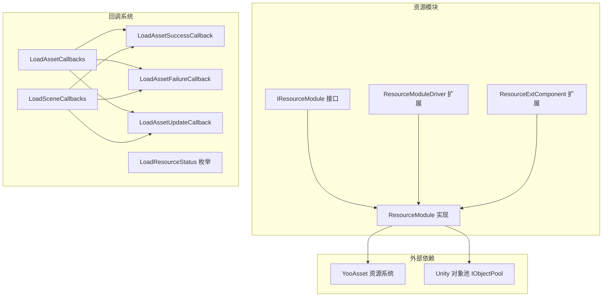
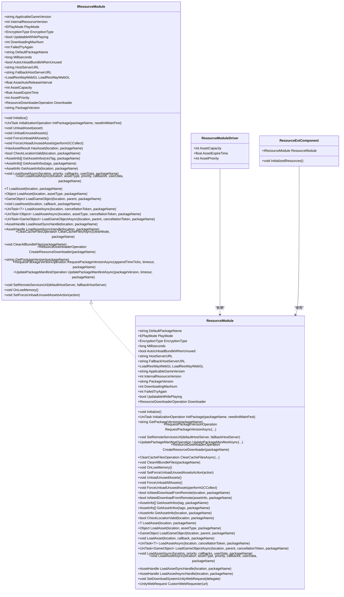
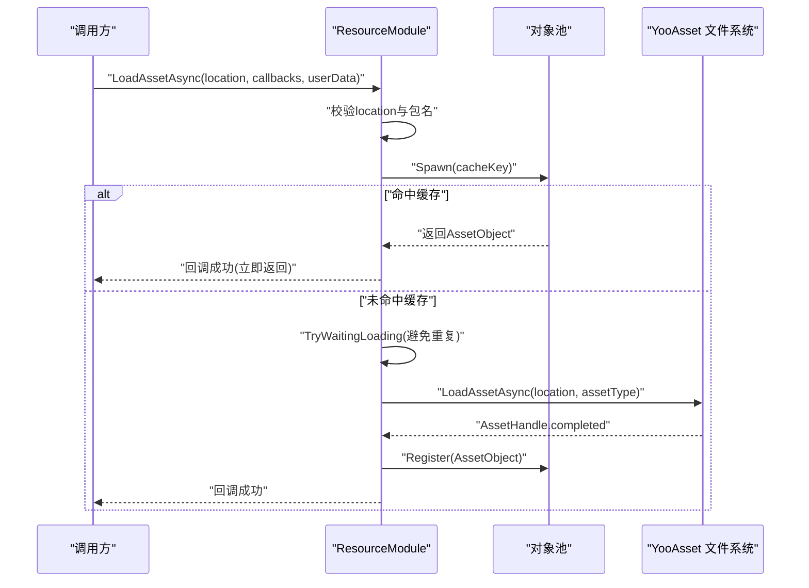
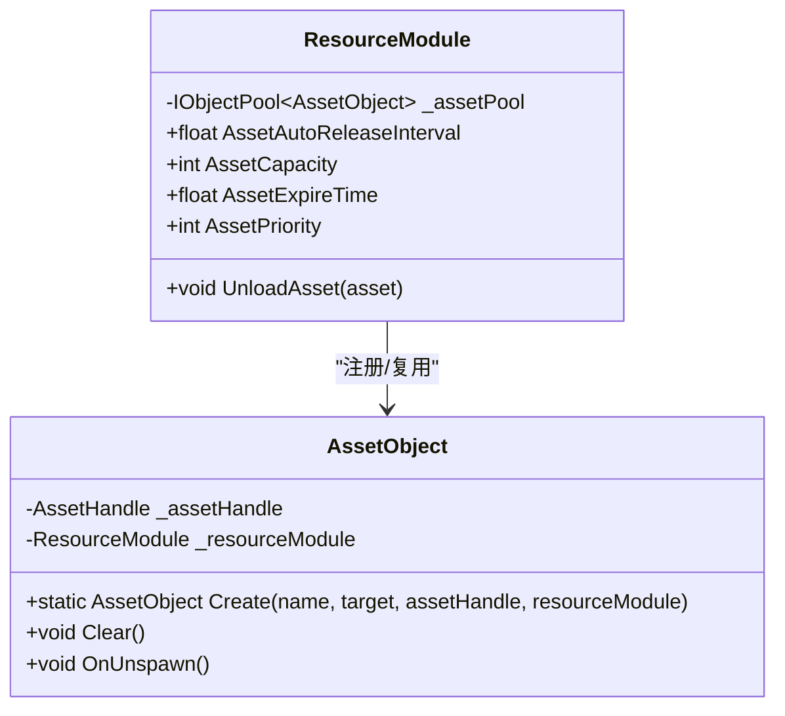
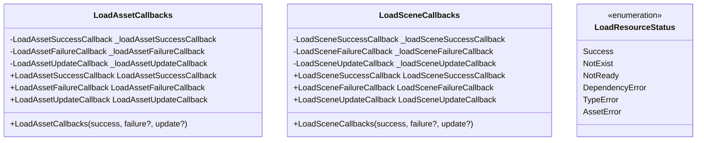
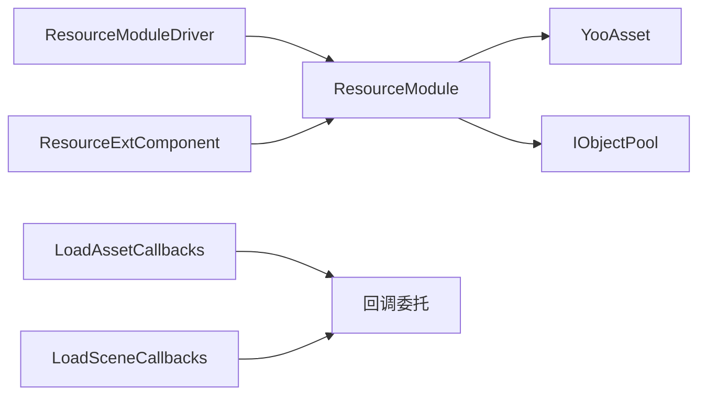

# 资源管理API

<cite>
**本文档引用的文件**
- [IResourceModule.cs](file://Assets/TEngine/Runtime/Module/ResourceModule/IResourceModule.cs)
- [ResourceModule.cs](file://Assets/TEngine/Runtime/Module/ResourceModule/ResourceModule.cs)
- [ResourceModule.Pool.cs](file://Assets/TEngine/Runtime/Module/ResourceModule/ResourceModule.Pool.cs)
- [ResourceModule.AssetObject.cs](file://Assets/TEngine/Runtime/Module/ResourceModule/ResourceModule.AssetObject.cs)
- [ResourceModuleDriver.cs](file://Assets/TEngine/Runtime/Module/ResourceModule/ResourceModuleDriver.cs)
- [ResourceExtComponent.Resource.cs](file://Assets/TEngine/Runtime/Module/ResourceModule/Extension/ResourceExtComponent.Resource.cs)
- [LoadAssetCallbacks.cs](file://Assets/TEngine/Runtime/Module/ResourceModule/Callback/LoadAssetCallbacks.cs)
- [LoadAssetSuccessCallback.cs](file://Assets/TEngine/Runtime/Module/ResourceModule/Callback/LoadAssetSuccessCallback.cs)
- [LoadAssetFailureCallback.cs](file://Assets/TEngine/Runtime/Module/ResourceModule/Callback/LoadAssetFailureCallback.cs)
- [LoadAssetUpdateCallback.cs](file://Assets/TEngine/Runtime/Module/ResourceModule/Callback/LoadAssetUpdateCallback.cs)
- [LoadResourceStatus.cs](file://Assets/TEngine/Runtime/Module/ResourceModule/Callback/LoadResourceStatus.cs)
- [LoadSceneCallbacks.cs](file://Assets/TEngine/Runtime/Module/ResourceModule/Callback/LoadSceneCallbacks.cs)
- [EncryptionType.cs](file://Assets/TEngine/Runtime/Module/ResourceModule/EncryptionType.cs)
</cite>

## 目录
1. [简介](#简介)
2. [项目结构](#项目结构)
3. [核心组件](#核心组件)
4. [架构总览](#架构总览)
5. [详细组件分析](#详细组件分析)
6. [依赖关系分析](#依赖关系分析)
7. [性能考量](#性能考量)
8. [故障排查指南](#故障排查指南)
9. [结论](#结论)
10. [附录](#附录)

## 简介
本文件为 TEngine 资源管理API的权威参考文档，围绕以下目标展开：
- 完整说明 IResourceModule 接口的API规范，覆盖资源加载、卸载、缓存管理等核心能力
- 详解 ResourceModule 类的实现API，包括资源包管理、异步加载机制、资源引用计数与自动释放策略
- 阐述 LoadAssetCallbacks 与 LoadSceneCallbacks 回调体系的使用方法与参数说明
- 提供资源路径管理、资源依赖解析、资源版本控制等高级API的使用指南
- 给出资源管理的最佳实践与性能优化建议

## 项目结构
TEngine 的资源模块位于 TEngine/Runtime/Module/ResourceModule 目录下，采用“接口 + 实现 + 扩展 + 回调”的分层设计：
- 接口层：IResourceModule 定义对外统一API
- 实现层：ResourceModule 内部实现具体逻辑，封装 YooAsset
- 扩展层：ResourceModuleDriver、ResourceExtComponent 等扩展组件
- 回调层：LoadAssetCallbacks/LoadSceneCallbacks 及其回调委托

图表来源
- [IResourceModule.cs:12-354](file://Assets/TEngine/Runtime/Module/ResourceModule/IResourceModule.cs#L12-L354)
- [ResourceModule.cs:17-138](file://Assets/TEngine/Runtime/Module/ResourceModule/ResourceModule.cs#L17-L138)
- [ResourceModuleDriver.cs:236-252](file://Assets/TEngine/Runtime/Module/ResourceModule/ResourceModuleDriver.cs#L236-L252)
- [ResourceExtComponent.Resource.cs:35-39](file://Assets/TEngine/Runtime/Module/ResourceModule/Extension/ResourceExtComponent.Resource.cs#L35-L39)
- [LoadAssetCallbacks.cs:6-91](file://Assets/TEngine/Runtime/Module/ResourceModule/Callback/LoadAssetCallbacks.cs#L6-L91)
- [LoadSceneCallbacks.cs:6-91](file://Assets/TEngine/Runtime/Module/ResourceModule/Callback/LoadSceneCallbacks.cs#L6-L91)

章节来源
- [IResourceModule.cs:12-354](file://Assets/TEngine/Runtime/Module/ResourceModule/IResourceModule.cs#L12-L354)
- [ResourceModule.cs:17-138](file://Assets/TEngine/Runtime/Module/ResourceModule/ResourceModule.cs#L17-L138)
- [ResourceModuleDriver.cs:236-252](file://Assets/TEngine/Runtime/Module/ResourceModule/ResourceModuleDriver.cs#L236-L252)
- [ResourceExtComponent.Resource.cs:35-39](file://Assets/TEngine/Runtime/Module/ResourceModule/Extension/ResourceExtComponent.Resource.cs#L35-L39)
- [LoadAssetCallbacks.cs:6-91](file://Assets/TEngine/Runtime/Module/ResourceModule/Callback/LoadAssetCallbacks.cs#L6-L91)
- [LoadSceneCallbacks.cs:6-91](file://Assets/TEngine/Runtime/Module/ResourceModule/Callback/LoadSceneCallbacks.cs#L6-L91)

## 核心组件
- IResourceModule 接口：定义资源管理的统一API，包括初始化、资源包管理、版本控制、下载器、缓存清理、资源查询与加载（同步/异步）、卸载与回收等
- ResourceModule 实现：对接 YooAsset，实现多运行模式（编辑器模拟、离线、联机、WebGL）、资源包生命周期管理、资源句柄与缓存、异步加载与回调、低内存处理等
- ResourceModuleDriver 扩展：作为驱动组件，桥接模块系统与 ResourceModule，暴露对象池配置等属性
- ResourceExtComponent 扩展：提供基于回调的加载流程封装与取消令牌支持
- 回调体系：LoadAssetCallbacks/LoadSceneCallbacks 将成功、失败、更新三类回调组合，配合 LoadResourceStatus 枚举描述加载状态

章节来源
- [IResourceModule.cs:12-354](file://Assets/TEngine/Runtime/Module/ResourceModule/IResourceModule.cs#L12-L354)
- [ResourceModule.cs:17-138](file://Assets/TEngine/Runtime/Module/ResourceModule/ResourceModule.cs#L17-L138)
- [ResourceModuleDriver.cs:236-252](file://Assets/TEngine/Runtime/Module/ResourceModule/ResourceModuleDriver.cs#L236-L252)
- [ResourceExtComponent.Resource.cs:35-39](file://Assets/TEngine/Runtime/Module/ResourceModule/Extension/ResourceExtComponent.Resource.cs#L35-L39)
- [LoadAssetCallbacks.cs:6-91](file://Assets/TEngine/Runtime/Module/ResourceModule/Callback/LoadAssetCallbacks.cs#L6-L91)
- [LoadSceneCallbacks.cs:6-91](file://Assets/TEngine/Runtime/Module/ResourceModule/Callback/LoadSceneCallbacks.cs#L6-L91)

## 架构总览
下图展示资源模块的高层架构与交互关系：

图表来源
- [IResourceModule.cs:12-354](file://Assets/TEngine/Runtime/Module/ResourceModule/IResourceModule.cs#L12-L354)
- [ResourceModule.cs:17-138](file://Assets/TEngine/Runtime/Module/ResourceModule/ResourceModule.cs#L17-L138)
- [ResourceModuleDriver.cs:236-252](file://Assets/TEngine/Runtime/Module/ResourceModule/ResourceModuleDriver.cs#L236-L252)
- [ResourceExtComponent.Resource.cs:35-39](file://Assets/TEngine/Runtime/Module/ResourceModule/Extension/ResourceExtComponent.Resource.cs#L35-L39)

## 详细组件分析

### IResourceModule 接口API规范
- 版本与运行模式
  - ApplicableGameVersion、InternalResourceVersion：获取当前适用的游戏版本号与内部资源版本号
  - PlayMode：运行模式（编辑器模拟、离线、主机、WebGL）
  - EncryptionType：资源加密方式（无、文件偏移、文件流）
  - UpdatableWhilePlaying：是否支持边玩边下载
  - DownloadingMaxNum、FailedTryAgain：并发下载数与失败重试次数
- 初始化与资源包
  - Initialize：初始化资源系统
  - InitPackage：初始化指定资源包，支持主清单预热
  - DefaultPackageName：默认资源包名
  - Milliseconds：异步系统每帧最大时间切片
  - AutoUnloadBundleWhenUnused：未使用时自动卸载资源包
  - HostServerURL、FallbackHostServerURL：远程服务URL
  - LoadResWayWebGL：WebGL平台加载策略
- 对象池与资源回收
  - AssetAutoReleaseInterval、AssetCapacity、AssetExpireTime、AssetPriority：对象池参数
  - UnloadAsset、UnloadUnusedAssets、ForceUnloadAllAssets、ForceUnloadUnusedAssets：资源卸载与回收
- 资源查询
  - HasAsset、CheckLocationValid、GetAssetInfos、GetAssetInfo：资源存在性、有效性、信息查询
- 资源加载
  - LoadAssetAsync（多种重载，含回调、委托、UniTask、取消令牌、实例化GameObject等）
  - LoadAsset（同步加载）、LoadGameObject（同步实例化）
  - LoadAssetSyncHandle、LoadAssetAsyncHandle：获取资源句柄
- 下载与缓存
  - Downloader、CreateResourceDownloader：下载器
  - ClearCacheFilesAsync、ClearAllBundleFiles：缓存清理
- 版本控制
  - PackageVersion、GetPackageVersion、RequestPackageVersionAsync、UpdatePackageManifestAsync、SetRemoteServicesUrl：版本请求与清单更新
- 低内存处理
  - OnLowMemory、SetForceUnloadUnusedAssetsAction：低内存回调与强制回收

章节来源
- [IResourceModule.cs:12-354](file://Assets/TEngine/Runtime/Module/ResourceModule/IResourceModule.cs#L12-L354)

### ResourceModule 实现API
- 运行模式与参数
  - 支持编辑器模拟、离线、主机、WebGL四种模式，按模式选择不同的文件系统参数
  - 初始化时设置异步系统时间片，创建默认资源包并设为默认包
- 资源包管理
  - 通过 PackageMap 维护资源包字典；支持按包名获取版本、请求版本、更新清单
- 资源句柄与缓存
  - 通过 GetHandleSync/GetHandleAsync 获取 YooAsset 句柄；结合对象池 AssetObject 实现缓存与复用
  - GetCacheKey 规范化缓存键（含包名前缀）
- 异步加载与回调
  - LoadAssetAsync（回调/委托/UniTask/取消令牌）均支持进度回调与等待重复加载
  - LoadGameObjectAsync 支持实例化父节点与材质着色器修复（编辑器条件编译）
- 卸载与回收
  - UnloadUnusedAssets/ForceUnloadAllAssets/ForceUnloadUnusedAssets 配合对象池与包级卸载
  - OnLowMemory 触发低内存动作
- 下载与自定义请求
  - CreateResourceDownloader、SetDownloadSystemUnityWebRequest、CustomWebRequester 支持自定义下载请求头

图表来源
- [ResourceModule.cs:933-1025](file://Assets/TEngine/Runtime/Module/ResourceModule/ResourceModule.cs#L933-L1025)
- [ResourceModule.cs:1197-1219](file://Assets/TEngine/Runtime/Module/ResourceModule/ResourceModule.cs#L1197-L1219)
- [ResourceModule.cs:823-869](file://Assets/TEngine/Runtime/Module/ResourceModule/ResourceModule.cs#L823-L869)

章节来源
- [ResourceModule.cs:17-138](file://Assets/TEngine/Runtime/Module/ResourceModule/ResourceModule.cs#L17-L138)
- [ResourceModule.cs:140-261](file://Assets/TEngine/Runtime/Module/ResourceModule/ResourceModule.cs#L140-L261)
- [ResourceModule.cs:412-447](file://Assets/TEngine/Runtime/Module/ResourceModule/ResourceModule.cs#L412-L447)
- [ResourceModule.cs:624-1127](file://Assets/TEngine/Runtime/Module/ResourceModule/ResourceModule.cs#L624-L1127)
- [ResourceModule.cs:1197-1219](file://Assets/TEngine/Runtime/Module/ResourceModule/ResourceModule.cs#L1197-L1219)

### ResourceModule 对象池与资源对象
- 对象池参数
  - AssetAutoReleaseInterval、AssetCapacity、AssetExpireTime、AssetPriority 由 ResourceModule.Pool.cs 暴露
- 资源对象
  - AssetObject 包装 AssetHandle 与目标对象，参与对象池注册与回收
  - 通过 MemoryPool 获取/释放，确保生命周期可控

图表来源
- [ResourceModule.Pool.cs:1-46](file://Assets/TEngine/Runtime/Module/ResourceModule/ResourceModule.Pool.cs#L1-L46)
- [ResourceModule.AssetObject.cs:11-42](file://Assets/TEngine/Runtime/Module/ResourceModule/ResourceModule.AssetObject.cs#L11-L42)

章节来源
- [ResourceModule.Pool.cs:1-46](file://Assets/TEngine/Runtime/Module/ResourceModule/ResourceModule.Pool.cs#L1-L46)
- [ResourceModule.AssetObject.cs:11-42](file://Assets/TEngine/Runtime/Module/ResourceModule/ResourceModule.AssetObject.cs#L11-L42)

### ResourceModuleDriver 与 ResourceExtComponent
- ResourceModuleDriver
  - 通过 ModuleSystem 获取 IResourceModule 并暴露对象池参数（容量、过期、优先级）
- ResourceExtComponent
  - 在初始化时获取 IResourceModule 并构造 LoadAssetCallbacks，提供基于回调的加载流程与取消令牌支持

章节来源
- [ResourceModuleDriver.cs:236-252](file://Assets/TEngine/Runtime/Module/ResourceModule/ResourceModuleDriver.cs#L236-L252)
- [ResourceExtComponent.Resource.cs:35-39](file://Assets/TEngine/Runtime/Module/ResourceModule/Extension/ResourceExtComponent.Resource.cs#L35-L39)

### 回调体系：LoadAssetCallbacks 与 LoadSceneCallbacks
- LoadAssetCallbacks
  - 组合 LoadAssetSuccessCallback、LoadAssetFailureCallback、LoadAssetUpdateCallback
  - 支持三种重载构造，确保至少提供成功回调
- LoadSceneCallbacks
  - 组合 LoadSceneSuccessCallback、LoadSceneFailureCallback、LoadSceneUpdateCallback
- LoadResourceStatus
  - 描述资源加载状态（成功、不存在、未就绪、依赖错误、类型错误、资源错误）

图表来源
- [LoadAssetCallbacks.cs:6-91](file://Assets/TEngine/Runtime/Module/ResourceModule/Callback/LoadAssetCallbacks.cs#L6-L91)
- [LoadSceneCallbacks.cs:6-91](file://Assets/TEngine/Runtime/Module/ResourceModule/Callback/LoadSceneCallbacks.cs#L6-L91)
- [LoadResourceStatus.cs:6-38](file://Assets/TEngine/Runtime/Module/ResourceModule/Callback/LoadResourceStatus.cs#L6-L38)

章节来源
- [LoadAssetCallbacks.cs:6-91](file://Assets/TEngine/Runtime/Module/ResourceModule/Callback/LoadAssetCallbacks.cs#L6-L91)
- [LoadSceneCallbacks.cs:6-91](file://Assets/TEngine/Runtime/Module/ResourceModule/Callback/LoadSceneCallbacks.cs#L6-L91)
- [LoadResourceStatus.cs:6-38](file://Assets/TEngine/Runtime/Module/ResourceModule/Callback/LoadResourceStatus.cs#L6-L38)

### 资源路径管理、依赖解析与版本控制
- 路径与包名
  - GetCacheKey 将包名与资源定位地址拼接为缓存键，避免跨包冲突
  - CheckLocationValid 校验资源定位地址有效性
- 依赖解析
  - GetAssetInfo 返回 AssetInfo，其中包含资源类型与错误信息，用于加载前的依赖与类型校验
- 版本控制
  - GetPackageVersion 获取包版本
  - RequestPackageVersionAsync 请求远端版本
  - UpdatePackageManifestAsync 更新清单
  - SetRemoteServicesUrl 设置远程服务URL

章节来源
- [ResourceModule.cs:682-690](file://Assets/TEngine/Runtime/Module/ResourceModule/ResourceModule.cs#L682-L690)
- [ResourceModule.cs:609-620](file://Assets/TEngine/Runtime/Module/ResourceModule/ResourceModule.cs#L609-L620)
- [ResourceModule.cs:533-569](file://Assets/TEngine/Runtime/Module/ResourceModule/ResourceModule.cs#L533-L569)
- [ResourceModule.cs:294-305](file://Assets/TEngine/Runtime/Module/ResourceModule/ResourceModule.cs#L294-L305)
- [ResourceModule.cs:314-321](file://Assets/TEngine/Runtime/Module/ResourceModule/ResourceModule.cs#L314-L321)
- [ResourceModule.cs:335-341](file://Assets/TEngine/Runtime/Module/ResourceModule/ResourceModule.cs#L335-L341)
- [ResourceModule.cs:323-327](file://Assets/TEngine/Runtime/Module/ResourceModule/ResourceModule.cs#L323-L327)

## 依赖关系分析
- 模块耦合
  - ResourceModuleDriver 与 ResourceModule 强耦合（Driver持有Module引用并暴露参数）
  - ResourceExtComponent 依赖 IResourceModule 以构建回调与加载流程
- 外部依赖
  - YooAsset：资源包初始化、文件系统、句柄、清单与下载器
  - IObjectPool：对象池注册与回收
- 回调依赖
  - LoadAssetCallbacks/LoadSceneCallbacks 依赖对应的委托类型

图表来源
- [ResourceModuleDriver.cs:236-252](file://Assets/TEngine/Runtime/Module/ResourceModule/ResourceModuleDriver.cs#L236-L252)
- [ResourceExtComponent.Resource.cs:35-39](file://Assets/TEngine/Runtime/Module/ResourceModule/Extension/ResourceExtComponent.Resource.cs#L35-L39)
- [LoadAssetCallbacks.cs:6-91](file://Assets/TEngine/Runtime/Module/ResourceModule/Callback/LoadAssetCallbacks.cs#L6-L91)
- [LoadSceneCallbacks.cs:6-91](file://Assets/TEngine/Runtime/Module/ResourceModule/Callback/LoadSceneCallbacks.cs#L6-L91)

章节来源
- [ResourceModuleDriver.cs:236-252](file://Assets/TEngine/Runtime/Module/ResourceModule/ResourceModuleDriver.cs#L236-L252)
- [ResourceExtComponent.Resource.cs:35-39](file://Assets/TEngine/Runtime/Module/ResourceModule/Extension/ResourceExtComponent.Resource.cs#L35-L39)
- [LoadAssetCallbacks.cs:6-91](file://Assets/TEngine/Runtime/Module/ResourceModule/Callback/LoadAssetCallbacks.cs#L6-L91)
- [LoadSceneCallbacks.cs:6-91](file://Assets/TEngine/Runtime/Module/ResourceModule/Callback/LoadSceneCallbacks.cs#L6-L91)

## 性能考量
- 异步与时间片
  - 通过 Milliseconds 控制每帧异步操作的时间切片，避免主线程卡顿
- 对象池与缓存
  - 利用对象池减少GC压力，合理设置容量、过期时间与自动释放间隔
- 并发与重试
  - DownloadingMaxNum 控制并发下载数；FailedTryAgain 控制失败重试次数
- WebGL与加密
  - LoadResWayWebGL 与 EncryptionType 影响加载路径与解密开销
- 低内存策略
  - OnLowMemory 触发强制回收，SetForceUnloadUnusedAssetsAction 提供自定义回收策略

章节来源
- [ResourceModule.cs:34-35](file://Assets/TEngine/Runtime/Module/ResourceModule/ResourceModule.cs#L34-L35)
- [ResourceModule.cs:86-88](file://Assets/TEngine/Runtime/Module/ResourceModule/ResourceModule.cs#L86-L88)
- [ResourceModule.cs:444-447](file://Assets/TEngine/Runtime/Module/ResourceModule/ResourceModule.cs#L444-L447)
- [EncryptionType.cs:7-26](file://Assets/TEngine/Runtime/Module/ResourceModule/EncryptionType.cs#L7-L26)

## 故障排查指南
- 常见问题
  - 资源定位无效：使用 CheckLocationValid 校验；若返回false，确认包名与路径
  - 资源不存在或未就绪：HasAsset 与 LoadResourceStatus 可区分“不存在”与“未就绪”
  - 加载超时：异步加载等待重复加载时可能触发超时日志，检查网络与包版本
  - WebGL不支持强制全量卸载：ForceUnloadAllAssets 在WebGL下会被忽略
- 回调与日志
  - 成功/失败/更新回调中记录 assetName、duration、progress、errorMessage 便于定位
  - OnLowMemory 日志提示低内存事件，必要时触发回收

章节来源
- [ResourceModule.cs:609-620](file://Assets/TEngine/Runtime/Module/ResourceModule/ResourceModule.cs#L609-L620)
- [ResourceModule.cs:577-602](file://Assets/TEngine/Runtime/Module/ResourceModule/ResourceModule.cs#L577-L602)
- [ResourceModule.cs:1211-1217](file://Assets/TEngine/Runtime/Module/ResourceModule/ResourceModule.cs#L1211-L1217)
- [ResourceModule.cs:429-432](file://Assets/TEngine/Runtime/Module/ResourceModule/ResourceModule.cs#L429-L432)
- [LoadResourceStatus.cs:6-38](file://Assets/TEngine/Runtime/Module/ResourceModule/Callback/LoadResourceStatus.cs#L6-L38)

## 结论
TEngine 资源模块通过 IResourceModule 提供统一API，ResourceModule 基于 YooAsset 实现多运行模式与资源包管理，结合对象池与异步加载机制，形成高效稳定的资源加载体系。回调体系与版本控制、缓存清理、低内存处理等特性共同构成完整的资源生命周期管理方案。

## 附录
- 最佳实践
  - 使用包名前缀与 GetCacheKey 规范化缓存键，避免跨包冲突
  - 合理设置对象池参数与异步时间片，平衡流畅度与吞吐量
  - 使用回调与进度通知提升用户体验，必要时使用取消令牌中断长耗时加载
  - 在WebGL平台注意加载策略与限制，避免全量卸载
- 高级用法
  - 自定义下载请求头：SetDownloadSystemUnityWebRequest + CustomWebRequester
  - 主清单预热：InitPackage(needInitMainFest=true)
  - 低内存保护：OnLowMemory + SetForceUnloadUnusedAssetsAction

章节来源
- [ResourceModule.cs:1197-1219](file://Assets/TEngine/Runtime/Module/ResourceModule/ResourceModule.cs#L1197-L1219)
- [ResourceModule.cs:1229-1247](file://Assets/TEngine/Runtime/Module/ResourceModule/ResourceModule.cs#L1229-L1247)
- [ResourceModule.cs:140-261](file://Assets/TEngine/Runtime/Module/ResourceModule/ResourceModule.cs#L140-L261)
- [ResourceModule.cs:392-407](file://Assets/TEngine/Runtime/Module/ResourceModule/ResourceModule.cs#L392-L407)