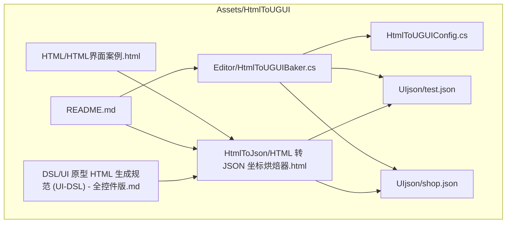
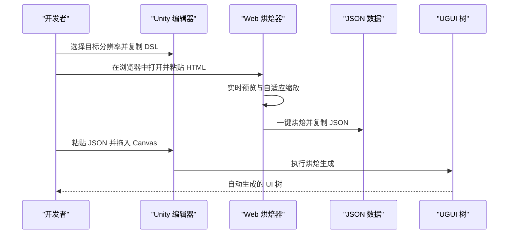
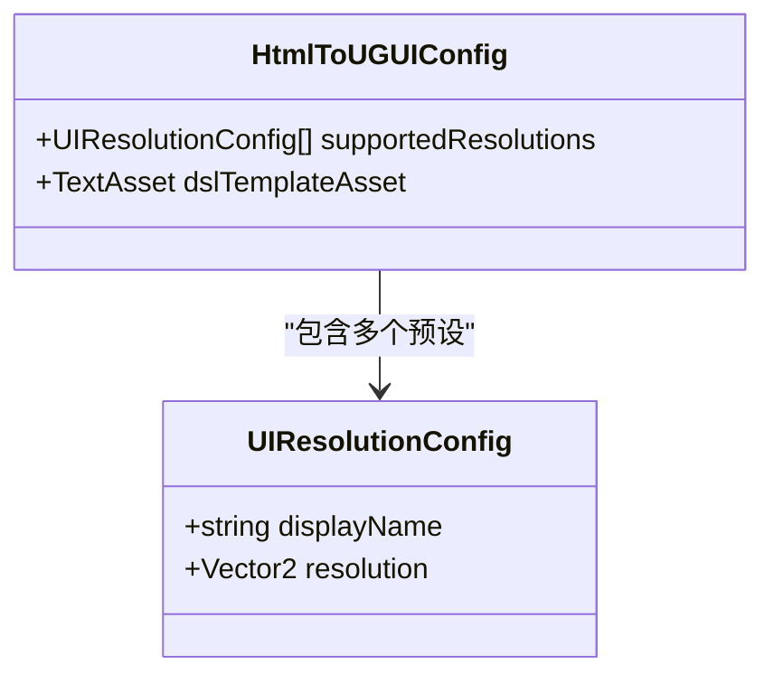
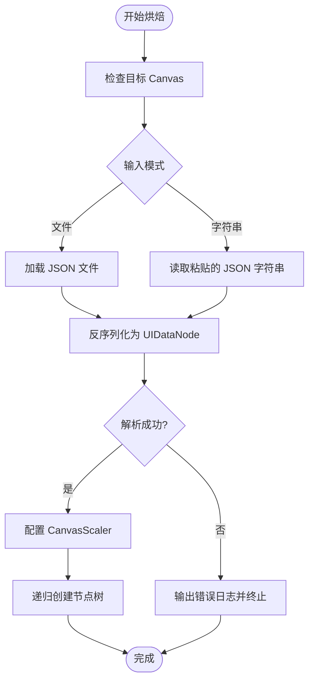
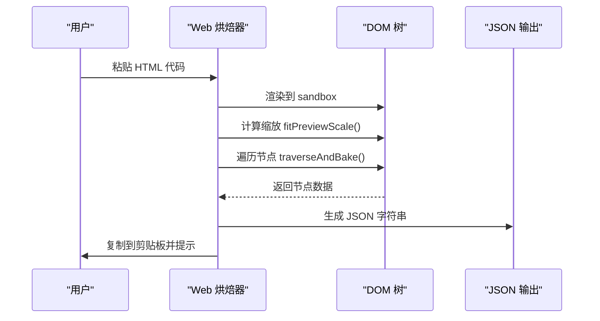
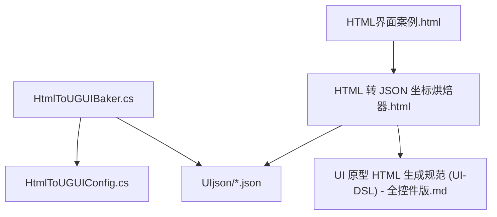

# HTML转UGUI工具

<cite>
**本文引用的文件**
- [HtmlToUGUIConfig.cs](file://Assets/HtmlToUGUI/HtmlToUGUIConfig.cs)
- [HtmlToUGUIBaker.cs](file://Assets/HtmlToUGUI/Editor/HtmlToUGUIBaker.cs)
- [HTML界面案例.html](file://Assets/HtmlToUGUI/HTML/HTML界面案例.html)
- [HTML 转 JSON 坐标烘焙器.html](file://Assets/HtmlToUGUI/HtmlToJson/HTML 转 JSON 坐标烘焙器.html)
- [test.json](file://Assets/HtmlToUGUI/UIjson/test.json)
- [shop.json](file://Assets/HtmlToUGUI/UIjson/shop.json)
- [UI 原型 HTML 生成规范 (UI-DSL) - 全控件版.md](file://Assets/HtmlToUGUI/DSL/UI 原型 HTML 生成规范 (UI-DSL) - 全控件版.md)
- [README.md](file://Assets/HtmlToUGUI/README.md)
</cite>

## 目录
1. [简介](#简介)
2. [项目结构](#项目结构)
3. [核心组件](#核心组件)
4. [架构总览](#架构总览)
5. [详细组件分析](#详细组件分析)
6. [依赖关系分析](#依赖关系分析)
7. [性能考量](#性能考量)
8. [故障排查指南](#故障排查指南)
9. [结论](#结论)
10. [附录](#附录)

## 简介
本工具是一套将 AI 生成的 HTML 原型直接转换为 Unity UGUI 界面树的自动化生产管线。通过自定义的 HTML 数据属性规范（UI-DSL），结合 Web 坐标提取工具和 Unity 编辑器扩展，实现从“自然语言对话”到“生产级 UGUI 预制体”的无缝流转。工具支持多分辨率预设、动态 DSL 规范导出、极速剪贴板直通流、Web 烘焙器全面升级、外部工具链桥接等特性，覆盖从规范导出、AI 生成到剪贴板烘焙的完整工作流。

## 项目结构
- Assets/HtmlToUGUI
  - Editor/HtmlToUGUIBaker.cs：Unity 编辑器扩展，负责烘焙器界面与核心逻辑
  - HtmlToUGUIConfig.cs：全局配置脚本对象，管理多分辨率预设与 DSL 模板
  - HTML/HTML界面案例.html：示例 HTML 原型，展示全控件规范
  - HtmlToJson/HTML 转 JSON 坐标烘焙器.html：Web 端坐标提取与 JSON 输出工具
  - UIjson/test.json、shop.json：示例 UI 坐标 JSON 数据
  - DSL/UI 原型 HTML 生成规范 (UI-DSL) - 全控件版.md：UI-DSL 规范文档
  - README.md：工具使用说明与工作流指南

图表来源
- [HtmlToUGUIConfig.cs:1-35](file://Assets/HtmlToUGUI/HtmlToUGUIConfig.cs#L1-L35)
- [HtmlToUGUIBaker.cs:1-836](file://Assets/HtmlToUGUI/Editor/HtmlToUGUIBaker.cs#L1-L836)
- [HTML界面案例.html:1-146](file://Assets/HtmlToUGUI/HTML/HTML界面案例.html#L1-L146)
- [HTML 转 JSON 坐标烘焙器.html:1-239](file://Assets/HtmlToUGUI/HtmlToJson/HTML 转 JSON 坐标烘焙器.html#L1-L239)
- [test.json:1-800](file://Assets/HtmlToUGUI/UIjson/test.json#L1-L800)
- [shop.json:1-800](file://Assets/HtmlToUGUI/UIjson/shop.json#L1-L800)
- [UI 原型 HTML 生成规范 (UI-DSL) - 全控件版.md:1-54](file://Assets/HtmlToUGUI/DSL/UI 原型 HTML 生成规范 (UI-DSL) - 全控件版.md#L1-L54)
- [README.md:1-71](file://Assets/HtmlToUGUI/README.md#L1-L71)

章节来源
- [README.md:1-71](file://Assets/HtmlToUGUI/README.md#L1-L71)

## 核心组件
- HtmlToUGUIConfig：全局配置脚本对象，管理多分辨率预设与 DSL 模板，支持在编辑器中自由增删分辨率，动态导出对应分辨率的 DSL 规范。
- HtmlToUGUIBaker：Unity 编辑器扩展，提供烘焙器界面，支持外部工具链桥接、目标 Canvas 配置、JSON 输入模式（文件/字符串）、执行烘焙生成等。
- Web 烘焙器：HTML 转 JSON 坐标烘焙器，支持实时预览、自适应缩放、一键烘焙并复制 JSON，确保坐标与尺寸的 1:1 还原。
- UI-DSL 规范：定义 HTML 数据属性规范，约束节点类型、命名、样式等，确保与 Unity 组件映射的一致性。

章节来源
- [HtmlToUGUIConfig.cs:1-35](file://Assets/HtmlToUGUI/HtmlToUGUIConfig.cs#L1-L35)
- [HtmlToUGUIBaker.cs:1-836](file://Assets/HtmlToUGUI/Editor/HtmlToUGUIBaker.cs#L1-L836)
- [HTML 转 JSON 坐标烘焙器.html:1-239](file://Assets/HtmlToUGUI/HtmlToJson/HTML 转 JSON 坐标烘焙器.html#L1-L239)
- [UI 原型 HTML 生成规范 (UI-DSL) - 全控件版.md:1-54](file://Assets/HtmlToUGUI/DSL/UI 原型 HTML 生成规范 (UI-DSL) - 全控件版.md#L1-L54)

## 架构总览
工具采用“规范导出 -> AI 生成 -> 剪贴板烘焙”的三步工作流：
- 规范导出：在 Unity 中选择目标分辨率，复制对应分辨率的 DSL 规范到剪贴板，供 AI 使用。
- AI 生成：将 DSL 规范与自然语言需求一起交给大语言模型，生成 HTML 原型。
- 剪贴板烘焙：在 Web 端一键烘焙并复制 JSON，回到 Unity 粘贴 JSON 并执行烘焙生成，自动生成 UGUI 树。

图表来源
- [README.md:29-55](file://Assets/HtmlToUGUI/README.md#L29-L55)
- [HTML 转 JSON 坐标烘焙器.html:115-145](file://Assets/HtmlToUGUI/HtmlToJson/HTML 转 JSON 坐标烘焙器.html#L115-L145)
- [HtmlToUGUIBaker.cs:315-370](file://Assets/HtmlToUGUI/Editor/HtmlToUGUIBaker.cs#L315-L370)

## 详细组件分析

### HtmlToUGUIConfig 配置系统
- 多分辨率预设：支持在编辑器中自由增删分辨率，每个预设包含显示名称与分辨率向量。
- DSL 模板：配置文件中可拖入包含 {WIDTH} 和 {HEIGHT} 占位符的 Markdown 模板文件，烘焙器可动态替换并复制到剪贴板。
- 使用方法：
  - 在 Unity 中右键 Project 窗口 -> Create -> UI Architecture -> HtmlToUGUI Config 创建配置文件。
  - 将 DSL 模板文件拖入配置的 dslTemplateAsset 槽位。
  - 在烘焙器中选择目标分辨率，点击“复制对应分辨率的 DSL 规范”。

图表来源
- [HtmlToUGUIConfig.cs:10-34](file://Assets/HtmlToUGUI/HtmlToUGUIConfig.cs#L10-L34)

章节来源
- [HtmlToUGUIConfig.cs:1-35](file://Assets/HtmlToUGUI/HtmlToUGUIConfig.cs#L1-L35)
- [README.md:33-36](file://Assets/HtmlToUGUI/README.md#L33-L36)

### HtmlToUGUIBaker 烘焙器
- 界面与输入模式：支持文件模式与字符串模式两种输入；可选择目标 Canvas；可切换使用旧版 Text 或 TextMeshPro。
- 外部工具链桥接：可配置本地 HTML 转换器路径，一键在浏览器中打开。
- 核心逻辑：
  - 配置 CanvasScaler：根据选定分辨率设置 referenceResolution 与 matchWidthOrHeight。
  - JSON 解析：支持从 TextAsset 或字符串解析 UIDataNode。
  - 节点生成：递归创建 GameObject 与 RectTransform，按类型应用组件与样式。
  - 组件映射：div/image 映射到 Image；text 映射到 Text 或 TextMeshProUGUI；button/input/scroll/toggle/slider/dropdown 映射到对应 UGUI 组件。
  - 坐标计算：使用相对父节点的绝对坐标进行 anchoredPosition 计算，sizeDelta 保持原始尺寸。

图表来源
- [HtmlToUGUIBaker.cs:315-370](file://Assets/HtmlToUGUI/Editor/HtmlToUGUIBaker.cs#L315-L370)
- [HtmlToUGUIBaker.cs:372-388](file://Assets/HtmlToUGUI/Editor/HtmlToUGUIBaker.cs#L372-L388)
- [HtmlToUGUIBaker.cs:394-421](file://Assets/HtmlToUGUI/Editor/HtmlToUGUIBaker.cs#L394-L421)

章节来源
- [HtmlToUGUIBaker.cs:1-836](file://Assets/HtmlToUGUI/Editor/HtmlToUGUIBaker.cs#L1-L836)

### Web 烘焙器（HTML 转 JSON 坐标烘焙器）
- 实时预览与自适应缩放：根据容器尺寸与根节点尺寸计算缩放比例，避免 CSS 动画导致的坐标偏移。
- 坐标提取：遍历 DOM，提取每个节点的绝对坐标、尺寸、背景色、字体颜色、字号、文本对齐、文本内容等，生成 JSON。
- 一键烘焙：将 JSON 写入剪贴板，提示用户回到 Unity 粘贴。

图表来源
- [HTML 转 JSON 坐标烘焙器.html:73-145](file://Assets/HtmlToUGUI/HtmlToJson/HTML 转 JSON 坐标烘焙器.html#L73-L145)
- [HTML 转 JSON 坐标烘焙器.html:147-224](file://Assets/HtmlToUGUI/HtmlToJson/HTML 转 JSON 坐标烘焙器.html#L147-L224)

章节来源
- [HTML 转 JSON 坐标烘焙器.html:1-239](file://Assets/HtmlToUGUI/HtmlToJson/HTML 转 JSON 坐标烘焙器.html#L1-L239)

### UI-DSL 规范与示例
- 规范要点：
  - 唯一根节点：声明 data-u-type="div" 与 data-u-name="root" 或具体窗口名。
  - 基准分辨率：根节点 style 中明确 width/height，最大不可超过此尺寸。
  - 节点类型：div/image/text/button/input/scroll/toggle/slider/dropdown。
  - 高级属性：toggle 支持 data-u-checked；slider 支持 data-u-value；dropdown 必须使用 select 并包含 option。
- 示例 HTML：包含顶部导航栏、主体内容区、左右分栏、房间列表、回放控制等全控件示例。

章节来源
- [UI 原型 HTML 生成规范 (UI-DSL) - 全控件版.md:1-54](file://Assets/HtmlToUGUI/DSL/UI 原型 HTML 生成规范 (UI-DSL) - 全控件版.md#L1-L54)
- [HTML界面案例.html:1-146](file://Assets/HtmlToUGUI/HTML/HTML界面案例.html#L1-L146)

### JSON 数据结构与示例
- 结构字段：name/type/dir/value/isChecked/options/x/y/width/height/color/fontColor/fontSize/textAlign/text/children。
- 示例 JSON：test.json 与 shop.json 展示了复杂 UI 的层级结构与控件映射，可用于验证烘焙器的正确性。

章节来源
- [test.json:1-800](file://Assets/HtmlToUGUI/UIjson/test.json#L1-L800)
- [shop.json:1-800](file://Assets/HtmlToUGUI/UIjson/shop.json#L1-L800)

## 依赖关系分析
- HtmlToUGUIBaker 依赖 HtmlToUGUIConfig 进行分辨率与 DSL 模板配置。
- HtmlToUGUIBaker 依赖 Newtonsoft.Json 进行 JSON 反序列化。
- Web 烘焙器依赖浏览器 DOM API 进行坐标提取与预览。
- UI-DSL 规范约束 HTML 结构，确保与 Unity 组件映射一致。

图表来源
- [HtmlToUGUIBaker.cs:1-8](file://Assets/HtmlToUGUI/Editor/HtmlToUGUIBaker.cs#L1-L8)
- [HtmlToUGUIConfig.cs:1-35](file://Assets/HtmlToUGUI/HtmlToUGUIConfig.cs#L1-L35)
- [HTML 转 JSON 坐标烘焙器.html:1-239](file://Assets/HtmlToUGUI/HtmlToJson/HTML 转 JSON 坐标烘焙器.html#L1-L239)
- [HTML界面案例.html:1-146](file://Assets/HtmlToUGUI/HTML/HTML界面案例.html#L1-L146)
- [UI 原型 HTML 生成规范 (UI-DSL) - 全控件版.md:1-54](file://Assets/HtmlToUGUI/DSL/UI 原型 HTML 生成规范 (UI-DSL) - 全控件版.md#L1-L54)

章节来源
- [HtmlToUGUIBaker.cs:1-8](file://Assets/HtmlToUGUI/Editor/HtmlToUGUIBaker.cs#L1-L8)

## 性能考量
- Web 端坐标提取：通过移除 transition 属性避免动画中间态影响 getBoundingClientRect 的准确性，确保坐标与尺寸的 1:1 还原。
- Unity 端烘焙：使用 CanvasScaler 的 ScaleWithScreenSize 模式与 matchWidthOrHeight=0.5，实现多分辨率适配；节点生成采用递归遍历，复杂度与节点数线性相关。
- 文本组件：支持 Legacy Text 与 TextMeshPro 两种方案，可根据项目需求选择，减少不必要的依赖。

## 故障排查指南
- 未指定目标 Canvas：烘焙中断并输出错误日志，需在烘焙器中拖入场景中的 Canvas。
- 未指定 JSON 数据源：文件模式下未选择 JSON 文件或字符串模式下未粘贴 JSON，烘焙中断并输出错误日志。
- JSON 解析异常：JSON 格式不符合 UIDataNode 规范，烘焙中断并输出异常信息。
- 配置文件缺失或分辨率索引越界：复制 DSL 失败，需检查 HtmlToUGUIConfig 是否正确配置。
- 转换器路径为空：在浏览器中打开失败，需先配置本地 HTML 转换器路径。

章节来源
- [HtmlToUGUIBaker.cs:315-370](file://Assets/HtmlToUGUI/Editor/HtmlToUGUIBaker.cs#L315-L370)
- [HtmlToUGUIBaker.cs:259-278](file://Assets/HtmlToUGUI/Editor/HtmlToUGUIBaker.cs#L259-L278)
- [HtmlToUGUIBaker.cs:198-233](file://Assets/HtmlToUGUI/Editor/HtmlToUGUIBaker.cs#L198-L233)

## 结论
HTML 转 UGUI 工具通过规范化的 UI-DSL、Web 坐标提取与 Unity 烘焙器的协同，实现了从自然语言到 UGUI 预制体的高效自动化生产。其多分辨率适配、动态 DSL 导出、极速剪贴板直通流等特性显著提升了 UI 原型开发效率，适合在团队协作与快速迭代场景中使用。

## 附录
- 使用流程（v2.0）：
  1) 准备工作：创建 HtmlToUGUIConfig 配置文件并拖入 DSL 模板。
  2) 导出规范与 AI 生成：在烘焙器中选择目标分辨率，复制 DSL 到剪贴板，交给 AI 生成 HTML。
  3) Web 端一键提取坐标：在浏览器中打开工具，粘贴 HTML，一键烘焙并复制 JSON。
  4) Unity 端极速生成：回到 Unity 粘贴 JSON 并拖入 Canvas，点击执行烘焙生成。

章节来源
- [README.md:29-55](file://Assets/HtmlToUGUI/README.md#L29-L55)