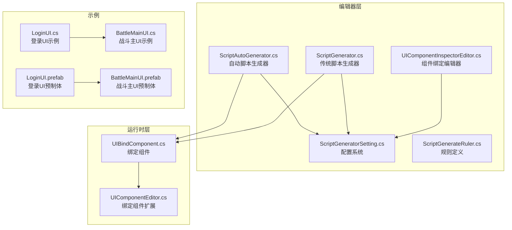
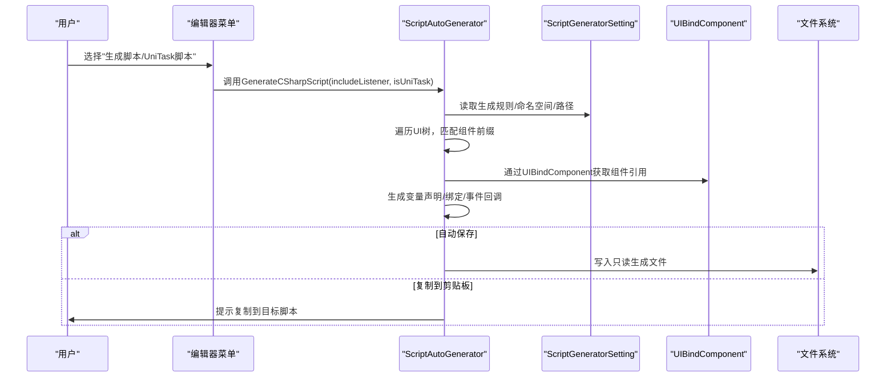
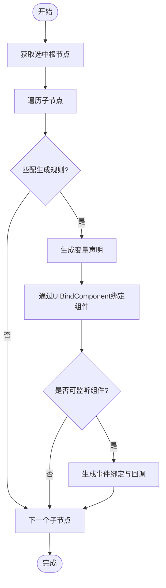
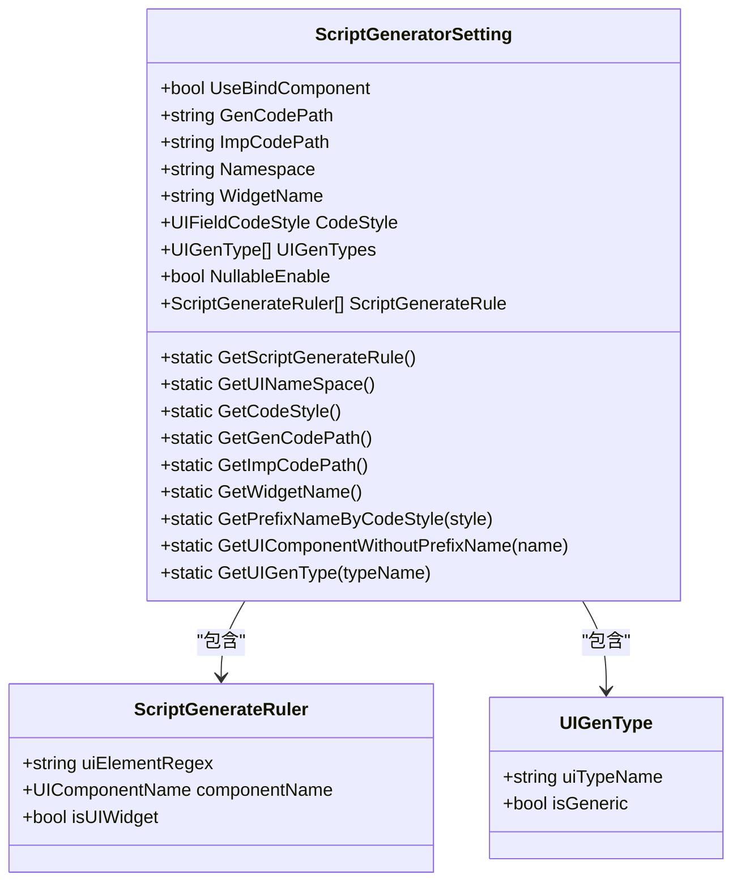
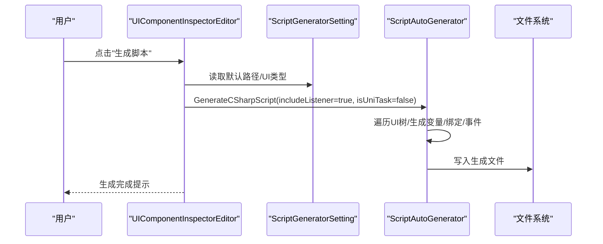
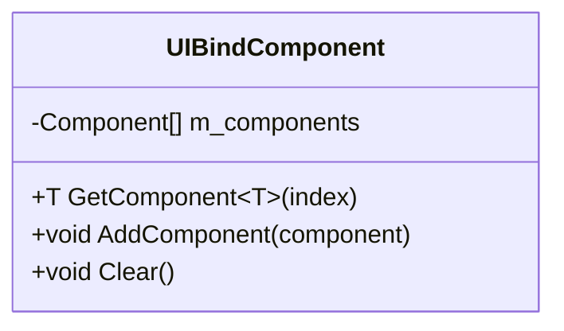
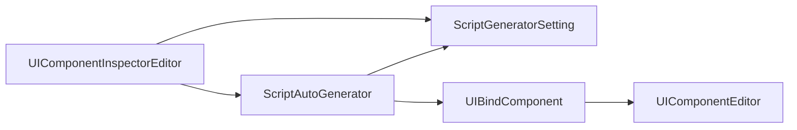

# UI脚本生成器

<cite>
**本文档引用的文件**
- [ScriptAutoGenerator.cs](file://Assets/Editor/UIScriptGenerator/ScriptAutoGenerator.cs)
- [ScriptGenerator.cs](file://Assets/Editor/UIScriptGenerator/ScriptGenerator.cs)
- [ScriptGeneratorSetting.cs](file://Assets/Editor/UIScriptGenerator/ScriptGeneratorSetting.cs)
- [ScriptGenerateRuler.cs](file://Assets/Editor/UIScriptGenerator/ScriptGenerateRuler.cs)
- [UIComponentInspectorEditor.cs](file://Assets/Editor/UIScriptGenerator/UIComponentInspectorEditor.cs)
- [ScriptGeneratorSetting.asset](file://Assets/Editor/UIScriptGenerator/ScriptGeneratorSetting.asset)
- [UIBindComponent.cs](file://Assets/GameScripts/HotFix/GameLogic/Module/UIModule/UIBindComponent/UIBindComponent.cs)
- [UIComponentEditor.cs](file://Assets/GameScripts/HotFix/GameLogic/Module/UIModule/UIBindComponent/UIComponentEditor.cs)
- [LoginUI.cs](file://Assets/GameScripts/HotFix/GameLogic/UI/LoginUI/LoginUI.cs)
- [BattleMainUI.cs](file://Assets/GameScripts/HotFix/GameLogic/UI/BattleMainUI/BattleMainUI.cs)
- [LoginUI.prefab](file://Assets/AssetRaw/UI/LoginUI.prefab)
- [BattleMainUI.prefab](file://Assets/AssetRaw/UI/BattleMainUI.prefab)
</cite>

## 目录
1. [简介](#简介)
2. [项目结构](#项目结构)
3. [核心组件](#核心组件)
4. [架构总览](#架构总览)
5. [详细组件分析](#详细组件分析)
6. [依赖关系分析](#依赖关系分析)
7. [性能考虑](#性能考虑)
8. [故障排除指南](#故障排除指南)
9. [结论](#结论)
10. [附录](#附录)

## 简介
本文件系统性介绍TEngine UI脚本生成器的使用与实现，涵盖自动脚本生成、事件绑定、组件绑定等核心功能。文档重点解析ScriptAutoGenerator类的实现机制，包括UI组件识别规则、变量命名规范、事件回调生成等；阐述ScriptGeneratorSetting配置系统的使用方法，包括生成规则配置、命名空间设置、组件映射等；并提供UI开发最佳实践与常见问题解决方案。

## 项目结构
UI脚本生成器位于编辑器模块中，核心文件包括：
- 自动脚本生成器：ScriptAutoGenerator.cs
- 传统脚本生成器：ScriptGenerator.cs
- 配置系统：ScriptGeneratorSetting.cs、ScriptGeneratorSetting.asset
- 规则定义：ScriptGenerateRuler.cs
- 组件绑定编辑器：UIComponentInspectorEditor.cs
- 运行时绑定组件：UIBindComponent.cs、UIComponentEditor.cs
- 示例UI与预制体：LoginUI.cs、BattleMainUI.cs、LoginUI.prefab、BattleMainUI.prefab

**图表来源**
- [ScriptAutoGenerator.cs:1-829](file://Assets/Editor/UIScriptGenerator/ScriptAutoGenerator.cs#L1-L829)
- [ScriptGenerator.cs:1-343](file://Assets/Editor/UIScriptGenerator/ScriptGenerator.cs#L1-L343)
- [ScriptGeneratorSetting.cs:1-207](file://Assets/Editor/UIScriptGenerator/ScriptGeneratorSetting.cs#L1-L207)
- [ScriptGenerateRuler.cs:1-100](file://Assets/Editor/UIScriptGenerator/ScriptGenerateRuler.cs#L1-L100)
- [UIComponentInspectorEditor.cs:1-401](file://Assets/Editor/UIScriptGenerator/UIComponentInspectorEditor.cs#L1-L401)
- [UIBindComponent.cs:1-39](file://Assets/GameScripts/HotFix/GameLogic/Module/UIModule/UIBindComponent/UIBindComponent.cs#L1-L39)
- [UIComponentEditor.cs:1-30](file://Assets/GameScripts/HotFix/GameLogic/Module/UIModule/UIBindComponent/UIComponentEditor.cs#L1-L30)
- [LoginUI.cs:1-14](file://Assets/GameScripts/HotFix/GameLogic/UI/LoginUI/LoginUI.cs#L1-L14)
- [BattleMainUI.cs:1-30](file://Assets/GameScripts/HotFix/GameLogic/UI/BattleMainUI/BattleMainUI.cs#L1-L30)
- [LoginUI.prefab:1-938](file://Assets/AssetRaw/UI/LoginUI.prefab#L1-L938)
- [BattleMainUI.prefab:1-2284](file://Assets/AssetRaw/UI/BattleMainUI.prefab#L1-L2284)

**章节来源**
- [ScriptAutoGenerator.cs:1-829](file://Assets/Editor/UIScriptGenerator/ScriptAutoGenerator.cs#L1-L829)
- [ScriptGenerator.cs:1-343](file://Assets/Editor/UIScriptGenerator/ScriptGenerator.cs#L1-L343)
- [ScriptGeneratorSetting.cs:1-207](file://Assets/Editor/UIScriptGenerator/ScriptGeneratorSetting.cs#L1-L207)
- [ScriptGenerateRuler.cs:1-100](file://Assets/Editor/UIScriptGenerator/ScriptGenerateRuler.cs#L1-L100)
- [UIComponentInspectorEditor.cs:1-401](file://Assets/Editor/UIScriptGenerator/UIComponentInspectorEditor.cs#L1-L401)
- [UIBindComponent.cs:1-39](file://Assets/GameScripts/HotFix/GameLogic/Module/UIModule/UIBindComponent/UIBindComponent.cs#L1-L39)
- [UIComponentEditor.cs:1-30](file://Assets/GameScripts/HotFix/GameLogic/Module/UIModule/UIBindComponent/UIComponentEditor.cs#L1-L30)
- [LoginUI.cs:1-14](file://Assets/GameScripts/HotFix/GameLogic/UI/LoginUI/LoginUI.cs#L1-L14)
- [BattleMainUI.cs:1-30](file://Assets/GameScripts/HotFix/GameLogic/UI/BattleMainUI/BattleMainUI.cs#L1-L30)
- [LoginUI.prefab:1-938](file://Assets/AssetRaw/UI/LoginUI.prefab#L1-L938)
- [BattleMainUI.prefab:1-2284](file://Assets/AssetRaw/UI/BattleMainUI.prefab#L1-L2284)

## 核心组件
- ScriptAutoGenerator：负责自动脚本生成、事件绑定、组件绑定、UniTask支持、自动实现类生成等。
- ScriptGenerator：传统脚本生成器，不依赖UIBindComponent，直接通过路径查找组件。
- ScriptGeneratorSetting：全局配置系统，管理命名空间、生成路径、组件映射规则、UI类型等。
- ScriptGenerateRuler：定义UI组件识别规则（前缀、组件类型、是否Widget）。
- UIComponentInspectorEditor：编辑器界面，提供“重新绑定组件”、“生成脚本”、“生成UniTask脚本”等操作。
- UIBindComponent：运行时绑定组件，存储组件引用并提供按索引获取接口。

**章节来源**
- [ScriptAutoGenerator.cs:1-829](file://Assets/Editor/UIScriptGenerator/ScriptAutoGenerator.cs#L1-L829)
- [ScriptGenerator.cs:1-343](file://Assets/Editor/UIScriptGenerator/ScriptGenerator.cs#L1-L343)
- [ScriptGeneratorSetting.cs:1-207](file://Assets/Editor/UIScriptGenerator/ScriptGeneratorSetting.cs#L1-L207)
- [ScriptGenerateRuler.cs:1-100](file://Assets/Editor/UIScriptGenerator/ScriptGenerateRuler.cs#L1-L100)
- [UIComponentInspectorEditor.cs:1-401](file://Assets/Editor/UIScriptGenerator/UIComponentInspectorEditor.cs#L1-L401)
- [UIBindComponent.cs:1-39](file://Assets/GameScripts/HotFix/GameLogic/Module/UIModule/UIBindComponent/UIBindComponent.cs#L1-L39)

## 架构总览
UI脚本生成器采用“配置驱动 + 编辑器扩展”的架构。编辑器层通过菜单项触发生成流程，读取ScriptGeneratorSetting中的规则，匹配UI元素名称前缀，自动生成变量声明、绑定逻辑与事件回调，并可选择生成UniTask版本或实现类文件。

**图表来源**
- [ScriptAutoGenerator.cs:89-254](file://Assets/Editor/UIScriptGenerator/ScriptAutoGenerator.cs#L89-L254)
- [ScriptGeneratorSetting.cs:117-147](file://Assets/Editor/UIScriptGenerator/ScriptGeneratorSetting.cs#L117-L147)
- [UIComponentInspectorEditor.cs:196-206](file://Assets/Editor/UIScriptGenerator/UIComponentInspectorEditor.cs#L196-L206)

**章节来源**
- [ScriptAutoGenerator.cs:89-254](file://Assets/Editor/UIScriptGenerator/ScriptAutoGenerator.cs#L89-L254)
- [ScriptGeneratorSetting.cs:117-147](file://Assets/Editor/UIScriptGenerator/ScriptGeneratorSetting.cs#L117-L147)
- [UIComponentInspectorEditor.cs:196-206](file://Assets/Editor/UIScriptGenerator/UIComponentInspectorEditor.cs#L196-L206)

## 详细组件分析

### ScriptAutoGenerator类实现机制
- 自动脚本生成流程
  - 从选中的根节点开始遍历子节点，匹配ScriptGeneratorSetting中的规则。
  - 根据规则生成变量声明（含可空初始化），并通过UIBindComponent按索引获取组件引用。
  - 对于可监听组件（按钮、切换、滑条、下拉等），自动生成事件绑定与回调声明。
  - 支持UniTask版本，使用UniTask.UnityAction包装回调。
  - 可选择生成实现类文件（Imp），分离声明与实现。
- 变量命名规范
  - 依据UIFieldCodeStyle（下划线前缀或m_前缀）自动调整变量名。
  - Widget组件通过规则标记isUIWidget，生成CreateWidget调用。
- UI类型推断
  - 根据根节点名称前缀推断UI类型（UIWindow/UIWidget），并动态生成类继承关系。
- 自动实现类生成
  - 生成Imp文件时，仅输出事件回调实现体，便于后续扩展。

**图表来源**
- [ScriptAutoGenerator.cs:258-363](file://Assets/Editor/UIScriptGenerator/ScriptAutoGenerator.cs#L258-L363)

**章节来源**
- [ScriptAutoGenerator.cs:258-363](file://Assets/Editor/UIScriptGenerator/ScriptAutoGenerator.cs#L258-L363)
- [ScriptAutoGenerator.cs:367-526](file://Assets/Editor/UIScriptGenerator/ScriptAutoGenerator.cs#L367-L526)

### ScriptGeneratorSetting配置系统
- 全局配置项
  - UseBindComponent：是否启用组件绑定模式。
  - GenCodePath/ImpCodePath：生成代码与实现类的默认路径。
  - Namespace：生成代码的命名空间。
  - WidgetName：Widget组件前缀。
  - CodeStyle：变量命名风格（UnderscorePrefix/MPrefix）。
  - UIGenTypes：UI类型列表（如UIWindow、UIWidget）。
  - NullableEnable：变量可空初始化开关。
  - ScriptGenerateRule：组件识别规则列表（前缀、组件类型、是否Widget）。
- 配置读取与应用
  - 通过静态方法读取实例，提供GetScriptGenerateRule、GetUINameSpace、GetCodeStyle等便捷访问。
  - ScriptGenerateRulerDrawer用于在编辑器中可视化配置规则。

**图表来源**
- [ScriptGeneratorSetting.cs:8-207](file://Assets/Editor/UIScriptGenerator/ScriptGeneratorSetting.cs#L8-L207)
- [ScriptGenerateRuler.cs:25-51](file://Assets/Editor/UIScriptGenerator/ScriptGenerateRuler.cs#L25-L51)

**章节来源**
- [ScriptGeneratorSetting.cs:8-207](file://Assets/Editor/UIScriptGenerator/ScriptGeneratorSetting.cs#L8-L207)
- [ScriptGenerateRuler.cs:25-51](file://Assets/Editor/UIScriptGenerator/ScriptGenerateRuler.cs#L25-L51)
- [ScriptGeneratorSetting.asset:1-97](file://Assets/Editor/UIScriptGenerator/ScriptGeneratorSetting.asset#L1-L97)

### UIComponentInspectorEditor编辑器界面
- 主要功能
  - “重新绑定组件”：清空并重新扫描UIBindComponent中的组件引用。
  - “生成脚本/生成UniTask脚本”：调用ScriptAutoGenerator生成完整脚本。
  - “生成标准版绑定代码/生成UniTask代码”：生成不带事件绑定的脚本。
  - 代码生成设置：选择UI类型、类名、生成路径、是否生成实现类。
- 类名推断
  - 对Widget组件，根据父级UIBindComponent的uiType与className推断最终类名。

**图表来源**
- [UIComponentInspectorEditor.cs:196-206](file://Assets/Editor/UIScriptGenerator/UIComponentInspectorEditor.cs#L196-L206)
- [ScriptAutoGenerator.cs:89-254](file://Assets/Editor/UIScriptGenerator/ScriptAutoGenerator.cs#L89-L254)

**章节来源**
- [UIComponentInspectorEditor.cs:177-299](file://Assets/Editor/UIScriptGenerator/UIComponentInspectorEditor.cs#L177-L299)
- [UIComponentInspectorEditor.cs:301-323](file://Assets/Editor/UIScriptGenerator/UIComponentInspectorEditor.cs#L301-L323)

### UIBindComponent运行时组件
- 功能概述
  - 存储UI组件引用列表，提供按索引获取组件的方法。
  - 在编辑器中通过UIComponentInspectorEditor进行绑定与管理。
- 扩展功能
  - UIComponentEditor提供AddComponent/Clear等辅助方法，便于编辑器操作。

**图表来源**
- [UIBindComponent.cs:17-39](file://Assets/GameScripts/HotFix/GameLogic/Module/UIModule/UIBindComponent/UIBindComponent.cs#L17-L39)
- [UIComponentEditor.cs:15-27](file://Assets/GameScripts/HotFix/GameLogic/Module/UIModule/UIBindComponent/UIComponentEditor.cs#L15-L27)

**章节来源**
- [UIBindComponent.cs:17-39](file://Assets/GameScripts/HotFix/GameLogic/Module/UIModule/UIBindComponent/UIBindComponent.cs#L17-L39)
- [UIComponentEditor.cs:15-27](file://Assets/GameScripts/HotFix/GameLogic/Module/UIModule/UIBindComponent/UIComponentEditor.cs#L15-L27)

### 示例UI与预制体
- LoginUI：展示基础窗口类的最小实现。
- BattleMainUI：展示通过脚本生成器生成的绑定代码与事件区域。
- LoginUI.prefab/BattleMainUI.prefab：包含大量以特定前缀命名的UI元素，便于演示脚本生成器的识别与绑定。

**章节来源**
- [LoginUI.cs:1-14](file://Assets/GameScripts/HotFix/GameLogic/UI/LoginUI/LoginUI.cs#L1-L14)
- [BattleMainUI.cs:1-30](file://Assets/GameScripts/HotFix/GameLogic/UI/BattleMainUI/BattleMainUI.cs#L1-L30)
- [LoginUI.prefab:170-285](file://Assets/AssetRaw/UI/LoginUI.prefab#L170-L285)
- [BattleMainUI.prefab:600-720](file://Assets/AssetRaw/UI/BattleMainUI.prefab#L600-L720)

## 依赖关系分析
- 编辑器依赖
  - ScriptAutoGenerator依赖ScriptGeneratorSetting进行规则与路径读取。
  - UIComponentInspectorEditor依赖ScriptAutoGenerator与ScriptGeneratorSetting进行生成与配置。
- 运行时依赖
  - UIBindComponent提供组件引用存储与按索引获取能力，供生成的脚本使用。
- 预制体依赖
  - UI元素名称需遵循ScriptGenerateRuler中的前缀规则，否则无法被识别与生成。

**图表来源**
- [ScriptAutoGenerator.cs:89-254](file://Assets/Editor/UIScriptGenerator/ScriptAutoGenerator.cs#L89-L254)
- [ScriptGeneratorSetting.cs:117-147](file://Assets/Editor/UIScriptGenerator/ScriptGeneratorSetting.cs#L117-L147)
- [UIComponentInspectorEditor.cs:196-206](file://Assets/Editor/UIScriptGenerator/UIComponentInspectorEditor.cs#L196-L206)
- [UIBindComponent.cs:17-39](file://Assets/GameScripts/HotFix/GameLogic/Module/UIModule/UIBindComponent/UIBindComponent.cs#L17-L39)
- [UIComponentEditor.cs:15-27](file://Assets/GameScripts/HotFix/GameLogic/Module/UIModule/UIBindComponent/UIComponentEditor.cs#L15-L27)

**章节来源**
- [ScriptAutoGenerator.cs:89-254](file://Assets/Editor/UIScriptGenerator/ScriptAutoGenerator.cs#L89-L254)
- [ScriptGeneratorSetting.cs:117-147](file://Assets/Editor/UIScriptGenerator/ScriptGeneratorSetting.cs#L117-L147)
- [UIComponentInspectorEditor.cs:196-206](file://Assets/Editor/UIScriptGenerator/UIComponentInspectorEditor.cs#L196-L206)
- [UIBindComponent.cs:17-39](file://Assets/GameScripts/HotFix/GameLogic/Module/UIModule/UIBindComponent/UIBindComponent.cs#L17-L39)
- [UIComponentEditor.cs:15-27](file://Assets/GameScripts/HotFix/GameLogic/Module/UIModule/UIBindComponent/UIComponentEditor.cs#L15-L27)

## 性能考虑
- 遍历复杂度：遍历UI树的复杂度为O(N)，其中N为子节点数量。建议保持UI层级合理，避免过深嵌套。
- 组件查找：通过UIBindComponent按索引获取组件，时间复杂度为O(1)。确保生成规则与实际UI结构一致，避免重复绑定。
- 文件写入：自动保存生成文件时会刷新资源数据库，注意批量生成时的性能影响。
- UniTask支持：UniTask版本会引入额外的异步开销，仅在需要时启用。

[本节为通用指导，无需具体文件分析]

## 故障排除指南
- 缺少UIBindComponent组件
  - 现象：生成脚本报错提示缺少UIBindComponent。
  - 解决：在根节点添加UIBindComponent组件，或使用“重新绑定组件”功能。
- 组件未找到
  - 现象：日志提示未找到对应组件类型。
  - 解决：检查组件名称与ScriptGenerateRuler中的componentName是否一致，或确认组件类型存在于可用程序集。
- 事件绑定失效
  - 现象：按钮点击无响应。
  - 解决：确认事件绑定代码已生成且回调函数签名正确；若使用UniTask，确保回调函数返回UniTaskVoid。
- 预制体保存问题
  - 现象：编辑器提示保存预制体失败。
  - 解决：检查预制体状态与权限，确保有写入权限并正确应用修改。

**章节来源**
- [ScriptAutoGenerator.cs:124-129](file://Assets/Editor/UIScriptGenerator/ScriptAutoGenerator.cs#L124-L129)
- [ScriptAutoGenerator.cs:606-668](file://Assets/Editor/UIScriptGenerator/ScriptAutoGenerator.cs#L606-L668)
- [UIComponentInspectorEditor.cs:301-323](file://Assets/Editor/UIScriptGenerator/UIComponentInspectorEditor.cs#L301-L323)

## 结论
TEngine UI脚本生成器通过配置驱动的方式，实现了UI组件的自动识别、变量声明、绑定与事件处理，显著提升了UI开发效率。结合UIBindComponent与编辑器界面，开发者可以快速生成高质量的UI脚本，并根据需要选择是否启用UniTask与生成实现类。建议在团队内统一命名规范与生成规则，确保脚本生成的一致性与可维护性。

[本节为总结性内容，无需具体文件分析]

## 附录

### 使用步骤与最佳实践
- 创建配置
  - 在编辑器中创建ScriptGeneratorSetting资产，设置命名空间、生成路径、组件规则等。
- 命名约定
  - UI元素名称应以规则中的前缀开头（如m_btn、m_input、m_text等），Widget组件使用Widget前缀。
  - 变量命名风格可选择下划线前缀或m_前缀，保持团队一致。
- 生成脚本
  - 在UI根节点上右键选择“生成脚本/UniTask脚本”，或在UIComponentInspectorEditor中点击相应按钮。
  - 若启用组件绑定模式，确保根节点包含UIBindComponent组件。
- 事件处理
  - 生成的事件回调可在“事件”区域中实现，避免手动编写重复代码。
- 代码组织
  - 将生成的脚本放置在指定的Gen目录，实现类文件可单独存放于Imp目录，便于版本控制与维护。

**章节来源**
- [ScriptGeneratorSetting.cs:100-115](file://Assets/Editor/UIScriptGenerator/ScriptGeneratorSetting.cs#L100-L115)
- [ScriptGenerateRuler.cs:25-38](file://Assets/Editor/UIScriptGenerator/ScriptGenerateRuler.cs#L25-L38)
- [UIComponentInspectorEditor.cs:196-206](file://Assets/Editor/UIScriptGenerator/UIComponentInspectorEditor.cs#L196-L206)