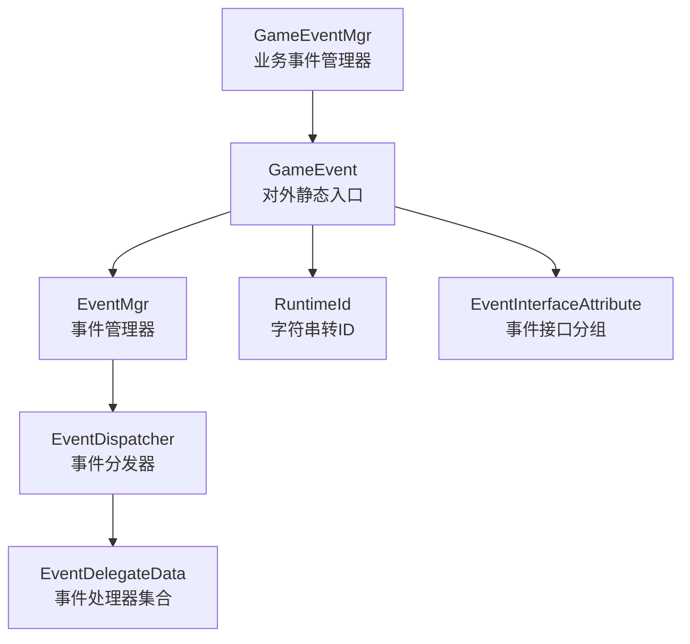
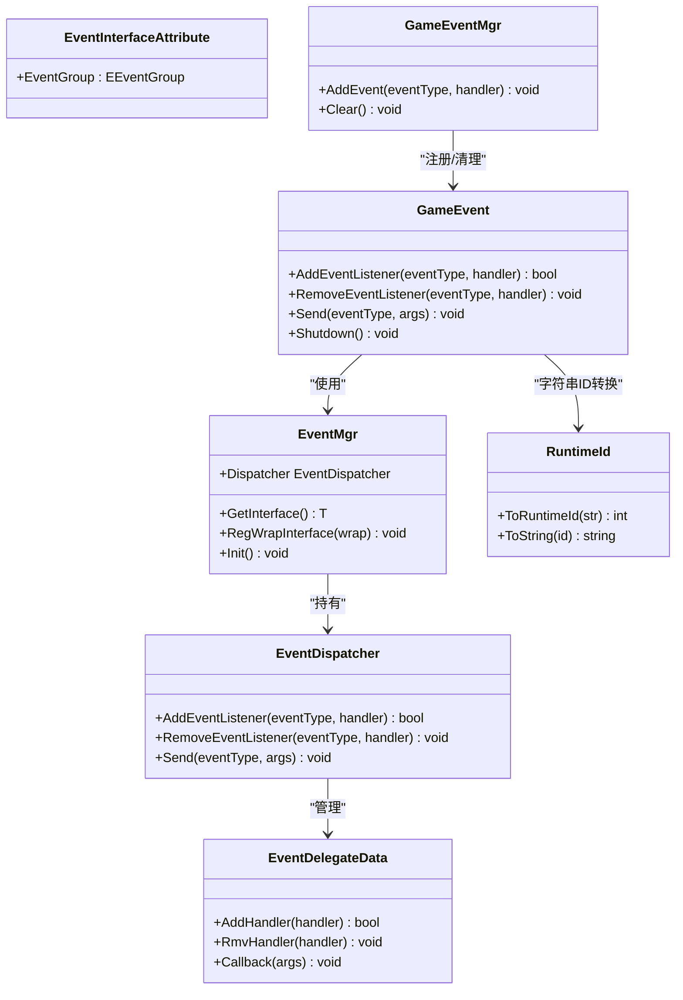
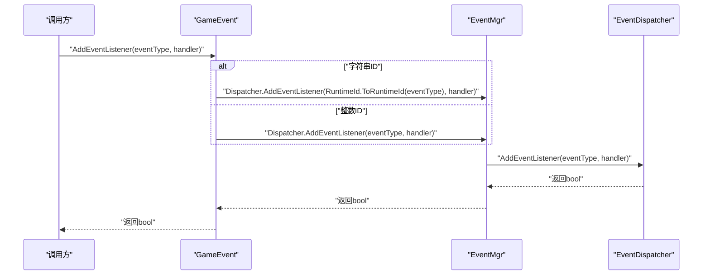
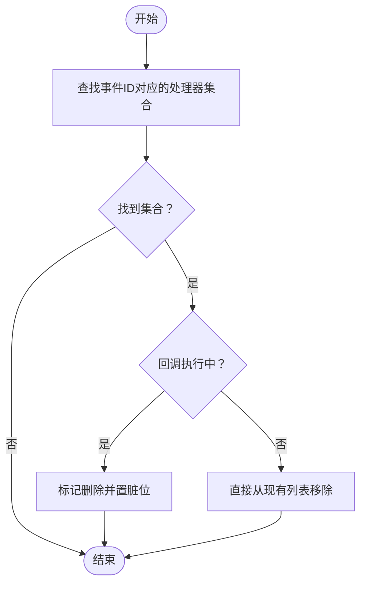
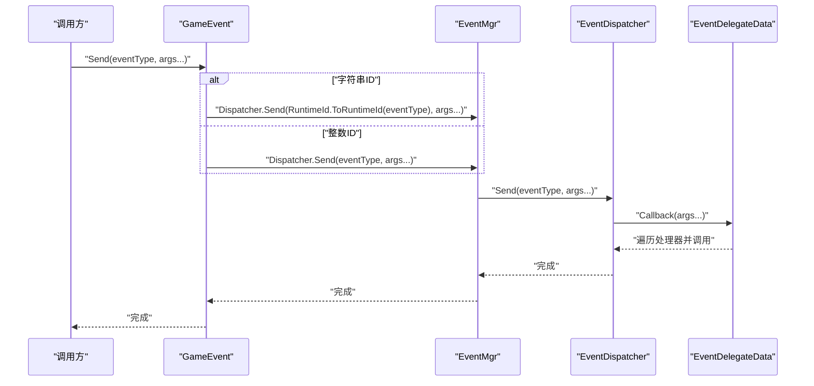
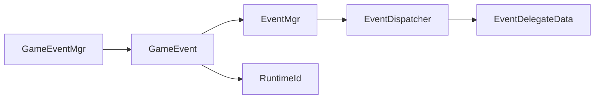

# 事件使用指南

<cite>
**本文引用的文件**
- [GameEvent.cs](file://Assets/TEngine/Runtime/Core/GameEvent/GameEvent.cs)
- [EventDispatcher.cs](file://Assets/TEngine/Runtime/Core/GameEvent/EventDispatcher.cs)
- [EventMgr.cs](file://Assets/TEngine/Runtime/Core/GameEvent/EventMgr.cs)
- [EventDelegateData.cs](file://Assets/TEngine/Runtime/Core/GameEvent/EventDelegateData.cs)
- [RuntimeId.cs](file://Assets/TEngine/Runtime/Core/GameEvent/RuntimeId.cs)
- [EventInterfaceAttribute.cs](file://Assets/TEngine/Runtime/Core/GameEvent/EventInterfaceAttribute.cs)
- [GameEventMgr.cs](file://Assets/TEngine/Runtime/Core/GameEvent/GameEventMgr.cs)
- [ProcedurePreload.cs](file://Assets/GameScripts/Procedure/ProcedurePreload.cs)
</cite>

## 目录
1. [简介](#简介)
2. [项目结构](#项目结构)
3. [核心组件](#核心组件)
4. [架构总览](#架构总览)
5. [详细组件分析](#详细组件分析)
6. [依赖关系分析](#依赖关系分析)
7. [性能考量](#性能考量)
8. [故障排除指南](#故障排除指南)
9. [结论](#结论)
10. [附录：使用示例与最佳实践](#附录使用示例与最佳实践)

## 简介
本指南面向TEngine事件系统使用者，覆盖从事件定义、监听注册、事件触发到调试与优化的完整流程。内容基于仓库中的事件系统实现，重点解释以下方面：
- 监听注册：AddEventListener的多种重载、事件类型命名规范（整数ID与字符串ID）、处理器参数设计
- 事件触发：Send方法的使用、参数传递、异步处理建议
- 最佳实践：命名约定、处理器设计原则、内存管理策略
- 使用示例：UI事件、游戏逻辑事件、网络事件等场景
- 调试技巧：事件日志、处理器跟踪、性能排查

## 项目结构
TEngine事件系统位于运行时核心模块下，主要由以下文件构成：
- GameEvent：对外统一入口，封装静态API（注册、移除、发送）
- EventDispatcher：底层事件分发与注册表
- EventDelegateData：单个事件类型的处理器列表与回调调度
- EventMgr：事件管理器，持有分发器并提供接口注册能力
- RuntimeId：字符串事件名到运行时ID的映射工具
- EventInterfaceAttribute：事件接口分组属性（UI/逻辑）
- GameEventMgr：业务侧事件管理器，用于自动清理与生命周期管理

图示来源
- [GameEvent.cs:1-601](file://Assets/TEngine/Runtime/Core/GameEvent/GameEvent.cs#L1-L601)
- [EventMgr.cs:1-89](file://Assets/TEngine/Runtime/Core/GameEvent/EventMgr.cs#L1-L89)
- [EventDispatcher.cs:1-188](file://Assets/TEngine/Runtime/Core/GameEvent/EventDispatcher.cs#L1-L188)
- [EventDelegateData.cs:1-266](file://Assets/TEngine/Runtime/Core/GameEvent/EventDelegateData.cs#L1-L266)
- [RuntimeId.cs:1-56](file://Assets/TEngine/Runtime/Core/GameEvent/RuntimeId.cs#L1-L56)
- [EventInterfaceAttribute.cs:1-31](file://Assets/TEngine/Runtime/Core/GameEvent/EventInterfaceAttribute.cs#L1-L31)
- [GameEventMgr.cs:1-109](file://Assets/TEngine/Runtime/Core/GameEvent/GameEventMgr.cs#L1-L109)

章节来源
- [GameEvent.cs:1-601](file://Assets/TEngine/Runtime/Core/GameEvent/GameEvent.cs#L1-L601)
- [EventMgr.cs:1-89](file://Assets/TEngine/Runtime/Core/GameEvent/EventMgr.cs#L1-L89)
- [EventDispatcher.cs:1-188](file://Assets/TEngine/Runtime/Core/GameEvent/EventDispatcher.cs#L1-L188)
- [EventDelegateData.cs:1-266](file://Assets/TEngine/Runtime/Core/GameEvent/EventDelegateData.cs#L1-L266)
- [RuntimeId.cs:1-56](file://Assets/TEngine/Runtime/Core/GameEvent/RuntimeId.cs#L1-L56)
- [EventInterfaceAttribute.cs:1-31](file://Assets/TEngine/Runtime/Core/GameEvent/EventInterfaceAttribute.cs#L1-L31)
- [GameEventMgr.cs:1-109](file://Assets/TEngine/Runtime/Core/GameEvent/GameEventMgr.cs#L1-L109)

## 核心组件
- GameEvent：提供静态API，统一管理事件注册、移除与发送；支持整数事件ID与字符串事件ID两种方式
- EventMgr：持有EventDispatcher并提供GetInterface/RegWrapInterface能力，负责事件接口包装与初始化
- EventDispatcher：维护事件ID到处理器集合的字典，提供AddEventListener/RemoveEventListener/Send等分发接口
- EventDelegateData：单个事件ID对应的处理器列表，支持在回调执行期间安全地增删处理器，并在回调结束后批量合并变更
- RuntimeId：将字符串事件名映射为递增的整数ID，便于高效分发与日志输出
- EventInterfaceAttribute：标记事件接口所属分组（UI/逻辑），辅助组织与管理
- GameEventMgr：业务侧事件管理器，记录注册过的事件与处理器，便于统一清理

章节来源
- [GameEvent.cs:1-601](file://Assets/TEngine/Runtime/Core/GameEvent/GameEvent.cs#L1-L601)
- [EventMgr.cs:1-89](file://Assets/TEngine/Runtime/Core/GameEvent/EventMgr.cs#L1-L89)
- [EventDispatcher.cs:1-188](file://Assets/TEngine/Runtime/Core/GameEvent/EventDispatcher.cs#L1-L188)
- [EventDelegateData.cs:1-266](file://Assets/TEngine/Runtime/Core/GameEvent/EventDelegateData.cs#L1-L266)
- [RuntimeId.cs:1-56](file://Assets/TEngine/Runtime/Core/GameEvent/RuntimeId.cs#L1-L56)
- [EventInterfaceAttribute.cs:1-31](file://Assets/TEngine/Runtime/Core/GameEvent/EventInterfaceAttribute.cs#L1-L31)
- [GameEventMgr.cs:1-109](file://Assets/TEngine/Runtime/Core/GameEvent/GameEventMgr.cs#L1-L109)

## 架构总览
事件系统采用“静态入口 + 管理器 + 分发器 + 处理器集合”的分层设计：
- 静态入口：GameEvent集中暴露注册、移除、发送API
- 管理器：EventMgr持有分发器与接口包装表
- 分发器：EventDispatcher维护事件ID到处理器集合的映射
- 处理器集合：EventDelegateData在回调执行期间安全地维护处理器列表

图示来源
- [GameEvent.cs:1-601](file://Assets/TEngine/Runtime/Core/GameEvent/GameEvent.cs#L1-L601)
- [EventMgr.cs:1-89](file://Assets/TEngine/Runtime/Core/GameEvent/EventMgr.cs#L1-L89)
- [EventDispatcher.cs:1-188](file://Assets/TEngine/Runtime/Core/GameEvent/EventDispatcher.cs#L1-L188)
- [EventDelegateData.cs:1-266](file://Assets/TEngine/Runtime/Core/GameEvent/EventDelegateData.cs#L1-L266)
- [RuntimeId.cs:1-56](file://Assets/TEngine/Runtime/Core/GameEvent/RuntimeId.cs#L1-L56)
- [EventInterfaceAttribute.cs:1-31](file://Assets/TEngine/Runtime/Core/GameEvent/EventInterfaceAttribute.cs#L1-L31)
- [GameEventMgr.cs:1-109](file://Assets/TEngine/Runtime/Core/GameEvent/GameEventMgr.cs#L1-L109)

## 详细组件分析

### 监听注册：AddEventListener
- 支持整数事件ID与字符串事件ID两种注册方式
- 提供Action到Action<TArg1,...,TArg6>的多重重载，最多支持6个参数
- 对于字符串事件ID，内部通过RuntimeId转换为整数ID后再注册
- 返回值表示注册是否成功（重复注册会失败）

图示来源
- [GameEvent.cs:20-371](file://Assets/TEngine/Runtime/Core/GameEvent/GameEvent.cs#L20-L371)
- [EventMgr.cs:70-78](file://Assets/TEngine/Runtime/Core/GameEvent/EventMgr.cs#L70-L78)
- [EventDispatcher.cs:24-56](file://Assets/TEngine/Runtime/Core/GameEvent/EventDispatcher.cs#L24-L56)
- [RuntimeId.cs:28-44](file://Assets/TEngine/Runtime/Core/GameEvent/RuntimeId.cs#L28-L44)

章节来源
- [GameEvent.cs:20-371](file://Assets/TEngine/Runtime/Core/GameEvent/GameEvent.cs#L20-L371)
- [EventDispatcher.cs:24-56](file://Assets/TEngine/Runtime/Core/GameEvent/EventDispatcher.cs#L24-L56)
- [RuntimeId.cs:28-44](file://Assets/TEngine/Runtime/Core/GameEvent/RuntimeId.cs#L28-L44)

### 移除监听：RemoveEventListener
- 支持整数与字符串事件ID
- 支持Action与Action<TArg1,...,TArgN>的多重重载
- 若在回调执行中移除处理器，系统会延迟到回调结束再合并删除

图示来源
- [EventDispatcher.cs:43-56](file://Assets/TEngine/Runtime/Core/GameEvent/EventDispatcher.cs#L43-L56)
- [EventDelegateData.cs:56-96](file://Assets/TEngine/Runtime/Core/GameEvent/EventDelegateData.cs#L56-L96)

章节来源
- [EventDispatcher.cs:43-56](file://Assets/TEngine/Runtime/Core/GameEvent/EventDispatcher.cs#L43-L56)
- [EventDelegateData.cs:56-96](file://Assets/TEngine/Runtime/Core/GameEvent/EventDelegateData.cs#L56-L96)

### 事件分发：Send
- 支持无参到最多6参的Send重载
- 字符串事件ID通过RuntimeId转换后分发
- 回调执行期间禁止修改处理器列表，避免并发修改异常

图示来源
- [GameEvent.cs:374-591](file://Assets/TEngine/Runtime/Core/GameEvent/GameEvent.cs#L374-L591)
- [EventMgr.cs:70-78](file://Assets/TEngine/Runtime/Core/GameEvent/EventMgr.cs#L70-L78)
- [EventDispatcher.cs:58-186](file://Assets/TEngine/Runtime/Core/GameEvent/EventDispatcher.cs#L58-L186)
- [EventDelegateData.cs:98-264](file://Assets/TEngine/Runtime/Core/GameEvent/EventDelegateData.cs#L98-L264)
- [RuntimeId.cs:46-54](file://Assets/TEngine/Runtime/Core/GameEvent/RuntimeId.cs#L46-L54)

章节来源
- [GameEvent.cs:374-591](file://Assets/TEngine/Runtime/Core/GameEvent/GameEvent.cs#L374-L591)
- [EventDispatcher.cs:58-186](file://Assets/TEngine/Runtime/Core/GameEvent/EventDispatcher.cs#L58-L186)
- [EventDelegateData.cs:98-264](file://Assets/TEngine/Runtime/Core/GameEvent/EventDelegateData.cs#L98-L264)
- [RuntimeId.cs:46-54](file://Assets/TEngine/Runtime/Core/GameEvent/RuntimeId.cs#L46-L54)

### 事件接口与分组
- EventInterfaceAttribute用于标记事件接口所属分组（UI/逻辑），便于按功能域组织事件
- EventMgr提供GetInterface/RegWrapInterface用于事件接口包装与获取

章节来源
- [EventInterfaceAttribute.cs:1-31](file://Assets/TEngine/Runtime/Core/GameEvent/EventInterfaceAttribute.cs#L1-L31)
- [EventMgr.cs:25-57](file://Assets/TEngine/Runtime/Core/GameEvent/EventMgr.cs#L25-L57)

### 业务事件管理器：GameEventMgr
- 记录所有注册过的事件与处理器，支持统一清理
- 提供AddEvent的多重重载，简化业务侧注册流程

章节来源
- [GameEventMgr.cs:1-109](file://Assets/TEngine/Runtime/Core/GameEvent/GameEventMgr.cs#L1-L109)

## 依赖关系分析
- GameEvent依赖EventMgr，EventMgr持有EventDispatcher
- EventDispatcher依赖EventDelegateData进行处理器集合管理
- GameEvent通过RuntimeId将字符串事件ID转换为整数ID
- GameEventMgr依赖GameEvent进行注册与清理

图示来源
- [GameEvent.cs:1-601](file://Assets/TEngine/Runtime/Core/GameEvent/GameEvent.cs#L1-L601)
- [EventMgr.cs:1-89](file://Assets/TEngine/Runtime/Core/GameEvent/EventMgr.cs#L1-L89)
- [EventDispatcher.cs:1-188](file://Assets/TEngine/Runtime/Core/GameEvent/EventDispatcher.cs#L1-L188)
- [EventDelegateData.cs:1-266](file://Assets/TEngine/Runtime/Core/GameEvent/EventDelegateData.cs#L1-L266)
- [RuntimeId.cs:1-56](file://Assets/TEngine/Runtime/Core/GameEvent/RuntimeId.cs#L1-L56)
- [GameEventMgr.cs:1-109](file://Assets/TEngine/Runtime/Core/GameEvent/GameEventMgr.cs#L1-L109)

章节来源
- [GameEvent.cs:1-601](file://Assets/TEngine/Runtime/Core/GameEvent/GameEvent.cs#L1-L601)
- [EventMgr.cs:1-89](file://Assets/TEngine/Runtime/Core/GameEvent/EventMgr.cs#L1-L89)
- [EventDispatcher.cs:1-188](file://Assets/TEngine/Runtime/Core/GameEvent/EventDispatcher.cs#L1-L188)
- [EventDelegateData.cs:1-266](file://Assets/TEngine/Runtime/Core/GameEvent/EventDelegateData.cs#L1-L266)
- [RuntimeId.cs:1-56](file://Assets/TEngine/Runtime/Core/GameEvent/RuntimeId.cs#L1-L56)
- [GameEventMgr.cs:1-109](file://Assets/TEngine/Runtime/Core/GameEvent/GameEventMgr.cs#L1-L109)

## 性能考量
- 事件ID优先使用整数ID，避免字符串转换开销
- 单次回调过程中避免动态增删处理器，以减少额外的合并成本
- 处理器数量较多时，尽量拆分事件或使用更少参数的事件，降低回调遍历成本
- 使用GameEventMgr统一管理事件注册与清理，防止泄漏

## 故障排除指南
- 重复注册处理器：AddEventListener返回false，检查是否已注册同一处理器
- 移除不存在的处理器：系统会记录致命日志，确认处理器是否正确注册
- 回调期间修改处理器列表：系统会延迟到回调结束再合并，避免并发修改异常
- 字符串事件ID未生效：确认RuntimeId映射是否正确，以及事件ID转换是否一致

章节来源
- [EventDelegateData.cs:32-71](file://Assets/TEngine/Runtime/Core/GameEvent/EventDelegateData.cs#L32-L71)
- [RuntimeId.cs:28-44](file://Assets/TEngine/Runtime/Core/GameEvent/RuntimeId.cs#L28-L44)

## 结论
TEngine事件系统通过清晰的分层设计与完善的生命周期管理，提供了高性能、易扩展的事件机制。遵循本文的命名规范、处理器设计原则与最佳实践，可有效提升系统的稳定性与可维护性。

## 附录：使用示例与最佳实践

### 事件命名约定
- 优先使用整数ID作为事件类型，确保高效分发与日志可读性
- 字符串ID仅用于跨模块共享或临时场景，需保证唯一性与稳定性
- 使用RuntimeId统一管理字符串到整数ID的映射

章节来源
- [RuntimeId.cs:28-44](file://Assets/TEngine/Runtime/Core/GameEvent/RuntimeId.cs#L28-L44)

### 监听注册最佳实践
- 处理器参数尽量控制在6个以内，避免过多参数导致回调开销增大
- 同一处理器不要重复注册，避免重复触发与资源浪费
- 在回调执行期间避免动态增删处理器，如确有需要，使用GameEventMgr统一管理

章节来源
- [GameEvent.cs:20-371](file://Assets/TEngine/Runtime/Core/GameEvent/GameEvent.cs#L20-L371)
- [EventDelegateData.cs:32-96](file://Assets/TEngine/Runtime/Core/GameEvent/EventDelegateData.cs#L32-L96)

### 事件触发与异步处理
- Send支持无参到6参事件，根据实际需求选择合适重载
- 异步事件建议通过处理器内部实现异步逻辑，避免在事件系统中引入线程同步复杂度

章节来源
- [GameEvent.cs:374-591](file://Assets/TEngine/Runtime/Core/GameEvent/GameEvent.cs#L374-L591)
- [EventDispatcher.cs:58-186](file://Assets/TEngine/Runtime/Core/GameEvent/EventDispatcher.cs#L58-L186)

### 场景示例
- UI事件：在UI模块中使用字符串ID定义事件，通过GameEvent.Send触发更新
- 游戏逻辑事件：在逻辑模块中使用整数ID定义事件，通过GameEvent.Send触发状态变化
- 网络事件：在网络模块中定义事件接口，使用EventInterfaceAttribute标注分组，通过EventMgr注册接口包装

章节来源
- [ProcedurePreload.cs:48-48](file://Assets/GameScripts/Procedure/ProcedurePreload.cs#L48-L48)
- [EventInterfaceAttribute.cs:1-31](file://Assets/TEngine/Runtime/Core/GameEvent/EventInterfaceAttribute.cs#L1-L31)
- [EventMgr.cs:25-57](file://Assets/TEngine/Runtime/Core/GameEvent/EventMgr.cs#L25-L57)

### 调试技巧
- 使用RuntimeId.ToString输出事件ID对应的字符串名称，便于日志定位
- 通过GameEventMgr记录注册的事件与处理器，配合Clear在退出时统一清理
- 关注重复注册与移除失败的日志，及时修复处理器生命周期管理

章节来源
- [RuntimeId.cs:46-54](file://Assets/TEngine/Runtime/Core/GameEvent/RuntimeId.cs#L46-L54)
- [GameEventMgr.cs:30-49](file://Assets/TEngine/Runtime/Core/GameEvent/GameEventMgr.cs#L30-L49)
- [EventDelegateData.cs:32-71](file://Assets/TEngine/Runtime/Core/GameEvent/EventDelegateData.cs#L32-L71)