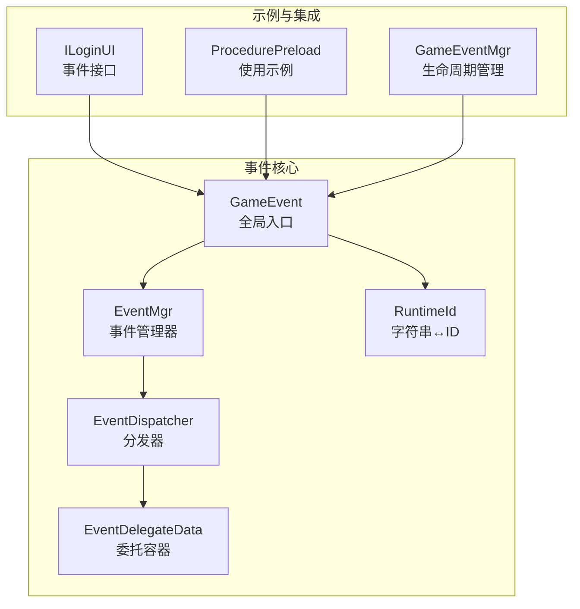
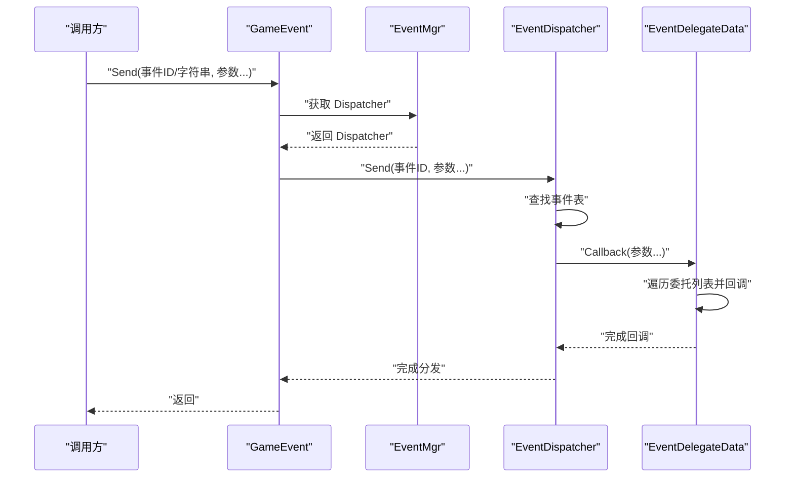
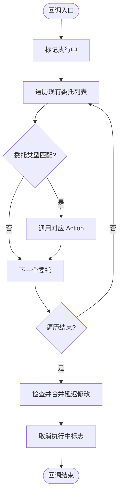
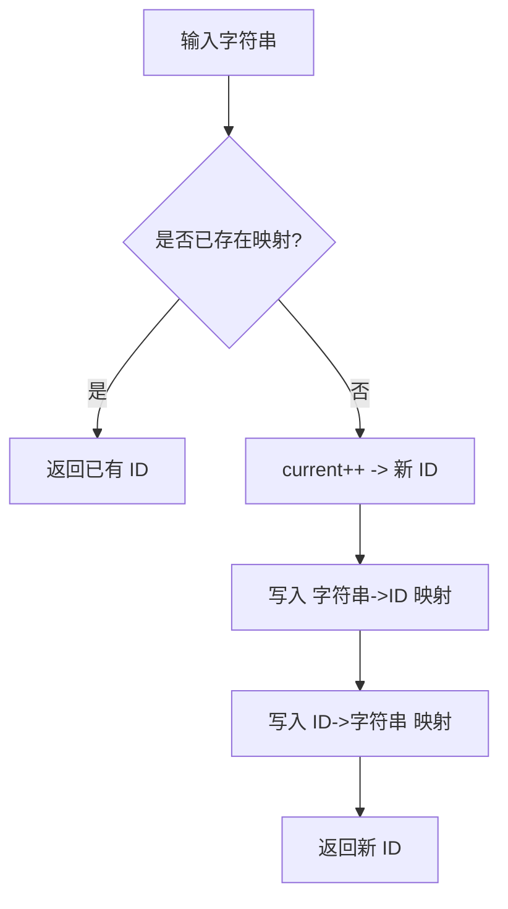
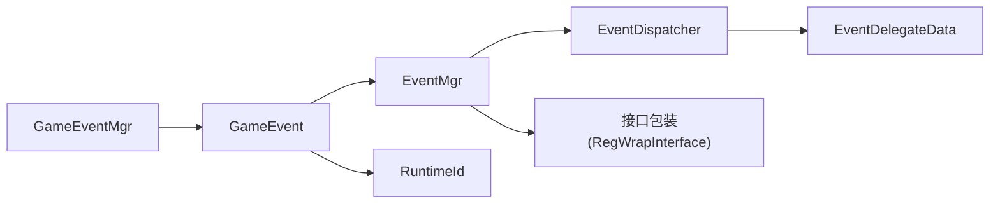

# 事件处理器设计

<cite>
**本文引用的文件**
- [EventDelegateData.cs](file://Assets/TEngine/Runtime/Core/GameEvent/EventDelegateData.cs)
- [EventDispatcher.cs](file://Assets/TEngine/Runtime/Core/GameEvent/EventDispatcher.cs)
- [EventInterfaceAttribute.cs](file://Assets/TEngine/Runtime/Core/GameEvent/EventInterfaceAttribute.cs)
- [RuntimeId.cs](file://Assets/TEngine/Runtime/Core/GameEvent/RuntimeId.cs)
- [GameEvent.cs](file://Assets/TEngine/Runtime/Core/GameEvent/GameEvent.cs)
- [EventMgr.cs](file://Assets/TEngine/Runtime/Core/GameEvent/EventMgr.cs)
- [GameEventMgr.cs](file://Assets/TEngine/Runtime/Core/GameEvent/GameEventMgr.cs)
- [ILoginUI.cs](file://Assets/GameScripts/HotFix/GameLogic/IEvent/ILoginUI.cs)
- [ProcedurePreload.cs](file://Assets/GameScripts/Procedure/ProcedurePreload.cs)
</cite>

## 目录
1. [简介](#简介)
2. [项目结构](#项目结构)
3. [核心组件](#核心组件)
4. [架构总览](#架构总览)
5. [详细组件分析](#详细组件分析)
6. [依赖关系分析](#依赖关系分析)
7. [性能考量](#性能考量)
8. [故障排查指南](#故障排查指南)
9. [结论](#结论)
10. [附录：使用示例与扩展指南](#附录使用示例与扩展指南)

## 简介
本文件系统性阐述 TEngine 事件处理器的设计与实现，覆盖以下主题：
- EventDelegateData 的委托数据封装与执行模型
- 事件接口标记机制与自动绑定思路（EventInterfaceAttribute）
- RuntimeId 的字符串到整数映射、缓存与冲突处理
- 类型安全与泛型委托支持、参数校验策略
- 扩展实践：自定义事件处理器、性能优化建议
- 实际使用示例与常见问题解决方案

## 项目结构
TEngine 事件子系统位于运行时模块的 GameEvent 命名空间下，主要由以下文件构成：
- 事件分发与调度：EventDispatcher、GameEvent
- 事件表与委托容器：EventDelegateData、EventMgr
- 标记与分组：EventInterfaceAttribute
- 运行时 ID：RuntimeId
- 事件管理器封装：GameEventMgr
- 示例接口与使用：ILoginUI、ProcedurePreload

**图表来源**
- [GameEvent.cs:1-601](file://Assets/TEngine/Runtime/Core/GameEvent/GameEvent.cs#L1-L601)
- [EventMgr.cs:1-89](file://Assets/TEngine/Runtime/Core/GameEvent/EventMgr.cs#L1-L89)
- [EventDispatcher.cs:1-188](file://Assets/TEngine/Runtime/Core/GameEvent/EventDispatcher.cs#L1-L188)
- [EventDelegateData.cs:1-266](file://Assets/TEngine/Runtime/Core/GameEvent/EventDelegateData.cs#L1-L266)
- [RuntimeId.cs:1-56](file://Assets/TEngine/Runtime/Core/GameEvent/RuntimeId.cs#L1-L56)
- [ILoginUI.cs:1-12](file://Assets/GameScripts/HotFix/GameLogic/IEvent/ILoginUI.cs#L1-L12)
- [ProcedurePreload.cs:40-175](file://Assets/GameScripts/Procedure/ProcedurePreload.cs#L40-L175)
- [GameEventMgr.cs:1-109](file://Assets/TEngine/Runtime/Core/GameEvent/GameEventMgr.cs#L1-L109)

**章节来源**
- [GameEvent.cs:1-601](file://Assets/TEngine/Runtime/Core/GameEvent/GameEvent.cs#L1-L601)
- [EventMgr.cs:1-89](file://Assets/TEngine/Runtime/Core/GameEvent/EventMgr.cs#L1-L89)
- [EventDispatcher.cs:1-188](file://Assets/TEngine/Runtime/Core/GameEvent/EventDispatcher.cs#L1-L188)
- [EventDelegateData.cs:1-266](file://Assets/TEngine/Runtime/Core/GameEvent/EventDelegateData.cs#L1-L266)
- [RuntimeId.cs:1-56](file://Assets/TEngine/Runtime/Core/GameEvent/RuntimeId.cs#L1-L56)
- [ILoginUI.cs:1-12](file://Assets/GameScripts/HotFix/GameLogic/IEvent/ILoginUI.cs#L1-L12)
- [ProcedurePreload.cs:40-175](file://Assets/GameScripts/Procedure/ProcedurePreload.cs#L40-L175)
- [GameEventMgr.cs:1-109](file://Assets/TEngine/Runtime/Core/GameEvent/GameEventMgr.cs#L1-L109)

## 核心组件
- GameEvent：全局事件入口，提供 AddEventListener、RemoveEventListener、Send 等静态接口，统一转发至 EventMgr.Dispatcher。
- EventMgr：持有事件表与分发器，提供接口包装注册与获取能力。
- EventDispatcher：事件表（字典）+ 分发逻辑，按事件类型查找委托列表并回调。
- EventDelegateData：单个事件类型的委托容器，支持在回调过程中安全地增删委托，采用“延迟修改”策略避免迭代时修改集合。
- RuntimeId：字符串到整数 ID 的映射与缓存，提供正向与逆向查询。
- EventInterfaceAttribute：事件接口标记，用于标注接口分组（如 UI、逻辑），为后续自动绑定或工具链提供元数据。

**章节来源**
- [GameEvent.cs:1-601](file://Assets/TEngine/Runtime/Core/GameEvent/GameEvent.cs#L1-L601)
- [EventMgr.cs:1-89](file://Assets/TEngine/Runtime/Core/GameEvent/EventMgr.cs#L1-L89)
- [EventDispatcher.cs:1-188](file://Assets/TEngine/Runtime/Core/GameEvent/EventDispatcher.cs#L1-L188)
- [EventDelegateData.cs:1-266](file://Assets/TEngine/Runtime/Core/GameEvent/EventDelegateData.cs#L1-L266)
- [RuntimeId.cs:1-56](file://Assets/TEngine/Runtime/Core/GameEvent/RuntimeId.cs#L1-L56)
- [EventInterfaceAttribute.cs:1-31](file://Assets/TEngine/Runtime/Core/GameEvent/EventInterfaceAttribute.cs#L1-L31)

## 架构总览
事件从 GameEvent 进入，经 EventMgr 转发到 EventDispatcher；EventDispatcher 查找 EventDelegateData 并触发回调；RuntimeId 提供字符串到整数 ID 的映射。

**图表来源**
- [GameEvent.cs:385-589](file://Assets/TEngine/Runtime/Core/GameEvent/GameEvent.cs#L385-L589)
- [EventDispatcher.cs:64-184](file://Assets/TEngine/Runtime/Core/GameEvent/EventDispatcher.cs#L64-L184)
- [EventDelegateData.cs:101-264](file://Assets/TEngine/Runtime/Core/GameEvent/EventDelegateData.cs#L101-L264)

## 详细组件分析

### EventDelegateData：委托容器与执行模型
- 设计要点
  - 使用三个列表分离状态：现有委托列表、待添加列表、待删除列表，配合布尔标志控制是否处于回调中。
  - 在回调开始时标记执行中，所有增删操作进入“延迟修改”队列；回调结束后统一合并，保证迭代安全。
  - 支持多参数 Action 泛型重载，按委托类型匹配后调用，实现类型安全的回调分发。
- 关键行为
  - AddHandler：重复添加会记录致命日志并拒绝；若正在回调则加入待添加队列。
  - RmvHandler：若不存在会记录致命日志；若正在回调则加入待删除队列。
  - Callback：根据泛型参数数量选择对应 Action 类型进行回调；完成后检查并合并延迟修改。
- 复杂度
  - 回调复杂度 O(N)，N 为当前事件的委托数量；延迟修改合并为 O(M)，M 为变更条目数。

**图表来源**
- [EventDelegateData.cs:76-114](file://Assets/TEngine/Runtime/Core/GameEvent/EventDelegateData.cs#L76-L114)

**章节来源**
- [EventDelegateData.cs:1-266](file://Assets/TEngine/Runtime/Core/GameEvent/EventDelegateData.cs#L1-L266)

### EventDispatcher：事件表与分发
- 设计要点
  - 以事件 ID（整数）为键，EventDelegateData 为值的字典存储。
  - 对外暴露 AddEventListener、RemoveEventListener、Send 系列方法，支持 0~6 个参数的回调。
- 行为特征
  - 若事件不存在则惰性创建 EventDelegateData。
  - Send 仅在存在委托时触发回调，避免无意义开销。

**章节来源**
- [EventDispatcher.cs:1-188](file://Assets/TEngine/Runtime/Core/GameEvent/EventDispatcher.cs#L1-L188)

### GameEvent：全局入口与类型安全
- 设计要点
  - 静态方法统一转发到 EventMgr.Dispatcher，同时支持字符串事件名与整数事件 ID。
  - 提供多泛型参数版本的 AddEventListener、RemoveEventListener、Send，确保编译期类型安全。
- 使用模式
  - 字符串事件名通过 RuntimeId 转换为整数 ID 后再注册/发送。
  - 与 GameEventMgr 协作，便于生命周期内统一清理。

**章节来源**
- [GameEvent.cs:1-601](file://Assets/TEngine/Runtime/Core/GameEvent/GameEvent.cs#L1-L601)

### EventMgr：接口包装与分发器持有者
- 设计要点
  - 以类型为键的接口包装表，提供 GetInterface 与 RegWrapInterface 方法。
  - 持有 EventDispatcher，并提供 Init 清理接口。
- 注意
  - RegWrapInterface(string, object) 已标记过时，推荐使用泛型版本以减少 GC 并提升类型安全性。

**章节来源**
- [EventMgr.cs:1-89](file://Assets/TEngine/Runtime/Core/GameEvent/EventMgr.cs#L1-L89)

### RuntimeId：字符串到整数 ID 的映射与缓存
- 设计要点
  - 双向字典：字符串→ID、ID→字符串，分别维护两个独立映射表。
  - 自增 ID：首次遇到新字符串时分配递增 ID，并写入两个映射表。
  - 冲突处理：同一字符串多次请求返回相同 ID；不同字符串不会冲突。
- 复杂度
  - 查询与插入均为哈希表操作，期望 O(1)。

**图表来源**
- [RuntimeId.cs:32-44](file://Assets/TEngine/Runtime/Core/GameEvent/RuntimeId.cs#L32-L44)

**章节来源**
- [RuntimeId.cs:1-56](file://Assets/TEngine/Runtime/Core/GameEvent/RuntimeId.cs#L1-L56)

### EventInterfaceAttribute：事件接口标记与自动绑定
- 设计要点
  - 通过特性标记接口，声明其所属事件分组（如 UI、逻辑）。
  - 可作为后续工具链或自动绑定流程的元数据来源，帮助生成事件 ID、接口包装或自动注册。
- 使用示例
  - 接口 ILoginUI 使用该特性标注分组，便于在 UI 模块中统一管理。

**章节来源**
- [EventInterfaceAttribute.cs:1-31](file://Assets/TEngine/Runtime/Core/GameEvent/EventInterfaceAttribute.cs#L1-L31)
- [ILoginUI.cs:1-12](file://Assets/GameScripts/HotFix/GameLogic/IEvent/ILoginUI.cs#L1-L12)

### GameEventMgr：生命周期事件管理
- 设计要点
  - 记录注册过的事件类型与委托，提供 Clear 统一移除，便于模块卸载或场景切换时回收。
  - 与 GameEvent 协作，确保 AddEvent 成功后再登记，避免悬挂监听。

**章节来源**
- [GameEventMgr.cs:1-109](file://Assets/TEngine/Runtime/Core/GameEvent/GameEventMgr.cs#L1-L109)

## 依赖关系分析
- GameEvent 依赖 EventMgr，后者持有 EventDispatcher。
- EventDispatcher 依赖 EventDelegateData。
- GameEvent 通过 RuntimeId 将字符串事件名转换为整数 ID。
- EventMgr 提供接口包装能力，可与事件系统协同工作。
- GameEventMgr 依赖 GameEvent 完成注册与清理。

**图表来源**
- [GameEvent.cs:1-601](file://Assets/TEngine/Runtime/Core/GameEvent/GameEvent.cs#L1-L601)
- [EventMgr.cs:1-89](file://Assets/TEngine/Runtime/Core/GameEvent/EventMgr.cs#L1-L89)
- [EventDispatcher.cs:1-188](file://Assets/TEngine/Runtime/Core/GameEvent/EventDispatcher.cs#L1-L188)
- [EventDelegateData.cs:1-266](file://Assets/TEngine/Runtime/Core/GameEvent/EventDelegateData.cs#L1-L266)
- [RuntimeId.cs:1-56](file://Assets/TEngine/Runtime/Core/GameEvent/RuntimeId.cs#L1-L56)
- [GameEventMgr.cs:1-109](file://Assets/TEngine/Runtime/Core/GameEvent/GameEventMgr.cs#L1-L109)

**章节来源**
- [GameEvent.cs:1-601](file://Assets/TEngine/Runtime/Core/GameEvent/GameEvent.cs#L1-L601)
- [EventMgr.cs:1-89](file://Assets/TEngine/Runtime/Core/GameEvent/EventMgr.cs#L1-L89)
- [EventDispatcher.cs:1-188](file://Assets/TEngine/Runtime/Core/GameEvent/EventDispatcher.cs#L1-L188)
- [EventDelegateData.cs:1-266](file://Assets/TEngine/Runtime/Core/GameEvent/EventDelegateData.cs#L1-L266)
- [RuntimeId.cs:1-56](file://Assets/TEngine/Runtime/Core/GameEvent/RuntimeId.cs#L1-L56)
- [GameEventMgr.cs:1-109](file://Assets/TEngine/Runtime/Core/GameEvent/GameEventMgr.cs#L1-L109)

## 性能考量
- 委托回调成本
  - 回调为线性遍历，委托数量较多时应控制单事件订阅者数量，或拆分事件。
- 延迟修改策略
  - 在回调期间的增删操作被延迟到回调结束，避免迭代器异常，但会带来一次额外的合并开销。
- 字典访问
  - 事件表与 ID 缓存均为哈希表，平均 O(1)；极端情况下可能退化，但概率较低。
- 字符串到 ID
  - 首次映射为 O(1) 平摊，后续命中缓存为 O(1)。
- 建议
  - 避免在高频帧中频繁注册/注销委托；尽量在初始化阶段完成注册。
  - 对于大量同类型事件，考虑分组与命名空间前缀，减少冲突与误用。
  - 使用整数 ID 进行热路径事件分发，字符串仅用于开发调试或配置加载阶段。

[本节为通用指导，无需列出具体文件来源]

## 故障排查指南
- 重复添加委托
  - 现象：日志出现重复添加委托的致命错误。
  - 原因：同一委托被重复注册。
  - 处理：确保只注册一次，或在移除后再注册。
  - 参考
    - [EventDelegateData.cs:34-38](file://Assets/TEngine/Runtime/Core/GameEvent/EventDelegateData.cs#L34-L38)
- 删除不存在的委托
  - 现象：日志出现删除失败且事件 ID 显示为字符串形式。
  - 原因：尝试移除未注册的委托。
  - 处理：确认注册顺序与生命周期，避免提前移除。
  - 参考
    - [EventDelegateData.cs:66-70](file://Assets/TEngine/Runtime/Core/GameEvent/EventDelegateData.cs#L66-L70)
- 字符串事件名未生效
  - 现象：监听不到事件。
  - 原因：字符串事件名未正确映射为整数 ID 或发送/监听不一致。
  - 处理：确保使用同一字符串常量；检查 RuntimeId 输出与事件 ID 是否一致。
  - 参考
    - [GameEvent.cs:212-214](file://Assets/TEngine/Runtime/Core/GameEvent/GameEvent.cs#L212-L214)
    - [RuntimeId.cs:51-54](file://Assets/TEngine/Runtime/Core/GameEvent/RuntimeId.cs#L51-L54)
- 生命周期未清理导致泄漏
  - 现象：模块切换后仍收到旧事件。
  - 处理：使用 GameEventMgr.Clear 或手动 RemoveEventListener。
  - 参考
    - [GameEventMgr.cs:33-49](file://Assets/TEngine/Runtime/Core/GameEvent/GameEventMgr.cs#L33-L49)

**章节来源**
- [EventDelegateData.cs:34-70](file://Assets/TEngine/Runtime/Core/GameEvent/EventDelegateData.cs#L34-L70)
- [GameEvent.cs:212-214](file://Assets/TEngine/Runtime/Core/GameEvent/GameEvent.cs#L212-L214)
- [RuntimeId.cs:51-54](file://Assets/TEngine/Runtime/Core/GameEvent/RuntimeId.cs#L51-L54)
- [GameEventMgr.cs:33-49](file://Assets/TEngine/Runtime/Core/GameEvent/GameEventMgr.cs#L33-L49)

## 结论
TEngine 事件处理器通过清晰的分层设计实现了高性能、类型安全与易用性的平衡：
- 事件表与委托容器分离，延迟修改策略保障了回调过程中的稳定性。
- 字符串到整数 ID 的映射提供了灵活的事件命名与稳定的运行时标识。
- 全局入口 GameEvent 提供统一的注册与分发接口，结合 EventMgr 的接口包装能力，便于模块化与生命周期管理。
- EventInterfaceAttribute 为未来自动化工具链与自动绑定提供基础。

[本节为总结，无需列出具体文件来源]

## 附录：使用示例与扩展指南

### 使用示例
- 发送字符串事件
  - 在流程中通过字符串事件名发送事件，内部自动转换为整数 ID。
  - 参考
    - [ProcedurePreload.cs:48-49](file://Assets/GameScripts/Procedure/ProcedurePreload.cs#L48-L49)
- 注册与移除监听
  - 使用整数 ID 或字符串事件名注册监听；在模块卸载时统一移除。
  - 参考
    - [GameEvent.cs:212-214](file://Assets/TEngine/Runtime/Core/GameEvent/GameEvent.cs#L212-L214)
    - [GameEvent.cs:292-295](file://Assets/TEngine/Runtime/Core/GameEvent/GameEvent.cs#L292-L295)
- 接口事件分组
  - 使用 EventInterfaceAttribute 标注接口分组，便于 UI 或逻辑模块的事件管理。
  - 参考
    - [ILoginUI.cs:5-6](file://Assets/GameScripts/HotFix/GameLogic/IEvent/ILoginUI.cs#L5-L6)

**章节来源**
- [ProcedurePreload.cs:48-49](file://Assets/GameScripts/Procedure/ProcedurePreload.cs#L48-L49)
- [GameEvent.cs:212-214](file://Assets/TEngine/Runtime/Core/GameEvent/GameEvent.cs#L212-L214)
- [GameEvent.cs:292-295](file://Assets/TEngine/Runtime/Core/GameEvent/GameEvent.cs#L292-L295)
- [ILoginUI.cs:5-6](file://Assets/GameScripts/HotFix/GameLogic/IEvent/ILoginUI.cs#L5-L6)

### 扩展指南
- 自定义事件处理器
  - 建议遵循现有分层：在 GameEvent 下新增静态方法，统一转发到 EventMgr.Dispatcher；必要时扩展 EventDelegateData 的回调分支（如支持更多参数）。
  - 参考
    - [GameEvent.cs:385-589](file://Assets/TEngine/Runtime/Core/GameEvent/GameEvent.cs#L385-L589)
    - [EventDispatcher.cs:64-184](file://Assets/TEngine/Runtime/Core/GameEvent/EventDispatcher.cs#L64-L184)
- 类型安全增强
  - 优先使用泛型 Action<T...>，并在 EventDelegateData 中按委托类型精确匹配，避免装箱与反射开销。
  - 参考
    - [EventDelegateData.cs:107-260](file://Assets/TEngine/Runtime/Core/GameEvent/EventDelegateData.cs#L107-L260)
- 性能优化技巧
  - 控制单事件订阅者数量；对高频事件采用整数 ID；避免在热更新或帧循环中频繁注册/注销。
  - 使用 GameEventMgr 统一管理生命周期，防止泄漏。
  - 参考
    - [GameEventMgr.cs:33-49](file://Assets/TEngine/Runtime/Core/GameEvent/GameEventMgr.cs#L33-L49)

**章节来源**
- [GameEvent.cs:385-589](file://Assets/TEngine/Runtime/Core/GameEvent/GameEvent.cs#L385-L589)
- [EventDispatcher.cs:64-184](file://Assets/TEngine/Runtime/Core/GameEvent/EventDispatcher.cs#L64-L184)
- [EventDelegateData.cs:107-260](file://Assets/TEngine/Runtime/Core/GameEvent/EventDelegateData.cs#L107-L260)
- [GameEventMgr.cs:33-49](file://Assets/TEngine/Runtime/Core/GameEvent/GameEventMgr.cs#L33-L49)