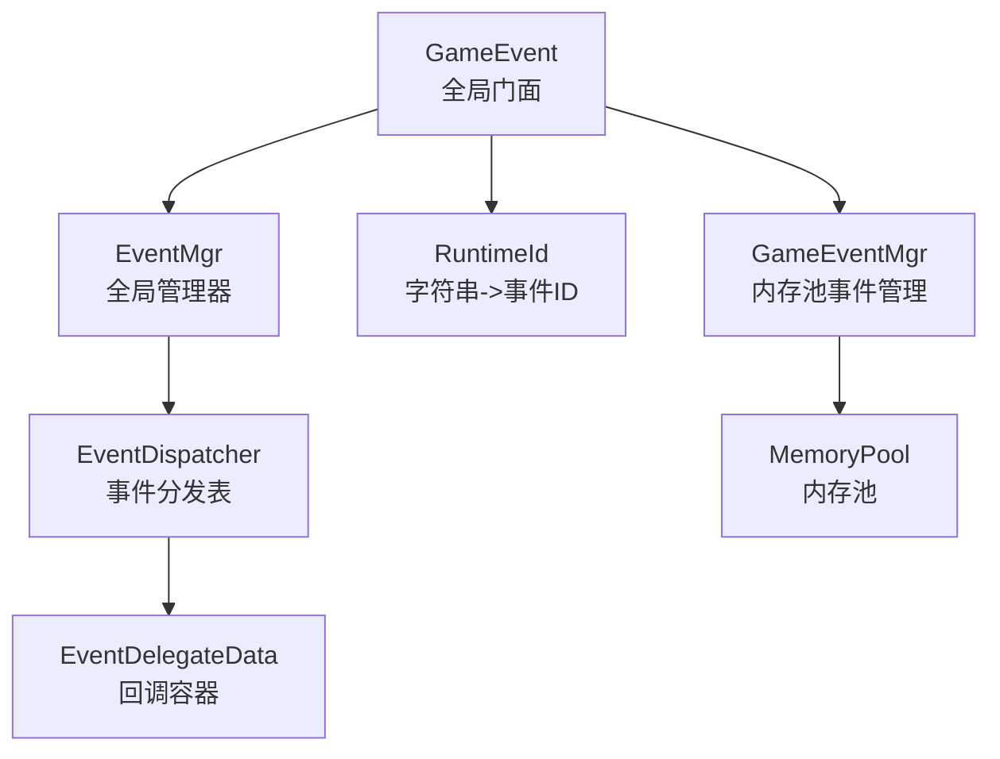
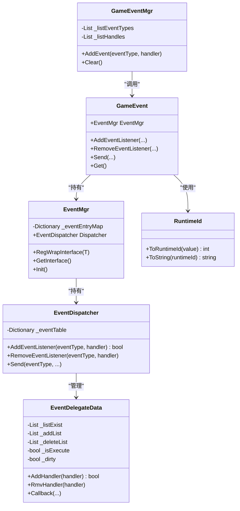
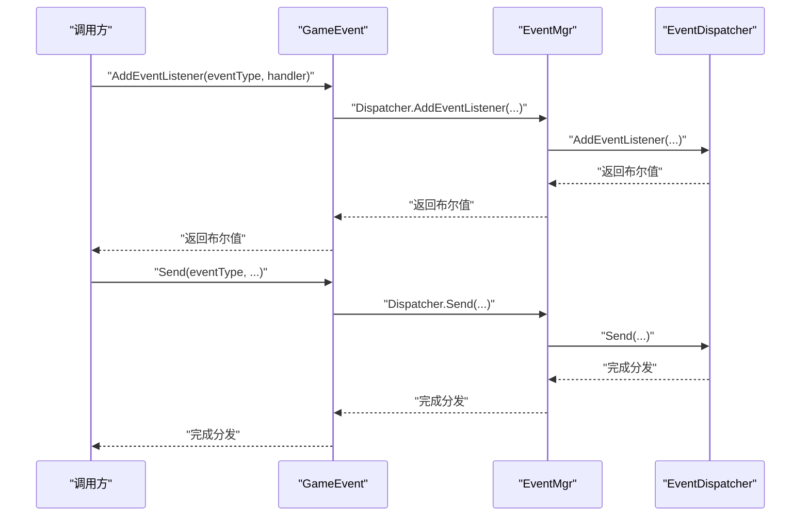
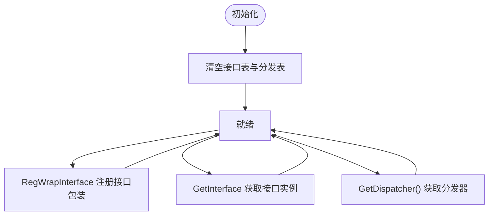
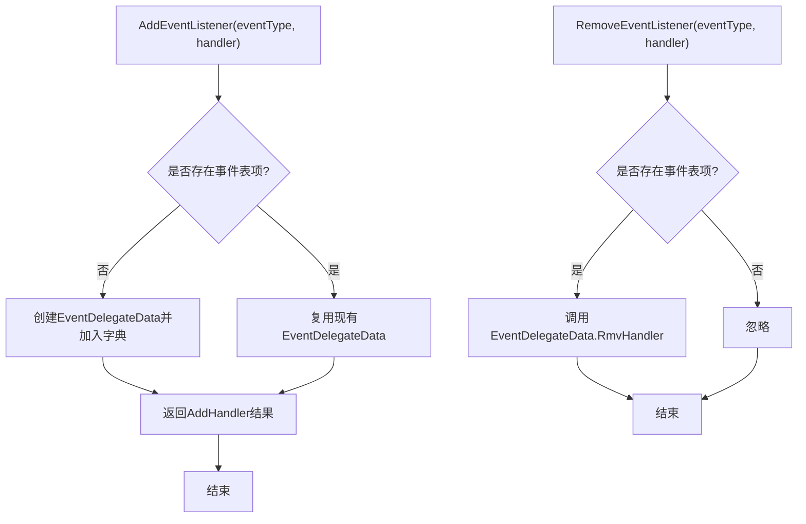
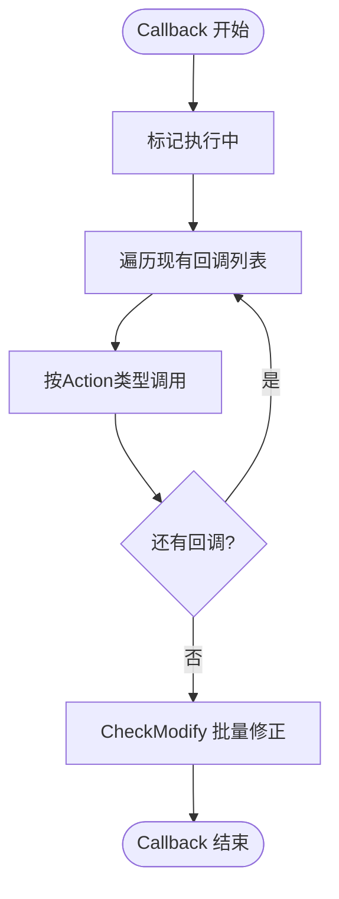
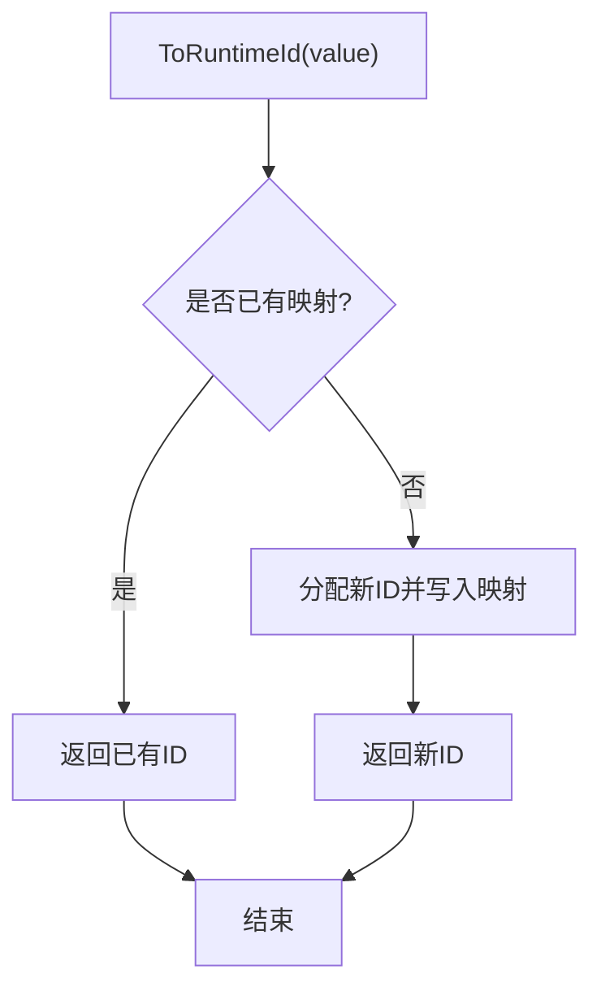
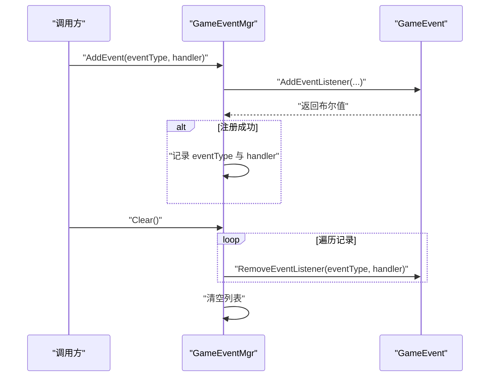
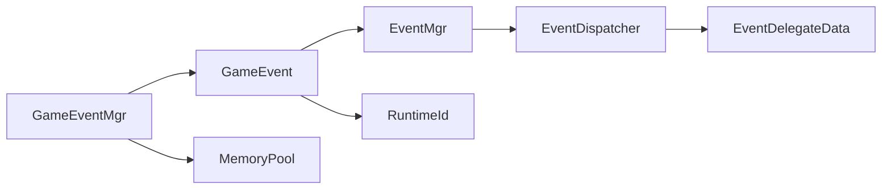

# 事件系统

<cite>
**本文引用的文件**
- [EventMgr.cs](file://Assets/TEngine/Runtime/Core/GameEvent/EventMgr.cs)
- [GameEvent.cs](file://Assets/TEngine/Runtime/Core/GameEvent/GameEvent.cs)
- [EventDispatcher.cs](file://Assets/TEngine/Runtime/Core/GameEvent/EventDispatcher.cs)
- [EventDelegateData.cs](file://Assets/TEngine/Runtime/Core/GameEvent/EventDelegateData.cs)
- [RuntimeId.cs](file://Assets/TEngine/Runtime/Core/GameEvent/RuntimeId.cs)
- [EventInterfaceAttribute.cs](file://Assets/TEngine/Runtime/Core/GameEvent/EventInterfaceAttribute.cs)
- [GameEventMgr.cs](file://Assets/TEngine/Runtime/Core/GameEvent/GameEventMgr.cs)
- [ILoginUI.cs](file://Assets/GameScripts/HotFix/GameLogic/IEvent/ILoginUI.cs)
- [MemoryPool.cs](file://Assets/TEngine/Runtime/Core/MemoryPool/MemoryPool.cs)
- [IMemory.cs](file://Assets/TEngine/Runtime/Core/MemoryPool/IMemory.cs)
- [techContext.md](file://Assets/TEngine/memory-bank/techContext.md)
</cite>

## 目录
1. [简介](#简介)
2. [项目结构](#项目结构)
3. [核心组件](#核心组件)
4. [架构总览](#架构总览)
5. [详细组件分析](#详细组件分析)
6. [依赖关系分析](#依赖关系分析)
7. [性能考量](#性能考量)
8. [故障排查指南](#故障排查指南)
9. [结论](#结论)
10. [附录](#附录)

## 简介
本文件面向TEngine事件系统，系统性阐述全局事件管理的设计原理与实现机制，覆盖事件注册、分发、回调管理、内存回收与性能优化策略，并提供使用指南、调试技巧与最佳实践。事件系统采用“事件ID + 接口封装”的双轨设计：以整型事件ID进行高性能分发；同时通过接口包装与运行时ID映射，提供强类型与可读性更强的事件访问方式。

## 项目结构
事件系统位于TEngine运行时核心模块下，主要文件如下：
- GameEvent：全局入口与静态API门面，统一对外暴露注册、移除、发送事件的接口。
- EventMgr：全局事件管理器，负责接口包装注册与事件分发器的持有。
- EventDispatcher：事件分发表，维护事件ID到回调列表的映射，并负责回调的调度。
- EventDelegateData：单个事件类型的回调容器，支持并发安全的增删与延迟修正。
- RuntimeId：字符串到整型事件ID的映射工具，保证事件ID稳定且可追踪。
- EventInterfaceAttribute：事件接口分组标记，用于源码生成与组织。
- GameEventMgr：基于内存池的事件管理器，便于集中清理与资源回收。
- ILoginUI.cs：事件接口示例，展示如何定义事件接口并标注分组。

**图表来源**
- [GameEvent.cs:1-601](file://Assets/TEngine/Runtime/Core/GameEvent/GameEvent.cs#L1-L601)
- [EventMgr.cs:1-89](file://Assets/TEngine/Runtime/Core/GameEvent/EventMgr.cs#L1-L89)
- [EventDispatcher.cs:1-188](file://Assets/TEngine/Runtime/Core/GameEvent/EventDispatcher.cs#L1-L188)
- [EventDelegateData.cs:1-266](file://Assets/TEngine/Runtime/Core/GameEvent/EventDelegateData.cs#L1-L266)
- [RuntimeId.cs:1-56](file://Assets/TEngine/Runtime/Core/GameEvent/RuntimeId.cs#L1-L56)
- [GameEventMgr.cs:1-109](file://Assets/TEngine/Runtime/Core/GameEvent/GameEventMgr.cs#L1-L109)
- [MemoryPool.cs:1-208](file://Assets/TEngine/Runtime/Core/MemoryPool/MemoryPool.cs#L1-L208)

**章节来源**
- [GameEvent.cs:1-601](file://Assets/TEngine/Runtime/Core/GameEvent/GameEvent.cs#L1-L601)
- [EventMgr.cs:1-89](file://Assets/TEngine/Runtime/Core/GameEvent/EventMgr.cs#L1-L89)
- [EventDispatcher.cs:1-188](file://Assets/TEngine/Runtime/Core/GameEvent/EventDispatcher.cs#L1-L188)
- [EventDelegateData.cs:1-266](file://Assets/TEngine/Runtime/Core/GameEvent/EventDelegateData.cs#L1-L266)
- [RuntimeId.cs:1-56](file://Assets/TEngine/Runtime/Core/GameEvent/RuntimeId.cs#L1-L56)
- [GameEventMgr.cs:1-109](file://Assets/TEngine/Runtime/Core/GameEvent/GameEventMgr.cs#L1-L109)
- [MemoryPool.cs:1-208](file://Assets/TEngine/Runtime/Core/MemoryPool/MemoryPool.cs#L1-L208)

## 核心组件
- GameEvent：提供静态API，统一封装事件注册、移除与发送，支持整型ID与字符串ID两种形式；同时提供接口获取能力（Get<T>）。
- EventMgr：持有事件分发器与接口包装表，提供RegWrapInterface<T>注册接口包装，GetInterface<T>获取接口实例，Init清空状态。
- EventDispatcher：以事件ID为键，维护EventDelegateData；提供AddEventListener、RemoveEventListener与Send系列方法。
- EventDelegateData：内部保存现有回调列表、待添加/删除列表与执行标记，支持在回调执行期间安全地增删回调，并在执行结束后批量修正。
- RuntimeId：维护字符串到事件ID的映射，确保事件ID稳定且可逆向解析为字符串，便于调试与日志。
- EventInterfaceAttribute：标记事件接口所属分组（如UI、逻辑），配合源码生成器使用。
- GameEventMgr：继承IMemory，记录所有注册过的事件与回调，提供Clear集中清理，便于内存回收。
- ILoginUI.cs：事件接口示例，展示如何定义事件接口并标注分组。

**章节来源**
- [GameEvent.cs:1-601](file://Assets/TEngine/Runtime/Core/GameEvent/GameEvent.cs#L1-L601)
- [EventMgr.cs:1-89](file://Assets/TEngine/Runtime/Core/GameEvent/EventMgr.cs#L1-L89)
- [EventDispatcher.cs:1-188](file://Assets/TEngine/Runtime/Core/GameEvent/EventDispatcher.cs#L1-L188)
- [EventDelegateData.cs:1-266](file://Assets/TEngine/Runtime/Core/GameEvent/EventDelegateData.cs#L1-L266)
- [RuntimeId.cs:1-56](file://Assets/TEngine/Runtime/Core/GameEvent/RuntimeId.cs#L1-L56)
- [EventInterfaceAttribute.cs:1-31](file://Assets/TEngine/Runtime/Core/GameEvent/EventInterfaceAttribute.cs#L1-L31)
- [GameEventMgr.cs:1-109](file://Assets/TEngine/Runtime/Core/GameEvent/GameEventMgr.cs#L1-L109)
- [ILoginUI.cs:1-12](file://Assets/GameScripts/HotFix/GameLogic/IEvent/ILoginUI.cs#L1-L12)

## 架构总览
事件系统采用“门面+管理器+分发表+回调容器”的分层架构：
- GameEvent作为门面，屏蔽内部实现细节，提供简洁易用的API。
- EventMgr负责接口包装与分发器持有，承担全局状态管理职责。
- EventDispatcher负责事件ID到回调集合的映射与回调调度。
- EventDelegateData负责回调的并发安全与延迟修正，避免在遍历过程中修改列表导致异常。
- RuntimeId提供稳定的事件ID映射，兼顾性能与可读性。
- GameEventMgr结合内存池，便于集中释放资源，降低GC压力。

**图表来源**
- [GameEvent.cs:1-601](file://Assets/TEngine/Runtime/Core/GameEvent/GameEvent.cs#L1-L601)
- [EventMgr.cs:1-89](file://Assets/TEngine/Runtime/Core/GameEvent/EventMgr.cs#L1-L89)
- [EventDispatcher.cs:1-188](file://Assets/TEngine/Runtime/Core/GameEvent/EventDispatcher.cs#L1-L188)
- [EventDelegateData.cs:1-266](file://Assets/TEngine/Runtime/Core/GameEvent/EventDelegateData.cs#L1-L266)
- [RuntimeId.cs:1-56](file://Assets/TEngine/Runtime/Core/GameEvent/RuntimeId.cs#L1-L56)
- [GameEventMgr.cs:1-109](file://Assets/TEngine/Runtime/Core/GameEvent/GameEventMgr.cs#L1-L109)

## 详细组件分析

### GameEvent：全局门面与API
- 提供整型ID与字符串ID两套API，分别对应Send/AddEventListener/RemoveEventListener等重载。
- 通过EventMgr.Dispatcher完成具体分发与注册。
- 提供Get<T>()接口获取已注册的接口包装实例，结合RegWrapInterface<T>使用。
- Shutdown()调用EventMgr.Init()进行清理。

**图表来源**
- [GameEvent.cs:20-591](file://Assets/TEngine/Runtime/Core/GameEvent/GameEvent.cs#L20-L591)
- [EventMgr.cs:73-78](file://Assets/TEngine/Runtime/Core/GameEvent/EventMgr.cs#L73-L78)
- [EventDispatcher.cs:32-184](file://Assets/TEngine/Runtime/Core/GameEvent/EventDispatcher.cs#L32-L184)

**章节来源**
- [GameEvent.cs:1-601](file://Assets/TEngine/Runtime/Core/GameEvent/GameEvent.cs#L1-L601)

### EventMgr：全局管理器
- 通过字典缓存接口包装，键为接口类型，值为包装对象。
- 提供RegWrapInterface<T>注册接口包装，GetInterface<T>获取接口实例。
- 持有EventDispatcher，提供GetDispatcher()访问分发器。
- Init()清空接口表与分发表，用于系统关闭或重置。

**图表来源**
- [EventMgr.cs:19-87](file://Assets/TEngine/Runtime/Core/GameEvent/EventMgr.cs#L19-L87)

**章节来源**
- [EventMgr.cs:1-89](file://Assets/TEngine/Runtime/Core/GameEvent/EventMgr.cs#L1-L89)

### EventDispatcher：事件分发表
- 以事件ID为键，维护EventDelegateData。
- AddEventListener：若不存在则创建EventDelegateData并加入字典。
- RemoveEventListener：根据事件ID定位EventDelegateData并移除回调。
- Send系列：根据事件ID查找EventDelegateData并调用其Callback(...)。

**图表来源**
- [EventDispatcher.cs:32-54](file://Assets/TEngine/Runtime/Core/GameEvent/EventDispatcher.cs#L32-L54)

**章节来源**
- [EventDispatcher.cs:1-188](file://Assets/TEngine/Runtime/Core/GameEvent/EventDispatcher.cs#L1-L188)

### EventDelegateData：回调容器与并发安全
- 内部维护三张列表：现有回调、待添加、待删除；以及执行标记与脏标记。
- AddHandler：若正在执行回调，则将新增回调加入待添加列表；否则直接加入现有列表。
- RmvHandler：若正在执行回调，则将待删除回调加入待删除列表；否则尝试立即移除。
- Callback：遍历现有回调并按泛型Action类型调用；完成后调用CheckModify批量修正。
- CheckModify：将待添加/待删除列表合并到现有列表，并清除待列表与脏标记。

**图表来源**
- [EventDelegateData.cs:76-96](file://Assets/TEngine/Runtime/Core/GameEvent/EventDelegateData.cs#L76-L96)
- [EventDelegateData.cs:101-264](file://Assets/TEngine/Runtime/Core/GameEvent/EventDelegateData.cs#L101-L264)

**章节来源**
- [EventDelegateData.cs:1-266](file://Assets/TEngine/Runtime/Core/GameEvent/EventDelegateData.cs#L1-L266)

### RuntimeId：事件ID映射
- 维护字符串到事件ID与事件ID到字符串的双向映射。
- ToRuntimeId：首次遇到字符串时分配自增ID并建立映射。
- ToString：根据事件ID查询原始字符串，用于日志与调试。

**图表来源**
- [RuntimeId.cs:32-44](file://Assets/TEngine/Runtime/Core/GameEvent/RuntimeId.cs#L32-L44)

**章节来源**
- [RuntimeId.cs:1-56](file://Assets/TEngine/Runtime/Core/GameEvent/RuntimeId.cs#L1-L56)

### GameEventMgr：内存池事件管理
- 记录所有注册过的事件类型与回调，便于集中清理。
- AddEvent系列：在注册成功后记录到内部列表。
- Clear：遍历记录，调用GameEvent.RemoveEventListener移除回调，并清空列表。
- 与MemoryPool配合，便于在模块卸载或场景切换时回收资源。

**图表来源**
- [GameEventMgr.cs:51-49](file://Assets/TEngine/Runtime/Core/GameEvent/GameEventMgr.cs#L51-L49)
- [MemoryPool.cs:66-101](file://Assets/TEngine/Runtime/Core/MemoryPool/MemoryPool.cs#L66-L101)

**章节来源**
- [GameEventMgr.cs:1-109](file://Assets/TEngine/Runtime/Core/GameEvent/GameEventMgr.cs#L1-L109)
- [MemoryPool.cs:1-208](file://Assets/TEngine/Runtime/Core/MemoryPool/MemoryPool.cs#L1-L208)
- [IMemory.cs:1-14](file://Assets/TEngine/Runtime/Core/MemoryPool/IMemory.cs#L1-L14)

### 事件接口与分组
- EventInterfaceAttribute用于标记事件接口的分组（如UI、逻辑），便于源码生成与组织。
- ILoginUI.cs展示了如何定义事件接口并标注分组，结合源码生成器可生成事件ID常量，提升类型安全与可读性。

**章节来源**
- [EventInterfaceAttribute.cs:1-31](file://Assets/TEngine/Runtime/Core/GameEvent/EventInterfaceAttribute.cs#L1-L31)
- [ILoginUI.cs:1-12](file://Assets/GameScripts/HotFix/GameLogic/IEvent/ILoginUI.cs#L1-L12)

## 依赖关系分析
- GameEvent依赖EventMgr与RuntimeId；EventMgr持有EventDispatcher；EventDispatcher依赖EventDelegateData。
- GameEventMgr依赖GameEvent进行事件注册与移除，并依赖MemoryPool进行资源回收。
- RuntimeId为事件ID提供稳定映射，贯穿事件注册与分发流程。

**图表来源**
- [GameEvent.cs:1-601](file://Assets/TEngine/Runtime/Core/GameEvent/GameEvent.cs#L1-L601)
- [EventMgr.cs:1-89](file://Assets/TEngine/Runtime/Core/GameEvent/EventMgr.cs#L1-L89)
- [EventDispatcher.cs:1-188](file://Assets/TEngine/Runtime/Core/GameEvent/EventDispatcher.cs#L1-L188)
- [EventDelegateData.cs:1-266](file://Assets/TEngine/Runtime/Core/GameEvent/EventDelegateData.cs#L1-L266)
- [RuntimeId.cs:1-56](file://Assets/TEngine/Runtime/Core/GameEvent/RuntimeId.cs#L1-L56)
- [GameEventMgr.cs:1-109](file://Assets/TEngine/Runtime/Core/GameEvent/GameEventMgr.cs#L1-L109)
- [MemoryPool.cs:1-208](file://Assets/TEngine/Runtime/Core/MemoryPool/MemoryPool.cs#L1-L208)

**章节来源**
- [GameEvent.cs:1-601](file://Assets/TEngine/Runtime/Core/GameEvent/GameEvent.cs#L1-L601)
- [EventMgr.cs:1-89](file://Assets/TEngine/Runtime/Core/GameEvent/EventMgr.cs#L1-L89)
- [EventDispatcher.cs:1-188](file://Assets/TEngine/Runtime/Core/GameEvent/EventDispatcher.cs#L1-L188)
- [EventDelegateData.cs:1-266](file://Assets/TEngine/Runtime/Core/GameEvent/EventDelegateData.cs#L1-L266)
- [RuntimeId.cs:1-56](file://Assets/TEngine/Runtime/Core/GameEvent/RuntimeId.cs#L1-L56)
- [GameEventMgr.cs:1-109](file://Assets/TEngine/Runtime/Core/GameEvent/GameEventMgr.cs#L1-L109)
- [MemoryPool.cs:1-208](file://Assets/TEngine/Runtime/Core/MemoryPool/MemoryPool.cs#L1-L208)

## 性能考量
- 事件ID映射：RuntimeId使用自增ID与字典映射，避免频繁字符串比较，提高注册与分发效率。
- 回调容器并发安全：EventDelegateData在回调执行期间采用“待添加/待删除”列表与脏标记，避免遍历过程中的增删操作，降低锁竞争与异常风险。
- 内存回收：GameEventMgr结合MemoryPool，集中记录与清理事件回调，减少GC压力；IMemory接口约定Clear用于回收至内存池。
- 泛型回调：EventDispatcher与EventDelegateData通过Action<T...>泛型回调，减少装箱与反射开销，提升分发性能。
- 事件批处理：通过批量修正机制（CheckModify）在回调执行结束后一次性合并变更，避免频繁修改列表带来的额外成本。

**章节来源**
- [RuntimeId.cs:1-56](file://Assets/TEngine/Runtime/Core/GameEvent/RuntimeId.cs#L1-L56)
- [EventDelegateData.cs:1-266](file://Assets/TEngine/Runtime/Core/GameEvent/EventDelegateData.cs#L1-L266)
- [GameEventMgr.cs:1-109](file://Assets/TEngine/Runtime/Core/GameEvent/GameEventMgr.cs#L1-L109)
- [MemoryPool.cs:1-208](file://Assets/TEngine/Runtime/Core/MemoryPool/MemoryPool.cs#L1-L208)
- [IMemory.cs:1-14](file://Assets/TEngine/Runtime/Core/MemoryPool/IMemory.cs#L1-L14)

## 故障排查指南
- 重复注册回调：EventDelegateData.AddHandler检测到重复回调会记录致命日志，需检查注册逻辑，避免同一回调被多次注册。
- 删除不存在的回调：EventDelegateData.RmvHandler在非执行状态下删除不存在的回调会记录致命日志，需确认回调是否已被移除或未正确注册。
- 回调执行期间修改列表：系统通过“待添加/待删除”列表与脏标记自动修正，但应避免在回调中进行复杂逻辑导致长时间占用执行期。
- 事件ID不一致：若使用字符串ID，请确保字符串完全一致；RuntimeId对字符串进行映射，不同字符串将产生不同ID。
- 内存泄漏：使用GameEventMgr集中管理事件注册，模块卸载时调用Clear移除所有回调，避免悬挂回调导致内存泄漏。

**章节来源**
- [EventDelegateData.cs:34-70](file://Assets/TEngine/Runtime/Core/GameEvent/EventDelegateData.cs#L34-L70)
- [GameEventMgr.cs:33-49](file://Assets/TEngine/Runtime/Core/GameEvent/GameEventMgr.cs#L33-L49)

## 结论
TEngine事件系统通过“整型ID + 接口包装”的双轨设计，在保证高性能的同时提供了良好的类型安全与可读性。EventMgr、EventDispatcher与EventDelegateData形成清晰的分层架构，RuntimeId提供稳定的事件ID映射，GameEventMgr结合内存池实现资源的集中回收。整体设计兼顾并发安全、性能优化与可维护性，适合在大型项目中广泛使用。

## 附录

### 使用指南
- 定义事件接口并标注分组：参考ILoginUI.cs，使用EventInterfaceAttribute标记接口分组。
- 生成事件ID：依据源码生成器规则生成事件ID常量（参考techContext.md中的“添加新事件”步骤）。
- 注册监听：使用GameEvent.AddEventListener注册回调，支持Action与带参Action。
- 触发事件：使用GameEvent.Get<T>()获取接口实例，再调用接口方法触发事件。
- 移除监听：使用GameEvent.RemoveEventListener移除回调。
- 清理资源：模块卸载时调用GameEvent.Shutdown或GameEventMgr.Clear集中清理。

**章节来源**
- [ILoginUI.cs:1-12](file://Assets/GameScripts/HotFix/GameLogic/IEvent/ILoginUI.cs#L1-L12)
- [techContext.md:308-312](file://Assets/TEngine/memory-bank/techContext.md#L308-L312)
- [GameEvent.cs:20-591](file://Assets/TEngine/Runtime/Core/GameEvent/GameEvent.cs#L20-L591)
- [GameEventMgr.cs:33-49](file://Assets/TEngine/Runtime/Core/GameEvent/GameEventMgr.cs#L33-L49)

### 最佳实践
- 优先使用整型事件ID进行高频事件分发，字符串ID仅用于可读性需求。
- 在回调中避免进行耗时操作，必要时拆分为异步任务或延迟执行。
- 使用GameEventMgr集中管理事件注册，模块卸载时务必调用Clear。
- 对于需要跨模块共享的事件接口，合理划分EventInterfaceAttribute分组，便于维护与扩展。
- 利用RuntimeId的字符串->ID映射特性，统一事件命名规范，便于日志与调试。

**章节来源**
- [RuntimeId.cs:1-56](file://Assets/TEngine/Runtime/Core/GameEvent/RuntimeId.cs#L1-L56)
- [EventInterfaceAttribute.cs:1-31](file://Assets/TEngine/Runtime/Core/GameEvent/EventInterfaceAttribute.cs#L1-L31)
- [GameEventMgr.cs:1-109](file://Assets/TEngine/Runtime/Core/GameEvent/GameEventMgr.cs#L1-L109)