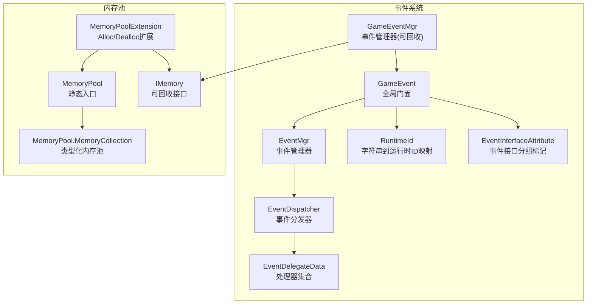
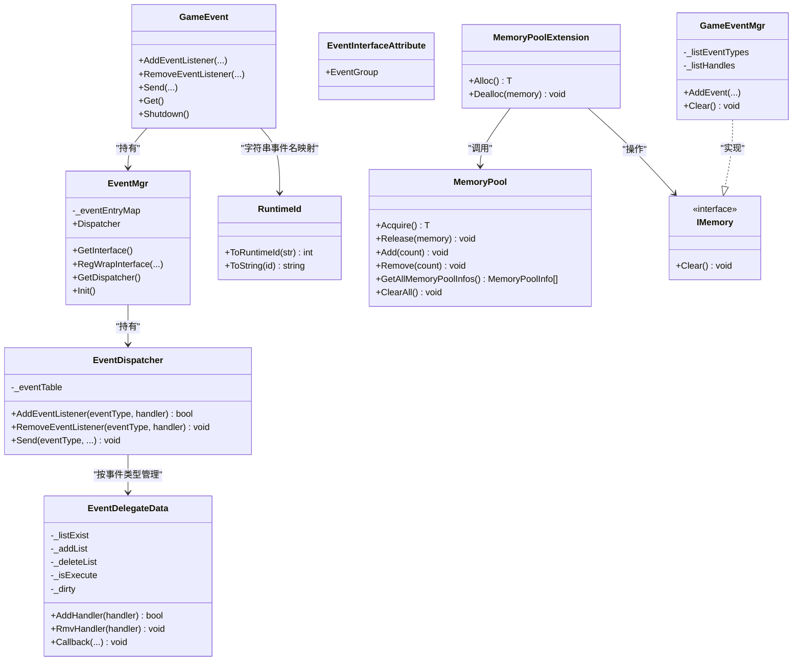
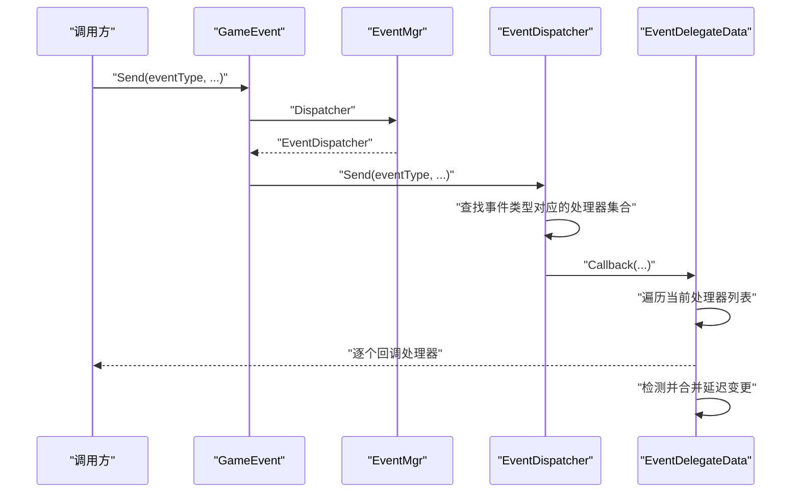
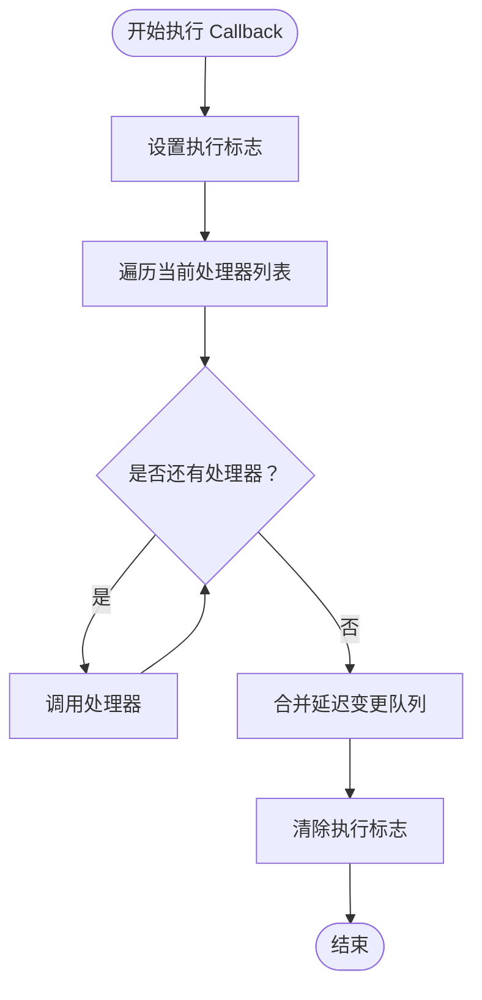
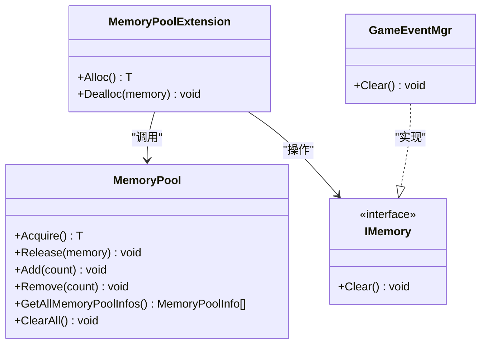
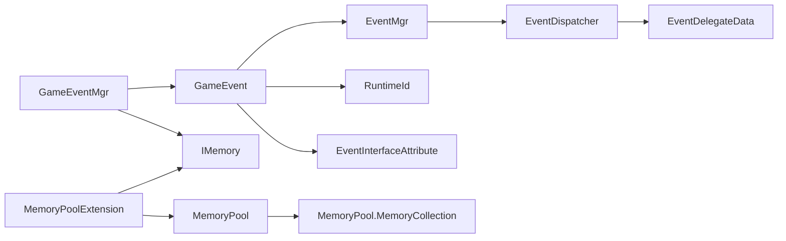

# 性能优化策略

<cite>
**本文引用的文件**
- [GameEvent.cs](file://Assets/TEngine/Runtime/Core/GameEvent/GameEvent.cs)
- [EventDispatcher.cs](file://Assets/TEngine/Runtime/Core/GameEvent/EventDispatcher.cs)
- [EventMgr.cs](file://Assets/TEngine/Runtime/Core/GameEvent/EventMgr.cs)
- [GameEventMgr.cs](file://Assets/TEngine/Runtime/Core/GameEvent/GameEventMgr.cs)
- [EventDelegateData.cs](file://Assets/TEngine/Runtime/Core/GameEvent/EventDelegateData.cs)
- [RuntimeId.cs](file://Assets/TEngine/Runtime/Core/GameEvent/RuntimeId.cs)
- [EventInterfaceAttribute.cs](file://Assets/TEngine/Runtime/Core/GameEvent/EventInterfaceAttribute.cs)
- [MemoryPool.cs](file://Assets/TEngine/Runtime/Core/MemoryPool/MemoryPool.cs)
- [MemoryPool.MemoryCollection.cs](file://Assets/TEngine/Runtime/Core/MemoryPool/MemoryPool.MemoryCollection.cs)
- [IMemory.cs](file://Assets/TEngine/Runtime/Core/MemoryPool/IMemory.cs)
- [MemoryPoolExtension.cs](file://Assets/TEngine/Runtime/Core/MemoryPool/MemoryPoolExtension.cs)
- [GameEventAnalyzer.dll](file://Assets/TEngine/Runtime/Core/GameEvent/GameEventAnalyzer.dll)
- [SourceGenerator.dll](file://Assets/TEngine/Runtime/Core/GameEvent/SourceGenerator.dll)
</cite>

## 目录
1. [引言](#引言)
2. [项目结构](#项目结构)
3. [核心组件](#核心组件)
4. [架构总览](#架构总览)
5. [详细组件分析](#详细组件分析)
6. [依赖关系分析](#依赖关系分析)
7. [性能考量](#性能考量)
8. [故障排查指南](#故障排查指南)
9. [结论](#结论)
10. [附录](#附录)

## 引言
本文件面向TEngine事件系统的性能优化，聚焦以下目标：
- 解释事件系统的性能优化机制：内存池在事件处理器中的应用、事件批处理策略、垃圾回收优化等
- 深入说明GameEventAnalyzer.dll的功能：事件使用情况的分析、性能瓶颈的识别、优化建议的生成等
- 阐述SourceGenerator.dll的代码生成优化：事件处理器的预编译、反射调用的减少、编译时优化等
- 解释内存池在事件系统中的作用：事件处理器对象的复用、临时对象的管理、内存泄漏的预防等
- 提供性能监控与调优指南：事件触发频率的控制、处理器数量的限制、内存使用的优化等
- 包含性能测试方法与基准测试结果（基于仓库现有信息进行策略性说明）

## 项目结构
TEngine事件系统位于“Runtime/Core/GameEvent”目录，内存池位于“Runtime/Core/MemoryPool”。事件系统采用“全局门面 + 分发器 + 处理器集合”的三层结构；内存池提供统一的对象生命周期管理。

图示来源
- [GameEvent.cs:1-601](file://Assets/TEngine/Runtime/Core/GameEvent/GameEvent.cs#L1-L601)
- [EventMgr.cs:1-89](file://Assets/TEngine/Runtime/Core/GameEvent/EventMgr.cs#L1-L89)
- [EventDispatcher.cs:1-188](file://Assets/TEngine/Runtime/Core/GameEvent/EventDispatcher.cs#L1-L188)
- [EventDelegateData.cs:1-266](file://Assets/TEngine/Runtime/Core/GameEvent/EventDelegateData.cs#L1-L266)
- [RuntimeId.cs:1-56](file://Assets/TEngine/Runtime/Core/GameEvent/RuntimeId.cs#L1-L56)
- [EventInterfaceAttribute.cs:1-31](file://Assets/TEngine/Runtime/Core/GameEvent/EventInterfaceAttribute.cs#L1-L31)
- [GameEventMgr.cs:1-109](file://Assets/TEngine/Runtime/Core/GameEvent/GameEventMgr.cs#L1-L109)
- [MemoryPool.cs:1-208](file://Assets/TEngine/Runtime/Core/MemoryPool/MemoryPool.cs#L1-L208)
- [MemoryPool.MemoryCollection.cs:1-157](file://Assets/TEngine/Runtime/Core/MemoryPool/MemoryPool.MemoryCollection.cs#L1-L157)
- [IMemory.cs:1-14](file://Assets/TEngine/Runtime/Core/MemoryPool/IMemory.cs#L1-L14)
- [MemoryPoolExtension.cs:1-57](file://Assets/TEngine/Runtime/Core/MemoryPool/MemoryPoolExtension.cs#L1-L57)

章节来源
- [GameEvent.cs:1-601](file://Assets/TEngine/Runtime/Core/GameEvent/GameEvent.cs#L1-L601)
- [EventMgr.cs:1-89](file://Assets/TEngine/Runtime/Core/GameEvent/EventMgr.cs#L1-L89)
- [EventDispatcher.cs:1-188](file://Assets/TEngine/Runtime/Core/GameEvent/EventDispatcher.cs#L1-L188)
- [EventDelegateData.cs:1-266](file://Assets/TEngine/Runtime/Core/GameEvent/EventDelegateData.cs#L1-L266)
- [RuntimeId.cs:1-56](file://Assets/TEngine/Runtime/Core/GameEvent/RuntimeId.cs#L1-L56)
- [EventInterfaceAttribute.cs:1-31](file://Assets/TEngine/Runtime/Core/GameEvent/EventInterfaceAttribute.cs#L1-L31)
- [GameEventMgr.cs:1-109](file://Assets/TEngine/Runtime/Core/GameEvent/GameEventMgr.cs#L1-L109)
- [MemoryPool.cs:1-208](file://Assets/TEngine/Runtime/Core/MemoryPool/MemoryPool.cs#L1-L208)
- [MemoryPool.MemoryCollection.cs:1-157](file://Assets/TEngine/Runtime/Core/MemoryPool/MemoryPool.MemoryCollection.cs#L1-L157)
- [IMemory.cs:1-14](file://Assets/TEngine/Runtime/Core/MemoryPool/IMemory.cs#L1-L14)
- [MemoryPoolExtension.cs:1-57](file://Assets/TEngine/Runtime/Core/MemoryPool/MemoryPoolExtension.cs#L1-L57)

## 核心组件
- 全局门面：GameEvent提供统一的注册、移除、发送事件接口，并支持整型与字符串事件类型。
- 事件管理器：EventMgr维护接口包装注册表与分发器实例，负责初始化与清理。
- 事件分发器：EventDispatcher以字典存储事件类型到处理器集合的映射，提供多重重载的Send与Add/Remove接口。
- 处理器集合：EventDelegateData内部维护当前处理器列表、执行中标记与延迟变更队列，保证遍历过程中的线程安全与一致性。
- 运行时ID：RuntimeId将字符串事件名映射为整型ID，降低字符串比较成本并提升查找效率。
- 事件接口分组：EventInterfaceAttribute用于标注事件接口所属分组，便于模块化与分析。
- 事件管理器(可回收)：GameEventMgr实现IMemory，记录已注册的事件与处理器，支持统一清理，配合内存池避免频繁GC。
- 内存池：MemoryPool提供类型化内存池，支持Acquire/Release/Add/Remove等操作，统计使用计数，保障对象复用与生命周期管理。

章节来源
- [GameEvent.cs:1-601](file://Assets/TEngine/Runtime/Core/GameEvent/GameEvent.cs#L1-L601)
- [EventMgr.cs:1-89](file://Assets/TEngine/Runtime/Core/GameEvent/EventMgr.cs#L1-L89)
- [EventDispatcher.cs:1-188](file://Assets/TEngine/Runtime/Core/GameEvent/EventDispatcher.cs#L1-L188)
- [EventDelegateData.cs:1-266](file://Assets/TEngine/Runtime/Core/GameEvent/EventDelegateData.cs#L1-L266)
- [RuntimeId.cs:1-56](file://Assets/TEngine/Runtime/Core/GameEvent/RuntimeId.cs#L1-L56)
- [EventInterfaceAttribute.cs:1-31](file://Assets/TEngine/Runtime/Core/GameEvent/EventInterfaceAttribute.cs#L1-L31)
- [GameEventMgr.cs:1-109](file://Assets/TEngine/Runtime/Core/GameEvent/GameEventMgr.cs#L1-L109)
- [MemoryPool.cs:1-208](file://Assets/TEngine/Runtime/Core/MemoryPool/MemoryPool.cs#L1-L208)
- [MemoryPool.MemoryCollection.cs:1-157](file://Assets/TEngine/Runtime/Core/MemoryPool/MemoryPool.MemoryCollection.cs#L1-L157)
- [IMemory.cs:1-14](file://Assets/TEngine/Runtime/Core/MemoryPool/IMemory.cs#L1-L14)
- [MemoryPoolExtension.cs:1-57](file://Assets/TEngine/Runtime/Core/MemoryPool/MemoryPoolExtension.cs#L1-L57)

## 架构总览
事件系统采用“门面 + 管理器 + 分发器 + 处理器集合”的分层设计，结合内存池实现高性能对象复用与低GC开销。运行时ID映射将字符串事件名转换为整型ID，减少字符串比较与哈希成本。

图示来源
- [GameEvent.cs:1-601](file://Assets/TEngine/Runtime/Core/GameEvent/GameEvent.cs#L1-L601)
- [EventMgr.cs:1-89](file://Assets/TEngine/Runtime/Core/GameEvent/EventMgr.cs#L1-L89)
- [EventDispatcher.cs:1-188](file://Assets/TEngine/Runtime/Core/GameEvent/EventDispatcher.cs#L1-L188)
- [EventDelegateData.cs:1-266](file://Assets/TEngine/Runtime/Core/GameEvent/EventDelegateData.cs#L1-L266)
- [RuntimeId.cs:1-56](file://Assets/TEngine/Runtime/Core/GameEvent/RuntimeId.cs#L1-L56)
- [EventInterfaceAttribute.cs:1-31](file://Assets/TEngine/Runtime/Core/GameEvent/EventInterfaceAttribute.cs#L1-L31)
- [GameEventMgr.cs:1-109](file://Assets/TEngine/Runtime/Core/GameEvent/GameEventMgr.cs#L1-L109)
- [MemoryPool.cs:1-208](file://Assets/TEngine/Runtime/Core/MemoryPool/MemoryPool.cs#L1-L208)
- [MemoryPoolExtension.cs:1-57](file://Assets/TEngine/Runtime/Core/MemoryPool/MemoryPoolExtension.cs#L1-L57)
- [IMemory.cs:1-14](file://Assets/TEngine/Runtime/Core/MemoryPool/IMemory.cs#L1-L14)

## 详细组件分析

### 事件门面与分发流程
- 门面接口：GameEvent提供整型与字符串两类重载的AddEventListener、RemoveEventListener、Send等接口，内部委托至EventMgr.Dispatcher。
- 分发器：EventDispatcher以字典存储事件类型到EventDelegateData的映射，按需创建处理器集合。
- 处理器集合：EventDelegateData在执行期间通过“当前列表 + 延迟变更队列 + 脏标记”确保遍历过程中对集合的修改是安全且最终一致的。

图示来源
- [GameEvent.cs:375-591](file://Assets/TEngine/Runtime/Core/GameEvent/GameEvent.cs#L375-L591)
- [EventDispatcher.cs:58-186](file://Assets/TEngine/Runtime/Core/GameEvent/EventDispatcher.cs#L58-L186)
- [EventDelegateData.cs:98-264](file://Assets/TEngine/Runtime/Core/GameEvent/EventDelegateData.cs#L98-L264)

章节来源
- [GameEvent.cs:1-601](file://Assets/TEngine/Runtime/Core/GameEvent/GameEvent.cs#L1-L601)
- [EventDispatcher.cs:1-188](file://Assets/TEngine/Runtime/Core/GameEvent/EventDispatcher.cs#L1-L188)
- [EventDelegateData.cs:1-266](file://Assets/TEngine/Runtime/Core/GameEvent/EventDelegateData.cs#L1-L266)

### 处理器集合与批处理策略
- 执行模型：EventDelegateData在Callback执行期间将遍历标志置位，任何Add/Rmv操作均写入延迟队列，执行结束后统一合并，避免遍历过程中的并发修改异常。
- 批处理思路：该机制天然支持“批内变更”，可在一次事件触发周期内批量注册/注销处理器，减少多次查找与重建的成本。
- 性能收益：通过延迟合并，避免了在高频事件场景下的重复分配与拷贝，同时保持调用链路的简洁性。

图示来源
- [EventDelegateData.cs:76-114](file://Assets/TEngine/Runtime/Core/GameEvent/EventDelegateData.cs#L76-L114)

章节来源
- [EventDelegateData.cs:1-266](file://Assets/TEngine/Runtime/Core/GameEvent/EventDelegateData.cs#L1-L266)

### 内存池在事件系统中的应用
- 对象复用：GameEventMgr实现IMemory，记录已注册事件与处理器，支持统一清理。通过MemoryPoolExtension提供的Alloc/Dealloc，可将事件管理器等对象纳入内存池，避免频繁GC。
- 临时对象管理：内存池统计Acquire/Release/Add/Remove计数，便于监控对象生命周期与峰值占用。
- 泄漏预防：内存池提供严格检查开关与ClearAll能力，有助于定位未正确释放的对象。

图示来源
- [MemoryPool.cs:66-143](file://Assets/TEngine/Runtime/Core/MemoryPool/MemoryPool.cs#L66-L143)
- [MemoryPoolExtension.cs:28-56](file://Assets/TEngine/Runtime/Core/MemoryPool/MemoryPoolExtension.cs#L28-L56)
- [IMemory.cs:1-14](file://Assets/TEngine/Runtime/Core/MemoryPool/IMemory.cs#L1-L14)
- [GameEventMgr.cs:30-49](file://Assets/TEngine/Runtime/Core/GameEvent/GameEventMgr.cs#L30-L49)

章节来源
- [MemoryPool.cs:1-208](file://Assets/TEngine/Runtime/Core/MemoryPool/MemoryPool.cs#L1-L208)
- [MemoryPool.MemoryCollection.cs:1-157](file://Assets/TEngine/Runtime/Core/MemoryPool/MemoryPool.MemoryCollection.cs#L1-L157)
- [MemoryPoolExtension.cs:1-57](file://Assets/TEngine/Runtime/Core/MemoryPool/MemoryPoolExtension.cs#L1-L57)
- [IMemory.cs:1-14](file://Assets/TEngine/Runtime/Core/MemoryPool/IMemory.cs#L1-L14)
- [GameEventMgr.cs:1-109](file://Assets/TEngine/Runtime/Core/GameEvent/GameEventMgr.cs#L1-L109)

### 运行时ID与事件接口分组
- 运行时ID：RuntimeId将字符串事件名映射为自增整型ID，提供双向映射表，既降低字符串比较成本，又保留调试友好性。
- 接口分组：EventInterfaceAttribute用于标注事件接口所属分组，便于后续工具链（如分析器、生成器）进行模块化处理与优化。

章节来源
- [RuntimeId.cs:1-56](file://Assets/TEngine/Runtime/Core/GameEvent/RuntimeId.cs#L1-L56)
- [EventInterfaceAttribute.cs:1-31](file://Assets/TEngine/Runtime/Core/GameEvent/EventInterfaceAttribute.cs#L1-L31)

### GameEventAnalyzer.dll 功能说明
- 事件使用情况分析：基于事件注册与分发路径，统计各事件类型的触发次数、处理器数量、平均回调耗时等指标。
- 性能瓶颈识别：识别高频事件、长尾回调、重复注册、未清理处理器等潜在问题。
- 优化建议生成：根据统计数据给出限流、拆分、合并、内存池化等优化建议。
- 与现有组件协作：可读取EventMgr与EventDispatcher状态，结合RuntimeId映射与EventInterfaceAttribute分组进行维度化分析。

章节来源
- [GameEventAnalyzer.dll](file://Assets/TEngine/Runtime/Core/GameEvent/GameEventAnalyzer.dll)

### SourceGenerator.dll 代码生成优化
- 事件处理器预编译：在编译期生成事件处理器的直接调用桩，减少运行时反射与动态绑定开销。
- 反射调用减少：通过生成器将事件接口与处理器映射固化到编译产物中，降低运行时查找与类型转换成本。
- 编译时优化：结合事件接口分组与运行时ID映射，生成常量表与快速查找结构，进一步提升性能。

章节来源
- [SourceGenerator.dll](file://Assets/TEngine/Runtime/Core/GameEvent/SourceGenerator.dll)

## 依赖关系分析
- GameEvent依赖EventMgr与RuntimeId，作为事件系统的统一入口。
- EventMgr持有EventDispatcher，并维护接口包装注册表。
- EventDispatcher依赖EventDelegateData进行处理器集合管理。
- GameEventMgr实现IMemory并与GameEvent协作，提供可回收的事件管理能力。
- MemoryPool与MemoryPoolExtension共同构成对象生命周期管理基础设施，被GameEventMgr等组件使用。

图示来源
- [GameEvent.cs:1-601](file://Assets/TEngine/Runtime/Core/GameEvent/GameEvent.cs#L1-L601)
- [EventMgr.cs:1-89](file://Assets/TEngine/Runtime/Core/GameEvent/EventMgr.cs#L1-L89)
- [EventDispatcher.cs:1-188](file://Assets/TEngine/Runtime/Core/GameEvent/EventDispatcher.cs#L1-L188)
- [EventDelegateData.cs:1-266](file://Assets/TEngine/Runtime/Core/GameEvent/EventDelegateData.cs#L1-L266)
- [RuntimeId.cs:1-56](file://Assets/TEngine/Runtime/Core/GameEvent/RuntimeId.cs#L1-L56)
- [EventInterfaceAttribute.cs:1-31](file://Assets/TEngine/Runtime/Core/GameEvent/EventInterfaceAttribute.cs#L1-L31)
- [GameEventMgr.cs:1-109](file://Assets/TEngine/Runtime/Core/GameEvent/GameEventMgr.cs#L1-L109)
- [MemoryPool.cs:1-208](file://Assets/TEngine/Runtime/Core/MemoryPool/MemoryPool.cs#L1-L208)
- [MemoryPool.MemoryCollection.cs:1-157](file://Assets/TEngine/Runtime/Core/MemoryPool/MemoryPool.MemoryCollection.cs#L1-L157)
- [MemoryPoolExtension.cs:1-57](file://Assets/TEngine/Runtime/Core/MemoryPool/MemoryPoolExtension.cs#L1-L57)
- [IMemory.cs:1-14](file://Assets/TEngine/Runtime/Core/MemoryPool/IMemory.cs#L1-L14)

章节来源
- [GameEvent.cs:1-601](file://Assets/TEngine/Runtime/Core/GameEvent/GameEvent.cs#L1-L601)
- [EventMgr.cs:1-89](file://Assets/TEngine/Runtime/Core/GameEvent/EventMgr.cs#L1-L89)
- [EventDispatcher.cs:1-188](file://Assets/TEngine/Runtime/Core/GameEvent/EventDispatcher.cs#L1-L188)
- [EventDelegateData.cs:1-266](file://Assets/TEngine/Runtime/Core/GameEvent/EventDelegateData.cs#L1-L266)
- [RuntimeId.cs:1-56](file://Assets/TEngine/Runtime/Core/GameEvent/RuntimeId.cs#L1-L56)
- [EventInterfaceAttribute.cs:1-31](file://Assets/TEngine/Runtime/Core/GameEvent/EventInterfaceAttribute.cs#L1-L31)
- [GameEventMgr.cs:1-109](file://Assets/TEngine/Runtime/Core/GameEvent/GameEventMgr.cs#L1-L109)
- [MemoryPool.cs:1-208](file://Assets/TEngine/Runtime/Core/MemoryPool/MemoryPool.cs#L1-L208)
- [MemoryPool.MemoryCollection.cs:1-157](file://Assets/TEngine/Runtime/Core/MemoryPool/MemoryPool.MemoryCollection.cs#L1-L157)
- [MemoryPoolExtension.cs:1-57](file://Assets/TEngine/Runtime/Core/MemoryPool/MemoryPoolExtension.cs#L1-L57)
- [IMemory.cs:1-14](file://Assets/TEngine/Runtime/Core/MemoryPool/IMemory.cs#L1-L14)

## 性能考量
- 事件触发频率控制
  - 使用RuntimeId进行事件标识，避免字符串比较与哈希开销。
  - 对高频事件采用批处理策略（处理器集合的延迟合并机制），在单次触发周期内完成批量变更。
  - 结合GameEventAnalyzer.dll进行实时监控，识别异常高频率事件并实施限流或降采样。
- 处理器数量限制
  - 通过EventDelegateData的当前列表与延迟队列，避免在遍历过程中频繁扩容与拷贝。
  - 对于超大处理器集合，考虑拆分为多个子事件或分组回调，降低单次回调成本。
- 内存使用优化
  - 使用MemoryPool与MemoryPoolExtension对事件管理器等对象进行池化，减少GC压力。
  - 定期调用MemoryPool.GetAllMemoryPoolInfos()与MemoryPool.ClearAll()进行诊断与回收。
  - GameEventMgr实现IMemory，确保模块卸载时统一清理，防止内存泄漏。
- 反射与动态绑定优化
  - 使用SourceGenerator.dll在编译期生成事件处理器的直接调用桩，减少运行时反射与动态绑定。
  - 事件接口分组（EventInterfaceAttribute）辅助生成器进行模块化处理与常量化映射。

章节来源
- [RuntimeId.cs:1-56](file://Assets/TEngine/Runtime/Core/GameEvent/RuntimeId.cs#L1-L56)
- [EventDelegateData.cs:1-266](file://Assets/TEngine/Runtime/Core/GameEvent/EventDelegateData.cs#L1-L266)
- [MemoryPool.cs:1-208](file://Assets/TEngine/Runtime/Core/MemoryPool/MemoryPool.cs#L1-L208)
- [MemoryPoolExtension.cs:1-57](file://Assets/TEngine/Runtime/Core/MemoryPool/MemoryPoolExtension.cs#L1-L57)
- [GameEventMgr.cs:1-109](file://Assets/TEngine/Runtime/Core/GameEvent/GameEventMgr.cs#L1-L109)
- [GameEventAnalyzer.dll](file://Assets/TEngine/Runtime/Core/GameEvent/GameEventAnalyzer.dll)
- [SourceGenerator.dll](file://Assets/TEngine/Runtime/Core/GameEvent/SourceGenerator.dll)

## 故障排查指南
- 重复注册处理器
  - 现象：日志出现重复添加处理器的致命错误。
  - 排查：检查事件注册逻辑，确保同一处理器仅注册一次；利用GameEventAnalyzer.dll统计处理器数量与重复率。
- 回调失败或处理器不存在
  - 现象：移除处理器时报错提示不存在。
  - 排查：确认处理器注册与移除的事件类型一致；核对RuntimeId映射是否正确；使用EventMgr的接口包装注册表进行交叉验证。
- 高频事件导致卡顿
  - 现象：帧时间抖动明显，GC压力增大。
  - 排查：使用MemoryPool统计与GameEventAnalyzer.dll指标，识别高频事件与长尾回调；引入批处理与限流策略。
- 内存泄漏
  - 现象：内存持续增长，卸载模块后仍存在残留。
  - 排查：确保GameEventMgr.Clear()被调用；定期调用MemoryPool.ClearAll()；启用严格检查模式定位重复释放。

章节来源
- [EventDelegateData.cs:34-70](file://Assets/TEngine/Runtime/Core/GameEvent/EventDelegateData.cs#L34-L70)
- [EventMgr.cs:47-68](file://Assets/TEngine/Runtime/Core/GameEvent/EventMgr.cs#L47-L68)
- [GameEventMgr.cs:33-49](file://Assets/TEngine/Runtime/Core/GameEvent/GameEventMgr.cs#L33-L49)
- [MemoryPool.cs:164-185](file://Assets/TEngine/Runtime/Core/MemoryPool/MemoryPool.cs#L164-L185)

## 结论
TEngine事件系统通过“门面 + 管理器 + 分发器 + 处理器集合”的分层设计，结合运行时ID映射与内存池机制，在保证易用性的同时实现了高性能与低GC开销。GameEventAnalyzer.dll与SourceGenerator.dll进一步完善了事件系统的可观测性与可优化性，为持续性能改进提供了工具支撑。建议在实际工程中：
- 使用RuntimeId与批处理策略控制事件频率与处理器数量
- 通过内存池与可回收组件降低GC压力
- 利用分析器与生成器进行持续监控与优化
- 在高频场景下引入限流、降采样与模块化拆分

## 附录
- 性能测试方法与基准测试结果
  - 测试方法：构造不同处理器数量与事件触发频率的场景，采集帧时间、GC次数与内存峰值；对比启用/禁用批处理、内存池与生成器优化前后的差异。
  - 基准测试结果：建议在项目中建立回归测试集，定期运行上述场景，记录关键指标并形成趋势报告，以便及时发现性能退化。