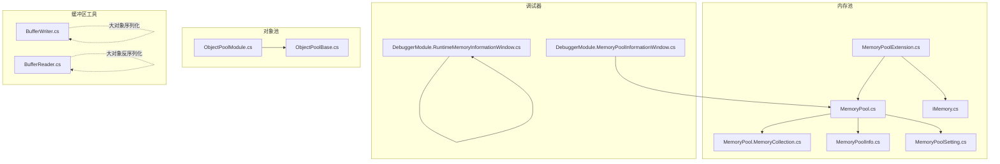
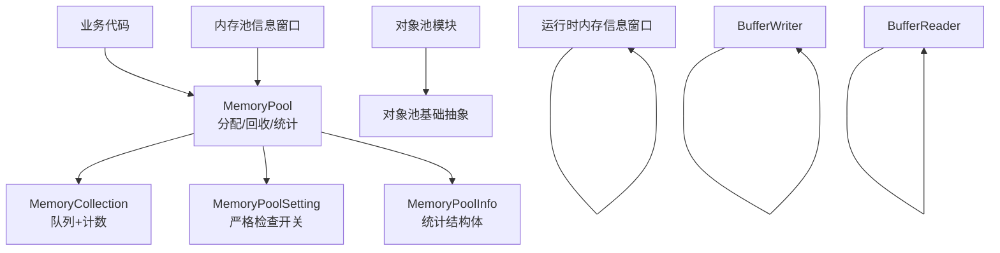
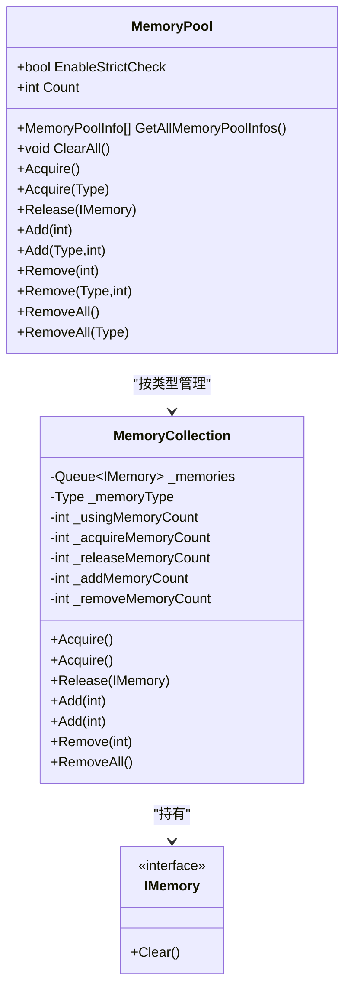
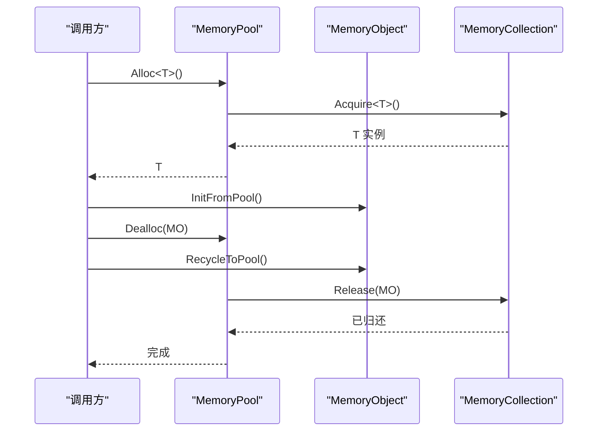
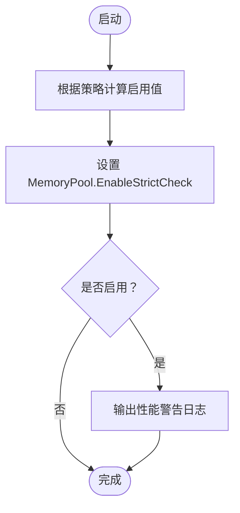
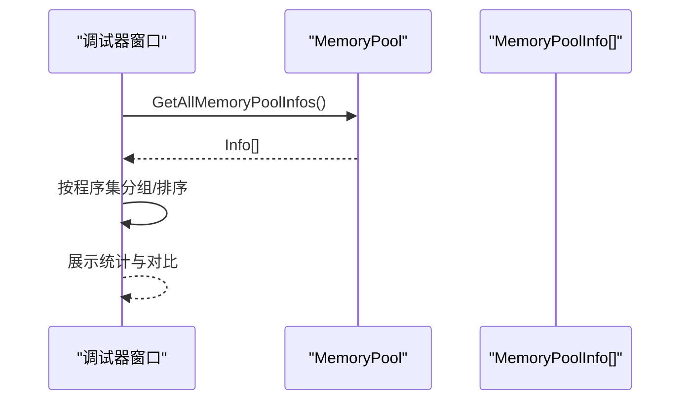
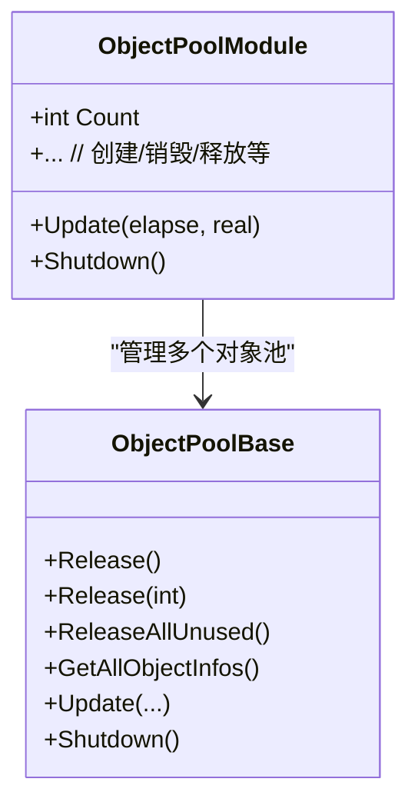
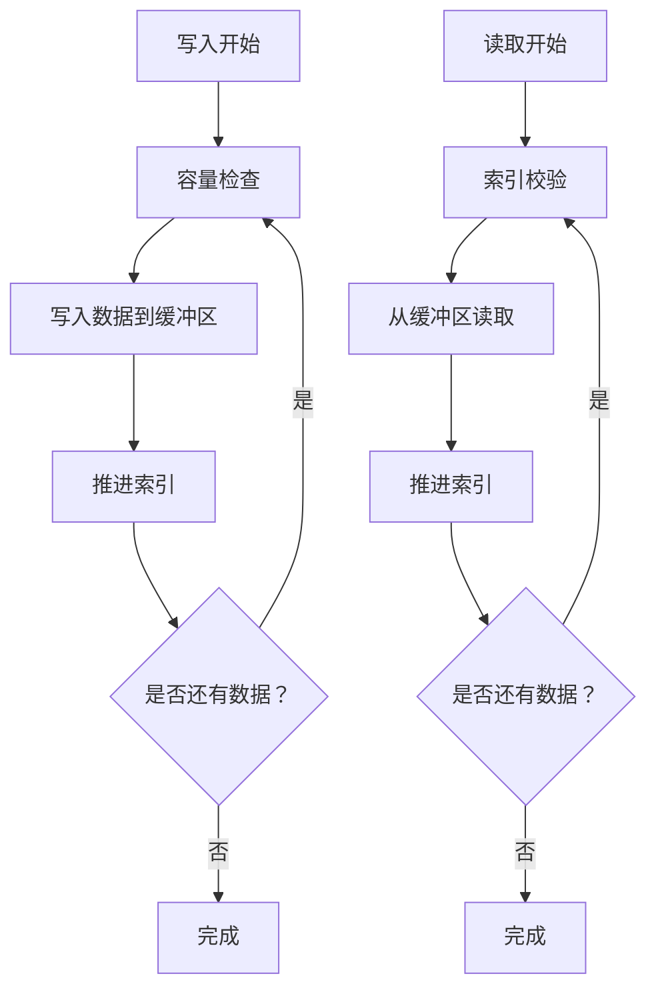
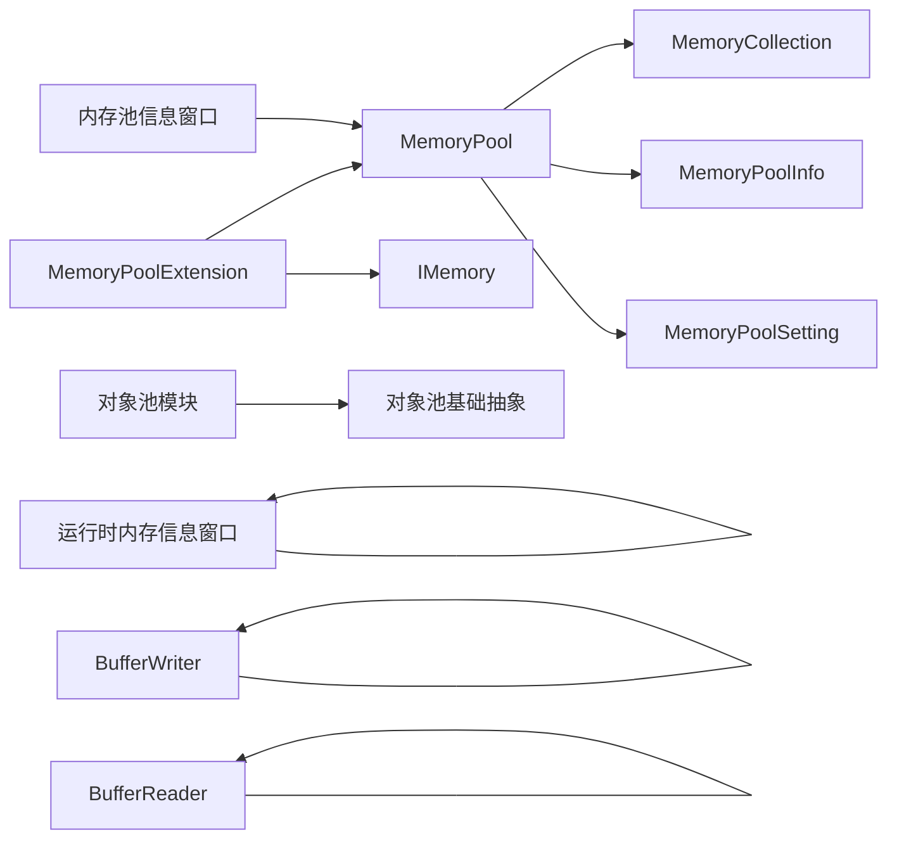

# 内存优化策略

<cite>
**本文档引用的文件**
- [MemoryPool.cs](file://Assets/TEngine/Runtime/Core/MemoryPool/MemoryPool.cs)
- [MemoryPool.MemoryCollection.cs](file://Assets/TEngine/Runtime/Core/MemoryPool/MemoryPool.MemoryCollection.cs)
- [MemoryPoolExtension.cs](file://Assets/TEngine/Runtime/Core/MemoryPool/MemoryPoolExtension.cs)
- [IMemory.cs](file://Assets/TEngine/Runtime/Core/MemoryPool/IMemory.cs)
- [MemoryPoolInfo.cs](file://Assets/TEngine/Runtime/Core/MemoryPool/MemoryPoolInfo.cs)
- [MemoryPoolSetting.cs](file://Assets/TEngine/Runtime/Core/MemoryPool/MemoryPoolSetting.cs)
- [DebuggerModule.MemoryPoolInformationWindow.cs](file://Assets/TEngine/Runtime/Module/DebugerModule/Component/DebuggerModule.MemoryPoolInformationWindow.cs)
- [DebuggerModule.RuntimeMemoryInformationWindow.cs](file://Assets/TEngine/Runtime/Module/DebugerModule/Component/DebuggerModule.RuntimeMemoryInformationWindow.cs)
- [BufferWriter.cs](file://Packages/YooAsset/Runtime/Utility/BufferWriter.cs)
- [BufferReader.cs](file://Packages/YooAsset/Runtime/Utility/BufferReader.cs)
- [ObjectPoolModule.cs](file://Assets/TEngine/Runtime/Module/ObjectPoolModule/ObjectPoolModule.cs)
- [ObjectPoolBase.cs](file://Assets/TEngine/Runtime/Module/ObjectPoolModule/ObjectPoolBase.cs)
</cite>

## 目录
1. [引言](#引言)
2. [项目结构](#项目结构)
3. [核心组件](#核心组件)
4. [架构总览](#架构总览)
5. [详细组件分析](#详细组件分析)
6. [依赖关系分析](#依赖关系分析)
7. [性能考量](#性能考量)
8. [故障排查指南](#故障排查指南)
9. [结论](#结论)
10. [附录](#附录)

## 引言
本文件系统化梳理 TEngine 的内存优化策略与实现，重点覆盖以下方面：
- 批量内存分配与预分配机制
- 内存对齐与碎片整理思路
- 高效内存池（对象复用率、局部性优化）
- 泄漏预防与检测（严格检查、生命周期管理）
- 内存监控与诊断（运行时采样、统计窗口）
- 面向高频对象、大对象、临时缓冲区的优化方案

## 项目结构
TEngine 的内存优化主要集中在“内存池”“对象池”“调试器内存监控”三部分，并辅以通用缓冲区工具用于大对象序列化/反序列化的高效读写。

图示来源
- [MemoryPool.cs:1-208](file://Assets/TEngine/Runtime/Core/MemoryPool/MemoryPool.cs#L1-L208)
- [MemoryPool.MemoryCollection.cs:1-157](file://Assets/TEngine/Runtime/Core/MemoryPool/MemoryPool.MemoryCollection.cs#L1-L157)
- [MemoryPoolExtension.cs:1-57](file://Assets/TEngine/Runtime/Core/MemoryPool/MemoryPoolExtension.cs#L1-L57)
- [IMemory.cs:1-14](file://Assets/TEngine/Runtime/Core/MemoryPool/IMemory.cs#L1-L14)
- [MemoryPoolInfo.cs:1-119](file://Assets/TEngine/Runtime/Core/MemoryPool/MemoryPoolInfo.cs#L1-L119)
- [MemoryPoolSetting.cs:1-80](file://Assets/TEngine/Runtime/Core/MemoryPool/MemoryPoolSetting.cs#L1-L80)
- [DebuggerModule.MemoryPoolInformationWindow.cs:1-107](file://Assets/TEngine/Runtime/Module/DebugerModule/Component/DebuggerModule.MemoryPoolInformationWindow.cs#L1-L107)
- [DebuggerModule.RuntimeMemoryInformationWindow.cs:1-135](file://Assets/TEngine/Runtime/Module/DebugerModule/Component/DebuggerModule.RuntimeMemoryInformationWindow.cs#L1-L135)
- [ObjectPoolModule.cs:1-1296](file://Assets/TEngine/Runtime/Module/ObjectPoolModule/ObjectPoolModule.cs#L1-L1296)
- [ObjectPoolBase.cs:104-133](file://Assets/TEngine/Runtime/Module/ObjectPoolModule/ObjectPoolBase.cs#L104-L133)
- [BufferWriter.cs:1-197](file://Packages/YooAsset/Runtime/Utility/BufferWriter.cs#L1-L197)
- [BufferReader.cs:1-183](file://Packages/YooAsset/Runtime/Utility/BufferReader.cs#L1-L183)

章节来源
- [MemoryPool.cs:1-208](file://Assets/TEngine/Runtime/Core/MemoryPool/MemoryPool.cs#L1-L208)
- [MemoryPool.MemoryCollection.cs:1-157](file://Assets/TEngine/Runtime/Core/MemoryPool/MemoryPool.MemoryCollection.cs#L1-L157)
- [MemoryPoolExtension.cs:1-57](file://Assets/TEngine/Runtime/Core/MemoryPool/MemoryPoolExtension.cs#L1-L57)
- [MemoryPoolInfo.cs:1-119](file://Assets/TEngine/Runtime/Core/MemoryPool/MemoryPoolInfo.cs#L1-L119)
- [MemoryPoolSetting.cs:1-80](file://Assets/TEngine/Runtime/Core/MemoryPool/MemoryPoolSetting.cs#L1-L80)
- [DebuggerModule.MemoryPoolInformationWindow.cs:1-107](file://Assets/TEngine/Runtime/Module/DebugerModule/Component/DebuggerModule.MemoryPoolInformationWindow.cs#L1-L107)
- [DebuggerModule.RuntimeMemoryInformationWindow.cs:1-135](file://Assets/TEngine/Runtime/Module/DebugerModule/Component/DebuggerModule.RuntimeMemoryInformationWindow.cs#L1-L135)
- [ObjectPoolModule.cs:1-1296](file://Assets/TEngine/Runtime/Module/ObjectPoolModule/ObjectPoolModule.cs#L1-L1296)
- [ObjectPoolBase.cs:104-133](file://Assets/TEngine/Runtime/Module/ObjectPoolModule/ObjectPoolBase.cs#L104-L133)
- [BufferWriter.cs:1-197](file://Packages/YooAsset/Runtime/Utility/BufferWriter.cs#L1-L197)
- [BufferReader.cs:1-183](file://Packages/YooAsset/Runtime/Utility/BufferReader.cs#L1-L183)

## 核心组件
- 内存池（MemoryPool）：全局静态入口，负责按类型维护内存集合、分配/回收、统计与严格检查开关。
- 内存集合（MemoryCollection）：每个类型一个队列，记录使用/未使用计数与增删计数，支持批量 Add/Remove。
- 内存对象接口（IMemory）与扩展（MemoryObject）：统一 Clear 生命周期；提供 Alloc/Dealloc 快捷封装。
- 内存池信息（MemoryPoolInfo）：结构体封装统计字段，便于调试器展示。
- 内存池设置（MemoryPoolSetting）：根据构建类型自动控制严格检查开关。
- 调试器内存池窗口（DebuggerModule.MemoryPoolInformationWindow）：按程序集分组展示各类型内存池统计。
- 运行时内存采样窗口（DebuggerModule.RuntimeMemoryInformationWindow）：采集 Unity 对象运行时内存占用并排序展示。
- 对象池（ObjectPoolModule/ObjectPoolBase）：对象池模块与基础抽象，补充高频对象生命周期管理。
- 缓冲区工具（BufferWriter/BufferReader）：大对象序列化/反序列化，减少中间拷贝与 GC 分配。

章节来源
- [MemoryPool.cs:1-208](file://Assets/TEngine/Runtime/Core/MemoryPool/MemoryPool.cs#L1-L208)
- [MemoryPool.MemoryCollection.cs:1-157](file://Assets/TEngine/Runtime/Core/MemoryPool/MemoryPool.MemoryCollection.cs#L1-L157)
- [MemoryPoolExtension.cs:1-57](file://Assets/TEngine/Runtime/Core/MemoryPool/MemoryPoolExtension.cs#L1-L57)
- [IMemory.cs:1-14](file://Assets/TEngine/Runtime/Core/MemoryPool/IMemory.cs#L1-L14)
- [MemoryPoolInfo.cs:1-119](file://Assets/TEngine/Runtime/Core/MemoryPool/MemoryPoolInfo.cs#L1-L119)
- [MemoryPoolSetting.cs:1-80](file://Assets/TEngine/Runtime/Core/MemoryPool/MemoryPoolSetting.cs#L1-L80)
- [DebuggerModule.MemoryPoolInformationWindow.cs:1-107](file://Assets/TEngine/Runtime/Module/DebugerModule/Component/DebuggerModule.MemoryPoolInformationWindow.cs#L1-L107)
- [DebuggerModule.RuntimeMemoryInformationWindow.cs:1-135](file://Assets/TEngine/Runtime/Module/DebugerModule/Component/DebuggerModule.RuntimeMemoryInformationWindow.cs#L1-L135)
- [ObjectPoolModule.cs:1-1296](file://Assets/TEngine/Runtime/Module/ObjectPoolModule/ObjectPoolModule.cs#L1-L1296)
- [ObjectPoolBase.cs:104-133](file://Assets/TEngine/Runtime/Module/ObjectPoolModule/ObjectPoolBase.cs#L104-L133)
- [BufferWriter.cs:1-197](file://Packages/YooAsset/Runtime/Utility/BufferWriter.cs#L1-L197)
- [BufferReader.cs:1-183](file://Packages/YooAsset/Runtime/Utility/BufferReader.cs#L1-L183)

## 架构总览
下图展示了内存池与调试器、对象池、缓冲区工具之间的交互关系与职责边界。

图示来源
- [MemoryPool.cs:1-208](file://Assets/TEngine/Runtime/Core/MemoryPool/MemoryPool.cs#L1-L208)
- [MemoryPool.MemoryCollection.cs:1-157](file://Assets/TEngine/Runtime/Core/MemoryPool/MemoryPool.MemoryCollection.cs#L1-L157)
- [MemoryPoolSetting.cs:1-80](file://Assets/TEngine/Runtime/Core/MemoryPool/MemoryPoolSetting.cs#L1-L80)
- [MemoryPoolInfo.cs:1-119](file://Assets/TEngine/Runtime/Core/MemoryPool/MemoryPoolInfo.cs#L1-L119)
- [DebuggerModule.MemoryPoolInformationWindow.cs:1-107](file://Assets/TEngine/Runtime/Module/DebugerModule/Component/DebuggerModule.MemoryPoolInformationWindow.cs#L1-L107)
- [DebuggerModule.RuntimeMemoryInformationWindow.cs:1-135](file://Assets/TEngine/Runtime/Module/DebugerModule/Component/DebuggerModule.RuntimeMemoryInformationWindow.cs#L1-L135)
- [ObjectPoolModule.cs:1-1296](file://Assets/TEngine/Runtime/Module/ObjectPoolModule/ObjectPoolModule.cs#L1-L1296)
- [ObjectPoolBase.cs:104-133](file://Assets/TEngine/Runtime/Module/ObjectPoolModule/ObjectPoolBase.cs#L104-L133)
- [BufferWriter.cs:1-197](file://Packages/YooAsset/Runtime/Utility/BufferWriter.cs#L1-L197)
- [BufferReader.cs:1-183](file://Packages/YooAsset/Runtime/Utility/BufferReader.cs#L1-L183)

## 详细组件分析

### 内存池（MemoryPool）与集合（MemoryCollection）
- 类型维度的内存池：通过字典按类型维护 MemoryCollection，首次使用时创建。
- 分配路径：若队列非空则出队复用，否则新建对象并计入“新增计数”。
- 归还路径：调用 Clear 后入队，同时更新使用/归还计数。
- 统计接口：提供 GetAllMemoryPoolInfos 返回 MemoryPoolInfo 数组，包含类型、未使用、使用、获取/归还、新增/移除计数。
- 批量操作：Add/Remove 支持批量预分配与回收，降低频繁分配/销毁开销。
- 严格检查：可选的强校验（开发/编辑器模式可启用），防止重复释放与类型不匹配。

图示来源
- [MemoryPool.cs:1-208](file://Assets/TEngine/Runtime/Core/MemoryPool/MemoryPool.cs#L1-L208)
- [MemoryPool.MemoryCollection.cs:1-157](file://Assets/TEngine/Runtime/Core/MemoryPool/MemoryPool.MemoryCollection.cs#L1-L157)
- [IMemory.cs:1-14](file://Assets/TEngine/Runtime/Core/MemoryPool/IMemory.cs#L1-L14)

章节来源
- [MemoryPool.cs:1-208](file://Assets/TEngine/Runtime/Core/MemoryPool/MemoryPool.cs#L1-L208)
- [MemoryPool.MemoryCollection.cs:1-157](file://Assets/TEngine/Runtime/Core/MemoryPool/MemoryPool.MemoryCollection.cs#L1-L157)
- [IMemory.cs:1-14](file://Assets/TEngine/Runtime/Core/MemoryPool/IMemory.cs#L1-L14)

### 内存池扩展（Alloc/Dealloc 与 MemoryObject）
- Alloc<T>()：从内存池获取对象并调用 InitFromPool 完成初始化。
- Dealloc：先调用 RecycleToPool 清理状态，再 Release 归还。
- MemoryObject：抽象基类，要求实现 InitFromPool/RecycleToPool，确保生命周期可控。

图示来源
- [MemoryPoolExtension.cs:1-57](file://Assets/TEngine/Runtime/Core/MemoryPool/MemoryPoolExtension.cs#L1-L57)
- [MemoryPool.cs:1-208](file://Assets/TEngine/Runtime/Core/MemoryPool/MemoryPool.cs#L1-L208)
- [MemoryPool.MemoryCollection.cs:1-157](file://Assets/TEngine/Runtime/Core/MemoryPool/MemoryPool.MemoryCollection.cs#L1-L157)

章节来源
- [MemoryPoolExtension.cs:1-57](file://Assets/TEngine/Runtime/Core/MemoryPool/MemoryPoolExtension.cs#L1-L57)

### 内存池设置（MemoryPoolSetting）与严格检查
- 支持四种严格检查策略：总是启用、开发模式启用、编辑器启用、总是禁用。
- 在启动时根据策略设置 MemoryPool.EnableStrictCheck，并输出提示日志。
- 严格检查会增加额外校验成本，建议生产环境默认关闭。

图示来源
- [MemoryPoolSetting.cs:1-80](file://Assets/TEngine/Runtime/Core/MemoryPool/MemoryPoolSetting.cs#L1-L80)

章节来源
- [MemoryPoolSetting.cs:1-80](file://Assets/TEngine/Runtime/Core/MemoryPool/MemoryPoolSetting.cs#L1-L80)

### 调试器内存监控
- 内存池信息窗口：按程序集分组显示各类型内存池的未使用/使用/获取/归还/新增/移除计数，支持全名/短名切换。
- 运行时内存信息窗口：采集指定类型对象的运行时内存大小，排序展示，支持重复样本高亮与统计。

图示来源
- [DebuggerModule.MemoryPoolInformationWindow.cs:1-107](file://Assets/TEngine/Runtime/Module/DebugerModule/Component/DebuggerModule.MemoryPoolInformationWindow.cs#L1-L107)
- [MemoryPool.cs:1-208](file://Assets/TEngine/Runtime/Core/MemoryPool/MemoryPool.cs#L1-L208)
- [MemoryPoolInfo.cs:1-119](file://Assets/TEngine/Runtime/Core/MemoryPool/MemoryPoolInfo.cs#L1-L119)

章节来源
- [DebuggerModule.MemoryPoolInformationWindow.cs:1-107](file://Assets/TEngine/Runtime/Module/DebugerModule/Component/DebuggerModule.MemoryPoolInformationWindow.cs#L1-L107)
- [DebuggerModule.RuntimeMemoryInformationWindow.cs:1-135](file://Assets/TEngine/Runtime/Module/DebugerModule/Component/DebuggerModule.RuntimeMemoryInformationWindow.cs#L1-L135)

### 对象池（ObjectPoolModule/ObjectPoolBase）
- 提供对象池的创建、释放、清理与统计接口，支持优先级、过期时间、容量等参数。
- 与内存池互补：内存池关注“类型级对象复用”，对象池关注“实例级生命周期管理与回收”。

图示来源
- [ObjectPoolModule.cs:1-1296](file://Assets/TEngine/Runtime/Module/ObjectPoolModule/ObjectPoolModule.cs#L1-L1296)
- [ObjectPoolBase.cs:104-133](file://Assets/TEngine/Runtime/Module/ObjectPoolModule/ObjectPoolBase.cs#L104-L133)

章节来源
- [ObjectPoolModule.cs:1-1296](file://Assets/TEngine/Runtime/Module/ObjectPoolModule/ObjectPoolModule.cs#L1-L1296)
- [ObjectPoolBase.cs:104-133](file://Assets/TEngine/Runtime/Module/ObjectPoolModule/ObjectPoolBase.cs#L104-L133)

### 缓冲区工具（BufferWriter/BufferReader）
- BufferWriter：固定容量字节数组作为缓冲区，提供整型/字符串/数组等写入方法，支持直接写入文件流。
- BufferReader：基于只读字节数组，提供对应读取方法，支持 UTF-8 字符串与数组读取。
- 优势：避免频繁小块分配，减少 GC 压力；按需扩容与索引校验保障安全。

图示来源
- [BufferWriter.cs:1-197](file://Packages/YooAsset/Runtime/Utility/BufferWriter.cs#L1-L197)
- [BufferReader.cs:1-183](file://Packages/YooAsset/Runtime/Utility/BufferReader.cs#L1-L183)

章节来源
- [BufferWriter.cs:1-197](file://Packages/YooAsset/Runtime/Utility/BufferWriter.cs#L1-L197)
- [BufferReader.cs:1-183](file://Packages/YooAsset/Runtime/Utility/BufferReader.cs#L1-L183)

## 依赖关系分析
- 内存池依赖关系清晰：MemoryPool 作为门面，内部委托 MemoryCollection 管理具体类型对象；IMemory 为统一接口；MemoryPoolInfo 为只读统计载体。
- 调试器依赖 MemoryPool 的统计接口，形成“观测—反馈—优化”的闭环。
- 对象池与内存池并行存在，分别解决不同粒度的复用问题。
- 缓冲区工具独立于内存池，但常用于大对象序列化场景，减少临时对象与拷贝。

图示来源
- [MemoryPool.cs:1-208](file://Assets/TEngine/Runtime/Core/MemoryPool/MemoryPool.cs#L1-L208)
- [MemoryPool.MemoryCollection.cs:1-157](file://Assets/TEngine/Runtime/Core/MemoryPool/MemoryPool.MemoryCollection.cs#L1-L157)
- [MemoryPoolExtension.cs:1-57](file://Assets/TEngine/Runtime/Core/MemoryPool/MemoryPoolExtension.cs#L1-L57)
- [IMemory.cs:1-14](file://Assets/TEngine/Runtime/Core/MemoryPool/IMemory.cs#L1-L14)
- [MemoryPoolInfo.cs:1-119](file://Assets/TEngine/Runtime/Core/MemoryPool/MemoryPoolInfo.cs#L1-L119)
- [MemoryPoolSetting.cs:1-80](file://Assets/TEngine/Runtime/Core/MemoryPool/MemoryPoolSetting.cs#L1-L80)
- [DebuggerModule.MemoryPoolInformationWindow.cs:1-107](file://Assets/TEngine/Runtime/Module/DebugerModule/Component/DebuggerModule.MemoryPoolInformationWindow.cs#L1-L107)
- [DebuggerModule.RuntimeMemoryInformationWindow.cs:1-135](file://Assets/TEngine/Runtime/Module/DebugerModule/Component/DebuggerModule.RuntimeMemoryInformationWindow.cs#L1-L135)
- [ObjectPoolModule.cs:1-1296](file://Assets/TEngine/Runtime/Module/ObjectPoolModule/ObjectPoolModule.cs#L1-L1296)
- [ObjectPoolBase.cs:104-133](file://Assets/TEngine/Runtime/Module/ObjectPoolModule/ObjectPoolBase.cs#L104-L133)
- [BufferWriter.cs:1-197](file://Packages/YooAsset/Runtime/Utility/BufferWriter.cs#L1-L197)
- [BufferReader.cs:1-183](file://Packages/YooAsset/Runtime/Utility/BufferReader.cs#L1-L183)

章节来源
- [MemoryPool.cs:1-208](file://Assets/TEngine/Runtime/Core/MemoryPool/MemoryPool.cs#L1-L208)
- [MemoryPool.MemoryCollection.cs:1-157](file://Assets/TEngine/Runtime/Core/MemoryPool/MemoryPool.MemoryCollection.cs#L1-L157)
- [MemoryPoolExtension.cs:1-57](file://Assets/TEngine/Runtime/Core/MemoryPool/MemoryPoolExtension.cs#L1-L57)
- [IMemory.cs:1-14](file://Assets/TEngine/Runtime/Core/MemoryPool/IMemory.cs#L1-L14)
- [MemoryPoolInfo.cs:1-119](file://Assets/TEngine/Runtime/Core/MemoryPool/MemoryPoolInfo.cs#L1-L119)
- [MemoryPoolSetting.cs:1-80](file://Assets/TEngine/Runtime/Core/MemoryPool/MemoryPoolSetting.cs#L1-L80)
- [DebuggerModule.MemoryPoolInformationWindow.cs:1-107](file://Assets/TEngine/Runtime/Module/DebugerModule/Component/DebuggerModule.MemoryPoolInformationWindow.cs#L1-L107)
- [DebuggerModule.RuntimeMemoryInformationWindow.cs:1-135](file://Assets/TEngine/Runtime/Module/DebugerModule/Component/DebuggerModule.RuntimeMemoryInformationWindow.cs#L1-L135)
- [ObjectPoolModule.cs:1-1296](file://Assets/TEngine/Runtime/Module/ObjectPoolModule/ObjectPoolModule.cs#L1-L1296)
- [ObjectPoolBase.cs:104-133](file://Assets/TEngine/Runtime/Module/ObjectPoolModule/ObjectPoolBase.cs#L104-L133)
- [BufferWriter.cs:1-197](file://Packages/YooAsset/Runtime/Utility/BufferWriter.cs#L1-L197)
- [BufferReader.cs:1-183](file://Packages/YooAsset/Runtime/Utility/BufferReader.cs#L1-L183)

## 性能考量
- 批量预分配：通过 Add/Remove 批量填充/回收，显著降低频繁分配/销毁带来的抖动与 GC 压力。
- 队列复用：MemoryCollection 使用队列存储空闲对象，分配/归还均为 O(1)，提升吞吐。
- 严格检查成本：启用严格检查会引入额外校验与异常路径，建议仅在开发/测试阶段开启。
- 访问局部性：内存池按类型组织，配合对象生命周期管理（InitFromPool/RecycleToPool）可提升 CPU 缓存命中。
- 大对象处理：BufferWriter/BufferReader 以固定容量缓冲区承载序列化/反序列化，减少中间对象与拷贝。
- 对象池补充：高频对象可同时采用对象池（按实例粒度）与内存池（按类型粒度）双层复用，进一步降低分配频率。

## 故障排查指南
- 重复释放检测：启用严格检查后，若同一对象被重复 Release，将抛出异常，便于快速定位错误。
- 类型校验：当传入类型不满足 IMemory 或非具体类时，抛出异常，避免类型不一致导致的潜在问题。
- 统计分析：通过内存池信息窗口观察“新增/移除/使用/未使用”变化趋势，识别异常增长。
- 运行时内存采样：使用运行时内存信息窗口对关键类型进行采样，定位内存占用高的对象与重复样本。

章节来源
- [MemoryPool.cs:164-185](file://Assets/TEngine/Runtime/Core/MemoryPool/MemoryPool.cs#L164-L185)
- [MemoryPool.MemoryCollection.cs:83-98](file://Assets/TEngine/Runtime/Core/MemoryPool/MemoryPool.MemoryCollection.cs#L83-L98)
- [DebuggerModule.MemoryPoolInformationWindow.cs:1-107](file://Assets/TEngine/Runtime/Module/DebugerModule/Component/DebuggerModule.MemoryPoolInformationWindow.cs#L1-L107)
- [DebuggerModule.RuntimeMemoryInformationWindow.cs:1-135](file://Assets/TEngine/Runtime/Module/DebugerModule/Component/DebuggerModule.RuntimeMemoryInformationWindow.cs#L1-L135)

## 结论
TEngine 的内存优化策略以“类型级内存池 + 实例级对象池 + 调试监控”为核心，结合缓冲区工具实现大对象高效序列化。通过批量预分配、队列复用、严格检查与统计可视化，能够在保证稳定性的同时显著降低 GC 压力与分配抖动。建议在开发阶段开启严格检查与内存监控，在生产环境关闭严格检查并持续观察统计指标，以获得最佳性能与可靠性平衡。

## 附录
- 针对高频对象管理：优先使用内存池与对象池双层复用，配合 Alloc/Dealloc 生命周期钩子，确保 Clear/Init/Recycle 流程可控。
- 针对大对象处理：使用 BufferWriter/BufferReader 进行序列化/反序列化，避免频繁小块分配；必要时预估容量并批量写入。
- 针对临时缓冲区优化：尽量复用固定容量缓冲区，避免在热路径上创建临时数组；采样与统计窗口辅助定位热点与异常峰值。