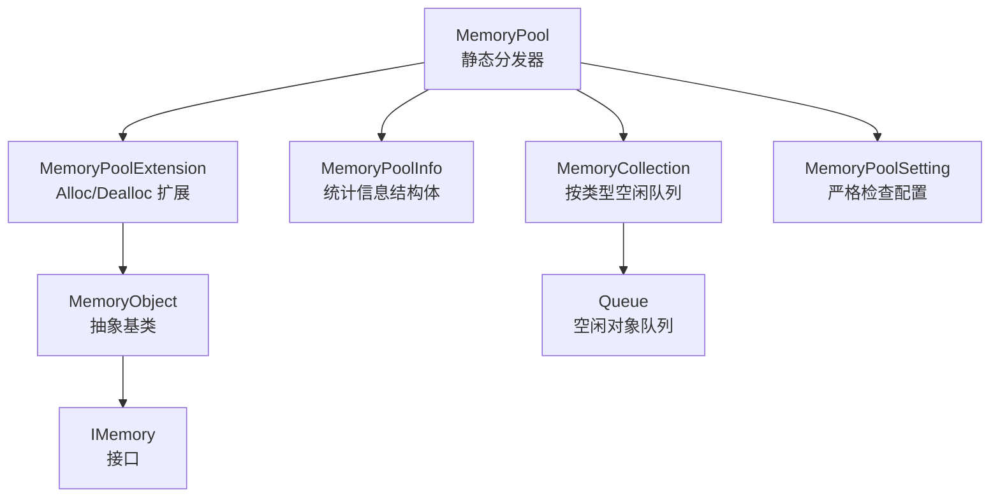
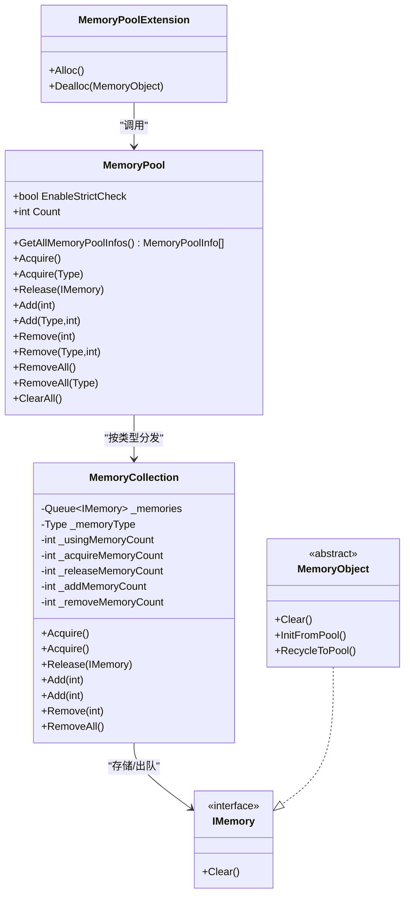
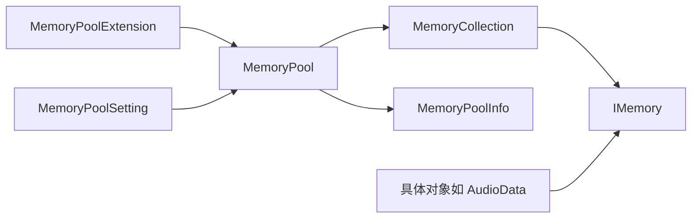
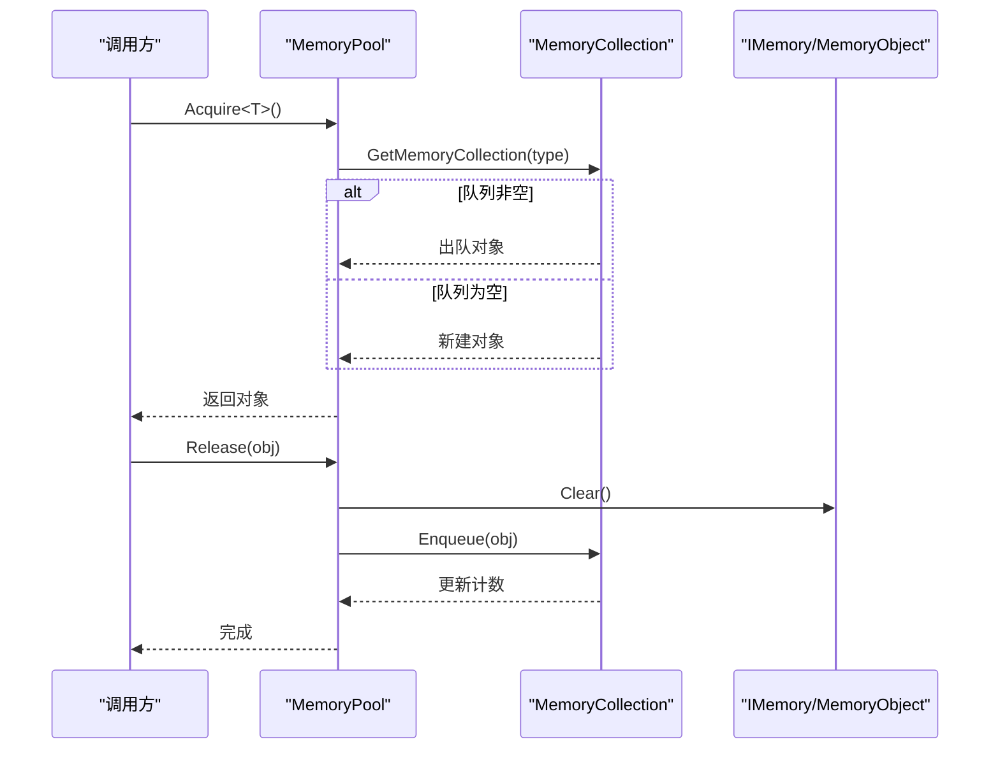

# 内存池设计原理

<cite>
**本文引用的文件**
- [MemoryPool.cs](file://Assets/TEngine/Runtime/Core/MemoryPool/MemoryPool.cs)
- [IMemory.cs](file://Assets/TEngine/Runtime/Core/MemoryPool/IMemory.cs)
- [MemoryPool.MemoryCollection.cs](file://Assets/TEngine/Runtime/Core/MemoryPool/MemoryPool.MemoryCollection.cs)
- [MemoryPoolExtension.cs](file://Assets/TEngine/Runtime/Core/MemoryPool/MemoryPoolExtension.cs)
- [MemoryPoolSetting.cs](file://Assets/TEngine/Runtime/Core/MemoryPool/MemoryPoolSetting.cs)
- [MemoryPoolInfo.cs](file://Assets/TEngine/Runtime/Core/MemoryPool/MemoryPoolInfo.cs)
- [AudioData.cs](file://Assets/TEngine/Runtime/Core/MemoryPool/AudioData.cs)
- [ObjectPoolModule.Object.cs](file://Assets/TEngine/Runtime/Module/ObjectPoolModule/ObjectPoolModule.Object.cs)
- [Fsm.cs](file://Assets/TEngine/Runtime/Module/FsmModule/Fsm.cs)
</cite>

## 目录
1. [引言](#引言)
2. [项目结构](#项目结构)
3. [核心组件](#核心组件)
4. [架构总览](#架构总览)
5. [详细组件分析](#详细组件分析)
6. [依赖关系分析](#依赖关系分析)
7. [性能考量](#性能考量)
8. [故障排查指南](#故障排查指南)
9. [结论](#结论)
10. [附录](#附录)

## 引言
本文件系统性阐述 TEngine 内存池的设计理念与实现原理，重点覆盖以下主题：
- 生命周期管理：从创建、使用到回收的完整流程
- 类型安全机制：编译期约束与运行期校验
- 线程安全性：锁粒度与并发控制策略
- MemoryPool 设计：静态分发、集合管理、严格检查开关
- MemoryCollection 实现：队列式空闲池、统计指标、容量增删
- IMemory 接口与 MemoryObject 抽象基类：统一清理与初始化/回收约定
- 关键决策与权衡：分配策略、缓存命中优化、性能与安全的取舍

## 项目结构
内存池相关代码集中于 TEngine 运行时的 Core/MemoryPool 目录，围绕一个静态入口分发器与内部集合容器协作，形成“按类型隔离”的内存池体系。

图示来源
- [MemoryPool.cs:1-208](file://Assets/TEngine/Runtime/Core/MemoryPool/MemoryPool.cs#L1-L208)
- [MemoryPool.MemoryCollection.cs:1-157](file://Assets/TEngine/Runtime/Core/MemoryPool/MemoryPool.MemoryCollection.cs#L1-L157)
- [MemoryPoolExtension.cs:1-57](file://Assets/TEngine/Runtime/Core/MemoryPool/MemoryPoolExtension.cs#L1-L57)
- [IMemory.cs:1-14](file://Assets/TEngine/Runtime/Core/MemoryPool/IMemory.cs#L1-L14)
- [MemoryPoolInfo.cs:1-119](file://Assets/TEngine/Runtime/Core/MemoryPool/MemoryPoolInfo.cs#L1-L119)
- [MemoryPoolSetting.cs:1-80](file://Assets/TEngine/Runtime/Core/MemoryPool/MemoryPoolSetting.cs#L1-L80)

章节来源
- [MemoryPool.cs:1-208](file://Assets/TEngine/Runtime/Core/MemoryPool/MemoryPool.cs#L1-L208)
- [MemoryPool.MemoryCollection.cs:1-157](file://Assets/TEngine/Runtime/Core/MemoryPool/MemoryPool.MemoryCollection.cs#L1-L157)
- [MemoryPoolExtension.cs:1-57](file://Assets/TEngine/Runtime/Core/MemoryPool/MemoryPoolExtension.cs#L1-L57)
- [IMemory.cs:1-14](file://Assets/TEngine/Runtime/Core/MemoryPool/IMemory.cs#L1-L14)
- [MemoryPoolInfo.cs:1-119](file://Assets/TEngine/Runtime/Core/MemoryPool/MemoryPoolInfo.cs#L1-L119)
- [MemoryPoolSetting.cs:1-80](file://Assets/TEngine/Runtime/Core/MemoryPool/MemoryPoolSetting.cs#L1-L80)

## 核心组件
- MemoryPool（静态分发器）
  - 提供泛型与非泛型两类获取/归还接口
  - 维护类型到 MemoryCollection 的字典映射
  - 支持统计查询、清空、批量增删
  - 可选严格类型检查
- MemoryCollection（内存集合）
  - 按类型维护空闲队列
  - 记录使用中/获取/归还/新增/移除等计数
  - 提供 Acquire/Release/Add/Remove/RemoveAll
- IMemory（接口）
  - 规定 Clear 行为，用于回收前清理
- MemoryObject（抽象基类）
  - 扩展 IMemory，引入 InitFromPool/RecycleToPool
  - 提供 Alloc/Dealloc 便捷方法
- MemoryPoolSetting（配置）
  - 控制严格检查开关，支持按构建类型/编辑器启用
- MemoryPoolInfo（统计）
  - 结构化输出各类型内存池的使用与统计信息

章节来源
- [MemoryPool.cs:1-208](file://Assets/TEngine/Runtime/Core/MemoryPool/MemoryPool.cs#L1-L208)
- [MemoryPool.MemoryCollection.cs:1-157](file://Assets/TEngine/Runtime/Core/MemoryPool/MemoryPool.MemoryCollection.cs#L1-L157)
- [IMemory.cs:1-14](file://Assets/TEngine/Runtime/Core/MemoryPool/IMemory.cs#L1-L14)
- [MemoryPoolExtension.cs:1-57](file://Assets/TEngine/Runtime/Core/MemoryPool/MemoryPoolExtension.cs#L1-L57)
- [MemoryPoolSetting.cs:1-80](file://Assets/TEngine/Runtime/Core/MemoryPool/MemoryPoolSetting.cs#L1-L80)
- [MemoryPoolInfo.cs:1-119](file://Assets/TEngine/Runtime/Core/MemoryPool/MemoryPoolInfo.cs#L1-L119)

## 架构总览
内存池采用“静态分发 + 按类型集合”的两级结构：
- 分发层：MemoryPool 对外暴露统一 API，内部根据类型定位集合
- 集合层：MemoryCollection 为每个类型维护独立队列与计数
- 使用层：业务通过 IMemory 或 MemoryObject 接口参与生命周期

图示来源
- [MemoryPool.cs:1-208](file://Assets/TEngine/Runtime/Core/MemoryPool/MemoryPool.cs#L1-L208)
- [MemoryPool.MemoryCollection.cs:1-157](file://Assets/TEngine/Runtime/Core/MemoryPool/MemoryPool.MemoryCollection.cs#L1-L157)
- [IMemory.cs:1-14](file://Assets/TEngine/Runtime/Core/MemoryPool/IMemory.cs#L1-L14)
- [MemoryPoolExtension.cs:1-57](file://Assets/TEngine/Runtime/Core/MemoryPool/MemoryPoolExtension.cs#L1-L57)

## 详细组件分析

### MemoryPool（静态分发器）
- 设计要点
  - 静态分发：对外提供 Acquire/Release/Add/Remove/RemoveAll 等静态方法
  - 类型映射：_memoryCollections 字典按 Type -> MemoryCollection 建立映射
  - 严格检查：EnableStrictCheck 控制运行期类型校验
  - 并发控制：对集合字典与集合内队列分别加锁，避免竞态
- 生命周期
  - 获取：若集合不存在则创建；优先从队列取，否则新建
  - 归还：调用 Clear 清理，入队，计数更新
  - 批量增删：Add/Remove/RemoveAll 支持预热与收缩
  - 清空：ClearAll 遍历并 RemoveAll
- 类型安全
  - 泛型参数与集合类型一致性校验
  - 非泛型接口对类型进行二次校验
- 统计与可观测性
  - GetAllMemoryPoolInfos 输出各类型计数快照

章节来源
- [MemoryPool.cs:1-208](file://Assets/TEngine/Runtime/Core/MemoryPool/MemoryPool.cs#L1-L208)

### MemoryCollection（内存集合）
- 数据结构
  - Queue<IMemory> 空闲队列，先进先出
  - 多个计数字段记录使用/获取/归还/新增/移除
- 访问模式
  - Acquire<T>/Acquire：优先出队，否则反射构造
  - Release：调用 Clear 后入队，严格模式下防重入
  - Add：批量入队，支持泛型与非泛型
  - Remove/RemoveAll：批量出队，统计移除数量
- 性能优化策略
  - 队列复用减少 GC
  - 严格检查默认关闭，仅在需要时开启
  - 锁粒度控制在集合级别，避免全局阻塞

章节来源
- [MemoryPool.MemoryCollection.cs:1-157](file://Assets/TEngine/Runtime/Core/MemoryPool/MemoryPool.MemoryCollection.cs#L1-L157)

### IMemory 接口与 MemoryObject 抽象基类
- IMemory
  - 规范：Clear 在归还前执行，确保状态复位
- MemoryObject
  - 扩展：引入 InitFromPool/RecycleToPool 两个钩子
  - 便捷：Alloc/Dealloc 将“获取+初始化”和“回收+归还”打包
- 使用建议
  - 所有可复用对象应实现 IMemory 或继承 MemoryObject
  - 在 RecycleToPool 中释放外部资源，避免泄漏

章节来源
- [IMemory.cs:1-14](file://Assets/TEngine/Runtime/Core/MemoryPool/IMemory.cs#L1-L14)
- [MemoryPoolExtension.cs:1-57](file://Assets/TEngine/Runtime/Core/MemoryPool/MemoryPoolExtension.cs#L1-L57)

### MemoryPoolExtension（扩展方法）
- Alloc<T>()
  - 获取对象后调用 InitFromPool，确保对象处于可用初始状态
- Dealloc(MemoryObject)
  - 先 RecycleToPool，再 Release，保证顺序正确

章节来源
- [MemoryPoolExtension.cs:1-57](file://Assets/TEngine/Runtime/Core/MemoryPool/MemoryPoolExtension.cs#L1-L57)

### MemoryPoolSetting（严格检查配置）
- 作用：在运行时根据构建类型/编辑器环境自动启用/禁用严格检查
- 影响：启用后会增加额外校验开销，建议发布版本关闭

章节来源
- [MemoryPoolSetting.cs:1-80](file://Assets/TEngine/Runtime/Core/MemoryPool/MemoryPoolSetting.cs#L1-L80)

### MemoryPoolInfo（统计信息）
- 字段：类型、未使用数、使用中数、获取/归还/新增/移除计数
- 用途：诊断内存池健康状况，评估缓存命中与回收效率

章节来源
- [MemoryPoolInfo.cs:1-119](file://Assets/TEngine/Runtime/Core/MemoryPool/MemoryPoolInfo.cs#L1-L119)

### 使用示例与集成点
- FSM 模块：通过 MemoryPool.Acquire<Fsm<T>>() 获取状态机对象，使用完毕后 MemoryPool.Release(this)
- 对象池模块：Object<T> 通过 MemoryPool.Acquire/ObjectPoolModule.Object.cs:122-132 获取，释放时调用 MemoryPool.Release
- 音频模块：AudioData 继承 MemoryObject，使用 Alloc/DeAlloc 管理资源句柄与池化

章节来源
- [Fsm.cs:85-113](file://Assets/TEngine/Runtime/Module/FsmModule/Fsm.cs#L85-L113)
- [ObjectPoolModule.Object.cs:120-190](file://Assets/TEngine/Runtime/Module/ObjectPoolModule/ObjectPoolModule.Object.cs#L120-L190)
- [AudioData.cs:1-66](file://Assets/TEngine/Runtime/Module/AudioModule/AudioData.cs#L1-L66)

## 依赖关系分析
- 分发器依赖集合：MemoryPool 依赖 MemoryCollection 完成按类型管理
- 集合依赖接口：MemoryCollection 存储 IMemory 对象，遵循统一清理协议
- 扩展依赖分发器：MemoryPoolExtension 通过静态方法桥接 MemoryPool
- 配置依赖分发器：MemoryPoolSetting 通过设置 MemoryPool.EnableStrictCheck 控制行为
- 统计依赖集合：MemoryPoolInfo 由 MemoryPool 汇总集合统计

图示来源
- [MemoryPool.cs:1-208](file://Assets/TEngine/Runtime/Core/MemoryPool/MemoryPool.cs#L1-L208)
- [MemoryPool.MemoryCollection.cs:1-157](file://Assets/TEngine/Runtime/Core/MemoryPool/MemoryPool.MemoryCollection.cs#L1-L157)
- [MemoryPoolExtension.cs:1-57](file://Assets/TEngine/Runtime/Core/MemoryPool/MemoryPoolExtension.cs#L1-L57)
- [MemoryPoolSetting.cs:1-80](file://Assets/TEngine/Runtime/Core/MemoryPool/MemoryPoolSetting.cs#L1-L80)
- [MemoryPoolInfo.cs:1-119](file://Assets/TEngine/Runtime/Core/MemoryPool/MemoryPoolInfo.cs#L1-L119)
- [AudioData.cs:1-66](file://Assets/TEngine/Runtime/Module/AudioModule/AudioData.cs#L1-L66)

## 性能考量
- 分配策略
  - 命中缓存：优先从队列出队，避免频繁构造
  - 惰性增长：首次使用才创建集合，降低启动成本
- 缓存命中优化
  - 预热：Add 批量入队，提升初期命中率
  - 动态调整：根据 Remove/RemoveAll 动态收缩，避免冗余占用
- 线程安全与锁
  - 双层加锁：集合字典与集合内队列分别锁定，减少锁竞争范围
  - 严格检查成本：启用后会增加类型校验与重复入队检测开销
- 建议
  - 发布版本关闭严格检查
  - 对热点类型提前 Add 预热
  - 避免在 CriticalPath 上频繁 Add/Remove

## 故障排查指南
- 常见异常与定位
  - 类型不匹配：Acquire<T> 与集合类型不符会抛出异常
  - 非法类型：非类/抽象类或未实现 IMemory 会被严格检查拦截
  - 重复归还：严格模式下对同一对象重复入队会抛出异常
  - 空引用：Release(null) 会抛出异常
- 排查步骤
  - 开启严格检查（开发/编辑器）快速定位问题
  - 使用 GetAllMemoryPoolInfos 查看各类型计数变化
  - 检查对象是否正确实现 IMemory/继承 MemoryObject
  - 确认调用顺序：Alloc/Init -> 使用 -> Recycle/Release
- 相关实现参考
  - 严格检查与类型校验逻辑
  - 队列重复入队检测
  - 空引用保护

章节来源
- [MemoryPool.cs:164-185](file://Assets/TEngine/Runtime/Core/MemoryPool/MemoryPool.cs#L164-L185)
- [MemoryPool.MemoryCollection.cs:83-98](file://Assets/TEngine/Runtime/Core/MemoryPool/MemoryPool.MemoryCollection.cs#L83-L98)
- [MemoryPoolExtension.cs:46-55](file://Assets/TEngine/Runtime/Core/MemoryPool/MemoryPoolExtension.cs#L46-L55)

## 结论
TEngine 内存池通过“静态分发 + 类型隔离集合”的设计，在保证类型安全与线程安全的前提下，提供了高效的对象复用能力。其关键优势包括：
- 明确的生命周期规范（IMemory/MemoryObject）
- 可观测的统计指标（MemoryPoolInfo）
- 可配置的严格检查（MemoryPoolSetting）
- 面向多模块的通用复用（FSM、对象池、音频等）

在工程实践中，建议结合业务热点对关键类型进行预热，并在发布版本关闭严格检查以获得最佳性能。

## 附录
- 关键流程示意（获取/归还序列）

图示来源
- [MemoryPool.cs:66-101](file://Assets/TEngine/Runtime/Core/MemoryPool/MemoryPool.cs#L66-L101)
- [MemoryPool.MemoryCollection.cs:46-98](file://Assets/TEngine/Runtime/Core/MemoryPool/MemoryPool.MemoryCollection.cs#L46-L98)