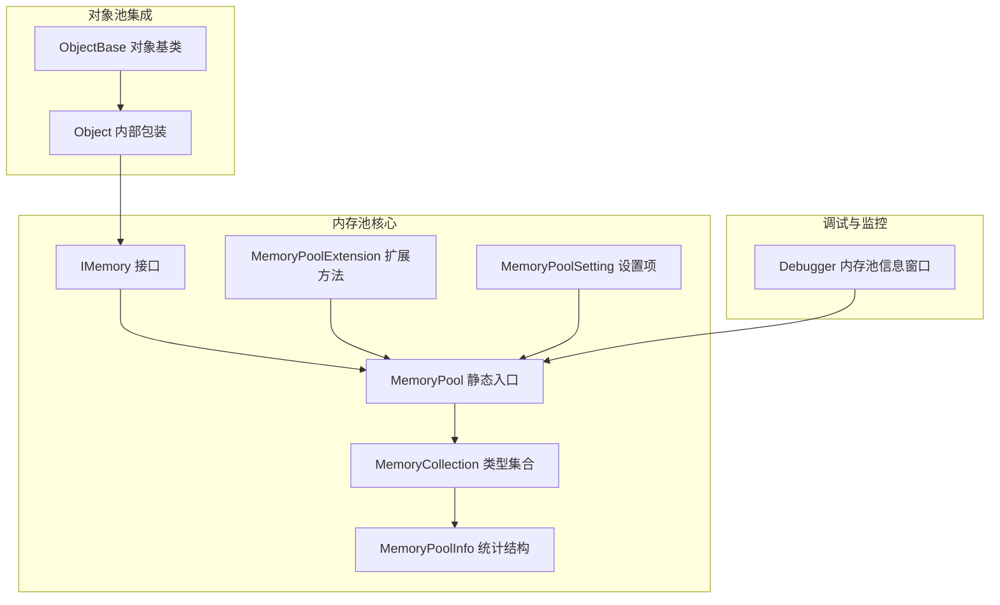
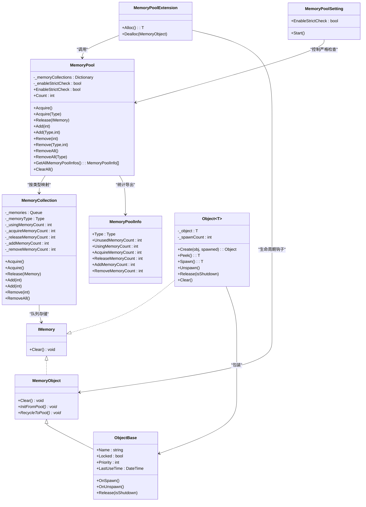
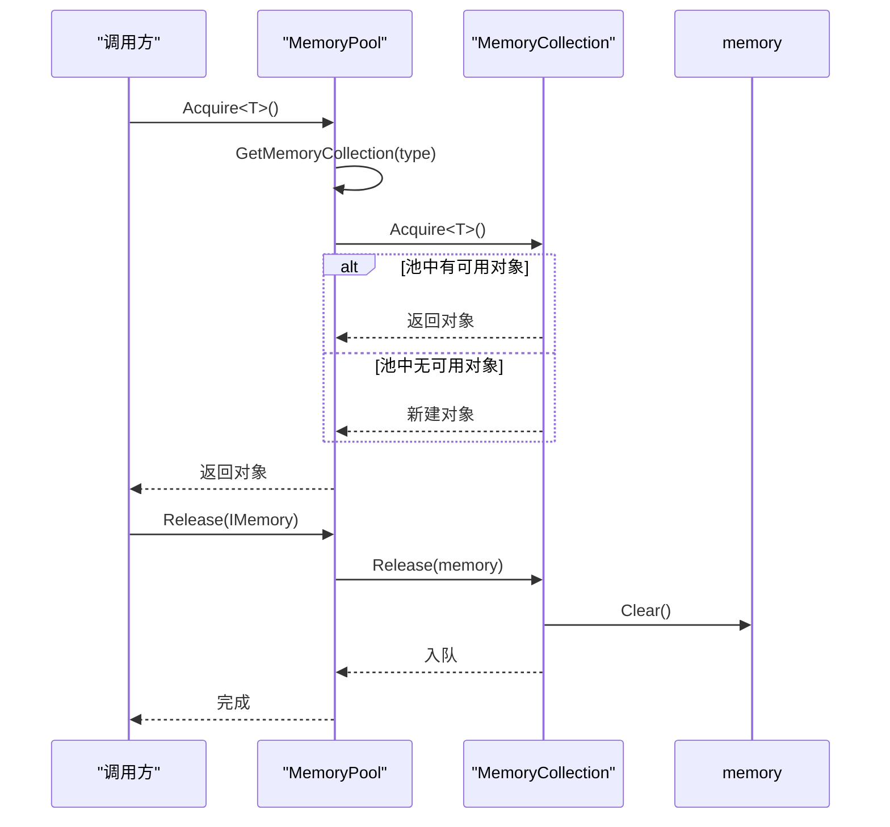
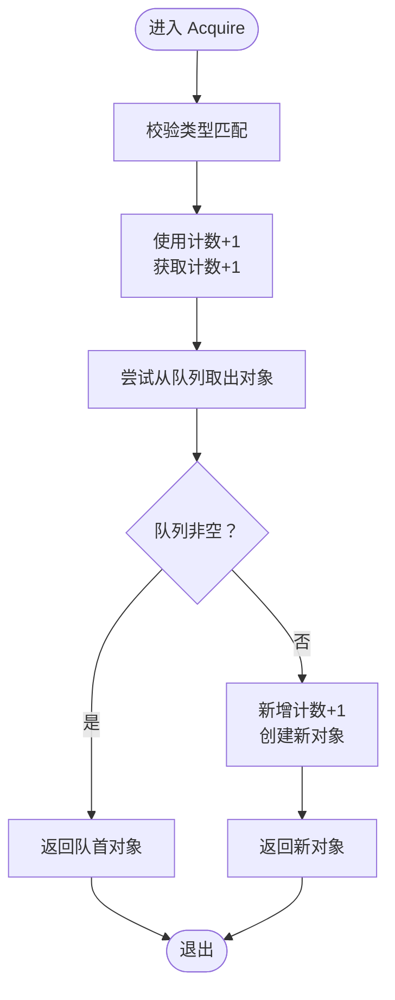
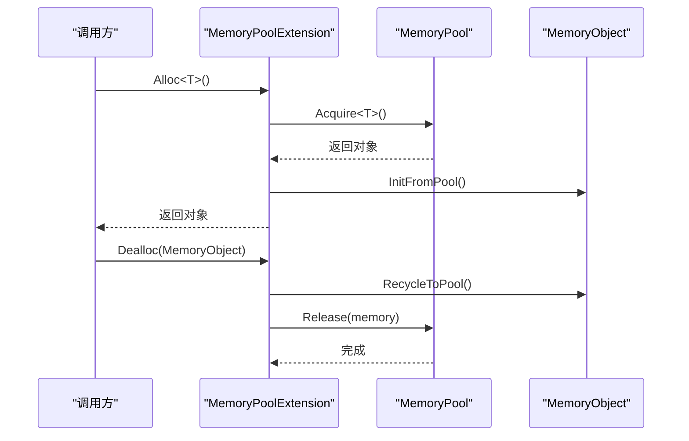
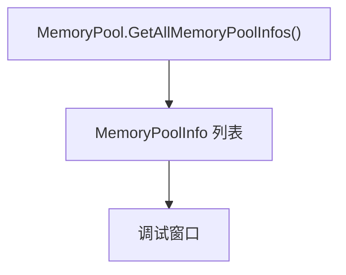
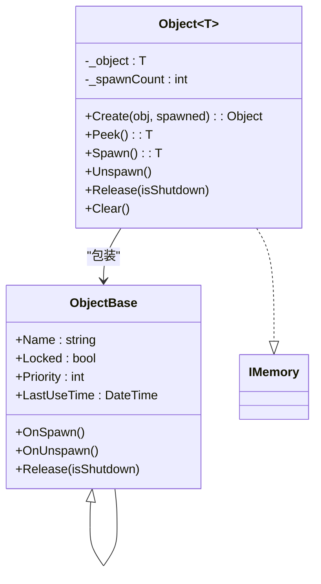
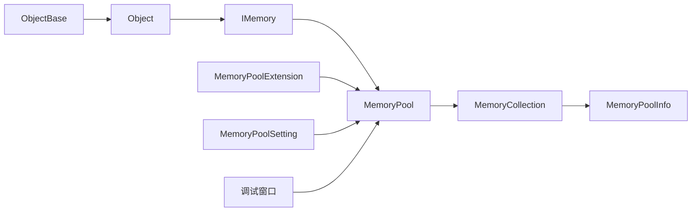

# 内存管理

<cite>
**本文引用的文件**
- [IMemory.cs](file://Assets/TEngine/Runtime/Core/MemoryPool/IMemory.cs)
- [MemoryPool.cs](file://Assets/TEngine/Runtime/Core/MemoryPool/MemoryPool.cs)
- [MemoryPool.MemoryCollection.cs](file://Assets/TEngine/Runtime/Core/MemoryPool/MemoryPool.MemoryCollection.cs)
- [MemoryPoolExtension.cs](file://Assets/TEngine/Runtime/Core/MemoryPool/MemoryPoolExtension.cs)
- [MemoryPoolInfo.cs](file://Assets/TEngine/Runtime/Core/MemoryPool/MemoryPoolInfo.cs)
- [MemoryPoolSetting.cs](file://Assets/TEngine/Runtime/Core/MemoryPool/MemoryPoolSetting.cs)
- [DebuggerModule.MemoryPoolInformationWindow.cs](file://Assets/TEngine/Runtime/Module/DebugerModule/Component/DebuggerModule.MemoryPoolInformationWindow.cs)
- [ObjectPoolModule.Object.cs](file://Assets/TEngine/Runtime/Module/ObjectPoolModule/ObjectPoolModule.Object.cs)
- [ObjectBase.cs](file://Assets/TEngine/Runtime/Module/ObjectPoolModule/ObjectBase.cs)
</cite>

## 目录
1. [引言](#引言)
2. [项目结构](#项目结构)
3. [核心组件](#核心组件)
4. [架构总览](#架构总览)
5. [详细组件分析](#详细组件分析)
6. [依赖关系分析](#依赖关系分析)
7. [性能考量](#性能考量)
8. [故障排查指南](#故障排查指南)
9. [结论](#结论)
10. [附录：使用示例与最佳实践](#附录使用示例与最佳实践)

## 引言
本文件系统性梳理 TEngine 的内存管理系统，重点围绕“内存池”与“对象池”的设计与实现展开，涵盖内存分配策略、对象复用、统计与监控、调试工具以及性能优化建议。文档同时给出面向工程实践的最佳实践与常见问题排查方法，帮助开发者在保证性能的同时降低内存抖动与泄漏风险。

## 项目结构
TEngine 的内存管理位于运行时核心模块下，采用“接口 + 静态入口 + 类型隔离集合”的分层设计：
- 接口层：定义统一的内存对象契约
- 管理层：静态入口负责类型到集合的映射、严格校验与统计
- 集合层：按类型维护队列化的可用对象与使用计数
- 扩展层：为可复用对象提供生命周期钩子（初始化/回收）
- 调试层：可视化展示各类型内存池的统计信息

图表来源
- [MemoryPool.cs:1-208](file://Assets/TEngine/Runtime/Core/MemoryPool/MemoryPool.cs#L1-L208)
- [MemoryPool.MemoryCollection.cs:1-157](file://Assets/TEngine/Runtime/Core/MemoryPool/MemoryPool.MemoryCollection.cs#L1-L157)
- [MemoryPoolInfo.cs:1-119](file://Assets/TEngine/Runtime/Core/MemoryPool/MemoryPoolInfo.cs#L1-L119)
- [MemoryPoolExtension.cs:1-57](file://Assets/TEngine/Runtime/Core/MemoryPool/MemoryPoolExtension.cs#L1-L57)
- [MemoryPoolSetting.cs:1-80](file://Assets/TEngine/Runtime/Core/MemoryPool/MemoryPoolSetting.cs#L1-L80)
- [DebuggerModule.MemoryPoolInformationWindow.cs:1-107](file://Assets/TEngine/Runtime/Module/DebugerModule/Component/DebuggerModule.MemoryPoolInformationWindow.cs#L1-L107)
- [ObjectPoolModule.Object.cs:1-190](file://Assets/TEngine/Runtime/Module/ObjectPoolModule/ObjectPoolModule.Object.cs#L1-L190)
- [ObjectBase.cs:1-56](file://Assets/TEngine/Runtime/Module/ObjectPoolModule/ObjectBase.cs#L1-L56)

章节来源
- [MemoryPool.cs:1-208](file://Assets/TEngine/Runtime/Core/MemoryPool/MemoryPool.cs#L1-L208)
- [MemoryPool.MemoryCollection.cs:1-157](file://Assets/TEngine/Runtime/Core/MemoryPool/MemoryPool.MemoryCollection.cs#L1-L157)
- [MemoryPoolExtension.cs:1-57](file://Assets/TEngine/Runtime/Core/MemoryPool/MemoryPoolExtension.cs#L1-L57)
- [MemoryPoolInfo.cs:1-119](file://Assets/TEngine/Runtime/Core/MemoryPool/MemoryPoolInfo.cs#L1-L119)
- [MemoryPoolSetting.cs:1-80](file://Assets/TEngine/Runtime/Core/MemoryPool/MemoryPoolSetting.cs#L1-L80)
- [DebuggerModule.MemoryPoolInformationWindow.cs:1-107](file://Assets/TEngine/Runtime/Module/DebugerModule/Component/DebuggerModule.MemoryPoolInformationWindow.cs#L1-L107)
- [ObjectPoolModule.Object.cs:1-190](file://Assets/TEngine/Runtime/Module/ObjectPoolModule/ObjectPoolModule.Object.cs#L1-L190)
- [ObjectBase.cs:1-56](file://Assets/TEngine/Runtime/Module/ObjectPoolModule/ObjectBase.cs#L1-L56)

## 核心组件
- IMemory：内存对象的最小契约，要求实现清理方法以便回收至池中
- MemoryPool：静态入口，提供获取/归还/扩容/缩容/清空/统计等能力，并支持严格校验
- MemoryCollection：按类型隔离的内存集合，内部以队列存储可用对象，维护使用/获取/归还/新增/移除计数
- MemoryPoolExtension：扩展 Alloc/Dealloc，为可复用对象提供“从池初始化/回收”的生命周期钩子
- MemoryPoolInfo：用于导出内存池统计信息的结构体
- MemoryPoolSetting：通过 Unity 组件控制严格检查开关，支持按构建类型自动启用
- 调试窗口：将 MemoryPool 统计按程序集分组展示，支持全名/短名切换排序

章节来源
- [IMemory.cs:1-14](file://Assets/TEngine/Runtime/Core/MemoryPool/IMemory.cs#L1-L14)
- [MemoryPool.cs:1-208](file://Assets/TEngine/Runtime/Core/MemoryPool/MemoryPool.cs#L1-L208)
- [MemoryPool.MemoryCollection.cs:1-157](file://Assets/TEngine/Runtime/Core/MemoryPool/MemoryPool.MemoryCollection.cs#L1-L157)
- [MemoryPoolExtension.cs:1-57](file://Assets/TEngine/Runtime/Core/MemoryPool/MemoryPoolExtension.cs#L1-L57)
- [MemoryPoolInfo.cs:1-119](file://Assets/TEngine/Runtime/Core/MemoryPool/MemoryPoolInfo.cs#L1-L119)
- [MemoryPoolSetting.cs:1-80](file://Assets/TEngine/Runtime/Core/MemoryPool/MemoryPoolSetting.cs#L1-L80)
- [DebuggerModule.MemoryPoolInformationWindow.cs:1-107](file://Assets/TEngine/Runtime/Module/DebugerModule/Component/DebuggerModule.MemoryPoolInformationWindow.cs#L1-L107)

## 架构总览
TEngine 的内存管理采用“静态入口 + 类型隔离集合”的架构：
- 静态入口负责类型到集合的映射与全局统计
- 每个类型拥有独立的 MemoryCollection，内部以线程安全队列管理可用对象
- 严格检查模式可在开发/编辑器环境下启用，以捕获误用问题但会带来性能开销
- 调试模块提供可视化统计，便于定位热点类型与异常行为

图表来源
- [MemoryPool.cs:1-208](file://Assets/TEngine/Runtime/Core/MemoryPool/MemoryPool.cs#L1-L208)
- [MemoryPool.MemoryCollection.cs:1-157](file://Assets/TEngine/Runtime/Core/MemoryPool/MemoryPool.MemoryCollection.cs#L1-L157)
- [MemoryPoolExtension.cs:1-57](file://Assets/TEngine/Runtime/Core/MemoryPool/MemoryPoolExtension.cs#L1-L57)
- [MemoryPoolInfo.cs:1-119](file://Assets/TEngine/Runtime/Core/MemoryPool/MemoryPoolInfo.cs#L1-L119)
- [MemoryPoolSetting.cs:1-80](file://Assets/TEngine/Runtime/Core/MemoryPool/MemoryPoolSetting.cs#L1-L80)
- [ObjectPoolModule.Object.cs:1-190](file://Assets/TEngine/Runtime/Module/ObjectPoolModule/ObjectPoolModule.Object.cs#L1-L190)
- [ObjectBase.cs:1-56](file://Assets/TEngine/Runtime/Module/ObjectPoolModule/ObjectBase.cs#L1-L56)

## 详细组件分析

### MemoryPool 静态入口
- 类型映射与延迟创建：首次访问某类型时创建对应集合，避免无用开销
- 严格检查：可选的类型与状态校验，防止重复释放与非法类型
- 统计导出：提供所有类型的统计快照，便于调试与监控
- 清理与扩容：支持批量添加/移除，以及全量清空

图表来源
- [MemoryPool.cs:71-101](file://Assets/TEngine/Runtime/Core/MemoryPool/MemoryPool.cs#L71-L101)
- [MemoryPool.MemoryCollection.cs:46-98](file://Assets/TEngine/Runtime/Core/MemoryPool/MemoryPool.MemoryCollection.cs#L46-L98)

章节来源
- [MemoryPool.cs:1-208](file://Assets/TEngine/Runtime/Core/MemoryPool/MemoryPool.cs#L1-L208)

### MemoryCollection 类型集合
- 队列化存储：使用队列存放可用对象，先进先出，天然支持“最近最少使用”倾向的复用
- 计数统计：分别记录使用中、获取、归还、新增、移除次数，便于分析热点与异常
- 线程安全：对队列与计数进行加锁保护，确保并发安全
- 动态扩容：当池中无可用对象时自动新建，避免阻塞

图表来源
- [MemoryPool.MemoryCollection.cs:46-81](file://Assets/TEngine/Runtime/Core/MemoryPool/MemoryPool.MemoryCollection.cs#L46-L81)

章节来源
- [MemoryPool.MemoryCollection.cs:1-157](file://Assets/TEngine/Runtime/Core/MemoryPool/MemoryPool.MemoryCollection.cs#L1-L157)

### MemoryPoolExtension 扩展与 MemoryObject 生命周期
- Alloc/Dealloc：封装“从池获取 -> 初始化”和“回收 -> 归还”的流程
- MemoryObject：抽象基类，要求实现“从池初始化/回收”，便于业务对象复用时保持一致的生命周期语义

图表来源
- [MemoryPoolExtension.cs:35-55](file://Assets/TEngine/Runtime/Core/MemoryPool/MemoryPoolExtension.cs#L35-L55)
- [MemoryPool.cs:71-101](file://Assets/TEngine/Runtime/Core/MemoryPool/MemoryPool.cs#L71-L101)

章节来源
- [MemoryPoolExtension.cs:1-57](file://Assets/TEngine/Runtime/Core/MemoryPool/MemoryPoolExtension.cs#L1-L57)

### MemoryPoolInfo 统计结构与调试窗口
- MemoryPoolInfo：不可变结构，承载类型与各类计数，便于 UI 展示与序列化
- 调试窗口：按程序集分组展示各类型内存池统计，支持全名/短名排序与切换

图表来源
- [MemoryPool.cs:33-48](file://Assets/TEngine/Runtime/Core/MemoryPool/MemoryPool.cs#L33-L48)
- [MemoryPoolInfo.cs:1-119](file://Assets/TEngine/Runtime/Core/MemoryPool/MemoryPoolInfo.cs#L1-L119)
- [DebuggerModule.MemoryPoolInformationWindow.cs:20-93](file://Assets/TEngine/Runtime/Module/DebugerModule/Component/DebuggerModule.MemoryPoolInformationWindow.cs#L20-L93)

章节来源
- [MemoryPoolInfo.cs:1-119](file://Assets/TEngine/Runtime/Core/MemoryPool/MemoryPoolInfo.cs#L1-L119)
- [DebuggerModule.MemoryPoolInformationWindow.cs:1-107](file://Assets/TEngine/Runtime/Module/DebugerModule/Component/DebuggerModule.MemoryPoolInformationWindow.cs#L1-L107)

### MemoryPoolSetting 严格检查配置
- 支持四种策略：总是启用、开发构建启用、编辑器启用、总是禁用
- 启用时输出性能提示，避免在生产环境造成显著开销

章节来源
- [MemoryPoolSetting.cs:1-80](file://Assets/TEngine/Runtime/Core/MemoryPool/MemoryPoolSetting.cs#L1-L80)

### 与对象池模块的集成
- ObjectBase：对象池中业务对象的基类，实现 IMemory，具备锁定、优先级、最后使用时间等属性
- Object<T>：对象池内部包装器，实现 IMemory，持有业务对象并维护获取计数；创建时从 MemoryPool 获取，释放时归还
- 该集成体现了“对象池”与“内存池”的协作：对象池负责对象级生命周期，内存池负责内存级复用

图表来源
- [ObjectPoolModule.Object.cs:11-187](file://Assets/TEngine/Runtime/Module/ObjectPoolModule/ObjectPoolModule.Object.cs#L11-L187)
- [ObjectBase.cs:8-56](file://Assets/TEngine/Runtime/Module/ObjectPoolModule/ObjectBase.cs#L8-L56)
- [IMemory.cs:6-12](file://Assets/TEngine/Runtime/Core/MemoryPool/IMemory.cs#L6-L12)

章节来源
- [ObjectPoolModule.Object.cs:1-190](file://Assets/TEngine/Runtime/Module/ObjectPoolModule/ObjectPoolModule.Object.cs#L1-L190)
- [ObjectBase.cs:1-56](file://Assets/TEngine/Runtime/Module/ObjectPoolModule/ObjectBase.cs#L1-L56)

## 依赖关系分析
- 松耦合：MemoryPool 通过类型键值映射到 MemoryCollection，避免跨类型耦合
- 可观测：通过 MemoryPoolInfo 导出统计，调试窗口按程序集聚合，利于定位问题
- 可配置：MemoryPoolSetting 提供多档位严格检查策略，兼顾开发效率与生产稳定性

图表来源
- [MemoryPool.cs:1-208](file://Assets/TEngine/Runtime/Core/MemoryPool/MemoryPool.cs#L1-L208)
- [MemoryPool.MemoryCollection.cs:1-157](file://Assets/TEngine/Runtime/Core/MemoryPool/MemoryPool.MemoryCollection.cs#L1-L157)
- [MemoryPoolExtension.cs:1-57](file://Assets/TEngine/Runtime/Core/MemoryPool/MemoryPoolExtension.cs#L1-L57)
- [MemoryPoolInfo.cs:1-119](file://Assets/TEngine/Runtime/Core/MemoryPool/MemoryPoolInfo.cs#L1-L119)
- [MemoryPoolSetting.cs:1-80](file://Assets/TEngine/Runtime/Core/MemoryPool/MemoryPoolSetting.cs#L1-L80)
- [DebuggerModule.MemoryPoolInformationWindow.cs:1-107](file://Assets/TEngine/Runtime/Module/DebugerModule/Component/DebuggerModule.MemoryPoolInformationWindow.cs#L1-L107)
- [ObjectPoolModule.Object.cs:1-190](file://Assets/TEngine/Runtime/Module/ObjectPoolModule/ObjectPoolModule.Object.cs#L1-L190)
- [ObjectBase.cs:1-56](file://Assets/TEngine/Runtime/Module/ObjectPoolModule/ObjectBase.cs#L1-L56)

## 性能考量
- 分配策略
  - 批量预热：在场景加载阶段使用 Add<T>(count) 预先填充常用类型对象，降低运行时抖动
  - 类型隔离：不同类型的对象池互不影响，避免跨类型竞争
- 复用与对齐
  - 使用队列实现 FIFO 复用，减少频繁 GC 压力
  - 严格检查仅在开发/编辑器启用，避免生产环境额外分支
- 统计与监控
  - 通过 MemoryPoolInfo 观察获取/归还/新增/移除趋势，识别异常峰值
  - 调试窗口按程序集分组，快速定位热点类型
- 垃圾回收优化
  - 明确对象生命周期：使用 Alloc/Dealloc 或 Acquire/Release，确保 Clear() 在归还前被调用
  - 避免跨帧持有大对象引用，及时 Unspawn/Release 并归还池中

[本节为通用性能指导，无需列出具体文件来源]

## 故障排查指南
- 常见错误与定位
  - 重复释放：启用严格检查后，若同一对象再次归还会抛出异常；可通过调试窗口观察“归还计数”与“使用中计数”的一致性
  - 类型不匹配：向集合写入非声明类型的对象会触发异常；检查泛型参数与集合类型是否一致
  - 空引用：向 MemoryPool.Release 传入 null 会抛出异常；确保调用前判空
- 调试步骤
  - 在开发构建中启用严格检查，观察日志与异常堆栈
  - 使用调试窗口对比“获取/归还/新增/移除”计数，识别异常波动
  - 对热点类型执行批量预热，观察抖动是否缓解

章节来源
- [MemoryPool.cs:91-101](file://Assets/TEngine/Runtime/Core/MemoryPool/MemoryPool.cs#L91-L101)
- [MemoryPool.MemoryCollection.cs:83-98](file://Assets/TEngine/Runtime/Core/MemoryPool/MemoryPool.MemoryCollection.cs#L83-L98)
- [MemoryPoolSetting.cs:43-78](file://Assets/TEngine/Runtime/Core/MemoryPool/MemoryPoolSetting.cs#L43-L78)
- [DebuggerModule.MemoryPoolInformationWindow.cs:20-93](file://Assets/TEngine/Runtime/Module/DebugerModule/Component/DebuggerModule.MemoryPoolInformationWindow.cs#L20-L93)

## 结论
TEngine 的内存管理以“静态入口 + 类型隔离集合”为核心，结合严格的可配置检查与完善的统计监控，形成一套高效、可观测且易用的内存复用体系。通过合理使用 Alloc/Dealloc 与 Add/Remove 等 API，并配合批量预热与调试工具，可以在保证性能的同时有效降低内存抖动与泄漏风险。

[本节为总结性内容，无需列出具体文件来源]

## 附录：使用示例与最佳实践

- 使用示例（概要）
  - 获取/归还对象：通过 MemoryPool.Acquire<T>() 与 MemoryPool.Release 获取与归还对象
  - 扩容/缩容：在场景加载阶段使用 MemoryPool.Add<T>(count) 进行批量预热；在卸载阶段使用 MemoryPool.Remove<T>(count) 或 RemoveAll<T>() 释放
  - 生命周期：对于需要复用的对象，继承 MemoryObject 并实现 InitFromPool/RecycleToPool，在 Alloc/Dealloc 流程中自动调用
  - 对象池集成：在对象池模块中，Object<T> 包装业务对象，遵循“创建时从内存池获取，释放时归还”的原则

- 最佳实践
  - 生命周期管理
    - 明确对象的“获取/使用/归还”边界，避免跨作用域持有引用
    - 在对象不再使用时及时调用 Clear() 或相应回收流程
  - 内存泄漏预防
    - 严格区分“对象池”与“内存池”职责：对象池负责对象级生命周期，内存池负责内存级复用
    - 避免在对象中持有外部大对象引用，必要时在 Clear 中置空
  - 性能监控
    - 开发阶段启用严格检查，定位异常行为
    - 使用调试窗口持续观察热点类型与计数变化，制定扩容/缩容策略
  - 批量分配与预热
    - 在场景切换/关卡开始前，对高频类型执行 Add<T>(count) 预热
    - 对于临时对象，尽量使用 MemoryObject 并在生命周期结束时归还

- 性能优化建议
  - 控制池大小：根据峰值使用量设定合理的预热数量，避免过度预热导致内存占用过高
  - 减少锁竞争：在高并发场景下，尽量批量获取/归还，减少频繁的队列操作
  - 对象对齐：尽量让对象大小与 GC 分代对齐，减少晋升压力（由上层业务对象设计配合）

[本节为实践指导，无需列出具体文件来源]