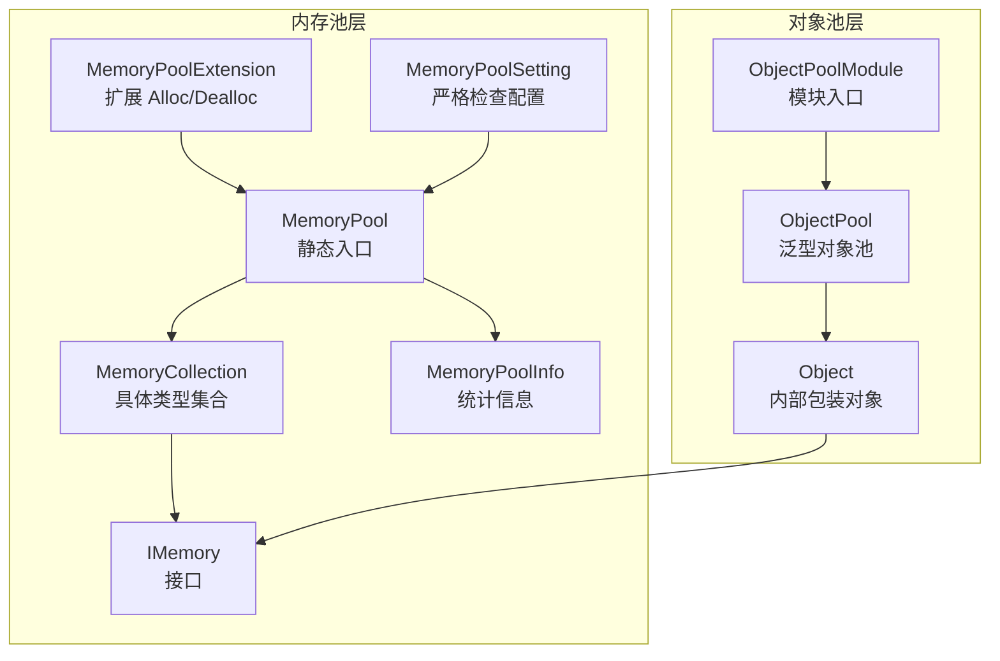
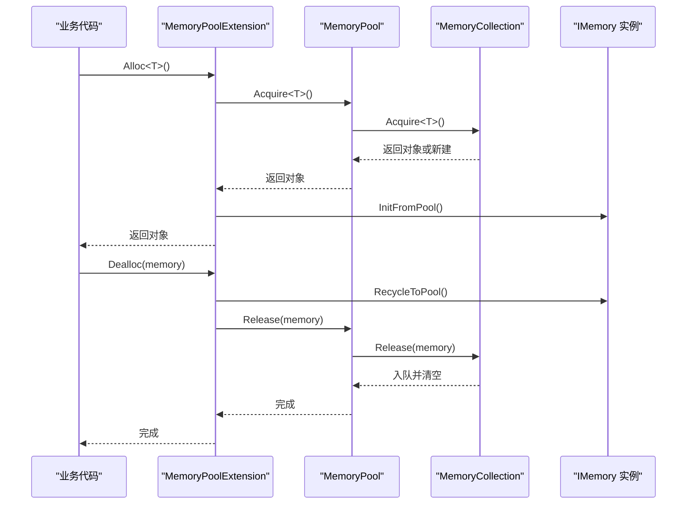
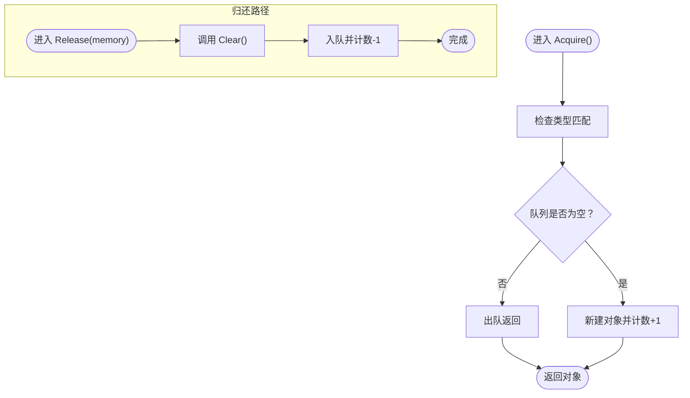
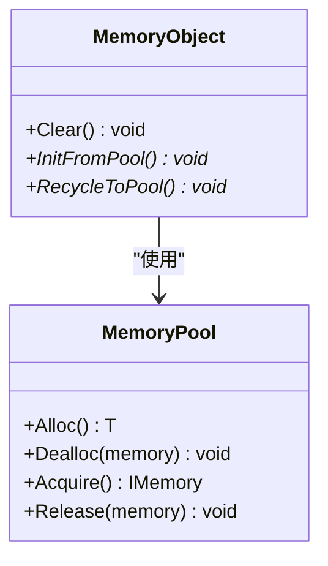
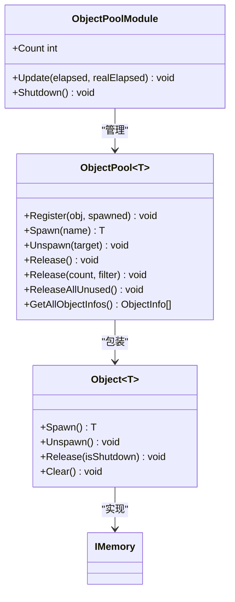
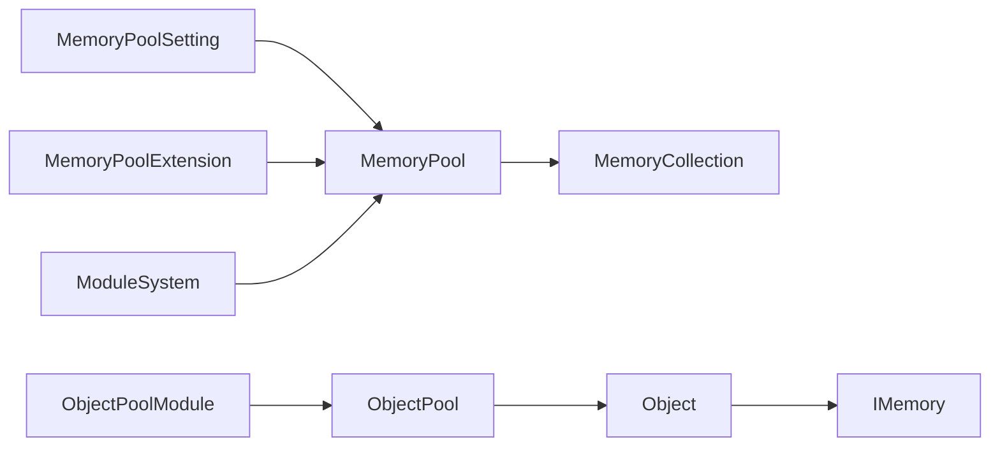

# 内存管理最佳实践

<cite>
**本文档引用的文件**
- [MemoryPool.cs](file://Assets/TEngine/Runtime/Core/MemoryPool/MemoryPool.cs)
- [MemoryPoolExtension.cs](file://Assets/TEngine/Runtime/Core/MemoryPool/MemoryPoolExtension.cs)
- [MemoryPool.MemoryCollection.cs](file://Assets/TEngine/Runtime/Core/MemoryPool/MemoryPool.MemoryCollection.cs)
- [MemoryPoolInfo.cs](file://Assets/TEngine/Runtime/Core/MemoryPool/MemoryPoolInfo.cs)
- [MemoryPoolSetting.cs](file://Assets/TEngine/Runtime/Core/MemoryPool/MemoryPoolSetting.cs)
- [IMemory.cs](file://Assets/TEngine/Runtime/Core/MemoryPool/IMemory.cs)
- [ObjectPoolModule.cs](file://Assets/TEngine/Runtime/Module/ObjectPoolModule/ObjectPoolModule.cs)
- [ObjectPoolModule.Object.cs](file://Assets/TEngine/Runtime/Module/ObjectPoolModule/ObjectPoolModule.Object.cs)
- [ObjectPoolModule.ObjectPool.cs](file://Assets/TEngine/Runtime/Module/ObjectPoolModule/ObjectPoolModule.ObjectPool.cs)
- [IObjectPoolModule.cs](file://Assets/TEngine/Runtime/Module/ObjectPoolModule/IObjectPoolModule.cs)
- [ModuleSystem.cs](file://Assets/TEngine/Runtime/Core/ModuleSystem.cs)
- [SceneModule.cs](file://Assets/TEngine/Runtime/Module/SceneModule/SceneModule.cs)
- [DebuggerModule.ProfilerInformationWindow.cs](file://Assets/TEngine/Runtime/Module/DebugerModule/Component/DebuggerModule.ProfilerInformationWindow.cs)
- [DebuggerModule.RuntimeMemoryInformationWindow.cs](file://Assets/TEngine/Runtime/Module/DebugerModule/Component/DebuggerModule.RuntimeMemoryInformationWindow.cs)
- [DebuggerModule.RuntimeMemorySummaryWindow.cs](file://Assets/TEngine/Runtime/Module/DebugerModule/Component/DebuggerModule.RuntimeMemorySummaryWindow.cs)
- [DebuggerModule.MemoryPoolInformationWindow.cs](file://Assets/TEngine/Runtime/Module/DebugerModule/Component/DebuggerModule.MemoryPoolInformationWindow.cs)
- [Log.cs](file://Assets/TEngine/Runtime/Core/Log/Log.cs)
</cite>

## 目录
1. [引言](#引言)
2. [项目结构](#项目结构)
3. [核心组件](#核心组件)
4. [架构总览](#架构总览)
5. [详细组件分析](#详细组件分析)
6. [依赖关系分析](#依赖关系分析)
7. [性能考量](#性能考量)
8. [故障排除指南](#故障排除指南)
9. [结论](#结论)
10. [附录](#附录)

## 引言
本指南面向TEngine项目的开发者，系统性地梳理内存管理的最佳实践与实现细节，覆盖对象生命周期管理、内存使用规范、性能监控方法、常见陷阱与规避策略、调试技巧与工具使用、以及不同场景下的策略选择（如游戏循环、场景切换、热更新）。文档以仓库中的内存池与对象池实现为核心，结合调试器窗口与日志体系，提供可操作的建议与排障流程。

## 项目结构
TEngine的内存管理由两大部分构成：
- 内存池（MemoryPool）：通用对象池，统一管理实现了IMemory接口的对象，支持严格校验、统计与批量增删。
- 对象池（ObjectPoolModule）：基于内存池的高级对象池，负责对象注册、获取、回收、释放与自动清理。

**图表来源**
- [MemoryPool.cs:1-207](file://Assets/TEngine/Runtime/Core/MemoryPool/MemoryPool.cs#L1-L207)
- [MemoryPool.MemoryCollection.cs:1-156](file://Assets/TEngine/Runtime/Core/MemoryPool/MemoryPool.MemoryCollection.cs#L1-L156)
- [IMemory.cs:1-14](file://Assets/TEngine/Runtime/Core/MemoryPool/IMemory.cs#L1-L14)
- [MemoryPoolExtension.cs:1-57](file://Assets/TEngine/Runtime/Core/MemoryPool/MemoryPoolExtension.cs#L1-L57)
- [MemoryPoolInfo.cs:1-119](file://Assets/TEngine/Runtime/Core/MemoryPool/MemoryPoolInfo.cs#L1-L119)
- [MemoryPoolSetting.cs:1-80](file://Assets/TEngine/Runtime/Core/MemoryPool/MemoryPoolSetting.cs#L1-L80)
- [ObjectPoolModule.cs:1-76](file://Assets/TEngine/Runtime/Module/ObjectPoolModule/ObjectPoolModule.cs#L1-L76)
- [ObjectPoolModule.ObjectPool.cs:1-602](file://Assets/TEngine/Runtime/Module/ObjectPoolModule/ObjectPoolModule.ObjectPool.cs#L1-L602)
- [ObjectPoolModule.Object.cs:1-190](file://Assets/TEngine/Runtime/Module/ObjectPoolModule/ObjectPoolModule.Object.cs#L1-L190)

**章节来源**
- [MemoryPool.cs:1-207](file://Assets/TEngine/Runtime/Core/MemoryPool/MemoryPool.cs#L1-L207)
- [ObjectPoolModule.cs:1-76](file://Assets/TEngine/Runtime/Module/ObjectPoolModule/ObjectPoolModule.cs#L1-L76)

## 核心组件
- 内存池（MemoryPool）
  - 提供Acquire/Release静态入口，按类型管理队列化对象。
  - 支持Add/Remove/RemoveAll批量增删，统计各类型使用情况。
  - 可通过MemoryPoolSetting控制严格检查开关，影响性能与安全性。
- 内存池扩展（MemoryPoolExtension）
  - 提供Alloc/Dealloc便捷方法，封装InitFromPool/RecycleToPool与Release流程。
- 内存池信息（MemoryPoolInfo）
  - 暴露类型、未使用/使用计数、获取/归还/新增/移除次数等统计。
- 对象池模块（ObjectPoolModule）
  - 管理多类型对象池，支持容量、过期时间、优先级、自动释放。
  - 内部对象包装Object<T>，实现Spawn/Unspawn/Release与生命周期钩子。
- 模块系统（ModuleSystem）
  - 在关机时统一调用MemoryPool.ClearAll()与Utility.Marshal.FreeCachedHGlobal()，确保资源回收。

**章节来源**
- [MemoryPool.cs:1-207](file://Assets/TEngine/Runtime/Core/MemoryPool/MemoryPool.cs#L1-L207)
- [MemoryPoolExtension.cs:1-57](file://Assets/TEngine/Runtime/Core/MemoryPool/MemoryPoolExtension.cs#L1-L57)
- [MemoryPoolInfo.cs:1-119](file://Assets/TEngine/Runtime/Core/MemoryPool/MemoryPoolInfo.cs#L1-L119)
- [ObjectPoolModule.cs:1-76](file://Assets/TEngine/Runtime/Module/ObjectPoolModule/ObjectPoolModule.cs#L1-L76)
- [ObjectPoolModule.ObjectPool.cs:1-602](file://Assets/TEngine/Runtime/Module/ObjectPoolModule/ObjectPoolModule.ObjectPool.cs#L1-L602)
- [ObjectPoolModule.Object.cs:1-190](file://Assets/TEngine/Runtime/Module/ObjectPoolModule/ObjectPoolModule.Object.cs#L1-L190)
- [ModuleSystem.cs:30-69](file://Assets/TEngine/Runtime/Core/ModuleSystem.cs#L30-L69)

## 架构总览
内存管理的调用链路如下：

**图表来源**
- [MemoryPoolExtension.cs:1-57](file://Assets/TEngine/Runtime/Core/MemoryPool/MemoryPoolExtension.cs#L1-L57)
- [MemoryPool.cs:72-101](file://Assets/TEngine/Runtime/Core/MemoryPool/MemoryPool.cs#L72-L101)
- [MemoryPool.MemoryCollection.cs:46-98](file://Assets/TEngine/Runtime/Core/MemoryPool/MemoryPool.MemoryCollection.cs#L46-L98)

## 详细组件分析

### 组件A：内存池（MemoryPool）
- 设计要点
  - 类型隔离：每个Type对应一个MemoryCollection，保证类型安全。
  - 线程安全：对队列与字典访问使用lock，避免并发冲突。
  - 统计追踪：记录获取/归还/新增/移除次数，便于性能分析。
  - 严格检查：可选的类型与重复释放校验，开发阶段建议开启。
- 关键流程
  - 获取：若队列有剩余则出队，否则新建；计数+1。
  - 归还：Clear后入队，计数-1；严格模式下避免重复归还。
  - 批量：Add/Remove/RemoveAll支持预热与收缩。
- 复杂度
  - 获取/归还摊销O(1)，批量Add/Remove为O(n)。

**图表来源**
- [MemoryPool.MemoryCollection.cs:46-98](file://Assets/TEngine/Runtime/Core/MemoryPool/MemoryPool.MemoryCollection.cs#L46-L98)

**章节来源**
- [MemoryPool.cs:1-207](file://Assets/TEngine/Runtime/Core/MemoryPool/MemoryPool.cs#L1-L207)
- [MemoryPool.MemoryCollection.cs:1-156](file://Assets/TEngine/Runtime/Core/MemoryPool/MemoryPool.MemoryCollection.cs#L1-L156)
- [MemoryPoolInfo.cs:1-119](file://Assets/TEngine/Runtime/Core/MemoryPool/MemoryPoolInfo.cs#L1-L119)

### 组件B：内存池扩展（MemoryPoolExtension）
- 设计要点
  - 为MemoryObject提供Alloc/Dealloc快捷方法，封装生命周期钩子。
  - 明确的异常处理，避免空引用与非法状态。
- 使用建议
  - 所有需要池化的对象应继承MemoryObject并实现InitFromPool/RecycleToPool。
  - 归还对象前必须调用RecycleToPool，确保状态复位。

**图表来源**
- [MemoryPoolExtension.cs:1-57](file://Assets/TEngine/Runtime/Core/MemoryPool/MemoryPoolExtension.cs#L1-L57)
- [IMemory.cs:1-14](file://Assets/TEngine/Runtime/Core/MemoryPool/IMemory.cs#L1-L14)

**章节来源**
- [MemoryPoolExtension.cs:1-57](file://Assets/TEngine/Runtime/Core/MemoryPool/MemoryPoolExtension.cs#L1-L57)

### 组件C：对象池模块（ObjectPoolModule）
- 设计要点
  - 泛型对象池ObjectPool<T>管理注册、获取、回收、释放与自动清理。
  - 内部对象包装Object<T>，持有目标对象与使用计数，提供Spawn/Unspawn/Release。
  - 支持容量、过期时间、优先级、自动释放间隔等策略。
- 生命周期
  - Register：注册已创建对象，可标记是否已Spawn。
  - Spawn：返回可用对象（允许多次Spawn取决于AllowMultiSpawn）。
  - Unspawn：减少使用计数，必要时触发OnUnspawn。
  - Release：根据筛选条件释放可释放对象，支持过期优先策略。
  - Shutdown：关闭时释放所有内部对象并清空缓存。

**图表来源**
- [ObjectPoolModule.cs:1-76](file://Assets/TEngine/Runtime/Module/ObjectPoolModule/ObjectPoolModule.cs#L1-L76)
- [ObjectPoolModule.ObjectPool.cs:1-602](file://Assets/TEngine/Runtime/Module/ObjectPoolModule/ObjectPoolModule.ObjectPool.cs#L1-L602)
- [ObjectPoolModule.Object.cs:1-190](file://Assets/TEngine/Runtime/Module/ObjectPoolModule/ObjectPoolModule.Object.cs#L1-L190)

**章节来源**
- [ObjectPoolModule.cs:1-76](file://Assets/TEngine/Runtime/Module/ObjectPoolModule/ObjectPoolModule.cs#L1-L76)
- [ObjectPoolModule.ObjectPool.cs:1-602](file://Assets/TEngine/Runtime/Module/ObjectPoolModule/ObjectPoolModule.ObjectPool.cs#L1-L602)
- [ObjectPoolModule.Object.cs:1-190](file://Assets/TEngine/Runtime/Module/ObjectPoolModule/ObjectPoolModule.Object.cs#L1-L190)

### 组件D：内存池信息与统计（MemoryPoolInfo）
- 设计要点
  - 结构体封装类型与各类计数，便于调试器窗口展示。
  - 提供按类型名/全名排序比较器，支持灵活展示。
- 使用场景
  - 在调试器“内存池信息”窗口中查看各类型对象的使用与增长趋势。

**章节来源**
- [MemoryPoolInfo.cs:1-119](file://Assets/TEngine/Runtime/Core/MemoryPool/MemoryPoolInfo.cs#L1-L119)
- [DebuggerModule.MemoryPoolInformationWindow.cs:77-106](file://Assets/TEngine/Runtime/Module/DebugerModule/Component/DebuggerModule.MemoryPoolInformationWindow.cs#L77-L106)

## 依赖关系分析
- 内存池层
  - MemoryPool依赖MemoryCollection按类型分组管理对象。
  - MemoryPoolExtension依赖MemoryPool进行对象获取与归还。
  - MemoryPoolSetting控制EnableStrictCheck，影响InternalCheckMemoryType与Release校验。
- 对象池层
  - ObjectPoolModule依赖ObjectPool<T>实现具体对象池功能。
  - ObjectPool<T>内部使用Object<T>包装目标对象，实现生命周期钩子。
- 模块系统
  - ModuleSystem在Shutdown时调用MemoryPool.ClearAll()与内存清理工具，确保全局回收。

**图表来源**
- [MemoryPoolSetting.cs:1-80](file://Assets/TEngine/Runtime/Core/MemoryPool/MemoryPoolSetting.cs#L1-L80)
- [MemoryPool.cs:1-207](file://Assets/TEngine/Runtime/Core/MemoryPool/MemoryPool.cs#L1-L207)
- [MemoryPoolExtension.cs:1-57](file://Assets/TEngine/Runtime/Core/MemoryPool/MemoryPoolExtension.cs#L1-L57)
- [ObjectPoolModule.cs:1-76](file://Assets/TEngine/Runtime/Module/ObjectPoolModule/ObjectPoolModule.cs#L1-L76)
- [ObjectPoolModule.ObjectPool.cs:1-602](file://Assets/TEngine/Runtime/Module/ObjectPoolModule/ObjectPoolModule.ObjectPool.cs#L1-L602)
- [ObjectPoolModule.Object.cs:1-190](file://Assets/TEngine/Runtime/Module/ObjectPoolModule/ObjectPoolModule.Object.cs#L1-L190)
- [ModuleSystem.cs:30-69](file://Assets/TEngine/Runtime/Core/ModuleSystem.cs#L30-L69)

**章节来源**
- [ModuleSystem.cs:30-69](file://Assets/TEngine/Runtime/Core/ModuleSystem.cs#L30-L69)

## 性能考量
- 严格检查（EnableStrictCheck）
  - 开启后会增加类型校验与重复释放检测，显著影响性能，建议仅在开发/调试构建中启用。
  - 可通过MemoryPoolSetting的枚举类型选择Always/Development/Editor/Disable策略。
- 统计与采样
  - 使用MemoryPool.GetAllMemoryPoolInfos()与调试器窗口对比分析对象增长趋势。
  - 运行时内存采样可通过Profiler.GetRuntimeMemorySizeLong()进行，辅助定位大对象与重复分配。
- 对象池策略
  - 合理设置容量、过期时间与自动释放间隔，避免频繁创建销毁。
  - 优先释放低优先级或长时间未使用的对象，保持池内对象活跃度。

**章节来源**
- [MemoryPoolSetting.cs:1-80](file://Assets/TEngine/Runtime/Core/MemoryPool/MemoryPoolSetting.cs#L1-L80)
- [DebuggerModule.ProfilerInformationWindow.cs:31-59](file://Assets/TEngine/Runtime/Module/DebugerModule/Component/DebuggerModule.ProfilerInformationWindow.cs#L31-L59)
- [DebuggerModule.RuntimeMemoryInformationWindow.cs:74-109](file://Assets/TEngine/Runtime/Module/DebugerModule/Component/DebuggerModule.RuntimeMemoryInformationWindow.cs#L74-L109)
- [DebuggerModule.RuntimeMemorySummaryWindow.cs:57-97](file://Assets/TEngine/Runtime/Module/DebugerModule/Component/DebuggerModule.RuntimeMemorySummaryWindow.cs#L57-L97)

## 故障排除指南
- 常见问题与定位
  - 重复归还：严格检查模式下会抛出异常，检查调用链是否遗漏RecycleToPool或多次Release。
  - 类型不匹配：Acquire<T>()与Release(memory)类型不一致导致异常，确认泛型约束与实际类型。
  - 空引用：Dealloc/Release传入null会抛异常，确保对象非空后再归还。
  - 对象池泄漏：未正确Unspawn导致SpawnCount不降，最终无法释放；检查业务逻辑与生命周期。
- 排障步骤
  1. 开启严格检查（开发构建），复现问题并观察异常堆栈。
  2. 使用“内存池信息”窗口查看各类型对象的Using/Unused/Release计数变化。
  3. 使用运行时内存采样窗口定位占用高的对象类型与数量。
  4. 检查对象池的容量、过期时间与自动释放策略，必要时降低容量或缩短过期时间。
  5. 在ModuleSystem.Shutdown时确认MemoryPool.ClearAll()与内存清理工具被调用。
- 场景化问题
  - 场景切换：在加载新场景前调用资源模块的ForceUnloadUnusedAssets，避免残留引用导致泄漏。
  - 热更新：确保DLL加载完成后及时释放不再使用的对象与缓存，避免元数据与程序集驻留。

**章节来源**
- [MemoryPool.cs:91-101](file://Assets/TEngine/Runtime/Core/MemoryPool/MemoryPool.cs#L91-L101)
- [MemoryPool.MemoryCollection.cs:83-98](file://Assets/TEngine/Runtime/Core/MemoryPool/MemoryPool.MemoryCollection.cs#L83-L98)
- [ObjectPoolModule.ObjectPool.cs:408-466](file://Assets/TEngine/Runtime/Module/ObjectPoolModule/ObjectPoolModule.ObjectPool.cs#L408-L466)
- [ModuleSystem.cs:47-60](file://Assets/TEngine/Runtime/Core/ModuleSystem.cs#L47-L60)
- [SceneModule.cs:40-200](file://Assets/TEngine/Runtime/Module/SceneModule/SceneModule.cs#L40-L200)

## 结论
TEngine的内存管理通过“内存池+对象池”的双层设计，提供了高性能、可统计、可调试的内存复用方案。遵循本文的最佳实践与排障流程，可在复杂场景（如游戏循环、场景切换、热更新）中有效避免内存泄漏与抖动，提升整体稳定性与性能表现。

## 附录

### A. 对象生命周期管理清单
- 获取：使用MemoryPoolExtension.Alloc<T>()或ObjectPool<T>.Spawn()。
- 使用：在业务逻辑中直接使用对象，避免跨帧持有。
- 归还：调用MemoryPoolExtension.Dealloc()或ObjectPool<T>.Unspawn()。
- 清理：确保RecycleToPool()在Dealloc前执行，Reset状态。
- 关闭：ModuleSystem.Shutdown时自动清理内存池与缓存。

**章节来源**
- [MemoryPoolExtension.cs:1-57](file://Assets/TEngine/Runtime/Core/MemoryPool/MemoryPoolExtension.cs#L1-L57)
- [ObjectPoolModule.ObjectPool.cs:240-277](file://Assets/TEngine/Runtime/Module/ObjectPoolModule/ObjectPoolModule.ObjectPool.cs#L240-L277)
- [ModuleSystem.cs:47-60](file://Assets/TEngine/Runtime/Core/ModuleSystem.cs#L47-L60)

### B. 内存使用规范
- 优先使用内存池与对象池，避免频繁new。
- 对象池容量与过期时间应结合业务峰值与冷热数据特征设定。
- 严格检查仅在开发/调试构建启用，生产构建关闭以保证性能。
- 定期检查MemoryPoolInfo统计，关注新增与移除次数差异。

**章节来源**
- [MemoryPoolSetting.cs:1-80](file://Assets/TEngine/Runtime/Core/MemoryPool/MemoryPoolSetting.cs#L1-L80)
- [MemoryPoolInfo.cs:1-119](file://Assets/TEngine/Runtime/Core/MemoryPool/MemoryPoolInfo.cs#L1-L119)

### C. 性能监控方法
- 使用调试器窗口“内存池信息”与“运行时内存采样/汇总”。
- 通过Profiler.GetMonoUsedSizeLong/Profiler.GetTotalAllocatedMemoryLong等接口采集关键指标。
- 在关键节点（场景切换前后、热更新完成）进行采样对比。

**章节来源**
- [DebuggerModule.MemoryPoolInformationWindow.cs:77-106](file://Assets/TEngine/Runtime/Module/DebugerModule/Component/DebuggerModule.MemoryPoolInformationWindow.cs#L77-L106)
- [DebuggerModule.ProfilerInformationWindow.cs:31-59](file://Assets/TEngine/Runtime/Module/DebugerModule/Component/DebuggerModule.ProfilerInformationWindow.cs#L31-L59)
- [DebuggerModule.RuntimeMemoryInformationWindow.cs:74-109](file://Assets/TEngine/Runtime/Module/DebugerModule/Component/DebuggerModule.RuntimeMemoryInformationWindow.cs#L74-L109)
- [DebuggerModule.RuntimeMemorySummaryWindow.cs:57-97](file://Assets/TEngine/Runtime/Module/DebugerModule/Component/DebuggerModule.RuntimeMemorySummaryWindow.cs#L57-L97)

### D. 调试技巧与工具
- 日志：使用Log.Info/Debug输出关键事件与统计信息，便于回溯。
- 严格检查：在MemoryPoolSetting中选择合适的启用策略，快速暴露问题。
- 采样：定期采样运行时内存，识别异常增长点。

**章节来源**
- [Log.cs:1-800](file://Assets/TEngine/Runtime/Core/Log/Log.cs#L1-L800)
- [MemoryPoolSetting.cs:1-80](file://Assets/TEngine/Runtime/Core/MemoryPool/MemoryPoolSetting.cs#L1-L80)

### E. 不同场景下的策略选择
- 游戏循环
  - 使用对象池承载临时对象（如特效、UI弹窗），设置合理容量与过期时间。
- 场景切换
  - 切换前调用资源模块的卸载接口，SceneModule中可选择是否触发GC回收。
- 热更新
  - 更新完成后释放不再使用的对象与缓存，避免元数据与程序集长期驻留。

**章节来源**
- [SceneModule.cs:40-200](file://Assets/TEngine/Runtime/Module/SceneModule/SceneModule.cs#L40-L200)