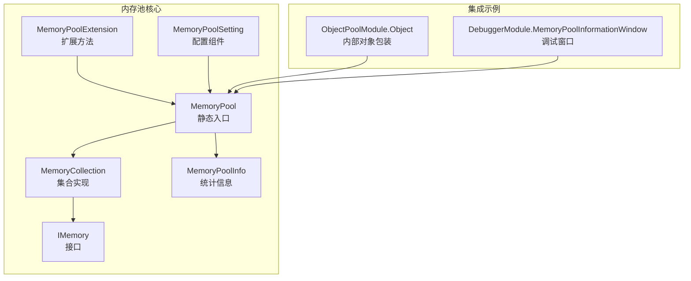
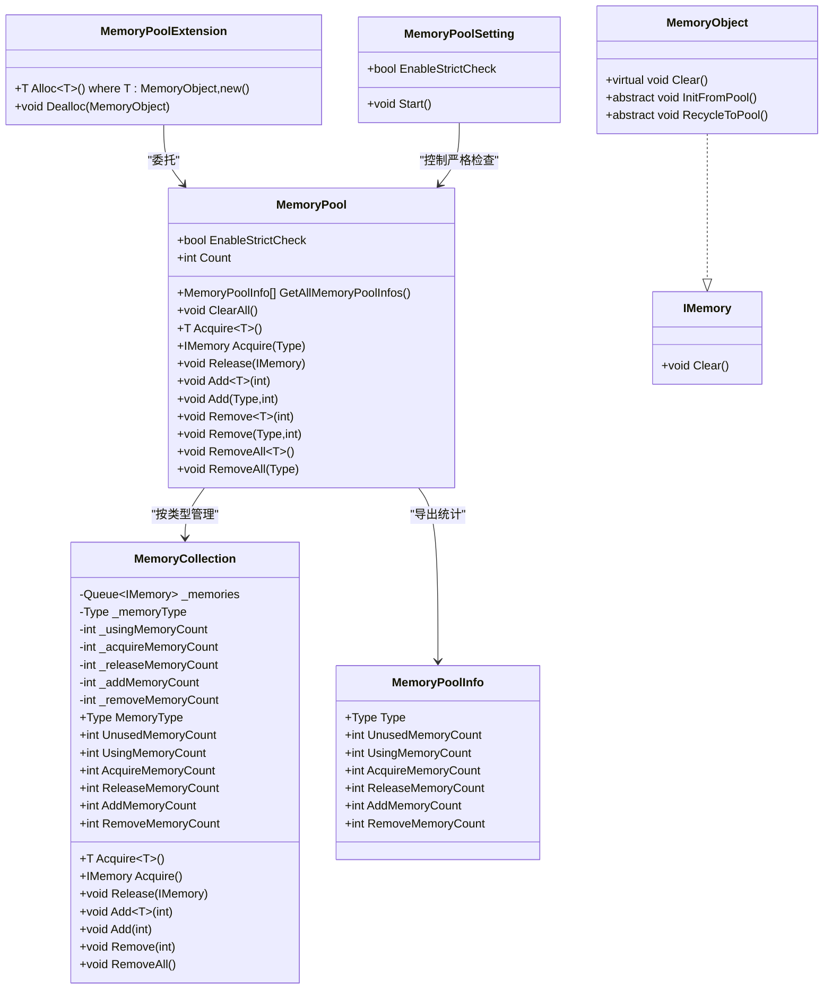
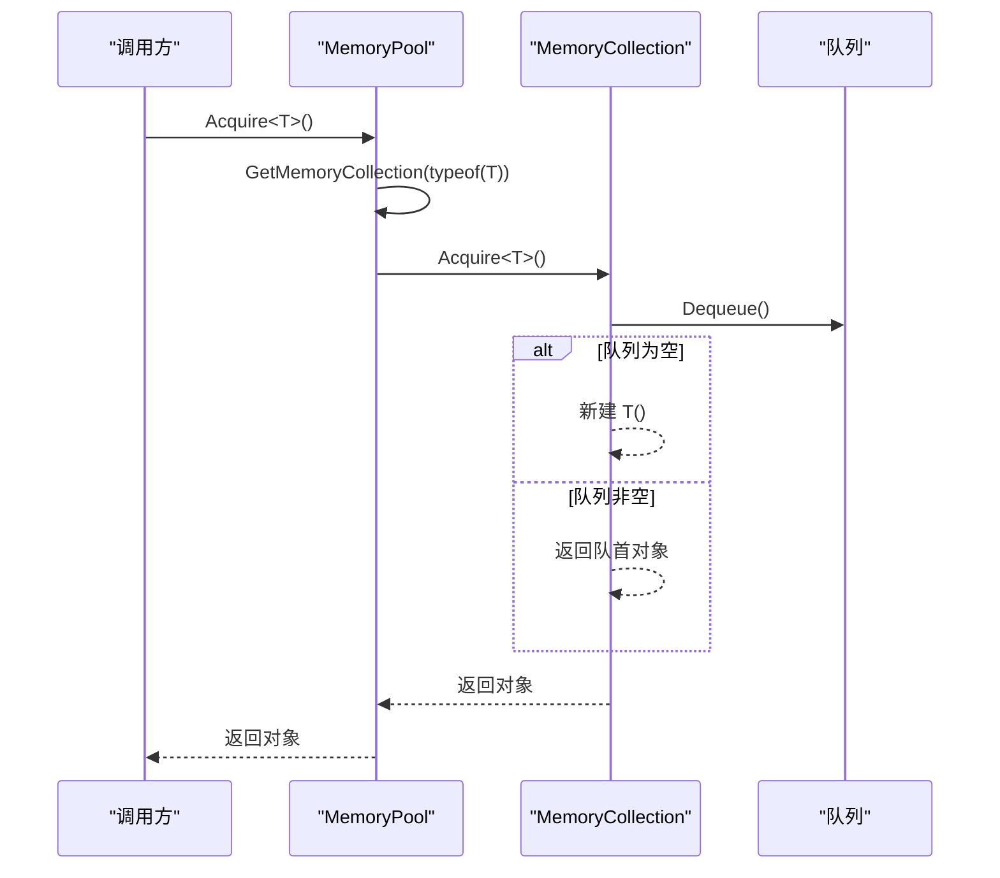
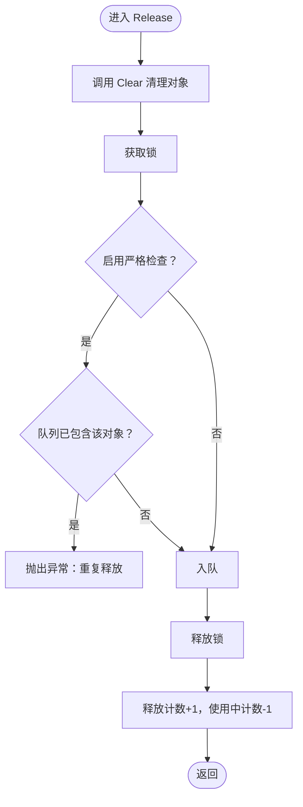
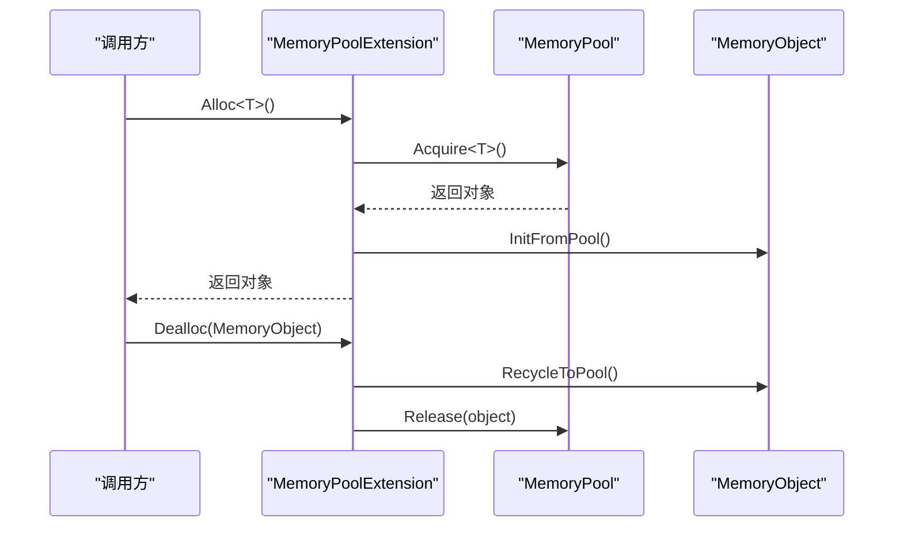
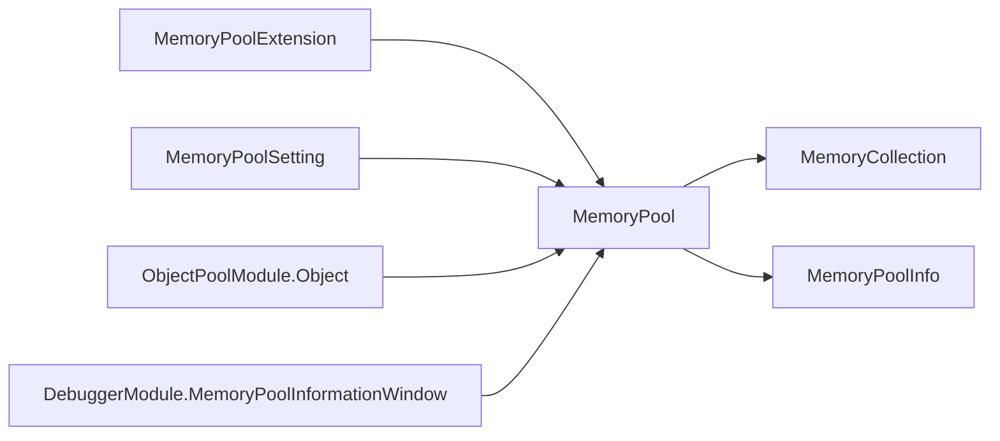

# 对象池实现机制

<cite>
**本文档引用的文件**
- [MemoryPool.cs](file://Assets/TEngine/Runtime/Core/MemoryPool/MemoryPool.cs)
- [MemoryPoolExtension.cs](file://Assets/TEngine/Runtime/Core/MemoryPool/MemoryPoolExtension.cs)
- [MemoryPoolInfo.cs](file://Assets/TEngine/Runtime/Core/MemoryPool/MemoryPoolInfo.cs)
- [MemoryPoolSetting.cs](file://Assets/TEngine/Runtime/Core/MemoryPool/MemoryPoolSetting.cs)
- [MemoryPool.MemoryCollection.cs](file://Assets/TEngine/Runtime/Core/MemoryPool/MemoryPool.MemoryCollection.cs)
- [IMemory.cs](file://Assets/TEngine/Runtime/Core/MemoryPool/IMemory.cs)
- [ObjectPoolModule.Object.cs](file://Assets/TEngine/Runtime/Module/ObjectPoolModule/ObjectPoolModule.Object.cs)
- [DebuggerModule.MemoryPoolInformationWindow.cs](file://Assets/TEngine/Runtime/Module/DebugerModule/Component/DebuggerModule.MemoryPoolInformationWindow.cs)
</cite>

## 目录
1. [简介](#简介)
2. [项目结构](#项目结构)
3. [核心组件](#核心组件)
4. [架构总览](#架构总览)
5. [详细组件分析](#详细组件分析)
6. [依赖关系分析](#依赖关系分析)
7. [性能考量](#性能考量)
8. [故障排查指南](#故障排查指南)
9. [结论](#结论)
10. [附录](#附录)

## 简介
本文件系统性解析 TEngine 的对象池实现机制，涵盖对象获取与释放的完整流程、内存分配与回收策略、对象状态管理、MemoryPoolExtension 扩展方法的实现原理（泛型约束、类型推断、性能优化）、MemoryPoolInfo 与 MemoryPoolSetting 的作用与用途（内存统计、配置参数、监控指标），以及对象池生命周期管理（创建、使用、销毁）。同时提供最佳实践与性能调优建议，帮助开发者在保证正确性的前提下最大化性能收益。

## 项目结构
TEngine 的对象池位于 Runtime/Core/MemoryPool 目录下，包含以下关键文件：
- MemoryPool：静态入口，负责类型到集合的映射、严格检查、统计信息导出、清空等。
- MemoryPool.MemoryCollection：具体集合实现，维护队列、计数器与并发安全。
- MemoryPoolExtension：扩展方法，提供 Alloc/Dealloc 便捷接口与 MemoryObject 基类。
- MemoryPoolInfo：内存池统计信息结构体。
- MemoryPoolSetting：运行时配置组件，控制严格检查开关及其生效时机。
- IMemory：内存对象接口，定义 Clear 方法。
- ObjectPoolModule.Object：对象池模块中的内部对象包装，演示如何与 MemoryPool 集成。
- DebuggerModule.MemoryPoolInformationWindow：调试窗口，展示各类型内存池的统计信息。

图表来源
- [MemoryPool.cs:1-208](file://Assets/TEngine/Runtime/Core/MemoryPool/MemoryPool.cs#L1-L208)
- [MemoryPool.MemoryCollection.cs:1-157](file://Assets/TEngine/Runtime/Core/MemoryPool/MemoryPool.MemoryCollection.cs#L1-L157)
- [MemoryPoolExtension.cs:1-57](file://Assets/TEngine/Runtime/Core/MemoryPool/MemoryPoolExtension.cs#L1-L57)
- [MemoryPoolInfo.cs:1-119](file://Assets/TEngine/Runtime/Core/MemoryPool/MemoryPoolInfo.cs#L1-L119)
- [MemoryPoolSetting.cs:1-80](file://Assets/TEngine/Runtime/Core/MemoryPool/MemoryPoolSetting.cs#L1-L80)
- [IMemory.cs:1-14](file://Assets/TEngine/Runtime/Core/MemoryPool/IMemory.cs#L1-L14)
- [ObjectPoolModule.Object.cs:1-190](file://Assets/TEngine/Runtime/Module/ObjectPoolModule/ObjectPoolModule.Object.cs#L1-L190)
- [DebuggerModule.MemoryPoolInformationWindow.cs:54-106](file://Assets/TEngine/Runtime/Module/DebugerModule/Component/DebuggerModule.MemoryPoolInformationWindow.cs#L54-L106)

章节来源
- [MemoryPool.cs:1-208](file://Assets/TEngine/Runtime/Core/MemoryPool/MemoryPool.cs#L1-L208)
- [MemoryPool.MemoryCollection.cs:1-157](file://Assets/TEngine/Runtime/Core/MemoryPool/MemoryPool.MemoryCollection.cs#L1-L157)
- [MemoryPoolExtension.cs:1-57](file://Assets/TEngine/Runtime/Core/MemoryPool/MemoryPoolExtension.cs#L1-L57)
- [MemoryPoolInfo.cs:1-119](file://Assets/TEngine/Runtime/Core/MemoryPool/MemoryPoolInfo.cs#L1-L119)
- [MemoryPoolSetting.cs:1-80](file://Assets/TEngine/Runtime/Core/MemoryPool/MemoryPoolSetting.cs#L1-L80)
- [IMemory.cs:1-14](file://Assets/TEngine/Runtime/Core/MemoryPool/IMemory.cs#L1-L14)
- [ObjectPoolModule.Object.cs:1-190](file://Assets/TEngine/Runtime/Module/ObjectPoolModule/ObjectPoolModule.Object.cs#L1-L190)
- [DebuggerModule.MemoryPoolInformationWindow.cs:54-106](file://Assets/TEngine/Runtime/Module/DebugerModule/Component/DebuggerModule.MemoryPoolInformationWindow.cs#L54-L106)

## 核心组件
- MemoryPool：提供静态 API，负责类型到 MemoryCollection 的映射、严格检查、统计导出、清空等。支持泛型与非泛型两种获取/释放方式，并对非法类型进行校验。
- MemoryCollection：每个类型对应一个集合，内部以队列存储可用对象，维护使用中计数、获取/释放/新增/移除计数等统计信息，使用锁保证线程安全。
- MemoryPoolExtension：提供 Alloc/Dealloc 便捷方法，要求对象继承 MemoryObject 并实现 InitFromPool/RecycleToPool 生命周期钩子；同时提供 MemoryObject 抽象基类。
- MemoryPoolInfo：结构体封装某类型的内存池统计信息，便于外部查询与展示。
- MemoryPoolSetting：运行时配置组件，根据构建类型或编辑器状态自动决定是否启用严格检查，并在启用时输出性能警告。
- IMemory：内存对象接口，要求实现 Clear 方法以便回收时清理状态。

章节来源
- [MemoryPool.cs:6-208](file://Assets/TEngine/Runtime/Core/MemoryPool/MemoryPool.cs#L6-L208)
- [MemoryPool.MemoryCollection.cs:11-157](file://Assets/TEngine/Runtime/Core/MemoryPool/MemoryPool.MemoryCollection.cs#L11-L157)
- [MemoryPoolExtension.cs:8-57](file://Assets/TEngine/Runtime/Core/MemoryPool/MemoryPoolExtension.cs#L8-L57)
- [MemoryPoolInfo.cs:10-119](file://Assets/TEngine/Runtime/Core/MemoryPool/MemoryPoolInfo.cs#L10-L119)
- [MemoryPoolSetting.cs:35-80](file://Assets/TEngine/Runtime/Core/MemoryPool/MemoryPoolSetting.cs#L35-L80)
- [IMemory.cs:6-14](file://Assets/TEngine/Runtime/Core/MemoryPool/IMemory.cs#L6-L14)

## 架构总览
对象池采用“静态入口 + 类型集合”的分层设计。MemoryPool 维护类型到集合的字典，按需创建集合；集合内部以队列缓存对象，通过计数器记录生命周期事件，通过锁保护并发访问。扩展方法为基于 MemoryObject 的对象提供生命周期钩子，简化上层使用。

图表来源
- [MemoryPool.cs:9-208](file://Assets/TEngine/Runtime/Core/MemoryPool/MemoryPool.cs#L9-L208)
- [MemoryPool.MemoryCollection.cs:11-157](file://Assets/TEngine/Runtime/Core/MemoryPool/MemoryPool.MemoryCollection.cs#L11-L157)
- [MemoryPoolExtension.cs:8-57](file://Assets/TEngine/Runtime/Core/MemoryPool/MemoryPoolExtension.cs#L8-L57)
- [MemoryPoolInfo.cs:10-119](file://Assets/TEngine/Runtime/Core/MemoryPool/MemoryPoolInfo.cs#L10-L119)
- [MemoryPoolSetting.cs:35-80](file://Assets/TEngine/Runtime/Core/MemoryPool/MemoryPoolSetting.cs#L35-L80)
- [IMemory.cs:6-14](file://Assets/TEngine/Runtime/Core/MemoryPool/IMemory.cs#L6-L14)

## 详细组件分析

### MemoryPool：静态入口与生命周期控制
- 类型映射与集合创建：通过字典维护 Type 到 MemoryCollection 的映射，首次访问某类型时创建集合。
- 严格检查：可选择在开发/编辑器/总是/禁用等不同模式下启用严格检查，用于类型合法性与重复释放检测。
- 统计导出：提供 GetAllMemoryPoolInfos 导出各类型的统计信息数组，便于调试与监控。
- 清空：支持清空所有集合，用于资源回收或测试场景。
- 泛型与非泛型 API：统一对外暴露 Acquire/Release/Add/Remove/RemoveAll 等方法，内部根据类型参数选择对应集合。

图表来源
- [MemoryPool.cs:71-74](file://Assets/TEngine/Runtime/Core/MemoryPool/MemoryPool.cs#L71-L74)
- [MemoryPool.MemoryCollection.cs:46-65](file://Assets/TEngine/Runtime/Core/MemoryPool/MemoryPool.MemoryCollection.cs#L46-L65)

章节来源
- [MemoryPool.cs:9-208](file://Assets/TEngine/Runtime/Core/MemoryPool/MemoryPool.cs#L9-L208)
- [MemoryPool.MemoryCollection.cs:187-205](file://Assets/TEngine/Runtime/Core/MemoryPool/MemoryPool.MemoryCollection.cs#L187-L205)

### MemoryCollection：集合实现与并发安全
- 数据结构：使用队列存储可用对象，整型计数器跟踪使用中数量与各类操作次数。
- 并发安全：对队列与计数器的访问使用锁保护，确保多线程环境下的正确性。
- 严格检查：在启用严格检查时，Release 前后会检测对象是否已存在队列，避免重复释放。
- 动态扩容：当队列为空时，Acquire 将新建对象并计入新增计数。

图表来源
- [MemoryPool.MemoryCollection.cs:83-98](file://Assets/TEngine/Runtime/Core/MemoryPool/MemoryPool.MemoryCollection.cs#L83-L98)

章节来源
- [MemoryPool.MemoryCollection.cs:11-157](file://Assets/TEngine/Runtime/Core/MemoryPool/MemoryPool.MemoryCollection.cs#L11-L157)

### MemoryPoolExtension：扩展方法与 MemoryObject 基类
- Alloc/Dealloc：Alloc<T>() 在获取对象后调用 InitFromPool，Dealloc 则先调用 RecycleToPool 再 Release，形成完整的生命周期。
- MemoryObject：抽象基类，要求子类实现 InitFromPool/RecycleToPool，Clear 默认为空实现，便于覆盖。
- 泛型约束：Alloc<T>() 要求 T 继承 MemoryObject 且可 new，确保生命周期钩子可用。

图表来源
- [MemoryPoolExtension.cs:35-55](file://Assets/TEngine/Runtime/Core/MemoryPool/MemoryPoolExtension.cs#L35-L55)

章节来源
- [MemoryPoolExtension.cs:8-57](file://Assets/TEngine/Runtime/Core/MemoryPool/MemoryPoolExtension.cs#L8-L57)

### MemoryPoolInfo：统计信息结构体
- 字段：包含类型、未使用数量、使用中数量、获取/释放/新增/移除计数。
- 用途：供调试窗口与外部监控系统读取，便于观察对象池健康度与性能特征。

章节来源
- [MemoryPoolInfo.cs:10-119](file://Assets/TEngine/Runtime/Core/MemoryPool/MemoryPoolInfo.cs#L10-L119)

### MemoryPoolSetting：配置组件与严格检查
- 配置项：MemoryStrictCheckType 提供 AlwaysEnable/OnlyEnableWhenDevelopment/OnlyEnableInEditor/AlwaysDisable 四种模式。
- 行为：Start 中根据当前构建/编辑器状态设置 MemoryPool.EnableStrictCheck，并在启用时输出性能提示。
- 生命周期：Start 后销毁自身，避免常驻。

章节来源
- [MemoryPoolSetting.cs:35-80](file://Assets/TEngine/Runtime/Core/MemoryPool/MemoryPoolSetting.cs#L35-L80)

### IMemory：内存对象接口
- 规范：要求实现 Clear，用于回收时清理状态，避免脏数据残留。
- 关系：MemoryObject 实现该接口，作为扩展方法的基类。

章节来源
- [IMemory.cs:6-14](file://Assets/TEngine/Runtime/Core/MemoryPool/IMemory.cs#L6-L14)

### 集成示例：ObjectPoolModule.Object
- 包装：Object<T> 实现 IMemory，内部持有 T（继承 ObjectBase）与 spawn 计数。
- 生命周期：Create 时从 MemoryPool 获取包装对象；Spawn/Unspawn 更新计数并回调 OnSpawn/OnUnspawn；Release 调用对象的 Release 并归还包装对象。
- 与 MemoryPool 的交互：通过 MemoryPool.Acquire/Object<T>() 与 MemoryPool.Release 完成对象的获取与回收。

章节来源
- [ObjectPoolModule.Object.cs:11-190](file://Assets/TEngine/Runtime/Module/ObjectPoolModule/ObjectPoolModule.Object.cs#L11-L190)

## 依赖关系分析
- MemoryPool 依赖 MemoryCollection 进行类型隔离与并发控制。
- MemoryPoolExtension 依赖 MemoryPool 进行对象获取与释放，并依赖 MemoryObject 生命周期钩子。
- MemoryPoolSetting 依赖 MemoryPool 控制严格检查开关。
- MemoryPoolInfo 由 MemoryPool 导出，供调试窗口使用。
- ObjectPoolModule.Object 依赖 MemoryPool 进行包装对象的获取与释放。

图表来源
- [MemoryPool.cs:1-208](file://Assets/TEngine/Runtime/Core/MemoryPool/MemoryPool.cs#L1-L208)
- [MemoryPool.MemoryCollection.cs:1-157](file://Assets/TEngine/Runtime/Core/MemoryPool/MemoryPool.MemoryCollection.cs#L1-L157)
- [MemoryPoolExtension.cs:1-57](file://Assets/TEngine/Runtime/Core/MemoryPool/MemoryPoolExtension.cs#L1-L57)
- [MemoryPoolSetting.cs:1-80](file://Assets/TEngine/Runtime/Core/MemoryPool/MemoryPoolSetting.cs#L1-L80)
- [MemoryPoolInfo.cs:1-119](file://Assets/TEngine/Runtime/Core/MemoryPool/MemoryPoolInfo.cs#L1-L119)
- [ObjectPoolModule.Object.cs:1-190](file://Assets/TEngine/Runtime/Module/ObjectPoolModule/ObjectPoolModule.Object.cs#L1-L190)
- [DebuggerModule.MemoryPoolInformationWindow.cs:54-106](file://Assets/TEngine/Runtime/Module/DebugerModule/Component/DebuggerModule.MemoryPoolInformationWindow.cs#L54-L106)

章节来源
- [MemoryPool.cs:1-208](file://Assets/TEngine/Runtime/Core/MemoryPool/MemoryPool.cs#L1-L208)
- [MemoryPool.MemoryCollection.cs:1-157](file://Assets/TEngine/Runtime/Core/MemoryPool/MemoryPool.MemoryCollection.cs#L1-L157)
- [MemoryPoolExtension.cs:1-57](file://Assets/TEngine/Runtime/Core/MemoryPool/MemoryPoolExtension.cs#L1-L57)
- [MemoryPoolSetting.cs:1-80](file://Assets/TEngine/Runtime/Core/MemoryPool/MemoryPoolSetting.cs#L1-L80)
- [MemoryPoolInfo.cs:1-119](file://Assets/TEngine/Runtime/Core/MemoryPool/MemoryPoolInfo.cs#L1-L119)
- [ObjectPoolModule.Object.cs:1-190](file://Assets/TEngine/Runtime/Module/ObjectPoolModule/ObjectPoolModule.Object.cs#L1-L190)
- [DebuggerModule.MemoryPoolInformationWindow.cs:54-106](file://Assets/TEngine/Runtime/Module/DebugerModule/Component/DebuggerModule.MemoryPoolInformationWindow.cs#L54-L106)

## 性能考量
- 严格检查的影响：启用严格检查会增加额外的类型校验与重复释放检测，显著降低性能。建议仅在开发/调试阶段启用。
- 队列访问与锁竞争：集合内部对队列与计数器使用锁保护，高并发场景下应尽量减少频繁的 Acquire/Release 操作，必要时批量预热对象池。
- 动态扩容成本：当队列为空时，Acquire 会新建对象，这会产生 GC 压力。可通过 Add 预先填充对象池，降低运行时创建开销。
- 生命周期钩子：Alloc/Dealloc 的 InitFromPool/RecycleToPool 会在每次获取/归还时执行，应保持轻量，避免阻塞主线程。
- 统计导出：GetAllMemoryPoolInfos 会遍历所有集合并构造数组，频繁调用可能带来 CPU 开销，建议仅在调试时使用。

## 故障排查指南
- 重复释放异常：启用严格检查时，若尝试对同一对象多次 Release，将抛出异常。请检查调用链，确保对象只被释放一次。
- 类型不匹配：Acquire<T>() 与 Add<T>() 要求泛型类型与集合类型一致，否则抛出异常。请确认使用的泛型类型与注册时一致。
- 无效对象：Release(null) 或传入非 IMemory 对象会抛出异常。请确保传入的对象来自 MemoryPool。
- 无可用对象：当队列为空且未预热时，Acquire 会新建对象，注意观察新增计数与 GC 峰值。
- 性能骤降：若启用严格检查，请临时关闭以验证是否为性能瓶颈来源。

章节来源
- [MemoryPool.MemoryCollection.cs:88-91](file://Assets/TEngine/Runtime/Core/MemoryPool/MemoryPool.MemoryCollection.cs#L88-L91)
- [MemoryPool.cs:93-96](file://Assets/TEngine/Runtime/Core/MemoryPool/MemoryPool.cs#L93-L96)
- [MemoryPool.cs:164-185](file://Assets/TEngine/Runtime/Core/MemoryPool/MemoryPool.cs#L164-L185)
- [MemoryPoolExtension.cs:48-51](file://Assets/TEngine/Runtime/Core/MemoryPool/MemoryPoolExtension.cs#L48-L51)

## 结论
TEngine 的对象池通过“静态入口 + 类型集合”的设计实现了高效、可监控、可扩展的内存复用机制。MemoryPoolExtension 提供了简洁的生命周期钩子，使上层对象能够自然地融入对象池。MemoryPoolInfo 与 MemoryPoolSetting 为监控与配置提供了完善的支持。遵循本文的最佳实践与性能调优建议，可在保证正确性的前提下获得稳定的性能表现。

## 附录
- 最佳实践
  - 预热：在场景加载或启动阶段使用 Add 预先填充常用对象池，降低运行时创建开销。
  - 严格检查：仅在开发/调试阶段启用，生产环境默认关闭。
  - 生命周期：在 InitFromPool/RecycleToPool 中完成轻量初始化与清理，避免耗时操作。
  - 监控：定期导出 MemoryPoolInfo，关注未使用/使用中数量与新增/移除计数的变化趋势。
  - 错误处理：捕获并记录异常，定位重复释放、类型不匹配等问题。

- 性能调优建议
  - 减少锁竞争：合并批量操作，避免频繁小规模 Acquire/Release。
  - 控制扩容：通过 Add 预热，避免运行时动态创建导致的 GC 峰值。
  - 选择合适的数据结构：对于高频短生命周期对象，优先使用 MemoryPool；对于长生命周期对象，考虑其他缓存策略。
  - 监控与告警：结合调试窗口与日志，建立内存池健康度监控与告警机制。