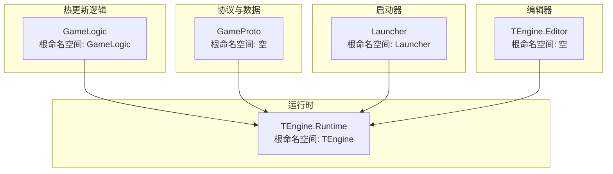
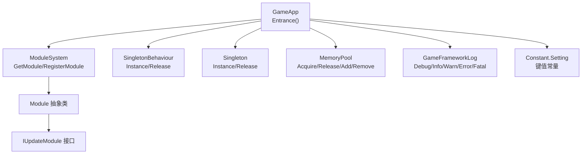
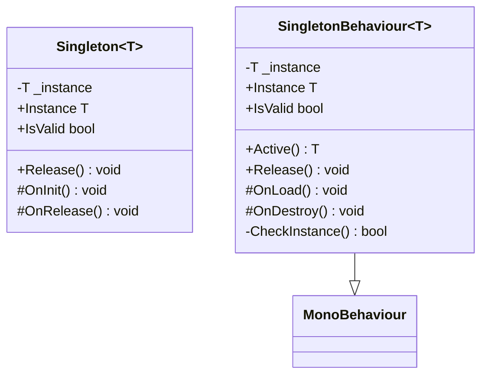
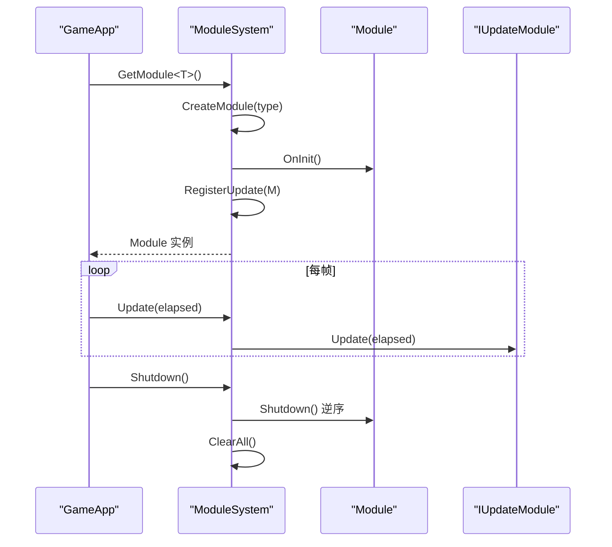
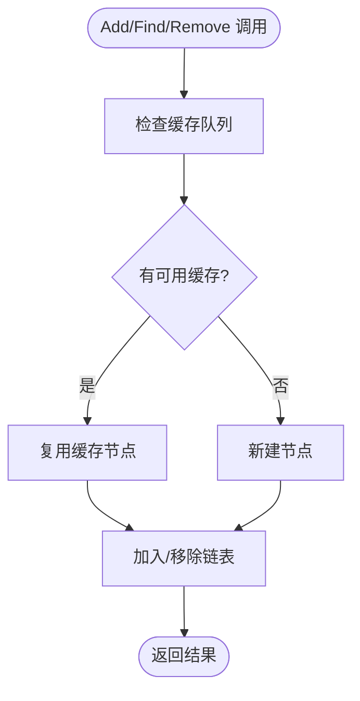
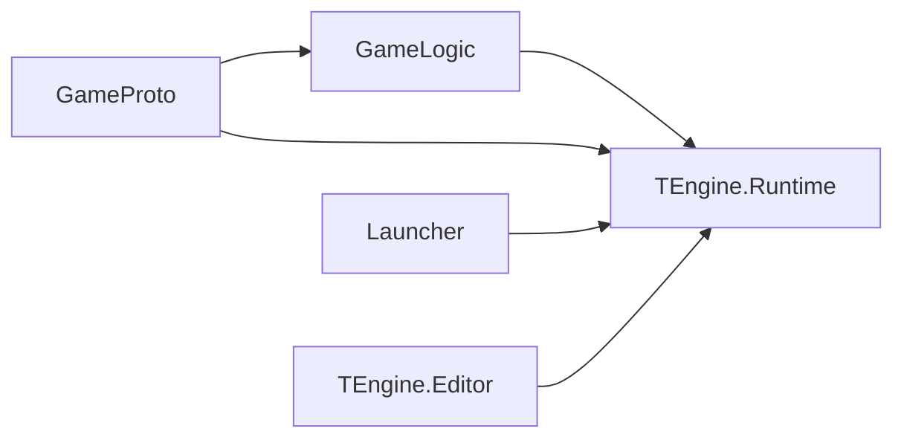

# 代码规范与标准

<cite>
**本文引用的文件**
- [GameLogic.asmdef](file://Assets/GameScripts/HotFix/GameLogic/GameLogic.asmdef)
- [GameProto.asmdef](file://Assets/GameScripts/HotFix/GameProto/GameProto.asmdef)
- [TEngine.Runtime.asmdef](file://Assets/TEngine/Runtime/TEngine.Runtime.asmdef)
- [TEngine.Editor.asmdef](file://Assets/TEngine/Editor/TEngine.Editor.asmdef)
- [Launcher.asmdef](file://Assets/Launcher/Launcher.asmdef)
- [GameApp.cs](file://Assets/GameScripts/HotFix/GameLogic/GameApp.cs)
- [Singleton.cs](file://Assets/GameScripts/HotFix/GameLogic/SingletonSystem/Singleton.cs)
- [SingletonBehaviour.cs](file://Assets/GameScripts/HotFix/GameLogic/SingletonSystem/SingletonBehaviour.cs)
- [Module.cs](file://Assets/TEngine/Runtime/Core/Module.cs)
- [ModuleSystem.cs](file://Assets/TEngine/Runtime/Core/ModuleSystem.cs)
- [Constant.cs](file://Assets/TEngine/Runtime/Core/Constant/Constant.cs)
- [GameFrameworkLinkedList.cs](file://Assets/TEngine/Runtime/Core/DataStruct/GameFrameworkLinkedList.cs)
- [MemoryPool.cs](file://Assets/TEngine/Runtime/Core/MemoryPool/MemoryPool.cs)
- [GameFrameworkLog.cs](file://Assets/TEngine/Runtime/Core/Log/GameFrameworkLog.cs)
- [Utility.cs](file://Assets/TEngine/Runtime/Core/Utility/Utility.cs)
- [CommandLineReader.cs](file://Assets/TEngine/Editor/Utility/CommandLineReader.cs)
- [LauncherMgr.cs](file://Assets/Launcher/Scripts/LauncherMgr.cs)
</cite>

## 目录
1. [简介](#简介)
2. [项目结构](#项目结构)
3. [核心组件](#核心组件)
4. [架构总览](#架构总览)
5. [详细组件分析](#详细组件分析)
6. [依赖关系分析](#依赖关系分析)
7. [性能考虑](#性能考虑)
8. [故障排查指南](#故障排查指南)
9. [结论](#结论)
10. [附录](#附录)

## 简介
本规范面向TEngine框架的C#开发，旨在统一命名约定、代码格式、注释风格、程序集组织与文件目录结构，确保团队协作一致性与长期可维护性。规范同时给出常见问题的排查建议与最佳实践，帮助开发者快速理解并遵循。

## 项目结构
TEngine采用“按功能域+按平台域”的分层组织方式：
- TEngine.Runtime：运行时核心模块与公共设施
- TEngine.Editor：编辑器扩展与工具
- GameLogic：热更新业务逻辑
- GameProto：协议与数据模型
- Launcher：启动器与UI加载

程序集清单与根命名空间如下：
- TEngine.Runtime：根命名空间 TEngine
- TEngine.Editor：根命名空间 空（由各子模块自定义）
- GameLogic：根命名空间 GameLogic
- GameProto：根命名空间 空（由Luban生成）
- Launcher：根命名空间 Launcher

图表来源
- [TEngine.Runtime.asmdef:1-29](file://Assets/TEngine/Runtime/TEngine.Runtime.asmdef#L1-L29)
- [TEngine.Editor.asmdef:1-25](file://Assets/TEngine/Editor/TEngine.Editor.asmdef#L1-L25)
- [GameLogic.asmdef:1-31](file://Assets/GameScripts/HotFix/GameLogic/GameLogic.asmdef#L1-L31)
- [GameProto.asmdef:1-20](file://Assets/GameScripts/HotFix/GameProto/GameProto.asmdef#L1-L20)
- [Launcher.asmdef:1-17](file://Assets/Launcher/Launcher.asmdef#L1-L17)

章节来源
- [TEngine.Runtime.asmdef:1-29](file://Assets/TEngine/Runtime/TEngine.Runtime.asmdef#L1-L29)
- [TEngine.Editor.asmdef:1-25](file://Assets/TEngine/Editor/TEngine.Editor.asmdef#L1-L25)
- [GameLogic.asmdef:1-31](file://Assets/GameScripts/HotFix/GameLogic/GameLogic.asmdef#L1-L31)
- [GameProto.asmdef:1-20](file://Assets/GameScripts/HotFix/GameProto/GameProto.asmdef#L1-L20)
- [Launcher.asmdef:1-17](file://Assets/Launcher/Launcher.asmdef#L1-L17)

## 核心组件
- 单例基类与Mono单例：提供全局对象与生命周期管理
- 模块系统：模块注册、优先级排序、更新调度
- 常量与配置：集中管理常用键值
- 数据结构：高性能链表与节点缓存
- 内存池：对象复用与GC优化
- 日志系统：多级别日志输出
- 工具集：通用工具类容器

章节来源
- [Singleton.cs:1-64](file://Assets/GameScripts/HotFix/GameLogic/SingletonSystem/Singleton.cs#L1-L64)
- [SingletonBehaviour.cs:1-110](file://Assets/GameScripts/HotFix/GameLogic/SingletonSystem/SingletonBehaviour.cs#L1-L110)
- [Module.cs:1-40](file://Assets/TEngine/Runtime/Core/Module.cs#L1-L40)
- [ModuleSystem.cs:1-208](file://Assets/TEngine/Runtime/Core/ModuleSystem.cs#L1-L208)
- [Constant.cs:1-21](file://Assets/TEngine/Runtime/Core/Constant/Constant.cs#L1-L21)
- [GameFrameworkLinkedList.cs:1-393](file://Assets/TEngine/Runtime/Core/DataStruct/GameFrameworkLinkedList.cs#L1-L393)
- [MemoryPool.cs:1-208](file://Assets/TEngine/Runtime/Core/MemoryPool/MemoryPool.cs#L1-L208)
- [GameFrameworkLog.cs:1-800](file://Assets/TEngine/Runtime/Core/Log/GameFrameworkLog.cs#L1-L800)
- [Utility.cs:1-9](file://Assets/TEngine/Runtime/Core/Utility/Utility.cs#L1-L9)

## 架构总览
TEngine采用“模块化+单例+内存池+日志”的运行时架构，GameLogic作为热更新入口，通过模块系统驱动各子系统；Launcher负责UI加载与引导流程。

图表来源
- [GameApp.cs:1-47](file://Assets/GameScripts/HotFix/GameLogic/GameApp.cs#L1-L47)
- [ModuleSystem.cs:1-208](file://Assets/TEngine/Runtime/Core/ModuleSystem.cs#L1-L208)
- [Module.cs:1-40](file://Assets/TEngine/Runtime/Core/Module.cs#L1-L40)
- [SingletonBehaviour.cs:1-110](file://Assets/GameScripts/HotFix/GameLogic/SingletonSystem/SingletonBehaviour.cs#L1-L110)
- [Singleton.cs:1-64](file://Assets/GameScripts/HotFix/GameLogic/SingletonSystem/Singleton.cs#L1-L64)
- [MemoryPool.cs:1-208](file://Assets/TEngine/Runtime/Core/MemoryPool/MemoryPool.cs#L1-L208)
- [GameFrameworkLog.cs:1-800](file://Assets/TEngine/Runtime/Core/Log/GameFrameworkLog.cs#L1-L800)
- [Constant.cs:1-21](file://Assets/TEngine/Runtime/Core/Constant/Constant.cs#L1-L21)

## 详细组件分析

### 单例与生命周期管理
- Singleton<T>：静态单例获取、初始化与释放，带有效性校验
- SingletonBehaviour<T>：场景内单例GameObject管理，自动挂载与销毁

图表来源
- [Singleton.cs:1-64](file://Assets/GameScripts/HotFix/GameLogic/SingletonSystem/Singleton.cs#L1-L64)
- [SingletonBehaviour.cs:1-110](file://Assets/GameScripts/HotFix/GameLogic/SingletonSystem/SingletonBehaviour.cs#L1-L110)

章节来源
- [Singleton.cs:1-64](file://Assets/GameScripts/HotFix/GameLogic/SingletonSystem/Singleton.cs#L1-L64)
- [SingletonBehaviour.cs:1-110](file://Assets/GameScripts/HotFix/GameLogic/SingletonSystem/SingletonBehaviour.cs#L1-L110)

### 模块系统与更新调度
- Module：模块抽象，含优先级、初始化、关闭
- ModuleSystem：模块注册、排序、更新列表构建、统一Shutdown

图表来源
- [ModuleSystem.cs:1-208](file://Assets/TEngine/Runtime/Core/ModuleSystem.cs#L1-L208)
- [Module.cs:1-40](file://Assets/TEngine/Runtime/Core/Module.cs#L1-L40)

章节来源
- [ModuleSystem.cs:1-208](file://Assets/TEngine/Runtime/Core/ModuleSystem.cs#L1-L208)
- [Module.cs:1-40](file://Assets/TEngine/Runtime/Core/Module.cs#L1-L40)

### 常量与配置
- Constant.Setting：集中管理语言、音量、音效等键值常量

章节来源
- [Constant.cs:1-21](file://Assets/TEngine/Runtime/Core/Constant/Constant.cs#L1-L21)

### 数据结构：高性能链表
- GameFrameworkLinkedList<T>：带节点缓存的链表，支持Acquire/Release节点复用，降低GC

图表来源
- [GameFrameworkLinkedList.cs:1-393](file://Assets/TEngine/Runtime/Core/DataStruct/GameFrameworkLinkedList.cs#L1-L393)

章节来源
- [GameFrameworkLinkedList.cs:1-393](file://Assets/TEngine/Runtime/Core/DataStruct/GameFrameworkLinkedList.cs#L1-L393)

### 内存池
- MemoryPool：按类型管理对象池，支持严格检查、批量Add/Remove/RemoveAll

章节来源
- [MemoryPool.cs:1-208](file://Assets/TEngine/Runtime/Core/MemoryPool/MemoryPool.cs#L1-L208)

### 日志系统
- GameFrameworkLog：多参数重载的日志接口，支持不同级别输出

章节来源
- [GameFrameworkLog.cs:1-800](file://Assets/TEngine/Runtime/Core/Log/GameFrameworkLog.cs#L1-L800)

### 工具集与命令行
- Utility：工具集命名空间占位
- CommandLineReader：解析Unity命令行自定义参数

章节来源
- [Utility.cs:1-9](file://Assets/TEngine/Runtime/Core/Utility/Utility.cs#L1-L9)
- [CommandLineReader.cs:1-121](file://Assets/TEngine/Editor/Utility/CommandLineReader.cs#L1-L121)

### 启动器与UI加载
- LauncherMgr：UI根节点查找、窗口实例化、显示/隐藏/关闭、进度刷新

章节来源
- [LauncherMgr.cs:1-135](file://Assets/Launcher/Scripts/LauncherMgr.cs#L1-L135)

## 依赖关系分析
- GameLogic 依赖 TEngine.Runtime
- GameProto 依赖 TEngine.Runtime 与 GameLogic（通过GUID引用）
- Launcher 依赖 TEngine.Runtime
- TEngine.Editor 仅在编辑器平台生效，依赖若干编辑器工具

图表来源
- [GameLogic.asmdef:1-31](file://Assets/GameScripts/HotFix/GameLogic/GameLogic.asmdef#L1-L31)
- [GameProto.asmdef:1-20](file://Assets/GameScripts/HotFix/GameProto/GameProto.asmdef#L1-L20)
- [TEngine.Runtime.asmdef:1-29](file://Assets/TEngine/Runtime/TEngine.Runtime.asmdef#L1-L29)
- [TEngine.Editor.asmdef:1-25](file://Assets/TEngine/Editor/TEngine.Editor.asmdef#L1-L25)
- [Launcher.asmdef:1-17](file://Assets/Launcher/Launcher.asmdef#L1-L17)

章节来源
- [GameLogic.asmdef:1-31](file://Assets/GameScripts/HotFix/GameLogic/GameLogic.asmdef#L1-L31)
- [GameProto.asmdef:1-20](file://Assets/GameScripts/HotFix/GameProto/GameProto.asmdef#L1-L20)
- [TEngine.Runtime.asmdef:1-29](file://Assets/TEngine/Runtime/TEngine.Runtime.asmdef#L1-L29)
- [TEngine.Editor.asmdef:1-25](file://Assets/TEngine/Editor/TEngine.Editor.asmdef#L1-L25)
- [Launcher.asmdef:1-17](file://Assets/Launcher/Launcher.asmdef#L1-L17)

## 性能考虑
- 使用MemoryPool减少频繁分配与GC压力
- 链表节点缓存降低临时对象创建
- 模块更新列表延迟重建，避免每帧重复排序
- 单例与GameObject生命周期管理避免重复创建

## 故障排查指南
- 日志级别选择：调试/信息/警告/错误/致命，按严重程度区分
- 常量键值：统一通过Constant.Setting访问，避免魔法字符串
- 单例访问：禁止绕过Instance直接构造，否则会触发错误提示
- UI加载：LauncherMgr需确保UIRoot与资源路径一致，否则会打印错误日志

章节来源
- [GameFrameworkLog.cs:1-800](file://Assets/TEngine/Runtime/Core/Log/GameFrameworkLog.cs#L1-L800)
- [Constant.cs:1-21](file://Assets/TEngine/Runtime/Core/Constant/Constant.cs#L1-L21)
- [Singleton.cs:1-64](file://Assets/GameScripts/HotFix/GameLogic/SingletonSystem/Singleton.cs#L1-L64)
- [LauncherMgr.cs:1-135](file://Assets/Launcher/Scripts/LauncherMgr.cs#L1-L135)

## 结论
本规范基于现有代码库提炼出命名、格式、注释、组织与流程的最佳实践，建议在新功能开发中严格遵循，以提升一致性与可维护性。

## 附录

### 命名约定
- 类名：帕斯卡命名（如 GameApp、ModuleSystem）
- 方法名：帕斯卡命名（如 Update、Shutdown、Initialize）
- 变量名：驼峰命名（如 elapseSeconds、uiRoot）
- 常量名：帕斯卡命名（如 LANGUAGE、UI_ROOT_PATH）

章节来源
- [GameApp.cs:1-47](file://Assets/GameScripts/HotFix/GameLogic/GameApp.cs#L1-L47)
- [ModuleSystem.cs:1-208](file://Assets/TEngine/Runtime/Core/ModuleSystem.cs#L1-L208)
- [LauncherMgr.cs:1-135](file://Assets/Launcher/Scripts/LauncherMgr.cs#L1-L135)

### 代码格式化与缩进
- 缩进：统一使用4个空格
- 大括号：控制块与方法体独占一行
- 行宽：建议不超过120字符
- 空行：方法间保留空行，逻辑分组内适当空行

### 注释标准
- XML文档注释：接口、类、公开成员、公共方法应提供摘要与参数说明
- 内联注释：复杂逻辑或边界条件处提供简要说明
- TODO标记：使用“// TODO:”标注待完善或待回滚的逻辑

章节来源
- [Module.cs:1-40](file://Assets/TEngine/Runtime/Core/Module.cs#L1-L40)
- [GameFrameworkLog.cs:1-800](file://Assets/TEngine/Runtime/Core/Log/GameFrameworkLog.cs#L1-L800)

### 程序集组织规范
- TEngine.Runtime：核心运行时与公共设施
- TEngine.Editor：编辑器工具与扩展
- GameLogic：热更新业务逻辑
- GameProto：协议与数据模型
- Launcher：启动器与UI加载

章节来源
- [TEngine.Runtime.asmdef:1-29](file://Assets/TEngine/Runtime/TEngine.Runtime.asmdef#L1-L29)
- [TEngine.Editor.asmdef:1-25](file://Assets/TEngine/Editor/TEngine.Editor.asmdef#L1-L25)
- [GameLogic.asmdef:1-31](file://Assets/GameScripts/HotFix/GameLogic/GameLogic.asmdef#L1-L31)
- [GameProto.asmdef:1-20](file://Assets/GameScripts/HotFix/GameProto/GameProto.asmdef#L1-L20)
- [Launcher.asmdef:1-17](file://Assets/Launcher/Launcher.asmdef#L1-L17)

### 文件与目录结构规范
- 命名空间与目录保持一致，便于IDE跳转与引用
- 热更新逻辑置于 HotFix/GameLogic 与 HotFix/GameProto
- 启动器与UI加载置于 Launcher
- 运行时核心置于 TEngine/Runtime
- 编辑器扩展置于 TEngine/Editor

章节来源
- [GameApp.cs:1-47](file://Assets/GameScripts/HotFix/GameLogic/GameApp.cs#L1-L47)
- [LauncherMgr.cs:1-135](file://Assets/Launcher/Scripts/LauncherMgr.cs#L1-L135)

### 示例与反例（路径指引）
- 正例：模块注册与更新
  - [ModuleSystem.cs:128-141](file://Assets/TEngine/Runtime/Core/ModuleSystem.cs#L128-L141)
- 反例：直接构造单例（触发错误提示）
  - [Singleton.cs:32-40](file://Assets/GameScripts/HotFix/GameLogic/SingletonSystem/Singleton.cs#L32-L40)
- 正例：UI加载与显示
  - [LauncherMgr.cs:31-66](file://Assets/Launcher/Scripts/LauncherMgr.cs#L31-L66)
- 反例：UI根节点缺失导致错误日志
  - [LauncherMgr.cs:22-26](file://Assets/Launcher/Scripts/LauncherMgr.cs#L22-L26)