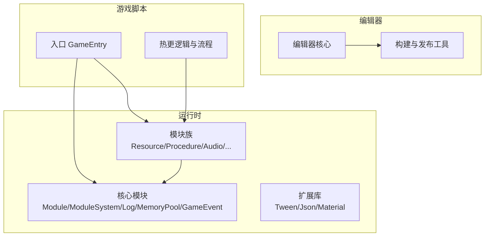
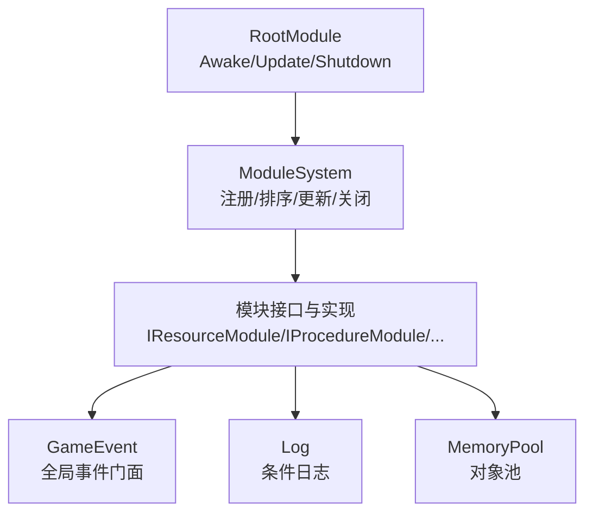
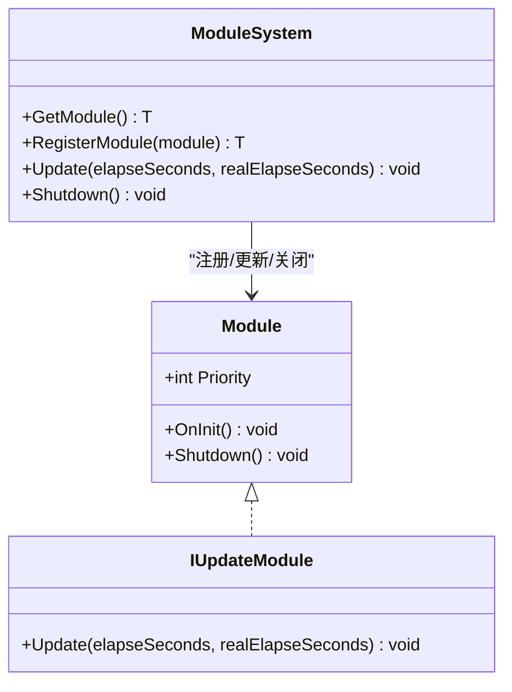
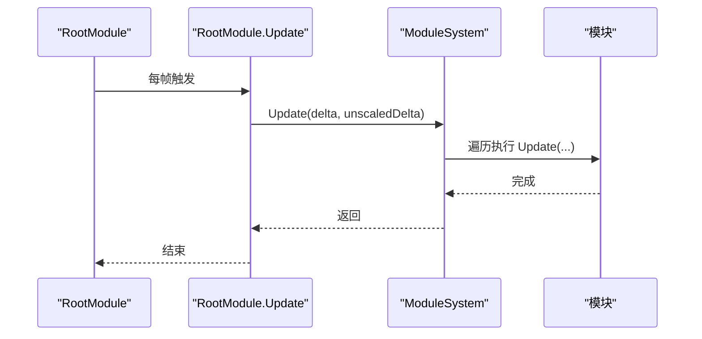
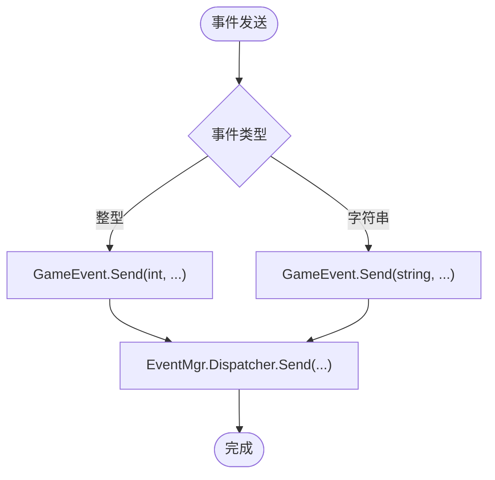
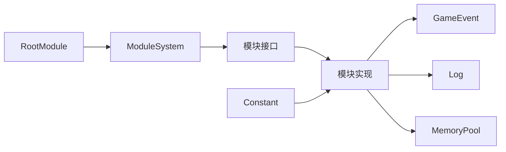

# 开发者指南

<cite>
**本文引用的文件**
- [Assets/TEngine/Runtime/Core/Module.cs](file://Assets/TEngine/Runtime/Core/Module.cs)
- [Assets/TEngine/Runtime/Core/ModuleSystem.cs](file://Assets/TEngine/Runtime/Core/ModuleSystem.cs)
- [Assets/TEngine/Runtime/Core/Constant/Constant.cs](file://Assets/TEngine/Runtime/Core/Constant/Constant.cs)
- [Assets/TEngine/Runtime/Core/MemoryPool/MemoryPool.cs](file://Assets/TEngine/Runtime/Core/MemoryPool/MemoryPool.cs)
- [Assets/TEngine/Runtime/Core/Log/Log.cs](file://Assets/TEngine/Runtime/Core/Log/Log.cs)
- [Assets/TEngine/Runtime/Core/GameEvent/GameEvent.cs](file://Assets/TEngine/Runtime/Core/GameEvent/GameEvent.cs)
- [Assets/TEngine/Runtime/Module/RootModule.cs](file://Assets/TEngine/Runtime/Module/RootModule.cs)
- [Assets/TEngine/Runtime/Module/ResourceModule/IResourceModule.cs](file://Assets/TEngine/Runtime/Module/ResourceModule/IResourceModule.cs)
- [Assets/TEngine/Runtime/Module/ProcedureModule/IProcedureModule.cs](file://Assets/TEngine/Runtime/Module/ProcedureModule/IProcedureModule.cs)
- [Assets/TEngine/Runtime/Module/AudioModule/IAudioModule.cs](file://Assets/TEngine/Runtime/Module/AudioModule/IAudioModule.cs)
- [Assets/GameScripts/GameEntry.cs](file://Assets/GameScripts/GameEntry.cs)
- [Assets/TEngine/README.md](file://Assets/TEngine/README.md)
</cite>

## 目录
1. [简介](#简介)
2. [项目结构](#项目结构)
3. [核心组件](#核心组件)
4. [架构总览](#架构总览)
5. [详细组件分析](#详细组件分析)
6. [依赖关系分析](#依赖关系分析)
7. [性能考量](#性能考量)
8. [故障排除指南](#故障排除指南)
9. [结论](#结论)
10. [附录](#附录)

## 简介
本指南面向使用 TEngine 框架的开发者，目标是帮助你快速理解并高效开发。内容涵盖：
- 代码规范与最佳实践（命名约定、代码结构、注释标准）
- 设计模式与架构原则（模块化、接口设计、依赖注入思想）
- 扩展方法（自定义模块、插件式扩展、扩展点设计）
- 常见问题排查（性能、内存、兼容性）
- 开发环境配置、调试技巧、测试策略
- 实战示例与项目经验

TEngine 是一个“开箱即用”的 Unity 框架解决方案，强调模块化、高性能与可扩展性，支持全平台与热更新。

章节来源
- [Assets/TEngine/README.md:1-104](file://Assets/TEngine/README.md#L1-L104)

## 项目结构
TEngine 采用“运行时 + 编辑器 + 程序集”的分层组织方式：
- 运行时（Runtime）：核心模块与基础设施（模块系统、事件、日志、内存池、时间等）
- 编辑器（Editor）：构建、打包、本地化、资源批处理等工具
- GameScripts：游戏逻辑与流程脚本，按功能划分模块与程序集

图表来源
- [Assets/TEngine/Runtime/Core/Module.cs:1-40](file://Assets/TEngine/Runtime/Core/Module.cs#L1-L40)
- [Assets/TEngine/Runtime/Core/ModuleSystem.cs:1-208](file://Assets/TEngine/Runtime/Core/ModuleSystem.cs#L1-L208)
- [Assets/GameScripts/GameEntry.cs:1-15](file://Assets/GameScripts/GameEntry.cs#L1-L15)

章节来源
- [Assets/TEngine/README.md:61-83](file://Assets/TEngine/README.md#L61-L83)

## 核心组件
- 模块系统与生命周期
  - 模块接口与抽象基类定义模块能力与优先级
  - 模块系统负责注册、排序、统一更新与关闭
- 事件系统
  - 全局事件门面，支持整型与字符串事件类型，多泛型参数
- 日志系统
  - 条件编译开关，支持多种日志级别
- 内存池
  - 类型安全的内存池，支持严格校验与统计
- 根模块
  - 场景生命周期钩子、帧率与时间缩放、低内存回收

章节来源
- [Assets/TEngine/Runtime/Core/Module.cs:1-40](file://Assets/TEngine/Runtime/Core/Module.cs#L1-L40)
- [Assets/TEngine/Runtime/Core/ModuleSystem.cs:1-208](file://Assets/TEngine/Runtime/Core/ModuleSystem.cs#L1-L208)
- [Assets/TEngine/Runtime/Core/GameEvent/GameEvent.cs:1-601](file://Assets/TEngine/Runtime/Core/GameEvent/GameEvent.cs#L1-L601)
- [Assets/TEngine/Runtime/Core/Log/Log.cs:1-800](file://Assets/TEngine/Runtime/Core/Log/Log.cs#L1-L800)
- [Assets/TEngine/Runtime/Core/MemoryPool/MemoryPool.cs:1-208](file://Assets/TEngine/Runtime/Core/MemoryPool/MemoryPool.cs#L1-L208)
- [Assets/TEngine/Runtime/Module/RootModule.cs:1-304](file://Assets/TEngine/Runtime/Module/RootModule.cs#L1-L304)

## 架构总览
TEngine 的运行时由“根模块”驱动，通过模块系统统一调度各模块；模块通过接口解耦，遵循“接口 + 实现”的扩展模式；事件系统提供跨模块通信；日志与内存池提供基础设施能力。

图表来源
- [Assets/TEngine/Runtime/Module/RootModule.cs:116-167](file://Assets/TEngine/Runtime/Module/RootModule.cs#L116-L167)
- [Assets/TEngine/Runtime/Core/ModuleSystem.cs:29-60](file://Assets/TEngine/Runtime/Core/ModuleSystem.cs#L29-L60)
- [Assets/TEngine/Runtime/Core/GameEvent/GameEvent.cs:8-18](file://Assets/TEngine/Runtime/Core/GameEvent/GameEvent.cs#L8-L18)
- [Assets/TEngine/Runtime/Core/Log/Log.cs:8-21](file://Assets/TEngine/Runtime/Core/Log/Log.cs#L8-L21)
- [Assets/TEngine/Runtime/Core/MemoryPool/MemoryPool.cs:9-21](file://Assets/TEngine/Runtime/Core/MemoryPool/MemoryPool.cs#L9-L21)

## 详细组件分析

### 模块系统与模块生命周期
- 接口与抽象
  - IUpdateModule：具备 Update 能力的模块
  - Module：模块抽象基类，含优先级、OnInit、Shutdown
- 模块系统
  - 注册与创建：按接口类型映射到具体实现类
  - 更新顺序：基于优先级插入链表，按需重建执行列表
  - 关闭流程：逆序关闭，清空容器与内存池缓存
- 使用建议
  - 通过 ModuleSystem.GetModule<T>() 获取模块实例
  - 在模块 OnInit 中完成初始化，Shutdown 中释放资源
  - 通过 Priority 控制更新先后顺序

图表来源
- [Assets/TEngine/Runtime/Core/Module.cs:8-39](file://Assets/TEngine/Runtime/Core/Module.cs#L8-L39)
- [Assets/TEngine/Runtime/Core/ModuleSystem.cs:68-141](file://Assets/TEngine/Runtime/Core/ModuleSystem.cs#L68-L141)

章节来源
- [Assets/TEngine/Runtime/Core/Module.cs:1-40](file://Assets/TEngine/Runtime/Core/Module.cs#L1-L40)
- [Assets/TEngine/Runtime/Core/ModuleSystem.cs:1-208](file://Assets/TEngine/Runtime/Core/ModuleSystem.cs#L1-L208)

### 根模块与帧循环
- 负责：
  - 初始化文本/日志/JSON 辅助器
  - 设置帧率、时间缩放、后台运行、休眠策略
  - 每帧调用 ModuleSystem.Update
  - 低内存回调触发对象池与资源模块回收
  - 应用退出与销毁时触发 ModuleSystem.Shutdown
- 最佳实践：
  - 将通用设置集中于 RootModule，避免散落各处
  - 利用 Update 固定频率驱动模块更新

图表来源
- [Assets/TEngine/Runtime/Module/RootModule.cs:140-154](file://Assets/TEngine/Runtime/Module/RootModule.cs#L140-L154)
- [Assets/TEngine/Runtime/Core/ModuleSystem.cs:29-42](file://Assets/TEngine/Runtime/Core/ModuleSystem.cs#L29-L42)

章节来源
- [Assets/TEngine/Runtime/Module/RootModule.cs:1-304](file://Assets/TEngine/Runtime/Module/RootModule.cs#L1-L304)

### 事件系统
- 提供整型与字符串两类事件类型，支持多参数委托
- 通过门面类统一注册、移除与发送
- 建议：
  - 事件名使用常量或枚举，避免魔法字符串
  - 参数尽量轻量，必要时传递标识符

图表来源
- [Assets/TEngine/Runtime/Core/GameEvent/GameEvent.cs:385-590](file://Assets/TEngine/Runtime/Core/GameEvent/GameEvent.cs#L385-L590)

章节来源
- [Assets/TEngine/Runtime/Core/GameEvent/GameEvent.cs:1-601](file://Assets/TEngine/Runtime/Core/GameEvent/GameEvent.cs#L1-L601)

### 日志系统
- 条件编译开关（如 ENABLE_LOG、ENABLE_DEBUG_LOG 等）
- 提供多级别与多泛型参数的便捷方法
- 建议：
  - 在不同构建配置下启用不同日志级别
  - 使用占位符格式化日志，避免不必要的字符串拼接

章节来源
- [Assets/TEngine/Runtime/Core/Log/Log.cs:1-800](file://Assets/TEngine/Runtime/Core/Log/Log.cs#L1-L800)

### 内存池
- 类型安全的内存池，支持 Acquire/Release/Add/Remove/RemoveAll
- 可开启严格校验，确保类型正确性
- 建议：
  - 对热点对象使用内存池，降低 GC 压力
  - 合理设置容量与过期时间，平衡内存占用与命中率

章节来源
- [Assets/TEngine/Runtime/Core/MemoryPool/MemoryPool.cs:1-208](file://Assets/TEngine/Runtime/Core/MemoryPool/MemoryPool.cs#L1-L208)

### 模块接口示例：资源模块、流程模块、音频模块
- 资源模块（IResourceModule）
  - 包含版本、运行模式、下载策略、加载/卸载、清单与下载器等
- 流程模块（IProcedureModule）
  - 管理流程的初始化、启动、查询与重启
- 音频模块（IAudioModule）
  - 音量/开关、音效池、播放/停止接口

章节来源
- [Assets/TEngine/Runtime/Module/ResourceModule/IResourceModule.cs:1-356](file://Assets/TEngine/Runtime/Module/ResourceModule/IResourceModule.cs#L1-L356)
- [Assets/TEngine/Runtime/Module/ProcedureModule/IProcedureModule.cs:1-83](file://Assets/TEngine/Runtime/Module/ProcedureModule/IProcedureModule.cs#L1-L83)
- [Assets/TEngine/Runtime/Module/AudioModule/IAudioModule.cs:1-128](file://Assets/TEngine/Runtime/Module/AudioModule/IAudioModule.cs#L1-L128)

## 依赖关系分析
- 模块系统依赖模块接口与实现类，通过反射/约定命名解析接口到实现
- 根模块依赖模块系统进行统一调度
- 模块之间通过接口解耦，事件系统提供弱耦合通信
- 常量定义集中于 Constant，便于全局引用

图表来源
- [Assets/TEngine/Runtime/Module/RootModule.cs:116-167](file://Assets/TEngine/Runtime/Module/RootModule.cs#L116-L167)
- [Assets/TEngine/Runtime/Core/ModuleSystem.cs:68-141](file://Assets/TEngine/Runtime/Core/ModuleSystem.cs#L68-L141)
- [Assets/TEngine/Runtime/Core/Constant/Constant.cs:6-21](file://Assets/TEngine/Runtime/Core/Constant/Constant.cs#L6-L21)

章节来源
- [Assets/TEngine/Runtime/Core/Constant/Constant.cs:1-21](file://Assets/TEngine/Runtime/Core/Constant/Constant.cs#L1-L21)

## 性能考量
- 模块更新顺序与优先级
  - 通过优先级链表维护更新顺序，避免重复排序
  - 执行列表惰性重建，减少频繁分配
- 内存池
  - 减少 GC 抖动，提升热路径性能
  - 严格校验可提前暴露错误，避免运行时崩溃
- 日志
  - 条件编译在发布版本关闭冗余日志输出
- 资源模块
  - 异步加载与对象池结合，降低主线程压力
  - 低内存回调触发资源与对象池回收，缓解内存峰值

章节来源
- [Assets/TEngine/Runtime/Core/ModuleSystem.cs:199-206](file://Assets/TEngine/Runtime/Core/ModuleSystem.cs#L199-L206)
- [Assets/TEngine/Runtime/Core/MemoryPool/MemoryPool.cs:164-185](file://Assets/TEngine/Runtime/Core/MemoryPool/MemoryPool.cs#L164-L185)
- [Assets/TEngine/Runtime/Module/RootModule.cs:287-302](file://Assets/TEngine/Runtime/Module/RootModule.cs#L287-L302)

## 故障排除指南
- 模块无法获取或创建
  - 确认接口命名约定与实现类命名一致
  - 检查模块是否已注册或通过 RegisterModule 显式注册
- 模块未更新或顺序错误
  - 检查 Priority 设置与链表插入逻辑
- 低内存导致卡顿
  - 触发 OnLowMemory 回调，确认对象池与资源模块回收逻辑
- 日志不输出
  - 检查条件编译宏是否启用
- 资源加载异常
  - 校验资源定位地址与包名，确认清单与版本一致性

章节来源
- [Assets/TEngine/Runtime/Core/ModuleSystem.cs:68-141](file://Assets/TEngine/Runtime/Core/ModuleSystem.cs#L68-L141)
- [Assets/TEngine/Runtime/Module/RootModule.cs:287-302](file://Assets/TEngine/Runtime/Module/RootModule.cs#L287-L302)
- [Assets/TEngine/Runtime/Core/Log/Log.cs:15-21](file://Assets/TEngine/Runtime/Core/Log/Log.cs#L15-L21)

## 结论
TEngine 以模块化为核心，通过接口与门面模式实现高内聚低耦合；配合事件、日志、内存池等基础设施，形成可扩展、可维护、高性能的开发体系。遵循本文的规范与最佳实践，可显著提升开发效率与质量。

## 附录

### 代码规范与最佳实践
- 命名约定
  - 接口以大写 I 开头（如 IResourceModule）
  - 模块类以 Module 结尾（如 ResourceModule）
  - 常量使用语义化名称（如 Constant.Setting.*）
- 代码结构
  - 模块实现集中在对应 Module 目录
  - 事件常量集中于 Constant
  - 日志与内存池作为基础设施在 Core 下
- 注释标准
  - 公共 API 使用 XML 注释说明用途、参数与返回值
  - 关键流程与边界条件补充注释

章节来源
- [Assets/TEngine/Runtime/Module/ResourceModule/IResourceModule.cs:12-52](file://Assets/TEngine/Runtime/Module/ResourceModule/IResourceModule.cs#L12-L52)
- [Assets/TEngine/Runtime/Core/Constant/Constant.cs:6-21](file://Assets/TEngine/Runtime/Core/Constant/Constant.cs#L6-L21)

### 开发环境配置与调试
- 环境
  - Unity 2021.3.20+，HybridCLR 支持热更新
  - 第三方库：YooAsset、TextMeshPro 等
- 调试
  - 使用 RootModule 的帧循环与日志系统定位问题
  - 事件系统可用于跨模块追踪
- 测试
  - 建议针对模块初始化与关闭流程编写单元测试
  - 资源模块可模拟加载/卸载与低内存场景

章节来源
- [Assets/TEngine/README.md:85-98](file://Assets/TEngine/README.md#L85-L98)

### 扩展方法与插件系统
- 自定义模块
  - 定义接口 IMyModule，实现 Module 并在 OnInit 中完成初始化
  - 通过 ModuleSystem.GetModule<IMyModule>() 获取实例
- 插件式扩展
  - 将模块实现置于独立程序集，按需加载
- 扩展点设计
  - 事件系统作为扩展点，模块间通过事件交互
  - 常量集中管理扩展开关与配置项

章节来源
- [Assets/TEngine/Runtime/Core/ModuleSystem.cs:68-141](file://Assets/TEngine/Runtime/Core/ModuleSystem.cs#L68-L141)
- [Assets/TEngine/Runtime/Core/GameEvent/GameEvent.cs:1-601](file://Assets/TEngine/Runtime/Core/GameEvent/GameEvent.cs#L1-L601)

### 实战示例与项目经验
- 入口初始化
  - 在 GameEntry.Awake 中获取必要的模块（如 IResourceModule、IProcedureModule 等），并启动流程
- 模块协作
  - 资源模块负责资源生命周期，音频模块负责音效播放，流程模块负责状态流转
- 性能优化
  - 使用内存池与异步加载，避免主线程阻塞
  - 低内存回调中统一回收资源与对象池

章节来源
- [Assets/GameScripts/GameEntry.cs:6-14](file://Assets/GameScripts/GameEntry.cs#L6-L14)
- [Assets/TEngine/Runtime/Module/ResourceModule/IResourceModule.cs:173-260](file://Assets/TEngine/Runtime/Module/ResourceModule/IResourceModule.cs#L173-L260)
- [Assets/TEngine/Runtime/Module/AudioModule/IAudioModule.cs:86-127](file://Assets/TEngine/Runtime/Module/AudioModule/IAudioModule.cs#L86-L127)