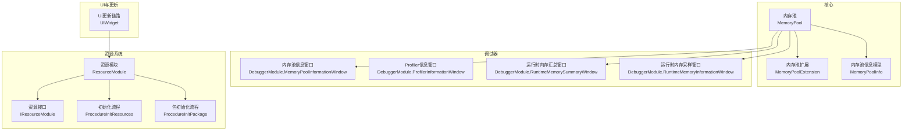
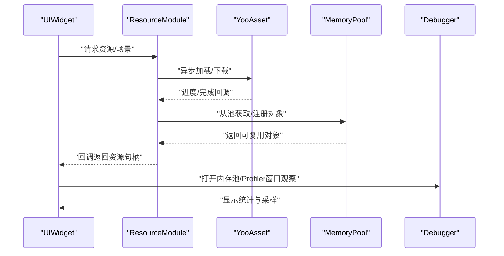
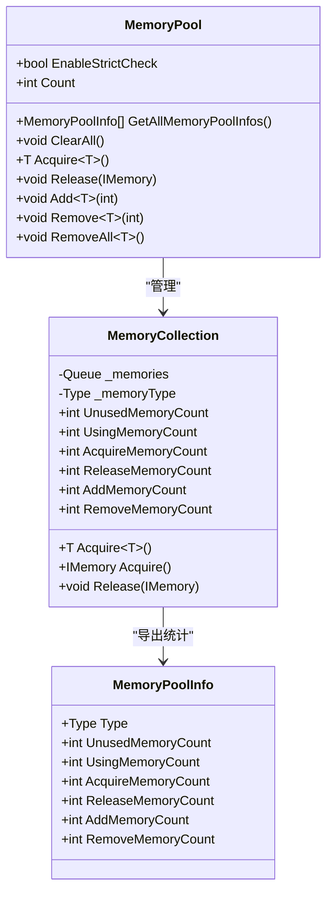
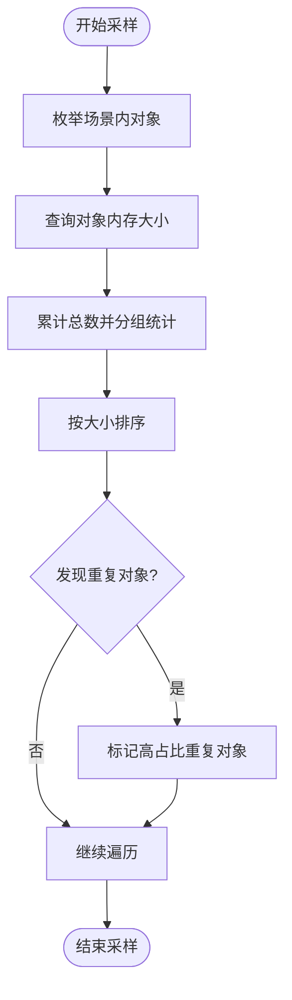
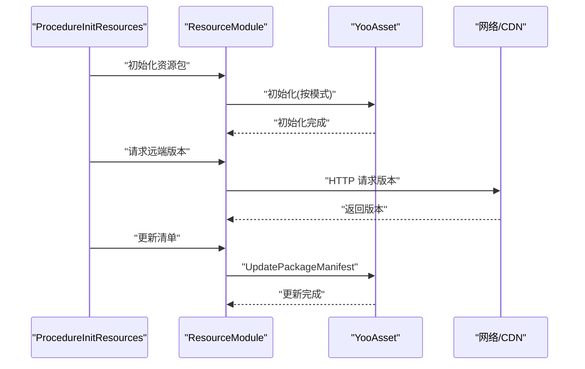
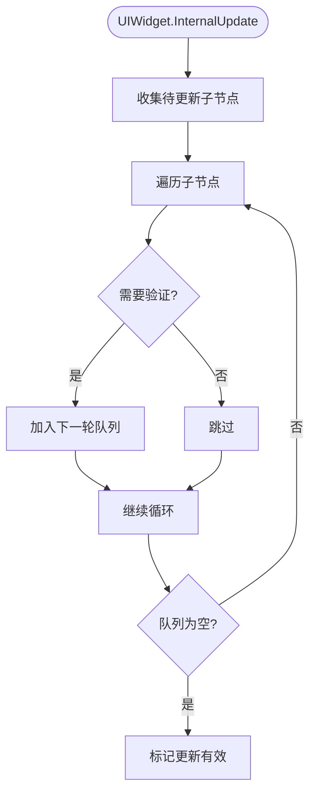
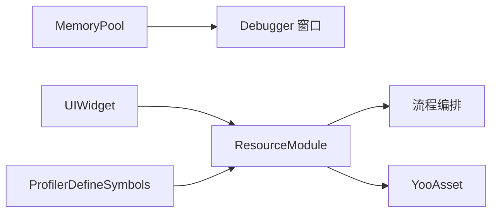

# 性能问题排查

<cite>
**本文档引用的文件**
- [MemoryPool.cs](file://Assets/TEngine/Runtime/Core/MemoryPool/MemoryPool.cs)
- [MemoryPool.MemoryCollection.cs](file://Assets/TEngine/Runtime/Core/MemoryPool/MemoryPool.MemoryCollection.cs)
- [MemoryPoolInfo.cs](file://Assets/TEngine/Runtime/Core/MemoryPool/MemoryPoolInfo.cs)
- [MemoryPoolExtension.cs](file://Assets/TEngine/Runtime/Core/MemoryPool/MemoryPoolExtension.cs)
- [DebuggerModule.MemoryPoolInformationWindow.cs](file://Assets/TEngine/Runtime/Module/DebugerModule/Component/DebuggerModule.MemoryPoolInformationWindow.cs)
- [DebuggerModule.ProfilerInformationWindow.cs](file://Assets/TEngine/Runtime/Module/DebugerModule/Component/DebuggerModule.ProfilerInformationWindow.cs)
- [DebuggerModule.RuntimeMemoryInformationWindow.cs](file://Assets/TEngine/Runtime/Module/DebugerModule/Component/DebuggerModule.RuntimeMemoryInformationWindow.cs)
- [DebuggerModule.RuntimeMemorySummaryWindow.cs](file://Assets/TEngine/Runtime/Module/DebugerModule/Component/DebuggerModule.RuntimeMemorySummaryWindow.cs)
- [ResourceModule.cs](file://Assets/TEngine/Runtime/Module/ResourceModule/ResourceModule.cs)
- [IResourceModule.cs](file://Assets/TEngine/Runtime/Module/ResourceModule/IResourceModule.cs)
- [ProcedureInitResources.cs](file://Assets/GameScripts/Procedure/ProcedureInitResources.cs)
- [ProcedureInitPackage.cs](file://Assets/GameScripts/Procedure/ProcedureInitPackage.cs)
- [ProfilerDefineSymbols.cs](file://Assets/TEngine/Editor/DefineSymbols/ProfilerDefineSymbols.cs)
- [UIWidget.cs](file://Assets/GameScripts/HotFix/GameLogic/Module/UIModule/UIWidget.cs)
</cite>

## 目录
1. [简介](#简介)
2. [项目结构](#项目结构)
3. [核心组件](#核心组件)
4. [架构总览](#架构总览)
5. [详细组件分析](#详细组件分析)
6. [依赖关系分析](#依赖关系分析)
7. [性能注意事项](#性能注意事项)
8. [故障排查指南](#故障排查指南)
9. [结论](#结论)
10. [附录](#附录)

## 简介
本指南面向TEngine框架使用者与引擎开发者，聚焦于性能问题的系统化排查与优化，覆盖以下主题：
- 内存分析与GC问题定位：基于内存池统计、运行时内存采样、Profiler指标等手段识别异常增长与碎片化。
- 渲染性能优化：结合UI更新链路、资源加载策略与帧时间片控制，降低卡顿与掉帧。
- 网络性能问题：热更新包体积与加载超时的诊断与缓解。
- 性能监控工具：调试器窗口、宏定义开关、Profiler采集项的使用方法与最佳实践。

## 项目结构
TEngine将性能相关能力分布在“核心内存池”“调试器模块”“资源模块”“流程编排”等子系统中。下图给出与性能排查密切相关的模块关系概览。

**图表来源**
- [MemoryPool.cs:1-208](file://Assets/TEngine/Runtime/Core/MemoryPool/MemoryPool.cs#L1-L208)
- [MemoryPoolExtension.cs:1-57](file://Assets/TEngine/Runtime/Core/MemoryPool/MemoryPoolExtension.cs#L1-L57)
- [MemoryPoolInfo.cs:1-85](file://Assets/TEngine/Runtime/Core/MemoryPool/MemoryPoolInfo.cs#L1-L85)
- [DebuggerModule.MemoryPoolInformationWindow.cs:1-107](file://Assets/TEngine/Runtime/Module/DebugerModule/Component/DebuggerModule.MemoryPoolInformationWindow.cs#L1-L107)
- [DebuggerModule.ProfilerInformationWindow.cs:1-60](file://Assets/TEngine/Runtime/Module/DebugerModule/Component/DebuggerModule.ProfilerInformationWindow.cs#L1-L60)
- [DebuggerModule.RuntimeMemorySummaryWindow.cs:57-97](file://Assets/TEngine/Runtime/Module/DebugerModule/Component/DebuggerModule.RuntimeMemorySummaryWindow.cs#L57-L97)
- [DebuggerModule.RuntimeMemoryInformationWindow.cs:74-109](file://Assets/TEngine/Runtime/Module/DebugerModule/Component/DebuggerModule.RuntimeMemoryInformationWindow.cs#L74-L109)
- [ResourceModule.cs:1-800](file://Assets/TEngine/Runtime/Module/ResourceModule/ResourceModule.cs#L1-L800)
- [IResourceModule.cs:319-344](file://Assets/TEngine/Runtime/Module/ResourceModule/IResourceModule.cs#L319-L344)
- [ProcedureInitResources.cs:38-131](file://Assets/GameScripts/Procedure/ProcedureInitResources.cs#L38-L131)
- [ProcedureInitPackage.cs:69-103](file://Assets/GameScripts/Procedure/ProcedureInitPackage.cs#L69-L103)
- [UIWidget.cs:89-135](file://Assets/GameScripts/HotFix/GameLogic/Module/UIModule/UIWidget.cs#L89-L135)

**章节来源**
- [MemoryPool.cs:1-208](file://Assets/TEngine/Runtime/Core/MemoryPool/MemoryPool.cs#L1-L208)
- [ResourceModule.cs:1-800](file://Assets/TEngine/Runtime/Module/ResourceModule/ResourceModule.cs#L1-L800)

## 核心组件
- 内存池（MemoryPool）：提供对象池化与计数统计，支持严格校验、批量增删、全量清空与按类型回收；通过扩展方法实现分配/回收生命周期钩子。
- 调试器（Debugger）：提供内存池信息、Profiler指标、运行时内存汇总与采样窗口，便于实时观测内存与GC趋势。
- 资源模块（ResourceModule）：封装YooAsset初始化、清单更新、下载器创建、低内存回收与卸载、WebGL加载策略等，支持超时与失败重试配置。
- UI更新链路（UIWidget）：维护UI树的增量更新队列，避免全量遍历，减少每帧UI更新成本。

**章节来源**
- [MemoryPool.cs:1-208](file://Assets/TEngine/Runtime/Core/MemoryPool/MemoryPool.cs#L1-L208)
- [MemoryPoolExtension.cs:1-57](file://Assets/TEngine/Runtime/Core/MemoryPool/MemoryPoolExtension.cs#L1-L57)
- [DebuggerModule.MemoryPoolInformationWindow.cs:1-107](file://Assets/TEngine/Runtime/Module/DebugerModule/Component/DebuggerModule.MemoryPoolInformationWindow.cs#L1-L107)
- [DebuggerModule.ProfilerInformationWindow.cs:1-60](file://Assets/TEngine/Runtime/Module/DebugerModule/Component/DebuggerModule.ProfilerInformationWindow.cs#L1-L60)
- [ResourceModule.cs:1-800](file://Assets/TEngine/Runtime/Module/ResourceModule/ResourceModule.cs#L1-L800)
- [UIWidget.cs:89-135](file://Assets/GameScripts/HotFix/GameLogic/Module/UIModule/UIWidget.cs#L89-L135)

## 架构总览
下图展示性能相关关键调用链：UI更新触发资源加载，资源模块按帧切片异步处理，内存池参与对象复用，调试器窗口采集内存与Profiler数据。

**图表来源**
- [UIWidget.cs:89-135](file://Assets/GameScripts/HotFix/GameLogic/Module/UIModule/UIWidget.cs#L89-L135)
- [ResourceModule.cs:624-800](file://Assets/TEngine/Runtime/Module/ResourceModule/ResourceModule.cs#L624-L800)
- [MemoryPool.cs:66-101](file://Assets/TEngine/Runtime/Core/MemoryPool/MemoryPool.cs#L66-L101)
- [DebuggerModule.MemoryPoolInformationWindow.cs:20-78](file://Assets/TEngine/Runtime/Module/DebugerModule/Component/DebuggerModule.MemoryPoolInformationWindow.cs#L20-L78)

## 详细组件分析

### 组件A：内存池与内存泄漏检测
- 统计维度：未使用、正在使用、获取次数、归还次数、新增次数、移除次数；可通过调试器窗口查看按程序集分类的明细。
- 使用不当风险：
  - 未归还对象：导致“正在使用”持续增长，最终触发新增以满足需求。
  - 类型不匹配：严格校验失败抛出异常，应确保Acquire/Release类型一致。
  - 频繁Add/Remove：可能引发池内重建与锁竞争，需批量化调整。
- 排查步骤：
  1) 打开“内存池信息”窗口，对比一段时间内的“获取/归还/新增/移除”变化。
  2) 关注“正在使用”与“未使用”的比例，异常升高提示泄漏或未释放。
  3) 若启用严格校验，捕获类型错误异常定位调用方。
  4) 对热点类型进行批量Add预热，减少运行时动态扩容。

**图表来源**
- [MemoryPool.cs:1-208](file://Assets/TEngine/Runtime/Core/MemoryPool/MemoryPool.cs#L1-L208)
- [MemoryPool.MemoryCollection.cs:1-85](file://Assets/TEngine/Runtime/Core/MemoryPool/MemoryPool.MemoryCollection.cs#L1-L85)
- [MemoryPoolInfo.cs:1-85](file://Assets/TEngine/Runtime/Core/MemoryPool/MemoryPoolInfo.cs#L1-L85)

**章节来源**
- [MemoryPool.cs:1-208](file://Assets/TEngine/Runtime/Core/MemoryPool/MemoryPool.cs#L1-L208)
- [MemoryPool.MemoryCollection.cs:1-85](file://Assets/TEngine/Runtime/Core/MemoryPool/MemoryPool.MemoryCollection.cs#L1-L85)
- [MemoryPoolInfo.cs:1-85](file://Assets/TEngine/Runtime/Core/MemoryPool/MemoryPoolInfo.cs#L1-L85)
- [DebuggerModule.MemoryPoolInformationWindow.cs:1-107](file://Assets/TEngine/Runtime/Module/DebugerModule/Component/DebuggerModule.MemoryPoolInformationWindow.cs#L1-L107)

### 组件B：运行时内存采样与Profiler指标
- 运行时内存汇总：按类型统计对象数量与占用，快速发现异常类型激增。
- 运行时内存采样：对具体对象进行内存大小采样，支持去重高占比对象，辅助定位大对象泄漏。
- Profiler指标：Mono/堆内存、分配总量、保留内存、图形驱动内存、临时分配器等，用于判断GC压力与内存碎片。

**图表来源**
- [DebuggerModule.RuntimeMemorySummaryWindow.cs:57-97](file://Assets/TEngine/Runtime/Module/DebugerModule/Component/DebuggerModule.RuntimeMemorySummaryWindow.cs#L57-L97)
- [DebuggerModule.RuntimeMemoryInformationWindow.cs:74-109](file://Assets/TEngine/Runtime/Module/DebugerModule/Component/DebuggerModule.RuntimeMemoryInformationWindow.cs#L74-L109)
- [DebuggerModule.ProfilerInformationWindow.cs:1-60](file://Assets/TEngine/Runtime/Module/DebugerModule/Component/DebuggerModule.ProfilerInformationWindow.cs#L1-L60)

**章节来源**
- [DebuggerModule.RuntimeMemorySummaryWindow.cs:57-97](file://Assets/TEngine/Runtime/Module/DebugerModule/Component/DebuggerModule.RuntimeMemorySummaryWindow.cs#L57-L97)
- [DebuggerModule.RuntimeMemoryInformationWindow.cs:74-109](file://Assets/TEngine/Runtime/Module/DebugerModule/Component/DebuggerModule.RuntimeMemoryInformationWindow.cs#L74-L109)
- [DebuggerModule.ProfilerInformationWindow.cs:1-60](file://Assets/TEngine/Runtime/Module/DebugerModule/Component/DebuggerModule.ProfilerInformationWindow.cs#L1-L60)

### 组件C：资源加载与网络性能
- 初始化流程：根据运行模式选择本地/远程/在线模式，支持WebGL远程/本地加载策略切换。
- 清单更新：请求远端版本并更新清单，支持超时与失败重试。
- 下载器：创建资源下载器，限制并发与失败重试次数。
- 低内存回收：触发卸载未使用资源，必要时触发GC。

**图表来源**
- [ProcedureInitResources.cs:38-131](file://Assets/GameScripts/Procedure/ProcedureInitResources.cs#L38-L131)
- [ResourceModule.cs:140-261](file://Assets/TEngine/Runtime/Module/ResourceModule/ResourceModule.cs#L140-L261)
- [IResourceModule.cs:319-344](file://Assets/TEngine/Runtime/Module/ResourceModule/IResourceModule.cs#L319-L344)

**章节来源**
- [ProcedureInitResources.cs:38-131](file://Assets/GameScripts/Procedure/ProcedureInitResources.cs#L38-L131)
- [ResourceModule.cs:140-261](file://Assets/TEngine/Runtime/Module/ResourceModule/ResourceModule.cs#L140-L261)
- [IResourceModule.cs:319-344](file://Assets/TEngine/Runtime/Module/ResourceModule/IResourceModule.cs#L319-L344)

### 组件D：UI更新与帧率下降
- UIWidget采用增量更新队列，仅对需要验证的子节点进行下一轮更新，减少每帧遍历成本。
- 若存在频繁刷新、大量子节点或复杂布局计算，仍可能导致掉帧，需结合Profiler火焰图定位热点。

**图表来源**
- [UIWidget.cs:89-135](file://Assets/GameScripts/HotFix/GameLogic/Module/UIModule/UIWidget.cs#L89-L135)

**章节来源**
- [UIWidget.cs:89-135](file://Assets/GameScripts/HotFix/GameLogic/Module/UIModule/UIWidget.cs#L89-L135)

## 依赖关系分析
- 内存池与调试器：内存池提供统计数据，调试器窗口消费并可视化。
- 资源模块与流程编排：流程负责初始化、版本请求与清单更新，资源模块提供具体实现。
- UI与资源：UI更新触发资源加载，资源模块按帧切片异步处理，避免主线程阻塞。
- Profiler宏定义：通过编辑器菜单启用/禁用Profiler宏，便于在不同构建中控制性能采集开销。

**图表来源**
- [MemoryPool.cs:1-208](file://Assets/TEngine/Runtime/Core/MemoryPool/MemoryPool.cs#L1-L208)
- [DebuggerModule.MemoryPoolInformationWindow.cs:1-107](file://Assets/TEngine/Runtime/Module/DebugerModule/Component/DebuggerModule.MemoryPoolInformationWindow.cs#L1-L107)
- [ResourceModule.cs:1-800](file://Assets/TEngine/Runtime/Module/ResourceModule/ResourceModule.cs#L1-L800)
- [ProcedureInitResources.cs:38-131](file://Assets/GameScripts/Procedure/ProcedureInitResources.cs#L38-L131)
- [ProfilerDefineSymbols.cs:1-44](file://Assets/TEngine/Editor/DefineSymbols/ProfilerDefineSymbols.cs#L1-L44)

**章节来源**
- [ProfilerDefineSymbols.cs:1-44](file://Assets/TEngine/Editor/DefineSymbols/ProfilerDefineSymbols.cs#L1-L44)

## 性能注意事项
- 内存池
  - 严格校验开启时可提前暴露类型不匹配问题，建议在开发阶段启用。
  - 对热点类型进行批量Add预热，减少运行时动态扩容带来的抖动。
  - 定期清理无用池项，避免池内对象过多导致锁竞争。
- 资源加载
  - 合理设置每帧时间切片，避免单帧负载过高。
  - 控制并发下载与失败重试次数，防止网络拥塞与资源争抢。
  - 在WebGL平台选择合适的加载策略（本地/远程），减少首屏等待。
- UI更新
  - 利用增量更新机制，避免全量刷新。
  - 复杂UI建议拆分为多个子树，按需更新。
- Profiler采集
  - 在开发阶段启用分配调用栈与二进制日志，定位GC与内存热点。
  - 发布版本谨慎开启高开销采集，避免影响性能。

[本节为通用指导，无需特定文件引用]

## 故障排查指南

### 内存泄漏检测
- 现象特征
  - “正在使用”持续增长且不回落；“新增”显著高于“归还”。
  - 运行时内存汇总中某类型数量与大小异常飙升。
- 排查步骤
  1) 打开“内存池信息”窗口，筛选目标类型，观察其“正在使用/获取/归还/新增/移除”曲线。
  2) 若启用严格校验，关注类型不匹配异常，修正调用方的Acquire/Release配对。
  3) 使用“运行时内存汇总/采样”窗口定位大对象与重复对象，优先回收。
  4) 对热点类型进行批量Add预热，减少运行时创建。
  5) 若问题集中在特定模块，检查该模块对象生命周期与归还逻辑。

**章节来源**
- [DebuggerModule.MemoryPoolInformationWindow.cs:1-107](file://Assets/TEngine/Runtime/Module/DebugerModule/Component/DebuggerModule.MemoryPoolInformationWindow.cs#L1-L107)
- [DebuggerModule.RuntimeMemorySummaryWindow.cs:57-97](file://Assets/TEngine/Runtime/Module/DebugerModule/Component/DebuggerModule.RuntimeMemorySummaryWindow.cs#L57-L97)
- [DebuggerModule.RuntimeMemoryInformationWindow.cs:74-109](file://Assets/TEngine/Runtime/Module/DebugerModule/Component/DebuggerModule.RuntimeMemoryInformationWindow.cs#L74-L109)
- [MemoryPool.cs:1-208](file://Assets/TEngine/Runtime/Core/MemoryPool/MemoryPool.cs#L1-L208)

### GC问题定位
- 现象特征
  - 帧间GC频率上升，帧耗时波动增大；Profiler中分配速率与峰值内存上升。
- 排查步骤
  1) 打开“Profiler信息”窗口，关注“总分配内存/保留内存/未用保留内存/临时分配器大小”等指标。
  2) 启用分配调用栈与二进制日志，定位高频分配点。
  3) 结合内存池统计，确认是否存在未归还对象或频繁小对象创建。
  4) 优化策略：合并小对象、使用对象池、延迟创建、避免闭包捕获。

**章节来源**
- [DebuggerModule.ProfilerInformationWindow.cs:1-60](file://Assets/TEngine/Runtime/Module/DebugerModule/Component/DebuggerModule.ProfilerInformationWindow.cs#L1-L60)

### 渲染性能优化
- 现象特征
  - UI频繁闪烁或掉帧；场景切换卡顿；特效/粒子密集区域帧耗时飙升。
- 排查步骤
  1) 检查UI更新链路，确认是否使用增量更新，避免全量刷新。
  2) 分析资源加载是否阻塞主线程，适当提高每帧时间切片或降低并发。
  3) 在WebGL平台选择合适加载策略，减少首屏等待。
  4) 优化材质/网格/纹理，减少DrawCall与带宽占用。

**章节来源**
- [UIWidget.cs:89-135](file://Assets/GameScripts/HotFix/GameLogic/Module/UIModule/UIWidget.cs#L89-L135)
- [ResourceModule.cs:1-800](file://Assets/TEngine/Runtime/Module/ResourceModule/ResourceModule.cs#L1-L800)

### 网络性能问题（热更新包过大/加载超时）
- 现象特征
  - 初始化失败或超时；远端版本请求失败；清单更新失败。
- 排查步骤
  1) 查看初始化流程日志，定位失败阶段（初始化/请求版本/更新清单）。
  2) 检查远端URL与CDN可用性，确认超时时间与失败重试配置。
  3) 评估热更包体积，拆分包体或采用分层加载策略。
  4) 在WebGL平台确认加载策略（本地/远程），避免跨域与缓存问题。

**章节来源**
- [ProcedureInitResources.cs:38-131](file://Assets/GameScripts/Procedure/ProcedureInitResources.cs#L38-L131)
- [ProcedureInitPackage.cs:69-103](file://Assets/GameScripts/Procedure/ProcedureInitPackage.cs#L69-L103)
- [ResourceModule.cs:140-261](file://Assets/TEngine/Runtime/Module/ResourceModule/ResourceModule.cs#L140-L261)
- [IResourceModule.cs:319-344](file://Assets/TEngine/Runtime/Module/ResourceModule/IResourceModule.cs#L319-L344)

### 性能监控工具使用方法
- 内存池信息窗口
  - 功能：查看各类型内存池统计与程序集分布。
  - 使用：在调试器中打开“Memory Pool Information”，观察“正在使用/获取/归还/新增/移除”。
- 运行时内存汇总/采样窗口
  - 功能：按类型统计对象数量与内存占用，采样具体对象大小。
  - 使用：打开“Runtime Memory Summary/Information”，观察高占比类型与重复对象。
- Profiler信息窗口
  - 功能：查看Mono/堆内存、分配总量、保留内存、图形驱动内存等。
  - 使用：打开“Profiler Information”，结合分配调用栈定位热点。
- Profiler宏定义符号
  - 功能：在编辑器中一键启用/禁用Profiler相关宏，控制采集开销。
  - 使用：通过菜单“TEngine/Profiler Define Symbols/Enable All Profiler”启用。

**章节来源**
- [DebuggerModule.MemoryPoolInformationWindow.cs:1-107](file://Assets/TEngine/Runtime/Module/DebugerModule/Component/DebuggerModule.MemoryPoolInformationWindow.cs#L1-L107)
- [DebuggerModule.RuntimeMemorySummaryWindow.cs:57-97](file://Assets/TEngine/Runtime/Module/DebugerModule/Component/DebuggerModule.RuntimeMemorySummaryWindow.cs#L57-L97)
- [DebuggerModule.RuntimeMemoryInformationWindow.cs:74-109](file://Assets/TEngine/Runtime/Module/DebugerModule/Component/DebuggerModule.RuntimeMemoryInformationWindow.cs#L74-L109)
- [DebuggerModule.ProfilerInformationWindow.cs:1-60](file://Assets/TEngine/Runtime/Module/DebugerModule/Component/DebuggerModule.ProfilerInformationWindow.cs#L1-L60)
- [ProfilerDefineSymbols.cs:1-44](file://Assets/TEngine/Editor/DefineSymbols/ProfilerDefineSymbols.cs#L1-L44)

## 结论
通过将内存池统计、运行时内存采样、Profiler指标与资源加载流程相结合，可以系统化地定位与缓解TEngine中的性能问题。建议在开发阶段启用严格校验与Profiler采集，在发布阶段适度降采样以平衡性能与可观测性。针对UI更新与资源加载的热点路径进行针对性优化，可显著提升稳定性与帧率表现。

[本节为总结性内容，无需特定文件引用]

## 附录
- 优化建议速查
  - 内存池：批量Add预热、严格校验、定期清理、类型配对归还。
  - 资源加载：合理切片、并发控制、失败重试、WebGL策略。
  - UI更新：增量更新、拆分子树、延迟创建、避免闭包。
  - Profiler：启用分配调用栈、二进制日志，定位热点后再关闭。

[本节为通用指导，无需特定文件引用]