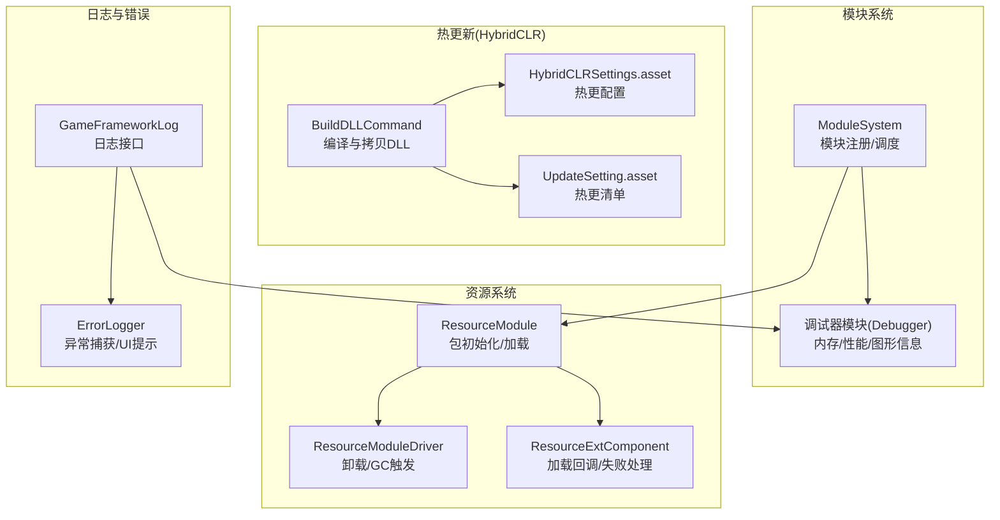
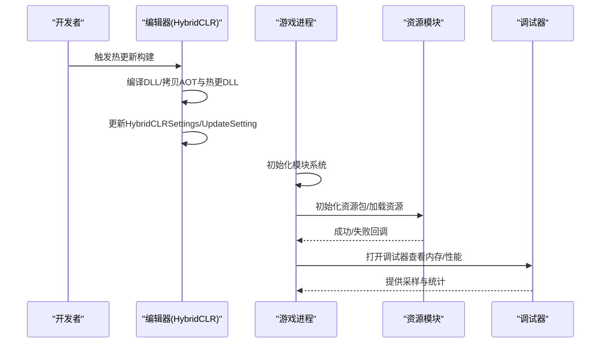
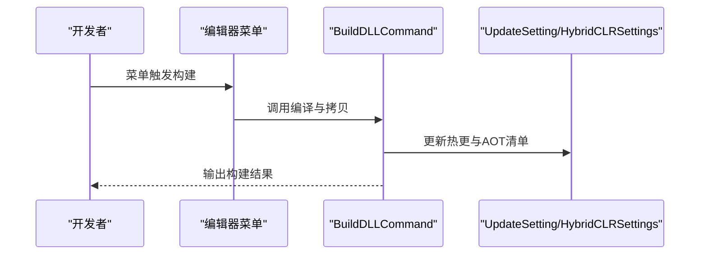
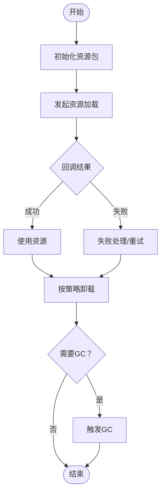
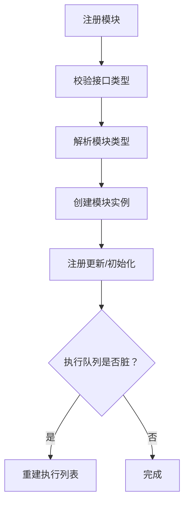
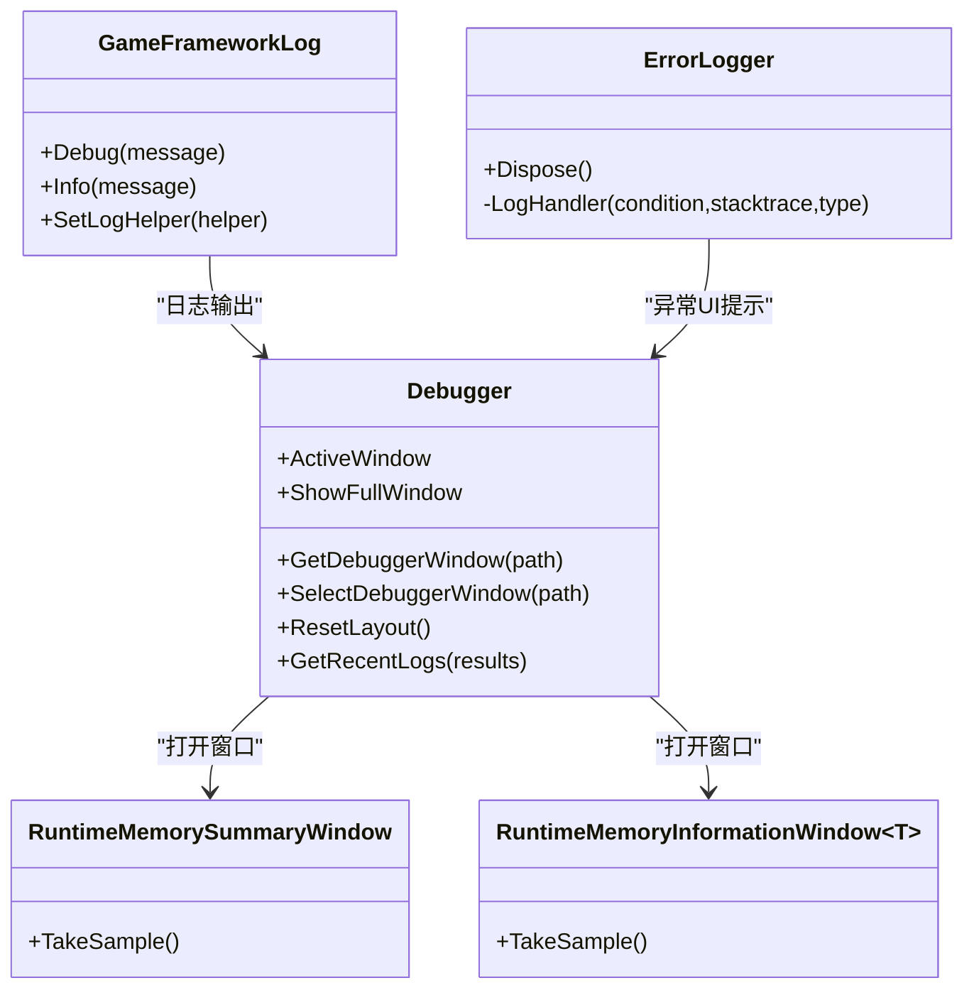
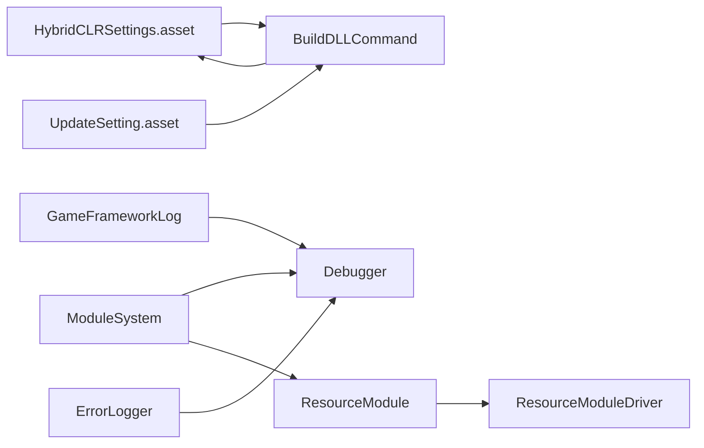

# 故障排除指南

<cite>
**本文档引用的文件**
- [BuildDLLCommand.cs](file://Assets/TEngine/Editor/HybridCLR/BuildDLLCommand.cs)
- [UpdateSettingEditor.cs](file://Assets/TEngine/Editor/Utility/UpdateSettingEditor.cs)
- [systemPatterns.md](file://memory-bank/systemPatterns.md)
- [ProcedureLoadAssembly.cs](file://Assets/GameScripts/Procedure/ProcedureLoadAssembly.cs)
- [ResourceExtComponent.Resource.cs](file://Assets/TEngine/Runtime/Module/ResourceModule/Extension/ResourceExtComponent.Resource.cs)
- [ModuleSystem.cs](file://Assets/TEngine/Runtime/Core/ModuleSystem.cs)
- [DebuggerModule.RuntimeMemoryInformationWindow.cs](file://Assets/TEngine/Runtime/Module/DebugerModule/Component/DebuggerModule.RuntimeMemoryInformationWindow.cs)
- [ResourceModuleDriver.cs](file://Assets/TEngine/Runtime/Module/ResourceModule/ResourceModuleDriver.cs)
- [DebuggerModule.GraphicsInformationWindow.cs](file://Assets/TEngine/Runtime/Module/DebugerModule/Component/DebuggerModule.GraphicsInformationWindow.cs)
- [Debugger.cs](file://Assets/TEngine/Runtime/Module/DebugerModule/Debugger.cs)
- [DebuggerModule.RuntimeMemorySummaryWindow.cs](file://Assets/TEngine/Runtime/Module/DebugerModule/Component/DebuggerModule.RuntimeMemorySummaryWindow.cs)
- [DebuggerModule.ProfilerInformationWindow.cs](file://Assets/TEngine/Runtime/Module/DebugerModule/Component/DebuggerModule.ProfilerInformationWindow.cs)
- [GameFrameworkLog.cs](file://Assets/TEngine/Runtime/Core/Log/GameFrameworkLog.cs)
- [UpdateSetting.asset](file://Assets/TEngine/Settings/UpdateSetting.asset)
- [HybridCLRSettings.asset](file://ProjectSettings/HybridCLRSettings.asset)
- [ErrorLogger.cs](file://Assets/GameScripts/HotFix/GameLogic/Module/UIModule/ErrorLogger/ErrorLogger.cs)
- [MemoryPoolExtension.cs](file://Assets/TEngine/Runtime/Core/MemoryPool/MemoryPoolExtension.cs)
- [MemoryPool.MemoryCollection.cs](file://Assets/TEngine/Runtime/Core/MemoryPool/MemoryPool.MemoryCollection.cs)
- [MemoryPool.cs](file://Assets/TEngine/Runtime/Core/MemoryPool/MemoryPool.cs)
- [DebuggerModule.MemoryPoolInformationWindow.cs](file://Assets/TEngine/Runtime/Module/DebugerModule/Component/DebuggerModule.MemoryPoolInformationWindow.cs)
- [MemoryPoolInfo.cs](file://Assets/TEngine/Runtime/Core/MemoryPool/MemoryPoolInfo.cs)
- [ResourceModule.cs](file://Assets/TEngine/Runtime/Module/ResourceModule/ResourceModule.cs)
</cite>

## 目录
1. [简介](#简介)
2. [项目结构](#项目结构)
3. [核心组件](#核心组件)
4. [架构总览](#架构总览)
5. [详细组件分析](#详细组件分析)
6. [依赖关系分析](#依赖关系分析)
7. [性能考量](#性能考量)
8. [故障排除指南](#故障排除指南)
9. [结论](#结论)
10. [附录](#附录)

## 简介
本指南面向TEngine框架使用者，聚焦于常见问题的诊断与解决，覆盖热更新（HybridCLR兼容性、AOT配置）、资源管理（加载失败、内存泄漏）、模块系统（注册失败、依赖冲突），并提供性能问题排查（内存分析、GC定位、渲染优化）与调试技巧（日志系统、断点调试、性能分析工具）。文档同时给出具体错误信息解读、解决方案与预防性最佳实践。

## 项目结构
TEngine采用模块化架构，核心模块通过ModuleSystem统一注册与调度；资源模块基于YooAsset；热更新通过HybridCLR实现；调试器模块提供运行时内存、图形、性能等可视化分析能力。

**图表来源**
- [BuildDLLCommand.cs:86-117](file://Assets/TEngine/Editor/HybridCLR/BuildDLLCommand.cs#L86-L117)
- [HybridCLRSettings.asset:15-39](file://ProjectSettings/HybridCLRSettings.asset#L15-L39)
- [UpdateSetting.asset:16-28](file://Assets/TEngine/Settings/UpdateSetting.asset#L16-L28)
- [ModuleSystem.cs:68-89](file://Assets/TEngine/Runtime/Core/ModuleSystem.cs#L68-L89)
- [ResourceModule.cs:119-138](file://Assets/TEngine/Runtime/Module/ResourceModule/ResourceModule.cs#L119-L138)
- [ResourceModuleDriver.cs:307-334](file://Assets/TEngine/Runtime/Module/ResourceModule/ResourceModuleDriver.cs#L307-L334)
- [ResourceExtComponent.Resource.cs:41-42](file://Assets/TEngine/Runtime/Module/ResourceModule/Extension/ResourceExtComponent.Resource.cs#L41-L42)
- [GameFrameworkLog.cs:547-569](file://Assets/TEngine/Runtime/Core/Log/GameFrameworkLog.cs#L547-L569)
- [ErrorLogger.cs:21-28](file://Assets/GameScripts/HotFix/GameLogic/Module/UIModule/ErrorLogger/ErrorLogger.cs#L21-L28)

**章节来源**
- [ModuleSystem.cs:1-200](file://Assets/TEngine/Runtime/Core/ModuleSystem.cs#L1-L200)
- [ResourceModule.cs:1-200](file://Assets/TEngine/Runtime/Module/ResourceModule/ResourceModule.cs#L1-L200)
- [Debugger.cs:1-200](file://Assets/TEngine/Runtime/Module/DebugerModule/Debugger.cs#L1-L200)

## 核心组件
- 模块系统：负责模块注册、优先级排序、更新队列构建与执行，以及异常抛出与模块查找。
- 资源系统：封装YooAsset初始化、包管理、加载策略与卸载回收。
- 热更新系统：编辑器命令编译DLL、拷贝AOT与热更DLL、同步HybridCLRSettings与UpdateSetting。
- 调试器模块：提供内存、图形、性能、FPS等可视化面板，便于定位问题。
- 日志系统：统一日志接口，支持多级别输出，便于问题追踪。
- 错误捕获：Unity Application.logMessageReceived钩子，异常转UI提示。

**章节来源**
- [ModuleSystem.cs:68-141](file://Assets/TEngine/Runtime/Core/ModuleSystem.cs#L68-L141)
- [ResourceModule.cs:119-138](file://Assets/TEngine/Runtime/Module/ResourceModule/ResourceModule.cs#L119-L138)
- [BuildDLLCommand.cs:86-117](file://Assets/TEngine/Editor/HybridCLR/BuildDLLCommand.cs#L86-L117)
- [Debugger.cs:52-82](file://Assets/TEngine/Runtime/Module/DebugerModule/Debugger.cs#L52-L82)
- [GameFrameworkLog.cs:547-569](file://Assets/TEngine/Runtime/Core/Log/GameFrameworkLog.cs#L547-L569)
- [ErrorLogger.cs:6-29](file://Assets/GameScripts/HotFix/GameLogic/Module/UIModule/ErrorLogger/ErrorLogger.cs#L6-L29)

## 架构总览
下图展示热更新与资源加载的关键流程，以及调试器在运行期的作用。

**图表来源**
- [systemPatterns.md:317-351](file://memory-bank/systemPatterns.md#L317-L351)
- [BuildDLLCommand.cs:86-117](file://Assets/TEngine/Editor/HybridCLR/BuildDLLCommand.cs#L86-L117)
- [UpdateSettingEditor.cs:74-104](file://Assets/TEngine/Editor/Utility/UpdateSettingEditor.cs#L74-L104)
- [ResourceModule.cs:119-138](file://Assets/TEngine/Runtime/Module/ResourceModule/ResourceModule.cs#L119-L138)
- [Debugger.cs:183-200](file://Assets/TEngine/Runtime/Module/DebugerModule/Debugger.cs#L183-L200)

## 详细组件分析

### 热更新（HybridCLR）问题
- 症状
  - 热更DLL无法加载或运行时报错
  - AOT泛型缺失导致解释执行
  - 编辑器构建后运行期找不到DLL
- 诊断要点
  - 确认热更DLL是否成功编译并拷贝至目标路径
  - 确认AOT元数据清单与热更清单一致
  - 确认HybridCLRSettings与UpdateSetting中的集合已同步
- 解决步骤
  - 使用编辑器菜单命令触发构建与拷贝
  - 在编辑器中强制刷新热更与AOT清单
  - 验证清单文件与实际构建产物一致
- 预防措施
  - 固定热更DLL命名与扩展名
  - 统一AOT元数据输出目录与构建目标
  - 版本控制中保留构建脚本与清单

**图表来源**
- [BuildDLLCommand.cs:86-117](file://Assets/TEngine/Editor/HybridCLR/BuildDLLCommand.cs#L86-L117)
- [UpdateSettingEditor.cs:74-104](file://Assets/TEngine/Editor/Utility/UpdateSettingEditor.cs#L74-L104)
- [UpdateSetting.asset:16-28](file://Assets/TEngine/Settings/UpdateSetting.asset#L16-L28)
- [HybridCLRSettings.asset:20-34](file://ProjectSettings/HybridCLRSettings.asset#L20-L34)

**章节来源**
- [BuildDLLCommand.cs:86-117](file://Assets/TEngine/Editor/HybridCLR/BuildDLLCommand.cs#L86-L117)
- [UpdateSettingEditor.cs:40-106](file://Assets/TEngine/Editor/Utility/UpdateSettingEditor.cs#L40-L106)
- [UpdateSetting.asset:16-28](file://Assets/TEngine/Settings/UpdateSetting.asset#L16-L28)
- [HybridCLRSettings.asset:20-34](file://ProjectSettings/HybridCLRSettings.asset#L20-L34)
- [systemPatterns.md:317-351](file://memory-bank/systemPatterns.md#L317-L351)

### 资源管理问题
- 症状
  - 资源加载失败、卡顿、内存飙升
  - 卸载无效导致内存泄漏
- 诊断要点
  - 检查资源包初始化状态与运行模式
  - 观察加载回调与失败处理
  - 使用调试器采样内存与对象分布
- 解决步骤
  - 确保资源包初始化完成后再请求加载
  - 合理设置卸载策略与GC触发时机
  - 使用调试器定位大对象与重复对象
- 预防措施
  - 控制同时加载任务数量
  - 定期卸载无用资源并触发GC
  - 对热点资源建立缓存与复用

**图表来源**
- [ResourceModule.cs:119-138](file://Assets/TEngine/Runtime/Module/ResourceModule/ResourceModule.cs#L119-L138)
- [ResourceExtComponent.Resource.cs:41-42](file://Assets/TEngine/Runtime/Module/ResourceModule/Extension/ResourceExtComponent.Resource.cs#L41-L42)
- [ResourceModuleDriver.cs:307-334](file://Assets/TEngine/Runtime/Module/ResourceModule/ResourceModuleDriver.cs#L307-L334)
- [DebuggerModule.RuntimeMemoryInformationWindow.cs:82-109](file://Assets/TEngine/Runtime/Module/DebugerModule/Component/DebuggerModule.RuntimeMemoryInformationWindow.cs#L82-L109)

**章节来源**
- [ResourceModule.cs:119-200](file://Assets/TEngine/Runtime/Module/ResourceModule/ResourceModule.cs#L119-L200)
- [ResourceExtComponent.Resource.cs:1-42](file://Assets/TEngine/Runtime/Module/ResourceModule/Extension/ResourceExtComponent.Resource.cs#L1-L42)
- [ResourceModuleDriver.cs:307-334](file://Assets/TEngine/Runtime/Module/ResourceModule/ResourceModuleDriver.cs#L307-L334)
- [DebuggerModule.RuntimeMemorySummaryWindow.cs:61-97](file://Assets/TEngine/Runtime/Module/DebugerModule/Component/DebuggerModule.RuntimeMemorySummaryWindow.cs#L61-L97)

### 模块系统问题
- 症状
  - 模块注册失败、优先级异常、更新顺序错乱
- 诊断要点
  - 接口类型校验与模块类型解析
  - 更新模块链表与执行队列重建
- 解决步骤
  - 确保通过接口获取模块
  - 检查模块类型命名空间与程序集匹配
  - 避免在脏标记期间修改模块注册
- 预防措施
  - 统一模块命名规范
  - 合理设置Priority，避免频繁变更

**图表来源**
- [ModuleSystem.cs:68-141](file://Assets/TEngine/Runtime/Core/ModuleSystem.cs#L68-L141)
- [ModuleSystem.cs:199-200](file://Assets/TEngine/Runtime/Core/ModuleSystem.cs#L199-L200)

**章节来源**
- [ModuleSystem.cs:68-141](file://Assets/TEngine/Runtime/Core/ModuleSystem.cs#L68-L141)

### 调试器与日志系统
- 调试器功能
  - 内存采样（总体与按类型）
  - 图形信息与性能指标
  - FPS与系统信息
- 日志系统
  - 多级别日志接口
  - 统一日志辅助器
- 错误捕获
  - Unity异常事件转发至UI

**图表来源**
- [Debugger.cs:52-82](file://Assets/TEngine/Runtime/Module/DebugerModule/Debugger.cs#L52-L82)
- [DebuggerModule.RuntimeMemorySummaryWindow.cs:61-97](file://Assets/TEngine/Runtime/Module/DebugerModule/Component/DebuggerModule.RuntimeMemorySummaryWindow.cs#L61-L97)
- [DebuggerModule.RuntimeMemoryInformationWindow.cs:82-109](file://Assets/TEngine/Runtime/Module/DebugerModule/Component/DebuggerModule.RuntimeMemoryInformationWindow.cs#L82-L109)
- [GameFrameworkLog.cs:547-569](file://Assets/TEngine/Runtime/Core/Log/GameFrameworkLog.cs#L547-L569)
- [ErrorLogger.cs:6-29](file://Assets/GameScripts/HotFix/GameLogic/Module/UIModule/ErrorLogger/ErrorLogger.cs#L6-L29)

**章节来源**
- [Debugger.cs:1-200](file://Assets/TEngine/Runtime/Module/DebugerModule/Debugger.cs#L1-L200)
- [DebuggerModule.GraphicsInformationWindow.cs:72-87](file://Assets/TEngine/Runtime/Module/DebugerModule/Component/DebuggerModule.GraphicsInformationWindow.cs#L72-L87)
- [DebuggerModule.ProfilerInformationWindow.cs:46-59](file://Assets/TEngine/Runtime/Module/DebugerModule/Component/DebuggerModule.ProfilerInformationWindow.cs#L46-L59)
- [GameFrameworkLog.cs:547-569](file://Assets/TEngine/Runtime/Core/Log/GameFrameworkLog.cs#L547-L569)
- [ErrorLogger.cs:6-29](file://Assets/GameScripts/HotFix/GameLogic/Module/UIModule/ErrorLogger/ErrorLogger.cs#L6-L29)

## 依赖关系分析
- 热更新依赖
  - 编辑器命令依赖HybridCLRSettings与UpdateSetting
  - 运行时依赖AOT元数据与热更DLL清单一致
- 资源系统依赖
  - YooAsset初始化参数与运行模式
  - 资源包生命周期与卸载策略
- 调试器依赖
  - 模块系统提供调试器窗口集合
  - 日志系统与错误捕获作为输入

**图表来源**
- [HybridCLRSettings.asset:15-39](file://ProjectSettings/HybridCLRSettings.asset#L15-L39)
- [UpdateSetting.asset:16-28](file://Assets/TEngine/Settings/UpdateSetting.asset#L16-L28)
- [BuildDLLCommand.cs:86-117](file://Assets/TEngine/Editor/HybridCLR/BuildDLLCommand.cs#L86-L117)
- [ModuleSystem.cs:68-89](file://Assets/TEngine/Runtime/Core/ModuleSystem.cs#L68-L89)
- [ResourceModule.cs:119-138](file://Assets/TEngine/Runtime/Module/ResourceModule/ResourceModule.cs#L119-L138)
- [ResourceModuleDriver.cs:307-334](file://Assets/TEngine/Runtime/Module/ResourceModule/ResourceModuleDriver.cs#L307-L334)
- [GameFrameworkLog.cs:547-569](file://Assets/TEngine/Runtime/Core/Log/GameFrameworkLog.cs#L547-L569)
- [ErrorLogger.cs:6-29](file://Assets/GameScripts/HotFix/GameLogic/Module/UIModule/ErrorLogger/ErrorLogger.cs#L6-L29)

**章节来源**
- [ModuleSystem.cs:68-141](file://Assets/TEngine/Runtime/Core/ModuleSystem.cs#L68-L141)
- [ResourceModule.cs:119-138](file://Assets/TEngine/Runtime/Module/ResourceModule/ResourceModule.cs#L119-L138)
- [Debugger.cs:183-200](file://Assets/TEngine/Runtime/Module/DebugerModule/Debugger.cs#L183-L200)

## 性能考量
- 内存分析
  - 使用调试器的内存采样窗口，按类型分组查看占用
  - 关注重复对象与大对象，定位潜在泄漏
- GC问题定位
  - 观察卸载与GC触发时机，避免频繁GC
  - 使用驱动层卸载与GC协同策略
- 渲染性能优化
  - 查看图形信息窗口，关注驱动内存与临时分配
  - 结合Profiler窗口指标进行针对性优化

**章节来源**
- [DebuggerModule.RuntimeMemoryInformationWindow.cs:82-109](file://Assets/TEngine/Runtime/Module/DebugerModule/Component/DebuggerModule.RuntimeMemoryInformationWindow.cs#L82-L109)
- [DebuggerModule.RuntimeMemorySummaryWindow.cs:61-97](file://Assets/TEngine/Runtime/Module/DebugerModule/Component/DebuggerModule.RuntimeMemorySummaryWindow.cs#L61-L97)
- [DebuggerModule.GraphicsInformationWindow.cs:72-87](file://Assets/TEngine/Runtime/Module/DebugerModule/Component/DebuggerModule.GraphicsInformationWindow.cs#L72-L87)
- [DebuggerModule.ProfilerInformationWindow.cs:46-59](file://Assets/TEngine/Runtime/Module/DebugerModule/Component/DebuggerModule.ProfilerInformationWindow.cs#L46-L59)
- [ResourceModuleDriver.cs:307-334](file://Assets/TEngine/Runtime/Module/ResourceModule/ResourceModuleDriver.cs#L307-L334)

## 故障排除指南

### 热更新问题
- 症状：热更DLL加载失败或运行时报错
  - 检查AOT元数据清单与热更清单是否一致
  - 确认构建命令已执行并拷贝至正确路径
  - 强制刷新UpdateSetting与HybridCLRSettings
- 症状：AOT泛型缺失导致解释执行
  - 确认AOT元数据已加载
  - 检查ProcedureLoadAssembly中元数据加载逻辑
- 症状：编辑器构建后运行期找不到DLL
  - 校验UpdateSetting中的DLL扩展名与路径
  - 确认AssemblyTextAssetPath与扩展名配置一致

**章节来源**
- [UpdateSettingEditor.cs:74-104](file://Assets/TEngine/Editor/Utility/UpdateSettingEditor.cs#L74-L104)
- [ProcedureLoadAssembly.cs:224-241](file://Assets/GameScripts/Procedure/ProcedureLoadAssembly.cs#L224-L241)
- [UpdateSetting.asset:28-29](file://Assets/TEngine/Settings/UpdateSetting.asset#L28-L29)
- [HybridCLRSettings.asset:27-34](file://ProjectSettings/HybridCLRSettings.asset#L27-L34)

### 资源管理问题
- 症状：资源加载失败
  - 检查资源包初始化状态与运行模式
  - 查看加载回调失败原因
- 症状：内存泄漏/飙升
  - 使用调试器采样，定位重复与大对象
  - 启用卸载策略并触发GC
- 症状：卡顿
  - 控制并发加载任务数量
  - 分帧处理与时间片设置

**章节来源**
- [ResourceModule.cs:140-200](file://Assets/TEngine/Runtime/Module/ResourceModule/ResourceModule.cs#L140-L200)
- [ResourceExtComponent.Resource.cs:41-42](file://Assets/TEngine/Runtime/Module/ResourceModule/Extension/ResourceExtComponent.Resource.cs#L41-L42)
- [ResourceModuleDriver.cs:307-334](file://Assets/TEngine/Runtime/Module/ResourceModule/ResourceModuleDriver.cs#L307-L334)
- [DebuggerModule.RuntimeMemoryInformationWindow.cs:82-109](file://Assets/TEngine/Runtime/Module/DebugerModule/Component/DebuggerModule.RuntimeMemoryInformationWindow.cs#L82-L109)

### 模块系统问题
- 症状：模块注册失败
  - 确保通过接口获取模块
  - 检查模块类型命名空间与程序集匹配
- 症状：更新顺序异常
  - 检查Priority设置
  - 避免在脏标记期间频繁注册

**章节来源**
- [ModuleSystem.cs:68-141](file://Assets/TEngine/Runtime/Core/ModuleSystem.cs#L68-L141)

### 调试与日志
- 使用调试器采样内存与性能，定位问题根因
- 通过日志接口输出关键信息，配合错误捕获UI展示异常详情

**章节来源**
- [Debugger.cs:183-200](file://Assets/TEngine/Runtime/Module/DebugerModule/Debugger.cs#L183-L200)
- [GameFrameworkLog.cs:547-569](file://Assets/TEngine/Runtime/Core/Log/GameFrameworkLog.cs#L547-L569)
- [ErrorLogger.cs:21-28](file://Assets/GameScripts/HotFix/GameLogic/Module/UIModule/ErrorLogger/ErrorLogger.cs#L21-L28)

### 内存池与内存泄漏预防
- 使用内存池减少GC压力
- 定期检查内存池统计，识别异常增长
- 归还对象至池中，避免遗漏

**章节来源**
- [MemoryPoolExtension.cs:35-55](file://Assets/TEngine/Runtime/Core/MemoryPool/MemoryPoolExtension.cs#L35-L55)
- [MemoryPool.MemoryCollection.cs:46-81](file://Assets/TEngine/Runtime/Core/MemoryPool/MemoryPool.MemoryCollection.cs#L46-L81)
- [MemoryPool.cs:72-101](file://Assets/TEngine/Runtime/Core/MemoryPool/MemoryPool.cs#L72-L101)
- [MemoryPoolInfo.cs:30-85](file://Assets/TEngine/Runtime/Core/MemoryPool/MemoryPoolInfo.cs#L30-L85)
- [DebuggerModule.MemoryPoolInformationWindow.cs:80-93](file://Assets/TEngine/Runtime/Module/DebugerModule/Component/DebuggerModule.MemoryPoolInformationWindow.cs#L80-L93)

## 结论
TEngine通过模块化、资源系统与热更新机制形成完整的运行时框架。结合调试器与日志系统，可高效定位与解决热更新、资源与模块相关问题。遵循本文提供的诊断流程与最佳实践，可显著降低故障率并提升开发效率。

## 附录
- 常用排查清单
  - 热更新：确认清单、构建命令、AOT元数据
  - 资源：初始化状态、加载回调、卸载与GC
  - 模块：接口获取、类型匹配、优先级
  - 调试：内存采样、性能指标、日志与异常UI
- 工具与入口
  - 编辑器菜单：热更新构建与拷贝
  - 调试器窗口：内存、图形、性能、FPS
  - 日志接口：多级别输出
  - 错误捕获：异常转UI提示