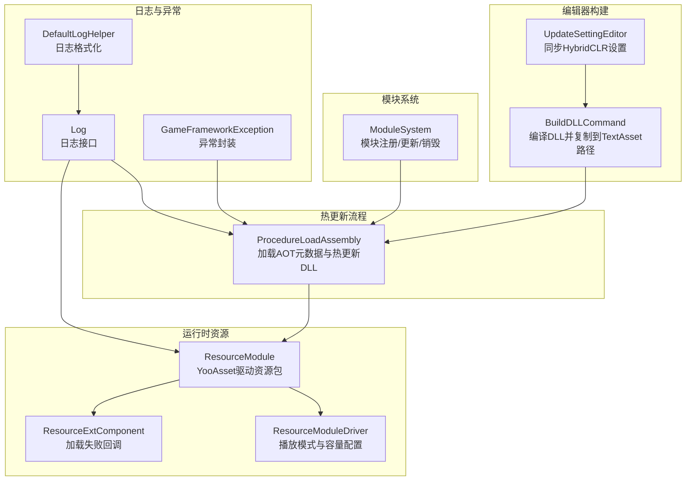
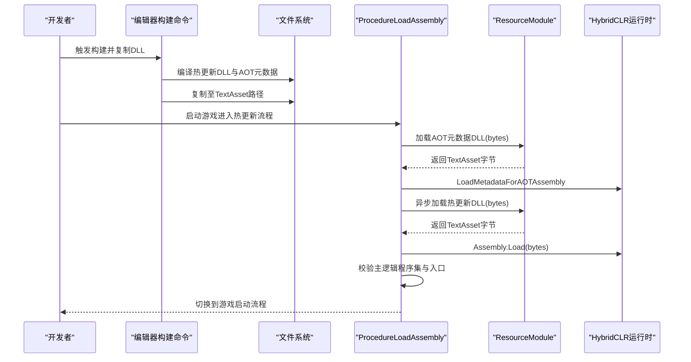
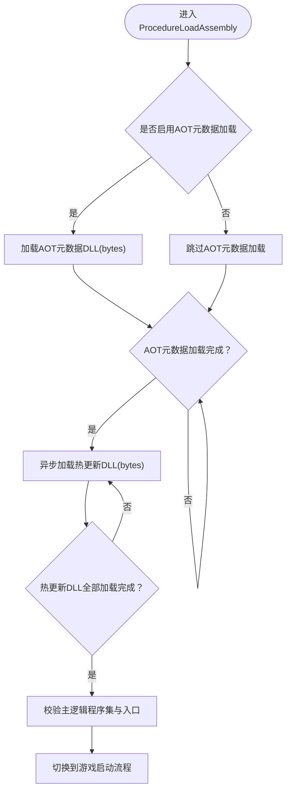
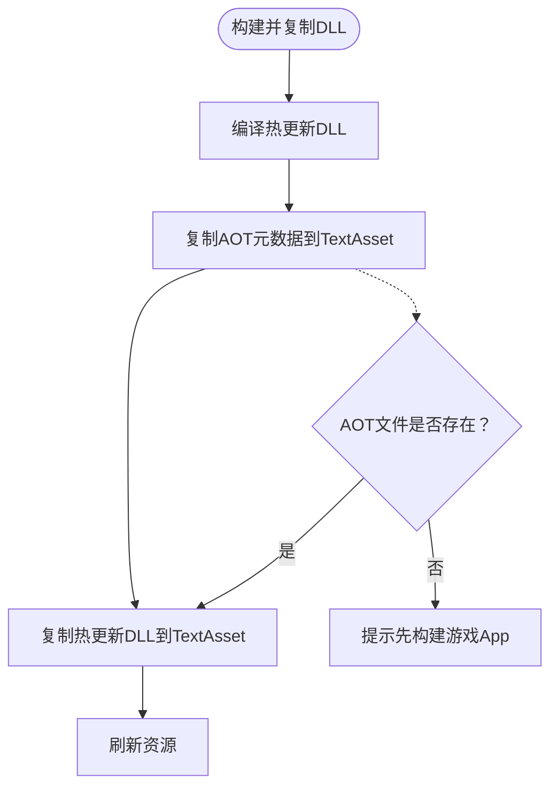
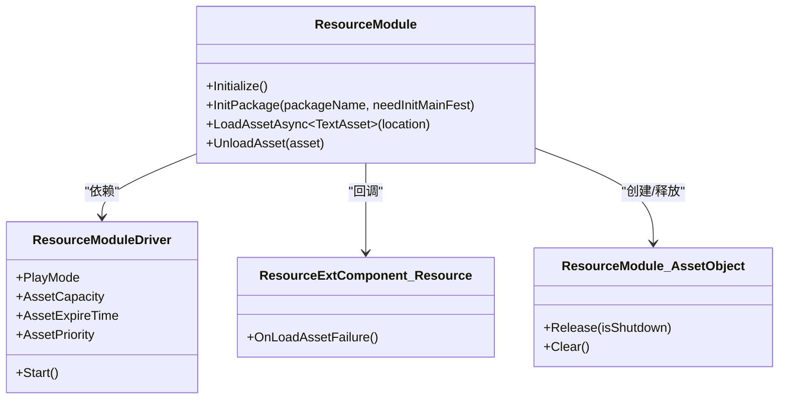
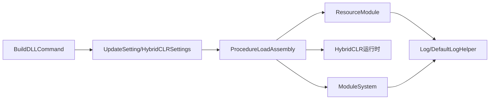

# 热更新问题排查

<cite>
**本文档引用的文件**
- [ProcedureLoadAssembly.cs](file://Assets/GameScripts/Procedure/ProcedureLoadAssembly.cs)
- [BuildDLLCommand.cs](file://Assets/TEngine/Editor/HybridCLR/BuildDLLCommand.cs)
- [UpdateSettingEditor.cs](file://Assets/TEngine/Editor/Utility/UpdateSettingEditor.cs)
- [UpdateSetting.asset](file://Assets/TEngine/Settings/UpdateSetting.asset)
- [HybridCLRSettings.asset](file://ProjectSettings/HybridCLRSettings.asset)
- [ModuleSystem.cs](file://Assets/TEngine/Runtime/Core/ModuleSystem.cs)
- [ResourceModule.cs](file://Assets/TEngine/Runtime/Core/Utility/ResourceModule.cs)
- [ResourceModule.AssetObject.cs](file://Assets/TEngine/Runtime/Module/ResourceModule/ResourceModule.AssetObject.cs)
- [ResourceExtComponent.Resource.cs](file://Assets/TEngine/Runtime/Module/ResourceModule/Extension/ResourceExtComponent.Resource.cs)
- [ResourceModuleDriver.cs](file://Assets/TEngine/Runtime/Module/ResourceModule/ResourceModuleDriver.cs)
- [Log.cs](file://Assets/TEngine/Runtime/Core/Log/Log.cs)
- [DefaultLogHelper.cs](file://Assets/TEngine/Runtime/Core/Utility/DefaultHelper/DefaultLogHelper.cs)
- [GameFrameworkException.cs](file://Assets/TEngine/Runtime/Core/Utility/GameFrameworkException.cs)
</cite>

## 目录
1. [简介](#简介)
2. [项目结构](#项目结构)
3. [核心组件](#核心组件)
4. [架构总览](#架构总览)
5. [详细组件分析](#详细组件分析)
6. [依赖关系分析](#依赖关系分析)
7. [性能考量](#性能考量)
8. [故障排除指南](#故障排除指南)
9. [结论](#结论)
10. [附录](#附录)

## 简介
本指南聚焦于TEngine框架的热更新系统，围绕HybridCLR兼容性、资源管理与模块系统三类问题，提供可操作的诊断步骤、常见错误解读与修复方案，并给出预防性措施与最佳实践。读者可据此快速定位并解决热更新编译错误、运行时异常、版本不匹配、资源加载失败、内存泄漏以及模块注册/依赖冲突等典型问题。

## 项目结构
TEngine的热更新体系由以下关键部分组成：
- 热更新流程控制：在启动流程中加载AOT元数据与热更新DLL，随后初始化主逻辑入口。
- 编辑器构建与打包：负责编译DLL、复制AOT与热更新DLL至StreamingAssets/TextAsset路径，供运行时加载。
- 运行时资源系统：通过YooAsset驱动资源包初始化与加载，支持编辑器模拟、单机离线、在线主机等多种模式。
- 模块系统：统一管理各功能模块生命周期与依赖注入，提供注册、更新与销毁机制。
- 日志与异常：统一的日志输出与异常封装，便于定位问题根因。

**图表来源**
- [ProcedureLoadAssembly.cs:42-122](file://Assets/GameScripts/Procedure/ProcedureLoadAssembly.cs#L42-L122)
- [BuildDLLCommand.cs:86-134](file://Assets/TEngine/Editor/HybridCLR/BuildDLLCommand.cs#L86-L134)
- [UpdateSettingEditor.cs:40-106](file://Assets/TEngine/Editor/Utility/UpdateSettingEditor.cs#L40-L106)
- [ResourceModule.cs:119-200](file://Assets/TEngine/Runtime/Core/Utility/ResourceModule.cs#L119-L200)
- [ResourceModuleDriver.cs:236-252](file://Assets/TEngine/Runtime/Module/ResourceModule/ResourceModuleDriver.cs#L236-L252)
- [ResourceExtComponent.Resource.cs:41-42](file://Assets/TEngine/Runtime/Module/ResourceModule/Extension/ResourceExtComponent.Resource.cs#L41-L42)
- [ModuleSystem.cs:68-141](file://Assets/TEngine/Runtime/Core/ModuleSystem.cs#L68-L141)
- [Log.cs:18-210](file://Assets/TEngine/Runtime/Core/Log/Log.cs#L18-L210)
- [DefaultLogHelper.cs:103-136](file://Assets/TEngine/Runtime/Core/Utility/DefaultHelper/DefaultLogHelper.cs#L103-L136)
- [GameFrameworkException.cs:10-49](file://Assets/TEngine/Runtime/Core/Utility/GameFrameworkException.cs#L10-L49)

**章节来源**
- [ProcedureLoadAssembly.cs:42-122](file://Assets/GameScripts/Procedure/ProcedureLoadAssembly.cs#L42-L122)
- [BuildDLLCommand.cs:86-134](file://Assets/TEngine/Editor/HybridCLR/BuildDLLCommand.cs#L86-L134)
- [UpdateSettingEditor.cs:40-106](file://Assets/TEngine/Editor/Utility/UpdateSettingEditor.cs#L40-L106)
- [ResourceModule.cs:119-200](file://Assets/TEngine/Runtime/Core/Utility/ResourceModule.cs#L119-L200)
- [ResourceModuleDriver.cs:236-252](file://Assets/TEngine/Runtime/Module/ResourceModule/ResourceModuleDriver.cs#L236-L252)
- [ResourceExtComponent.Resource.cs:41-42](file://Assets/TEngine/Runtime/Module/ResourceModule/Extension/ResourceExtComponent.Resource.cs#L41-L42)
- [ModuleSystem.cs:68-141](file://Assets/TEngine/Runtime/Core/ModuleSystem.cs#L68-L141)
- [Log.cs:18-210](file://Assets/TEngine/Runtime/Core/Log/Log.cs#L18-L210)
- [DefaultLogHelper.cs:103-136](file://Assets/TEngine/Runtime/Core/Utility/DefaultHelper/DefaultLogHelper.cs#L103-L136)
- [GameFrameworkException.cs:10-49](file://Assets/TEngine/Runtime/Core/Utility/GameFrameworkException.cs#L10-L49)

## 核心组件
- 热更新加载流程（ProcedureLoadAssembly）
  - 负责加载AOT元数据与热更新DLL，校验主逻辑程序集与入口方法，完成后切换到游戏启动流程。
  - 关键点：AOT元数据加载、热更新DLL加载、主逻辑入口校验、资源卸载。
- 编辑器构建命令（BuildDLLCommand）
  - 编译DLL、复制AOT与热更新DLL到TextAsset路径，支持混淆场景下的拷贝策略。
  - 关键点：目标平台选择、AOT DLL存在性检查、复制后刷新资源。
- 更新设置编辑器（UpdateSettingEditor）
  - 同步UpdateSetting中的热更新与AOT元数据配置到HybridCLRSettings，触发保存与资源刷新。
  - 关键点：变更检测、设置写入、保存与刷新。
- 运行时资源系统（ResourceModule/ResourceModuleDriver）
  - 初始化YooAsset、设置播放模式、资源包与对象池配置；提供加载失败回调与资源对象释放。
  - 关键点：播放模式识别、初始化参数、失败回调、资源句柄释放。
- 模块系统（ModuleSystem）
  - 统一模块注册、更新与销毁，支持按优先级排序与脏标记重建执行列表。
  - 关键点：接口类型解析、模块创建、更新队列构建。
- 日志与异常（Log/DefaultLogHelper/GameFrameworkException）
  - 提供多级别日志输出、颜色化格式化、异常封装，便于问题定位与上报。

**章节来源**
- [ProcedureLoadAssembly.cs:42-122](file://Assets/GameScripts/Procedure/ProcedureLoadAssembly.cs#L42-L122)
- [BuildDLLCommand.cs:86-134](file://Assets/TEngine/Editor/HybridCLR/BuildDLLCommand.cs#L86-L134)
- [UpdateSettingEditor.cs:40-106](file://Assets/TEngine/Editor/Utility/UpdateSettingEditor.cs#L40-L106)
- [ResourceModule.cs:119-200](file://Assets/TEngine/Runtime/Core/Utility/ResourceModule.cs#L119-L200)
- [ResourceModuleDriver.cs:236-252](file://Assets/TEngine/Runtime/Module/ResourceModule/ResourceModuleDriver.cs#L236-L252)
- [ModuleSystem.cs:68-141](file://Assets/TEngine/Runtime/Core/ModuleSystem.cs#L68-L141)
- [Log.cs:18-210](file://Assets/TEngine/Runtime/Core/Log/Log.cs#L18-L210)
- [DefaultLogHelper.cs:103-136](file://Assets/TEngine/Runtime/Core/Utility/DefaultHelper/DefaultLogHelper.cs#L103-L136)
- [GameFrameworkException.cs:10-49](file://Assets/TEngine/Runtime/Core/Utility/GameFrameworkException.cs#L10-L49)

## 架构总览
下图展示热更新从编辑器构建到运行时加载的关键交互：

**图表来源**
- [BuildDLLCommand.cs:104-134](file://Assets/TEngine/Editor/HybridCLR/BuildDLLCommand.cs#L104-L134)
- [ProcedureLoadAssembly.cs:50-122](file://Assets/GameScripts/Procedure/ProcedureLoadAssembly.cs#L50-L122)
- [ResourceModule.cs:119-200](file://Assets/TEngine/Runtime/Core/Utility/ResourceModule.cs#L119-L200)

## 详细组件分析

### 热更新加载流程（ProcedureLoadAssembly）
- AOT元数据加载
  - 仅在非编辑器环境下加载，避免重复加载。
  - 从UpdateSetting中读取AOTMetaAssemblies列表，逐个加载并调用LoadMetadataForAOTAssembly。
- 热更新DLL加载
  - 通过ResourceModule异步加载每个热更新DLL的TextAsset.bytes。
  - 使用Assembly.Load加载为程序集，并收集主逻辑程序集与热更新集合。
- 主逻辑入口校验
  - 查找GameApp类型与Entrance方法，传入热更新程序集列表作为参数。
- 资源卸载
  - 每次加载完成即调用资源模块卸载，避免内存累积。

**图表来源**
- [ProcedureLoadAssembly.cs:50-122](file://Assets/GameScripts/Procedure/ProcedureLoadAssembly.cs#L50-L122)

**章节来源**
- [ProcedureLoadAssembly.cs:50-122](file://Assets/GameScripts/Procedure/ProcedureLoadAssembly.cs#L50-L122)

### 编辑器构建与复制（BuildDLLCommand）
- 功能职责
  - 编译热更新DLL与AOT元数据，复制到StreamingAssets/TextAsset路径，支持混淆场景。
  - 提供菜单命令：启用/禁用HybridCLR宏、构建并复制DLL。
- 关键流程
  - 编译DLL → 复制AOT元数据 → 复制热更新DLL → 刷新资源。
  - AOT元数据复制前检查文件是否存在，缺失时提示先构建游戏App。
- 混淆支持
  - 若开启混淆，使用混淆输出目录并覆盖原文件，再复制到目标路径。

**图表来源**
- [BuildDLLCommand.cs:104-134](file://Assets/TEngine/Editor/HybridCLR/BuildDLLCommand.cs#L104-L134)

**章节来源**
- [BuildDLLCommand.cs:86-134](file://Assets/TEngine/Editor/HybridCLR/BuildDLLCommand.cs#L86-L134)

### 更新设置同步（UpdateSettingEditor）
- 功能职责
  - 将UpdateSetting中的热更新与AOT元数据列表同步到HybridCLRSettings。
  - 修改后保存设置并刷新资源，确保运行时读取最新配置。
- 关键流程
  - 检测变更 → 写入HybridCLRSettings → 保存与刷新。

**章节来源**
- [UpdateSettingEditor.cs:40-106](file://Assets/TEngine/Editor/Utility/UpdateSettingEditor.cs#L40-L106)

### 运行时资源系统（ResourceModule/ResourceModuleDriver）
- 资源系统初始化
  - 初始化YooAsset，设置时间片与默认包，根据播放模式选择不同初始化参数。
- 播放模式
  - 支持编辑器模拟、单机离线、在线主机三种模式，分别使用不同的文件系统参数。
- 加载失败处理
  - 提供加载失败回调，记录错误信息并进行后续处理。
- 资源对象释放
  - 通过资源对象的Release与Dispose确保句柄正确释放，避免泄漏。

**图表来源**
- [ResourceModule.cs:119-200](file://Assets/TEngine/Runtime/Core/Utility/ResourceModule.cs#L119-L200)
- [ResourceModuleDriver.cs:236-252](file://Assets/TEngine/Runtime/Module/ResourceModule/ResourceModuleDriver.cs#L236-L252)
- [ResourceExtComponent.Resource.cs:41-42](file://Assets/TEngine/Runtime/Module/ResourceModule/Extension/ResourceExtComponent.Resource.cs#L41-L42)
- [ResourceModule.AssetObject.cs:16-57](file://Assets/TEngine/Runtime/Module/ResourceModule/ResourceModule.AssetObject.cs#L16-L57)

**章节来源**
- [ResourceModule.cs:119-200](file://Assets/TEngine/Runtime/Core/Utility/ResourceModule.cs#L119-L200)
- [ResourceModuleDriver.cs:236-252](file://Assets/TEngine/Runtime/Module/ResourceModule/ResourceModuleDriver.cs#L236-L252)
- [ResourceExtComponent.Resource.cs:41-42](file://Assets/TEngine/Runtime/Module/ResourceModule/Extension/ResourceExtComponent.Resource.cs#L41-L42)
- [ResourceModule.AssetObject.cs:16-57](file://Assets/TEngine/Runtime/Module/ResourceModule/ResourceModule.AssetObject.cs#L16-L57)

### 模块系统（ModuleSystem）
- 模块注册与创建
  - 通过接口类型解析模块实现类，创建实例并加入模块映射与更新链表。
- 更新与销毁
  - 按优先级插入更新队列，支持脏标记重建执行列表；关闭时清理所有模块与内存池。
- 错误处理
  - 类型解析失败或创建失败时抛出GameFrameworkException，便于上层捕获。

**章节来源**
- [ModuleSystem.cs:68-141](file://Assets/TEngine/Runtime/Core/ModuleSystem.cs#L68-L141)
- [GameFrameworkException.cs:10-49](file://Assets/TEngine/Runtime/Core/Utility/GameFrameworkException.cs#L10-L49)

## 依赖关系分析
- 热更新流程依赖资源系统进行DLL加载与卸载，依赖HybridCLR运行时进行AOT元数据与程序集加载。
- 编辑器构建命令依赖HybridCLRSettings与UpdateSetting，确保运行时读取的DLL与配置一致。
- 模块系统为热更新流程提供统一的生命周期管理与异常处理能力。
- 日志系统贯穿全流程，提供统一的错误输出与格式化能力。

**图表来源**
- [BuildDLLCommand.cs:86-134](file://Assets/TEngine/Editor/HybridCLR/BuildDLLCommand.cs#L86-L134)
- [UpdateSetting.asset:16-29](file://Assets/TEngine/Settings/UpdateSetting.asset#L16-L29)
- [HybridCLRSettings.asset:20-35](file://ProjectSettings/HybridCLRSettings.asset#L20-L35)
- [ProcedureLoadAssembly.cs:50-122](file://Assets/GameScripts/Procedure/ProcedureLoadAssembly.cs#L50-L122)
- [ResourceModule.cs:119-200](file://Assets/TEngine/Runtime/Core/Utility/ResourceModule.cs#L119-L200)
- [ModuleSystem.cs:68-141](file://Assets/TEngine/Runtime/Core/ModuleSystem.cs#L68-L141)
- [Log.cs:18-210](file://Assets/TEngine/Runtime/Core/Log/Log.cs#L18-L210)
- [DefaultLogHelper.cs:103-136](file://Assets/TEngine/Runtime/Core/Utility/DefaultHelper/DefaultLogHelper.cs#L103-L136)

**章节来源**
- [UpdateSetting.asset:16-29](file://Assets/TEngine/Settings/UpdateSetting.asset#L16-L29)
- [HybridCLRSettings.asset:20-35](file://ProjectSettings/HybridCLRSettings.asset#L20-L35)
- [ProcedureLoadAssembly.cs:50-122](file://Assets/GameScripts/Procedure/ProcedureLoadAssembly.cs#L50-L122)
- [ResourceModule.cs:119-200](file://Assets/TEngine/Runtime/Core/Utility/ResourceModule.cs#L119-L200)
- [ModuleSystem.cs:68-141](file://Assets/TEngine/Runtime/Core/ModuleSystem.cs#L68-L141)
- [Log.cs:18-210](file://Assets/TEngine/Runtime/Core/Log/Log.cs#L18-L210)
- [DefaultLogHelper.cs:103-136](file://Assets/TEngine/Runtime/Core/Utility/DefaultHelper/DefaultLogHelper.cs#L103-L136)

## 性能考量
- 资源加载时间片
  - 通过设置Milliseconds参数控制YooAsset每帧执行的时间切片，平衡加载性能与帧率稳定性。
- 对象池与内存回收
  - 资源对象在Release时释放句柄，避免句柄泄漏；模块关闭时清空内存池与缓存，降低峰值内存。
- 程序集加载策略
  - 采用异步加载与按需卸载，避免一次性加载过多DLL造成卡顿。
- 混淆与AOT元数据
  - 混淆可能影响反射与类型绑定，建议在开发阶段关闭混淆，发布前验证AOT元数据完整性。

[本节为通用指导，无需具体文件分析]

## 故障排除指南

### 一、HybridCLR兼容性问题

#### 1. AOT配置错误
- 现象
  - 运行时提示AOT元数据加载失败或泛型函数缺少native实现，出现解释回退或异常。
- 根因
  - AOT元数据DLL未复制到TextAsset路径，或与构建产物不一致。
- 排查步骤
  - 确认编辑器命令已执行“构建并复制DLL”。
  - 检查AOT元数据列表是否包含mscorlib.dll、System.dll、YooAsset.dll等必要程序集。
  - 确认AOT元数据文件存在于StreamingAssets/TextAsset路径。
- 修复方案
  - 先构建游戏App，再执行“构建并复制DLL”。
  - 在UpdateSetting中补齐AOTMetaAssemblies，保存后触发设置同步。
  - 如使用混淆，确认混淆输出目录与最终复制路径一致。
- 预防措施
  - 固定AOT元数据清单，避免遗漏关键程序集。
  - 在CI中增加AOT元数据存在性检查。

**章节来源**
- [BuildDLLCommand.cs:136-156](file://Assets/TEngine/Editor/HybridCLR/BuildDLLCommand.cs#L136-L156)
- [UpdateSetting.asset:19-26](file://Assets/TEngine/Settings/UpdateSetting.asset#L19-L26)
- [HybridCLRSettings.asset:27-35](file://ProjectSettings/HybridCLRSettings.asset#L27-L35)
- [ProcedureLoadAssembly.cs:224-292](file://Assets/GameScripts/Procedure/ProcedureLoadAssembly.cs#L224-L292)

#### 2. 程序集加载失败
- 现象
  - 热更新DLL加载后无法Assembly.Load，抛出异常或类型找不到。
- 根因
  - DLL未复制到TextAsset路径、扩展名不匹配、DLL版本不一致。
- 排查步骤
  - 检查UpdateSetting中的HotUpdateAssemblies与AssemblyTextAssetPath。
  - 确认TextAsset路径下存在对应.dll.bytes文件。
  - 校验DLL编译目标平台与运行平台一致。
- 修复方案
  - 重新执行“构建并复制DLL”，确保复制成功。
  - 在UpdateSetting中核对程序集名称与扩展名。
  - 清理旧DLL，重新编译并复制。
- 预防措施
  - 在构建脚本中增加文件存在性校验。
  - 使用固定命名规范，避免大小写与扩展名差异。

**章节来源**
- [UpdateSetting.asset:16-29](file://Assets/TEngine/Settings/UpdateSetting.asset#L16-L29)
- [BuildDLLCommand.cs:158-173](file://Assets/TEngine/Editor/HybridCLR/BuildDLLCommand.cs#L158-L173)
- [ProcedureLoadAssembly.cs:185-218](file://Assets/GameScripts/Procedure/ProcedureLoadAssembly.cs#L185-L218)

#### 3. 类型反射异常
- 现象
  - 通过Type.GetType或反射获取类型失败，或调用Entrance方法时报错。
- 根因
  - 主逻辑程序集缺失、类型名不匹配、入口方法签名不一致。
- 排查步骤
  - 确认LogicMainDllName与实际主逻辑DLL一致。
  - 检查GameApp类型与Entrance方法是否存在。
  - 核对热更新程序集集合是否完整。
- 修复方案
  - 在UpdateSetting中修正LogicMainDllName。
  - 确保GameApp与Entrance方法签名符合约定。
  - 补齐缺失的热更新程序集。
- 预防措施
  - 在构建后进行最小化回归测试，验证类型与入口可用性。

**章节来源**
- [UpdateSetting.asset:27-28](file://Assets/TEngine/Settings/UpdateSetting.asset#L27-L28)
- [ProcedureLoadAssembly.cs:124-150](file://Assets/GameScripts/Procedure/ProcedureLoadAssembly.cs#L124-L150)

### 二、资源管理问题

#### 1. 资源加载失败
- 现象
  - 热更新DLL或AOT元数据加载失败，日志显示加载状态异常。
- 根因
  - 资源路径错误、资源包未初始化、播放模式不匹配。
- 排查步骤
  - 检查ResourceModuleDriver的PlayMode与初始化参数。
  - 确认资源包初始化状态与失败次数。
  - 核对资源路径与扩展名。
- 修复方案
  - 切换到正确的播放模式（编辑器模拟/离线/在线）。
  - 重新初始化资源包，确保默认包创建成功。
  - 修正资源路径与扩展名，确保与UpdateSetting一致。
- 预防措施
  - 在初始化阶段增加资源包状态检查与重试逻辑。

**章节来源**
- [ResourceModuleDriver.cs:236-252](file://Assets/TEngine/Runtime/Module/ResourceModule/ResourceModuleDriver.cs#L236-L252)
- [ResourceModule.cs:140-200](file://Assets/TEngine/Runtime/Core/Utility/ResourceModule.cs#L140-L200)
- [ResourceExtComponent.Resource.cs:41-42](file://Assets/TEngine/Runtime/Module/ResourceModule/Extension/ResourceExtComponent.Resource.cs#L41-L42)

#### 2. 内存泄漏
- 现象
  - 长时间运行后内存持续增长，资源句柄未释放。
- 根因
  - 资源对象未正确释放，或未调用UnloadAsset。
- 排查步骤
  - 检查资源对象的Release与Dispose调用。
  - 确认每次加载后都调用了UnloadAsset。
- 修复方案
  - 在加载回调中确保调用UnloadAsset。
  - 在模块关闭时清空内存池与缓存。
- 预防措施
  - 建立资源加载/卸载配对检查，引入单元测试验证释放路径。

**章节来源**
- [ResourceModule.AssetObject.cs:46-57](file://Assets/TEngine/Runtime/Module/ResourceModule/ResourceModule.AssetObject.cs#L46-L57)
- [ModuleSystem.cs:47-60](file://Assets/TEngine/Runtime/Core/ModuleSystem.cs#L47-L60)

### 三、模块系统问题

#### 1. 模块注册失败
- 现象
  - 模块类型解析失败，抛出GameFrameworkException。
- 根因
  - 接口类型不是接口、模块实现类不存在或构造失败。
- 排查步骤
  - 确认传入的是接口类型而非具体类。
  - 检查模块实现类的命名空间与程序集是否正确。
- 修复方案
  - 使用RegisterModule<T>传入接口类型。
  - 确保模块实现类可被Type.GetType解析。
- 预防措施
  - 在模块注册处增加类型有效性检查与日志输出。

**章节来源**
- [ModuleSystem.cs:68-141](file://Assets/TEngine/Runtime/Core/ModuleSystem.cs#L68-L141)
- [GameFrameworkException.cs:10-49](file://Assets/TEngine/Runtime/Core/Utility/GameFrameworkException.cs#L10-L49)

#### 2. 依赖冲突
- 现象
  - 模块更新顺序异常，或某些模块未按预期初始化。
- 根因
  - 模块优先级设置不当，导致更新队列顺序错误。
- 排查步骤
  - 检查模块优先级设置与插入位置。
  - 确认脏标记重建执行列表的触发时机。
- 修复方案
  - 调整模块优先级，确保依赖模块先于使用者初始化。
  - 在模块创建后及时触发BuildExecuteList。
- 预防措施
  - 建立模块依赖图，定期审查优先级与依赖关系。

**章节来源**
- [ModuleSystem.cs:143-194](file://Assets/TEngine/Runtime/Core/ModuleSystem.cs#L143-L194)

### 四、版本不匹配与编译错误

- 版本不匹配
  - 现象：运行时类型缺失、方法签名不一致。
  - 排查：确认编辑器与运行时使用的DLL版本一致。
  - 修复：统一构建目标平台，重新复制DLL。
- 编译错误
  - 现象：编译失败或符号缺失。
  - 排查：检查宏定义与HybridCLR开关状态。
  - 修复：启用/禁用相应宏，重新编译并复制。

**章节来源**
- [BuildDLLCommand.cs:21-58](file://Assets/TEngine/Editor/HybridCLR/BuildDLLCommand.cs#L21-L58)
- [UpdateSettingEditor.cs:40-106](file://Assets/TEngine/Editor/Utility/UpdateSettingEditor.cs#L40-L106)

## 结论
TEngine的热更新系统通过清晰的流程控制、完善的编辑器构建与运行时资源管理，实现了稳定的热更新能力。针对HybridCLR兼容性、资源管理与模块系统问题，建议遵循“先构建后加载”的原则，严格校验AOT元数据与DLL清单，完善资源加载/卸载与模块注册的检查机制，并利用日志系统进行问题定位。通过上述实践，可显著降低热更新过程中的异常风险并提升稳定性。

[本节为总结，无需具体文件分析]

## 附录

### 常见错误信息与定位
- “Main logic assembly missing”
  - 定位：主逻辑程序集缺失或LogicMainDllName不匹配。
  - 处理：核对UpdateSetting与实际DLL文件。
- “Main logic type 'GameMain' missing”
  - 定位：GameApp类型不存在。
  - 处理：确保主逻辑DLL包含GameApp类型。
- “Main logic entry method 'Entrance' missing”
  - 定位：Entrance方法签名不一致。
  - 处理：修正方法签名与参数。
- “LoadMetadataForAOTAssembly: ... ret: ...”
  - 定位：AOT元数据加载错误码。
  - 处理：检查AOT元数据文件与构建产物一致性。
- “Resource is invalid.” / “Resource Manager is invalid.”
  - 定位：资源句柄或资源模块为空。
  - 处理：检查资源包初始化与模块获取。

**章节来源**
- [ProcedureLoadAssembly.cs:130-150](file://Assets/GameScripts/Procedure/ProcedureLoadAssembly.cs#L130-L150)
- [ResourceModule.AssetObject.cs:18-26](file://Assets/TEngine/Runtime/Module/ResourceModule/ResourceModule.AssetObject.cs#L18-L26)
- [Log.cs:18-210](file://Assets/TEngine/Runtime/Core/Log/Log.cs#L18-L210)