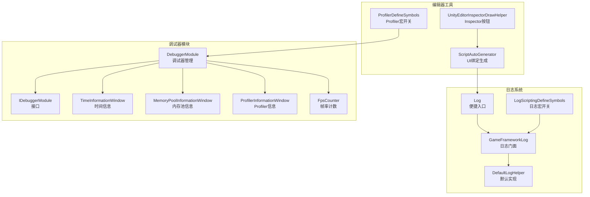
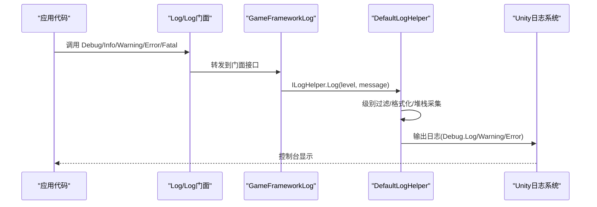
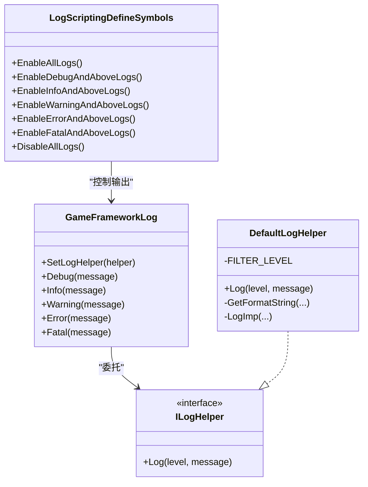
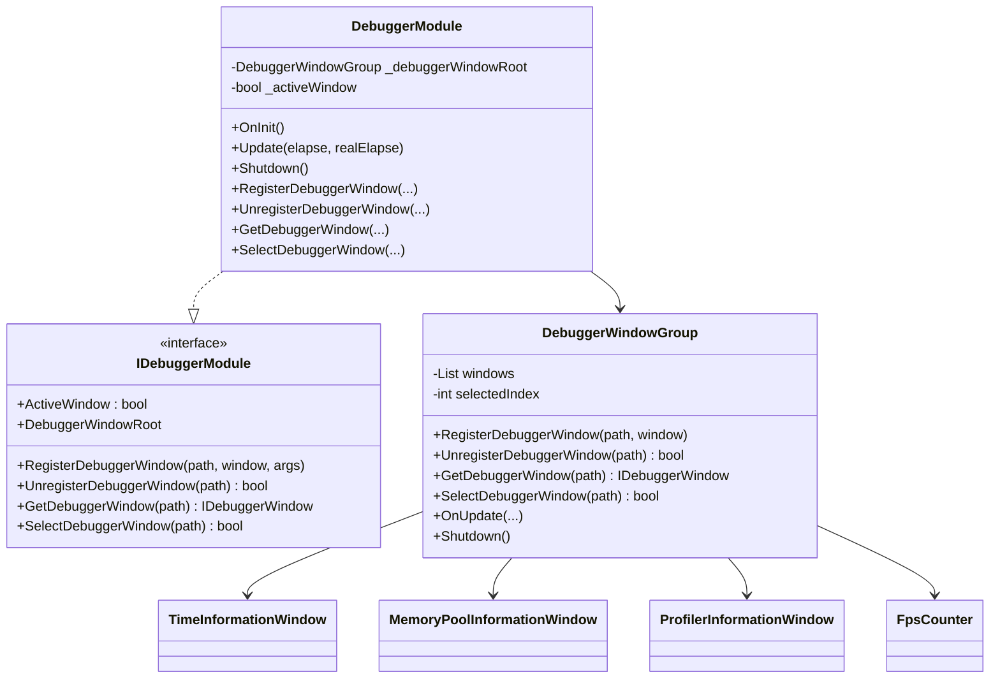
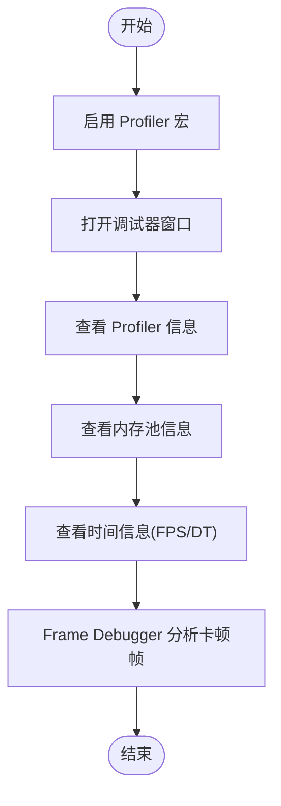
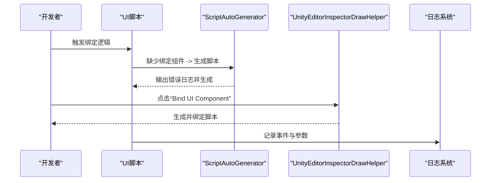
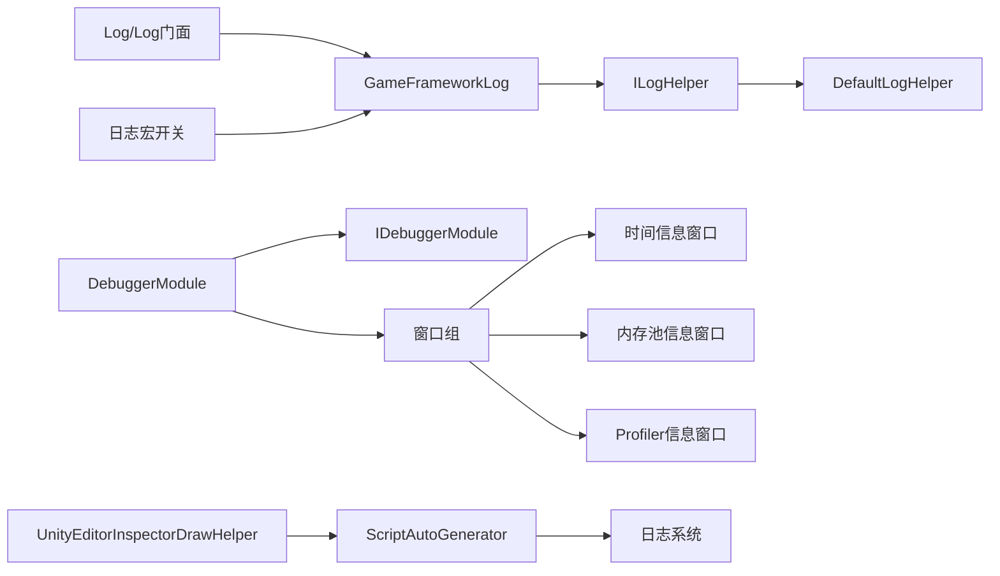

# 调试技巧指南

<cite>
**本文档引用的文件**
- [GameFrameworkLog.cs](file://Assets/TEngine/Runtime/Core/Log/GameFrameworkLog.cs)
- [Log.cs](file://Assets/TEngine/Runtime/Core/Log/Log.cs)
- [DefaultLogHelper.cs](file://Assets/TEngine/Runtime/Core/Utility/DefaultHelper/DefaultLogHelper.cs)
- [LogScriptingDefineSymbols.cs](file://Assets/TEngine/Editor/DefineSymbols/LogScriptingDefineSymbols.cs)
- [ProfilerDefineSymbols.cs](file://Assets/TEngine/Editor/DefineSymbols/ProfilerDefineSymbols.cs)
- [DebuggerModule.cs](file://Assets/TEngine/Runtime/Module/DebugerModule/DebuggerModule.cs)
- [IDebuggerModule.cs](file://Assets/TEngine/Runtime/Module/DebugerModule/IDebuggerModule.cs)
- [DebuggerModule.MemoryPoolInformationWindow.cs](file://Assets/TEngine/Runtime/Module/DebugerModule/Component/DebuggerModule.MemoryPoolInformationWindow.cs)
- [DebuggerModule.ProfilerInformationWindow.cs](file://Assets/TEngine/Runtime/Module/DebugerModule/Component/DebuggerModule.ProfilerInformationWindow.cs)
- [DebuggerModule.TimeInformationWindow.cs](file://Assets/TEngine/Runtime/Module/DebugerModule/Component/DebuggerModule.TimeInformationWindow.cs)
- [DebuggerComponent.FpsCounter.cs](file://Assets/TEngine/Runtime/Module/DebugerModule/DebuggerComponent.FpsCounter.cs)
- [MemoryPool.cs](file://Assets/TEngine/Runtime/Core/MemoryPool/MemoryPool.cs)
- [ScriptAutoGenerator.cs](file://Assets/Editor/UIScriptGenerator/ScriptAutoGenerator.cs)
- [UnityEditorInspectorDrawHelper.cs](file://Assets/TEngine/Editor/TEngineSettingsProvider/UnityEditorInspectorDrawHelper.cs)
- [GameFrameworkException.cs](file://Assets/TEngine/Runtime/Core/Utility/GameFrameworkException.cs)
</cite>

## 目录
1. [简介](#简介)
2. [项目结构](#项目结构)
3. [核心组件](#核心组件)
4. [架构总览](#架构总览)
5. [详细组件分析](#详细组件分析)
6. [依赖关系分析](#依赖关系分析)
7. [性能考虑](#性能考虑)
8. [故障排查指南](#故障排查指南)
9. [结论](#结论)
10. [附录](#附录)

## 简介
本指南面向使用 TEngine 框架的开发者，系统性介绍如何高效地进行调试工作。内容覆盖日志系统的使用（级别选择、输出配置、自定义格式）、断点调试技巧（关键节点设置、变量观察、调用栈分析）、性能分析工具（Profiler 面板、Memory Profiler、Frame Debugger）以及常见调试场景（模块初始化失败、UI 组件绑定错误、事件回调异常）的处理方法，并总结调试效率提升的最佳实践。

## 项目结构
TEngine 的调试相关能力主要分布在以下区域：
- 日志系统：核心日志门面与默认实现、编辑器侧日志跳转与过滤
- 调试器模块：调试器窗口注册与更新、时间/内存池/Profiler 等信息窗口
- 编辑器宏定义：日志与 Profiler 宏开关，便于按需启用/禁用
- UI 绑定与编辑器辅助：自动绑定生成与 Inspector 辅助按钮
- 异常与错误处理：统一异常类型与错误日志

**图示来源**
- [GameFrameworkLog.cs](file://Assets/TEngine/Runtime/Core/Log/GameFrameworkLog.cs)
- [DefaultLogHelper.cs](file://Assets/TEngine/Runtime/Core/Utility/DefaultHelper/DefaultLogHelper.cs)
- [Log.cs](file://Assets/TEngine/Runtime/Core/Log/Log.cs)
- [LogScriptingDefineSymbols.cs](file://Assets/TEngine/Editor/DefineSymbols/LogScriptingDefineSymbols.cs)
- [DebuggerModule.cs](file://Assets/TEngine/Runtime/Module/DebugerModule/DebuggerModule.cs)
- [IDebuggerModule.cs](file://Assets/TEngine/Runtime/Module/DebugerModule/IDebuggerModule.cs)
- [DebuggerModule.TimeInformationWindow.cs](file://Assets/TEngine/Runtime/Module/DebugerModule/Component/DebuggerModule.TimeInformationWindow.cs)
- [DebuggerModule.MemoryPoolInformationWindow.cs](file://Assets/TEngine/Runtime/Module/DebugerModule/Component/DebuggerModule.MemoryPoolInformationWindow.cs)
- [DebuggerModule.ProfilerInformationWindow.cs](file://Assets/TEngine/Runtime/Module/DebugerModule/Component/DebuggerModule.ProfilerInformationWindow.cs)
- [DebuggerComponent.FpsCounter.cs](file://Assets/TEngine/Runtime/Module/DebugerModule/DebuggerComponent.FpsCounter.cs)
- [ProfilerDefineSymbols.cs](file://Assets/TEngine/Editor/DefineSymbols/ProfilerDefineSymbols.cs)
- [ScriptAutoGenerator.cs](file://Assets/Editor/UIScriptGenerator/ScriptAutoGenerator.cs)
- [UnityEditorInspectorDrawHelper.cs](file://Assets/TEngine/Editor/TEngineSettingsProvider/UnityEditorInspectorDrawHelper.cs)

**章节来源**
- [GameFrameworkLog.cs](file://Assets/TEngine/Runtime/Core/Log/GameFrameworkLog.cs)
- [DefaultLogHelper.cs](file://Assets/TEngine/Runtime/Core/Utility/DefaultHelper/DefaultLogHelper.cs)
- [Log.cs](file://Assets/TEngine/Runtime/Core/Log/Log.cs)
- [LogScriptingDefineSymbols.cs](file://Assets/TEngine/Editor/DefineSymbols/LogScriptingDefineSymbols.cs)
- [ProfilerDefineSymbols.cs](file://Assets/TEngine/Editor/DefineSymbols/ProfilerDefineSymbols.cs)
- [DebuggerModule.cs](file://Assets/TEngine/Runtime/Module/DebugerModule/DebuggerModule.cs)
- [IDebuggerModule.cs](file://Assets/TEngine/Runtime/Module/DebugerModule/IDebuggerModule.cs)
- [DebuggerModule.TimeInformationWindow.cs](file://Assets/TEngine/Runtime/Module/DebugerModule/Component/DebuggerModule.TimeInformationWindow.cs)
- [DebuggerModule.MemoryPoolInformationWindow.cs](file://Assets/TEngine/Runtime/Module/DebugerModule/Component/DebuggerModule.MemoryPoolInformationWindow.cs)
- [DebuggerModule.ProfilerInformationWindow.cs](file://Assets/TEngine/Runtime/Module/DebugerModule/Component/DebuggerModule.ProfilerInformationWindow.cs)
- [DebuggerComponent.FpsCounter.cs](file://Assets/TEngine/Runtime/Module/DebugerModule/DebuggerComponent.FpsCounter.cs)
- [ScriptAutoGenerator.cs](file://Assets/Editor/UIScriptGenerator/ScriptAutoGenerator.cs)
- [UnityEditorInspectorDrawHelper.cs](file://Assets/TEngine/Editor/TEngineSettingsProvider/UnityEditorInspectorDrawHelper.cs)

## 核心组件
- 日志系统
  - 门面层：提供多参数重载的 Debug/Info/Warning/Error/Fatal 接口，统一路由至 ILogHelper 实现
  - 默认实现：支持彩色日志、级别过滤、堆栈采集（Warning 及以上）
  - 编辑器集成：点击日志可跳转到具体调用源码位置
- 调试器模块
  - 调试器管理：负责窗口注册、激活状态、每帧更新
  - 时间信息：显示 deltaTime、frameCount、最大帧时长等
  - 内存池信息：统计各类型内存池的 unused/using/acquire/release/add/remove
  - Profiler 信息：Mono/Heap/Totals 等内存指标
  - FPS 计数：按间隔计算平均帧率
- 编辑器宏定义
  - 日志宏：按级别或“及以上”粒度控制日志输出
  - Profiler 宏：启用/禁用 Profiler 相关统计与输出
- UI 绑定与编辑器辅助
  - 自动绑定生成：在缺少 UIBindComponent 时提示并生成脚本
  - Inspector 按钮：一键绑定 UI 组件

**章节来源**
- [GameFrameworkLog.cs](file://Assets/TEngine/Runtime/Core/Log/GameFrameworkLog.cs)
- [DefaultLogHelper.cs](file://Assets/TEngine/Runtime/Core/Utility/DefaultHelper/DefaultLogHelper.cs)
- [Log.cs](file://Assets/TEngine/Runtime/Core/Log/Log.cs)
- [DebuggerModule.cs](file://Assets/TEngine/Runtime/Module/DebugerModule/DebuggerModule.cs)
- [IDebuggerModule.cs](file://Assets/TEngine/Runtime/Module/DebugerModule/IDebuggerModule.cs)
- [DebuggerModule.TimeInformationWindow.cs](file://Assets/TEngine/Runtime/Module/DebugerModule/Component/DebuggerModule.TimeInformationWindow.cs)
- [DebuggerModule.MemoryPoolInformationWindow.cs](file://Assets/TEngine/Runtime/Module/DebugerModule/Component/DebuggerModule.MemoryPoolInformationWindow.cs)
- [DebuggerModule.ProfilerInformationWindow.cs](file://Assets/TEngine/Runtime/Module/DebugerModule/Component/DebuggerModule.ProfilerInformationWindow.cs)
- [DebuggerComponent.FpsCounter.cs](file://Assets/TEngine/Runtime/Module/DebugerModule/DebuggerComponent.FpsCounter.cs)
- [LogScriptingDefineSymbols.cs](file://Assets/TEngine/Editor/DefineSymbols/LogScriptingDefineSymbols.cs)
- [ProfilerDefineSymbols.cs](file://Assets/TEngine/Editor/DefineSymbols/ProfilerDefineSymbols.cs)
- [ScriptAutoGenerator.cs](file://Assets/Editor/UIScriptGenerator/ScriptAutoGenerator.cs)
- [UnityEditorInspectorDrawHelper.cs](file://Assets/TEngine/Editor/TEngineSettingsProvider/UnityEditorInspectorDrawHelper.cs)

## 架构总览
下图展示日志与调试器模块在运行时的交互关系，以及编辑器宏定义对日志输出的影响。

**图示来源**
- [Log.cs](file://Assets/TEngine/Runtime/Core/Log/Log.cs)
- [GameFrameworkLog.cs](file://Assets/TEngine/Runtime/Core/Log/GameFrameworkLog.cs)
- [DefaultLogHelper.cs](file://Assets/TEngine/Runtime/Core/Utility/DefaultHelper/DefaultLogHelper.cs)

## 详细组件分析

### 日志系统分析
- 日志级别与使用建议
  - Debug：开发阶段高频使用，用于追踪流程与中间状态
  - Info：常规运行信息，确认流程正常推进
  - Warning：潜在问题但不影响运行，需关注
  - Error：错误，影响功能但可恢复
  - Fatal：严重错误，可能导致崩溃或框架异常
- 输出配置与宏控制
  - 通过编辑器菜单启用/禁用“日志宏”，可按“级别及以上”或“精确级别”控制输出
  - 宏定义影响 Conditional 特性，减少发布版本的无效日志开销
- 自定义日志格式
  - 默认实现支持彩色输出与堆栈采集（Warning 及以上）
  - 可替换 ILogHelper 实现以定制格式、输出目标（文件/网络/自定义面板）

**图示来源**
- [GameFrameworkLog.cs](file://Assets/TEngine/Runtime/Core/Log/GameFrameworkLog.cs)
- [DefaultLogHelper.cs](file://Assets/TEngine/Runtime/Core/Utility/DefaultHelper/DefaultLogHelper.cs)
- [LogScriptingDefineSymbols.cs](file://Assets/TEngine/Editor/DefineSymbols/LogScriptingDefineSymbols.cs)

**章节来源**
- [GameFrameworkLog.cs](file://Assets/TEngine/Runtime/Core/Log/GameFrameworkLog.cs)
- [DefaultLogHelper.cs](file://Assets/TEngine/Runtime/Core/Utility/DefaultHelper/DefaultLogHelper.cs)
- [Log.cs](file://Assets/TEngine/Runtime/Core/Log/Log.cs)
- [LogScriptingDefineSymbols.cs](file://Assets/TEngine/Editor/DefineSymbols/LogScriptingDefineSymbols.cs)

### 调试器模块分析
- 调试器管理
  - 支持注册/注销/获取/选中调试器窗口
  - 激活状态下每帧更新窗口树
- 时间信息窗口
  - 展示 deltaTime、maximumDeltaTime、frameCount 等
- 内存池信息窗口
  - 展示各类型内存池的 unused/using/acquire/release/add/remove
- Profiler 信息窗口
  - 展示 Mono/Heap/Totals 等内存指标
- FPS 计数
  - 按设定间隔计算平均帧率

**图示来源**
- [IDebuggerModule.cs](file://Assets/TEngine/Runtime/Module/DebugerModule/IDebuggerModule.cs)
- [DebuggerModule.cs](file://Assets/TEngine/Runtime/Module/DebugerModule/DebuggerModule.cs)
- [DebuggerModule.TimeInformationWindow.cs](file://Assets/TEngine/Runtime/Module/DebugerModule/Component/DebuggerModule.TimeInformationWindow.cs)
- [DebuggerModule.MemoryPoolInformationWindow.cs](file://Assets/TEngine/Runtime/Module/DebugerModule/Component/DebuggerModule.MemoryPoolInformationWindow.cs)
- [DebuggerModule.ProfilerInformationWindow.cs](file://Assets/TEngine/Runtime/Module/DebugerModule/Component/DebuggerModule.ProfilerInformationWindow.cs)
- [DebuggerComponent.FpsCounter.cs](file://Assets/TEngine/Runtime/Module/DebugerModule/DebuggerComponent.FpsCounter.cs)

**章节来源**
- [IDebuggerModule.cs](file://Assets/TEngine/Runtime/Module/DebugerModule/IDebuggerModule.cs)
- [DebuggerModule.cs](file://Assets/TEngine/Runtime/Module/DebugerModule/DebuggerModule.cs)
- [DebuggerModule.TimeInformationWindow.cs](file://Assets/TEngine/Runtime/Module/DebugerModule/Component/DebuggerModule.TimeInformationWindow.cs)
- [DebuggerModule.MemoryPoolInformationWindow.cs](file://Assets/TEngine/Runtime/Module/DebugerModule/Component/DebuggerModule.MemoryPoolInformationWindow.cs)
- [DebuggerModule.ProfilerInformationWindow.cs](file://Assets/TEngine/Runtime/Module/DebugerModule/Component/DebuggerModule.ProfilerInformationWindow.cs)
- [DebuggerComponent.FpsCounter.cs](file://Assets/TEngine/Runtime/Module/DebugerModule/DebuggerComponent.FpsCounter.cs)

### 性能分析工具使用
- Profiler 面板
  - 通过编辑器菜单启用 Profiler 宏，收集内存与 CPU 数据
  - 在调试器中查看 Profiler 信息窗口，关注 Mono/Heap/Totals 指标
- Memory Profiler
  - 使用内存池信息窗口观察对象池使用情况，定位泄漏或抖动
  - 结合 Memory Profiler 工具对比帧间变化
- Frame Debugger
  - 在时间信息窗口中观察 deltaTime、maximumDeltaTime、smoothDeltaTime
  - 使用 FPS 计数器评估帧率稳定性

**图示来源**
- [ProfilerDefineSymbols.cs](file://Assets/TEngine/Editor/DefineSymbols/ProfilerDefineSymbols.cs)
- [DebuggerModule.ProfilerInformationWindow.cs](file://Assets/TEngine/Runtime/Module/DebugerModule/Component/DebuggerModule.ProfilerInformationWindow.cs)
- [DebuggerModule.MemoryPoolInformationWindow.cs](file://Assets/TEngine/Runtime/Module/DebugerModule/Component/DebuggerModule.MemoryPoolInformationWindow.cs)
- [DebuggerModule.TimeInformationWindow.cs](file://Assets/TEngine/Runtime/Module/DebugerModule/Component/DebuggerModule.TimeInformationWindow.cs)
- [DebuggerComponent.FpsCounter.cs](file://Assets/TEngine/Runtime/Module/DebugerModule/DebuggerComponent.FpsCounter.cs)

**章节来源**
- [ProfilerDefineSymbols.cs](file://Assets/TEngine/Editor/DefineSymbols/ProfilerDefineSymbols.cs)
- [DebuggerModule.ProfilerInformationWindow.cs](file://Assets/TEngine/Runtime/Module/DebugerModule/Component/DebuggerModule.ProfilerInformationWindow.cs)
- [DebuggerModule.MemoryPoolInformationWindow.cs](file://Assets/TEngine/Runtime/Module/DebugerModule/Component/DebuggerModule.MemoryPoolInformationWindow.cs)
- [DebuggerModule.TimeInformationWindow.cs](file://Assets/TEngine/Runtime/Module/DebugerModule/Component/DebuggerModule.TimeInformationWindow.cs)
- [DebuggerComponent.FpsCounter.cs](file://Assets/TEngine/Runtime/Module/DebugerModule/DebuggerComponent.FpsCounter.cs)

### 常见调试场景与处理
- 模块初始化失败
  - 使用 Info/Warning/Error/Fatal 记录初始化流程与关键分支
  - 通过调试器时间信息窗口观察初始化阶段的帧时长波动
  - 若出现异常，抛出统一异常类型以便捕获与定位
- UI 组件绑定错误
  - 自动绑定生成会在缺少 UIBindComponent 时给出错误日志并生成脚本
  - Inspector 中添加“Bind UI Component”按钮，一键生成绑定脚本
- 事件回调异常
  - 使用 Warning/Error/Fatal 记录事件触发与参数
  - 编辑器日志跳转功能可快速定位到具体调用源码行

**图示来源**
- [ScriptAutoGenerator.cs](file://Assets/Editor/UIScriptGenerator/ScriptAutoGenerator.cs)
- [UnityEditorInspectorDrawHelper.cs](file://Assets/TEngine/Editor/TEngineSettingsProvider/UnityEditorInspectorDrawHelper.cs)
- [DefaultLogHelper.cs](file://Assets/TEngine/Runtime/Core/Utility/DefaultHelper/DefaultLogHelper.cs)

**章节来源**
- [ScriptAutoGenerator.cs](file://Assets/Editor/UIScriptGenerator/ScriptAutoGenerator.cs)
- [UnityEditorInspectorDrawHelper.cs](file://Assets/TEngine/Editor/TEngineSettingsProvider/UnityEditorInspectorDrawHelper.cs)
- [DefaultLogHelper.cs](file://Assets/TEngine/Runtime/Core/Utility/DefaultHelper/DefaultLogHelper.cs)
- [GameFrameworkException.cs](file://Assets/TEngine/Runtime/Core/Utility/GameFrameworkException.cs)

## 依赖关系分析
- 日志系统
  - Log/Log门面依赖 GameFrameworkLog
  - GameFrameworkLog 依赖 ILogHelper，默认实现为 DefaultLogHelper
  - 编辑器侧通过宏定义控制日志输出
- 调试器模块
  - DebuggerModule 实现 IDebuggerModule，持有窗口组
  - 窗口组包含时间/内存池/Profiler/FPS 等子窗口
- UI 绑定
  - ScriptAutoGenerator 与 Inspector 辅助共同完成绑定生成与一键绑定

**图示来源**
- [Log.cs](file://Assets/TEngine/Runtime/Core/Log/Log.cs)
- [GameFrameworkLog.cs](file://Assets/TEngine/Runtime/Core/Log/GameFrameworkLog.cs)
- [DefaultLogHelper.cs](file://Assets/TEngine/Runtime/Core/Utility/DefaultHelper/DefaultLogHelper.cs)
- [LogScriptingDefineSymbols.cs](file://Assets/TEngine/Editor/DefineSymbols/LogScriptingDefineSymbols.cs)
- [DebuggerModule.cs](file://Assets/TEngine/Runtime/Module/DebugerModule/DebuggerModule.cs)
- [IDebuggerModule.cs](file://Assets/TEngine/Runtime/Module/DebugerModule/IDebuggerModule.cs)
- [DebuggerModule.TimeInformationWindow.cs](file://Assets/TEngine/Runtime/Module/DebugerModule/Component/DebuggerModule.TimeInformationWindow.cs)
- [DebuggerModule.MemoryPoolInformationWindow.cs](file://Assets/TEngine/Runtime/Module/DebugerModule/Component/DebuggerModule.MemoryPoolInformationWindow.cs)
- [DebuggerModule.ProfilerInformationWindow.cs](file://Assets/TEngine/Runtime/Module/DebugerModule/Component/DebuggerModule.ProfilerInformationWindow.cs)
- [ScriptAutoGenerator.cs](file://Assets/Editor/UIScriptGenerator/ScriptAutoGenerator.cs)
- [UnityEditorInspectorDrawHelper.cs](file://Assets/TEngine/Editor/TEngineSettingsProvider/UnityEditorInspectorDrawHelper.cs)

**章节来源**
- [Log.cs](file://Assets/TEngine/Runtime/Core/Log/Log.cs)
- [GameFrameworkLog.cs](file://Assets/TEngine/Runtime/Core/Log/GameFrameworkLog.cs)
- [DefaultLogHelper.cs](file://Assets/TEngine/Runtime/Core/Utility/DefaultHelper/DefaultLogHelper.cs)
- [LogScriptingDefineSymbols.cs](file://Assets/TEngine/Editor/DefineSymbols/LogScriptingDefineSymbols.cs)
- [DebuggerModule.cs](file://Assets/TEngine/Runtime/Module/DebugerModule/DebuggerModule.cs)
- [IDebuggerModule.cs](file://Assets/TEngine/Runtime/Module/DebugerModule/IDebuggerModule.cs)
- [DebuggerModule.TimeInformationWindow.cs](file://Assets/TEngine/Runtime/Module/DebugerModule/Component/DebuggerModule.TimeInformationWindow.cs)
- [DebuggerModule.MemoryPoolInformationWindow.cs](file://Assets/TEngine/Runtime/Module/DebugerModule/Component/DebuggerModule.MemoryPoolInformationWindow.cs)
- [DebuggerModule.ProfilerInformationWindow.cs](file://Assets/TEngine/Runtime/Module/DebugerModule/Component/DebuggerModule.ProfilerInformationWindow.cs)
- [ScriptAutoGenerator.cs](file://Assets/Editor/UIScriptGenerator/ScriptAutoGenerator.cs)
- [UnityEditorInspectorDrawHelper.cs](file://Assets/TEngine/Editor/TEngineSettingsProvider/UnityEditorInspectorDrawHelper.cs)

## 性能考虑
- 日志输出成本
  - 使用“及以上”宏策略减少发布版本日志量
  - Debug/Info 级别适合开发期，Warning 及以上才采集堆栈
- 内存池监控
  - 通过内存池信息窗口观察 unused/using 变化，避免频繁 Acquire/Release 导致 GC 抖动
- 帧时长与 FPS
  - 关注 maximumDeltaTime 与 smoothDeltaTime，定位卡顿帧
  - 使用 FPS 计数器评估优化效果

[本节为通用指导，无需列出具体文件来源]

## 故障排查指南
- 模块初始化失败
  - 步骤：在初始化关键节点输出 Info/Warning，若异常抛出统一异常类型
  - 工具：调试器时间信息窗口观察初始化阶段帧时长
  - 参考：异常类型定义与日志输出
- UI 组件绑定错误
  - 步骤：自动绑定生成会在缺少 UIBindComponent 时输出错误日志并生成脚本；Inspector 添加按钮一键绑定
  - 工具：日志跳转到具体源码行
  - 参考：自动绑定生成与 Inspector 辅助
- 事件回调异常
  - 步骤：在事件回调前后记录关键参数与状态，使用 Warning/Error/Fatal 提升可见性
  - 工具：编辑器日志跳转快速定位
  - 参考：日志格式化与堆栈采集

**章节来源**
- [GameFrameworkException.cs](file://Assets/TEngine/Runtime/Core/Utility/GameFrameworkException.cs)
- [ScriptAutoGenerator.cs](file://Assets/Editor/UIScriptGenerator/ScriptAutoGenerator.cs)
- [UnityEditorInspectorDrawHelper.cs](file://Assets/TEngine/Editor/TEngineSettingsProvider/UnityEditorInspectorDrawHelper.cs)
- [DefaultLogHelper.cs](file://Assets/TEngine/Runtime/Core/Utility/DefaultHelper/DefaultLogHelper.cs)

## 结论
TEngine 的调试体系以“日志+调试器+编辑器宏”为核心，既能在开发期提供丰富的诊断信息，又可通过宏开关在发布版本中保持低开销。配合内存池与 Profiler/Frame Debugger，可系统性地定位性能瓶颈与异常来源。建议在日常开发中养成“分级日志+关键节点记录”的习惯，并结合调试器窗口与编辑器工具形成闭环。

[本节为总结性内容，无需列出具体文件来源]

## 附录
- 快速参考
  - 日志宏开关：通过编辑器菜单启用/禁用“日志宏”，按级别或“及以上”控制输出
  - Profiler 宏开关：启用 Profiler 宏后可在调试器中查看内存与帧率指标
  - UI 绑定：Inspector 中一键绑定 UI 组件，自动补全缺失的绑定脚本
  - 异常类型：统一异常类型便于捕获与集中处理

[本节为补充说明，无需列出具体文件来源]