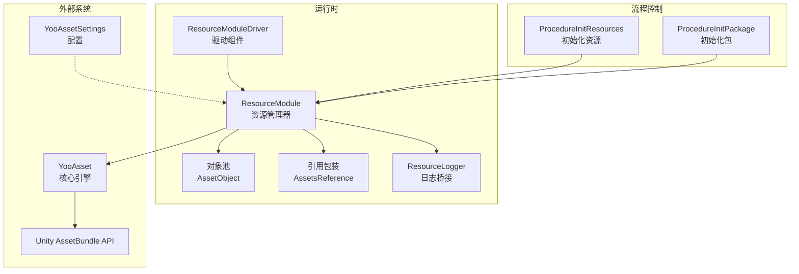
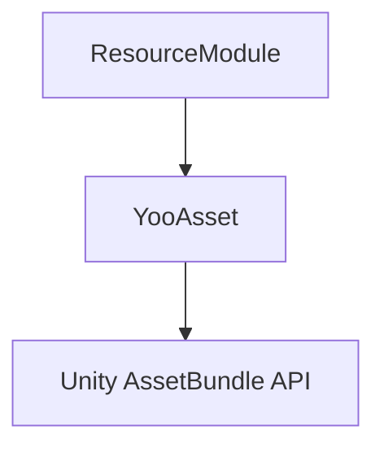
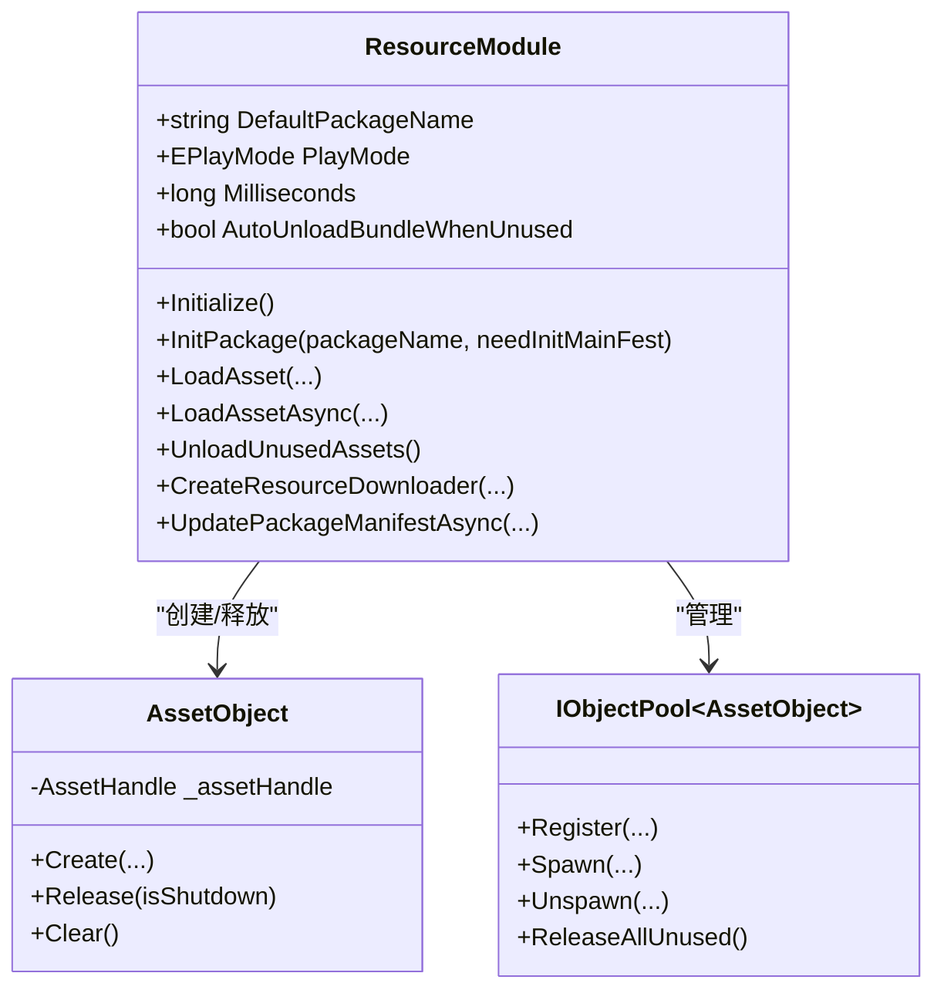
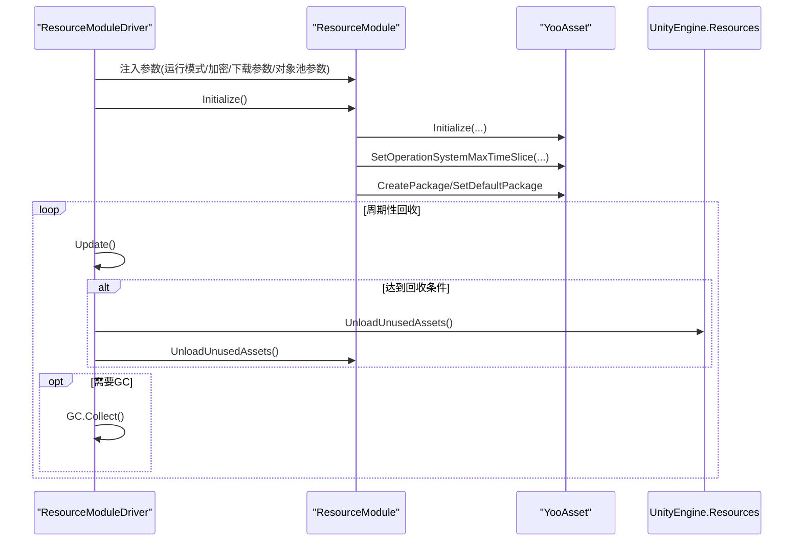
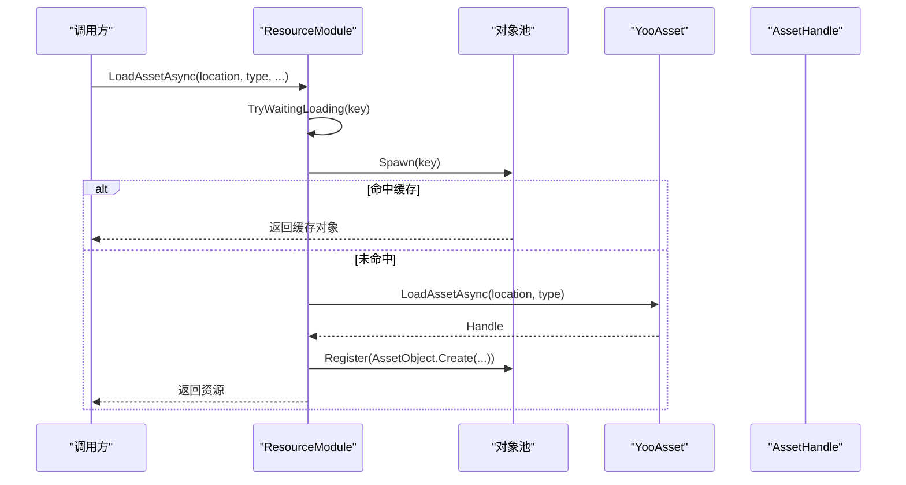
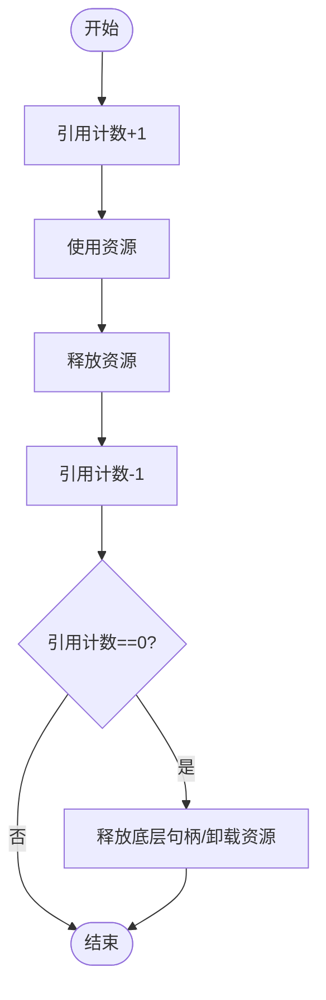
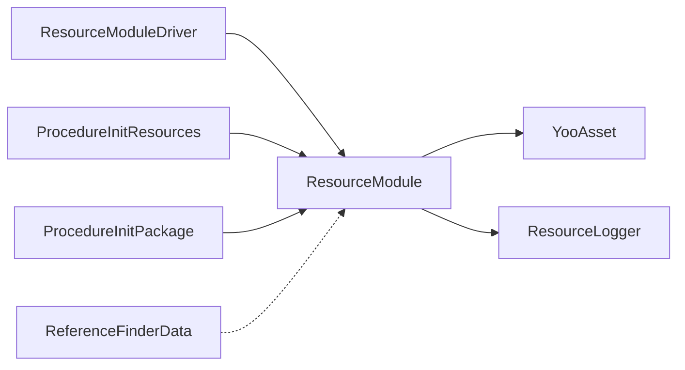

# 资源管理问题排查

<cite>
**本文档引用的文件**
- [ResourceModule.cs](file://Assets/TEngine/Runtime/Module/ResourceModule/ResourceModule.cs)
- [ResourceModule.Pool.cs](file://Assets/TEngine/Runtime/Module/ResourceModule/ResourceModule.Pool.cs)
- [ResourceModule.AssetObject.cs](file://Assets/TEngine/Runtime/Module/ResourceModule/ResourceModule.AssetObject.cs)
- [ResourceModuleDriver.cs](file://Assets/TEngine/Runtime/Module/ResourceModule/ResourceModuleDriver.cs)
- [ResourceLogger.cs](file://Assets/TEngine/Runtime/Module/ResourceModule/ResourceLogger.cs)
- [ProcedureInitResources.cs](file://Assets/GameScripts/Procedure/ProcedureInitResources.cs)
- [ProcedureInitPackage.cs](file://Assets/GameScripts/Procedure/ProcedureInitPackage.cs)
- [YooAssetSettings.asset](file://Assets/TEngine/Settings/Resources/YooAssetSettings.asset)
- [ReferenceFinderData.cs](file://Assets/Editor/ReferenceFinder/ReferenceFinderData.cs)
- [AssetsReference.cs](file://Assets/TEngine/Runtime/Module/ResourceModule/Reference/AssetsReference.cs)
- [systemPatterns.md](file://memory-bank/systemPatterns.md)
</cite>

## 目录
1. [简介](#简介)
2. [项目结构](#项目结构)
3. [核心组件](#核心组件)
4. [架构总览](#架构总览)
5. [详细组件分析](#详细组件分析)
6. [依赖关系分析](#依赖关系分析)
7. [性能考量](#性能考量)
8. [故障排除指南](#故障排除指南)
9. [结论](#结论)
10. [附录](#附录)

## 简介
本指南面向TEngine框架的资源管理系统，聚焦于资源加载失败、内存泄漏、包管理问题的诊断与解决。内容覆盖YooAsset集成问题（包配置错误、资源引用丢失、AB包加载异常）、资源缓存问题（内存占用过高、资源未正确释放）、资源依赖问题（循环依赖、缺失依赖），并提供最佳实践与预防措施，帮助开发者快速定位与修复问题。

## 项目结构
TEngine资源模块围绕YooAsset构建，通过ResourceModule封装资源包管理、加载、缓存与释放；ResourceModuleDriver负责运行时参数注入与周期性资源回收；流程层通过Procedure系列实现资源初始化与下载器创建；编辑器工具提供资源引用扫描与依赖分析。

**图表来源**
- [ResourceModule.cs:119-138](file://Assets/TEngine/Runtime/Module/ResourceModule/ResourceModule.cs#L119-L138)
- [ResourceModuleDriver.cs:236-271](file://Assets/TEngine/Runtime/Module/ResourceModule/ResourceModuleDriver.cs#L236-L271)
- [ProcedureInitResources.cs:18-105](file://Assets/GameScripts/Procedure/ProcedureInitResources.cs#L18-L105)
- [ProcedureInitPackage.cs:69-120](file://Assets/GameScripts/Procedure/ProcedureInitPackage.cs#L69-L120)
- [YooAssetSettings.asset:15-16](file://Assets/TEngine/Settings/Resources/YooAssetSettings.asset#L15-L16)

**章节来源**
- [ResourceModule.cs:119-138](file://Assets/TEngine/Runtime/Module/ResourceModule/ResourceModule.cs#L119-L138)
- [ResourceModuleDriver.cs:236-271](file://Assets/TEngine/Runtime/Module/ResourceModule/ResourceModuleDriver.cs#L236-L271)
- [ProcedureInitResources.cs:18-105](file://Assets/GameScripts/Procedure/ProcedureInitResources.cs#L18-L105)
- [ProcedureInitPackage.cs:69-120](file://Assets/GameScripts/Procedure/ProcedureInitPackage.cs#L69-L120)
- [YooAssetSettings.asset:15-16](file://Assets/TEngine/Settings/Resources/YooAssetSettings.asset#L15-L16)

## 核心组件
- ResourceModule：资源管理器，封装YooAsset初始化、包管理、资源加载与缓存、内存回收等能力。
- ResourceModuleDriver：驱动组件，负责将运行时参数注入ResourceModule，并周期性触发资源回收。
- 对象池与AssetObject：对资源句柄进行统一管理，确保引用计数与释放策略一致。
- AssetsReference：资源引用包装，辅助资源生命周期管理与批量释放。
- 日志桥接ResourceLogger：将YooAsset日志映射至TEngine日志系统。
- 流程层：ProcedureInitResources与ProcedureInitPackage负责资源清单更新与包初始化。

**章节来源**
- [ResourceModule.cs:119-138](file://Assets/TEngine/Runtime/Module/ResourceModule/ResourceModule.cs#L119-L138)
- [ResourceModule.Pool.cs:5-67](file://Assets/TEngine/Runtime/Module/ResourceModule/ResourceModule.Pool.cs#L5-L67)
- [ResourceModule.AssetObject.cs:11-58](file://Assets/TEngine/Runtime/Module/ResourceModule/ResourceModule.AssetObject.cs#L11-L58)
- [ResourceModuleDriver.cs:236-271](file://Assets/TEngine/Runtime/Module/ResourceModule/ResourceModuleDriver.cs#L236-L271)
- [ResourceLogger.cs:1-25](file://Assets/TEngine/Runtime/Module/ResourceModule/ResourceLogger.cs#L1-L25)
- [AssetsReference.cs:100-143](file://Assets/TEngine/Runtime/Module/ResourceModule/Reference/AssetsReference.cs#L100-L143)

## 架构总览
TEngine资源管理采用“包装层 + 引擎层”的分层设计：上层通过ResourceModule统一封装YooAsset接口，下层对接Unity AssetBundle API。系统遵循“引用计数 + 释放策略”的生命周期模型，支持手动与自动释放，配合对象池降低GC压力。

**图表来源**
- [systemPatterns.md:278-303](file://memory-bank/systemPatterns.md#L278-L303)

**章节来源**
- [systemPatterns.md:278-303](file://memory-bank/systemPatterns.md#L278-L303)

## 详细组件分析

### ResourceModule：资源管理器
- 初始化与包管理：根据运行模式（编辑器模拟、单机、主机、WebGL）选择不同的文件系统参数，创建并设置默认包。
- 资源加载：提供同步/异步加载接口，内部通过对象池复用资源句柄，避免重复加载。
- 内存回收：支持按需卸载未使用资源，结合驱动组件周期性触发。
- 下载器与清单：支持创建下载器与更新包清单，适配边玩边下载场景。

**图表来源**
- [ResourceModule.cs:119-138](file://Assets/TEngine/Runtime/Module/ResourceModule/ResourceModule.cs#L119-L138)
- [ResourceModule.Pool.cs:5-67](file://Assets/TEngine/Runtime/Module/ResourceModule/ResourceModule.Pool.cs#L5-L67)
- [ResourceModule.AssetObject.cs:11-58](file://Assets/TEngine/Runtime/Module/ResourceModule/ResourceModule.AssetObject.cs#L11-L58)

**章节来源**
- [ResourceModule.cs:119-138](file://Assets/TEngine/Runtime/Module/ResourceModule/ResourceModule.cs#L119-L138)
- [ResourceModule.cs:692-760](file://Assets/TEngine/Runtime/Module/ResourceModule/ResourceModule.cs#L692-L760)
- [ResourceModule.cs:769-869](file://Assets/TEngine/Runtime/Module/ResourceModule/ResourceModule.cs#L769-L869)
- [ResourceModule.cs:828-920](file://Assets/TEngine/Runtime/Module/ResourceModule/ResourceModule.cs#L828-L920)
- [ResourceModule.cs:1154-1191](file://Assets/TEngine/Runtime/Module/ResourceModule/ResourceModule.cs#L1154-L1191)
- [ResourceModule.Pool.cs:5-67](file://Assets/TEngine/Runtime/Module/ResourceModule/ResourceModule.Pool.cs#L5-L67)
- [ResourceModule.AssetObject.cs:11-58](file://Assets/TEngine/Runtime/Module/ResourceModule/ResourceModule.AssetObject.cs#L11-L58)

### ResourceModuleDriver：驱动组件
- 参数注入：将运行模式、加密类型、下载并发、失败重试次数、对象池参数等注入ResourceModule。
- 周期性回收：在限定时间间隔内触发Resources.UnloadUnusedAssets与ResourceModule.UnloadUnusedAssets，并可选触发GC。

**图表来源**
- [ResourceModuleDriver.cs:236-271](file://Assets/TEngine/Runtime/Module/ResourceModule/ResourceModuleDriver.cs#L236-L271)
- [ResourceModuleDriver.cs:301-330](file://Assets/TEngine/Runtime/Module/ResourceModule/ResourceModuleDriver.cs#L301-L330)
- [ResourceModule.cs:119-138](file://Assets/TEngine/Runtime/Module/ResourceModule/ResourceModule.cs#L119-L138)

**章节来源**
- [ResourceModuleDriver.cs:236-271](file://Assets/TEngine/Runtime/Module/ResourceModule/ResourceModuleDriver.cs#L236-L271)
- [ResourceModuleDriver.cs:301-330](file://Assets/TEngine/Runtime/Module/ResourceModule/ResourceModuleDriver.cs#L301-L330)

### 资源加载流程（异步）

**图表来源**
- [ResourceModule.cs:769-869](file://Assets/TEngine/Runtime/Module/ResourceModule/ResourceModule.cs#L769-L869)
- [ResourceModule.cs:828-920](file://Assets/TEngine/Runtime/Module/ResourceModule/ResourceModule.cs#L828-L920)
- [ResourceModule.Pool.cs:5-67](file://Assets/TEngine/Runtime/Module/ResourceModule/ResourceModule.Pool.cs#L5-L67)

**章节来源**
- [ResourceModule.cs:769-869](file://Assets/TEngine/Runtime/Module/ResourceModule/ResourceModule.cs#L769-L869)
- [ResourceModule.cs:828-920](file://Assets/TEngine/Runtime/Module/ResourceModule/ResourceModule.cs#L828-L920)

### 资源生命周期管理
- 引用计数：每个资源由AssetObject持有AssetHandle，对象池注册与Spawn/Unspawn控制生命周期。
- 释放策略：引用计数归零时真正释放；支持手动UnloadAsset与自动释放。
- 场景切换：驱动组件在限定间隔触发系统与模块的资源回收。

**图表来源**
- [systemPatterns.md:305-315](file://memory-bank/systemPatterns.md#L305-L315)
- [ResourceModule.AssetObject.cs:46-57](file://Assets/TEngine/Runtime/Module/ResourceModule/ResourceModule.AssetObject.cs#L46-L57)
- [ResourceModule.Pool.cs:47-53](file://Assets/TEngine/Runtime/Module/ResourceModule/ResourceModule.Pool.cs#L47-L53)

**章节来源**
- [systemPatterns.md:305-315](file://memory-bank/systemPatterns.md#L305-L315)
- [ResourceModule.AssetObject.cs:46-57](file://Assets/TEngine/Runtime/Module/ResourceModule/ResourceModule.AssetObject.cs#L46-L57)
- [ResourceModule.Pool.cs:47-53](file://Assets/TEngine/Runtime/Module/ResourceModule/ResourceModule.Pool.cs#L47-L53)

## 依赖关系分析
- ResourceModule依赖YooAsset进行包管理与资源加载；通过ResourceLogger桥接日志。
- ResourceModuleDriver依赖ModuleSystem获取IResourceModule实例，并注入运行时参数。
- 流程层ProcedureInitResources与ProcedureInitPackage依赖ResourceModule进行清单更新与包初始化。
- 编辑器工具ReferenceFinderData用于扫描资源依赖，辅助排查缺失与循环依赖。

**图表来源**
- [ResourceModuleDriver.cs:236-271](file://Assets/TEngine/Runtime/Module/ResourceModule/ResourceModuleDriver.cs#L236-L271)
- [ResourceModule.cs:119-138](file://Assets/TEngine/Runtime/Module/ResourceModule/ResourceModule.cs#L119-L138)
- [ProcedureInitResources.cs:18-105](file://Assets/GameScripts/Procedure/ProcedureInitResources.cs#L18-L105)
- [ProcedureInitPackage.cs:69-120](file://Assets/GameScripts/Procedure/ProcedureInitPackage.cs#L69-L120)
- [ReferenceFinderData.cs:186-259](file://Assets/Editor/ReferenceFinder/ReferenceFinderData.cs#L186-L259)

**章节来源**
- [ResourceModuleDriver.cs:236-271](file://Assets/TEngine/Runtime/Module/ResourceModule/ResourceModuleDriver.cs#L236-L271)
- [ResourceModule.cs:119-138](file://Assets/TEngine/Runtime/Module/ResourceModule/ResourceModule.cs#L119-L138)
- [ProcedureInitResources.cs:18-105](file://Assets/GameScripts/Procedure/ProcedureInitResources.cs#L18-L105)
- [ProcedureInitPackage.cs:69-120](file://Assets/GameScripts/Procedure/ProcedureInitPackage.cs#L69-L120)
- [ReferenceFinderData.cs:186-259](file://Assets/Editor/ReferenceFinder/ReferenceFinderData.cs#L186-L259)

## 性能考量
- 时间片控制：通过Milliseconds限制YooAsset操作系统的单帧执行时间，避免主线程卡顿。
- 对象池参数：合理设置容量、过期时间、优先级与自动释放间隔，平衡内存占用与加载性能。
- 回收策略：启用AutoUnloadBundleWhenUnused并在驱动组件中周期性触发UnloadUnusedAssets，减少常驻内存。
- WebGL限制：ForceUnloadAllAssets在WebGL平台不可用，需通过其他策略控制内存。

**章节来源**
- [ResourceModule.cs:34-39](file://Assets/TEngine/Runtime/Module/ResourceModule/ResourceModule.cs#L34-L39)
- [ResourceModule.cs:122-123](file://Assets/TEngine/Runtime/Module/ResourceModule/ResourceModule.cs#L122-L123)
- [ResourceModuleDriver.cs:301-330](file://Assets/TEngine/Runtime/Module/ResourceModule/ResourceModuleDriver.cs#L301-L330)
- [ResourceModule.Pool.cs:10-41](file://Assets/TEngine/Runtime/Module/ResourceModule/ResourceModule.Pool.cs#L10-L41)
- [ResourceModule.cs:429-442](file://Assets/TEngine/Runtime/Module/ResourceModule/ResourceModule.cs#L429-L442)

## 故障排除指南

### 一、资源加载失败
常见症状
- 资源定位地址无效或不存在
- 资源句柄为空或加载失败
- 异步加载超时等待

排查步骤
1. 校验资源定位地址有效性
   - 使用HasAsset/CheckLocationValid确认资源是否存在与地址是否有效。
   - 若返回NotValid或NotExist，检查资源打包与定位地址是否匹配。
2. 检查包初始化状态
   - 确认InitPackage已完成且状态为Succeed。
   - 在Host/WebPlayMode下，确认清单更新成功。
3. 观察回调与日志
   - 使用LoadAssetAsync的回调捕获失败状态与错误信息。
   - 查看ResourceLogger输出的YooAsset错误日志。
4. 处理超时等待
   - 异步加载等待期间可能因重复请求阻塞，检查TryWaitingLoading逻辑与超时控制。

解决方案
- 修正资源定位地址或重新打包资源。
- 在流程层确保先更新清单再初始化包。
- 为异步加载设置合理的超时与取消机制。

**章节来源**
- [ResourceModule.cs:577-620](file://Assets/TEngine/Runtime/Module/ResourceModule/ResourceModule.cs#L577-L620)
- [ResourceModule.cs:769-869](file://Assets/TEngine/Runtime/Module/ResourceModule/ResourceModule.cs#L769-L869)
- [ResourceModule.cs:828-920](file://Assets/TEngine/Runtime/Module/ResourceModule/ResourceModule.cs#L828-L920)
- [ResourceModule.cs:1197-1219](file://Assets/TEngine/Runtime/Module/ResourceModule/ResourceModule.cs#L1197-L1219)
- [ProcedureInitResources.cs:76-105](file://Assets/GameScripts/Procedure/ProcedureInitResources.cs#L76-L105)
- [ProcedureInitPackage.cs:69-120](file://Assets/GameScripts/Procedure/ProcedureInitPackage.cs#L69-L120)
- [ResourceLogger.cs:1-25](file://Assets/TEngine/Runtime/Module/ResourceModule/ResourceLogger.cs#L1-L25)

### 二、内存泄漏与资源未释放
常见症状
- 内存持续增长，GC无法回收
- 卸载后仍存在引用导致资源残留
- WebGL平台无法强制卸载全部资源

排查步骤
1. 检查引用计数与对象池
   - 确保每次使用后调用UnloadAsset或依赖对象池自动释放。
   - 关注AssetObject.Release与Clear的调用时机。
2. 触发资源回收
   - 通过驱动组件周期性触发UnloadUnusedAssets与Resources.UnloadUnusedAssets。
   - 在低内存事件中调用ForceUnloadUnusedAssets。
3. 平台差异
   - WebGL不支持ForceUnloadAllAssets，需改用UnloadUnusedAssets策略。

解决方案
- 明确资源生命周期，避免跨作用域长期持有引用。
- 合理配置对象池参数，缩短过期时间，提高自动释放频率。
- 在场景切换或模块退出时显式调用释放接口。

**章节来源**
- [ResourceModule.Pool.cs:47-53](file://Assets/TEngine/Runtime/Module/ResourceModule/ResourceModule.Pool.cs#L47-L53)
- [ResourceModule.AssetObject.cs:46-57](file://Assets/TEngine/Runtime/Module/ResourceModule/ResourceModule.AssetObject.cs#L46-L57)
- [ResourceModuleDriver.cs:301-330](file://Assets/TEngine/Runtime/Module/ResourceModule/ResourceModuleDriver.cs#L301-L330)
- [ResourceModule.cs:392-447](file://Assets/TEngine/Runtime/Module/ResourceModule/ResourceModule.cs#L392-L447)
- [ResourceModule.cs:429-442](file://Assets/TEngine/Runtime/Module/ResourceModule/ResourceModule.cs#L429-L442)

### 三、包管理问题（YooAsset集成）
常见症状
- 包初始化失败（404/权限/路径）
- 清单更新失败
- 运行模式配置错误

排查步骤
1. 校验运行模式与服务器地址
   - 确认PlayMode与HostServerURL/FallbackHostServerURL配置正确。
   - WebGL模式下检查LoadResWayWebGL与远程/本地文件系统参数。
2. 检查清单与版本
   - RequestPackageVersionAsync与UpdatePackageManifestAsync必须成功。
   - 若出现404，检查StreamingAssets中的PackageManifest文件是否存在。
3. 驱动组件参数
   - 确认ResourceModuleDriver注入的参数（下载并发、失败重试、对象池参数）与期望一致。

解决方案
- 修正服务器地址与权限头信息。
- 确保资源构建产物放置到正确目录（StreamingAssets）。
- 在流程层增加重试与降级策略。

**章节来源**
- [ResourceModule.cs:140-261](file://Assets/TEngine/Runtime/Module/ResourceModule/ResourceModule.cs#L140-L261)
- [ResourceModule.cs:314-341](file://Assets/TEngine/Runtime/Module/ResourceModule/ResourceModule.cs#L314-L341)
- [ResourceModuleDriver.cs:258-269](file://Assets/TEngine/Runtime/Module/ResourceModule/ResourceModuleDriver.cs#L258-L269)
- [ProcedureInitResources.cs:76-105](file://Assets/GameScripts/Procedure/ProcedureInitResources.cs#L76-L105)
- [ProcedureInitPackage.cs:69-120](file://Assets/GameScripts/Procedure/ProcedureInitPackage.cs#L69-L120)
- [YooAssetSettings.asset:15-16](file://Assets/TEngine/Settings/Resources/YooAssetSettings.asset#L15-L16)

### 四、资源缓存问题（内存占用过高）
常见症状
- 缓存文件过多，磁盘与内存占用高
- 未使用资源未及时清理

排查步骤
1. 清理策略
   - 使用ClearCacheFilesAsync清理未使用的缓存文件。
   - 配置AutoUnloadBundleWhenUnused与对象池过期时间。
2. 回收周期
   - 调整驱动组件的最小/最大回收间隔，确保定期触发UnloadUnusedAssets。

解决方案
- 合理设置缓存清理模式与回收间隔。
- 在低内存事件中主动触发清理。

**章节来源**
- [ResourceModule.cs:373-388](file://Assets/TEngine/Runtime/Module/ResourceModule/ResourceModule.cs#L373-L388)
- [ResourceModule.cs:412-422](file://Assets/TEngine/Runtime/Module/ResourceModule/ResourceModule.cs#L412-L422)
- [ResourceModuleDriver.cs:301-330](file://Assets/TEngine/Runtime/Module/ResourceModule/ResourceModuleDriver.cs#L301-L330)

### 五、资源依赖问题（循环依赖、缺失依赖）
常见症状
- 资源加载失败且提示依赖错误
- 编辑器中资源引用关系复杂，难以定位

排查步骤
1. 使用编辑器工具扫描依赖
   - ReferenceFinderData扫描资源依赖图，计算引用计数。
   - 分析循环依赖与孤立依赖。
2. 定位问题资源
   - 结合AssetInfo与错误信息，定位具体资源与包。
   - 检查资源打包配置与依赖导出设置。

解决方案
- 清理循环依赖链，拆分共享资源。
- 为缺失依赖补充资源或调整打包规则。

**章节来源**
- [ReferenceFinderData.cs:186-259](file://Assets/Editor/ReferenceFinder/ReferenceFinderData.cs#L186-L259)
- [ReferenceFinderData.cs:375-405](file://Assets/Editor/ReferenceFinder/ReferenceFinderData.cs#L375-L405)
- [ResourceModule.cs:533-569](file://Assets/TEngine/Runtime/Module/ResourceModule/ResourceModule.cs#L533-L569)

## 结论
TEngine资源管理以YooAsset为核心，通过ResourceModule与ResourceModuleDriver实现运行时参数注入、包管理、资源加载与回收。针对资源加载失败、内存泄漏、包管理与依赖问题，建议从“地址校验—包初始化—回调日志—回收策略—依赖扫描”五个维度系统排查，并结合对象池与时间片控制优化性能。遵循本文最佳实践与预防措施，可显著降低资源相关问题的发生率与定位成本。

## 附录

### 最佳实践与预防措施
- 地址与打包
  - 统一资源定位地址命名规范，确保与打包配置一致。
  - 在流程层先更新清单再初始化包，避免404。
- 生命周期管理
  - 明确资源生命周期，避免跨作用域持有引用。
  - 使用UnloadAsset或对象池自动释放，确保引用计数归零。
- 性能优化
  - 合理设置Milliseconds、对象池容量与过期时间。
  - 调整回收间隔，平衡内存占用与加载性能。
- 平台适配
  - WebGL不支持强制卸载全部资源，采用UnloadUnusedAssets策略。
  - 校验服务器地址与权限头，确保Host/WebPlayMode正常工作。