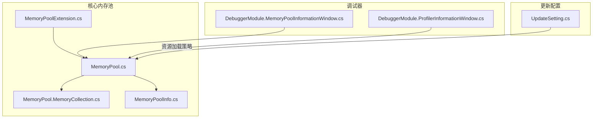
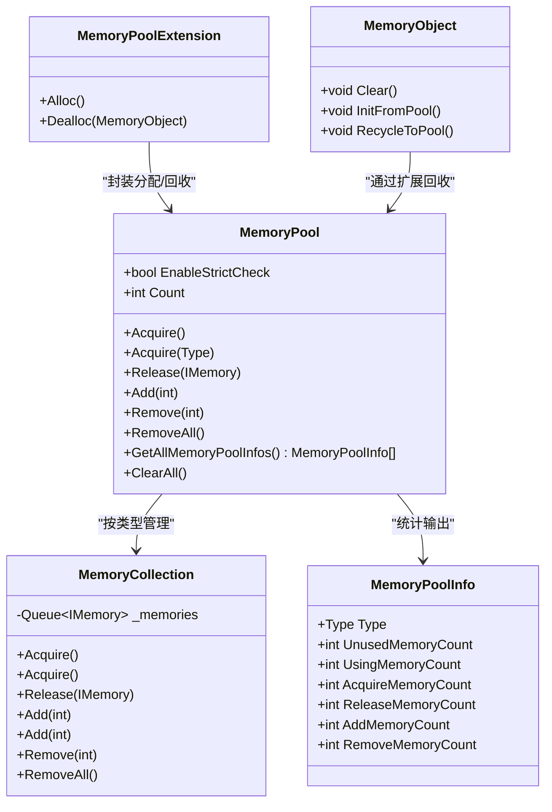
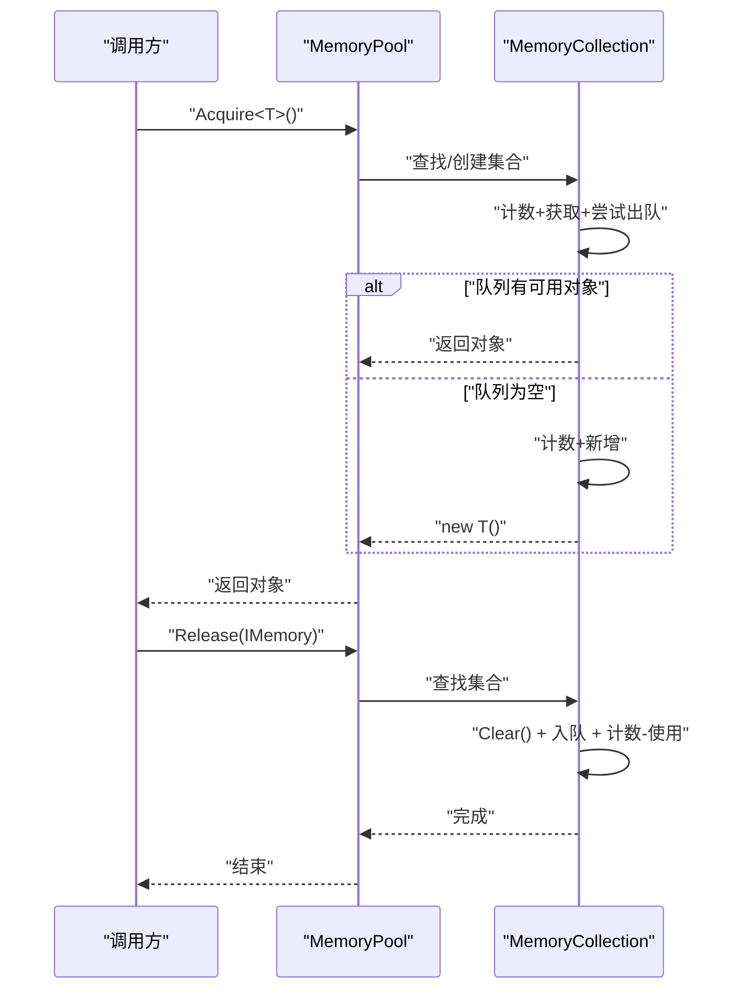
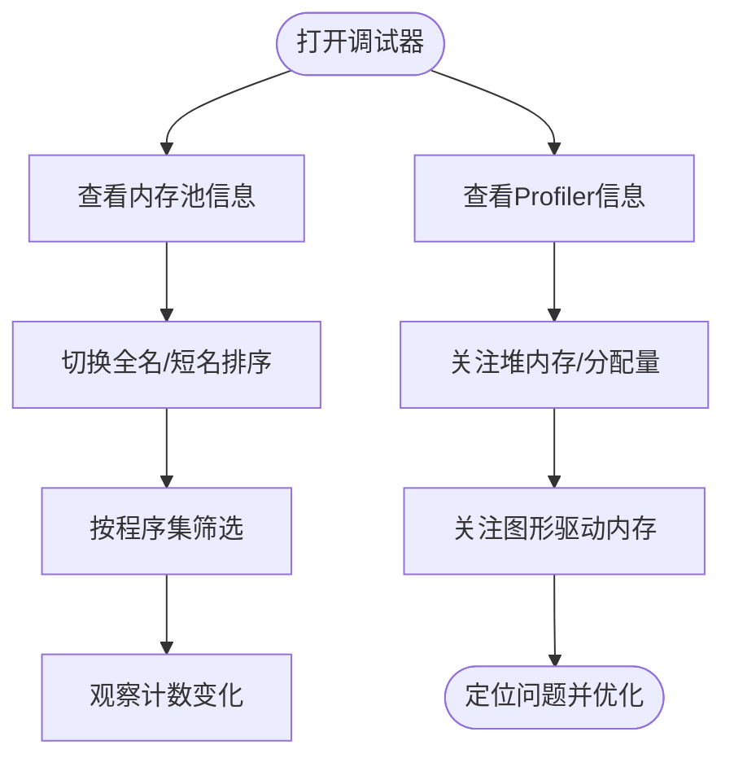
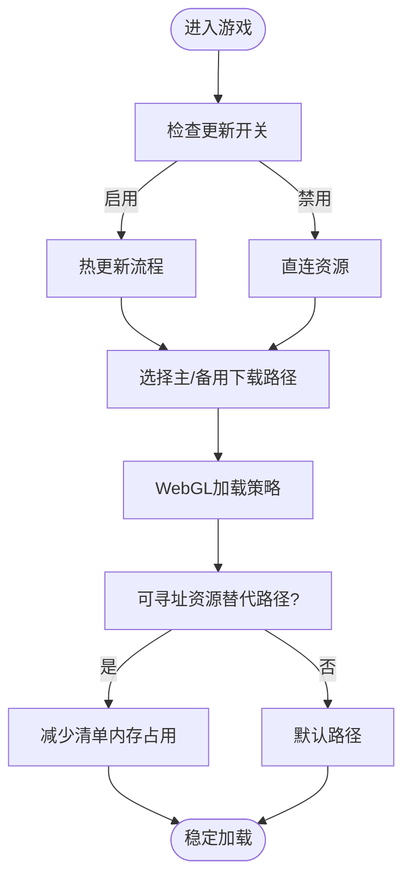
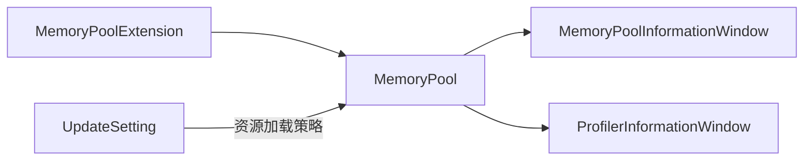

# 性能优化最佳实践

<cite>
**本文引用的文件**
- [MemoryPool.cs](file://Assets/TEngine/Runtime/Core/MemoryPool/MemoryPool.cs)
- [MemoryPool.MemoryCollection.cs](file://Assets/TEngine/Runtime/Core/MemoryPool/MemoryPool.MemoryCollection.cs)
- [MemoryPoolExtension.cs](file://Assets/TEngine/Runtime/Core/MemoryPool/MemoryPoolExtension.cs)
- [MemoryPoolInfo.cs](file://Assets/TEngine/Runtime/Core/MemoryPool/MemoryPoolInfo.cs)
- [DebuggerModule.MemoryPoolInformationWindow.cs](file://Assets/TEngine/Runtime/Module/DebugerModule/Component/DebuggerModule.MemoryPoolInformationWindow.cs)
- [DebuggerModule.ProfilerInformationWindow.cs](file://Assets/TEngine/Runtime/Module/DebugerModule/Component/DebuggerModule.ProfilerInformationWindow.cs)
- [UpdateSetting.cs](file://Assets/TEngine/Runtime/Core/UpdateSetting.cs)
</cite>

## 目录
1. [引言](#引言)
2. [项目结构](#项目结构)
3. [核心组件](#核心组件)
4. [架构总览](#架构总览)
5. [详细组件分析](#详细组件分析)
6. [依赖关系分析](#依赖关系分析)
7. [性能考虑](#性能考虑)
8. [故障排查指南](#故障排查指南)
9. [结论](#结论)
10. [附录](#附录)

## 引言
本指南面向使用 TEngine 框架进行游戏开发的工程师，聚焦于性能优化的最佳实践。内容涵盖内存管理（内存池、GC 优化、泄漏预防）、渲染性能（批处理、LOD、剔除）、CPU 性能（更新频率、协程与计算优化）、性能监控（指标采集、瓶颈分析、回归测试）以及工具使用与优化案例。文档以仓库中的实际代码为依据，结合可视化图示帮助读者快速落地。

## 项目结构
TEngine 的性能相关能力主要分布在以下模块：
- 核心内存池：提供对象复用、减少 GC 压力
- 调试器模块：内置内存池与 Profiler 信息窗口，便于运行期观测
- 更新配置：资源加载与热更新策略影响启动与运行时性能

**图表来源**
- [MemoryPool.cs:1-208](file://Assets/TEngine/Runtime/Core/MemoryPool/MemoryPool.cs#L1-L208)
- [MemoryPool.MemoryCollection.cs:1-157](file://Assets/TEngine/Runtime/Core/MemoryPool/MemoryPool.MemoryCollection.cs#L1-L157)
- [MemoryPoolInfo.cs:1-119](file://Assets/TEngine/Runtime/Core/MemoryPool/MemoryPoolInfo.cs#L1-L119)
- [MemoryPoolExtension.cs:1-57](file://Assets/TEngine/Runtime/Core/MemoryPool/MemoryPoolExtension.cs#L1-L57)
- [DebuggerModule.MemoryPoolInformationWindow.cs:1-107](file://Assets/TEngine/Runtime/Module/DebugerModule/Component/DebuggerModule.MemoryPoolInformationWindow.cs#L1-L107)
- [DebuggerModule.ProfilerInformationWindow.cs:1-60](file://Assets/TEngine/Runtime/Module/DebugerModule/Component/DebuggerModule.ProfilerInformationWindow.cs#L1-L60)
- [UpdateSetting.cs:1-220](file://Assets/TEngine/Runtime/Core/UpdateSetting.cs#L1-L220)

**章节来源**
- [MemoryPool.cs:1-208](file://Assets/TEngine/Runtime/Core/MemoryPool/MemoryPool.cs#L1-L208)
- [MemoryPool.MemoryCollection.cs:1-157](file://Assets/TEngine/Runtime/Core/MemoryPool/MemoryPool.MemoryCollection.cs#L1-L157)
- [MemoryPoolExtension.cs:1-57](file://Assets/TEngine/Runtime/Core/MemoryPool/MemoryPoolExtension.cs#L1-L57)
- [DebuggerModule.MemoryPoolInformationWindow.cs:1-107](file://Assets/TEngine/Runtime/Module/DebugerModule/Component/DebuggerModule.MemoryPoolInformationWindow.cs#L1-L107)
- [DebuggerModule.ProfilerInformationWindow.cs:1-60](file://Assets/TEngine/Runtime/Module/DebugerModule/Component/DebuggerModule.ProfilerInformationWindow.cs#L1-L60)
- [UpdateSetting.cs:1-220](file://Assets/TEngine/Runtime/Core/UpdateSetting.cs#L1-L220)

## 核心组件
- 内存池（MemoryPool）：集中管理各类对象的分配与回收，支持统计与严格校验，降低 GC 抖动
- 内存集合（MemoryCollection）：按类型维护队列，记录获取/释放/增删计数
- 内存对象扩展（MemoryObject + Alloc/Dealloc）：统一生命周期接口，确保正确回收
- 内存池信息（MemoryPoolInfo）：结构化统计信息，供调试器展示
- 调试器窗口：内存池与 Profiler 信息可视化，辅助定位问题
- 更新配置（UpdateSetting）：资源加载策略与热更新开关，影响启动与运行时性能

**章节来源**
- [MemoryPool.cs:1-208](file://Assets/TEngine/Runtime/Core/MemoryPool/MemoryPool.cs#L1-L208)
- [MemoryPool.MemoryCollection.cs:1-157](file://Assets/TEngine/Runtime/Core/MemoryPool/MemoryPool.MemoryCollection.cs#L1-L157)
- [MemoryPoolExtension.cs:1-57](file://Assets/TEngine/Runtime/Core/MemoryPool/MemoryPoolExtension.cs#L1-L57)
- [MemoryPoolInfo.cs:1-119](file://Assets/TEngine/Runtime/Core/MemoryPool/MemoryPoolInfo.cs#L1-L119)
- [DebuggerModule.MemoryPoolInformationWindow.cs:1-107](file://Assets/TEngine/Runtime/Module/DebugerModule/Component/DebuggerModule.MemoryPoolInformationWindow.cs#L1-L107)
- [DebuggerModule.ProfilerInformationWindow.cs:1-60](file://Assets/TEngine/Runtime/Module/DebugerModule/Component/DebuggerModule.ProfilerInformationWindow.cs#L1-L60)
- [UpdateSetting.cs:1-220](file://Assets/TEngine/Runtime/Core/UpdateSetting.cs#L1-L220)

## 架构总览
内存池通过类型分组与队列缓存实现对象复用；调试器在运行期展示内存池与 Profiler 统计；更新配置影响资源加载路径与热更新行为，间接影响帧时间与内存峰值。

**图表来源**
- [MemoryPool.cs:1-208](file://Assets/TEngine/Runtime/Core/MemoryPool/MemoryPool.cs#L1-L208)
- [MemoryPool.MemoryCollection.cs:1-157](file://Assets/TEngine/Runtime/Core/MemoryPool/MemoryPool.MemoryCollection.cs#L1-L157)
- [MemoryPoolExtension.cs:1-57](file://Assets/TEngine/Runtime/Core/MemoryPool/MemoryPoolExtension.cs#L1-L57)
- [MemoryPoolInfo.cs:1-119](file://Assets/TEngine/Runtime/Core/MemoryPool/MemoryPoolInfo.cs#L1-L119)

## 详细组件分析

### 内存池组件分析
- 分配流程：优先从队列取出，不存在则新建；统计“新增”次数用于评估池容量是否充足
- 回收流程：调用 Clear 清理状态后入队；严格模式下防止重复回收
- 统计维度：未使用、正在使用、获取、释放、新增、移除，便于定位异常增长
- 扩展接口：Alloc/Dealloc 统一生命周期，避免遗漏回收导致泄漏

**图表来源**
- [MemoryPool.cs:66-101](file://Assets/TEngine/Runtime/Core/MemoryPool/MemoryPool.cs#L66-L101)
- [MemoryPool.MemoryCollection.cs:46-98](file://Assets/TEngine/Runtime/Core/MemoryPool/MemoryPool.MemoryCollection.cs#L46-L98)

**章节来源**
- [MemoryPool.cs:66-101](file://Assets/TEngine/Runtime/Core/MemoryPool/MemoryPool.cs#L66-L101)
- [MemoryPool.MemoryCollection.cs:46-98](file://Assets/TEngine/Runtime/Core/MemoryPool/MemoryPool.MemoryCollection.cs#L46-L98)
- [MemoryPoolExtension.cs:35-55](file://Assets/TEngine/Runtime/Core/MemoryPool/MemoryPoolExtension.cs#L35-L55)
- [MemoryPoolInfo.cs:30-39](file://Assets/TEngine/Runtime/Core/MemoryPool/MemoryPoolInfo.cs#L30-L39)

### 调试器组件分析
- 内存池信息窗口：按程序集分组展示各类型的未使用/使用/获取/释放/增删计数，支持全名显示排序
- Profiler 信息窗口：展示 Profiler 支持性、启用状态、二进制日志、堆内存、图形驱动内存等关键指标

**图表来源**
- [DebuggerModule.MemoryPoolInformationWindow.cs:20-78](file://Assets/TEngine/Runtime/Module/DebugerModule/Component/DebuggerModule.MemoryPoolInformationWindow.cs#L20-L78)
- [DebuggerModule.ProfilerInformationWindow.cs:12-56](file://Assets/TEngine/Runtime/Module/DebugerModule/Component/DebuggerModule.ProfilerInformationWindow.cs#L12-L56)

**章节来源**
- [DebuggerModule.MemoryPoolInformationWindow.cs:20-78](file://Assets/TEngine/Runtime/Module/DebugerModule/Component/DebuggerModule.MemoryPoolInformationWindow.cs#L20-L78)
- [DebuggerModule.ProfilerInformationWindow.cs:12-56](file://Assets/TEngine/Runtime/Module/DebugerModule/Component/DebuggerModule.ProfilerInformationWindow.cs#L12-L56)

### 更新配置组件分析
- 热更新与 AOT 元数据：决定运行时是否启用热更新逻辑与程序集加载方式
- 资源下载路径与备用路径：影响首屏加载与网络波动下的稳定性
- WebGL 加载策略：Remote/StreamingAssets 切换对加载延迟与内存峰值有直接影响
- 可寻址资源替代路径：减少运行时清单占用内存

**图表来源**
- [UpdateSetting.cs:59-178](file://Assets/TEngine/Runtime/Core/UpdateSetting.cs#L59-L178)

**章节来源**
- [UpdateSetting.cs:59-178](file://Assets/TEngine/Runtime/Core/UpdateSetting.cs#L59-L178)

## 依赖关系分析
- 内存池与调试器：调试器依赖内存池统计接口输出可视化数据
- 内存池与扩展：扩展通过统一接口简化分配/回收流程
- 更新配置与资源加载：影响内存峰值与 IO 峰值，间接影响帧时间

**图表来源**
- [MemoryPool.cs:1-208](file://Assets/TEngine/Runtime/Core/MemoryPool/MemoryPool.cs#L1-L208)
- [DebuggerModule.MemoryPoolInformationWindow.cs:1-107](file://Assets/TEngine/Runtime/Module/DebugerModule/Component/DebuggerModule.MemoryPoolInformationWindow.cs#L1-L107)
- [DebuggerModule.ProfilerInformationWindow.cs:1-60](file://Assets/TEngine/Runtime/Module/DebugerModule/Component/DebuggerModule.ProfilerInformationWindow.cs#L1-L60)
- [MemoryPoolExtension.cs:1-57](file://Assets/TEngine/Runtime/Core/MemoryPool/MemoryPoolExtension.cs#L1-L57)
- [UpdateSetting.cs:1-220](file://Assets/TEngine/Runtime/Core/UpdateSetting.cs#L1-L220)

**章节来源**
- [MemoryPool.cs:1-208](file://Assets/TEngine/Runtime/Core/MemoryPool/MemoryPool.cs#L1-L208)
- [DebuggerModule.MemoryPoolInformationWindow.cs:1-107](file://Assets/TEngine/Runtime/Module/DebugerModule/Component/DebuggerModule.MemoryPoolInformationWindow.cs#L1-L107)
- [DebuggerModule.ProfilerInformationWindow.cs:1-60](file://Assets/TEngine/Runtime/Module/DebugerModule/Component/DebuggerModule.ProfilerInformationWindow.cs#L1-L60)
- [MemoryPoolExtension.cs:1-57](file://Assets/TEngine/Runtime/Core/MemoryPool/MemoryPoolExtension.cs#L1-L57)
- [UpdateSetting.cs:1-220](file://Assets/TEngine/Runtime/Core/UpdateSetting.cs#L1-L220)

## 性能考虑

### 内存管理优化
- 使用内存池减少 GC 抖动
  - 对频繁创建/销毁的对象（如子弹、特效、UI 条目）采用 Alloc/Dealloc 生命周期管理
  - 定期通过内存池信息窗口观察“获取/释放/新增/移除”计数，判断池容量是否合理
- GC 优化
  - 避免临时大对象与装箱拆箱；尽量使用值类型容器（如数组而非 List<T>）
  - 控制字符串拼接与正则使用频率
- 泄漏预防
  - 开启严格校验（EnableStrictCheck），在开发阶段尽早发现重复回收或未回收
  - 回收前确保 Clear 清理内部引用，避免闭包持有导致的隐式泄漏

### 渲染性能优化
- 批处理优化
  - 合并材质与纹理，减少绘制调用；使用共享网格与材质实例
  - 在 UI 层使用图集与九宫格，避免过多小贴图
- LOD 技术
  - 根据距离切换低面数模型与低分辨率贴图
- 剔除优化
  - 使用视锥剔除与遮挡剔除；对静态场景使用静态批处理

### CPU 性能优化
- 更新频率控制
  - 合理设置帧循环频率与物理步进；对非关键模块采用可变时间步
- 协程与计算优化
  - 使用协程异步加载与任务调度；避免在主线程执行重计算
  - 将昂贵计算拆分为多帧，使用分片策略

### 性能监控最佳实践
- 指标采集
  - 使用 Profiler 窗口关注堆内存、分配总量、图形驱动内存等
  - 结合内存池信息窗口观察对象生命周期与池容量变化
- 瓶颈分析
  - 通过 Allocation Callstacks 定位热点分配；结合帧率与内存曲线交叉分析
- 性能回归测试
  - 建立基准场景与自动化测试脚本，定期对比关键指标（平均帧耗、内存峰值、GC 次数）

## 故障排查指南
- 内存池异常
  - 现象：计数异常增长、池容量不足导致频繁新建
  - 排查：检查是否遗漏 Dealloc；确认 EnableStrictCheck 下未重复回收
- Profiler 指标异常
  - 现象：堆内存持续上升、分配量异常
  - 排查：关注 Allocation Callstacks，定位高频分配点；核对资源加载策略（WebGL/远程/本地）
- 更新加载问题
  - 现象：首屏加载慢或失败
  - 排查：确认主/备用下载路径可用；检查 WebGL 加载策略与可寻址资源替代设置

**章节来源**
- [MemoryPool.cs:164-185](file://Assets/TEngine/Runtime/Core/MemoryPool/MemoryPool.cs#L164-L185)
- [MemoryPool.MemoryCollection.cs:83-98](file://Assets/TEngine/Runtime/Core/MemoryPool/MemoryPool.MemoryCollection.cs#L83-L98)
- [DebuggerModule.ProfilerInformationWindow.cs:12-56](file://Assets/TEngine/Runtime/Module/DebugerModule/Component/DebuggerModule.ProfilerInformationWindow.cs#L12-L56)
- [UpdateSetting.cs:159-178](file://Assets/TEngine/Runtime/Core/UpdateSetting.cs#L159-L178)

## 结论
通过系统化地运用内存池、严格的生命周期管理、可视化监控与合理的资源加载策略，可以在 TEngine 框架上构建高性能且稳定的运行时。建议在开发早期即建立性能基线与回归测试，并持续以调试器数据为依据迭代优化。

## 附录
- 工具使用要点
  - 内存池信息窗口：按程序集分组查看类型级统计，切换全名排序便于定位具体类型
  - Profiler 窗口：启用 Allocation Callstacks，关注堆内存与分配总量趋势
  - 更新配置：根据平台选择合适的资源加载路径与热更新策略，减少首屏与运行时压力