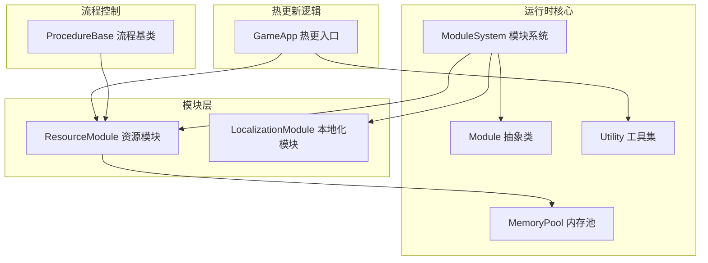
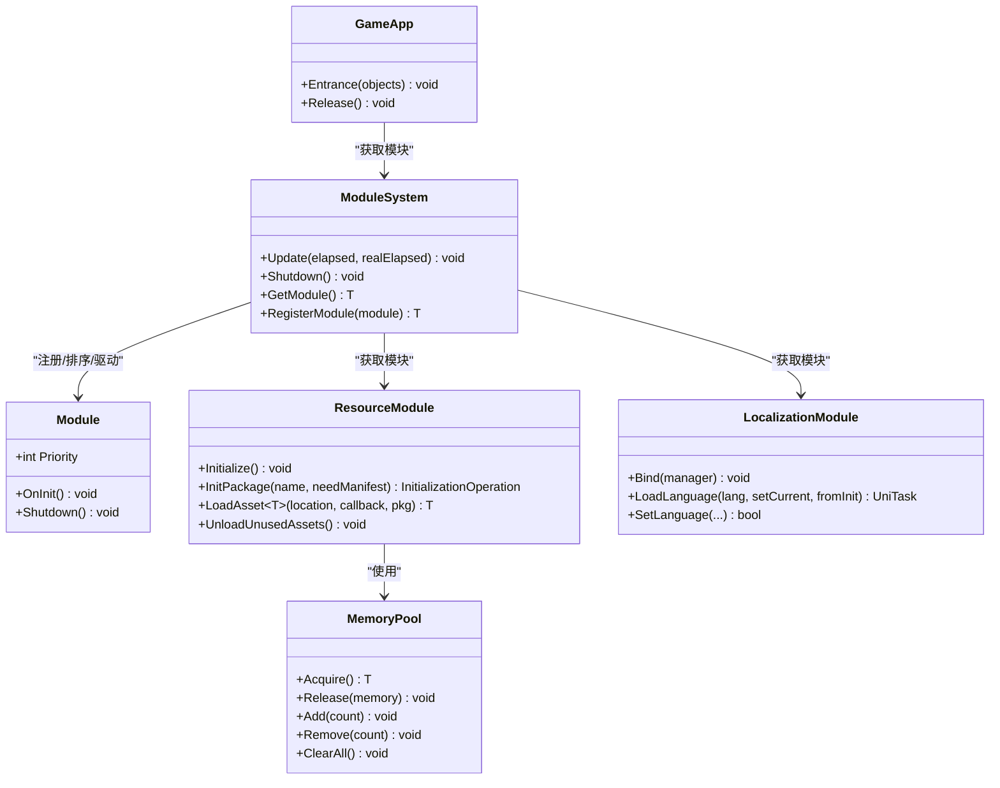
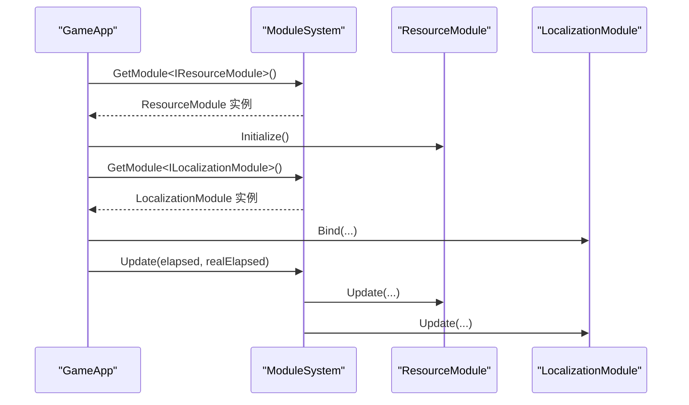
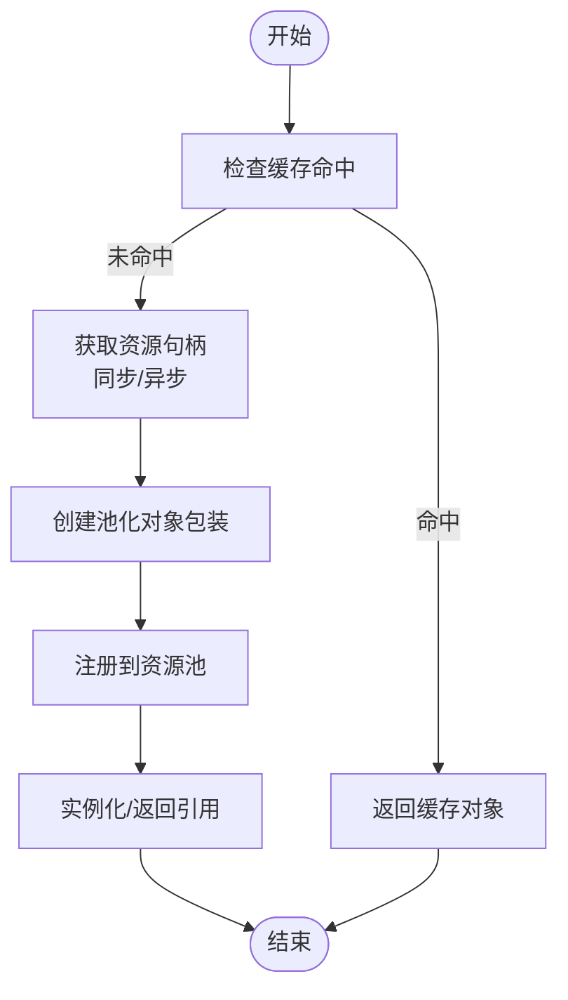
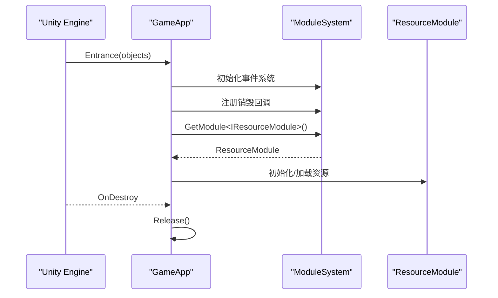
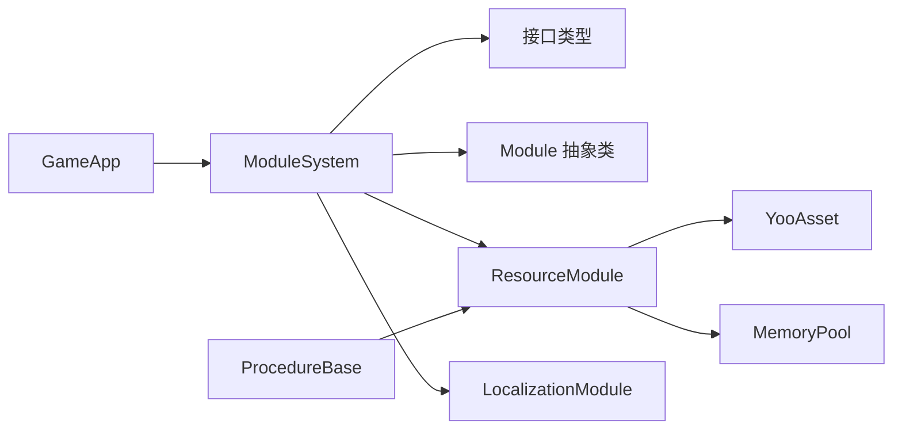

# 最佳实践指南

<cite>
**本文档引用的文件**
- [Assets/TEngine/Runtime/Core/Module.cs](file://Assets/TEngine/Runtime/Core/Module.cs)
- [Assets/TEngine/Runtime/Core/ModuleSystem.cs](file://Assets/TEngine/Runtime/Core/ModuleSystem.cs)
- [Assets/TEngine/Runtime/Core/MemoryPool/MemoryPool.cs](file://Assets/TEngine/Runtime/Core/MemoryPool/MemoryPool.cs)
- [Assets/TEngine/Runtime/Core/Utility/Utility.cs](file://Assets/TEngine/Runtime/Core/Utility/Utility.cs)
- [Assets/TEngine/Runtime/Module/ResourceModule/ResourceModule.cs](file://Assets/TEngine/Runtime/Module/ResourceModule/ResourceModule.cs)
- [Assets/TEngine/Runtime/Module/LocalizationModule/LocalizationModule.cs](file://Assets/TEngine/Runtime/Module/LocalizationModule/LocalizationModule.cs)
- [Assets/GameScripts/HotFix/GameLogic/GameApp.cs](file://Assets/GameScripts/HotFix/GameLogic/GameApp.cs)
- [Assets/GameScripts/Procedure/ProcedureBase.cs](file://Assets/GameScripts/Procedure/ProcedureBase.cs)
</cite>

## 目录
1. [引言](#引言)
2. [项目结构](#项目结构)
3. [核心组件](#核心组件)
4. [架构总览](#架构总览)
5. [详细组件分析](#详细组件分析)
6. [依赖关系分析](#依赖关系分析)
7. [性能考量](#性能考量)
8. [故障排查指南](#故障排查指南)
9. [结论](#结论)
10. [附录](#附录)

## 引言
本指南面向使用 TEngine 框架的开发者，围绕模块化开发、资源管理、热更新、性能优化与工程实践展开，结合仓库中的实际实现，总结可复用的最佳实践与常见陷阱，帮助团队建立一致的开发范式与工作流。

## 项目结构
TEngine 采用“运行时模块 + 热更新逻辑 + 流程控制”的分层组织方式：
- 运行时核心：模块基类与模块系统、内存池、工具集等
- 资源模块：基于 YooAsset 的资源包管理、加载、缓存与回收
- 本地化模块：语言资源加载与切换
- 热更新逻辑：GameApp 作为热更域入口，驱动业务逻辑
- 流程控制：ProcedureBase 抽象流程基类，统一接入资源模块

图表来源
- [Assets/TEngine/Runtime/Core/Module.cs:22-39](file://Assets/TEngine/Runtime/Core/Module.cs#L22-L39)
- [Assets/TEngine/Runtime/Core/ModuleSystem.cs:9-208](file://Assets/TEngine/Runtime/Core/ModuleSystem.cs#L9-L208)
- [Assets/TEngine/Runtime/Core/MemoryPool/MemoryPool.cs:9-208](file://Assets/TEngine/Runtime/Core/MemoryPool/MemoryPool.cs#L9-L208)
- [Assets/TEngine/Runtime/Module/ResourceModule/ResourceModule.cs:17-138](file://Assets/TEngine/Runtime/Module/ResourceModule/ResourceModule.cs#L17-L138)
- [Assets/TEngine/Runtime/Module/LocalizationModule/LocalizationModule.cs:8-114](file://Assets/TEngine/Runtime/Module/LocalizationModule/LocalizationModule.cs#L8-L114)
- [Assets/GameScripts/HotFix/GameLogic/GameApp.cs:17-47](file://Assets/GameScripts/HotFix/GameLogic/GameApp.cs#L17-L47)
- [Assets/GameScripts/Procedure/ProcedureBase.cs:5-14](file://Assets/GameScripts/Procedure/ProcedureBase.cs#L5-L14)

章节来源
- [Assets/TEngine/Runtime/Core/Module.cs:1-40](file://Assets/TEngine/Runtime/Core/Module.cs#L1-L40)
- [Assets/TEngine/Runtime/Core/ModuleSystem.cs:1-208](file://Assets/TEngine/Runtime/Core/ModuleSystem.cs#L1-L208)
- [Assets/TEngine/Runtime/Core/MemoryPool/MemoryPool.cs:1-208](file://Assets/TEngine/Runtime/Core/MemoryPool/MemoryPool.cs#L1-L208)
- [Assets/TEngine/Runtime/Module/ResourceModule/ResourceModule.cs:1-1252](file://Assets/TEngine/Runtime/Module/ResourceModule/ResourceModule.cs#L1-L1252)
- [Assets/TEngine/Runtime/Module/LocalizationModule/LocalizationModule.cs:1-114](file://Assets/TEngine/Runtime/Module/LocalizationModule/LocalizationModule.cs#L1-L114)
- [Assets/GameScripts/HotFix/GameLogic/GameApp.cs:1-47](file://Assets/GameScripts/HotFix/GameLogic/GameApp.cs#L1-L47)
- [Assets/GameScripts/Procedure/ProcedureBase.cs:1-15](file://Assets/GameScripts/Procedure/ProcedureBase.cs#L1-L15)

## 核心组件
- 模块与模块系统
  - 模块接口与抽象类定义了优先级、初始化与关闭生命周期
  - 模块系统负责注册、排序、统一 Update 驱动与销毁清理
- 内存池
  - 提供类型化内存池的获取、归还、批量增删与统计信息
- 资源模块
  - 基于 YooAsset 的包管理、多运行模式初始化、清单更新、下载器、缓存清理与资源回收
- 本地化模块
  - 语言切换、资源加载与状态管理
- 热更新入口
  - GameApp 作为热更域主入口，初始化事件系统、注册释放回调、启动业务逻辑
- 流程基类
  - 统一注入资源模块，便于流程内按需加载资源

章节来源
- [Assets/TEngine/Runtime/Core/Module.cs:8-39](file://Assets/TEngine/Runtime/Core/Module.cs#L8-L39)
- [Assets/TEngine/Runtime/Core/ModuleSystem.cs:9-208](file://Assets/TEngine/Runtime/Core/ModuleSystem.cs#L9-L208)
- [Assets/TEngine/Runtime/Core/MemoryPool/MemoryPool.cs:9-208](file://Assets/TEngine/Runtime/Core/MemoryPool/MemoryPool.cs#L9-L208)
- [Assets/TEngine/Runtime/Module/ResourceModule/ResourceModule.cs:17-138](file://Assets/TEngine/Runtime/Module/ResourceModule/ResourceModule.cs#L17-L138)
- [Assets/TEngine/Runtime/Module/LocalizationModule/LocalizationModule.cs:8-114](file://Assets/TEngine/Runtime/Module/LocalizationModule/LocalizationModule.cs#L8-L114)
- [Assets/GameScripts/HotFix/GameLogic/GameApp.cs:17-47](file://Assets/GameScripts/HotFix/GameLogic/GameApp.cs#L17-L47)
- [Assets/GameScripts/Procedure/ProcedureBase.cs:5-14](file://Assets/GameScripts/Procedure/ProcedureBase.cs#L5-L14)

## 架构总览
下图展示模块系统如何统一调度模块、模块如何依赖资源与内存池、以及热更新入口如何接入模块系统。

图表来源
- [Assets/TEngine/Runtime/Core/Module.cs:22-39](file://Assets/TEngine/Runtime/Core/Module.cs#L22-L39)
- [Assets/TEngine/Runtime/Core/ModuleSystem.cs:9-208](file://Assets/TEngine/Runtime/Core/ModuleSystem.cs#L9-L208)
- [Assets/TEngine/Runtime/Module/ResourceModule/ResourceModule.cs:17-138](file://Assets/TEngine/Runtime/Module/ResourceModule/ResourceModule.cs#L17-L138)
- [Assets/TEngine/Runtime/Module/LocalizationModule/LocalizationModule.cs:8-114](file://Assets/TEngine/Runtime/Module/LocalizationModule/LocalizationModule.cs#L8-L114)
- [Assets/TEngine/Runtime/Core/MemoryPool/MemoryPool.cs:9-208](file://Assets/TEngine/Runtime/Core/MemoryPool/MemoryPool.cs#L9-L208)
- [Assets/GameScripts/HotFix/GameLogic/GameApp.cs:17-47](file://Assets/GameScripts/HotFix/GameLogic/GameApp.cs#L17-L47)

## 详细组件分析

### 模块化开发最佳实践
- 设计原则
  - 使用抽象模块定义生命周期与优先级，确保模块间解耦与可控初始化顺序
  - 通过模块系统统一 Update 驱动，避免全局轮询分散
- 接口设计
  - 以接口类型获取模块，保证依赖注入与替换能力
  - 优先级决定模块插入顺序与关闭顺序，避免资源竞争
- 依赖注入模式
  - 通过模块系统注册自定义模块实例，或按约定反射创建模块
  - 在流程基类中统一注入常用模块，降低耦合

图表来源
- [Assets/GameScripts/HotFix/GameLogic/GameApp.cs:25-40](file://Assets/GameScripts/HotFix/GameLogic/GameApp.cs#L25-L40)
- [Assets/TEngine/Runtime/Core/ModuleSystem.cs:68-141](file://Assets/TEngine/Runtime/Core/ModuleSystem.cs#L68-L141)
- [Assets/TEngine/Runtime/Module/ResourceModule/ResourceModule.cs:119-138](file://Assets/TEngine/Runtime/Module/ResourceModule/ResourceModule.cs#L119-L138)
- [Assets/TEngine/Runtime/Module/LocalizationModule/LocalizationModule.cs:17-35](file://Assets/TEngine/Runtime/Module/LocalizationModule/LocalizationModule.cs#L17-L35)

章节来源
- [Assets/TEngine/Runtime/Core/Module.cs:8-39](file://Assets/TEngine/Runtime/Core/Module.cs#L8-L39)
- [Assets/TEngine/Runtime/Core/ModuleSystem.cs:68-208](file://Assets/TEngine/Runtime/Core/ModuleSystem.cs#L68-L208)
- [Assets/GameScripts/Procedure/ProcedureBase.cs:13-13](file://Assets/GameScripts/Procedure/ProcedureBase.cs#L13-L13)

### 资源管理最佳实践
- 资源加载策略
  - 使用资源模块封装 YooAsset 初始化与包管理，按运行模式选择文件系统参数
  - 支持同步与异步加载，异步加载时先检查缓存命中，再等待加载完成
- 缓存管理
  - 通过资源模块内部缓存表记录 AssetInfo，减少重复查询
  - 对 GameObject 加载使用引用计数与池化对象包装，避免重复实例化
- 内存优化
  - 定期调用卸载未使用资源，触发对象池与包层的资源回收
  - 低内存回调时触发强制回收，保障运行稳定性
- 版本与清单
  - 支持请求远端包版本并更新清单，确保资源一致性

图表来源
- [Assets/TEngine/Runtime/Module/ResourceModule/ResourceModule.cs:692-760](file://Assets/TEngine/Runtime/Module/ResourceModule/ResourceModule.cs#L692-L760)
- [Assets/TEngine/Runtime/Module/ResourceModule/ResourceModule.cs:769-800](file://Assets/TEngine/Runtime/Module/ResourceModule/ResourceModule.cs#L769-L800)

章节来源
- [Assets/TEngine/Runtime/Module/ResourceModule/ResourceModule.cs:119-261](file://Assets/TEngine/Runtime/Module/ResourceModule/ResourceModule.cs#L119-L261)
- [Assets/TEngine/Runtime/Module/ResourceModule/ResourceModule.cs:390-447](file://Assets/TEngine/Runtime/Module/ResourceModule/ResourceModule.cs#L390-L447)
- [Assets/TEngine/Runtime/Module/ResourceModule/ResourceModule.cs:533-620](file://Assets/TEngine/Runtime/Module/ResourceModule/ResourceModule.cs#L533-L620)

### 热更新开发最佳实践
- 代码组织
  - 热更入口集中于 GameApp.Entrance，统一初始化事件系统与业务逻辑
  - 业务逻辑通过模块系统获取 UI、资源等模块，避免直接依赖
- 生命周期
  - 在 Unity 销毁回调中释放单例与模块，防止泄漏
- 版本与兼容
  - 通过资源模块的包版本与清单更新机制，确保热更资源与逻辑版本对齐
  - 流程基类统一注入资源模块，保证流程阶段的资源可用性

图表来源
- [Assets/GameScripts/HotFix/GameLogic/GameApp.cs:25-46](file://Assets/GameScripts/HotFix/GameLogic/GameApp.cs#L25-L46)
- [Assets/GameScripts/Procedure/ProcedureBase.cs:13-13](file://Assets/GameScripts/Procedure/ProcedureBase.cs#L13-L13)

章节来源
- [Assets/GameScripts/HotFix/GameLogic/GameApp.cs:17-47](file://Assets/GameScripts/HotFix/GameLogic/GameApp.cs#L17-L47)
- [Assets/GameScripts/Procedure/ProcedureBase.cs:5-14](file://Assets/GameScripts/Procedure/ProcedureBase.cs#L5-L14)

### 性能优化最佳实践
- 内存管理
  - 使用内存池减少频繁 GC；在模块关闭时清空所有内存池
  - 对资源对象进行池化包装，避免重复分配
- GC 优化
  - 优先使用结构体/值类型承载轻量数据，对象池承载复杂对象
  - 控制集合扩容与临时数组分配，避免每帧抖动
- 渲染优化
  - 通过资源模块的卸载未使用资源，降低显存压力
  - 在 WebGL 平台注意平台限制，避免不支持的操作

章节来源
- [Assets/TEngine/Runtime/Core/MemoryPool/MemoryPool.cs:53-101](file://Assets/TEngine/Runtime/Core/MemoryPool/MemoryPool.cs#L53-L101)
- [Assets/TEngine/Runtime/Module/ResourceModule/ResourceModule.cs:412-447](file://Assets/TEngine/Runtime/Module/ResourceModule/ResourceModule.cs#L412-L447)

## 依赖关系分析
- 模块系统对模块的依赖是松耦合的：通过接口类型获取模块，支持替换与扩展
- 资源模块依赖 YooAsset 与对象池模块，提供统一的资源访问与回收
- 热更新入口依赖模块系统与资源模块，形成清晰的控制流

图表来源
- [Assets/TEngine/Runtime/Core/ModuleSystem.cs:68-141](file://Assets/TEngine/Runtime/Core/ModuleSystem.cs#L68-L141)
- [Assets/TEngine/Runtime/Module/ResourceModule/ResourceModule.cs:17-138](file://Assets/TEngine/Runtime/Module/ResourceModule/ResourceModule.cs#L17-L138)
- [Assets/TEngine/Runtime/Module/LocalizationModule/LocalizationModule.cs:8-114](file://Assets/TEngine/Runtime/Module/LocalizationModule/LocalizationModule.cs#L8-L114)
- [Assets/GameScripts/HotFix/GameLogic/GameApp.cs:25-40](file://Assets/GameScripts/HotFix/GameLogic/GameApp.cs#L25-L40)
- [Assets/GameScripts/Procedure/ProcedureBase.cs:13-13](file://Assets/GameScripts/Procedure/ProcedureBase.cs#L13-L13)

章节来源
- [Assets/TEngine/Runtime/Core/ModuleSystem.cs:9-208](file://Assets/TEngine/Runtime/Core/ModuleSystem.cs#L9-L208)
- [Assets/TEngine/Runtime/Module/ResourceModule/ResourceModule.cs:17-138](file://Assets/TEngine/Runtime/Module/ResourceModule/ResourceModule.cs#L17-L138)
- [Assets/TEngine/Runtime/Module/LocalizationModule/LocalizationModule.cs:8-114](file://Assets/TEngine/Runtime/Module/LocalizationModule/LocalizationModule.cs#L8-L114)
- [Assets/GameScripts/HotFix/GameLogic/GameApp.cs:17-47](file://Assets/GameScripts/HotFix/GameLogic/GameApp.cs#L17-L47)
- [Assets/GameScripts/Procedure/ProcedureBase.cs:5-14](file://Assets/GameScripts/Procedure/ProcedureBase.cs#L5-L14)

## 性能考量
- 模块轮询开销
  - 通过优先级链表与延迟构建执行列表，避免每帧重建导致的 GCAlloc
- 资源加载
  - 异步加载与缓存命中优先，减少主线程阻塞
  - 下载器并发与失败重试参数可调，平衡速度与稳定性
- 内存池
  - 批量增删与严格检查开关，便于调试与生产环境切换

章节来源
- [Assets/TEngine/Runtime/Core/ModuleSystem.cs:29-60](file://Assets/TEngine/Runtime/Core/ModuleSystem.cs#L29-L60)
- [Assets/TEngine/Runtime/Core/MemoryPool/MemoryPool.cs:108-162](file://Assets/TEngine/Runtime/Core/MemoryPool/MemoryPool.cs#L108-L162)
- [Assets/TEngine/Runtime/Module/ResourceModule/ResourceModule.cs:346-366](file://Assets/TEngine/Runtime/Module/ResourceModule/ResourceModule.cs#L346-L366)

## 故障排查指南
- 模块获取异常
  - 通过接口类型获取模块，若类型不是接口将抛出异常
  - 若找不到模块类型或无法创建实例，将抛出异常
- 资源加载异常
  - 资源定位无效或包不存在时，会返回错误日志
  - 远端下载失败或清单更新失败时，记录致命错误
- 内存池异常
  - 严格检查模式下，非法类型或非抽象类类型将抛出异常
- 低内存处理
  - 触发低内存回调时，应确保资源回收逻辑正确执行

章节来源
- [Assets/TEngine/Runtime/Core/ModuleSystem.cs:68-120](file://Assets/TEngine/Runtime/Core/ModuleSystem.cs#L68-L120)
- [Assets/TEngine/Runtime/Module/ResourceModule/ResourceModule.cs:533-602](file://Assets/TEngine/Runtime/Module/ResourceModule/ResourceModule.cs#L533-L602)
- [Assets/TEngine/Runtime/Core/MemoryPool/MemoryPool.cs:164-185](file://Assets/TEngine/Runtime/Core/MemoryPool/MemoryPool.cs#L164-L185)

## 结论
TEngine 框架通过模块系统、资源模块与内存池提供了清晰的架构边界与高效的运行时能力。遵循本文的最佳实践，可在模块化设计、资源管理、热更新与性能优化方面获得稳定收益。建议在团队内推广统一的模块注册与生命周期管理、资源加载与缓存策略、热更新入口与流程控制规范，持续优化开发效率与运行质量。

## 附录
- 开发模式建议
  - 模块化：以接口驱动模块获取，统一在模块系统中注册与初始化
  - 资源管理：优先缓存命中与异步加载，定期回收未使用资源
  - 热更新：集中入口、明确生命周期、版本与清单对齐
  - 性能：使用内存池与延迟构建执行列表，避免每帧重建
- 反模式警示
  - 直接依赖具体实现而非接口
  - 忽视资源回收与缓存策略，导致内存增长
  - 在热更新入口中执行过多同步阻塞逻辑
  - 不区分运行模式，导致资源加载路径错误