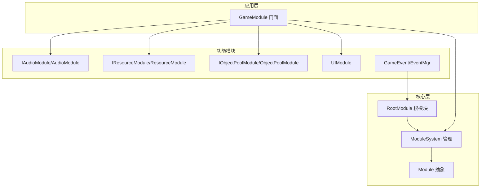
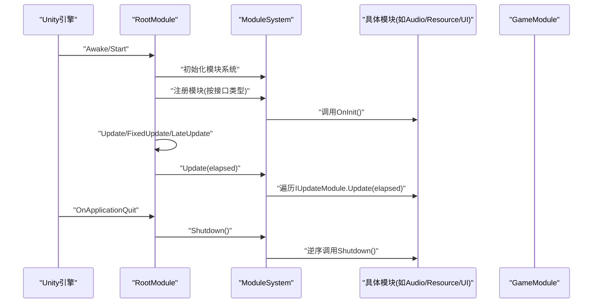
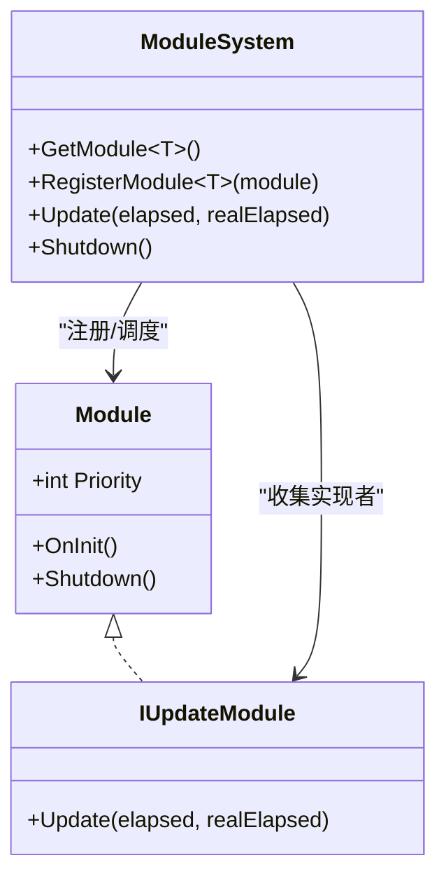
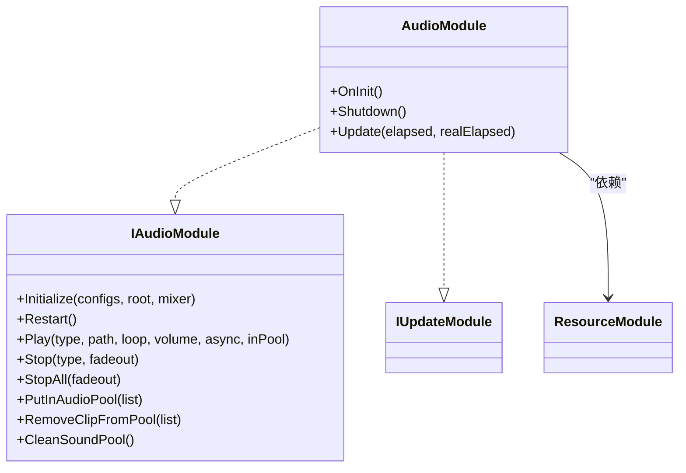
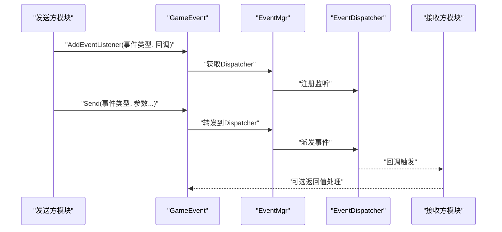
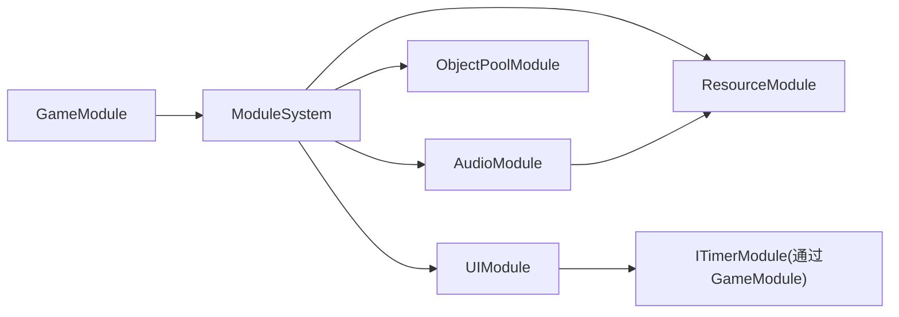

# 模块化开发最佳实践

<cite>
**本文档引用的文件**
- [Module.cs](file://Assets/TEngine/Runtime/Core/Module.cs)
- [ModuleSystem.cs](file://Assets/TEngine/Runtime/Core/ModuleSystem.cs)
- [RootModule.cs](file://Assets/TEngine/Runtime/Module/RootModule.cs)
- [GameModule.cs](file://Assets/GameScripts/HotFix/GameLogic/GameModule.cs)
- [IAudioModule.cs](file://Assets/TEngine/Runtime/AudioModule/IAudioModule.cs)
- [AudioModule.cs](file://Assets/TEngine/Runtime/AudioModule/AudioModule.cs)
- [ObjectPoolModule.cs](file://Assets/TEngine/Runtime/ObjectPoolModule/ObjectPoolModule.cs)
- [ResourceModule.cs](file://Assets/TEngine/Runtime/ResourceModule/ResourceModule.cs)
- [UIModule.cs](file://Assets/GameScripts/HotFix/GameLogic/Module/UIModule/UIModule.cs)
- [GameEvent.cs](file://Assets/TEngine/Runtime/Core/GameEvent/GameEvent.cs)
- [EventMgr.cs](file://Assets/TEngine/Runtime/Core/GameEvent/EventMgr.cs)
- [MemoryPool.cs](file://Assets/TEngine/Runtime/Core/MemoryPool/MemoryPool.cs)
- [Singleton.cs](file://Assets/GameScripts/HotFix/GameLogic/SingletonSystem/Singleton.cs)
</cite>

## 目录
1. [引言](#引言)
2. [项目结构](#项目结构)
3. [核心组件](#核心组件)
4. [架构总览](#架构总览)
5. [详细组件分析](#详细组件分析)
6. [依赖关系分析](#依赖关系分析)
7. [性能考虑](#性能考虑)
8. [故障排查指南](#故障排查指南)
9. [结论](#结论)
10. [附录](#附录)

## 引言
本指南围绕 TEngine 框架的模块化开发实践，系统阐述模块设计原则、接口与依赖管理、生命周期与初始化顺序、模块间通信模式以及性能优化策略。文档结合仓库中的实际代码文件，提供可操作的最佳实践与反模式警示，帮助开发者构建稳定、可维护、高性能的模块化架构。

## 项目结构
TEngine 的模块化体系由“核心模块基座 + 多个功能模块 + 应用层聚合器”构成：
- 核心层：模块抽象与系统管理（Module、ModuleSystem）、根模块（RootModule）
- 功能模块：音频、资源、对象池、UI、事件等
- 应用层：GameModule 作为模块门面，统一对外暴露模块访问入口

**图表来源**
- [Module.cs:22-39](file://Assets/TEngine/Runtime/Core/Module.cs#L22-L39)
- [ModuleSystem.cs:9-208](file://Assets/TEngine/Runtime/Core/ModuleSystem.cs#L9-L208)
- [RootModule.cs:10-304](file://Assets/TEngine/Runtime/Module/RootModule.cs#L10-L304)
- [GameModule.cs:5-118](file://Assets/GameScripts/HotFix/GameLogic/GameModule.cs#L5-L118)
- [IAudioModule.cs:8-128](file://Assets/TEngine/Runtime/AudioModule/IAudioModule.cs#L8-L128)
- [AudioModule.cs:11-571](file://Assets/TEngine/Runtime/AudioModule/AudioModule.cs#L11-L571)
- [ResourceModule.cs:17-1252](file://Assets/TEngine/Runtime/ResourceModule/ResourceModule.cs#L17-L1252)
- [ObjectPoolModule.cs:9-800](file://Assets/TEngine/Runtime/ObjectPoolModule/ObjectPoolModule.cs#L9-L800)
- [UIModule.cs:15-732](file://Assets/GameScripts/HotFix/GameLogic/Module/UIModule/UIModule.cs#L15-L732)
- [GameEvent.cs:8-601](file://Assets/TEngine/Runtime/Core/GameEvent/GameEvent.cs#L8-L601)
- [EventMgr.cs:9-89](file://Assets/TEngine/Runtime/Core/GameEvent/EventMgr.cs#L9-L89)

**章节来源**
- [Module.cs:1-40](file://Assets/TEngine/Runtime/Core/Module.cs#L1-L40)
- [ModuleSystem.cs:1-208](file://Assets/TEngine/Runtime/Core/ModuleSystem.cs#L1-L208)
- [RootModule.cs:1-304](file://Assets/TEngine/Runtime/Module/RootModule.cs#L1-L304)
- [GameModule.cs:1-118](file://Assets/GameScripts/HotFix/GameLogic/GameModule.cs#L1-L118)

## 核心组件
- 模块抽象与接口
  - Module 抽象类定义模块生命周期（OnInit、Shutdown），并提供 Priority 优先级属性
  - IUpdateModule 定义 Update 接口，用于参与主循环
- 模块系统
  - ModuleSystem 负责模块注册、按优先级排序、统一 Update 调度、统一 Shutdown
  - 支持通过接口类型动态解析模块实现类
- 根模块
  - RootModule 作为 Unity 生命周期入口，负责初始化日志/文本/JSON 辅助器、帧循环、内存压力处理、模块系统关闭
- 应用门面
  - GameModule 提供静态访问入口，统一获取各模块实例，并在关闭时清理引用

**章节来源**
- [Module.cs:8-39](file://Assets/TEngine/Runtime/Core/Module.cs#L8-L39)
- [ModuleSystem.cs:9-208](file://Assets/TEngine/Runtime/Core/ModuleSystem.cs#L9-L208)
- [RootModule.cs:10-304](file://Assets/TEngine/Runtime/Module/RootModule.cs#L10-L304)
- [GameModule.cs:5-118](file://Assets/GameScripts/HotFix/GameLogic/GameModule.cs#L5-L118)

## 架构总览
模块化架构遵循“接口隔离 + 依赖注入 + 优先级调度”的设计思想：
- 通过接口定义模块契约，避免对具体实现的耦合
- 通过 ModuleSystem 注册与解析模块，实现松耦合依赖
- 通过 Priority 控制模块初始化顺序与 Update 执行顺序
- 通过 RootModule 驱动主循环，统一生命周期管理

**图表来源**
- [RootModule.cs:140-167](file://Assets/TEngine/Runtime/Module/RootModule.cs#L140-L167)
- [ModuleSystem.cs:29-60](file://Assets/TEngine/Runtime/Core/ModuleSystem.cs#L29-L60)
- [Module.cs:33-39](file://Assets/TEngine/Runtime/Core/Module.cs#L33-L39)

## 详细组件分析

### 模块抽象与系统管理
- 设计要点
  - 模块通过 Priority 决定初始化顺序与 Update 顺序；高优先级先初始化、后关闭
  - IUpdateModule 参与主循环；ModuleSystem 在注册时自动构建 Update 执行列表
  - ModuleSystem 支持通过接口类型解析模块实现类，要求接口命名与实现类命名一一对应
- 生命周期
  - 注册：RegisterUpdate -> 插入有序链表 -> 若实现 IUpdateModule 则加入 Update 链表并标记脏位
  - 更新：Update 时若脏位为真则重建执行列表
  - 关闭：逆序遍历模块链表调用 Shutdown，并清空容器与内存池

**图表来源**
- [Module.cs:22-39](file://Assets/TEngine/Runtime/Core/Module.cs#L22-L39)
- [ModuleSystem.cs:9-208](file://Assets/TEngine/Runtime/Core/ModuleSystem.cs#L9-L208)

**章节来源**
- [Module.cs:8-39](file://Assets/TEngine/Runtime/Core/Module.cs#L8-L39)
- [ModuleSystem.cs:68-208](file://Assets/TEngine/Runtime/Core/ModuleSystem.cs#L68-L208)

### 根模块与主循环
- 设计要点
  - RootModule 作为 MonoBehaviour，负责初始化日志/文本/JSON 辅助器、帧率与时间缩放、后台运行与休眠策略
  - 在 Update 中驱动 GameTime 并调用 ModuleSystem.Update
  - OnDestroy 中触发 ModuleSystem.Shutdown
  - OnLowMemory 触发对象池与资源模块的低内存回收
- 最佳实践
  - 将跨模块通用的系统级配置集中于 RootModule
  - 保持 Update 中仅做轻量调度，避免重逻辑

**章节来源**
- [RootModule.cs:116-167](file://Assets/TEngine/Runtime/Module/RootModule.cs#L116-L167)
- [RootModule.cs:287-302](file://Assets/TEngine/Runtime/Module/RootModule.cs#L287-L302)

### 应用门面与模块聚合
- 设计要点
  - GameModule 以静态属性形式聚合各模块，延迟初始化并通过 ModuleSystem.GetModule<T>() 获取
  - 提供 Shutdown 清理静态引用，避免内存泄漏
- 最佳实践
  - 使用门面封装模块访问，隐藏具体实现细节
  - 在应用退出时显式调用 GameModule.Shutdown

**章节来源**
- [GameModule.cs:5-118](file://Assets/GameScripts/HotFix/GameLogic/GameModule.cs#L5-L118)

### 音频模块（示例：模块实现）
- 设计要点
  - 实现 IAudioModule 与 IUpdateModule，提供音量、开关、分类播放、对象池等能力
  - 通过 ModuleSystem.GetModule<IResourceModule>() 获取资源模块进行异步加载
  - Update 中遍历各类别音频代理，驱动播放状态
- 最佳实践
  - 将资源依赖与业务逻辑分离，避免在模块内部硬编码资源路径
  - 使用对象池与渐消策略控制并发播放数量

**图表来源**
- [IAudioModule.cs:8-128](file://Assets/TEngine/Runtime/AudioModule/IAudioModule.cs#L8-L128)
- [AudioModule.cs:11-571](file://Assets/TEngine/Runtime/AudioModule/AudioModule.cs#L11-L571)
- [ResourceModule.cs:17-1252](file://Assets/TEngine/Runtime/ResourceModule/ResourceModule.cs#L17-L1252)

**章节来源**
- [IAudioModule.cs:74-127](file://Assets/TEngine/Runtime/AudioModule/IAudioModule.cs#L74-L127)
- [AudioModule.cs:322-332](file://Assets/TEngine/Runtime/AudioModule/AudioModule.cs#L322-L332)
- [AudioModule.cs:555-570](file://Assets/TEngine/Runtime/AudioModule/AudioModule.cs#L555-L570)

### 资源模块（示例：资源加载与包管理）
- 设计要点
  - 通过 YooAsset 进行包初始化、清单更新、下载器创建、低内存回收
  - 提供同步/异步加载资源句柄，内部缓存与对象池配合
  - 支持多运行模式（编辑器模拟、单机、主机、WebGL）
- 最佳实践
  - 明确资源包边界与版本管理策略
  - 在低内存回调中主动释放未使用资源

**章节来源**
- [ResourceModule.cs:119-138](file://Assets/TEngine/Runtime/ResourceModule/ResourceModule.cs#L119-L138)
- [ResourceModule.cs:390-447](file://Assets/TEngine/Runtime/ResourceModule/ResourceModule.cs#L390-L447)

### 对象池模块（示例：对象池与内存管理）
- 设计要点
  - 提供单次/多次获取对象池，支持容量、过期时间、优先级等参数
  - Update 中统一更新各对象池，支持自动释放策略
  - 与 MemoryPool 协同，提供内存对象的获取/归还/批量管理
- 最佳实践
  - 合理设置对象池容量与过期时间，避免内存膨胀
  - 在模块 Shutdown 中清理对象池，防止泄漏

**章节来源**
- [ObjectPoolModule.cs:23-70](file://Assets/TEngine/Runtime/ObjectPoolModule/ObjectPoolModule.cs#L23-L70)
- [ObjectPoolModule.cs:35-41](file://Assets/TEngine/Runtime/ObjectPoolModule/ObjectPoolModule.cs#L35-L41)
- [MemoryPool.cs:53-101](file://Assets/TEngine/Runtime/Core/MemoryPool/MemoryPool.cs#L53-L101)

### UI 模块（示例：窗口管理与生命周期）
- 设计要点
  - UIModule 继承自 Singleton<T>，提供窗口栈管理、层级深度计算、可见性控制
  - 支持异步/同步打开窗口，窗口生命周期与资源加载解耦
  - 通过 IUIResourceLoader 资源加载接口，便于替换实现
- 最佳实践
  - 使用窗口属性（FullScreen、HideTimeToClose）控制显示与回收时机
  - 在模块释放时关闭所有窗口并销毁根节点

**章节来源**
- [UIModule.cs:15-114](file://Assets/GameScripts/HotFix/GameLogic/Module/UIModule/UIModule.cs#L15-L114)
- [UIModule.cs:472-516](file://Assets/GameScripts/HotFix/GameLogic/Module/UIModule/UIModule.cs#L472-L516)
- [UIModule.cs:712-730](file://Assets/GameScripts/HotFix/GameLogic/Module/UIModule/UIModule.cs#L712-L730)

### 事件系统（模块间通信）
- 设计要点
  - GameEvent 提供 AddEventListener/RemoveEventListener/Send 等静态接口
  - EventMgr 管理事件分发器与 Wrap 接口注册，支持按类型/字符串事件
  - 通过 ModuleSystem 获取模块，实现松耦合通信
- 最佳实践
  - 事件命名规范化，避免魔法字符串
  - 事件订阅与取消订阅成对出现，防止内存泄漏

**图表来源**
- [GameEvent.cs:28-120](file://Assets/TEngine/Runtime/Core/GameEvent/GameEvent.cs#L28-L120)
- [EventMgr.cs:73-87](file://Assets/TEngine/Runtime/Core/GameEvent/EventMgr.cs#L73-L87)

**章节来源**
- [GameEvent.cs:28-120](file://Assets/TEngine/Runtime/Core/GameEvent/GameEvent.cs#L28-L120)
- [EventMgr.cs:30-87](file://Assets/TEngine/Runtime/Core/GameEvent/EventMgr.cs#L30-L87)

## 依赖关系分析
- 模块间依赖
  - 模块通过 ModuleSystem.GetModule<T>() 获取依赖模块，避免硬编码耦合
  - 示例：AudioModule 依赖 ResourceModule；UIModule 依赖 ITimerModule（通过 GameModule 访问）
- 依赖注入与单例
  - GameModule 作为门面，提供静态访问入口
  - UIModule 使用 Singleton<T> 模式，确保全局唯一实例
- 优先级与初始化顺序
  - ModuleSystem 按 Priority 插入链表，保证高优先级模块先初始化、后关闭
  - RootModule 在 Awake 中完成辅助器初始化与 ModuleSystem 初始化

**图表来源**
- [GameModule.cs:94-101](file://Assets/GameScripts/HotFix/GameLogic/GameModule.cs#L94-L101)
- [AudioModule.cs:324-325](file://Assets/TEngine/Runtime/AudioModule/AudioModule.cs#L324-L325)
- [UIModule.cs:412-414](file://Assets/GameScripts/HotFix/GameLogic/Module/UIModule/UIModule.cs#L412-L414)

**章节来源**
- [GameModule.cs:94-101](file://Assets/GameScripts/HotFix/GameLogic/GameModule.cs#L94-L101)
- [AudioModule.cs:324-325](file://Assets/TEngine/Runtime/AudioModule/AudioModule.cs#L324-L325)
- [UIModule.cs:412-414](file://Assets/GameScripts/HotFix/GameLogic/Module/UIModule/UIModule.cs#L412-L414)

## 性能考虑
- 更新频率控制
  - 通过 RootModule 的 Update 驱动 ModuleSystem.Update，统一控制模块更新频率
  - 模块内部 Update 仅处理必要逻辑，避免在 Update 中进行阻塞操作
- 内存使用优化
  - 使用 MemoryPool 与 ObjectPoolModule 减少 GCAlloc
  - 在低内存回调中主动释放未使用资源（对象池与资源模块）
- 资源加载策略
  - ResourceModule 支持异步加载与对象池缓存，降低重复加载开销
  - 通过包版本与清单更新，减少无效资源传输

**章节来源**
- [RootModule.cs:140-144](file://Assets/TEngine/Runtime/Module/RootModule.cs#L140-L144)
- [MemoryPool.cs:53-101](file://Assets/TEngine/Runtime/Core/MemoryPool/MemoryPool.cs#L53-L101)
- [ResourceModule.cs:392-447](file://Assets/TEngine/Runtime/ResourceModule/ResourceModule.cs#L392-L447)

## 故障排查指南
- 模块无法获取
  - 现象：ModuleSystem.GetModule<T>() 返回 null 或抛出异常
  - 原因：接口类型与实现类命名不匹配，或模块未注册
  - 处理：确认接口命名以 “I” 开头，实现类去掉 “I”，并在模块注册阶段调用 RegisterModule
- 模块初始化顺序问题
  - 现象：模块启动时依赖未就绪
  - 原因：Priority 设置不当或依赖模块未初始化
  - 处理：调整 Priority，确保依赖模块优先初始化；在模块 OnInit 中进行必要的依赖检查
- Update 性能抖动
  - 现象：Update 中耗时增加导致帧率下降
  - 原因：模块 Update 逻辑过重或频繁 GCAlloc
  - 处理：拆分 Update 逻辑、使用 MemoryPool/ObjectPool、避免在 Update 中进行阻塞操作
- 事件未触发或重复触发
  - 现象：事件订阅未生效或重复回调
  - 原因：订阅与取消订阅未成对出现
  - 处理：确保在模块关闭时取消所有事件订阅；避免重复订阅

**章节来源**
- [ModuleSystem.cs:71-89](file://Assets/TEngine/Runtime/Core/ModuleSystem.cs#L71-L89)
- [ModuleSystem.cs:143-194](file://Assets/TEngine/Runtime/Core/ModuleSystem.cs#L143-L194)
- [GameEvent.cs:125-203](file://Assets/TEngine/Runtime/Core/GameEvent/GameEvent.cs#L125-L203)

## 结论
TEngine 的模块化架构通过“接口隔离 + 依赖注入 + 优先级调度 + 事件驱动通信”实现了高内聚、低耦合的系统设计。遵循本文的最佳实践，可在保证性能与稳定性的同时，提升模块的可扩展性与可维护性。建议在实际项目中：
- 明确模块职责与边界，严格通过接口访问模块
- 合理设置 Priority，确保初始化与关闭顺序正确
- 使用事件系统与门面模式进行模块间通信
- 重视资源与内存管理，建立完善的性能监控与优化机制

## 附录
- 单例模式应用
  - UIModule 使用 Singleton<T> 确保全局唯一实例，适合 UI 管理等全局状态场景
- 反模式警示
  - 避免在模块内部硬编码依赖模块类型，应通过 ModuleSystem 解析
  - 避免在 Update 中进行阻塞操作，尽量异步化或拆分到帧外
  - 避免魔法字符串事件名，统一通过枚举或常量管理

**章节来源**
- [UIModule.cs:15-114](file://Assets/GameScripts/HotFix/GameLogic/Module/UIModule/UIModule.cs#L15-L114)
- [Singleton.cs:9-64](file://Assets/GameScripts/HotFix/GameLogic/SingletonSystem/Singleton.cs#L9-L64)