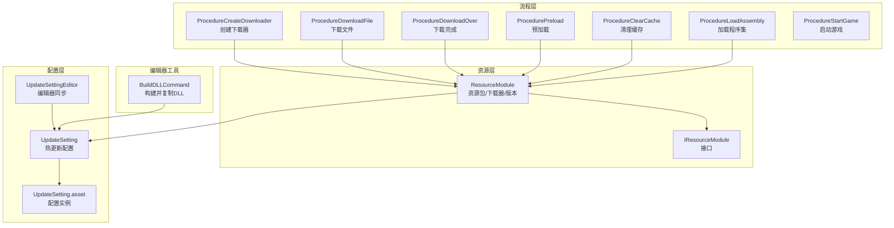
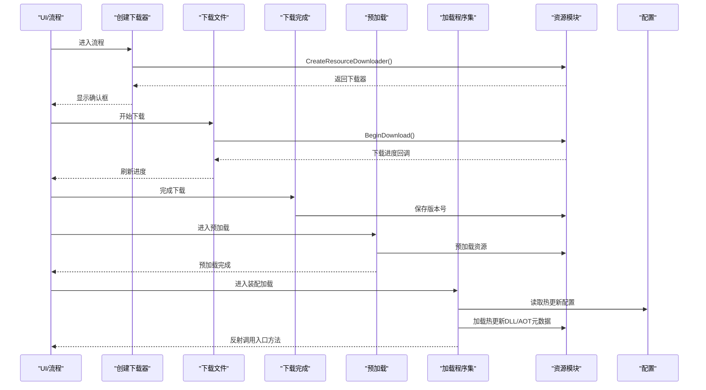
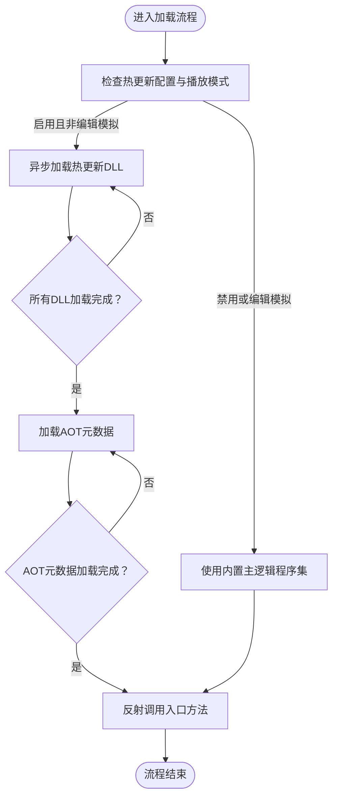
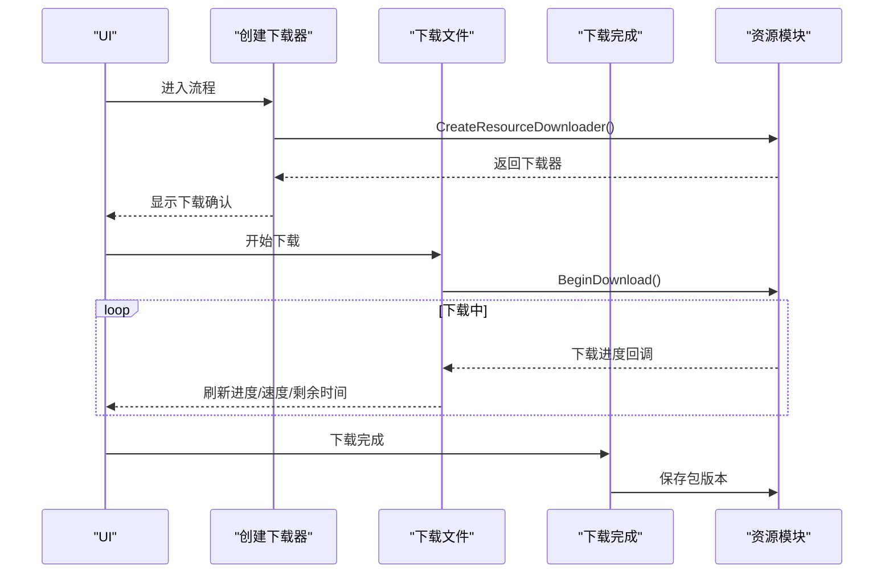
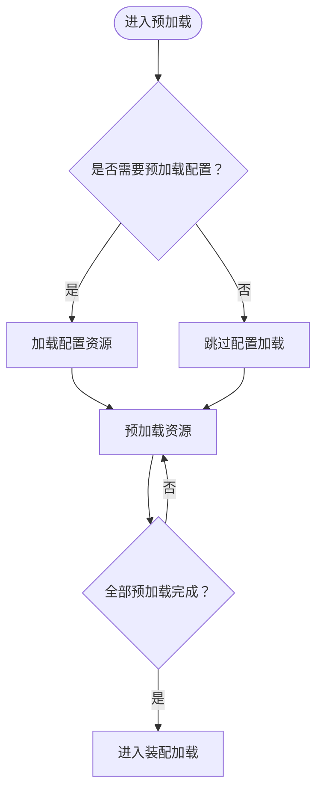
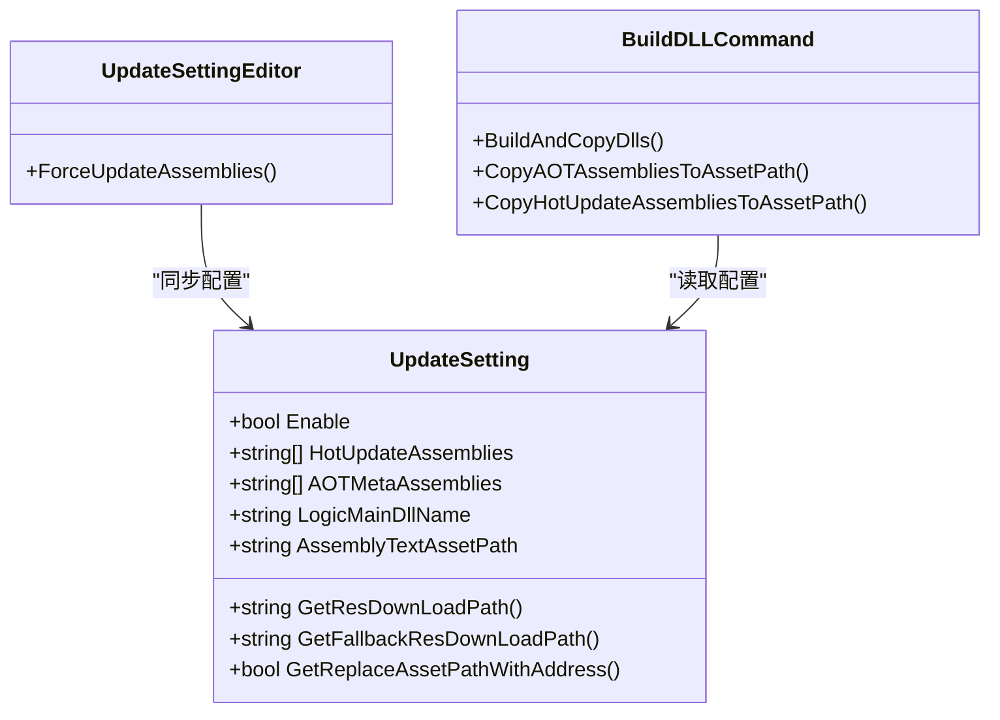
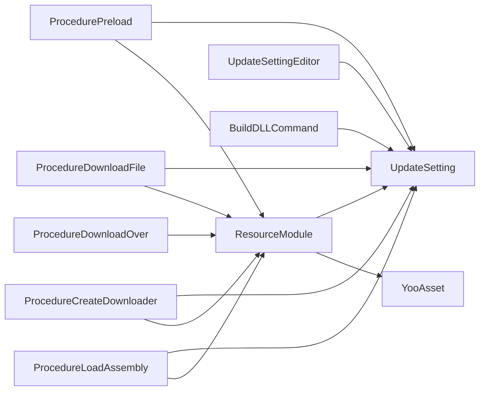

# 热更新开发最佳实践

<cite>
**本文引用的文件**
- [ProcedureLoadAssembly.cs](file://Assets/GameScripts/Procedure/ProcedureLoadAssembly.cs)
- [GameApp.cs](file://Assets/GameScripts/HotFix/GameLogic/GameApp.cs)
- [UpdateSetting.cs](file://Assets/TEngine/Runtime/Core/UpdateSetting.cs)
- [UpdateSetting.asset](file://Assets/TEngine/Settings/UpdateSetting.asset)
- [UpdateSettingEditor.cs](file://Assets/TEngine/Editor/Utility/UpdateSettingEditor.cs)
- [BuildDLLCommand.cs](file://Assets/TEngine/Editor/HybridCLR/BuildDLLCommand.cs)
- [ProcedureCreateDownloader.cs](file://Assets/GameScripts/Procedure/ProcedureCreateDownloader.cs)
- [ProcedureDownloadFile.cs](file://Assets/GameScripts/Procedure/ProcedureDownloadFile.cs)
- [ProcedureDownloadOver.cs](file://Assets/GameScripts/Procedure/ProcedureDownloadOver.cs)
- [ProcedurePreload.cs](file://Assets/GameScripts/Procedure/ProcedurePreload.cs)
- [ProcedureClearCache.cs](file://Assets/GameScripts/Procedure/ProcedureClearCache.cs)
- [ResourceModule.cs](file://Assets/TEngine/Runtime/Module/ResourceModule/ResourceModule.cs)
- [IResourceModule.cs](file://Assets/TEngine/Runtime/Module/ResourceModule/IResourceModule.cs)
- [ResourceExtComponent.cs](file://Assets/TEngine/Runtime/Module/ResourceModule/Extension/ResourceExtComponent.cs)
</cite>

## 目录
1. [简介](#简介)
2. [项目结构](#项目结构)
3. [核心组件](#核心组件)
4. [架构总览](#架构总览)
5. [详细组件分析](#详细组件分析)
6. [依赖关系分析](#依赖关系分析)
7. [性能考虑](#性能考虑)
8. [故障排除指南](#故障排除指南)
9. [结论](#结论)
10. [附录](#附录)

## 简介
本指南面向使用 TEngine 框架进行热更新开发的团队，围绕热更新架构设计、代码分离策略、程序集管理、版本兼容性、开发调试流程、热更新打包与增量更新、安全与完整性校验、回滚机制、性能优化与配置示例展开，帮助开发者构建稳定可靠的热更新系统。

## 项目结构
TEngine 的热更新能力由“流程编排 + 资源模块 + 配置设置 + 编辑器工具”协同实现：
- 流程层：负责下载、预加载、装配加载、启动等阶段化流程。
- 资源层：基于 YooAsset 的资源包与下载器，支持增量更新与多包管理。
- 配置层：UpdateSetting 提供热更新程序集、AOT 元数据、下载地址、WebGL 行为等配置。
- 编辑器层：通过菜单命令与编辑器扩展同步配置到 HybridCLR 设置，保障构建一致性。

图表来源
- [ProcedureCreateDownloader.cs:1-76](file://Assets/GameScripts/Procedure/ProcedureCreateDownloader.cs#L1-L76)
- [ProcedureDownloadFile.cs:1-104](file://Assets/GameScripts/Procedure/ProcedureDownloadFile.cs#L1-L104)
- [ProcedureDownloadOver.cs:1-36](file://Assets/GameScripts/Procedure/ProcedureDownloadOver.cs#L1-L36)
- [ProcedurePreload.cs:1-175](file://Assets/GameScripts/Procedure/ProcedurePreload.cs#L1-L175)
- [ProcedureLoadAssembly.cs:1-294](file://Assets/GameScripts/Procedure/ProcedureLoadAssembly.cs#L1-L294)
- [ProcedureClearCache.cs:1-35](file://Assets/GameScripts/Procedure/ProcedureClearCache.cs#L1-L35)
- [ResourceModule.cs:346-366](file://Assets/TEngine/Runtime/Module/ResourceModule/ResourceModule.cs#L346-L366)
- [IResourceModule.cs:1-54](file://Assets/TEngine/Runtime/Module/ResourceModule/IResourceModule.cs#L1-L54)
- [UpdateSetting.cs:50-220](file://Assets/TEngine/Runtime/Core/UpdateSetting.cs#L50-L220)
- [UpdateSetting.asset:1-37](file://Assets/TEngine/Settings/UpdateSetting.asset#L1-L37)
- [UpdateSettingEditor.cs:1-106](file://Assets/TEngine/Editor/Utility/UpdateSettingEditor.cs#L1-L106)
- [BuildDLLCommand.cs:1-174](file://Assets/TEngine/Editor/HybridCLR/BuildDLLCommand.cs#L1-L174)

章节来源
- [ProcedureLoadAssembly.cs:1-294](file://Assets/GameScripts/Procedure/ProcedureLoadAssembly.cs#L1-L294)
- [UpdateSetting.cs:50-220](file://Assets/TEngine/Runtime/Core/UpdateSetting.cs#L50-L220)
- [ResourceModule.cs:346-366](file://Assets/TEngine/Runtime/Module/ResourceModule/ResourceModule.cs#L346-L366)

## 核心组件
- 程序集加载流程：在加载阶段异步拉取热更新 DLL 与 AOT 元数据，完成后反射调用入口方法启动业务逻辑。
- 资源下载与版本：通过资源模块创建下载器，按需下载增量资源；下载完成后持久化版本号。
- 预加载与装配：下载完成后进行预加载，随后进入装配加载阶段。
- 配置中心：集中管理热更新程序集、AOT 元数据、下载地址、WebGL 行为等。
- 编辑器同步：编辑器中修改配置后自动同步到 HybridCLR 设置，保证构建一致性。

章节来源
- [ProcedureLoadAssembly.cs:50-108](file://Assets/GameScripts/Procedure/ProcedureLoadAssembly.cs#L50-L108)
- [ProcedureDownloadFile.cs:49-64](file://Assets/GameScripts/Procedure/ProcedureDownloadFile.cs#L49-L64)
- [ProcedureDownloadOver.cs:20-22](file://Assets/GameScripts/Procedure/ProcedureDownloadOver.cs#L20-L22)
- [ProcedurePreload.cs:118-150](file://Assets/GameScripts/Procedure/ProcedurePreload.cs#L118-L150)
- [UpdateSetting.cs:59-90](file://Assets/TEngine/Runtime/Core/UpdateSetting.cs#L59-L90)
- [UpdateSettingEditor.cs:27-71](file://Assets/TEngine/Editor/Utility/UpdateSettingEditor.cs#L27-L71)
- [BuildDLLCommand.cs:104-134](file://Assets/TEngine/Editor/HybridCLR/BuildDLLCommand.cs#L104-L134)

## 架构总览
热更新系统采用“流程驱动 + 资源驱动”的双引擎架构：
- 流程引擎：以状态机推进下载、预加载、装配、启动等步骤。
- 资源引擎：以 YooAsset 为核心，统一管理资源包、版本、下载与缓存。
- 配置引擎：以 UpdateSetting 为中心，贯穿编辑器与运行时，确保构建与运行一致。

图表来源
- [ProcedureCreateDownloader.cs:41-69](file://Assets/GameScripts/Procedure/ProcedureCreateDownloader.cs#L41-L69)
- [ProcedureDownloadFile.cs:49-64](file://Assets/GameScripts/Procedure/ProcedureDownloadFile.cs#L49-L64)
- [ProcedureDownloadOver.cs:20-22](file://Assets/GameScripts/Procedure/ProcedureDownloadOver.cs#L20-L22)
- [ProcedurePreload.cs:118-150](file://Assets/GameScripts/Procedure/ProcedurePreload.cs#L118-L150)
- [ProcedureLoadAssembly.cs:50-108](file://Assets/GameScripts/Procedure/ProcedureLoadAssembly.cs#L50-L108)
- [ResourceModule.cs:352-366](file://Assets/TEngine/Runtime/Module/ResourceModule/ResourceModule.cs#L352-L366)
- [UpdateSetting.cs:59-90](file://Assets/TEngine/Runtime/Core/UpdateSetting.cs#L59-L90)

## 详细组件分析

### 程序集加载流程（ProcedureLoadAssembly）
职责与流程要点：
- 条件加载：根据配置决定是否启用热更新与 AOT 元数据加载。
- 异步加载：对每个热更新 DLL 与 AOT 元数据进行异步加载，并统计完成状态。
- 反射入口：在主逻辑程序集上定位入口类型与方法，传递热更新程序集列表作为参数，启动业务逻辑。
- 错误处理：捕获加载异常并记录致命日志，防止脏状态继续执行。

图表来源
- [ProcedureLoadAssembly.cs:50-108](file://Assets/GameScripts/Procedure/ProcedureLoadAssembly.cs#L50-L108)
- [ProcedureLoadAssembly.cs:124-150](file://Assets/GameScripts/Procedure/ProcedureLoadAssembly.cs#L124-L150)
- [ProcedureLoadAssembly.cs:185-218](file://Assets/GameScripts/Procedure/ProcedureLoadAssembly.cs#L185-L218)
- [ProcedureLoadAssembly.cs:224-292](file://Assets/GameScripts/Procedure/ProcedureLoadAssembly.cs#L224-L292)

章节来源
- [ProcedureLoadAssembly.cs:50-108](file://Assets/GameScripts/Procedure/ProcedureLoadAssembly.cs#L50-L108)
- [ProcedureLoadAssembly.cs:124-150](file://Assets/GameScripts/Procedure/ProcedureLoadAssembly.cs#L124-L150)
- [ProcedureLoadAssembly.cs:185-218](file://Assets/GameScripts/Procedure/ProcedureLoadAssembly.cs#L185-L218)
- [ProcedureLoadAssembly.cs:224-292](file://Assets/GameScripts/Procedure/ProcedureLoadAssembly.cs#L224-L292)

### 资源下载与版本管理（ProcedureCreateDownloader / ProcedureDownloadFile / ProcedureDownloadOver）
职责与流程要点：
- 创建下载器：根据当前资源包版本与清单，创建下载器并统计待下载数量与总大小。
- 下载进度：注册回调，实时刷新 UI 并计算平均速度与剩余时间。
- 版本持久化：下载完成后将包版本写入本地偏好设置，作为后续版本对比依据。

图表来源
- [ProcedureCreateDownloader.cs:41-69](file://Assets/GameScripts/Procedure/ProcedureCreateDownloader.cs#L41-L69)
- [ProcedureDownloadFile.cs:49-90](file://Assets/GameScripts/Procedure/ProcedureDownloadFile.cs#L49-L90)
- [ProcedureDownloadOver.cs:20-22](file://Assets/GameScripts/Procedure/ProcedureDownloadOver.cs#L20-L22)
- [ResourceModule.cs:352-366](file://Assets/TEngine/Runtime/Module/ResourceModule/ResourceModule.cs#L352-L366)

章节来源
- [ProcedureCreateDownloader.cs:41-69](file://Assets/GameScripts/Procedure/ProcedureCreateDownloader.cs#L41-L69)
- [ProcedureDownloadFile.cs:49-90](file://Assets/GameScripts/Procedure/ProcedureDownloadFile.cs#L49-L90)
- [ProcedureDownloadOver.cs:20-22](file://Assets/GameScripts/Procedure/ProcedureDownloadOver.cs#L20-L22)
- [ResourceModule.cs:352-366](file://Assets/TEngine/Runtime/Module/ResourceModule/ResourceModule.cs#L352-L366)

### 预加载与装配（ProcedurePreload / ProcedureLoadAssembly）
职责与流程要点：
- 预加载：在下载完成后对关键资源进行预加载，提升首帧体验。
- 装配加载：在预加载完成后进入装配加载阶段，加载热更新 DLL 与 AOT 元数据，最终反射调用入口方法。

图表来源
- [ProcedurePreload.cs:118-150](file://Assets/GameScripts/Procedure/ProcedurePreload.cs#L118-L150)
- [ProcedurePreload.cs:170-173](file://Assets/GameScripts/Procedure/ProcedurePreload.cs#L170-L173)
- [ProcedureLoadAssembly.cs:124-150](file://Assets/GameScripts/Procedure/ProcedureLoadAssembly.cs#L124-L150)

章节来源
- [ProcedurePreload.cs:118-150](file://Assets/GameScripts/Procedure/ProcedurePreload.cs#L118-L150)
- [ProcedurePreload.cs:170-173](file://Assets/GameScripts/Procedure/ProcedurePreload.cs#L170-L173)
- [ProcedureLoadAssembly.cs:124-150](file://Assets/GameScripts/Procedure/ProcedureLoadAssembly.cs#L124-L150)

### 配置与编辑器同步（UpdateSetting / UpdateSettingEditor / BuildDLLCommand）
职责与流程要点：
- UpdateSetting：集中管理热更新程序集、AOT 元数据、下载地址、WebGL 行为等。
- UpdateSettingEditor：在编辑器中修改配置后自动同步到 HybridCLR 设置，确保构建一致性。
- BuildDLLCommand：构建 DLL 并将 AOT 与热更新程序集复制到资源路径，供运行时加载。

图表来源
- [UpdateSetting.cs:59-90](file://Assets/TEngine/Runtime/Core/UpdateSetting.cs#L59-L90)
- [UpdateSettingEditor.cs:44-70](file://Assets/TEngine/Editor/Utility/UpdateSettingEditor.cs#L44-L70)
- [BuildDLLCommand.cs:104-134](file://Assets/TEngine/Editor/HybridCLR/BuildDLLCommand.cs#L104-L134)

章节来源
- [UpdateSetting.cs:59-90](file://Assets/TEngine/Runtime/Core/UpdateSetting.cs#L59-L90)
- [UpdateSettingEditor.cs:44-70](file://Assets/TEngine/Editor/Utility/UpdateSettingEditor.cs#L44-L70)
- [BuildDLLCommand.cs:104-134](file://Assets/TEngine/Editor/HybridCLR/BuildDLLCommand.cs#L104-L134)

### 入口与生命周期（GameApp）
职责与流程要点：
- 入口方法：接收热更新程序集列表，初始化事件系统与单例，触发 UI 展示等业务逻辑。
- 生命周期：在销毁时释放单例与资源，确保热更新域内的资源得到正确回收。

章节来源
- [GameApp.cs:25-46](file://Assets/GameScripts/HotFix/GameLogic/GameApp.cs#L25-L46)

## 依赖关系分析
- 流程层依赖资源模块：下载器、版本查询、预加载均来自资源模块。
- 资源模块依赖 YooAsset：初始化、清单更新、下载器创建、缓存清理等。
- 配置层贯穿编辑器与运行时：编辑器修改配置后同步到 HybridCLR 设置，运行时读取配置决定加载策略。
- 程序集加载依赖反射：在主逻辑程序集上定位入口类型与方法，传递热更新程序集列表。

图表来源
- [ProcedureLoadAssembly.cs:36-40](file://Assets/GameScripts/Procedure/ProcedureLoadAssembly.cs#L36-L40)
- [ResourceModule.cs:119-125](file://Assets/TEngine/Runtime/Module/ResourceModule/ResourceModule.cs#L119-L125)
- [UpdateSetting.cs:59-90](file://Assets/TEngine/Runtime/Core/UpdateSetting.cs#L59-L90)
- [UpdateSettingEditor.cs:44-70](file://Assets/TEngine/Editor/Utility/UpdateSettingEditor.cs#L44-L70)
- [BuildDLLCommand.cs:104-134](file://Assets/TEngine/Editor/HybridCLR/BuildDLLCommand.cs#L104-L134)

章节来源
- [ProcedureLoadAssembly.cs:36-40](file://Assets/GameScripts/Procedure/ProcedureLoadAssembly.cs#L36-L40)
- [ResourceModule.cs:119-125](file://Assets/TEngine/Runtime/Module/ResourceModule/ResourceModule.cs#L119-L125)
- [UpdateSetting.cs:59-90](file://Assets/TEngine/Runtime/Core/UpdateSetting.cs#L59-L90)
- [UpdateSettingEditor.cs:44-70](file://Assets/TEngine/Editor/Utility/UpdateSettingEditor.cs#L44-L70)
- [BuildDLLCommand.cs:104-134](file://Assets/TEngine/Editor/HybridCLR/BuildDLLCommand.cs#L104-L134)

## 性能考虑
- 加载速度优化
  - 使用可寻址资源代替资源路径：降低运行时清单内存占用，提高资源定位效率。
  - 控制同时下载数量与失败重试次数：平衡下载速度与稳定性。
  - 预加载关键资源：减少首帧等待时间。
- 内存占用控制
  - 分帧回收：资源扩展组件采用分帧处理回收无引用缓存资产，避免卡顿。
  - 低内存回调：提供低内存保护，触发强制卸载未使用资源。
  - 清理缓存：下载完成后清理未使用缓存文件，释放存储空间。
- 启动时间优化
  - 将热更新程序集与 AOT 元数据并行加载，缩短装配时间。
  - 在编辑模式下使用内置主逻辑程序集，避免不必要的网络与 IO。

章节来源
- [UpdateSetting.cs:127-154](file://Assets/TEngine/Runtime/Core/UpdateSetting.cs#L127-L154)
- [ResourceModule.cs:346-366](file://Assets/TEngine/Runtime/Module/ResourceModule/ResourceModule.cs#L346-L366)
- [ResourceModule.cs:412-447](file://Assets/TEngine/Runtime/Module/ResourceModule/ResourceModule.cs#L412-L447)
- [ResourceExtComponent.cs:109-126](file://Assets/TEngine/Runtime/Module/ResourceModule/Extension/ResourceExtComponent.cs#L109-L126)
- [ProcedurePreload.cs:118-150](file://Assets/GameScripts/Procedure/ProcedurePreload.cs#L118-L150)
- [ProcedureLoadAssembly.cs:56-68](file://Assets/GameScripts/Procedure/ProcedureLoadAssembly.cs#L56-L68)

## 故障排除指南
- 程序集加载失败
  - 现象：日志出现加载失败与致命错误。
  - 排查：确认热更新 DLL 与 AOT 元数据路径与扩展名配置正确；检查构建后是否已复制到资源路径。
  - 参考：[ProcedureLoadAssembly.cs:185-218](file://Assets/GameScripts/Procedure/ProcedureLoadAssembly.cs#L185-L218)
- AOT 元数据加载异常
  - 现象：AOT 元数据加载返回错误或解释执行。
  - 排查：确认裁剪后的 AOT DLL 已在构建后生成并复制到资源路径；检查元数据模式与目标 DLL 一致性。
  - 参考：[ProcedureLoadAssembly.cs:224-292](file://Assets/GameScripts/Procedure/ProcedureLoadAssembly.cs#L224-L292)
- 下载失败或断点
  - 现象：下载回调报告错误或进度停滞。
  - 排查：检查下载地址、网络连通性与权限；查看失败重试次数与最大并发；必要时切换备用地址。
  - 参考：[ProcedureDownloadFile.cs:66-70](file://Assets/GameScripts/Procedure/ProcedureDownloadFile.cs#L66-L70)
- 版本不一致
  - 现象：下载完成后版本未更新或无法进入游戏。
  - 排查：确认下载完成后已保存包版本；检查更新策略与提示设置。
  - 参考：[ProcedureDownloadOver.cs:20-22](file://Assets/GameScripts/Procedure/ProcedureDownloadOver.cs#L20-L22)
- 配置不同步
  - 现象：编辑器修改配置后构建不生效。
  - 排查：使用编辑器同步功能将配置写入 HybridCLR 设置；确认宏定义与构建目标一致。
  - 参考：[UpdateSettingEditor.cs:44-70](file://Assets/TEngine/Editor/Utility/UpdateSettingEditor.cs#L44-L70), [BuildDLLCommand.cs:104-134](file://Assets/TEngine/Editor/HybridCLR/BuildDLLCommand.cs#L104-L134)

章节来源
- [ProcedureLoadAssembly.cs:185-218](file://Assets/GameScripts/Procedure/ProcedureLoadAssembly.cs#L185-L218)
- [ProcedureLoadAssembly.cs:224-292](file://Assets/GameScripts/Procedure/ProcedureLoadAssembly.cs#L224-L292)
- [ProcedureDownloadFile.cs:66-70](file://Assets/GameScripts/Procedure/ProcedureDownloadFile.cs#L66-L70)
- [ProcedureDownloadOver.cs:20-22](file://Assets/GameScripts/Procedure/ProcedureDownloadOver.cs#L20-L22)
- [UpdateSettingEditor.cs:44-70](file://Assets/TEngine/Editor/Utility/UpdateSettingEditor.cs#L44-L70)
- [BuildDLLCommand.cs:104-134](file://Assets/TEngine/Editor/HybridCLR/BuildDLLCommand.cs#L104-L134)

## 结论
TEngine 的热更新体系通过清晰的流程编排、完善的资源管理与集中配置，实现了从下载、预加载到装配与启动的全链路闭环。结合性能优化与故障排查建议，可显著提升热更新系统的稳定性与用户体验。建议在实际项目中严格遵循代码分离、版本兼容与安全校验的最佳实践，持续完善增量策略与回滚机制。

## 附录
- 热更新配置示例（节选）
  - 热更新程序集：参见 [UpdateSetting.asset:16-18](file://Assets/TEngine/Settings/UpdateSetting.asset#L16-L18)
  - AOT 元数据程序集：参见 [UpdateSetting.asset:19-26](file://Assets/TEngine/Settings/UpdateSetting.asset#L19-L26)
  - 主业务逻辑程序集名称：参见 [UpdateSetting.asset](file://Assets/TEngine/Settings/UpdateSetting.asset#L27)
  - 程序集文本资产路径与扩展名：参见 [UpdateSetting.asset:28-29](file://Assets/TEngine/Settings/UpdateSetting.asset#L28-L29)
  - 资源下载地址与备用地址：参见 [UpdateSetting.asset:32-33](file://Assets/TEngine/Settings/UpdateSetting.asset#L32-L33)
  - WebGL 加载方式：参见 [UpdateSetting.asset](file://Assets/TEngine/Settings/UpdateSetting.asset#L34)
  - 自动复制资源到构建地址：参见 [UpdateSetting.asset:35-36](file://Assets/TEngine/Settings/UpdateSetting.asset#L35-L36)
- 热更新开发流程
  - 编辑器配置同步：参见 [UpdateSettingEditor.cs:44-70](file://Assets/TEngine/Editor/Utility/UpdateSettingEditor.cs#L44-L70)
  - 构建并复制 DLL：参见 [BuildDLLCommand.cs:104-134](file://Assets/TEngine/Editor/HybridCLR/BuildDLLCommand.cs#L104-L134)
  - 下载与版本：参见 [ProcedureCreateDownloader.cs:41-69](file://Assets/GameScripts/Procedure/ProcedureCreateDownloader.cs#L41-L69), [ProcedureDownloadFile.cs:49-90](file://Assets/GameScripts/Procedure/ProcedureDownloadFile.cs#L49-L90), [ProcedureDownloadOver.cs:20-22](file://Assets/GameScripts/Procedure/ProcedureDownloadOver.cs#L20-L22)
  - 预加载与装配：参见 [ProcedurePreload.cs:118-150](file://Assets/GameScripts/Procedure/ProcedurePreload.cs#L118-L150), [ProcedureLoadAssembly.cs:50-108](file://Assets/GameScripts/Procedure/ProcedureLoadAssembly.cs#L50-L108)
- 安全与完整性校验（建议）
  - 代码签名与完整性校验：建议在构建阶段对 DLL 进行签名，在运行时进行哈希校验与白名单比对。
  - 回滚机制：建议在下载完成后先写入临时版本，成功启动后再提交版本；失败则回退到上一版本。
  - 网络安全：建议在资源服务器端启用鉴权与 HTTPS，配合自定义授权头进行访问控制。
- 性能优化清单
  - 并行加载：热更新 DLL 与 AOT 元数据并行加载，缩短装配时间。
  - 预加载策略：仅预加载关键资源，避免过度占用内存。
  - 缓存清理：下载完成后清理未使用缓存文件，释放存储空间。
  - 低内存保护：在低内存场景触发强制卸载未使用资源，避免崩溃。