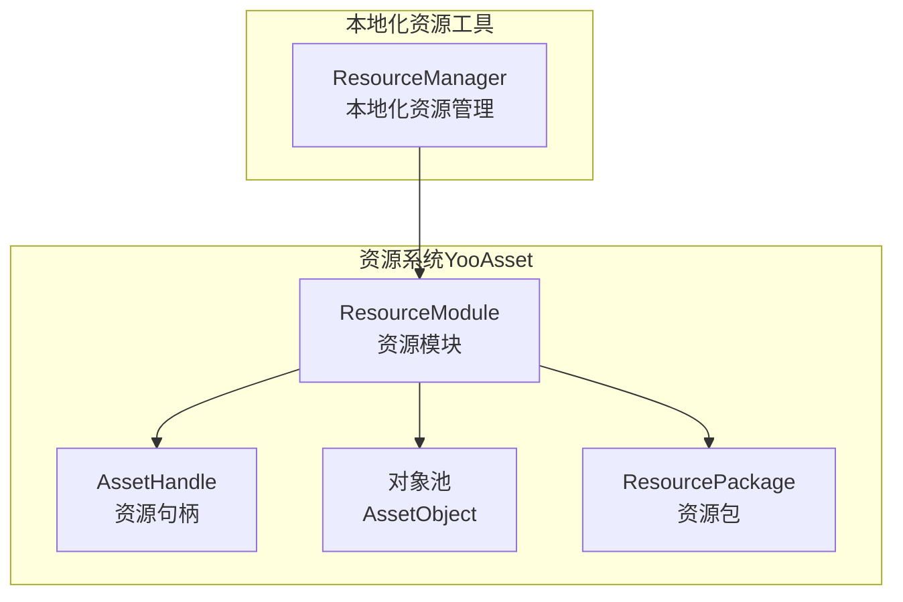
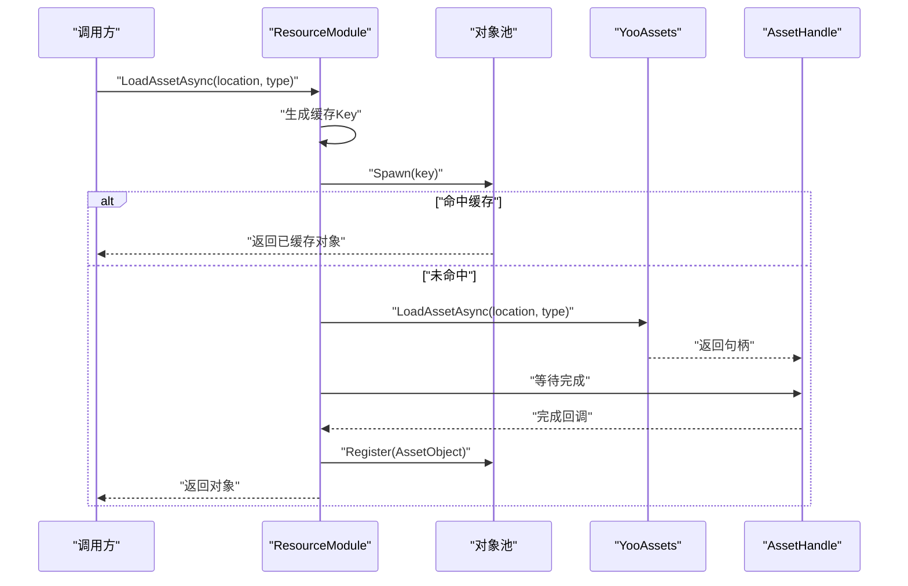
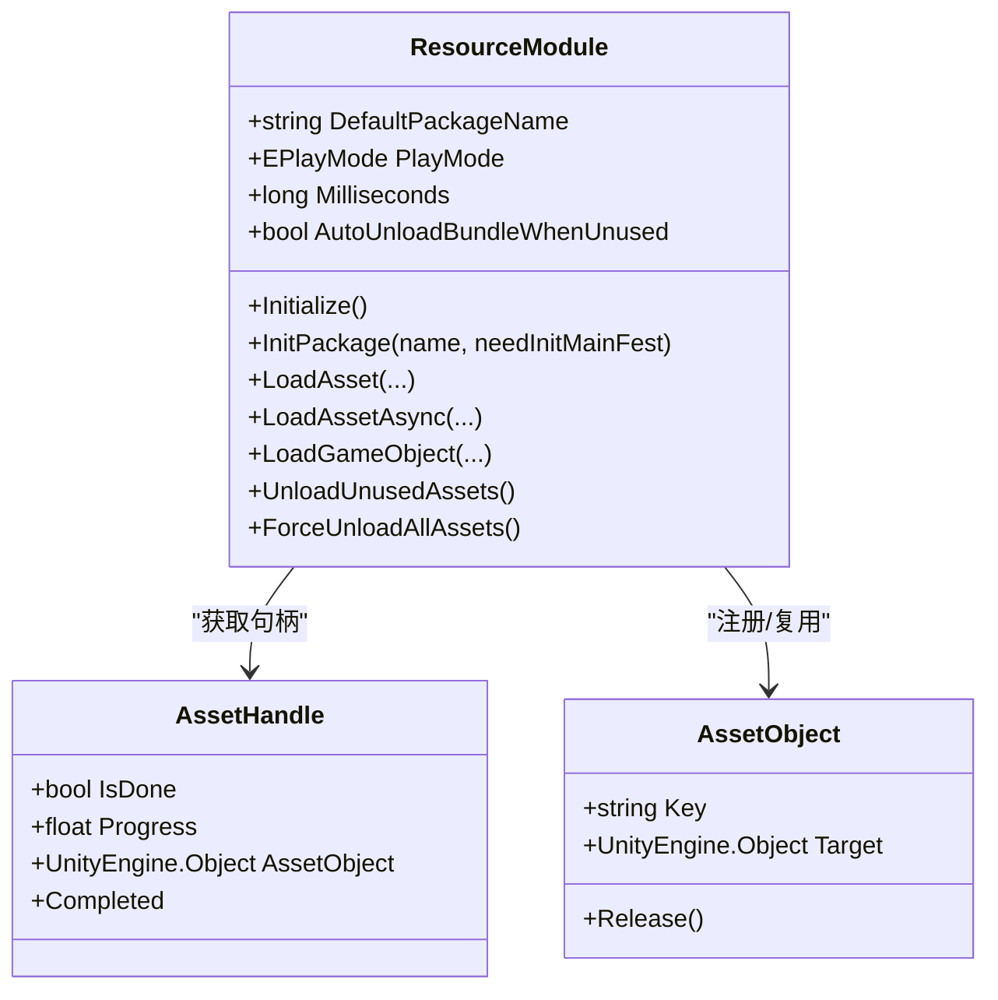
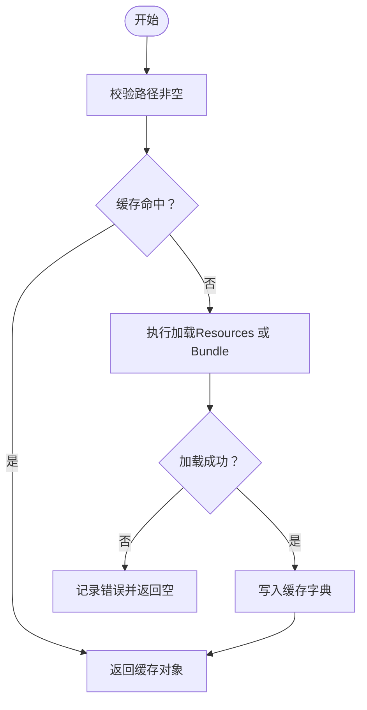
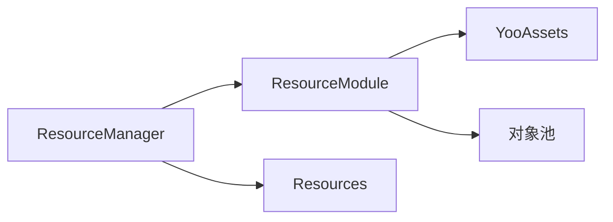

# 资源管理最佳实践

<cite>
**本文档引用的文件**
- [ResourceModule.cs](file://Assets/TEngine/Runtime/Module/ResourceModule/ResourceModule.cs)
- [LoadAssetCallbacks.cs](file://Assets/TEngine/Runtime/Module/ResourceModule/Callback/LoadAssetCallbacks.cs)
- [LoadSceneCallbacks.cs](file://Assets/TEngine/Runtime/Module/ResourceModule/Callback/LoadSceneCallbacks.cs)
- [AssetItemObject.cs](file://Assets/TEngine/Runtime/Module/ResourceModule/Extension/AssetItemObject.cs)
- [ResourceManager.cs](file://Assets/TEngine/Runtime/Module/LocalizationModule/Core/Utils/ResourceManager.cs)
- [ProcedureInitResources.cs](file://Assets/GameScripts/Procedure/ProcedureInitResources.cs)
</cite>

## 目录
1. [简介](#简介)
2. [项目结构](#项目结构)
3. [核心组件](#核心组件)
4. [架构总览](#架构总览)
5. [详细组件分析](#详细组件分析)
6. [依赖关系分析](#依赖关系分析)
7. [性能考量](#性能考量)
8. [故障排查指南](#故障排查指南)
9. [结论](#结论)
10. [附录](#附录)

## 简介
本指南面向TEngine框架的资源管理，围绕资源加载策略（异步/预加载/按需）、缓存与复用、生命周期与引用计数、优化策略（纹理/模型/音频）以及配置与监控方法，提供可落地的最佳实践。文档以仓库中的实际实现为依据，结合流程图与序列图，帮助开发者构建高效稳定的资源系统。

## 项目结构
TEngine的资源管理由两部分组成：
- 基于YooAsset的现代资源系统：负责包管理、异步加载、缓存、下载与卸载等。
- 本地化资源工具：提供Resources目录与Bundle的双通道加载与缓存清理。

图表来源
- [ResourceModule.cs:17-138](file://Assets/TEngine/Runtime/Module/ResourceModule/ResourceModule.cs#L17-L138)
- [ResourceManager.cs:14-186](file://Assets/TEngine/Runtime/Module/LocalizationModule/Core/Utils/ResourceManager.cs#L14-L186)

章节来源
- [ResourceModule.cs:17-138](file://Assets/TEngine/Runtime/Module/ResourceModule/ResourceModule.cs#L17-L138)
- [ResourceManager.cs:14-186](file://Assets/TEngine/Runtime/Module/LocalizationModule/Core/Utils/ResourceManager.cs#L14-L186)

## 核心组件
- 资源模块（ResourceModule）
  - 支持多运行模式（编辑器模拟、单机、主机、WebGL），初始化资源包与下载器。
  - 提供同步/异步加载接口，统一缓存与对象池复用。
  - 提供低内存回收、强制卸载、缓存清理等生命周期管理能力。
- 回调封装（LoadAssetCallbacks/LoadSceneCallbacks）
  - 将成功/失败/进度回调聚合，便于上层统一处理。
- 本地化资源工具（ResourceManager）
  - 提供Resources目录与Bundle双通道加载，内置帧内缓存避免重复加载。
- 资源项释放（AssetItemObject）
  - 在对象销毁时自动触发资源卸载，保障引用计数与内存回收。

章节来源
- [ResourceModule.cs:624-1025](file://Assets/TEngine/Runtime/Module/ResourceModule/ResourceModule.cs#L624-L1025)
- [LoadAssetCallbacks.cs:6-91](file://Assets/TEngine/Runtime/Module/ResourceModule/Callback/LoadAssetCallbacks.cs#L6-L91)
- [LoadSceneCallbacks.cs:6-91](file://Assets/TEngine/Runtime/Module/ResourceModule/Callback/LoadSceneCallbacks.cs#L6-L91)
- [AssetItemObject.cs:3-20](file://Assets/TEngine/Runtime/Module/ResourceModule/Extension/AssetItemObject.cs#L3-L20)
- [ResourceManager.cs:14-186](file://Assets/TEngine/Runtime/Module/LocalizationModule/Core/Utils/ResourceManager.cs#L14-L186)

## 架构总览
下图展示资源加载与缓存的关键交互：

图表来源
- [ResourceModule.cs:769-821](file://Assets/TEngine/Runtime/Module/ResourceModule/ResourceModule.cs#L769-L821)
- [ResourceModule.cs:828-869](file://Assets/TETEngine/Runtime/Module/ResourceModule/ResourceModule.cs#L828-L869)
- [ResourceModule.cs:933-1025](file://Assets/TEngine/Runtime/Module/ResourceModule/ResourceModule.cs#L933-L1025)

## 详细组件分析

### 组件A：资源模块（ResourceModule）
- 设计要点
  - 多运行模式初始化：根据运行环境选择文件系统参数，设置解密服务与自动卸载策略。
  - 异步加载管线：统一通过YooAssets获取AssetHandle，完成后注册到对象池并返回。
  - 缓存与并发：基于location+package组合的缓存Key，避免重复加载；对同一资源加载进行排队等待。
  - 生命周期：提供低内存回调、强制卸载、清理未使用资源等。
- 关键接口
  - 初始化与包管理：Initialize、InitPackage、GetPackageVersion、UpdatePackageManifestAsync、CreateResourceDownloader、ClearCacheFilesAsync。
  - 加载接口：LoadAsset、LoadAssetAsync、LoadGameObject、LoadGameObjectAsync、LoadAssetAsync（回调版）。
  - 回收与卸载：UnloadUnusedAssets、ForceUnloadAllAssets、ForceUnloadUnusedAssets。
- 性能与复杂度
  - 缓存命中为O(1)，未命中需等待异步句柄完成，整体吞吐受下载与解码速度影响。
  - 对象池减少GC压力，建议配合引用计数与显式释放策略。

图表来源
- [ResourceModule.cs:17-138](file://Assets/TEngine/Runtime/Module/ResourceModule/ResourceModule.cs#L17-L138)
- [ResourceModule.cs:624-1025](file://Assets/TEngine/Runtime/Module/ResourceModule/ResourceModule.cs#L624-L1025)

章节来源
- [ResourceModule.cs:17-138](file://Assets/TEngine/Runtime/Module/ResourceModule/ResourceModule.cs#L17-L138)
- [ResourceModule.cs:624-1025](file://Assets/TEngine/Runtime/Module/ResourceModule/ResourceModule.cs#L624-L1025)
- [ResourceModule.cs:1027-1145](file://Assets/TEngine/Runtime/Module/ResourceModule/ResourceModule.cs#L1027-L1145)

### 组件B：回调封装（LoadAssetCallbacks/LoadSceneCallbacks）
- 设计要点
  - 将成功、失败、更新三类回调聚合，避免上层分散处理。
  - 场景加载与资源加载采用相同回调契约，便于统一逻辑。
- 使用建议
  - 成功回调中进行实例化与初始化；失败回调中记录日志与重试策略；更新回调中驱动进度UI。

章节来源
- [LoadAssetCallbacks.cs:6-91](file://Assets/TEngine/Runtime/Module/ResourceModule/Callback/LoadAssetCallbacks.cs#L6-L91)
- [LoadSceneCallbacks.cs:6-91](file://Assets/TEngine/Runtime/Module/ResourceModule/Callback/LoadSceneCallbacks.cs#L6-L91)

### 组件C：本地化资源工具（ResourceManager）
- 设计要点
  - 提供Resources与Bundle双通道加载，内置帧内缓存字典，避免重复调用Resources.Load。
  - 支持场景切换时清理缓存与卸载未使用资源。
- 最佳实践
  - 预热常用字体/图集；在场景切换或进入新关卡前调用清理接口。
  - 对多子图集加载（Sprite[Name]）进行兼容处理。

图表来源
- [ResourceManager.cs:103-160](file://Assets/TEngine/Runtime/Module/LocalizationModule/Core/Utils/ResourceManager.cs#L103-L160)

章节来源
- [ResourceManager.cs:103-160](file://Assets/TEngine/Runtime/Module/LocalizationModule/Core/Utils/ResourceManager.cs#L103-L160)
- [ResourceManager.cs:174-182](file://Assets/TEngine/Runtime/Module/LocalizationModule/Core/Utils/ResourceManager.cs#L174-L182)

### 组件D：资源项释放（AssetItemObject）
- 设计要点
  - 在对象释放时自动调用资源模块卸载目标对象，确保引用计数与内存及时回收。
- 使用建议
  - 所有通过模块创建的资源对象应交由模块管理生命周期，避免直接持有裸引用。

章节来源
- [AssetItemObject.cs:3-20](file://Assets/TEngine/Runtime/Module/ResourceModule/Extension/AssetItemObject.cs#L3-L20)

## 依赖关系分析
- ResourceModule依赖YooAssets进行包管理与句柄获取；依赖对象池进行缓存与复用。
- 本地化ResourceManager作为独立工具，可与ResourceModule并行使用。
- 回调封装与资源模块强耦合，保证加载流程的一致性。

图表来源
- [ResourceModule.cs:17-138](file://Assets/TEngine/Runtime/Module/ResourceModule/ResourceModule.cs#L17-L138)
- [ResourceManager.cs:14-186](file://Assets/TEngine/Runtime/Module/LocalizationModule/Core/Utils/ResourceManager.cs#L14-L186)

章节来源
- [ResourceModule.cs:17-138](file://Assets/TEngine/Runtime/Module/ResourceModule/ResourceModule.cs#L17-L138)
- [ResourceManager.cs:14-186](file://Assets/TEngine/Runtime/Module/LocalizationModule/Core/Utils/ResourceManager.cs#L14-L186)

## 性能考量
- 异步加载与时间片
  - 通过设置每帧最大时间切片，平衡主线程卡顿与加载效率。
  - 建议在空闲时段或场景切换时进行批量异步加载。
- 缓存与复用
  - 利用模块内置缓存与对象池，避免重复分配与GC。
  - 对高频资源（字体、UI图集、预制体）进行预热。
- 并发与排队
  - 对同一资源的并发加载进行排队等待，避免重复IO与解码。
- 内存回收
  - 定期调用低内存回收与清理未使用资源；在场景切换时主动释放。
- 下载与解密
  - 根据平台选择合适的文件系统参数与解密服务，减少首帧阻塞。

章节来源
- [ResourceModule.cs:34-45](file://Assets/TEngine/Runtime/Module/ResourceModule/ResourceModule.cs#L34-L45)
- [ResourceModule.cs:1197-1219](file://Assets/TEngine/Runtime/Module/ResourceModule/ResourceModule.cs#L1197-L1219)
- [ResourceModule.cs:392-447](file://Assets/TEngine/Runtime/Module/ResourceModule/ResourceModule.cs#L392-L447)

## 故障排查指南
- 资源定位无效
  - 现象：返回“未找到定位地址”或HasAsset返回不存在。
  - 排查：确认资源定位字符串正确，检查包名与资源映射。
- 加载失败或超时
  - 现象：回调返回NotReady或抛出异常；异步等待超时。
  - 排查：检查网络/磁盘权限、包版本更新、重试次数与超时阈值。
- 缓存未生效
  - 现象：重复加载导致抖动。
  - 排查：确认缓存Key生成规则一致（location+package），避免并发竞态。
- 内存泄漏
  - 现象：长时间运行后内存持续增长。
  - 排查：确保资源对象释放时触发卸载；定期调用低内存回收。

章节来源
- [ResourceModule.cs:699-702](file://Assets/TEngine/Runtime/Module/ResourceModule/ResourceModule.cs#L699-L702)
- [ResourceModule.cs:782-787](file://Assets/TEngine/Runtime/Module/ResourceModule/ResourceModule.cs#L782-L787)
- [ResourceModule.cs:1197-1219](file://Assets/TEngine/Runtime/Module/ResourceModule/ResourceModule.cs#L1197-L1219)
- [AssetItemObject.cs:12-19](file://Assets/TEngine/Runtime/Module/ResourceModule/Extension/AssetItemObject.cs#L12-L19)

## 结论
TEngine的资源管理以YooAsset为核心，结合对象池与回调封装，提供了完善的异步加载、缓存与生命周期管理能力。通过合理的预加载策略、缓存与复用、内存回收与优化手段，可在多平台上获得稳定高效的资源体验。建议在项目中建立统一的资源命名规范、包版本管理与监控体系，持续迭代优化。

## 附录

### 资源加载策略最佳实践
- 异步加载模式
  - 首帧后异步预加载高频资源；空闲时段批量加载。
  - 使用回调/UniTask两种模式，按场景需求选择。
- 预加载策略
  - 场景切换前预热UI图集、角色模型与音效。
  - 使用包版本更新与清单刷新，确保资源一致性。
- 按需加载时机
  - 进入关卡或功能模块时再加载该模块专属资源。
  - 对大资源（如长视频、大贴图）采用延迟加载与分块加载。

章节来源
- [ResourceModule.cs:769-821](file://Assets/TEngine/Runtime/Module/ResourceModule/ResourceModule.cs#L769-L821)
- [ResourceModule.cs:828-869](file://Assets/TEngine/Runtime/Module/ResourceModule/ResourceModule.cs#L828-L869)
- [ResourceModule.cs:933-1025](file://Assets/TEngine/Runtime/Module/ResourceModule/ResourceModule.cs#L933-L1025)

### 资源缓存管理最佳实践
- 内存限制
  - 设置每帧时间片，避免主线程卡顿；在低内存事件中触发回收。
- 缓存淘汰
  - 未使用资源定期清理；场景切换时清理缓存字典。
- 资源复用
  - 通过对象池与缓存Key复用，减少GC与重复加载。

章节来源
- [ResourceModule.cs:34-45](file://Assets/TEngine/Runtime/Module/ResourceModule/ResourceModule.cs#L34-L45)
- [ResourceModule.cs:392-447](file://Assets/TEngine/Runtime/Module/ResourceModule/ResourceModule.cs#L392-L447)
- [ResourceManager.cs:103-160](file://Assets/TEngine/Runtime/Module/LocalizationModule/Core/Utils/ResourceManager.cs#L103-L160)

### 资源生命周期管理
- 自动释放机制
  - 资源对象销毁时自动卸载；低内存事件触发强制回收。
- 手动释放时机
  - 场景切换、模块退出、资源不再使用时主动释放。
- 引用计数管理
  - 通过对象池与句柄完成状态跟踪，避免悬挂引用。

章节来源
- [AssetItemObject.cs:12-19](file://Assets/TEngine/Runtime/Module/ResourceModule/Extension/AssetItemObject.cs#L12-L19)
- [ResourceModule.cs:412-447](file://Assets/TEngine/Runtime/Module/ResourceModule/ResourceModule.cs#L412-L447)

### 资源优化策略
- 纹理压缩
  - 使用平台适配的压缩格式；对UI与背景图采用合适分辨率。
- 模型简化
  - 使用LOD与剔除；减少面数与材质数量。
- 音频优化
  - 采用压缩编码与流式加载；按需播放与释放。

### 配置示例与监控方法
- 配置示例
  - 包版本与清单更新：在初始化阶段请求并更新包版本。
  - 下载器参数：设置最大并发与失败重试次数。
- 性能监控
  - 记录加载耗时与回调进度；在低内存事件中输出日志与统计。

章节来源
- [ResourceModule.cs:294-341](file://Assets/TEngine/Runtime/Module/ResourceModule/ResourceModule.cs#L294-L341)
- [ResourceModule.cs:352-366](file://Assets/TEngine/Runtime/Module/ResourceModule/ResourceModule.cs#L352-L366)
- [ResourceModule.cs:1129-1145](file://Assets/TEngine/Runtime/Module/ResourceModule/ResourceModule.cs#L1129-L1145)