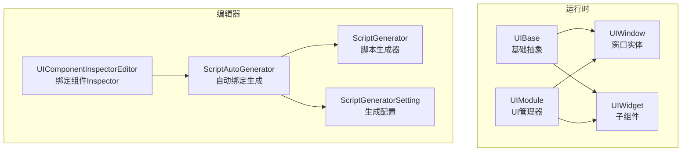
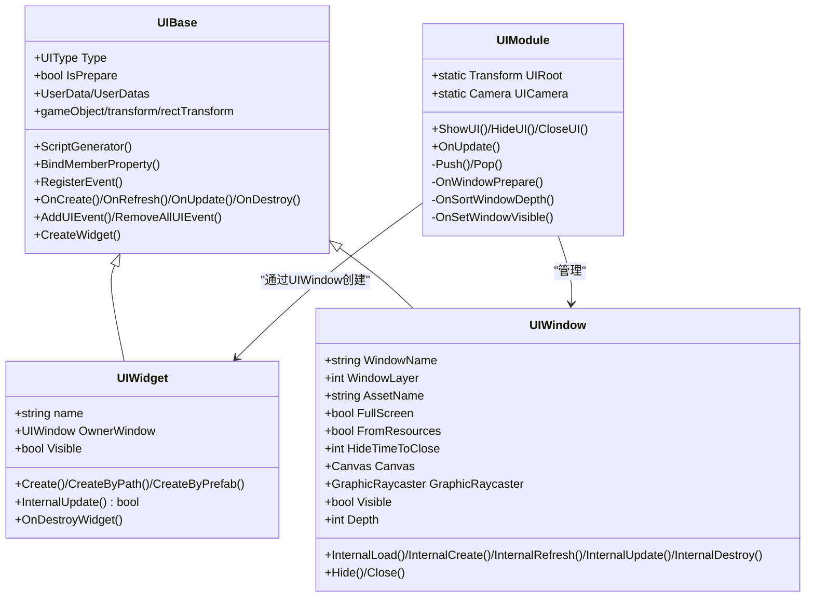
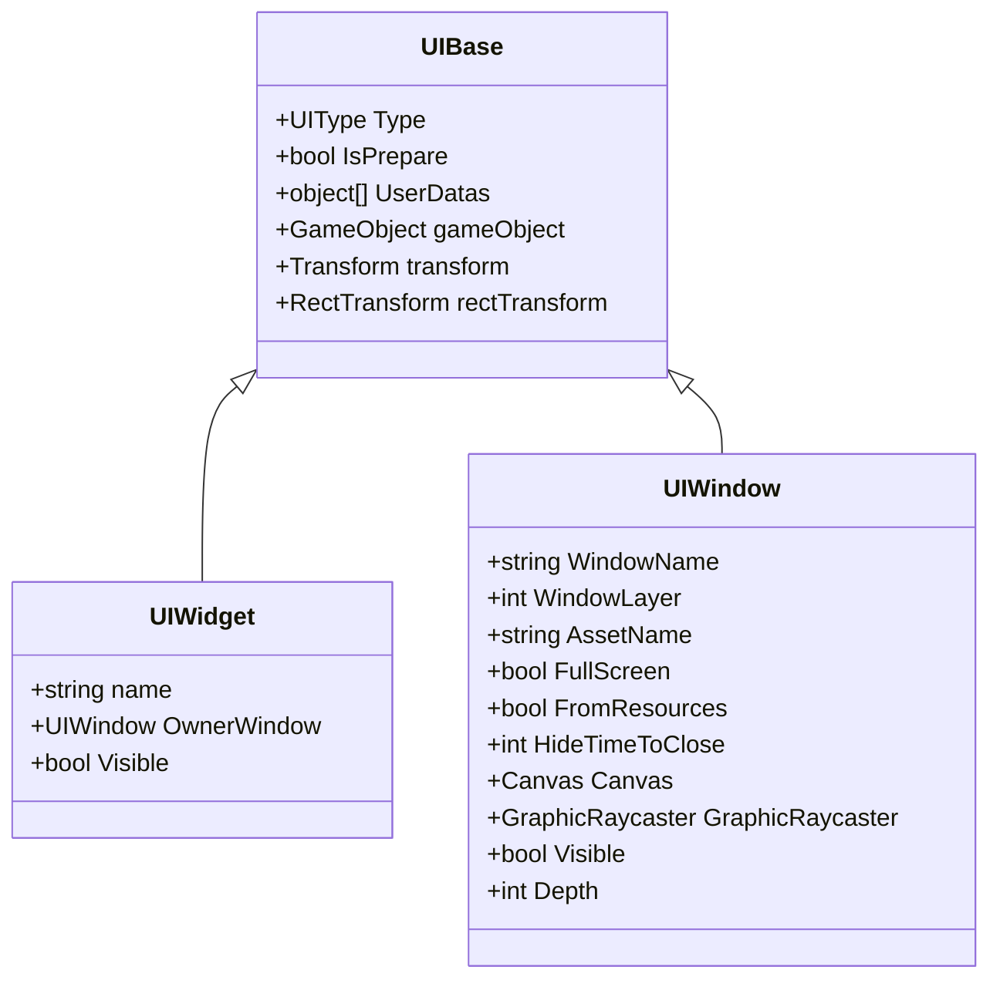
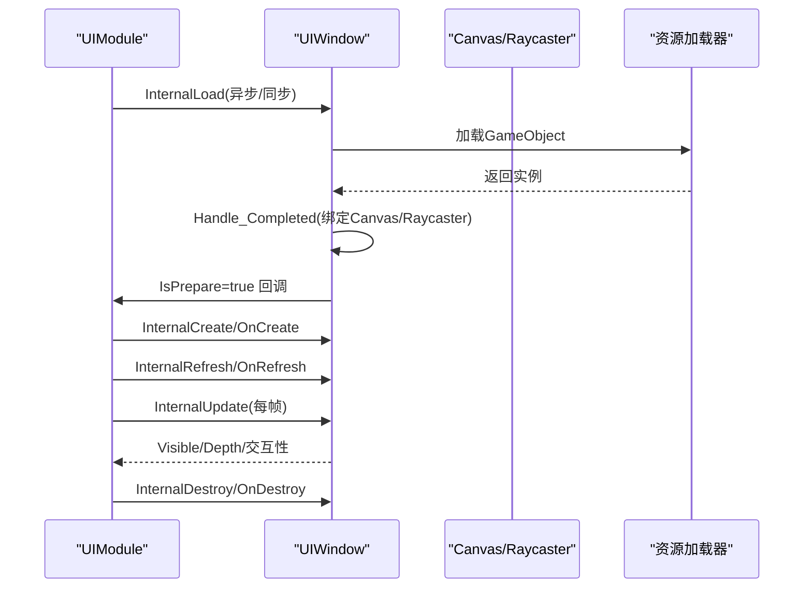
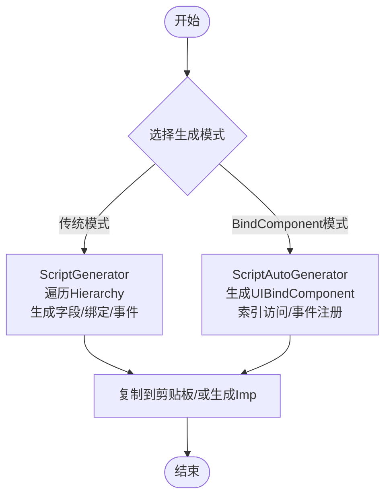
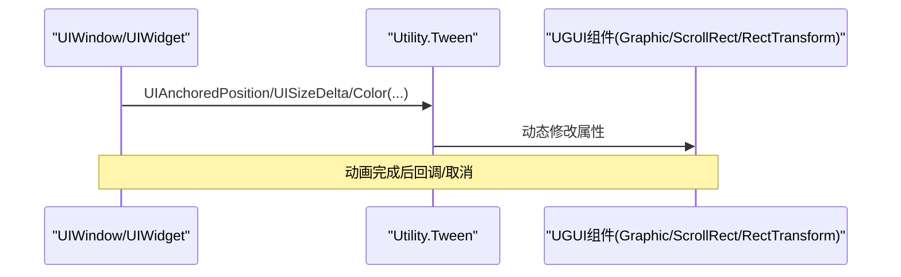
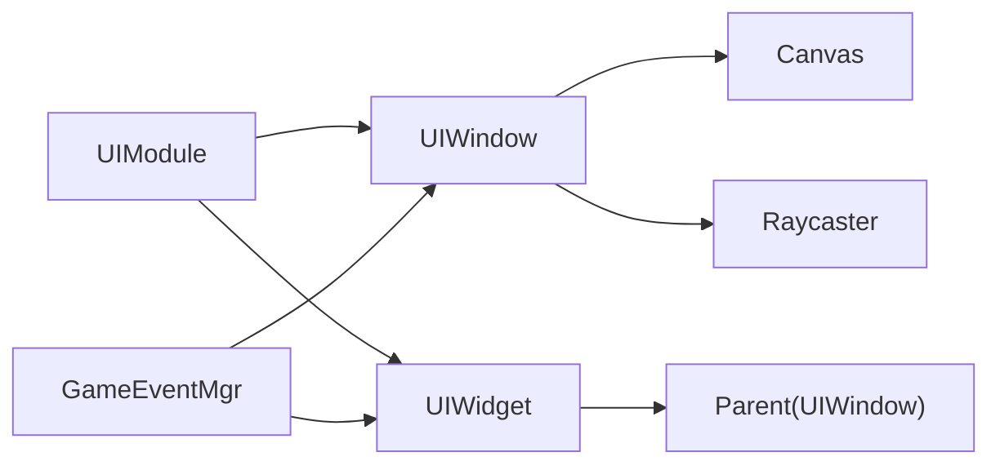

# UI组件扩展

<cite>
**本文档引用的文件**
- [UIBase.cs](file://Assets/GameScripts/HotFix/GameLogic/Module/UIModule/UIBase.cs)
- [UIWidget.cs](file://Assets/GameScripts/HotFix/GameLogic/Module/UIModule/UIWidget.cs)
- [UIWindow.cs](file://Assets/GameScripts/HotFix/GameLogic/Module/UIModule/UIWindow.cs)
- [UIModule.cs](file://Assets/GameScripts/HotFix/GameLogic/Module/UIModule/UIModule.cs)
- [ScriptGenerator.cs](file://Assets/Editor/UIScriptGenerator/ScriptGenerator.cs)
- [ScriptAutoGenerator.cs](file://Assets/Editor/UIScriptGenerator/ScriptAutoGenerator.cs)
- [ScriptGeneratorSetting.cs](file://Assets/Editor/UIScriptGenerator/ScriptGeneratorSetting.cs)
- [UIComponentInspectorEditor.cs](file://Assets/Editor/UIScriptGenerator/UIComponentInspectorEditor.cs)
- [Utility.Tween.cs](file://Assets/TEngine/Runtime/Extension/Tween/Utility.Tween.cs)
- [LoginUI.cs](file://Assets/GameScripts/HotFix/GameLogic/UI/LoginUI/LoginUI.cs)
- [BattleMainUI.cs](file://Assets/GameScripts/HotFix/GameLogic/UI/BattleMainUI/BattleMainUI.cs)
</cite>

## 目录
1. [简介](#简介)
2. [项目结构](#项目结构)
3. [核心组件](#核心组件)
4. [架构总览](#架构总览)
5. [详细组件分析](#详细组件分析)
6. [依赖关系分析](#依赖关系分析)
7. [性能考虑](#性能考虑)
8. [故障排查指南](#故障排查指南)
9. [结论](#结论)
10. [附录](#附录)

## 简介
本文件面向TEngine框架的UI系统，系统性阐述UI组件扩展方法论，涵盖组件继承体系、属性定义、行为实现；UI组件绑定扩展机制（自动绑定生成、组件生命周期管理、事件响应处理）；UI动画系统集成（Tween动画、过渡效果、状态切换）；并提供复杂控件开发、数据绑定扩展、国际化支持等实践示例与最佳实践。

## 项目结构
TEngine的UI体系由运行时模块与编辑器工具两部分组成：
- 运行时模块：UIBase、UIWindow、UIWidget、UIModule构成UI运行时骨架，负责窗口管理、层级排序、可见性控制、生命周期调度与事件分发。
- 编辑器工具：ScriptGenerator系列负责自动绑定生成与脚本模板输出，支持传统脚本生成与BindComponent两种模式，并提供Inspector可视化配置。

**图表来源**
- [UIBase.cs:18-233](file://Assets/GameScripts/HotFix/GameLogic/Module/UIModule/UIBase.cs#L18-L233)
- [UIWindow.cs:11-524](file://Assets/GameScripts/HotFix/GameLogic/Module/UIModule/UIWindow.cs#L11-L524)
- [UIWidget.cs:7-315](file://Assets/GameScripts/HotFix/GameLogic/Module/UIModule/UIWidget.cs#L7-L315)
- [UIModule.cs:15-732](file://Assets/GameScripts/HotFix/GameLogic/Module/UIModule/UIModule.cs#L15-L732)
- [ScriptGenerator.cs:60-135](file://Assets/Editor/UIScriptGenerator/ScriptGenerator.cs#L60-L135)
- [ScriptAutoGenerator.cs:89-254](file://Assets/Editor/UIScriptGenerator/ScriptAutoGenerator.cs#L89-L254)
- [ScriptGeneratorSetting.cs:10-207](file://Assets/Editor/UIScriptGenerator/ScriptGeneratorSetting.cs#L10-L207)
- [UIComponentInspectorEditor.cs:12-401](file://Assets/Editor/UIScriptGenerator/UIComponentInspectorEditor.cs#L12-L401)

**章节来源**
- [UIModule.cs:15-114](file://Assets/GameScripts/HotFix/GameLogic/Module/UIModule/UIModule.cs#L15-L114)
- [ScriptGenerator.cs:60-135](file://Assets/Editor/UIScriptGenerator/ScriptGenerator.cs#L60-L135)
- [ScriptAutoGenerator.cs:89-254](file://Assets/Editor/UIScriptGenerator/ScriptAutoGenerator.cs#L89-L254)

## 核心组件
- UIBase：UI层次结构的抽象基类，提供通用属性（gameObject/transform/rectTransform）、生命周期钩子（OnCreate/OnRefresh/OnUpdate/OnDestroy）、事件管理（GameEventMgr封装）、子组件查找与创建、可见性与层级排序等能力。
- UIWidget：UI子组件，继承自UIBase，强调“局部性”与“可复用”，提供Create/CreateByPath/CreateByPrefab三种创建方式，内置Update收集与延迟计算，确保高效更新链路。
- UIWindow：UI窗口，继承自UIBase，负责资源加载、Canvas/Raycaster初始化、可见性与交互性控制、层级排序、全屏遮挡策略、定时隐藏与关闭、生命周期管理。
- UIModule：UI管理器，负责UIRoot定位、相机配置、窗口堆栈管理、窗口可见性与深度排序、窗口打开/关闭/隐藏流程、错误日志与调试开关。

关键要点
- 生命周期：UIBase提供ScriptGenerator/BindMemberProperty/RegisterEvent/OnCreate/OnRefresh/OnUpdate/OnDestroy等钩子，按顺序执行，确保组件初始化与销毁的可控性。
- 更新模型：UIWidget/UIWindow均维护子组件列表与“更新脏标记”，通过InternalUpdate驱动子树更新，避免每帧扫描。
- 可见性与交互：UIWindow通过layer与GraphicRaycaster控制可见性与交互，支持全屏遮挡与定时隐藏。

**章节来源**
- [UIBase.cs:18-332](file://Assets/GameScripts/HotFix/GameLogic/Module/UIModule/UIBase.cs#L18-L332)
- [UIWidget.cs:7-140](file://Assets/GameScripts/HotFix/GameLogic/Module/UIModule/UIWidget.cs#L7-L140)
- [UIWindow.cs:11-188](file://Assets/GameScripts/HotFix/GameLogic/Module/UIModule/UIWindow.cs#L11-L188)
- [UIModule.cs:15-114](file://Assets/GameScripts/HotFix/GameLogic/Module/UIModule/UIModule.cs#L15-L114)

## 架构总览
TEngine UI采用“窗口-组件”两级结构，UIModule作为全局调度中心，统一管理窗口堆栈、可见性与层级排序；UIWindow负责单个界面的生命周期与渲染；UIWidget负责局部UI子树的生命周期与更新。

**图表来源**
- [UIBase.cs:18-332](file://Assets/GameScripts/HotFix/GameLogic/Module/UIModule/UIBase.cs#L18-L332)
- [UIWidget.cs:7-315](file://Assets/GameScripts/HotFix/GameLogic/Module/UIModule/UIWidget.cs#L7-L315)
- [UIWindow.cs:11-524](file://Assets/GameScripts/HotFix/GameLogic/Module/UIModule/UIWindow.cs#L11-L524)
- [UIModule.cs:15-732](file://Assets/GameScripts/HotFix/GameLogic/Module/UIModule/UIModule.cs#L15-L732)

## 详细组件分析

### 组件继承体系与属性定义
- 继承关系：UIBase为抽象基类，UIWindow与UIWidget分别面向“窗口级”和“组件级”的具体实现，二者共享一致的生命周期与事件模型。
- 属性设计：通过Type区分窗口/组件；UserData/UserDatas支持传参；Visible/Depth/FullScreen等属性统一管理可见性与层级；Canvas/Raycaster确保渲染与交互正确性。

**图表来源**
- [UIBase.cs:29-111](file://Assets/GameScripts/HotFix/GameLogic/Module/UIModule/UIBase.cs#L29-L111)
- [UIWidget.cs:27-55](file://Assets/GameScripts/HotFix/GameLogic/Module/UIModule/UIWidget.cs#L27-L55)
- [UIWindow.cs:55-138](file://Assets/GameScripts/HotFix/GameLogic/Module/UIModule/UIWindow.cs#L55-L138)

**章节来源**
- [UIBase.cs:29-111](file://Assets/GameScripts/HotFix/GameLogic/Module/UIModule/UIBase.cs#L29-L111)
- [UIWidget.cs:27-55](file://Assets/GameScripts/HotFix/GameLogic/Module/UIModule/UIWidget.cs#L27-L55)
- [UIWindow.cs:55-138](file://Assets/GameScripts/HotFix/GameLogic/Module/UIModule/UIWindow.cs#L55-L138)

### 生命周期管理与事件响应
- 生命周期：UIBase提供ScriptGenerator/BindMemberProperty/RegisterEvent/OnCreate/OnRefresh/OnUpdate/OnDestroy等钩子，UIWindow/UIWidget在InternalLoad/InternalCreate/InternalRefresh/InternalUpdate/InternalDestroy中依次调用，保证初始化与销毁的确定性。
- 事件系统：UIBase封装GameEventMgr，提供多重重载的AddUIEvent，支持泛型参数；UIWindow/UIWidget均支持事件清理，避免内存泄漏。

**图表来源**
- [UIWindow.cs:314-502](file://Assets/GameScripts/HotFix/GameLogic/Module/UIModule/UIWindow.cs#L314-L502)
- [UIModule.cs:472-516](file://Assets/GameScripts/HotFix/GameLogic/Module/UIModule/UIModule.cs#L472-L516)

**章节来源**
- [UIBase.cs:144-199](file://Assets/GameScripts/HotFix/GameLogic/Module/UIModule/UIBase.cs#L144-L199)
- [UIWindow.cs:338-458](file://Assets/GameScripts/HotFix/GameLogic/Module/UIModule/UIWindow.cs#L338-L458)
- [UIModule.cs:472-516](file://Assets/GameScripts/HotFix/GameLogic/Module/UIModule/UIModule.cs#L472-L516)

### 组件绑定扩展机制
- 自动绑定生成（传统模式）：ScriptGenerator根据命名规则生成字段声明、绑定逻辑与事件注册，支持Button/Toggle/Slider等常用控件，支持UniTask版本。
- 自动绑定生成（BindComponent模式）：ScriptAutoGenerator通过UIBindComponent集中管理组件索引，自动生成索引访问与事件注册，支持生成实现类与Imp分离。
- Inspector可视化：UIComponentInspectorEditor提供“重新绑定组件/生成脚本/生成UniTask脚本/生成标准版绑定代码”等快捷入口，支持UI类型、类名、生成路径等配置。

**图表来源**
- [ScriptGenerator.cs:60-135](file://Assets/Editor/UIScriptGenerator/ScriptGenerator.cs#L60-L135)
- [ScriptAutoGenerator.cs:89-254](file://Assets/Editor/UIScriptGenerator/ScriptAutoGenerator.cs#L89-L254)
- [UIComponentInspectorEditor.cs:186-307](file://Assets/Editor/UIScriptGenerator/UIComponentInspectorEditor.cs#L186-L307)

**章节来源**
- [ScriptGenerator.cs:60-135](file://Assets/Editor/UIScriptGenerator/ScriptGenerator.cs#L60-L135)
- [ScriptAutoGenerator.cs:89-254](file://Assets/Editor/UIScriptGenerator/ScriptAutoGenerator.cs#L89-L254)
- [ScriptGeneratorSetting.cs:10-207](file://Assets/Editor/UIScriptGenerator/ScriptGeneratorSetting.cs#L10-L207)
- [UIComponentInspectorEditor.cs:186-307](file://Assets/Editor/UIScriptGenerator/UIComponentInspectorEditor.cs#L186-L307)

### UI动画系统集成
- Tween集成：TEngine扩展了Utility.Tween对UGUI的支持，提供UIAnchoredPosition/SizeDelta/Color等常用动画API，支持Ease曲线、循环次数、延时与unscaledTime。
- 使用建议：在UIWindow/UIWidget的OnCreate/OnRefresh中启动动画，在OnDestroy中停止或取消动画，避免UI销毁后仍执行动画导致异常。

**图表来源**
- [Utility.Tween.cs:565-712](file://Assets/TEngine/Runtime/Extension/Tween/Utility.Tween.cs#L565-L712)

**章节来源**
- [Utility.Tween.cs:565-712](file://Assets/TEngine/Runtime/Extension/Tween/Utility.Tween.cs#L565-L712)

### 复杂控件开发与数据绑定扩展
- 复杂控件开发：通过UIWidget派生自定义控件，利用CreateByPath/CreateByPrefab创建实例，结合ScriptGenerator/ScriptAutoGenerator快速生成绑定与事件。
- 数据绑定扩展：在UIBase的UserData/UserDatas中传递数据，UIWindow/UIWidget在OnCreate/OnRefresh中读取并应用；对于列表型控件，可参考UIModule中AdjustIconNum/AsyncAdjustIconNum的批量创建与回收策略。
- 国际化支持：结合LocalizationModule与TextMeshProUGUI等文本组件，通过UIBase的事件系统与数据绑定实现动态文案更新。

**章节来源**
- [UIBase.cs:60-83](file://Assets/GameScripts/HotFix/GameLogic/Module/UIModule/UIBase.cs#L60-L83)
- [UIModule.cs:479-578](file://Assets/GameScripts/HotFix/GameLogic/Module/UIModule/UIModule.cs#L479-L578)

### 示例：登录界面与战斗主界面
- 登录界面（LoginUI）：演示窗口创建、资源加载、事件绑定与可见性控制。
- 战斗主界面（BattleMainUI）：演示复杂布局、子组件管理与动画集成。

**章节来源**
- [LoginUI.cs](file://Assets/GameScripts/HotFix/GameLogic/UI/LoginUI/LoginUI.cs)
- [BattleMainUI.cs](file://Assets/GameScripts/HotFix/GameLogic/UI/BattleMainUI/BattleMainUI.cs)

## 依赖关系分析
- 组件耦合：UIBase为低耦合抽象，UIWindow/UIWidget通过UIModule进行统一管理；UIWidget依赖UIWindow的OwnerWindow属性向上查找。
- 外部依赖：UnityUGUI（Canvas/GraphicRaycaster/RectTransform/Button/Toggle/Slider等）、Cysharp.Threading.Tasks（UniTask）、TextMeshPro（可选）。
- 循环依赖：无直接循环，事件通过GameEventMgr解耦。

**图表来源**
- [UIModule.cs:472-516](file://Assets/GameScripts/HotFix/GameLogic/Module/UIModule/UIModule.cs#L472-L516)
- [UIWindow.cs:25-31](file://Assets/GameScripts/HotFix/GameLogic/Module/UIModule/UIWindow.cs#L25-L31)
- [UIWidget.cs:38-55](file://Assets/GameScripts/HotFix/GameLogic/Module/UIModule/UIWidget.cs#L38-L55)
- [UIBase.cs:284-332](file://Assets/GameScripts/HotFix/GameLogic/Module/UIModule/UIBase.cs#L284-L332)

**章节来源**
- [UIModule.cs:472-516](file://Assets/GameScripts/HotFix/GameLogic/Module/UIModule/UIModule.cs#L472-L516)
- [UIWindow.cs:25-31](file://Assets/GameScripts/HotFix/GameLogic/Module/UIModule/UIWindow.cs#L25-L31)
- [UIWidget.cs:38-55](file://Assets/GameScripts/HotFix/GameLogic/Module/UIModule/UIWidget.cs#L38-L55)
- [UIBase.cs:284-332](file://Assets/GameScripts/HotFix/GameLogic/Module/UIModule/UIBase.cs#L284-L332)

## 性能考虑
- 更新链路优化：UIWidget/UIWindow通过“更新脏标记”与子列表缓存，避免每帧重建更新列表，减少GC与遍历成本。
- 可见性与层级：通过layer与sortingOrder控制渲染与交互，避免不必要的绘制与射线检测。
- 异步加载：UIModule支持异步加载窗口资源，配合GetUIAsyncAwait降低首帧卡顿。
- 绑定生成：BindComponent模式通过索引访问减少反射开销，适合大规模UI。

[本节为通用指导，不直接分析具体文件]

## 故障排查指南
- UIRoot未找到：UIModule初始化时会记录致命日志，需检查场景中是否存在UIRoot。
- 缺失Canvas：UIWindow在Handle_Completed阶段校验Canvas，若缺失将抛出异常。
- 绑定组件缺失：BindComponent模式下若缺少UIBindComponent，生成绑定代码会记录错误并终止。
- 事件未清理：UIBase提供RemoveAllUIEvent，确保销毁时清理事件，避免内存泄漏。
- 安全区域：使用ApplyScreenSafeRect/SimulateIPhoneXNotchScreen适配异形屏。

**章节来源**
- [UIModule.cs:49-94](file://Assets/GameScripts/HotFix/GameLogic/Module/UIModule/UIModule.cs#L49-L94)
- [UIWindow.cs:464-502](file://Assets/GameScripts/HotFix/GameLogic/Module/UIModule/UIWindow.cs#L464-L502)
- [ScriptAutoGenerator.cs:122-130](file://Assets/Editor/UIScriptGenerator/ScriptAutoGenerator.cs#L122-L130)
- [UIBase.cs:324-330](file://Assets/GameScripts/HotFix/GameLogic/Module/UIModule/UIBase.cs#L324-L330)

## 结论
TEngine的UI体系通过清晰的继承层次、完善的生命周期与事件机制、强大的编辑器绑定工具以及丰富的动画扩展，为复杂UI系统的开发提供了高可扩展性与高性能保障。遵循本文档的最佳实践，可在保证开发效率的同时获得稳定的运行表现。

[本节为总结性内容，不直接分析具体文件]

## 附录
- 快速上手步骤
  1) 在场景中放置UIRoot，确保Canvas/Camera存在。
  2) 使用ScriptGenerator或ScriptAutoGenerator生成绑定代码。
  3) 在UIWindow/UIWidget中实现OnCreate/OnRefresh/OnUpdate/OnDestroy。
  4) 通过UIModule.ShowUI/HideUI/CloseUI管理窗口生命周期。
  5) 使用Utility.Tween进行UI动画与过渡效果。

[本节为补充信息，不直接分析具体文件]