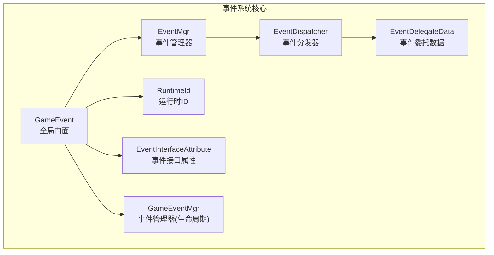
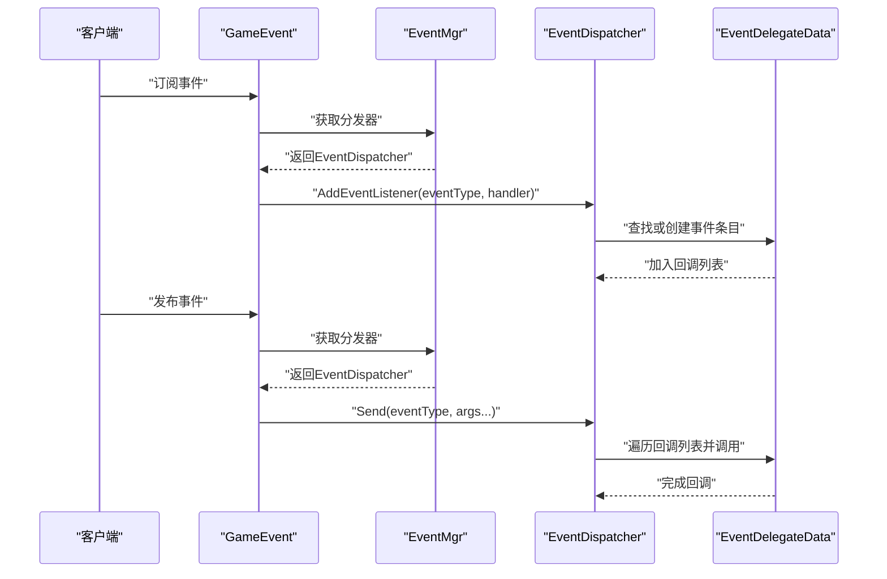
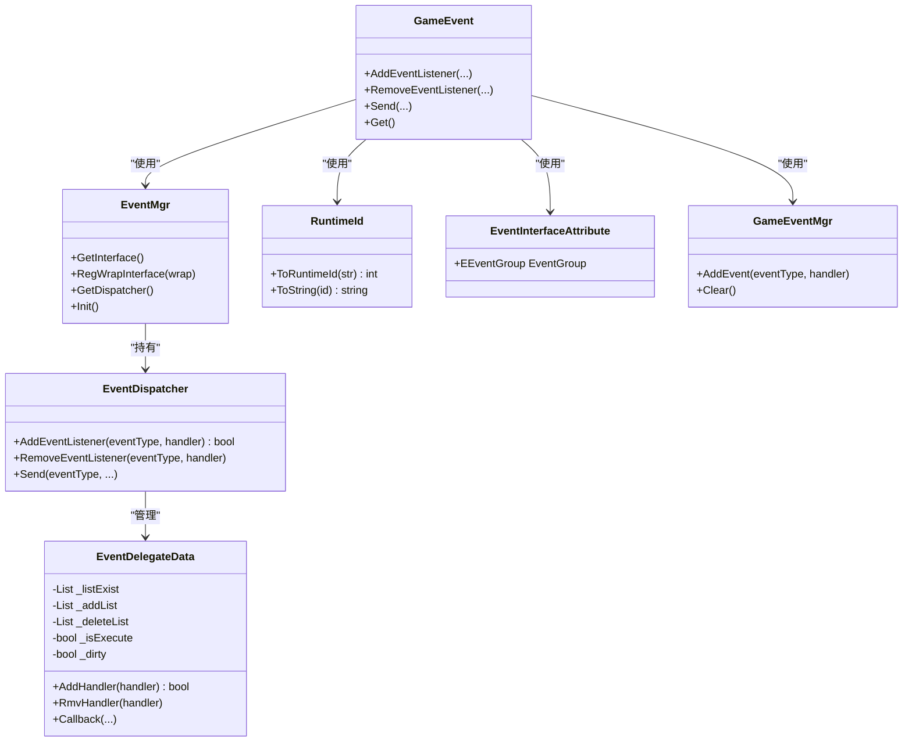
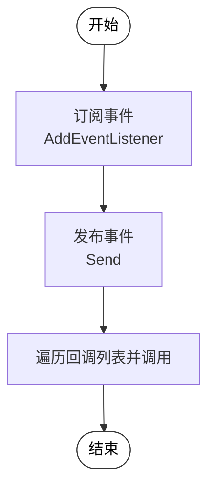
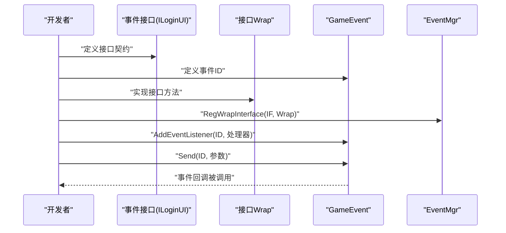
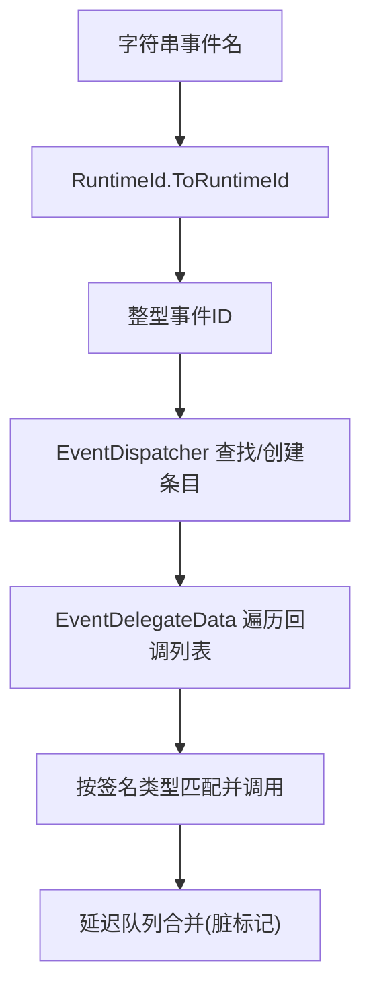
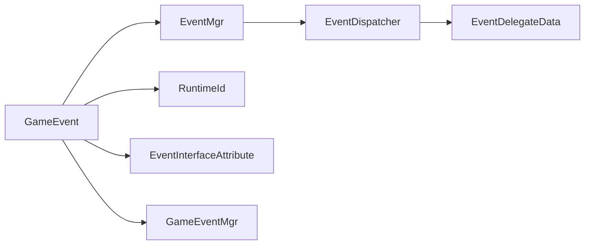

# 事件系统扩展

<cite>
**本文引用的文件**
- [EventDispatcher.cs](file://Assets/TEngine/Runtime/Core/GameEvent/EventDispatcher.cs)
- [EventMgr.cs](file://Assets/TEngine/Runtime/Core/GameEvent/EventMgr.cs)
- [GameEvent.cs](file://Assets/TEngine/Runtime/Core/GameEvent/GameEvent.cs)
- [EventDelegateData.cs](file://Assets/TEngine/Runtime/Core/GameEvent/EventDelegateData.cs)
- [EventInterfaceAttribute.cs](file://Assets/TEngine/Runtime/Core/GameEvent/EventInterfaceAttribute.cs)
- [RuntimeId.cs](file://Assets/TEngine/Runtime/Core/GameEvent/RuntimeId.cs)
- [GameEventMgr.cs](file://Assets/TEngine/Runtime/Core/GameEvent/GameEventMgr.cs)
- [ILoginUI.cs](file://Assets/GameScripts/HotFix/GameLogic/IEvent/ILoginUI.cs)
</cite>

## 目录
1. [简介](#简介)
2. [项目结构](#项目结构)
3. [核心组件](#核心组件)
4. [架构总览](#架构总览)
5. [详细组件分析](#详细组件分析)
6. [依赖关系分析](#依赖关系分析)
7. [性能考量](#性能考量)
8. [故障排查指南](#故障排查指南)
9. [结论](#结论)
10. [附录](#附录)

## 简介
本指南面向TEngine框架的事件系统扩展，围绕以下目标展开：如何定义自定义事件类型（事件接口、事件数据结构、事件处理器）、事件传播机制（订阅、发布、取消订阅）、性能优化策略（事件池与内存回收、批量处理）、扩展开发示例（业务事件、跨模块通信、异步处理），以及调试技巧与常见问题解决方案。内容基于仓库中实际代码进行分析与总结，帮助开发者在不引入额外依赖的前提下，构建高性能、可维护的事件系统。

## 项目结构
TEngine事件系统位于运行时核心模块下，采用“全局门面 + 分发器 + 管理器 + 运行时ID + 接口分组”的分层设计。核心文件如下：
- 门面入口：GameEvent 提供静态API，统一对外暴露事件能力
- 分发器：EventDispatcher 负责事件表维护与回调分发
- 管理器：EventMgr 管理接口Wrap与分发器生命周期
- 数据结构：EventDelegateData 存储事件回调列表与并发安全控制
- 标识系统：RuntimeId 将字符串事件名映射为整型运行时ID
- 接口分组：EventInterfaceAttribute 用于标注事件接口所属分组
- 生命周期管理：GameEventMgr 记录订阅关系，便于统一清理

**图表来源**
- [GameEvent.cs:1-601](file://Assets/TEngine/Runtime/Core/GameEvent/GameEvent.cs#L1-L601)
- [EventMgr.cs:1-89](file://Assets/TEngine/Runtime/Core/GameEvent/EventMgr.cs#L1-L89)
- [EventDispatcher.cs:1-188](file://Assets/TEngine/Runtime/Core/GameEvent/EventDispatcher.cs#L1-L188)
- [EventDelegateData.cs:1-266](file://Assets/TEngine/Runtime/Core/GameEvent/EventDelegateData.cs#L1-L266)
- [RuntimeId.cs:1-56](file://Assets/TEngine/Runtime/Core/GameEvent/RuntimeId.cs#L1-L56)
- [EventInterfaceAttribute.cs:1-31](file://Assets/TEngine/Runtime/Core/GameEvent/EventInterfaceAttribute.cs#L1-L31)
- [GameEventMgr.cs:1-109](file://Assets/TEngine/Runtime/Core/GameEvent/GameEventMgr.cs#L1-L109)

**章节来源**
- [GameEvent.cs:1-601](file://Assets/TEngine/Runtime/Core/GameEvent/GameEvent.cs#L1-L601)
- [EventMgr.cs:1-89](file://Assets/TEngine/Runtime/Core/GameEvent/EventMgr.cs#L1-L89)
- [EventDispatcher.cs:1-188](file://Assets/TEngine/Runtime/Core/GameEvent/EventDispatcher.cs#L1-L188)
- [EventDelegateData.cs:1-266](file://Assets/TEngine/Runtime/Core/GameEvent/EventDelegateData.cs#L1-L266)
- [RuntimeId.cs:1-56](file://Assets/TEngine/Runtime/Core/GameEvent/RuntimeId.cs#L1-L56)
- [EventInterfaceAttribute.cs:1-31](file://Assets/TEngine/Runtime/Core/GameEvent/EventInterfaceAttribute.cs#L1-L31)
- [GameEventMgr.cs:1-109](file://Assets/TEngine/Runtime/Core/GameEvent/GameEventMgr.cs#L1-L109)

## 核心组件
- GameEvent：全局门面，提供AddEventListener、RemoveEventListener、Send等静态方法；支持整型与字符串事件标识；封装EventMgr与EventDispatcher的调用。
- EventMgr：持有EventDispatcher与接口Wrap映射；提供RegWrapInterface注册接口Wrap；提供GetInterface获取接口实例；提供Init清理。
- EventDispatcher：维护事件类型到回调列表的字典；提供AddEventListener、RemoveEventListener；提供多重重载的Send分发方法。
- EventDelegateData：单个事件类型的回调容器，内部维护现有列表、待添加列表、待删除列表；在回调执行期间通过标记位与延迟队列实现并发安全。
- RuntimeId：字符串到整型运行时ID的映射与缓存；提供ToRuntimeId与ToString。
- EventInterfaceAttribute：接口级特性，用于标注事件接口分组（如UI、逻辑）。
- GameEventMgr：记录订阅关系，便于统一清理；提供多重重载的AddEvent方法。

**章节来源**
- [GameEvent.cs:1-601](file://Assets/TEngine/Runtime/Core/GameEvent/GameEvent.cs#L1-L601)
- [EventMgr.cs:1-89](file://Assets/TEngine/Runtime/Core/GameEvent/EventMgr.cs#L1-L89)
- [EventDispatcher.cs:1-188](file://Assets/TEngine/Runtime/Core/GameEvent/EventDispatcher.cs#L1-L188)
- [EventDelegateData.cs:1-266](file://Assets/TEngine/Runtime/Core/GameEvent/EventDelegateData.cs#L1-L266)
- [RuntimeId.cs:1-56](file://Assets/TEngine/Runtime/Core/GameEvent/RuntimeId.cs#L1-L56)
- [EventInterfaceAttribute.cs:1-31](file://Assets/TEngine/Runtime/Core/GameEvent/EventInterfaceAttribute.cs#L1-L31)
- [GameEventMgr.cs:1-109](file://Assets/TEngine/Runtime/Core/GameEvent/GameEventMgr.cs#L1-L109)

## 架构总览
事件系统采用“门面 + 分发器 + 管理器”三层结构，结合运行时ID与接口Wrap，形成从高层API到底层回调的完整链路。

**图表来源**
- [GameEvent.cs:20-371](file://Assets/TEngine/Runtime/Core/GameEvent/GameEvent.cs#L20-L371)
- [EventMgr.cs:70-78](file://Assets/TEngine/Runtime/Core/GameEvent/EventMgr.cs#L70-L78)
- [EventDispatcher.cs:24-186](file://Assets/TEngine/Runtime/Core/GameEvent/EventDispatcher.cs#L24-L186)
- [EventDelegateData.cs:27-264](file://Assets/TEngine/Runtime/Core/GameEvent/EventDelegateData.cs#L27-L264)

## 详细组件分析

### 事件接口与数据结构设计
- 事件接口：通过接口定义事件契约，配合EventInterfaceAttribute标注分组，便于模块化与跨模块通信。
- 事件数据：EventDelegateData内部维护现有回调列表与延迟队列，保证在回调执行过程中增删回调的安全性。

**图表来源**
- [GameEvent.cs:1-601](file://Assets/TEngine/Runtime/Core/GameEvent/GameEvent.cs#L1-L601)
- [EventMgr.cs:1-89](file://Assets/TEngine/Runtime/Core/GameEvent/EventMgr.cs#L1-L89)
- [EventDispatcher.cs:1-188](file://Assets/TEngine/Runtime/Core/GameEvent/EventDispatcher.cs#L1-L188)
- [EventDelegateData.cs:1-266](file://Assets/TEngine/Runtime/Core/GameEvent/EventDelegateData.cs#L1-L266)
- [RuntimeId.cs:1-56](file://Assets/TEngine/Runtime/Core/GameEvent/RuntimeId.cs#L1-L56)
- [EventInterfaceAttribute.cs:1-31](file://Assets/TEngine/Runtime/Core/GameEvent/EventInterfaceAttribute.cs#L1-L31)
- [GameEventMgr.cs:1-109](file://Assets/TEngine/Runtime/Core/GameEvent/GameEventMgr.cs#L1-L109)

**章节来源**
- [EventInterfaceAttribute.cs:1-31](file://Assets/TEngine/Runtime/Core/GameEvent/EventInterfaceAttribute.cs#L1-L31)
- [EventDelegateData.cs:1-266](file://Assets/TEngine/Runtime/Core/GameEvent/EventDelegateData.cs#L1-L266)

### 事件处理器实现与订阅/发布/取消订阅流程
- 订阅：通过GameEvent.AddEventListener绑定事件类型与处理委托；EventDispatcher内部根据事件类型查找或创建EventDelegateData，并将委托加入回调列表。
- 发布：通过GameEvent.Send触发事件；EventDispatcher根据事件类型定位EventDelegateData并依次调用回调。
- 取消订阅：通过GameEvent.RemoveEventListener移除指定委托；若正在执行回调，则标记延迟删除，避免并发修改异常。

**图表来源**
- [EventDispatcher.cs:24-186](file://Assets/TEngine/Runtime/Core/GameEvent/EventDispatcher.cs#L24-L186)
- [EventDelegateData.cs:76-114](file://Assets/TEngine/Runtime/Core/GameEvent/EventDelegateData.cs#L76-L114)

**章节来源**
- [EventDispatcher.cs:24-186](file://Assets/TEngine/Runtime/Core/GameEvent/EventDispatcher.cs#L24-L186)
- [EventDelegateData.cs:27-114](file://Assets/TEngine/Runtime/Core/GameEvent/EventDelegateData.cs#L27-L114)

### 自定义事件类型的创建方法
- 定义事件接口：在GameLogic或其他模块中定义接口，使用EventInterfaceAttribute标注分组，明确事件职责域。
- 定义事件ID：使用RuntimeId.ToRuntimeId将字符串常量转换为整型ID，确保跨模块一致且高效。
- 实现事件处理器：在需要接收事件的模块实现对应接口方法；通过EventMgr.RegWrapInterface注册接口Wrap，以便其他模块通过GameEvent.Get<T>()获取接口实例。
- 订阅与发布：在订阅方调用GameEvent.AddEventListener，在发布方调用GameEvent.Send。

**图表来源**
- [ILoginUI.cs:1-12](file://Assets/GameScripts/HotFix/GameLogic/IEvent/ILoginUI.cs#L1-L12)
- [EventInterfaceAttribute.cs:21-30](file://Assets/TEngine/Runtime/Core/GameEvent/EventInterfaceAttribute.cs#L21-L30)
- [RuntimeId.cs:32-44](file://Assets/TEngine/Runtime/Core/GameEvent/RuntimeId.cs#L32-L44)
- [EventMgr.cs:47-57](file://Assets/TEngine/Runtime/Core/GameEvent/EventMgr.cs#L47-L57)
- [GameEvent.cs:376-379](file://Assets/TEngine/Runtime/Core/GameEvent/GameEvent.cs#L376-L379)

**章节来源**
- [ILoginUI.cs:1-12](file://Assets/GameScripts/HotFix/GameLogic/IEvent/ILoginUI.cs#L1-L12)
- [EventInterfaceAttribute.cs:21-30](file://Assets/TEngine/Runtime/Core/GameEvent/EventInterfaceAttribute.cs#L21-L30)
- [RuntimeId.cs:32-44](file://Assets/TEngine/Runtime/Core/GameEvent/RuntimeId.cs#L32-L44)
- [EventMgr.cs:47-57](file://Assets/TEngine/Runtime/Core/GameEvent/EventMgr.cs#L47-L57)
- [GameEvent.cs:376-379](file://Assets/TEngine/Runtime/Core/GameEvent/GameEvent.cs#L376-L379)

### 事件传播机制详解
- 事件类型标识：支持整型ID与字符串ID两种方式；字符串ID通过RuntimeId映射为整型，兼顾可读性与性能。
- 回调执行模型：EventDelegateData在回调执行期间禁止直接修改现有列表，所有变更先写入延迟队列，执行完毕后统一合并，避免并发修改异常。
- 分发路径：GameEvent作为门面，内部委托给EventMgr与EventDispatcher，最终落到EventDelegateData的回调集合上。

**图表来源**
- [RuntimeId.cs:32-44](file://Assets/TEngine/Runtime/Core/GameEvent/RuntimeId.cs#L32-L44)
- [EventDispatcher.cs:32-41](file://Assets/TEngine/Runtime/Core/GameEvent/EventDispatcher.cs#L32-L41)
- [EventDelegateData.cs:76-96](file://Assets/TEngine/Runtime/Core/GameEvent/EventDelegateData.cs#L76-L96)

**章节来源**
- [GameEvent.cs:205-371](file://Assets/TEngine/Runtime/Core/GameEvent/GameEvent.cs#L205-L371)
- [EventDispatcher.cs:32-41](file://Assets/TEngine/Runtime/Core/GameEvent/EventDispatcher.cs#L32-L41)
- [EventDelegateData.cs:76-96](file://Assets/TEngine/Runtime/Core/GameEvent/EventDelegateData.cs#L76-L96)

### 事件系统的性能优化策略
- 事件池与内存回收
  - 使用GameEventMgr记录订阅关系，统一在Clear阶段调用GameEvent.RemoveEventListener移除所有订阅，避免悬挂回调与内存泄漏。
  - EventDelegateData内部通过延迟队列与脏标记避免在回调执行期间频繁扩容与拷贝，降低GC压力。
- 批量处理
  - 通过EventMgr集中管理订阅，便于在模块切换或场景切换时一次性清理，减少碎片化操作。
- ID映射
  - RuntimeId将字符串事件名映射为整型ID，避免字符串比较带来的开销，同时保持事件名的可读性。

**章节来源**
- [GameEventMgr.cs:33-49](file://Assets/TEngine/Runtime/Core/GameEvent/GameEventMgr.cs#L33-L49)
- [EventDelegateData.cs:76-96](file://Assets/TEngine/Runtime/Core/GameEvent/EventDelegateData.cs#L76-L96)
- [RuntimeId.cs:32-44](file://Assets/TEngine/Runtime/Core/GameEvent/RuntimeId.cs#L32-L44)

### 事件扩展开发示例
- 业务事件定义
  - 在GameLogic模块定义业务事件接口（如ILoginUI），使用EventInterfaceAttribute标注分组。
  - 在Runtime中定义事件ID常量，使用RuntimeId.ToRuntimeId生成整型ID。
- 跨模块事件通信
  - 在发送模块通过GameEvent.Send发布事件；在接收模块通过EventMgr.RegWrapInterface注册接口Wrap，并通过GameEvent.Get<T>()获取接口实例，调用对应方法。
- 异步事件处理
  - 在回调中可进行异步操作（如协程、任务），但需注意不要阻塞主线程；若涉及UI更新，确保回到主线程后再操作。

**章节来源**
- [ILoginUI.cs:1-12](file://Assets/GameScripts/HotFix/GameLogic/IEvent/ILoginUI.cs#L1-L12)
- [EventMgr.cs:47-57](file://Assets/TEngine/Runtime/Core/GameEvent/EventMgr.cs#L47-L57)
- [GameEvent.cs:376-379](file://Assets/TEngine/Runtime/Core/GameEvent/GameEvent.cs#L376-L379)

## 依赖关系分析
事件系统各组件之间的依赖清晰，耦合度低，职责单一：
- GameEvent依赖EventMgr与RuntimeId；EventMgr依赖EventDispatcher；EventDispatcher依赖EventDelegateData。
- 接口Wrap通过EventMgr注册，GameEvent通过Get<T>()获取，实现松耦合的跨模块通信。

**图表来源**
- [GameEvent.cs:1-601](file://Assets/TEngine/Runtime/Core/GameEvent/GameEvent.cs#L1-L601)
- [EventMgr.cs:1-89](file://Assets/TEngine/Runtime/Core/GameEvent/EventMgr.cs#L1-L89)
- [EventDispatcher.cs:1-188](file://Assets/TEngine/Runtime/Core/GameEvent/EventDispatcher.cs#L1-L188)
- [EventDelegateData.cs:1-266](file://Assets/TEngine/Runtime/Core/GameEvent/EventDelegateData.cs#L1-L266)
- [RuntimeId.cs:1-56](file://Assets/TEngine/Runtime/Core/GameEvent/RuntimeId.cs#L1-L56)
- [EventInterfaceAttribute.cs:1-31](file://Assets/TEngine/Runtime/Core/GameEvent/EventInterfaceAttribute.cs#L1-L31)
- [GameEventMgr.cs:1-109](file://Assets/TEngine/Runtime/Core/GameEvent/GameEventMgr.cs#L1-L109)

**章节来源**
- [GameEvent.cs:1-601](file://Assets/TEngine/Runtime/Core/GameEvent/GameEvent.cs#L1-L601)
- [EventMgr.cs:1-89](file://Assets/TEngine/Runtime/Core/GameEvent/EventMgr.cs#L1-L89)
- [EventDispatcher.cs:1-188](file://Assets/TEngine/Runtime/Core/GameEvent/EventDispatcher.cs#L1-L188)
- [EventDelegateData.cs:1-266](file://Assets/TEngine/Runtime/Core/GameEvent/EventDelegateData.cs#L1-L266)
- [RuntimeId.cs:1-56](file://Assets/TEngine/Runtime/Core/GameEvent/RuntimeId.cs#L1-L56)
- [EventInterfaceAttribute.cs:1-31](file://Assets/TEngine/Runtime/Core/GameEvent/EventInterfaceAttribute.cs#L1-L31)
- [GameEventMgr.cs:1-109](file://Assets/TEngine/Runtime/Core/GameEvent/GameEventMgr.cs#L1-L109)

## 性能考量
- 回调执行期间的并发安全：EventDelegateData通过_isExecute与_dirty标志，以及_addList/_deleteList延迟队列，避免在回调执行过程中直接修改列表导致的异常与性能问题。
- GC友好：优先使用整型事件ID，减少字符串比较与分配；通过GameEventMgr统一清理订阅，避免长期积累的委托引用。
- 批量操作：在模块切换或场景切换时，调用GameEventMgr.Clear统一移除订阅，减少碎片化操作带来的性能波动。

**章节来源**
- [EventDelegateData.cs:76-96](file://Assets/TEngine/Runtime/Core/GameEvent/EventDelegateData.cs#L76-L96)
- [GameEventMgr.cs:33-49](file://Assets/TEngine/Runtime/Core/GameEvent/GameEventMgr.cs#L33-L49)

## 故障排查指南
- 重复添加回调
  - 现象：日志出现重复添加处理器的致命错误。
  - 原因：同一委托被重复添加。
  - 解决：确保同一委托仅添加一次；必要时先Remove再Add。
- 删除不存在的回调
  - 现象：日志提示删除失败且事件ID不可用。
  - 原因：尝试删除未注册的委托。
  - 解决：确认委托已正确注册；在执行回调期间避免直接删除。
- 回调执行期间修改列表
  - 现象：并发修改异常或回调顺序异常。
  - 原因：在回调执行期间直接修改现有列表。
  - 解决：利用EventDelegateData的延迟队列机制，等待执行完毕后自动合并。
- 字符串ID映射问题
  - 现象：事件ID不一致或无法解析。
  - 原因：字符串事件名未正确映射。
  - 解决：确保使用RuntimeId.ToRuntimeId生成ID；检查映射表初始化状态。

**章节来源**
- [EventDelegateData.cs:34-70](file://Assets/TEngine/Runtime/Core/GameEvent/EventDelegateData.cs#L34-L70)
- [RuntimeId.cs:32-54](file://Assets/TEngine/Runtime/Core/GameEvent/RuntimeId.cs#L32-L54)

## 结论
TEngine事件系统以简洁高效的架构实现了事件的订阅、发布与取消订阅，结合运行时ID与接口Wrap，既保证了性能又提供了良好的可扩展性。通过GameEventMgr统一管理订阅生命周期，配合EventDelegateData的并发安全机制，能够在复杂业务场景中稳定运行。建议在实际开发中遵循接口分组、统一ID映射、集中清理的原则，持续优化事件系统的性能与可维护性。

## 附录
- 事件接口分组枚举：UI相关与逻辑层内部相关两类，便于模块化管理。
- 事件ID生成：推荐在静态构造或模块初始化时集中生成并缓存，避免运行时重复计算。

**章节来源**
- [EventInterfaceAttribute.cs:8-19](file://Assets/TEngine/Runtime/Core/GameEvent/EventInterfaceAttribute.cs#L8-L19)
- [RuntimeId.cs:32-44](file://Assets/TEngine/Runtime/Core/GameEvent/RuntimeId.cs#L32-L44)