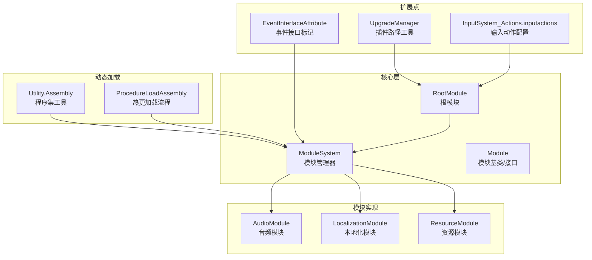
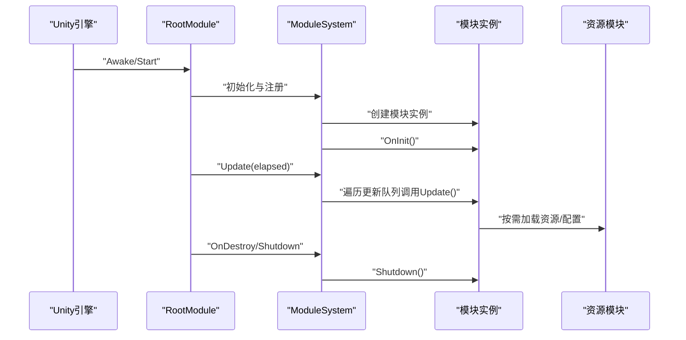
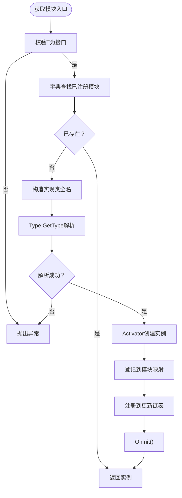
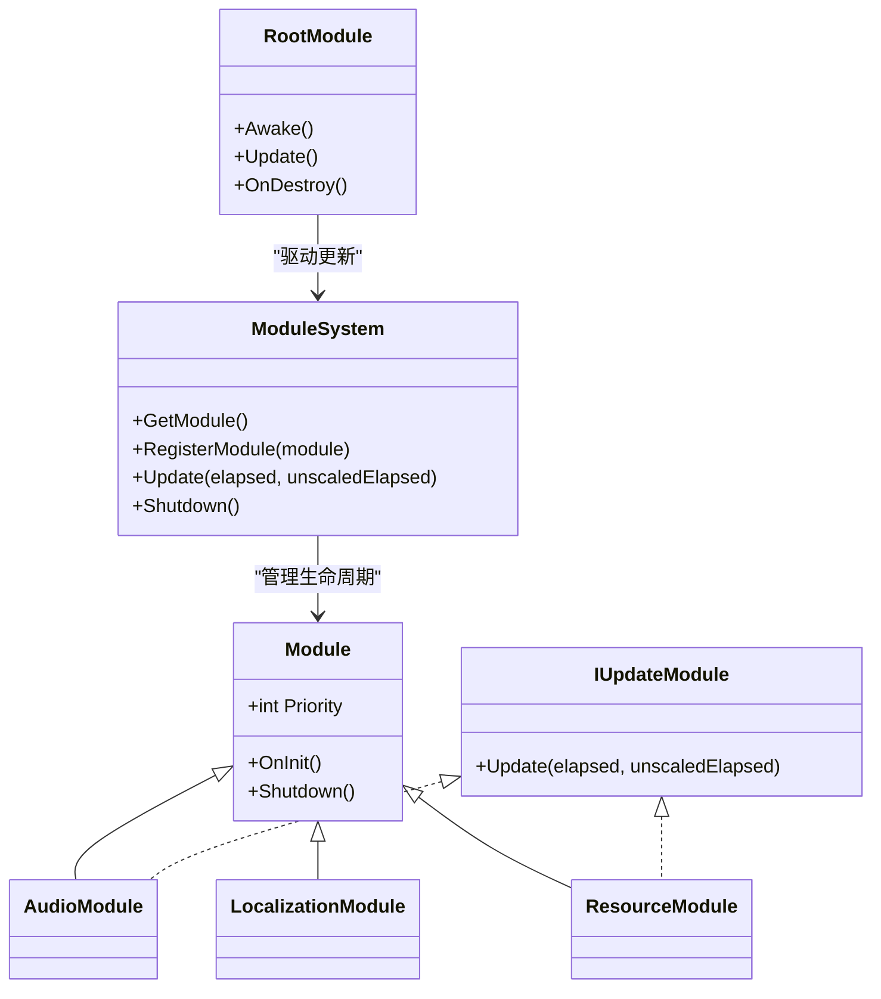
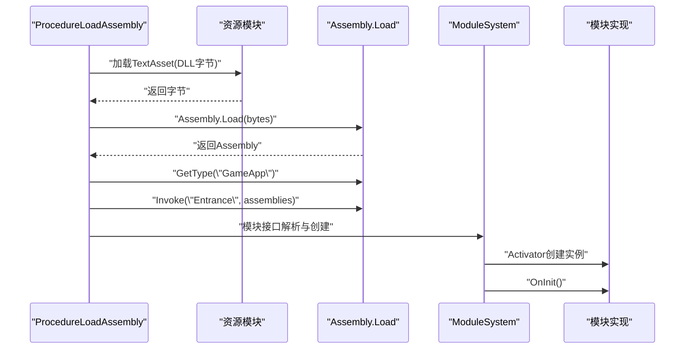
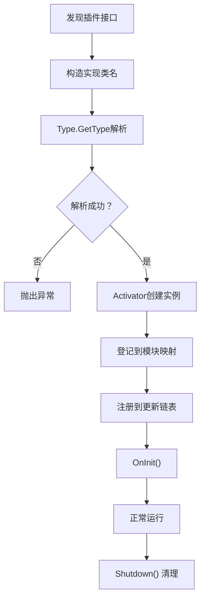
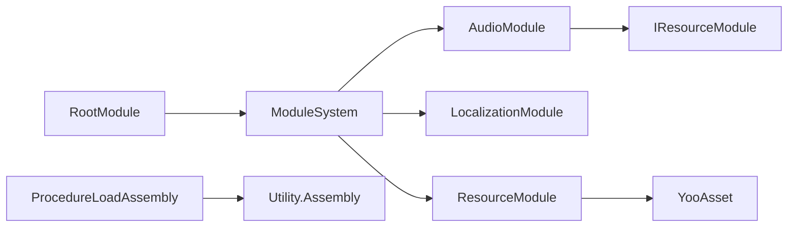

# 插件系统设计

<cite>
**本文档引用的文件**
- [ModuleSystem.cs](file://Assets/TEngine/Runtime/Core/ModuleSystem.cs)
- [Module.cs](file://Assets/TEngine/Runtime/Core/Module.cs)
- [RootModule.cs](file://Assets/TEngine/Runtime/Module/RootModule.cs)
- [GameModule.cs](file://Assets/GameScripts/HotFix/GameLogic/GameModule.cs)
- [AudioModule.cs](file://Assets/TEngine/Runtime/Module/AudioModule/AudioModule.cs)
- [LocalizationModule.cs](file://Assets/TEngine/Runtime/Module/LocalizationModule/LocalizationModule.cs)
- [ResourceModule.cs](file://Assets/TEngine/Runtime/Module/ResourceModule/ResourceModule.cs)
- [Utility.Assembly.cs](file://Assets/TEngine/Runtime/Core/Utility/Utility.Assembly.cs)
- [EventInterfaceAttribute.cs](file://Assets/TEngine/Runtime/Core/GameEvent/EventInterfaceAttribute.cs)
- [UpgradeManager.cs](file://Assets/TEngine/Editor/Localization/UpgradeManager.cs)
- [InputSystem_Actions.inputactions](file://Assets/TEngine/Extension/InputModule/InputSystem_Actions.inputactions)
- [ProcedureLoadAssembly.cs](file://Assets/GameScripts/Procedure/ProcedureLoadAssembly.cs)
</cite>

## 目录
1. [引言](#引言)
2. [项目结构](#项目结构)
3. [核心组件](#核心组件)
4. [架构总览](#架构总览)
5. [详细组件分析](#详细组件分析)
6. [依赖关系分析](#依赖关系分析)
7. [性能考虑](#性能考虑)
8. [故障排除指南](#故障排除指南)
9. [结论](#结论)
10. [附录](#附录)

## 引言
本文件面向TEngine框架的插件系统设计，系统性阐述其扩展点识别机制、插件接口定义、动态加载策略、注册流程、依赖关系管理与版本兼容处理，并提供插件开发最佳实践与完整实现示例路径，帮助开发者创建可重用的功能模块。

## 项目结构
TEngine的插件系统以“模块”为核心载体，围绕模块接口、模块管理器、模块生命周期与动态装配展开。核心文件分布如下：
- 核心管理与接口：ModuleSystem.cs、Module.cs、RootModule.cs
- 模块实现示例：AudioModule.cs、LocalizationModule.cs、ResourceModule.cs
- 动态加载与装配：Utility.Assembly.cs、ProcedureLoadAssembly.cs
- 事件扩展点：EventInterfaceAttribute.cs
- 插件路径工具：UpgradeManager.cs
- 输入扩展：InputSystem_Actions.inputactions

图表来源
- [ModuleSystem.cs:1-208](file://Assets/TEngine/Runtime/Core/ModuleSystem.cs#L1-L208)
- [Module.cs:1-40](file://Assets/TEngine/Runtime/Core/Module.cs#L1-L40)
- [RootModule.cs:1-304](file://Assets/TEngine/Runtime/Module/RootModule.cs#L1-L304)
- [AudioModule.cs:1-571](file://Assets/TEngine/Runtime/Module/AudioModule/AudioModule.cs#L1-L571)
- [LocalizationModule.cs:1-114](file://Assets/TEngine/Runtime/Module/LocalizationModule/LocalizationModule.cs#L1-L114)
- [ResourceModule.cs:1-800](file://Assets/TEngine/Runtime/Module/ResourceModule/ResourceModule.cs#L1-L800)
- [Utility.Assembly.cs:1-75](file://Assets/TEngine/Runtime/Core/Utility/Utility.Assembly.cs#L1-L75)
- [ProcedureLoadAssembly.cs:41-274](file://Assets/GameScripts/Procedure/ProcedureLoadAssembly.cs#L41-L274)
- [EventInterfaceAttribute.cs:1-31](file://Assets/TEngine/Runtime/Core/GameEvent/EventInterfaceAttribute.cs#L1-L31)
- [UpgradeManager.cs:307-334](file://Assets/TEngine/Editor/Localization/UpgradeManager.cs#L307-L334)
- [InputSystem_Actions.inputactions:1-37](file://Assets/TEngine/Extension/InputModule/InputSystem_Actions.inputactions#L1-L37)

章节来源
- [ModuleSystem.cs:1-208](file://Assets/TEngine/Runtime/Core/ModuleSystem.cs#L1-L208)
- [Module.cs:1-40](file://Assets/TEngine/Runtime/Core/Module.cs#L1-L40)
- [RootModule.cs:1-304](file://Assets/TEngine/Runtime/Module/RootModule.cs#L1-L304)

## 核心组件
- 模块接口与基类
  - IUpdateModule：定义Update轮询接口，用于参与主循环调度。
  - Module：抽象模块基类，包含Priority优先级、OnInit初始化、Shutdown关闭等约定。
- 模块管理器
  - ModuleSystem：集中管理模块注册、创建、更新与销毁；维护模块链表与按优先级排序的执行队列。
- 根模块
  - RootModule：Unity入口，负责初始化文本/日志/JSON辅助器、设置帧率与时间缩放、触发模块系统更新与关闭。

章节来源
- [Module.cs:1-40](file://Assets/TEngine/Runtime/Core/Module.cs#L1-L40)
- [ModuleSystem.cs:1-208](file://Assets/TEngine/Runtime/Core/ModuleSystem.cs#L1-L208)
- [RootModule.cs:1-304](file://Assets/TEngine/Runtime/Module/RootModule.cs#L1-L304)

## 架构总览
TEngine的插件系统以“接口+实现类”的形式组织模块，模块通过ModuleSystem统一注册与调度。模块实现通常同时实现Module与IUpdateModule，从而参与主循环更新。动态加载方面，框架支持通过程序集工具与流程步骤加载外部DLL，并通过模块接口完成装配。

图表来源
- [RootModule.cs:116-167](file://Assets/TEngine/Runtime/Module/RootModule.cs#L116-L167)
- [ModuleSystem.cs:29-60](file://Assets/TEngine/Runtime/Core/ModuleSystem.cs#L29-L60)
- [ResourceModule.cs:47-53](file://Assets/TEngine/Runtime/Module/ResourceModule/ResourceModule.cs#L47-L53)

## 详细组件分析

### 模块系统与扩展点识别
- 接口识别与命名映射
  - ModuleSystem根据接口类型构造“命名空间.接口名, 程序集名”的类型名，通过Type.GetType解析对应实现类，确保扩展点与实现的一一对应。
- 优先级与更新队列
  - 按Priority降序插入模块链表；IUpdateModule实现的模块进入独立更新链表，构建执行列表以降低每次更新的查找成本。
- 自定义模块注册
  - 提供RegisterModule<T>接口，允许外部注入自定义模块实例，便于测试或特殊场景。

图表来源
- [ModuleSystem.cs:68-120](file://Assets/TEngine/Runtime/Core/ModuleSystem.cs#L68-L120)
- [ModuleSystem.cs:143-194](file://Assets/TEngine/Runtime/Core/ModuleSystem.cs#L143-L194)

章节来源
- [ModuleSystem.cs:68-120](file://Assets/TEngine/Runtime/Core/ModuleSystem.cs#L68-L120)
- [ModuleSystem.cs:143-194](file://Assets/TEngine/Runtime/Core/ModuleSystem.cs#L143-L194)

### 模块生命周期与根模块集成
- RootModule作为Unity入口，负责：
  - 初始化各类Helper（文本、日志、JSON），设置帧率、时间缩放、睡眠策略。
  - 在Update中驱动ModuleSystem.Update，实现模块主循环。
  - OnDestroy时触发ModuleSystem.Shutdown，清理所有模块与内存池。
- 模块可通过ModuleSystem.GetModule<T>()获取其他模块依赖，形成松耦合协作。

图表来源
- [Module.cs:1-40](file://Assets/TEngine/Runtime/Core/Module.cs#L1-L40)
- [ModuleSystem.cs:1-208](file://Assets/TEngine/Runtime/Core/ModuleSystem.cs#L1-L208)
- [RootModule.cs:1-304](file://Assets/TEngine/Runtime/Module/RootModule.cs#L1-L304)
- [AudioModule.cs:11-11](file://Assets/TEngine/Runtime/Module/AudioModule/AudioModule.cs#L11-L11)
- [LocalizationModule.cs:8-8](file://Assets/TEngine/Runtime/Module/LocalizationModule/LocalizationModule.cs#L8-L8)
- [ResourceModule.cs:17-17](file://Assets/TEngine/Runtime/Module/ResourceModule/ResourceModule.cs#L17-L17)

章节来源
- [RootModule.cs:116-167](file://Assets/TEngine/Runtime/Module/RootModule.cs#L116-L167)
- [ModuleSystem.cs:29-60](file://Assets/TEngine/Runtime/Core/ModuleSystem.cs#L29-L60)

### 动态加载与装配策略
- 程序集工具
  - Utility.Assembly提供获取已加载程序集、类型集合与按名查询类型的能力，为模块类型解析提供基础。
- 热更新DLL加载
  - ProcedureLoadAssembly支持从资源加载DLL字节流，通过Assembly.Load动态装载，随后反射定位主入口类型与方法，完成热更装配。
- 插件路径工具
  - UpgradeManager提供插件路径解析与资源路径推导，便于编辑器环境下定位插件资源。

图表来源
- [ProcedureLoadAssembly.cs:152-150](file://Assets/GameScripts/Procedure/ProcedureLoadAssembly.cs#L152-L150)
- [ProcedureLoadAssembly.cs:197-218](file://Assets/GameScripts/Procedure/ProcedureLoadAssembly.cs#L197-L218)
- [Utility.Assembly.cs:68-75](file://Assets/TEngine/Runtime/Core/Utility/Utility.Assembly.cs#L68-L75)
- [ModuleSystem.cs:107-120](file://Assets/TEngine/Runtime/Core/ModuleSystem.cs#L107-L120)

章节来源
- [ProcedureLoadAssembly.cs:50-122](file://Assets/GameScripts/Procedure/ProcedureLoadAssembly.cs#L50-L122)
- [ProcedureLoadAssembly.cs:185-218](file://Assets/GameScripts/Procedure/ProcedureLoadAssembly.cs#L185-L218)
- [Utility.Assembly.cs:68-75](file://Assets/TEngine/Runtime/Core/Utility/Utility.Assembly.cs#L68-L75)

### 插件注册流程（发现→验证→加载→初始化）
- 发现与验证
  - 通过接口名映射到实现类名，利用Type.GetType解析；若解析失败则抛出异常，确保插件实现存在。
- 加载与创建
  - Activator.CreateInstance创建模块实例，登记到模块映射表。
- 初始化与更新注册
  - 注册到模块链表与更新链表，按Priority排序；OnInit()完成模块初始化。
- 关闭与清理
  - RootModule OnDestroy触发ModuleSystem.Shutdown，逐个调用模块Shutdown并清空缓存。

图表来源
- [ModuleSystem.cs:68-120](file://Assets/TEngine/Runtime/Core/ModuleSystem.cs#L68-L120)
- [ModuleSystem.cs:143-194](file://Assets/TEngine/Runtime/Core/ModuleSystem.cs#L143-L194)
- [RootModule.cs:162-167](file://Assets/TEngine/Runtime/Module/RootModule.cs#L162-L167)

章节来源
- [ModuleSystem.cs:68-120](file://Assets/TEngine/Runtime/Core/ModuleSystem.cs#L68-L120)
- [ModuleSystem.cs:143-194](file://Assets/TEngine/Runtime/Core/ModuleSystem.cs#L143-L194)
- [RootModule.cs:162-167](file://Assets/TEngine/Runtime/Module/RootModule.cs#L162-L167)

### 依赖关系管理与版本兼容
- 模块间依赖
  - 模块通过ModuleSystem.GetModule<T>()获取其他模块，如AudioModule依赖IResourceModule进行资源加载。
- 版本兼容
  - 资源模块提供包版本查询与清单更新能力，支持在线版本对比与清单更新，保障资源与逻辑版本一致性。
- 热更兼容
  - ProcedureLoadAssembly支持AOT元数据加载与热更新DLL加载，结合条件编译与运行时模式选择，保证不同平台与模式下的兼容性。

章节来源
- [AudioModule.cs:320-326](file://Assets/TEngine/Runtime/Module/AudioModule/AudioModule.cs#L320-L326)
- [ResourceModule.cs:289-341](file://Assets/TEngine/Runtime/Module/ResourceModule/ResourceModule.cs#L289-L341)
- [ProcedureLoadAssembly.cs:224-274](file://Assets/GameScripts/Procedure/ProcedureLoadAssembly.cs#L224-L274)

### 错误处理与健壮性
- 类型解析失败：接口名映射不到实现类时抛出异常，提示缺失模块类型。
- 模块创建失败：Activator.CreateInstance失败时抛出异常，阻止脏状态继续。
- 资源加载异常：ProcedureLoadAssembly在DLL加载失败时记录致命日志并抛出异常，便于快速定位问题。
- 低内存保护：RootModule OnLowMemory回调触发对象池与资源模块的清理逻辑。

章节来源
- [ModuleSystem.cs:81-88](file://Assets/TEngine/Runtime/Core/ModuleSystem.cs#L81-L88)
- [ModuleSystem.cs:109-113](file://Assets/TEngine/Runtime/Core/ModuleSystem.cs#L109-L113)
- [ProcedureLoadAssembly.cs:207-212](file://Assets/GameScripts/Procedure/ProcedureLoadAssembly.cs#L207-L212)
- [RootModule.cs:287-302](file://Assets/TEngine/Runtime/Module/RootModule.cs#L287-L302)

### 插件开发最佳实践
- 接口设计
  - 明确模块职责，接口以功能域划分（如IAudioModule、IResourceModule），避免接口膨胀。
  - 使用EventInterfaceAttribute对事件接口进行分组标记，便于事件路由与管理。
- 配置管理
  - 通过RootModule的Helper初始化与设置项（帧率、时间缩放、后台运行、睡眠策略）统一配置入口。
  - 资源模块提供多种运行模式（编辑器模拟、单机、联机、WebGL）与解密服务配置，满足不同部署需求。
- 动态加载
  - 使用Utility.Assembly与ProcedureLoadAssembly实现DLL动态加载与反射调用，注意异常捕获与日志记录。
- 错误处理
  - 在模块OnInit/Update中进行前置校验与异常捕获，避免模块状态不一致。
  - 利用RootModule的OnLowMemory回调进行资源与对象池清理，降低崩溃风险。

章节来源
- [EventInterfaceAttribute.cs:21-31](file://Assets/TEngine/Runtime/Core/GameEvent/EventInterfaceAttribute.cs#L21-L31)
- [RootModule.cs:214-285](file://Assets/TEngine/Runtime/Module/RootModule.cs#L214-L285)
- [ResourceModule.cs:119-138](file://Assets/TEngine/Runtime/Module/ResourceModule/ResourceModule.cs#L119-L138)
- [ProcedureLoadAssembly.cs:197-218](file://Assets/GameScripts/Procedure/ProcedureLoadAssembly.cs#L197-L218)

### 插件开发示例与实现路径
以下为可参考的完整实现路径（请在对应文件中查看具体实现）：
- 创建模块接口与实现
  - 接口与基类：[Module.cs:1-40](file://Assets/TEngine/Runtime/Core/Module.cs#L1-L40)
  - 模块管理器：[ModuleSystem.cs:1-208](file://Assets/TEngine/Runtime/Core/ModuleSystem.cs#L1-L208)
  - 示例模块：音频模块实现 [AudioModule.cs:1-571](file://Assets/TEngine/Runtime/Module/AudioModule/AudioModule.cs#L1-L571)，本地化模块实现 [LocalizationModule.cs:1-114](file://Assets/TEngine/Runtime/Module/LocalizationModule/LocalizationModule.cs#L1-L114)，资源模块实现 [ResourceModule.cs:1-800](file://Assets/TEngine/Runtime/Module/ResourceModule/ResourceModule.cs#L1-L800)
- 动态加载与装配
  - 程序集工具：[Utility.Assembly.cs:1-75](file://Assets/TEngine/Runtime/Core/Utility/Utility.Assembly.cs#L1-L75)
  - 热更加载流程：[ProcedureLoadAssembly.cs:41-274](file://Assets/GameScripts/Procedure/ProcedureLoadAssembly.cs#L41-L274)
- 插件路径与资源定位
  - 插件路径工具：[UpgradeManager.cs:307-334](file://Assets/TEngine/Editor/Localization/UpgradeManager.cs#L307-L334)
- 输入扩展配置
  - 输入动作配置：[InputSystem_Actions.inputactions:1-37](file://Assets/TEngine/Extension/InputModule/InputSystem_Actions.inputactions#L1-L37)

章节来源
- [Module.cs:1-40](file://Assets/TEngine/Runtime/Core/Module.cs#L1-L40)
- [ModuleSystem.cs:1-208](file://Assets/TEngine/Runtime/Core/ModuleSystem.cs#L1-L208)
- [AudioModule.cs:1-571](file://Assets/TEngine/Runtime/Module/AudioModule/AudioModule.cs#L1-L571)
- [LocalizationModule.cs:1-114](file://Assets/TEngine/Runtime/Module/LocalizationModule/LocalizationModule.cs#L1-L114)
- [ResourceModule.cs:1-800](file://Assets/TEngine/Runtime/Module/ResourceModule/ResourceModule.cs#L1-L800)
- [Utility.Assembly.cs:1-75](file://Assets/TEngine/Runtime/Core/Utility/Utility.Assembly.cs#L1-L75)
- [ProcedureLoadAssembly.cs:41-274](file://Assets/GameScripts/Procedure/ProcedureLoadAssembly.cs#L41-L274)
- [UpgradeManager.cs:307-334](file://Assets/TEngine/Editor/Localization/UpgradeManager.cs#L307-L334)
- [InputSystem_Actions.inputactions:1-37](file://Assets/TEngine/Extension/InputModule/InputSystem_Actions.inputactions#L1-L37)

## 依赖关系分析
- 模块依赖
  - 模块通过接口获取其他模块，如AudioModule依赖IResourceModule；RootModule依赖各模块进行初始化与更新。
- 外部依赖
  - 资源模块依赖YooAsset进行包管理与资源加载。
  - 热更流程依赖HybridCLR与Unity资源系统。
- 循环依赖规避
  - 通过接口隔离与延迟初始化避免循环依赖；模块注册时按Priority排序，确保启动顺序可控。

图表来源
- [ModuleSystem.cs:1-208](file://Assets/TEngine/Runtime/Core/ModuleSystem.cs#L1-L208)
- [AudioModule.cs:320-326](file://Assets/TEngine/Runtime/Module/AudioModule/AudioModule.cs#L320-L326)
- [ResourceModule.cs:1-800](file://Assets/TEngine/Runtime/Module/ResourceModule/ResourceModule.cs#L1-L800)
- [ProcedureLoadAssembly.cs:152-150](file://Assets/GameScripts/Procedure/ProcedureLoadAssembly.cs#L152-L150)
- [RootModule.cs:116-167](file://Assets/TEngine/Runtime/Module/RootModule.cs#L116-L167)

章节来源
- [ModuleSystem.cs:1-208](file://Assets/TEngine/Runtime/Core/ModuleSystem.cs#L1-L208)
- [AudioModule.cs:320-326](file://Assets/TEngine/Runtime/Module/AudioModule/AudioModule.cs#L320-L326)
- [ResourceModule.cs:1-800](file://Assets/TEngine/Runtime/Module/ResourceModule/ResourceModule.cs#L1-L800)
- [ProcedureLoadAssembly.cs:152-150](file://Assets/GameScripts/Procedure/ProcedureLoadAssembly.cs#L152-L150)
- [RootModule.cs:116-167](file://Assets/TEngine/Runtime/Module/RootModule.cs#L116-L167)

## 性能考虑
- 更新调度优化
  - 通过链表维护模块与更新模块，按Priority排序，减少每次更新的比较次数；脏标志位避免重复重建执行列表。
- 内存与GC优化
  - RootModule在OnDestroy触发ModuleSystem.Shutdown与MemoryPool.ClearAll，及时释放内存与缓存。
- 资源加载优化
  - ResourceModule提供对象池与异步加载，降低频繁分配与阻塞；支持多运行模式与解密服务配置，平衡安全与性能。

章节来源
- [ModuleSystem.cs:199-206](file://Assets/TEngine/Runtime/Core/ModuleSystem.cs#L199-L206)
- [RootModule.cs:162-167](file://Assets/TEngine/Runtime/Module/RootModule.cs#L162-L167)
- [ResourceModule.cs:412-447](file://Assets/TEngine/Runtime/Module/ResourceModule/ResourceModule.cs#L412-L447)

## 故障排除指南
- “无法找到模块类型”
  - 检查接口名与实现类命名是否符合“命名空间.接口名, 程序集名”的映射规则；确认程序集已加载。
- “模块创建失败”
  - 确认实现类可实例化，无静态构造异常；查看异常日志定位具体原因。
- “DLL加载失败”
  - 检查ProcedureLoadAssembly的资源路径与字节流加载；关注致命日志输出。
- “低内存导致崩溃”
  - 确认RootModule OnLowMemory回调已触发对象池与资源模块清理；必要时调整清理策略。

章节来源
- [ModuleSystem.cs:81-88](file://Assets/TEngine/Runtime/Core/ModuleSystem.cs#L81-L88)
- [ModuleSystem.cs:109-113](file://Assets/TEngine/Runtime/Core/ModuleSystem.cs#L109-L113)
- [ProcedureLoadAssembly.cs:207-212](file://Assets/GameScripts/Procedure/ProcedureLoadAssembly.cs#L207-L212)
- [RootModule.cs:287-302](file://Assets/TEngine/Runtime/Module/RootModule.cs#L287-L302)

## 结论
TEngine的插件系统以模块接口与管理器为核心，结合动态加载与装配策略，实现了高内聚、低耦合的可扩展架构。通过明确的注册流程、依赖管理与版本兼容机制，以及完善的错误处理与性能优化，为插件开发提供了稳定可靠的基础设施。建议在实际开发中遵循接口设计、配置管理与动态加载的最佳实践，确保插件的可维护性与可移植性。

## 附录
- 事件接口分组：通过EventInterfaceAttribute对事件接口进行分组标记，便于事件路由与管理。
- 输入扩展：通过InputSystem_Actions.inputactions定义输入动作，配合模块系统实现输入处理扩展。
- 插件路径工具：UpgradeManager提供插件路径解析与资源路径推导，便于编辑器环境下定位插件资源。

章节来源
- [EventInterfaceAttribute.cs:21-31](file://Assets/TEngine/Runtime/Core/GameEvent/EventInterfaceAttribute.cs#L21-L31)
- [InputSystem_Actions.inputactions:1-37](file://Assets/TEngine/Extension/InputModule/InputSystem_Actions.inputactions#L1-L37)
- [UpgradeManager.cs:307-334](file://Assets/TEngine/Editor/Localization/UpgradeManager.cs#L307-L334)