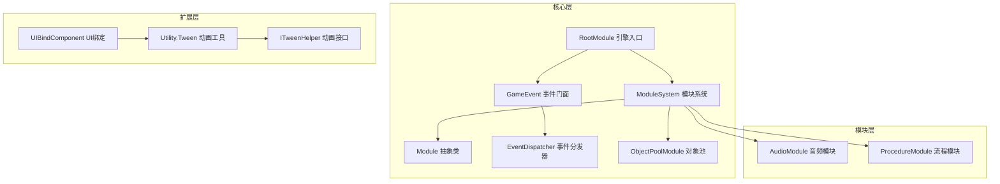
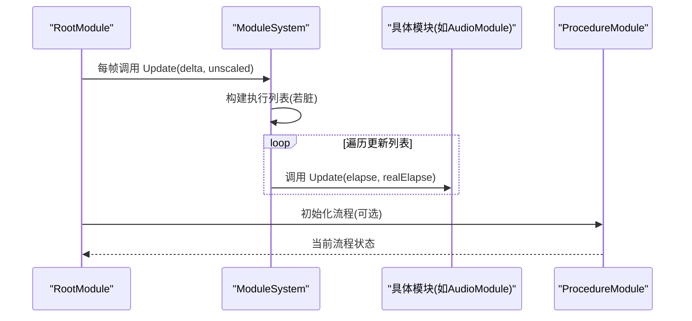
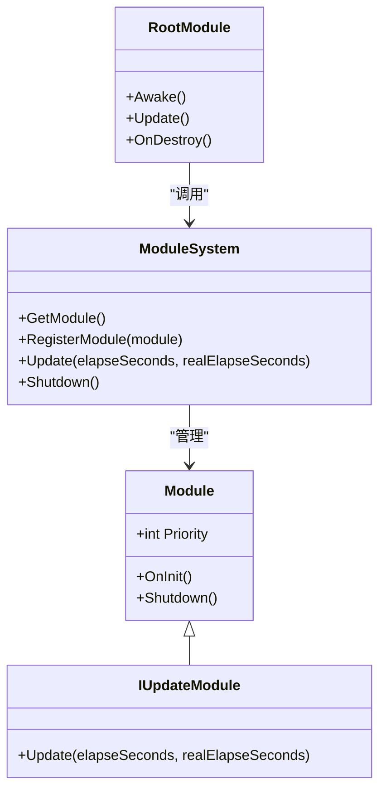
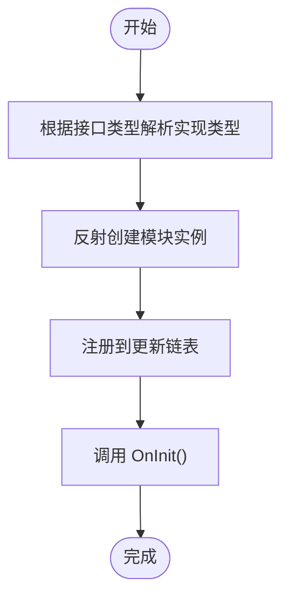
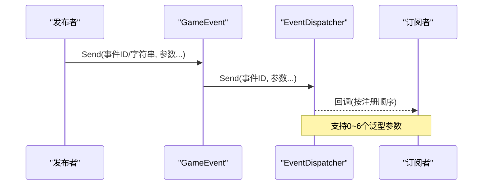
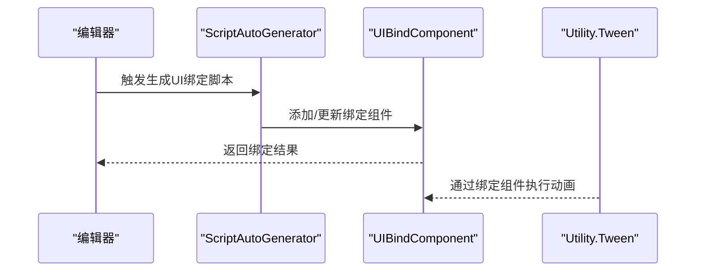
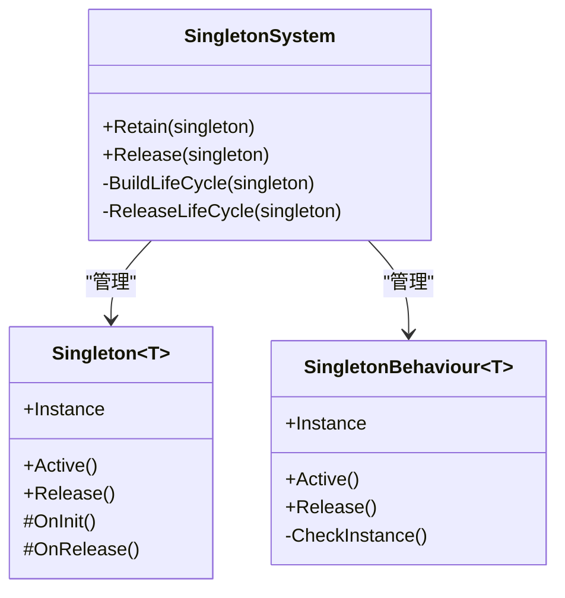
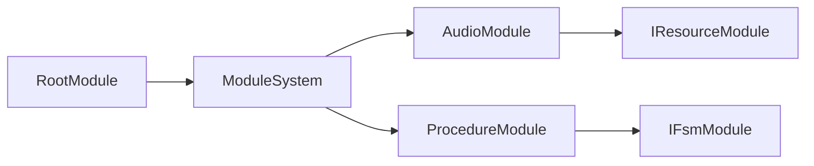

# 框架扩展方法

<cite>
**本文档引用的文件**
- [Module.cs](file://Assets/TEngine/Runtime/Core/Module.cs)
- [ModuleSystem.cs](file://Assets/TEngine/Runtime/Core/ModuleSystem.cs)
- [RootModule.cs](file://Assets/TEngine/Runtime/Module/RootModule.cs)
- [GameEvent.cs](file://Assets/TEngine/Runtime/Core/GameEvent/GameEvent.cs)
- [EventDispatcher.cs](file://Assets/TEngine/Runtime/Core/GameEvent/EventDispatcher.cs)
- [AudioModule.cs](file://Assets/TEngine/Runtime/Module/AudioModule/AudioModule.cs)
- [AudioCategory.cs](file://Assets/TEngine/Runtime/Module/AudioModule/AudioCategory.cs)
- [ObjectPoolModule.cs](file://Assets/TEngine/Runtime/Module/ObjectPoolModule/ObjectPoolModule.cs)
- [ProcedureModule.cs](file://Assets/TEngine/Runtime/Module/ProcedureModule/ProcedureModule.cs)
- [ITweenHelper.cs](file://Assets/TEngine/Runtime/Extension/Tween/ITweenHelper.cs)
- [Utility.Tween.cs](file://Assets/TEngine/Runtime/Extension/Tween/Utility.Tween.cs)
- [UIBindComponent.cs](file://Assets/GameScripts/HotFix/GameLogic/Module/UIModule/UIBindComponent/UIBindComponent.cs)
- [UIComponentEditor.cs](file://Assets/GameScripts/HotFix/GameLogic/Module/UIModule/UIBindComponent/UIComponentEditor.cs)
- [ScriptAutoGenerator.cs](file://Assets/Editor/UIScriptGenerator/ScriptAutoGenerator.cs)
- [Singleton.cs](file://Assets/GameScripts/HotFix/GameLogic/SingletonSystem/Singleton.cs)
- [SingletonBehaviour.cs](file://Assets/GameScripts/HotFix/GameLogic/SingletonSystem/SingletonBehaviour.cs)
- [SingletonSystem.cs](file://Assets/GameScripts/HotFix/GameLogic/SingletonSystem/SingletonSystem.cs)
</cite>

## 目录
1. [简介](#简介)
2. [项目结构](#项目结构)
3. [核心组件](#核心组件)
4. [架构总览](#架构总览)
5. [详细组件分析](#详细组件分析)
6. [依赖关系分析](#依赖关系分析)
7. [性能考虑](#性能考虑)
8. [故障排查指南](#故障排查指南)
9. [结论](#结论)
10. [附录](#附录)

## 简介
本文件面向TEngine框架的扩展开发者，系统性阐述如何在框架上进行模块扩展、插件系统设计、事件系统扩展以及UI组件扩展。内容覆盖模块接口实现、生命周期管理、依赖注入、扩展点识别、插件注册与动态加载、自定义事件类型与处理器、事件传播机制、UI组件绑定与动画系统集成等主题，并提供可直接参考的代码片段路径与可视化图示，帮助开发者快速掌握框架扩展技能。

## 项目结构
TEngine框架采用“模块化+事件驱动+资源管理”的组织方式：
- 核心层：模块基类与模块系统、事件系统、时间与日志、内存池等基础设施
- 模块层：音频、资源、场景、UI、流程、调试等具体模块
- 扩展层：Tween动画、UI绑定组件、编辑器工具链
- 热更新层：GameLogic与SingletonSystem，提供单例与生命周期管理

**图表来源**
- [ModuleSystem.cs:1-208](file://Assets/TEngine/Runtime/Core/ModuleSystem.cs#L1-L208)
- [RootModule.cs:1-304](file://Assets/TEngine/Runtime/Module/RootModule.cs#L1-L304)
- [GameEvent.cs:1-601](file://Assets/TEngine/Runtime/Core/GameEvent/GameEvent.cs#L1-L601)
- [EventDispatcher.cs:1-188](file://Assets/TEngine/Runtime/Core/GameEvent/EventDispatcher.cs#L1-L188)
- [AudioModule.cs:1-571](file://Assets/TEngine/Runtime/Module/AudioModule/AudioModule.cs#L1-L571)
- [ProcedureModule.cs:1-209](file://Assets/TEngine/Runtime/Module/ProcedureModule/ProcedureModule.cs#L1-L209)
- [ObjectPoolModule.cs:1-800](file://Assets/TEngine/Runtime/Module/ObjectPoolModule/ObjectPoolModule.cs#L1-L800)
- [ITweenHelper.cs:1-311](file://Assets/TEngine/Runtime/Extension/Tween/ITweenHelper.cs#L1-L311)
- [Utility.Tween.cs:565-712](file://Assets/TEngine/Runtime/Extension/Tween/Utility.Tween.cs#L565-L712)
- [UIBindComponent.cs:1-39](file://Assets/GameScripts/HotFix/GameLogic/Module/UIModule/UIBindComponent/UIBindComponent.cs#L1-L39)

**章节来源**
- [ModuleSystem.cs:1-208](file://Assets/TEngine/Runtime/Core/ModuleSystem.cs#L1-L208)
- [RootModule.cs:1-304](file://Assets/TEngine/Runtime/Module/RootModule.cs#L1-L304)

## 核心组件
- 模块基类与系统
  - 模块抽象类定义了优先级、初始化与关闭生命周期；模块系统负责模块发现、创建、注册更新列表与销毁
  - 参考路径：[Module.cs:1-40](file://Assets/TEngine/Runtime/Core/Module.cs#L1-L40)，[ModuleSystem.cs:1-208](file://Assets/TEngine/Runtime/Core/ModuleSystem.cs#L1-L208)
- 引擎入口
  - RootModule挂接在场景中，负责初始化文本/日志/JSON辅助器、帧率与时间缩放、内存告警回调，并在每帧调用模块系统的Update
  - 参考路径：[RootModule.cs:1-304](file://Assets/TEngine/Runtime/Module/RootModule.cs#L1-L304)
- 事件系统
  - GameEvent提供统一的事件门面，EventDispatcher负责事件表与分发
  - 参考路径：[GameEvent.cs:1-601](file://Assets/TEngine/Runtime/Core/GameEvent/GameEvent.cs#L1-L601)，[EventDispatcher.cs:1-188](file://Assets/TEngine/Runtime/Core/GameEvent/EventDispatcher.cs#L1-L188)
- 对象池模块
  - 提供多类型对象池管理、自动释放与更新周期
  - 参考路径：[ObjectPoolModule.cs:1-800](file://Assets/TEngine/Runtime/Module/ObjectPoolModule/ObjectPoolModule.cs#L1-L800)

**章节来源**
- [Module.cs:1-40](file://Assets/TEngine/Runtime/Core/Module.cs#L1-L40)
- [ModuleSystem.cs:1-208](file://Assets/TEngine/Runtime/Core/ModuleSystem.cs#L1-L208)
- [RootModule.cs:1-304](file://Assets/TEngine/Runtime/Module/RootModule.cs#L1-L304)
- [GameEvent.cs:1-601](file://Assets/TEngine/Runtime/Core/GameEvent/GameEvent.cs#L1-L601)
- [EventDispatcher.cs:1-188](file://Assets/TEngine/Runtime/Core/GameEvent/EventDispatcher.cs#L1-L188)
- [ObjectPoolModule.cs:1-800](file://Assets/TEngine/Runtime/Module/ObjectPoolModule/ObjectPoolModule.cs#L1-L800)

## 架构总览
TEngine采用“模块驱动 + 事件通信 + 资源管理”的架构：
- RootModule作为引擎入口，统一调度模块系统
- 模块系统按优先级维护模块链表，定期调用实现了IUpdateModule的模块
- 事件系统通过门面类与分发器解耦监听者与发布者
- 各功能模块（如音频、流程、UI）通过模块接口接入框架

**图表来源**
- [RootModule.cs:140-154](file://Assets/TEngine/Runtime/Module/RootModule.cs#L140-L154)
- [ModuleSystem.cs:29-60](file://Assets/TEngine/Runtime/Core/ModuleSystem.cs#L29-L60)
- [AudioModule.cs:560-571](file://Assets/TEngine/Runtime/Module/AudioModule/AudioModule.cs#L560-L571)
- [ProcedureModule.cs:80-123](file://Assets/TEngine/Runtime/Module/ProcedureModule/ProcedureModule.cs#L80-L123)

## 详细组件分析

### 模块系统与生命周期管理
- 接口与抽象
  - IUpdateModule：模块轮询接口
  - Module：模块抽象类，定义优先级、OnInit、Shutdown
  - 参考路径：[Module.cs:1-40](file://Assets/TEngine/Runtime/Core/Module.cs#L1-L40)
- 模块系统
  - 模块发现：通过接口类型映射到实现类型，反射创建实例
  - 注册更新：实现IUpdateModule的模块按优先级插入更新链表
  - 生命周期：GetModule时自动创建并OnInit；Shutdown时反向关闭并清空
  - 参考路径：[ModuleSystem.cs:68-194](file://Assets/TEngine/Runtime/Core/ModuleSystem.cs#L68-L194)
- 引擎入口
  - RootModule在Awake阶段初始化辅助器与系统参数，在Update中调用ModuleSystem.Update
  - 参考路径：[RootModule.cs:116-167](file://Assets/TEngine/Runtime/Module/RootModule.cs#L116-L167)

**图表来源**
- [Module.cs:1-40](file://Assets/TEngine/Runtime/Core/Module.cs#L1-L40)
- [ModuleSystem.cs:1-208](file://Assets/TEngine/Runtime/Core/ModuleSystem.cs#L1-L208)
- [RootModule.cs:1-304](file://Assets/TEngine/Runtime/Module/RootModule.cs#L1-L304)

**章节来源**
- [Module.cs:1-40](file://Assets/TEngine/Runtime/Core/Module.cs#L1-L40)
- [ModuleSystem.cs:1-208](file://Assets/TEngine/Runtime/Core/ModuleSystem.cs#L1-L208)
- [RootModule.cs:1-304](file://Assets/TEngine/Runtime/Module/RootModule.cs#L1-L304)

### 插件系统设计与动态加载
- 扩展点识别
  - 模块系统通过接口类型查找实现类型（命名空间+接口名去掉前缀），实现“约定优于配置”的扩展点
  - 参考路径：[ModuleSystem.cs:80-88](file://Assets/TEngine/Runtime/Core/ModuleSystem.cs#L80-L88)
- 插件注册机制
  - RegisterModule<T>用于注册自定义模块实例，绕过反射创建
  - 参考路径：[ModuleSystem.cs:128-141](file://Assets/TEngine/Runtime/Core/ModuleSystem.cs#L128-L141)
- 动态加载
  - 通过反射创建模块实例，结合接口约定实现模块的动态装配
  - 参考路径：[ModuleSystem.cs:107-120](file://Assets/TEngine/Runtime/Core/ModuleSystem.cs#L107-L120)

**图表来源**
- [ModuleSystem.cs:80-120](file://Assets/TEngine/Runtime/Core/ModuleSystem.cs#L80-L120)

**章节来源**
- [ModuleSystem.cs:1-208](file://Assets/TEngine/Runtime/Core/ModuleSystem.cs#L1-L208)

### 事件系统扩展指南
- 自定义事件类型
  - 使用事件接口属性系统（例如标记事件接口），通过GameEvent门面进行监听与分发
  - 参考路径：[GameEvent.cs:1-601](file://Assets/TEngine/Runtime/Core/GameEvent/GameEvent.cs#L1-L601)
- 事件处理器开发
  - 通过AddEventListener/AddEventListener(string)注册监听，RemoveEventListener移除
  - 参考路径：[GameEvent.cs:20-371](file://Assets/TEngine/Runtime/Core/GameEvent/GameEvent.cs#L20-L371)
- 事件传播机制
  - EventDispatcher内部以事件ID为键存储回调列表，Send系列方法按参数个数派发
  - 参考路径：[EventDispatcher.cs:1-188](file://Assets/TEngine/Runtime/Core/GameEvent/EventDispatcher.cs#L1-L188)

**图表来源**
- [GameEvent.cs:375-591](file://Assets/TEngine/Runtime/Core/GameEvent/GameEvent.cs#L375-L591)
- [EventDispatcher.cs:60-184](file://Assets/TEngine/Runtime/Core/GameEvent/EventDispatcher.cs#L60-L184)

**章节来源**
- [GameEvent.cs:1-601](file://Assets/TEngine/Runtime/Core/GameEvent/GameEvent.cs#L1-L601)
- [EventDispatcher.cs:1-188](file://Assets/TEngine/Runtime/Core/GameEvent/EventDispatcher.cs#L1-L188)

### UI组件扩展方法
- 自定义UI组件
  - 使用编辑器工具自动生成UI组件绑定脚本，自动注入UIBindComponent并生成字段与绑定逻辑
  - 参考路径：[ScriptAutoGenerator.cs:106-135](file://Assets/Editor/UIScriptGenerator/ScriptAutoGenerator.cs#L106-L135)
- 组件绑定扩展
  - UIBindComponent提供按索引获取绑定组件的方法，支持错误日志输出
  - 参考路径：[UIBindComponent.cs:1-39](file://Assets/GameScripts/HotFix/GameLogic/Module/UIModule/UIBindComponent/UIBindComponent.cs#L1-L39)
- 动画系统集成
  - ITweenHelper定义丰富的UI与变换动画接口，Utility.Tween作为静态门面调用ITweenHelper实现
  - 参考路径：[ITweenHelper.cs:1-311](file://Assets/TEngine/Runtime/Extension/Tween/ITweenHelper.cs#L1-L311)，[Utility.Tween.cs:565-712](file://Assets/TEngine/Runtime/Extension/Tween/Utility.Tween.cs#L565-L712)

**图表来源**
- [ScriptAutoGenerator.cs:106-135](file://Assets/Editor/UIScriptGenerator/ScriptAutoGenerator.cs#L106-L135)
- [UIBindComponent.cs:1-39](file://Assets/GameScripts/HotFix/GameLogic/Module/UIModule/UIBindComponent/UIBindComponent.cs#L1-L39)
- [ITweenHelper.cs:79-311](file://Assets/TEngine/Runtime/Extension/Tween/ITweenHelper.cs#L79-L311)
- [Utility.Tween.cs:565-712](file://Assets/TEngine/Runtime/Extension/Tween/Utility.Tween.cs#L565-L712)

**章节来源**
- [ScriptAutoGenerator.cs:106-135](file://Assets/Editor/UIScriptGenerator/ScriptAutoGenerator.cs#L106-L135)
- [UIBindComponent.cs:1-39](file://Assets/GameScripts/HotFix/GameLogic/Module/UIModule/UIBindComponent/UIBindComponent.cs#L1-L39)
- [ITweenHelper.cs:1-311](file://Assets/TEngine/Runtime/Extension/Tween/ITweenHelper.cs#L1-L311)
- [Utility.Tween.cs:565-712](file://Assets/TEngine/Runtime/Extension/Tween/Utility.Tween.cs#L565-L712)

### 单例与生命周期管理
- 单例基类
  - Singleton<T>提供静态Instance访问与生命周期钩子，SingletonSystem集中管理生命周期
  - 参考路径：[Singleton.cs:1-64](file://Assets/GameScripts/HotFix/GameLogic/SingletonSystem/Singleton.cs#L1-L64)，[SingletonSystem.cs:59-164](file://Assets/GameScripts/HotFix/GameLogic/SingletonSystem/SingletonSystem.cs#L59-L164)
- MonoBehavour单例
  - SingletonBehaviour<T>提供基于GameObject的单例持有与销毁
  - 参考路径：[SingletonBehaviour.cs:1-110](file://Assets/GameScripts/HotFix/GameLogic/SingletonSystem/SingletonBehaviour.cs#L1-L110)

**图表来源**
- [Singleton.cs:1-64](file://Assets/GameScripts/HotFix/GameLogic/SingletonSystem/Singleton.cs#L1-L64)
- [SingletonSystem.cs:59-164](file://Assets/GameScripts/HotFix/GameLogic/SingletonSystem/SingletonSystem.cs#L59-L164)
- [SingletonBehaviour.cs:1-110](file://Assets/GameScripts/HotFix/GameLogic/SingletonSystem/SingletonBehaviour.cs#L1-L110)

**章节来源**
- [Singleton.cs:1-64](file://Assets/GameScripts/HotFix/GameLogic/SingletonSystem/Singleton.cs#L1-L64)
- [SingletonSystem.cs:59-164](file://Assets/GameScripts/HotFix/GameLogic/SingletonSystem/SingletonSystem.cs#L59-L164)
- [SingletonBehaviour.cs:1-110](file://Assets/GameScripts/HotFix/GameLogic/SingletonSystem/SingletonBehaviour.cs#L1-L110)

## 依赖关系分析
- 模块间依赖
  - RootModule依赖ModuleSystem进行模块调度
  - AudioModule依赖IResourceModule进行资源加载
  - ProcedureModule依赖IFsmModule进行流程状态机管理
- 外部依赖
  - Unity引擎（MonoBehaviour、Transform、Audio等）
  - YooAsset（资源模块）

**图表来源**
- [RootModule.cs:1-304](file://Assets/TEngine/Runtime/Module/RootModule.cs#L1-L304)
- [ModuleSystem.cs:1-208](file://Assets/TEngine/Runtime/Core/ModuleSystem.cs#L1-L208)
- [AudioModule.cs:320-326](file://Assets/TEngine/Runtime/Module/AudioModule/AudioModule.cs#L320-L326)
- [ProcedureModule.cs:80-95](file://Assets/TEngine/Runtime/Module/ProcedureModule/ProcedureModule.cs#L80-L95)

**章节来源**
- [AudioModule.cs:320-326](file://Assets/TEngine/Runtime/Module/AudioModule/AudioModule.cs#L320-L326)
- [ProcedureModule.cs:80-95](file://Assets/TEngine/Runtime/Module/ProcedureModule/ProcedureModule.cs#L80-L95)

## 性能考虑
- 模块轮询
  - 通过优先级链表与脏标志避免频繁重建执行列表，降低GC与遍历成本
  - 参考路径：[ModuleSystem.cs:199-206](file://Assets/TEngine/Runtime/Core/ModuleSystem.cs#L199-L206)
- 事件系统
  - 事件ID缓存与回调列表复用，减少分配
  - 参考路径：[EventDispatcher.cs:1-188](file://Assets/TEngine/Runtime/Core/GameEvent/EventDispatcher.cs#L1-L188)
- 对象池
  - 对象池按类型与名称区分，支持自动释放与优先级排序
  - 参考路径：[ObjectPoolModule.cs:316-364](file://Assets/TEngine/Runtime/Module/ObjectPoolModule/ObjectPoolModule.cs#L316-L364)
- 动画系统
  - ITweenHelper统一接口，Utility.Tween封装调用，便于替换实现与优化
  - 参考路径：[ITweenHelper.cs:79-311](file://Assets/TEngine/Runtime/Extension/Tween/ITweenHelper.cs#L79-L311)，[Utility.Tween.cs:565-712](file://Assets/TEngine/Runtime/Extension/Tween/Utility.Tween.cs#L565-L712)

## 故障排查指南
- 模块未被发现
  - 检查接口类型与实现类型的命名约定是否符合“接口去掉I前缀 + . + 实现类名”
  - 参考路径：[ModuleSystem.cs:80-88](file://Assets/TEngine/Runtime/Core/ModuleSystem.cs#L80-L88)
- 模块未进入更新循环
  - 确认模块实现IUpdateModule且Priority设置合理
  - 参考路径：[ModuleSystem.cs:165-194](file://Assets/TEngine/Runtime/Core/ModuleSystem.cs#L165-L194)
- 事件未触发
  - 确认事件ID一致，监听与发送使用相同参数个数的重载
  - 参考路径：[GameEvent.cs:375-591](file://Assets/TEngine/Runtime/Core/GameEvent/GameEvent.cs#L375-L591)，[EventDispatcher.cs:60-184](file://Assets/TEngine/Runtime/Core/GameEvent/EventDispatcher.cs#L60-L184)
- UI绑定失败
  - 检查UIBindComponent是否存在，生成脚本是否正确注入
  - 参考路径：[UIBindComponent.cs:1-39](file://Assets/GameScripts/HotFix/GameLogic/Module/UIModule/UIBindComponent/UIBindComponent.cs#L1-L39)，[ScriptAutoGenerator.cs:106-135](file://Assets/Editor/UIScriptGenerator/ScriptAutoGenerator.cs#L106-L135)

**章节来源**
- [ModuleSystem.cs:80-194](file://Assets/TEngine/Runtime/Core/ModuleSystem.cs#L80-L194)
- [GameEvent.cs:375-591](file://Assets/TEngine/Runtime/Core/GameEvent/GameEvent.cs#L375-L591)
- [EventDispatcher.cs:60-184](file://Assets/TEngine/Runtime/Core/GameEvent/EventDispatcher.cs#L60-L184)
- [UIBindComponent.cs:1-39](file://Assets/GameScripts/HotFix/GameLogic/Module/UIModule/UIBindComponent/UIBindComponent.cs#L1-L39)
- [ScriptAutoGenerator.cs:106-135](file://Assets/Editor/UIScriptGenerator/ScriptAutoGenerator.cs#L106-L135)

## 结论
TEngine通过模块系统、事件系统与资源/对象池等基础设施，提供了清晰的扩展点与稳定的生命周期管理。开发者可遵循接口约定与反射发现机制实现模块扩展，利用事件系统进行松耦合通信，借助UI绑定与动画接口快速构建交互体验。配合单例与编辑器工具链，可进一步提升开发效率与可维护性。

## 附录
- 扩展开发清单
  - 实现IUpdateModule并在模块系统中注册或让框架发现
  - 在RootModule的生命周期中完成必要的初始化
  - 使用GameEvent进行跨模块通信
  - 通过UIBindComponent与编辑器脚本生成工具快速绑定UI
  - 使用ITweenHelper与Utility.Tween集成动画效果