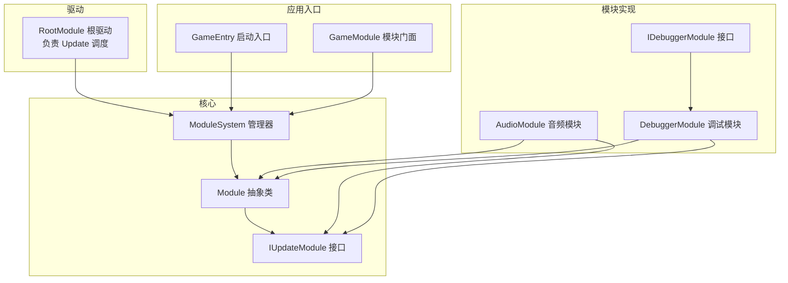
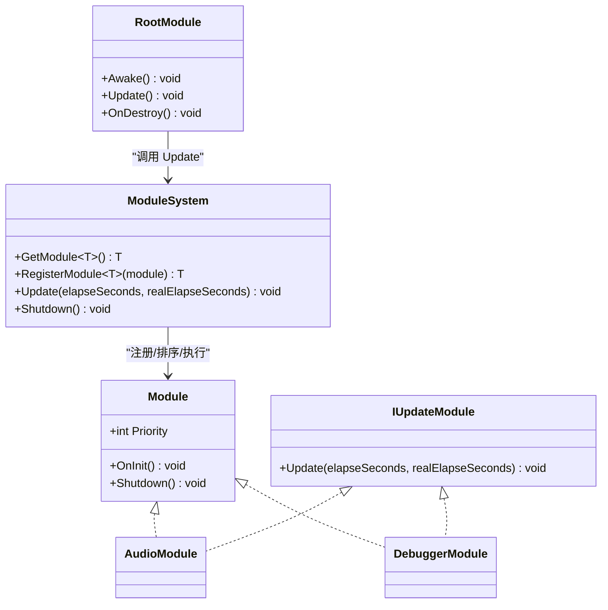
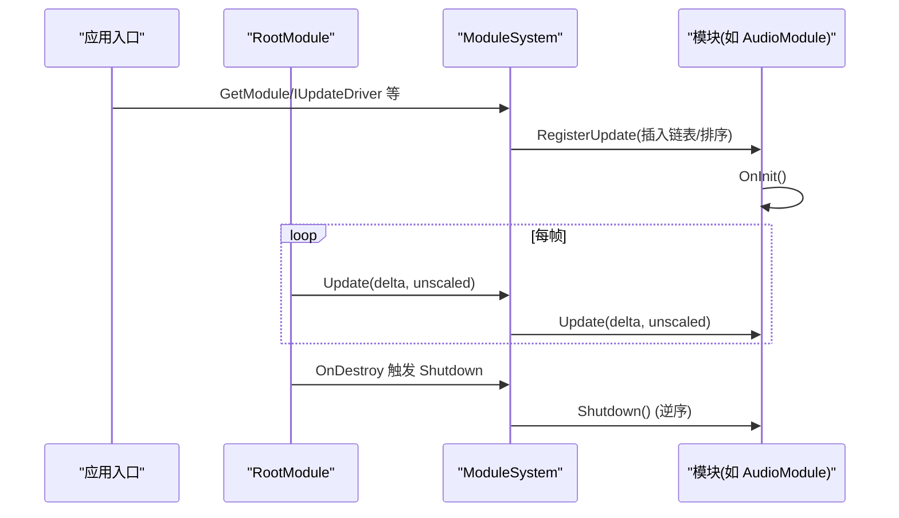
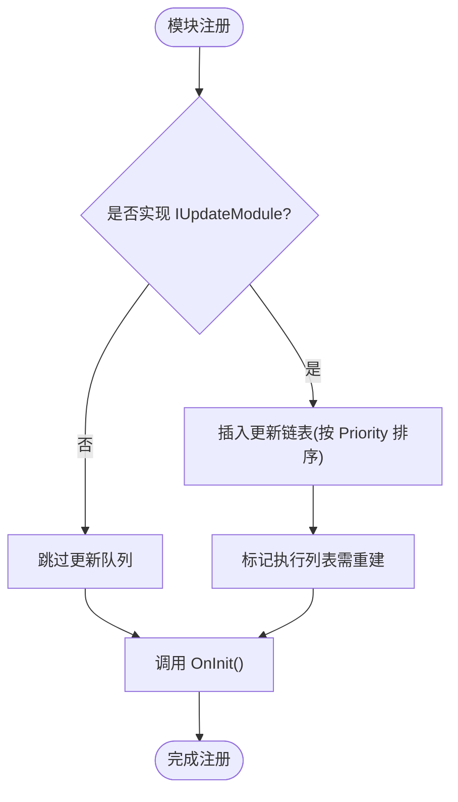
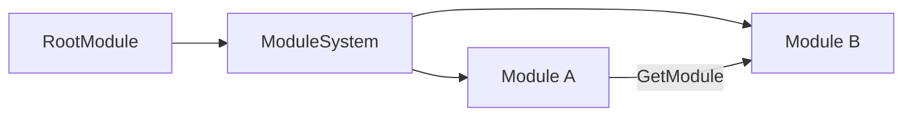

# 自定义模块开发

<cite>
**本文引用的文件**
- [Module.cs](file://Assets/TEngine/Runtime/Core/Module.cs)
- [ModuleSystem.cs](file://Assets/TEngine/Runtime/Core/ModuleSystem.cs)
- [RootModule.cs](file://Assets/TEngine/Runtime/Module/RootModule.cs)
- [AudioModule.cs](file://Assets/TEngine/Runtime/Module/AudioModule/AudioModule.cs)
- [DebuggerModule.cs](file://Assets/TEngine/Runtime/Module/DebugerModule/DebuggerModule.cs)
- [IDebuggerModule.cs](file://Assets/TEngine/Runtime/Module/DebugerModule/IDebuggerModule.cs)
- [GameModule.cs](file://Assets/GameScripts/HotFix/GameLogic/GameModule.cs)
- [GameEntry.cs](file://Assets/GameScripts/GameEntry.cs)
- [LocalizationManager.cs](file://Assets/TEngine/Runtime/Module/LocalizationModule/LocalizationManager.cs)
- [GameEvent.cs](file://Assets/TEngine/Runtime/Core/GameEvent/GameEvent.cs)
- [EventInterfaceAttribute.cs](file://Assets/TEngine/Runtime/Core/GameEvent/EventInterfaceAttribute.cs)
</cite>

## 目录
1. [简介](#简介)
2. [项目结构](#项目结构)
3. [核心组件](#核心组件)
4. [架构总览](#架构总览)
5. [详细组件分析](#详细组件分析)
6. [依赖分析](#依赖分析)
7. [性能考虑](#性能考虑)
8. [故障排查指南](#故障排查指南)
9. [结论](#结论)
10. [附录：完整开发示例](#附录完整开发示例)

## 简介
本文件面向希望在 TEngine 框架上开发自定义模块的工程师，系统讲解模块接口与抽象类的实现方法、模块生命周期管理（初始化、更新循环、清理）、模块优先级与依赖关系处理、模块间通信机制、错误处理策略与性能优化技巧，并提供可直接落地的完整开发示例。

## 项目结构
TEngine 的模块体系由“核心抽象”“模块系统管理”“根驱动”三部分组成，典型模块（如音频、调试器）通过实现接口与抽象类接入统一调度。应用入口通过模块系统获取必要模块，驱动主循环。

图示来源
- [Module.cs:1-40](file://Assets/TEngine/Runtime/Core/Module.cs#L1-L40)
- [ModuleSystem.cs:1-208](file://Assets/TEngine/Runtime/Core/ModuleSystem.cs#L1-L208)
- [RootModule.cs:1-304](file://Assets/TEngine/Runtime/Module/RootModule.cs#L1-L304)
- [AudioModule.cs:1-571](file://Assets/TEngine/Runtime/Module/AudioModule/AudioModule.cs#L1-L571)
- [DebuggerModule.cs:1-116](file://Assets/TEngine/Runtime/Module/DebugerModule/DebuggerModule.cs#L1-L116)
- [IDebuggerModule.cs:1-55](file://Assets/TEngine/Runtime/Module/DebugerModule/IDebuggerModule.cs#L1-L55)
- [GameEntry.cs:1-15](file://Assets/GameScripts/GameEntry.cs#L1-L15)
- [GameModule.cs:1-118](file://Assets/GameScripts/HotFix/GameLogic/GameModule.cs#L1-L118)

章节来源
- [Module.cs:1-40](file://Assets/TEngine/Runtime/Core/Module.cs#L1-L40)
- [ModuleSystem.cs:1-208](file://Assets/TEngine/Runtime/Core/ModuleSystem.cs#L1-L208)
- [RootModule.cs:1-304](file://Assets/TEngine/Runtime/Module/RootModule.cs#L1-L304)
- [GameEntry.cs:1-15](file://Assets/GameScripts/GameEntry.cs#L1-L15)

## 核心组件
- 模块抽象与接口
  - Module 抽象类：定义 Priority、OnInit、Shutdown 生命周期钩子。
  - IUpdateModule 接口：定义 Update 循环方法。
- 模块系统
  - ModuleSystem：集中注册、排序、调度模块；维护模块字典、更新链表与执行列表；提供 GetModule/RegisterModule。
- 根驱动
  - RootModule：挂载于场景根对象，每帧调用 ModuleSystem.Update，负责全局生命周期与资源回收。

章节来源
- [Module.cs:1-40](file://Assets/TEngine/Runtime/Core/Module.cs#L1-L40)
- [ModuleSystem.cs:1-208](file://Assets/TEngine/Runtime/Core/ModuleSystem.cs#L1-L208)
- [RootModule.cs:140-167](file://Assets/TEngine/Runtime/Module/RootModule.cs#L140-L167)

## 架构总览
模块系统采用“接口约束 + 抽象基类 + 管理器”的分层设计，模块通过接口声明能力，通过抽象类实现生命周期，由管理器统一调度与排序。

图示来源
- [Module.cs:1-40](file://Assets/TEngine/Runtime/Core/Module.cs#L1-L40)
- [ModuleSystem.cs:1-208](file://Assets/TEngine/Runtime/Core/ModuleSystem.cs#L1-L208)
- [RootModule.cs:140-167](file://Assets/TEngine/Runtime/Module/RootModule.cs#L140-L167)
- [AudioModule.cs:11-571](file://Assets/TEngine/Runtime/Module/AudioModule/AudioModule.cs#L11-L571)
- [DebuggerModule.cs:8-116](file://Assets/TEngine/Runtime/Module/DebugerModule/DebuggerModule.cs#L8-L116)

## 详细组件分析

### 生命周期管理
- 初始化（OnInit）
  - 模块注册时自动触发 OnInit，用于拉取依赖模块、读取配置、建立内部状态。
  - 示例：音频模块在 OnInit 中获取资源模块并初始化混音器与分类。
- 更新循环（Update）
  - 实现 IUpdateModule 的模块会被加入更新链表，按优先级排序，每帧顺序调用。
  - 示例：音频模块与调试模块均实现 Update，分别驱动各类音频代理与调试窗口。
- 清理（Shutdown）
  - 应用退出或系统关闭时，按逆序依次调用 Shutdown，释放资源、停止任务、清空缓存。
  - 示例：音频模块停止所有声音并清理对象池；调试模块关闭窗口树。

图示来源
- [RootModule.cs:140-167](file://Assets/TEngine/Runtime/Module/RootModule.cs#L140-L167)
- [ModuleSystem.cs:29-60](file://Assets/TEngine/Runtime/Core/ModuleSystem.cs#L29-L60)
- [AudioModule.cs:322-332](file://Assets/TEngine/Runtime/Module/AudioModule/AudioModule.cs#L322-L332)
- [DebuggerModule.cs:16-62](file://Assets/TEngine/Runtime/Module/DebugerModule/DebuggerModule.cs#L16-L62)

章节来源
- [ModuleSystem.cs:29-60](file://Assets/TEngine/Runtime/Core/ModuleSystem.cs#L29-L60)
- [RootModule.cs:140-167](file://Assets/TEngine/Runtime/Module/RootModule.cs#L140-L167)
- [AudioModule.cs:322-332](file://Assets/TEngine/Runtime/Module/AudioModule/AudioModule.cs#L322-L332)
- [DebuggerModule.cs:16-62](file://Assets/TEngine/Runtime/Module/DebugerModule/DebuggerModule.cs#L16-L62)

### 模块优先级与依赖关系
- 优先级（Priority）
  - 模块注册时根据 Priority 插入到模块链表与更新链表，数值越大越靠前。
  - 示例：调试模块将 Priority 设为较低值，确保其他模块先于调试模块更新。
- 依赖关系
  - 模块在 OnInit 中通过 ModuleSystem.GetModule<T>() 获取所需依赖，形成显式依赖链。
  - 示例：音频模块依赖资源模块；本地化模块在绑定时注册自身接口。

图示来源
- [ModuleSystem.cs:143-194](file://Assets/TEngine/Runtime/Core/ModuleSystem.cs#L143-L194)
- [DebuggerModule.cs:26](file://Assets/TEngine/Runtime/Module/DebugerModule/DebuggerModule.cs#L26)
- [AudioModule.cs:322-326](file://Assets/TEngine/Runtime/Module/AudioModule/AudioModule.cs#L322-L326)
- [LocalizationManager.cs:75-78](file://Assets/TEngine/Runtime/Module/LocalizationModule/LocalizationManager.cs#L75-L78)

章节来源
- [ModuleSystem.cs:143-194](file://Assets/TEngine/Runtime/Core/ModuleSystem.cs#L143-L194)
- [DebuggerModule.cs:26](file://Assets/TEngine/Runtime/Module/DebugerModule/DebuggerModule.cs#L26)
- [AudioModule.cs:322-326](file://Assets/TEngine/Runtime/Module/AudioModule/AudioModule.cs#L322-L326)
- [LocalizationManager.cs:75-78](file://Assets/TEngine/Runtime/Module/LocalizationModule/LocalizationManager.cs#L75-L78)

### 模块接口与抽象类实现
- 实现 IUpdateModule
  - 在模块类中显式实现 Update(elapseSeconds, realElapseSeconds)，以便被统一调度。
  - 示例：音频模块与调试模块均实现该接口。
- 继承 Module 并覆写 OnInit/Shutdown
  - 通过抽象类统一生命周期；在 OnInit 中拉取依赖，在 Shutdown 中释放资源。
  - 示例：音频模块与调试模块均继承 Module 并实现 OnInit/Shutdown。
- 通过接口类型获取模块
  - 使用 ModuleSystem.GetModule<IYourModule>() 获取模块实例，框架按接口名映射到具体实现类型。
  - 示例：GameModule 提供静态门面封装常用模块访问。

章节来源
- [Module.cs:8-39](file://Assets/TEngine/Runtime/Core/Module.cs#L8-L39)
- [AudioModule.cs:11-571](file://Assets/TEngine/Runtime/Module/AudioModule/AudioModule.cs#L11-L571)
- [DebuggerModule.cs:8-116](file://Assets/TEngine/Runtime/Module/DebugerModule/DebuggerModule.cs#L8-L116)
- [GameModule.cs:94-101](file://Assets/GameScripts/HotFix/GameLogic/GameModule.cs#L94-L101)

### 模块间通信机制
- 事件系统
  - 通过 GameEvent 发送/订阅事件，模块间解耦通信。
  - 可通过 EventInterfaceAttribute 标注事件接口分组，便于管理。
- 依赖注入（建议）
  - 在模块构造函数中注入所需接口，降低耦合与测试难度。
  - 参考系统模式中的构造函数注入范式。

章节来源
- [GameEvent.cs:355-601](file://Assets/TEngine/Runtime/Core/GameEvent/GameEvent.cs#L355-L601)
- [EventInterfaceAttribute.cs:1-31](file://Assets/TEngine/Runtime/Core/GameEvent/EventInterfaceAttribute.cs#L1-L31)

## 依赖分析
- 模块到管理器
  - 模块通过 ModuleSystem.RegisterModule/GetModule 完成注册与发现。
- 驱动到模块
  - RootModule 每帧调用 ModuleSystem.Update，驱动所有 IUpdateModule。
- 模块到模块
  - 通过接口类型在 OnInit 中相互获取，形成松耦合依赖。

图示来源
- [RootModule.cs:140-167](file://Assets/TEngine/Runtime/Module/RootModule.cs#L140-L167)
- [ModuleSystem.cs:68-89](file://Assets/TEngine/Runtime/Core/ModuleSystem.cs#L68-L89)

章节来源
- [RootModule.cs:140-167](file://Assets/TEngine/Runtime/Module/RootModule.cs#L140-L167)
- [ModuleSystem.cs:68-89](file://Assets/TEngine/Runtime/Core/ModuleSystem.cs#L68-L89)

## 性能考虑
- 更新列表惰性重建
  - ModuleSystem 在注册新模块或变更优先级时仅标记脏位，首次 Update 时一次性重建执行列表，避免频繁分配。
- 优先级排序
  - 通过链表插入按优先级排序，保证高优先级模块先执行，减少不必要的判断开销。
- 内存与资源
  - Shutdown 时统一清理模块、内存池与缓存，防止泄漏。
- 建议
  - 将昂贵操作拆分到多帧，避免单帧长时间卡顿。
  - 对高频 Update 的模块，尽量减少 GCAlloc，复用对象与数组。

章节来源
- [ModuleSystem.cs:29-42](file://Assets/TEngine/Runtime/Core/ModuleSystem.cs#L29-L42)
- [ModuleSystem.cs:199-206](file://Assets/TEngine/Runtime/Core/ModuleSystem.cs#L199-L206)
- [ModuleSystem.cs:47-60](file://Assets/TEngine/Runtime/Core/ModuleSystem.cs#L47-L60)

## 故障排查指南
- 获取模块失败
  - 若接口类型未正确映射到具体实现，GetModule 会抛出异常。检查接口命名空间与程序集是否匹配。
- 未进入 Update
  - 确认模块实现了 IUpdateModule，且注册时未被过滤。
- 优先级不生效
  - 检查 Priority 返回值是否合理，确认注册顺序与链表插入逻辑。
- Shutdown 异常
  - 确保 Shutdown 中释放顺序正确，避免跨模块竞态。

章节来源
- [ModuleSystem.cs:68-89](file://Assets/TEngine/Runtime/Core/ModuleSystem.cs#L68-L89)
- [ModuleSystem.cs:128-141](file://Assets/TEngine/Runtime/Core/ModuleSystem.cs#L128-L141)
- [RootModule.cs:162-167](file://Assets/TEngine/Runtime/Module/RootModule.cs#L162-L167)

## 结论
TEngine 的模块系统以清晰的抽象与严格的生命周期管理为核心，辅以优先级与依赖注入理念，既保证了扩展性，又兼顾性能与可维护性。遵循本文的实现步骤与最佳实践，即可快速构建高质量的自定义模块。

## 附录：完整开发示例
以下为“如何从零开发一个自定义模块”的端到端流程，涵盖接口设计、实现、注册、配置、交互与清理。

- 步骤一：定义模块接口
  - 在独立程序集或现有模块接口下新增接口，约定模块能力边界。
  - 示例参考：调试模块接口 IDebuggerModule 的设计思路。
- 步骤二：实现模块类
  - 新建类继承 Module，并实现 IUpdateModule（若需要每帧更新）。
  - 在 OnInit 中通过 ModuleSystem.GetModule<T>() 获取依赖模块。
  - 在 Shutdown 中释放资源、停止任务。
  - 示例参考：调试模块与音频模块的实现。
- 步骤三：注册模块
  - 方式一：通过 ModuleSystem.RegisterModule<T>(module) 注册已实例化的模块。
  - 方式二：通过 ModuleSystem.GetModule<T>() 让框架自动创建并注册（需确保接口名与实现类型映射正确）。
- 步骤四：配置与初始化
  - 在模块 OnInit 中读取配置（如设置、资源包），并初始化内部状态。
  - 示例参考：音频模块在 OnInit 中初始化资源模块与混音器。
- 步骤五：模块间交互
  - 使用 GameEvent 进行事件通信；或在构造函数中注入所需接口，降低耦合。
  - 示例参考：本地化模块在绑定时注册自身接口。
- 步骤六：生命周期与清理
  - 在 RootModule OnDestroy 或应用退出时，确保 ModuleSystem.Shutdown 被调用，逆序调用各模块 Shutdown。
- 步骤七：验证与优化
  - 通过 RootModule 每帧 Update 验证模块是否参与调度。
  - 关注性能指标，必要时拆分 Update 逻辑，减少单帧开销。

章节来源
- [IDebuggerModule.cs:1-55](file://Assets/TEngine/Runtime/Module/DebugerModule/IDebuggerModule.cs#L1-L55)
- [DebuggerModule.cs:8-116](file://Assets/TEngine/Runtime/Module/DebugerModule/DebuggerModule.cs#L8-L116)
- [AudioModule.cs:322-332](file://Assets/TEngine/Runtime/Module/AudioModule/AudioModule.cs#L322-L332)
- [ModuleSystem.cs:128-141](file://Assets/TEngine/Runtime/Core/ModuleSystem.cs#L128-L141)
- [ModuleSystem.cs:68-89](file://Assets/TEngine/Runtime/Core/ModuleSystem.cs#L68-L89)
- [LocalizationManager.cs:75-78](file://Assets/TEngine/Runtime/Module/LocalizationModule/LocalizationManager.cs#L75-L78)
- [RootModule.cs:162-167](file://Assets/TEngine/Runtime/Module/RootModule.cs#L162-L167)
- [GameEntry.cs:6-14](file://Assets/GameScripts/GameEntry.cs#L6-L14)
- [GameModule.cs:94-101](file://Assets/GameScripts/HotFix/GameLogic/GameModule.cs#L94-L101)