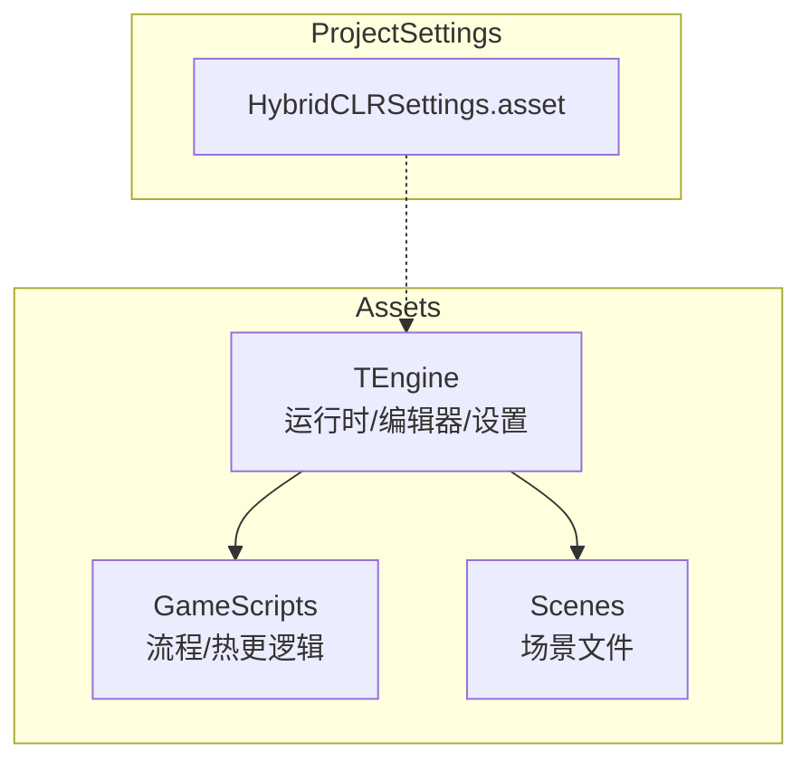
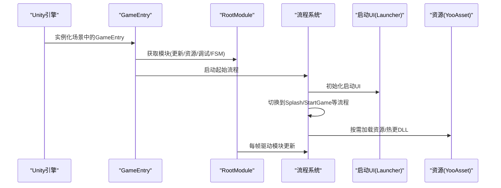
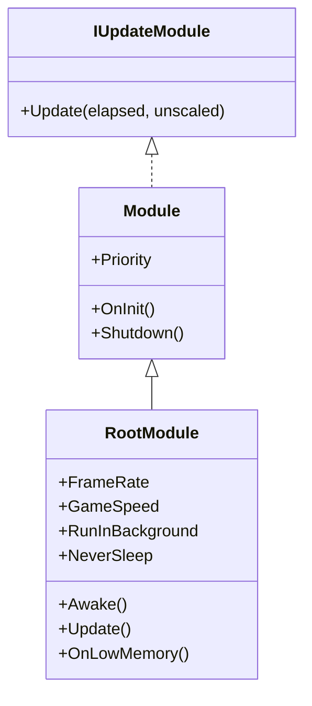
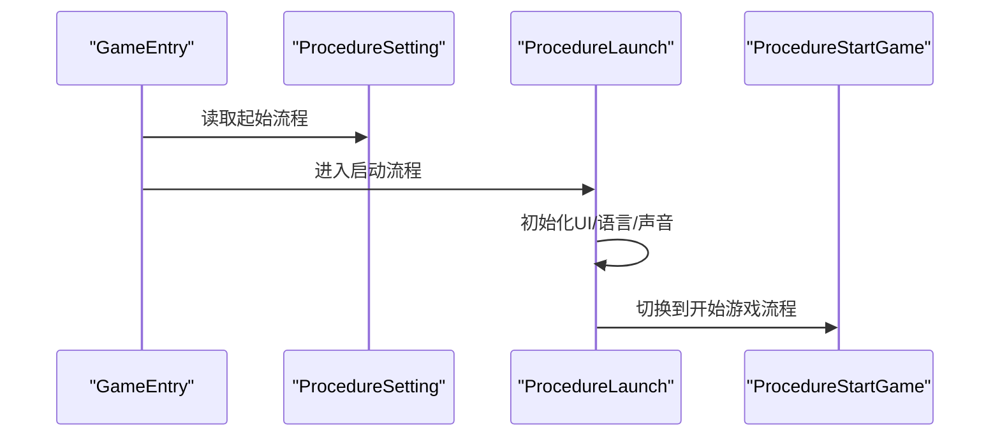
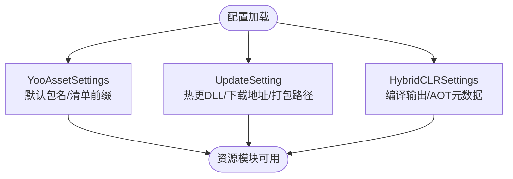
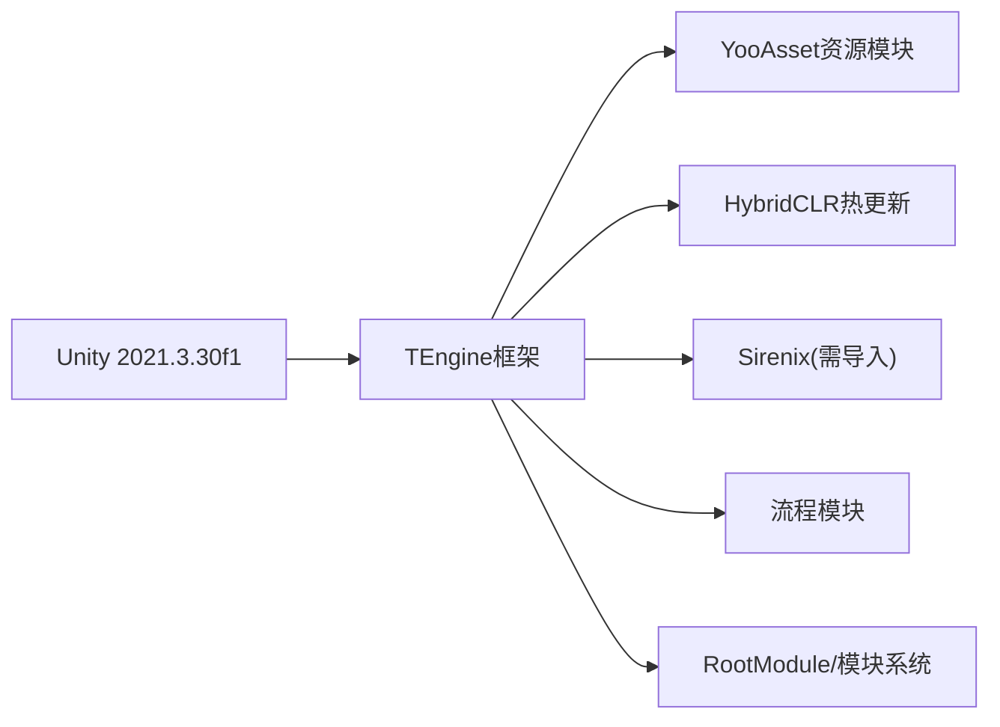

# 快速开始

<cite>
**本文引用的文件**
- [README.md](file://Assets/TEngine/README.md)
- [package.json](file://Assets/TEngine/package.json)
- [GameEntry.cs](file://Assets/GameScripts/GameEntry.cs)
- [RootModule.cs](file://Assets/TEngine/Runtime/Core/Module.cs)
- [RootModule.cs](file://Assets/TEngine/Runtime/Module/RootModule.cs)
- [ProcedureSetting.asset](file://Assets/TEngine/Settings/ProcedureSetting.asset)
- [UpdateSetting.asset](file://Assets/TEngine/Settings/UpdateSetting.asset)
- [YooAssetSettings.asset](file://Assets/TEngine/Settings/Resources/YooAssetSettings.asset)
- [HybridCLRSettings.asset](file://ProjectSettings/HybridCLRSettings.asset)
- [GameEntry.prefab](file://Assets/TEngine/Settings/Prefab/GameEntry.prefab)
- [main.unity.meta](file://Assets/Scenes/main.unity.meta)
- [ProcedureLaunch.cs](file://Assets/GameScripts/Procedure/ProcedureLaunch.cs)
- [ProcedureStartGame.cs](file://Assets/GameScripts/Procedure/ProcedureStartGame.cs)
</cite>

## 目录
1. [简介](#简介)
2. [项目结构](#项目结构)
3. [核心组件](#核心组件)
4. [架构总览](#架构总览)
5. [详细组件分析](#详细组件分析)
6. [依赖关系分析](#依赖关系分析)
7. [性能注意事项](#性能注意事项)
8. [故障排查指南](#故障排查指南)
9. [结论](#结论)
10. [附录](#附录)

## 简介
本指南面向新加入的开发者，目标是在约5分钟内完成TEngine框架的基础环境搭建、项目导入、初始配置与基本运行验证，并通过第一个“Hello World”示例（启动流程与UI显示）确认框架可用。内容覆盖Unity 2021.3.30f1安装与配置、必要第三方插件导入（Sirenix、YooAsset、HybridCLR）、项目导入流程、初始配置步骤与基本运行验证，以及常见问题排查。

## 项目结构
TEngine采用“框架核心 + 游戏脚本 + 场景资源”的组织方式，核心目录如下：
- Assets/TEngine：框架运行时与编辑器代码、设置资源、预制体等
- Assets/GameScripts：游戏逻辑与流程模块（Procedure）
- Assets/Scenes：场景文件
- ProjectSettings：Unity工程设置（含HybridCLR设置）

图表来源
- [package.json:11](file://Assets/TEngine/package.json#L11)
- [README.md:61-83](file://Assets/TEngine/README.md#L61-L83)

章节来源
- [README.md:61-83](file://Assets/TEngine/README.md#L61-L83)
- [package.json:11](file://Assets/TEngine/package.json#L11)

## 核心组件
- 游戏入口与模块系统
  - GameEntry：场景中的入口脚本，负责初始化模块系统并启动流程
  - RootModule：根模块，负责全局参数初始化、帧循环与模块系统驱动
  - ModuleSystem：模块系统，统一管理各子模块生命周期
- 流程系统
  - ProcedureSetting：定义可用流程类型与起始流程
  - ProcedureLaunch/ProcedureStartGame：演示启动与进入游戏的流程节点
- 资源与热更新
  - YooAssetSettings：资源包与清单配置
  - UpdateSetting：热更新DLL列表、下载地址、打包路径等
  - HybridCLRSettings：热更新DLL编译输出、AOT元数据等

章节来源
- [GameEntry.cs:4-14](file://Assets/GameScripts/GameEntry.cs#L4-L14)
- [RootModule.cs:116-167](file://Assets/TEngine/Runtime/Module/RootModule.cs#L116-L167)
- [RootModule.cs:140-154](file://Assets/TEngine/Runtime/Module/RootModule.cs#L140-L154)
- [ProcedureSetting.asset:15-27](file://Assets/TEngine/Settings/ProcedureSetting.asset#L15-L27)
- [ProcedureLaunch.cs:23-43](file://Assets/GameScripts/Procedure/ProcedureLaunch.cs#L23-L43)
- [ProcedureStartGame.cs:12-22](file://Assets/GameScripts/Procedure/ProcedureStartGame.cs#L12-L22)
- [YooAssetSettings.asset:15-16](file://Assets/TEngine/Settings/Resources/YooAssetSettings.asset#L15-L16)
- [UpdateSetting.asset:15-36](file://Assets/TEngine/Settings/UpdateSetting.asset#L15-L36)
- [HybridCLRSettings.asset:15-39](file://ProjectSettings/HybridCLRSettings.asset#L15-L39)

## 架构总览
下图展示了从Unity启动到流程驱动的关键交互：

图表来源
- [GameEntry.cs:8-12](file://Assets/GameScripts/GameEntry.cs#L8-L12)
- [RootModule.cs:140-154](file://Assets/TEngine/Runtime/Module/RootModule.cs#L140-L154)
- [ProcedureLaunch.cs:27-35](file://Assets/GameScripts/Procedure/ProcedureLaunch.cs#L27-L35)
- [ProcedureStartGame.cs:15-22](file://Assets/GameScripts/Procedure/ProcedureStartGame.cs#L15-L22)

## 详细组件分析

### 组件A：模块系统与根模块
- 模块系统职责
  - 提供统一的模块生命周期管理（初始化/更新/关闭）
  - 通过接口隔离具体模块（如IUpdateDriver、IResourceModule、IDebuggerModule、IFsmModule）
- RootModule关键行为
  - 初始化文本/日志/JSON辅助器
  - 设置帧率、后台运行、休眠策略
  - 每帧调用ModuleSystem.Update驱动模块
  - 内存告警时触发对象池与资源模块回收

图表来源
- [RootModule.cs:22-39](file://Assets/TEngine/Runtime/Core/Module.cs#L22-L39)
- [RootModule.cs:116-167](file://Assets/TEngine/Runtime/Module/RootModule.cs#L116-L167)

章节来源
- [RootModule.cs:116-167](file://Assets/TEngine/Runtime/Module/RootModule.cs#L116-L167)
- [RootModule.cs:140-154](file://Assets/TEngine/Runtime/Module/RootModule.cs#L140-L154)

### 组件B：流程系统与启动流程
- 流程系统
  - 通过ProcedureSetting定义可用流程与起始流程
  - 在GameEntry中启动起始流程
- 启动流程（ProcedureLaunch）
  - 初始化启动UI（Launcher）
  - 初始化语言与声音设置
  - 立即切换到后续流程（如Splash）

图表来源
- [ProcedureSetting.asset:27](file://Assets/TEngine/Settings/ProcedureSetting.asset#L27)
- [GameEntry.cs:12](file://Assets/GameScripts/GameEntry.cs#L12)
- [ProcedureLaunch.cs:23-43](file://Assets/GameScripts/Procedure/ProcedureLaunch.cs#L23-L43)

章节来源
- [ProcedureSetting.asset:15-27](file://Assets/TEngine/Settings/ProcedureSetting.asset#L15-L27)
- [ProcedureLaunch.cs:23-43](file://Assets/GameScripts/Procedure/ProcedureLaunch.cs#L23-L43)
- [ProcedureStartGame.cs:12-22](file://Assets/GameScripts/Procedure/ProcedureStartGame.cs#L12-L22)

### 组件C：资源与热更新配置
- YooAssetSettings：默认资源包目录与清单前缀
- UpdateSetting：热更DLL列表、AOT元数据、下载地址、打包路径等
- HybridCLRSettings：热更新DLL编译输出目录、AOT元数据、链接XML输出等

图表来源
- [YooAssetSettings.asset:15-16](file://Assets/TEngine/Settings/Resources/YooAssetSettings.asset#L15-L16)
- [UpdateSetting.asset:16-36](file://Assets/TEngine/Settings/UpdateSetting.asset#L16-L36)
- [HybridCLRSettings.asset:20-39](file://ProjectSettings/HybridCLRSettings.asset#L20-L39)

章节来源
- [YooAssetSettings.asset:15-16](file://Assets/TEngine/Settings/Resources/YooAssetSettings.asset#L15-L16)
- [UpdateSetting.asset:16-36](file://Assets/TEngine/Settings/UpdateSetting.asset#L16-L36)
- [HybridCLRSettings.asset:20-39](file://ProjectSettings/HybridCLRSettings.asset#L20-L39)

## 依赖关系分析
- Unity版本约束：TEngine声明使用Unity 2021.3.30f1
- 第三方插件
  - Sirenix：用于Inspector扩展与序列化辅助（需自行购买导入）
  - YooAsset：资源管理与热更新
  - HybridCLR：热更新DLL与AOT元数据管理
- 工程设置
  - HybridCLRSettings控制热更新编译与AOT元数据输出
  - YooAssetSettings控制资源包与清单

图表来源
- [package.json:11](file://Assets/TEngine/package.json#L11)
- [README.md:85-87](file://Assets/TEngine/README.md#L85-L87)
- [HybridCLRSettings.asset:15-39](file://ProjectSettings/HybridCLRSettings.asset#L15-L39)
- [YooAssetSettings.asset:15-16](file://Assets/TEngine/Settings/Resources/YooAssetSettings.asset#L15-L16)

章节来源
- [package.json:11](file://Assets/TEngine/package.json#L11)
- [README.md:85-87](file://Assets/TEngine/README.md#L85-L87)

## 性能注意事项
- 帧率与后台运行：通过RootModule设置目标帧率与后台运行策略，有助于稳定帧与时钟节拍
- 资源回收：内存告警时触发对象池与资源模块回收，建议结合YooAsset的自动释放策略
- 热更新DLL数量：合理控制热更DLL数量与大小，避免启动时长与内存峰值过高

## 故障排查指南
- Unity版本不匹配
  - 症状：无法打开项目或编译错误
  - 处理：确保使用Unity 2021.3.30f1
- 缺少第三方插件
  - 症状：编译报错或Inspector缺失
  - 处理：导入Sirenix；确认YooAsset与HybridCLR已正确安装并启用
- 流程未启动或黑屏
  - 症状：进入场景后无UI或无反应
  - 处理：检查GameEntry是否挂载于场景；确认ProcedureSetting的起始流程存在；查看启动流程是否成功切换
- 热更新DLL未生效
  - 症状：修改逻辑后无变化
  - 处理：确认UpdateSetting中的热更DLL列表包含对应DLL；确认HybridCLRSettings的编译输出目录与AOT元数据配置正确
- 资源加载异常
  - 症状：资源无法加载或热更新失败
  - 处理：检查YooAssetSettings的默认包名与清单前缀；核对UpdateSetting中的下载地址与打包路径

章节来源
- [package.json:11](file://Assets/TEngine/package.json#L11)
- [README.md:85-87](file://Assets/TEngine/README.md#L85-L87)
- [ProcedureSetting.asset:27](file://Assets/TEngine/Settings/ProcedureSetting.asset#L27)
- [UpdateSetting.asset:16-36](file://Assets/TEngine/Settings/UpdateSetting.asset#L16-L36)
- [HybridCLRSettings.asset:20-39](file://ProjectSettings/HybridCLRSettings.asset#L20-L39)
- [YooAssetSettings.asset:15-16](file://Assets/TEngine/Settings/Resources/YooAssetSettings.asset#L15-L16)

## 结论
通过本指南，你可以在Unity 2021.3.30f1环境下完成TEngine框架的快速搭建与验证。建议先完成环境与插件准备，再导入项目并按初始配置步骤逐一核对，最后通过启动流程与启动UI验证框架可用性。遇到问题时，可依据故障排查指南逐项定位。

## 附录

### 快速开始步骤清单
- 安装Unity 2021.3.30f1
- 导入必要第三方插件：Sirenix、YooAsset、HybridCLR
- 打开项目并导入TEngine
- 配置流程设置（起始流程）
- 验证启动流程与启动UI显示
- 如需热更新，配置UpdateSetting与HybridCLRSettings

章节来源
- [package.json:11](file://Assets/TEngine/package.json#L11)
- [README.md:85-87](file://Assets/TEngine/README.md#L85-L87)
- [ProcedureSetting.asset:27](file://Assets/TEngine/Settings/ProcedureSetting.asset#L27)

### Hello World示例：创建第一个场景与运行框架
- 创建场景
  - 在Assets/Scenes中新建场景，命名为main.unity
  - 将GameEntry.prefab拖入场景
- 验证运行
  - 点击播放，观察启动UI是否出现
  - 查看控制台日志，确认流程已启动
- 参考文件
  - GameEntry.prefab：包含RootModule、Settings、Debugger、MemoryPool、Localization、ResourceDriver等组件
  - ProcedureSetting：定义起始流程
  - ProcedureLaunch/ProcedureStartGame：启动与进入游戏流程

章节来源
- [main.unity.meta:1-8](file://Assets/Scenes/main.unity.meta#L1-L8)
- [GameEntry.prefab:246-396](file://Assets/TEngine/Settings/Prefab/GameEntry.prefab#L246-L396)
- [ProcedureSetting.asset:27](file://Assets/TEngine/Settings/ProcedureSetting.asset#L27)
- [ProcedureLaunch.cs:23-43](file://Assets/GameScripts/Procedure/ProcedureLaunch.cs#L23-L43)
- [ProcedureStartGame.cs:12-22](file://Assets/GameScripts/Procedure/ProcedureStartGame.cs#L12-L22)