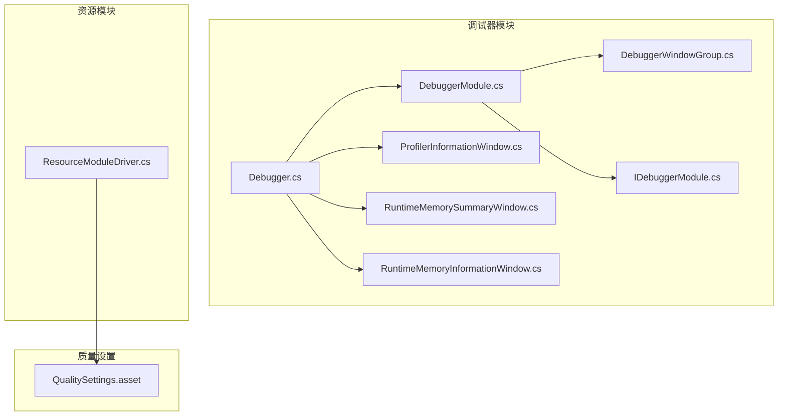
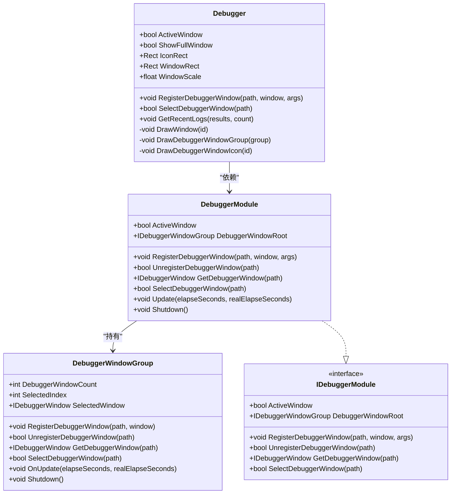
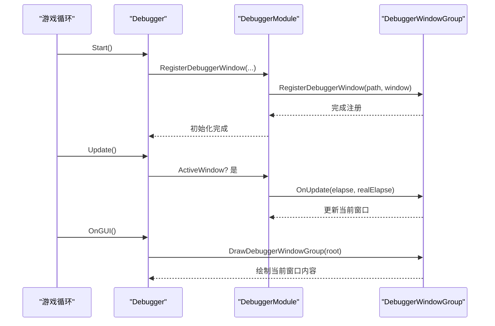
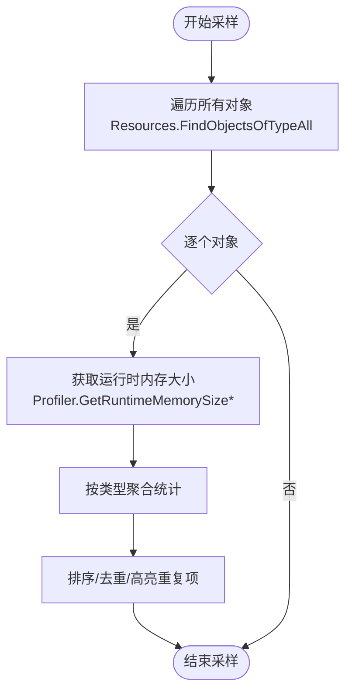
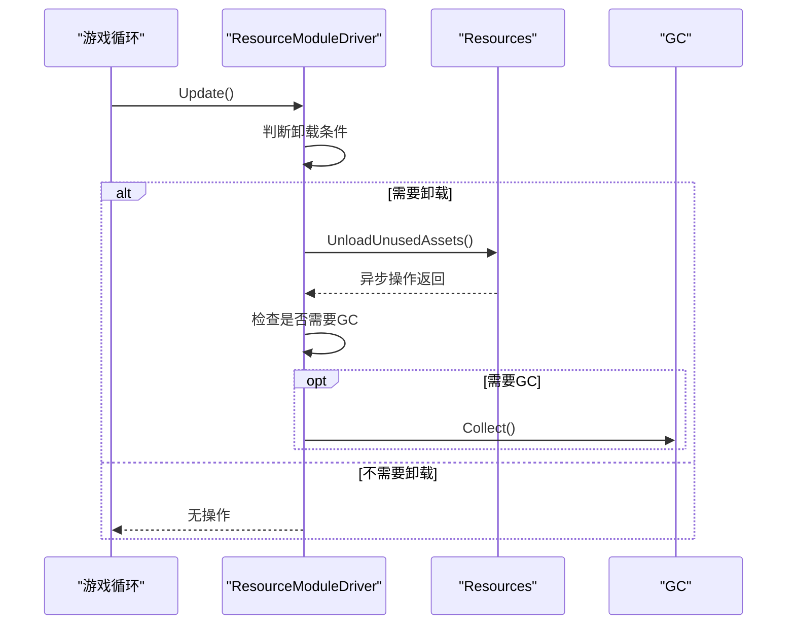
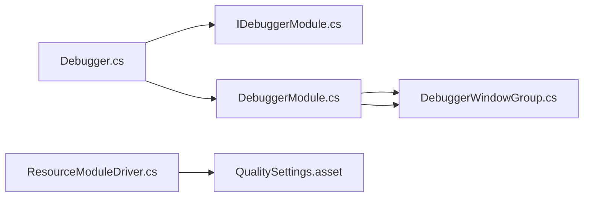

# 性能优化

<cite>
**本文引用的文件**
- [Assets/TEngine/Runtime/Module/DebugerModule/Debugger.cs](file://Assets/TEngine/Runtime/Module/DebugerModule/Debugger.cs)
- [Assets/TEngine/Runtime/Module/DebugerModule/DebuggerModule.cs](file://Assets/TEngine/Runtime/Module/DebugerModule/DebuggerModule.cs)
- [Assets/TEngine/Runtime/Module/DebugerModule/DebuggerManager.DebuggerWindowGroup.cs](file://Assets/TEngine/Runtime/Module/DebugerModule/DebuggerManager.DebuggerWindowGroup.cs)
- [Assets/TEngine/Runtime/Module/DebugerModule/IDebuggerModule.cs](file://Assets/TEngine/Runtime/Module/DebugerModule/IDebuggerModule.cs)
- [Assets/TEngine/Runtime/Module/DebugerModule/Component/DebuggerModule.ProfilerInformationWindow.cs](file://Assets/TEngine/Runtime/Module/DebugerModule/Component/DebuggerModule.ProfilerInformationWindow.cs)
- [Assets/TEngine/Runtime/Module/DebugerModule/Component/DebuggerModule.RuntimeMemorySummaryWindow.cs](file://Assets/TEngine/Runtime/Module/DebugerModule/Component/DebuggerModule.RuntimeMemorySummaryWindow.cs)
- [Assets/TEngine/Runtime/Module/DebugerModule/Component/DebuggerModule.RuntimeMemoryInformationWindow.cs](file://Assets/TEngine/Runtime/Module/DebugerModule/Component/DebuggerModule.RuntimeMemoryInformationWindow.cs)
- [Assets/TEngine/Runtime/Module/ResourceModule/ResourceModuleDriver.cs](file://Assets/TEngine/Runtime/Module/ResourceModule/ResourceModuleDriver.cs)
- [ProjectSettings/QualitySettings.asset](file://ProjectSettings/QualitySettings.asset)
- [memory-bank/techContext.md](file://memory-bank/techContext.md)
- [memory-bank/progress.md](file://memory-bank/progress.md)
</cite>

## 目录
1. [简介](#简介)
2. [项目结构](#项目结构)
3. [核心组件](#核心组件)
4. [架构总览](#架构总览)
5. [详细组件分析](#详细组件分析)
6. [依赖关系分析](#依赖关系分析)
7. [性能考量与优化策略](#性能考量与优化策略)
8. [故障排查指南](#故障排查指南)
9. [结论](#结论)
10. [附录](#附录)

## 简介
本技术文档围绕 TEngine 的性能优化展开，重点覆盖以下方面：
- 性能监控系统：帧率监控、内存使用监控、资源加载监控等核心能力的设计与实现。
- 调试器模块：性能分析、内存分析、日志系统等工具的使用与集成方式。
- 性能优化策略与技巧：渲染优化、内存优化、CPU 优化等。
- 性能分析方法与工具使用：Profiler 使用、内存泄漏检测、性能瓶颈定位。
- 最佳实践与常见问题解决方案，以及具体优化案例与效果对比。

## 项目结构
TEngine 将性能相关能力主要分布在“调试器模块”和“资源模块”两大体系：
- 调试器模块（DebugerModule）：提供可视化性能面板（帧率、Profiler、内存、对象池、设置等），支持在开发构建或编辑器环境下启用。
- 资源模块（ResourceModule）：负责资源生命周期管理，包含卸载未使用资源与触发 GC 的策略，辅助内存回收与释放。

**图表来源**
- [Assets/TEngine/Runtime/Module/DebugerModule/Debugger.cs:1-429](file://Assets/TEngine/Runtime/Module/DebugerModule/Debugger.cs#L1-L429)
- [Assets/TEngine/Runtime/Module/DebugerModule/DebuggerModule.cs:1-116](file://Assets/TEngine/Runtime/Module/DebugerModule/DebuggerModule.cs#L1-L116)
- [Assets/TEngine/Runtime/Module/DebugerModule/DebuggerManager.DebuggerWindowGroup.cs:1-294](file://Assets/TEngine/Runtime/Module/DebugerModule/DebuggerManager.DebuggerWindowGroup.cs#L1-L294)
- [Assets/TEngine/Runtime/Module/DebugerModule/IDebuggerModule.cs:1-55](file://Assets/TEngine/Runtime/Module/DebugerModule/IDebuggerModule.cs#L1-L55)
- [Assets/TEngine/Runtime/Module/DebugerModule/Component/DebuggerModule.ProfilerInformationWindow.cs:1-60](file://Assets/TEngine/Runtime/Module/DebugerModule/Component/DebuggerModule.ProfilerInformationWindow.cs#L1-L60)
- [Assets/TEngine/Runtime/Module/DebugerModule/Component/DebuggerModule.RuntimeMemorySummaryWindow.cs:57-97](file://Assets/TEngine/Runtime/Module/DebugerModule/Component/DebuggerModule.RuntimeMemorySummaryWindow.cs#L57-L97)
- [Assets/TEngine/Runtime/Module/DebugerModule/Component/DebuggerModule.RuntimeMemoryInformationWindow.cs:82-109](file://Assets/TEngine/Runtime/Module/DebugerModule/Component/DebuggerModule.RuntimeMemoryInformationWindow.cs#L82-L109)
- [Assets/TEngine/Runtime/Module/ResourceModule/ResourceModuleDriver.cs:307-334](file://Assets/TEngine/Runtime/Module/ResourceModule/ResourceModuleDriver.cs#L307-L334)
- [ProjectSettings/QualitySettings.asset:45-239](file://ProjectSettings/QualitySettings.asset#L45-L239)

**章节来源**
- [Assets/TEngine/Runtime/Module/DebugerModule/Debugger.cs:1-429](file://Assets/TEngine/Runtime/Module/DebugerModule/Debugger.cs#L1-L429)
- [Assets/TEngine/Runtime/Module/DebugerModule/DebuggerModule.cs:1-116](file://Assets/TEngine/Runtime/Module/DebugerModule/DebuggerModule.cs#L1-L116)
- [Assets/TEngine/Runtime/Module/DebugerModule/DebuggerManager.DebuggerWindowGroup.cs:1-294](file://Assets/TEngine/Runtime/Module/DebugerModule/DebuggerManager.DebuggerWindowGroup.cs#L1-L294)
- [Assets/TEngine/Runtime/Module/DebugerModule/IDebuggerModule.cs:1-55](file://Assets/TEngine/Runtime/Module/DebugerModule/IDebuggerModule.cs#L1-L55)
- [Assets/TEngine/Runtime/Module/ResourceModule/ResourceModuleDriver.cs:307-334](file://Assets/TEngine/Runtime/Module/ResourceModule/ResourceModuleDriver.cs#L307-L334)
- [ProjectSettings/QualitySettings.asset:45-239](file://ProjectSettings/QualitySettings.asset#L45-L239)
- [memory-bank/techContext.md:178-232](file://memory-bank/techContext.md#L178-L232)
- [memory-bank/progress.md:126-140](file://memory-bank/progress.md#L126-L140)

## 核心组件
- 调试器入口与窗口系统
  - Debugger：作为调试器主控，负责窗口布局、激活状态、FPS 计数、日志采集与窗口树的绘制。
  - DebuggerModule：模块化管理调试器窗口注册、选择与更新。
  - DebuggerWindowGroup：树形窗口容器，支持层级路径注册与选择。
  - IDebuggerModule：调试器模块接口，统一注册/注销/选择/获取窗口的能力。
- 性能监控面板
  - ProfilerInformationWindow：展示 Unity Profiler 的关键指标（Mono/Heap/Allocated/Reserved 等）。
  - RuntimeMemorySummaryWindow：对运行时对象按类型汇总统计内存占用。
  - RuntimeMemoryInformationWindow<T>：对指定类型（如 Texture/Mesh/Material 等）进行内存采样与排序展示。
- 资源加载与释放
  - ResourceModuleDriver：周期性触发 UnloadUnusedAssets 与可选 GC.Collect，配合质量设置进行资源释放。

**章节来源**
- [Assets/TEngine/Runtime/Module/DebugerModule/Debugger.cs:1-429](file://Assets/TEngine/Runtime/Module/DebugerModule/Debugger.cs#L1-L429)
- [Assets/TEngine/Runtime/Module/DebugerModule/DebuggerModule.cs:1-116](file://Assets/TEngine/Runtime/Module/DebugerModule/DebuggerModule.cs#L1-L116)
- [Assets/TEngine/Runtime/Module/DebugerModule/DebuggerManager.DebuggerWindowGroup.cs:1-294](file://Assets/TEngine/Runtime/Module/DebugerModule/DebuggerManager.DebuggerWindowGroup.cs#L1-L294)
- [Assets/TEngine/Runtime/Module/DebugerModule/IDebuggerModule.cs:1-55](file://Assets/TEngine/Runtime/Module/DebugerModule/IDebuggerModule.cs#L1-L55)
- [Assets/TEngine/Runtime/Module/DebugerModule/Component/DebuggerModule.ProfilerInformationWindow.cs:1-60](file://Assets/TEngine/Runtime/Module/DebugerModule/Component/DebuggerModule.ProfilerInformationWindow.cs#L1-L60)
- [Assets/TEngine/Runtime/Module/DebugerModule/Component/DebuggerModule.RuntimeMemorySummaryWindow.cs:57-97](file://Assets/TEngine/Runtime/Module/DebugerModule/Component/DebuggerModule.RuntimeMemorySummaryWindow.cs#L57-L97)
- [Assets/TEngine/Runtime/Module/DebugerModule/Component/DebuggerModule.RuntimeMemoryInformationWindow.cs:82-109](file://Assets/TEngine/Runtime/Module/DebugerModule/Component/DebuggerModule.RuntimeMemoryInformationWindow.cs#L82-L109)
- [Assets/TEngine/Runtime/Module/ResourceModule/ResourceModuleDriver.cs:307-334](file://Assets/TEngine/Runtime/Module/ResourceModule/ResourceModuleDriver.cs#L307-L334)

## 架构总览
调试器模块采用“模块 + 窗口树”的架构，通过 Debugger 统一调度，DebuggerModule 负责窗口注册与选择，窗口组 DebuggerWindowGroup 提供层级路径解析与切换；资源模块通过 ResourceModuleDriver 在合适时机触发资源卸载与 GC，从而降低内存峰值。

**图表来源**
- [Assets/TEngine/Runtime/Module/DebugerModule/Debugger.cs:1-429](file://Assets/TEngine/Runtime/Module/DebugerModule/Debugger.cs#L1-L429)
- [Assets/TEngine/Runtime/Module/DebugerModule/DebuggerModule.cs:1-116](file://Assets/TEngine/Runtime/Module/DebugerModule/DebuggerModule.cs#L1-L116)
- [Assets/TEngine/Runtime/Module/DebugerModule/DebuggerManager.DebuggerWindowGroup.cs:1-294](file://Assets/TEngine/Runtime/Module/DebugerModule/DebuggerManager.DebuggerWindowGroup.cs#L1-L294)
- [Assets/TEngine/Runtime/Module/DebugerModule/IDebuggerModule.cs:1-55](file://Assets/TEngine/Runtime/Module/DebugerModule/IDebuggerModule.cs#L1-L55)

## 详细组件分析

### 调试器模块与窗口系统
- 调试器入口（Debugger）
  - 管理调试器窗口的激活/布局/缩放，绘制悬浮图标与完整窗口，支持日志采集与 FPS 显示。
  - 通过 ModuleSystem 获取 IDebuggerModule，注册各类信息窗口（系统、图形、输入、场景、时间、质量、Profiler、内存、对象池、设置等）。
- 调试器模块（DebuggerModule）
  - 实现 IDebuggerModule 接口，负责窗口注册、选择、获取与更新。
  - 优先级较低，确保在其他模块之后关闭，避免资源竞争。
- 窗口组（DebuggerWindowGroup）
  - 以键值对列表存储窗口，支持层级路径解析（以“/”分隔），提供注册/注销/选择/获取窗口的递归逻辑。
  - 维护当前选中窗口与名称数组，用于 GUI 工具栏显示与切换。

**图表来源**
- [Assets/TEngine/Runtime/Module/DebugerModule/Debugger.cs:183-235](file://Assets/TEngine/Runtime/Module/DebugerModule/Debugger.cs#L183-L235)
- [Assets/TEngine/Runtime/Module/DebugerModule/DebuggerModule.cs:66-114](file://Assets/TEngine/Runtime/Module/DebugerModule/DebuggerModule.cs#L66-L114)
- [Assets/TEngine/Runtime/Module/DebugerModule/DebuggerManager.DebuggerWindowGroup.cs:193-230](file://Assets/TEngine/Runtime/Module/DebugerModule/DebuggerManager.DebuggerWindowGroup.cs#L193-L230)

**章节来源**
- [Assets/TEngine/Runtime/Module/DebugerModule/Debugger.cs:183-235](file://Assets/TEngine/Runtime/Module/DebugerModule/Debugger.cs#L183-L235)
- [Assets/TEngine/Runtime/Module/DebugerModule/DebuggerModule.cs:66-114](file://Assets/TEngine/Runtime/Module/DebugerModule/DebuggerModule.cs#L66-L114)
- [Assets/TEngine/Runtime/Module/DebugerModule/DebuggerManager.DebuggerWindowGroup.cs:193-230](file://Assets/TEngine/Runtime/Module/DebugerModule/DebuggerManager.DebuggerWindowGroup.cs#L193-L230)

### 性能监控面板：帧率、Profiler、内存
- 帧率监控（FPS）
  - Debugger 内部维护 FpsCounter，在 Update 中更新，悬浮图标上实时显示当前 FPS，便于快速感知性能波动。
- Profiler 信息窗口
  - 展示 Profiler 支持状态、启用状态、二进制日志、分配堆栈、区域数量、最大使用内存、Mono/Heap/Allocated/Reserved、显存分配、临时分配器大小、Marshal 缓存等。
- 内存监控
  - 运行时内存汇总窗口：遍历所有对象，按类型统计数量与内存大小，支持采样与累计。
  - 运行时内存明细窗口（泛型）：针对特定类型（Texture/Mesh/Material/AudioClip/Font/ScriptableObject 等）进行采样、排序与高亮重复项，辅助定位异常对象。

**图表来源**
- [Assets/TEngine/Runtime/Module/DebugerModule/Component/DebuggerModule.RuntimeMemorySummaryWindow.cs:61-97](file://Assets/TEngine/Runtime/Module/DebugerModule/Component/DebuggerModule.RuntimeMemorySummaryWindow.cs#L61-L97)
- [Assets/TEngine/Runtime/Module/DebugerModule/Component/DebuggerModule.RuntimeMemoryInformationWindow.cs:82-109](file://Assets/TEngine/Runtime/Module/DebugerModule/Component/DebuggerModule.RuntimeMemoryInformationWindow.cs#L82-L109)

**章节来源**
- [Assets/TEngine/Runtime/Module/DebugerModule/Debugger.cs:170-171](file://Assets/TEngine/Runtime/Module/DebugerModule/Debugger.cs#L170-L171)
- [Assets/TEngine/Runtime/Module/DebugerModule/Component/DebuggerModule.ProfilerInformationWindow.cs:12-56](file://Assets/TEngine/Runtime/Module/DebugerModule/Component/DebuggerModule.ProfilerInformationWindow.cs#L12-L56)
- [Assets/TEngine/Runtime/Module/DebugerModule/Component/DebuggerModule.RuntimeMemorySummaryWindow.cs:61-97](file://Assets/TEngine/Runtime/Module/DebugerModule/Component/DebuggerModule.RuntimeMemorySummaryWindow.cs#L61-L97)
- [Assets/TEngine/Runtime/Module/DebugerModule/Component/DebuggerModule.RuntimeMemoryInformationWindow.cs:82-109](file://Assets/TEngine/Runtime/Module/DebugerModule/Component/DebuggerModule.RuntimeMemoryInformationWindow.cs#L82-L109)

### 资源加载监控与释放策略
- 资源驱动（ResourceModuleDriver）
  - 在合适时机调用 Resources.UnloadUnusedAssets 释放未使用的资源，随后可选执行 GC.Collect，降低内存峰值。
  - 通过内部计时器与标志位控制卸载频率与时机，避免频繁触发导致卡顿。
- 质量设置（QualitySettings.asset）
  - 不同质量等级影响阴影、抗锯齿、纹理质量、LOD、异步上传等，直接影响渲染性能与内存占用。
  - 可结合资源卸载策略动态调整质量以平衡性能与画质。

**图表来源**
- [Assets/TEngine/Runtime/Module/ResourceModule/ResourceModuleDriver.cs:307-334](file://Assets/TEngine/Runtime/Module/ResourceModule/ResourceModuleDriver.cs#L307-L334)

**章节来源**
- [Assets/TEngine/Runtime/Module/ResourceModule/ResourceModuleDriver.cs:307-334](file://Assets/TEngine/Runtime/Module/ResourceModule/ResourceModuleDriver.cs#L307-L334)
- [ProjectSettings/QualitySettings.asset:45-239](file://ProjectSettings/QualitySettings.asset#L45-L239)

## 依赖关系分析
- 调试器模块内部依赖关系清晰：Debugger 依赖 IDebuggerModule，DebuggerModule 持有 DebuggerWindowGroup，后者提供窗口注册/注销/选择/更新能力。
- 调试器模块与资源模块解耦：调试器仅消费资源模块提供的信息（如内存、对象池等），不直接参与资源加载/卸载逻辑。
- 质量设置与资源模块相互作用：质量等级影响渲染管线与资源需求，资源模块据此决定卸载策略与 GC 触发时机。

**图表来源**
- [Assets/TEngine/Runtime/Module/DebugerModule/Debugger.cs:1-429](file://Assets/TEngine/Runtime/Module/DebugerModule/Debugger.cs#L1-L429)
- [Assets/TEngine/Runtime/Module/DebugerModule/IDebuggerModule.cs:1-55](file://Assets/TEngine/Runtime/Module/DebugerModule/IDebuggerModule.cs#L1-L55)
- [Assets/TEngine/Runtime/Module/DebugerModule/DebuggerModule.cs:1-116](file://Assets/TEngine/Runtime/Module/DebugerModule/DebuggerModule.cs#L1-L116)
- [Assets/TEngine/Runtime/Module/DebugerModule/DebuggerManager.DebuggerWindowGroup.cs:1-294](file://Assets/TEngine/Runtime/Module/DebugerModule/DebuggerManager.DebuggerWindowGroup.cs#L1-L294)
- [Assets/TEngine/Runtime/Module/ResourceModule/ResourceModuleDriver.cs:307-334](file://Assets/TEngine/Runtime/Module/ResourceModule/ResourceModuleDriver.cs#L307-L334)
- [ProjectSettings/QualitySettings.asset:45-239](file://ProjectSettings/QualitySettings.asset#L45-L239)

**章节来源**
- [Assets/TEngine/Runtime/Module/DebugerModule/Debugger.cs:1-429](file://Assets/TEngine/Runtime/Module/DebugerModule/Debugger.cs#L1-L429)
- [Assets/TEngine/Runtime/Module/DebugerModule/DebuggerModule.cs:1-116](file://Assets/TEngine/Runtime/Module/DebugerModule/DebuggerModule.cs#L1-L116)
- [Assets/TEngine/Runtime/Module/DebugerModule/DebuggerManager.DebuggerWindowGroup.cs:1-294](file://Assets/TEngine/Runtime/Module/DebugerModule/DebuggerManager.DebuggerWindowGroup.cs#L1-L294)
- [Assets/TEngine/Runtime/Module/ResourceModule/ResourceModuleDriver.cs:307-334](file://Assets/TEngine/Runtime/Module/ResourceModule/ResourceModuleDriver.cs#L307-L334)
- [ProjectSettings/QualitySettings.asset:45-239](file://ProjectSettings/QualitySettings.asset#L45-L239)

## 性能考量与优化策略
- 渲染优化
  - 结合质量设置（阴影、抗锯齿、纹理质量、LOD、异步上传等）动态调整，避免在低端设备上启用过高画质。
  - 使用批量渲染与剔除（视具体项目实现），减少 DrawCall 与带宽压力。
- 内存优化
  - 定期触发 UnloadUnusedAssets 与可选 GC.Collect，降低峰值内存。
  - 使用内存分析面板识别异常类型对象（重复项、大对象），针对性优化资源复用与生命周期。
- CPU 优化
  - 异步优先，避免主线程阻塞；利用对象池/内存池减少 GC 压力。
  - 通过 FPS 与 Profiler 面板监控 CPU 占用，定位热点函数与线程争用。

**章节来源**
- [ProjectSettings/QualitySettings.asset:45-239](file://ProjectSettings/QualitySettings.asset#L45-L239)
- [Assets/TEngine/Runtime/Module/ResourceModule/ResourceModuleDriver.cs:307-334](file://Assets/TEngine/Runtime/Module/ResourceModule/ResourceModuleDriver.cs#L307-L334)
- [memory-bank/techContext.md:228-232](file://memory-bank/techContext.md#L228-L232)
- [memory-bank/progress.md:126-140](file://memory-bank/progress.md#L126-L140)

## 故障排查指南
- 调试器窗口无法显示
  - 检查 ActiveWindow 类型（AlwaysOpen/OnlyOpenWhenDevelopment/OnlyOpenInEditor）与构建配置。
  - 确认窗口已正确注册到 DebuggerModule，并通过路径选择。
- 内存采样异常
  - 确保在目标类型上使用正确的泛型窗口（如 Texture/Mesh/Material 等）。
  - 注意重复项高亮可能指示资源未正确释放或复用不当。
- 资源卸载无效
  - 检查卸载条件与计时器逻辑，避免过于频繁触发导致性能抖动。
  - 结合质量设置评估是否应降低画质以减少资源占用。

**章节来源**
- [Assets/TEngine/Runtime/Module/DebugerModule/Debugger.cs:217-234](file://Assets/TEngine/Runtime/Module/DebugerModule/Debugger.cs#L217-L234)
- [Assets/TEngine/Runtime/Module/DebugerModule/DebuggerModule.cs:66-114](file://Assets/TEngine/Runtime/Module/DebugerModule/DebuggerModule.cs#L66-L114)
- [Assets/TEngine/Runtime/Module/DebugerModule/Component/DebuggerModule.RuntimeMemoryInformationWindow.cs:82-109](file://Assets/TEngine/Runtime/Module/DebugerModule/Component/DebuggerModule.RuntimeMemoryInformationWindow.cs#L82-L109)
- [Assets/TEngine/Runtime/Module/ResourceModule/ResourceModuleDriver.cs:307-334](file://Assets/TEngine/Runtime/Module/ResourceModule/ResourceModuleDriver.cs#L307-L334)

## 结论
TEngine 的性能优化体系以“可视化监控 + 主动释放 + 质量自适应”为核心：通过调试器模块提供实时的帧率、Profiler、内存与对象池信息，结合资源模块的卸载与 GC 策略，形成闭环的性能保障。建议在不同平台与设备上基于质量设置与资源策略动态调整，持续使用调试器面板进行回归验证。

## 附录
- 性能分析方法与工具使用
  - 使用 ProfilerInformationWindow 查看内存与分配关键指标，定位内存增长来源。
  - 使用 RuntimeMemoryInformationWindow<T> 对特定类型进行采样与排序，识别异常对象。
  - 使用 FPS 与日志系统快速发现帧率波动与错误。
- 最佳实践
  - 异步加载与按需释放，避免一次性加载过多资源。
  - 使用对象池/内存池减少 GC 压力，提升主线程稳定性。
  - 在低端设备上降低质量等级，必要时延迟或合并卸载操作。
- 常见问题与解决方案
  - 内存泄漏：通过重复项高亮与类型分布定位未释放对象，优化生命周期管理。
  - 卡顿：降低质量或减少一次性资源加载，合理安排卸载与 GC 时机。