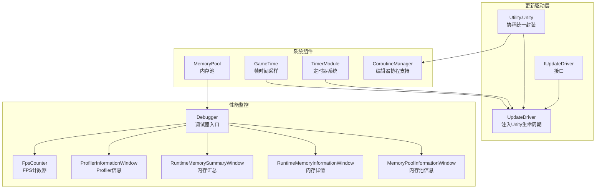
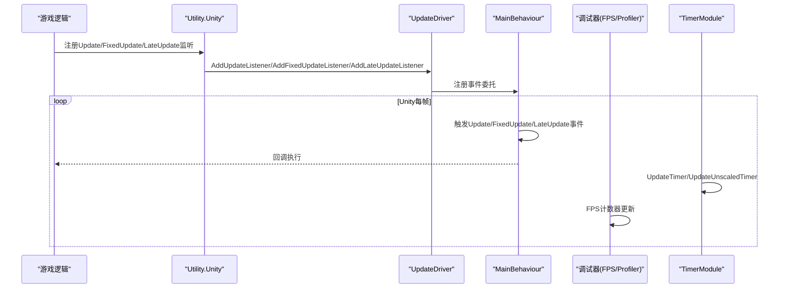
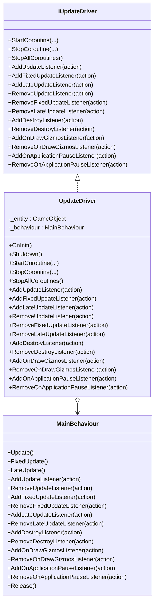
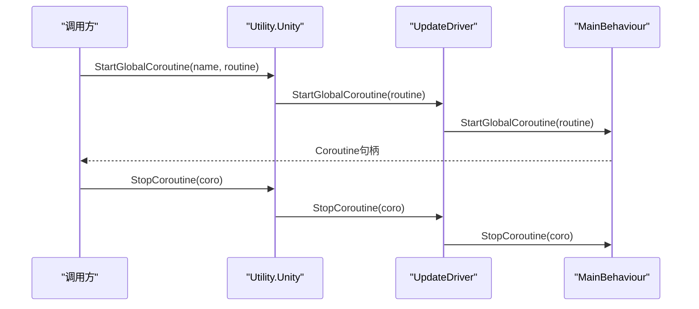
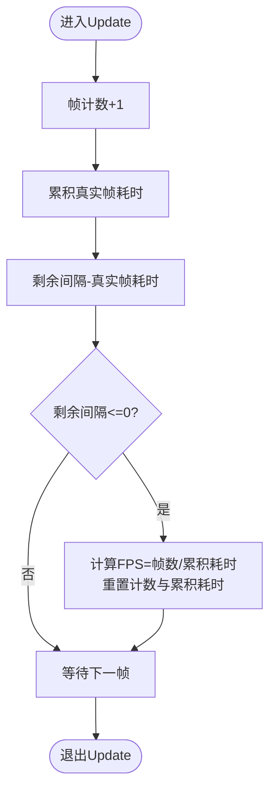
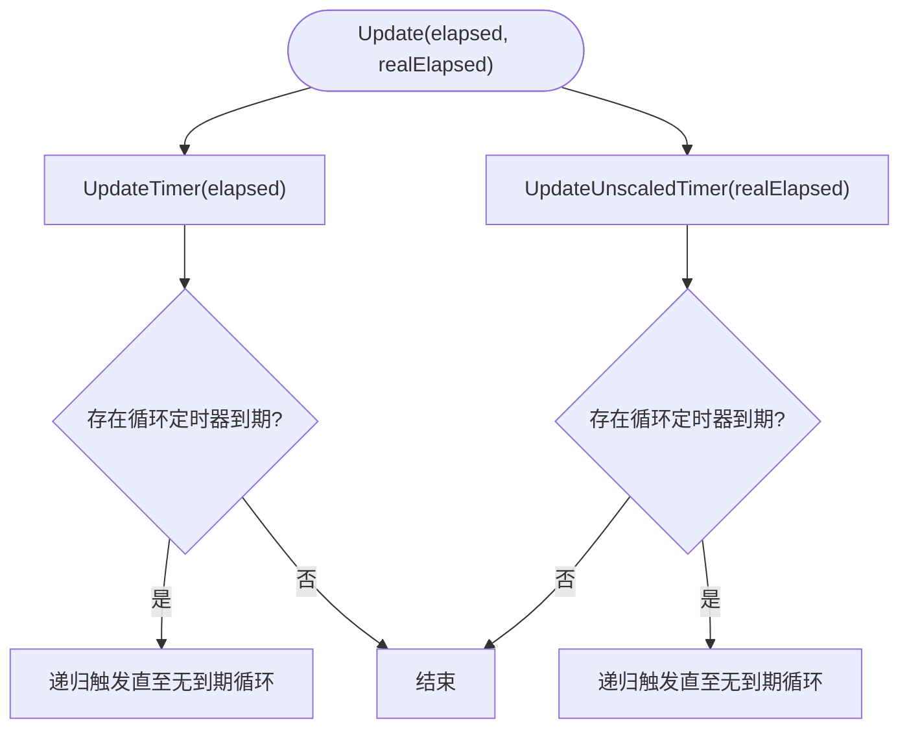
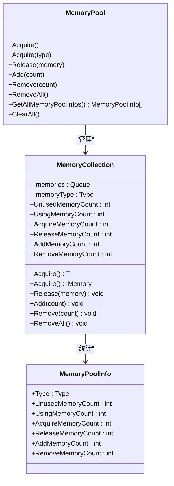
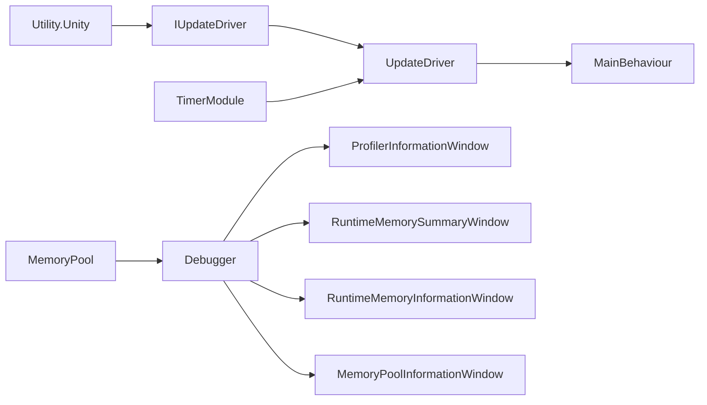
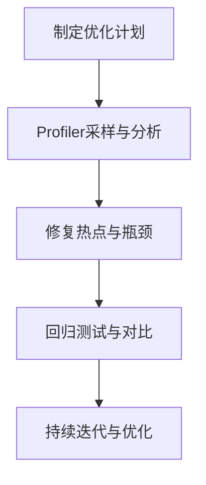

# CPU优化策略

<cite>
**本文引用的文件**
- [UpdateDriver.cs](file://Assets/TEngine/Runtime/Module/UpdataDriver/UpdateDriver.cs)
- [IUpdateDriver.cs](file://Assets/TEngine/Runtime/Module/UpdataDriver/IUpdateDriver.cs)
- [Utility.Unity.cs](file://Assets/TEngine/Runtime/Core/Utility/Utility.Unity.cs)
- [DebuggerComponent.FpsCounter.cs](file://Assets/TEngine/Runtime/Module/DebugerModule/DebuggerComponent.FpsCounter.cs)
- [Debugger.cs](file://Assets/TEngine/Runtime/Module/DebugerModule/Debugger.cs)
- [DebuggerModule.ProfilerInformationWindow.cs](file://Assets/TEngine/Runtime/Module/DebugerModule/Component/DebuggerModule.ProfilerInformationWindow.cs)
- [DebuggerModule.RuntimeMemorySummaryWindow.cs](file://Assets/TEngine/Runtime/Module/DebugerModule/Component/DebuggerModule.RuntimeMemorySummaryWindow.cs)
- [DebuggerModule.RuntimeMemoryInformationWindow.cs](file://Assets/TEngine/Runtime/Module/DebugerModule/Component/DebuggerModule.RuntimeMemoryInformationWindow.cs)
- [DebuggerModule.MemoryPoolInformationWindow.cs](file://Assets/TEngine/Runtime/Module/DebugerModule/Component/DebuggerModule.MemoryPoolInformationWindow.cs)
- [MemoryPool.cs](file://Assets/TEngine/Runtime/Core/MemoryPool/MemoryPool.cs)
- [MemoryPool.MemoryCollection.cs](file://Assets/TEngine/Runtime/Core/MemoryPool/MemoryPool.MemoryCollection.cs)
- [MemoryPoolInfo.cs](file://Assets/TEngine/Runtime/Core/MemoryPool/MemoryPoolInfo.cs)
- [GameTime.cs](file://Assets/TEngine/Runtime/Core/GameTime/GameTime.cs)
- [TimerModule.cs](file://Assets/TEngine/Runtime/Module/TimerModule/TimerModule.cs)
- [ProfilerDefineSymbols.cs](file://Assets/TEngine/Editor/DefineSymbols/ProfilerDefineSymbols.cs)
- [CoroutineManager.cs](file://Assets/TEngine/Runtime/Module/LocalizationModule/Core/Utils/CoroutineManager.cs)
- [SingletonSystem.cs](file://Assets/GameScripts/HotFix/GameLogic/SingletonSystem/SingletonSystem.cs)
</cite>

## 目录
1. [引言](#引言)
2. [项目结构](#项目结构)
3. [核心组件](#核心组件)
4. [架构总览](#架构总览)
5. [详细组件分析](#详细组件分析)
6. [依赖关系分析](#依赖关系分析)
7. [性能考量](#性能考量)
8. [故障排查指南](#故障排查指南)
9. [结论](#结论)
10. [附录](#附录)

## 引言
本文件围绕TEngine的CPU优化策略展开，聚焦于游戏循环优化、帧率控制、协程管理、异步处理、定时器系统、内存池与调试分析工具等主题。通过对UpdateDriver、协程封装、计时与帧率统计、内存池、调试器与Profiler集成等模块的深入剖析，给出可落地的优化建议、瓶颈识别方法与回归验证策略，帮助在Unity环境下实现稳定且高性能的CPU资源利用。

## 项目结构
TEngine将CPU优化相关能力分布在多个模块中：
- 更新驱动层：UpdateDriver负责将外部回调注入Unity的Update/FixedUpdate/LateUpdate生命周期，并统一管理协程启动与停止。
- 协程与异步：通过Utility.Unity对协程进行统一封装，支持绑定行为体与全局协程；同时引入UniTask以降低调度开销。
- 性能监控：调试器模块提供FPS计数器、Profiler信息窗口、内存使用统计与内存池信息窗口。
- 定时器系统：TimerModule提供基于时间片的定时器，区分受Time.timeScale影响与不受影响的两类计时。
- 内存池：MemoryPool提供对象复用，减少GC压力与分配抖动。
- 时间管理：GameTime提供帧时间采样，便于在不同阶段使用缩放/非缩放时间。

**图表来源**
- [UpdateDriver.cs:11-455](file://Assets/TEngine/Runtime/Module/UpdataDriver/UpdateDriver.cs#L11-L455)
- [IUpdateDriver.cs:8-120](file://Assets/TEngine/Runtime/Module/UpdataDriver/IUpdateDriver.cs#L8-L120)
- [Utility.Unity.cs:14-351](file://Assets/TEngine/Runtime/Core/Utility/Utility.Unity.cs#L14-L351)
- [Debugger.cs:190-222](file://Assets/TEngine/Runtime/Module/DebugerModule/Debugger.cs#L190-L222)
- [DebuggerComponent.FpsCounter.cs:5-67](file://Assets/TEngine/Runtime/Module/DebugerModule/DebuggerComponent.FpsCounter.cs#L5-L67)
- [DebuggerModule.ProfilerInformationWindow.cs:10-59](file://Assets/TEngine/Runtime/Module/DebugerModule/Component/DebuggerModule.ProfilerInformationWindow.cs#L10-L59)
- [DebuggerModule.RuntimeMemorySummaryWindow.cs:12-97](file://Assets/TEngine/Runtime/Module/DebugerModule/Component/DebuggerModule.RuntimeMemorySummaryWindow.cs#L12-L97)
- [DebuggerModule.RuntimeMemoryInformationWindow.cs:74-109](file://Assets/TEngine/Runtime/Module/DebugerModule/Component/DebuggerModule.RuntimeMemoryInformationWindow.cs#L74-L109)
- [DebuggerModule.MemoryPoolInformationWindow.cs:54-80](file://Assets/TEngine/Runtime/Module/DebugerModule/Component/DebuggerModule.MemoryPoolInformationWindow.cs#L54-L80)
- [TimerModule.cs:276-478](file://Assets/TEngine/Runtime/Module/TimerModule/TimerModule.cs#L276-L478)
- [MemoryPool.cs:9-208](file://Assets/TEngine/Runtime/Core/MemoryPool/MemoryPool.cs#L9-L208)
- [GameTime.cs:9-55](file://Assets/TEngine/Runtime/Core/GameTime/GameTime.cs#L9-L55)
- [CoroutineManager.cs:8-53](file://Assets/TEngine/Runtime/Module/LocalizationModule/Core/Utils/CoroutineManager.cs#L8-L53)

**章节来源**
- [UpdateDriver.cs:11-455](file://Assets/TEngine/Runtime/Module/UpdataDriver/UpdateDriver.cs#L11-L455)
- [Utility.Unity.cs:14-351](file://Assets/TEngine/Runtime/Core/Utility/Utility.Unity.cs#L14-L351)
- [Debugger.cs:190-222](file://Assets/TEngine/Runtime/Module/DebugerModule/Debugger.cs#L190-L222)

## 核心组件
- UpdateDriver：将外部Action注入Unity生命周期，支持协程统一管理与事件回调注册，确保主线程执行路径可控。
- Utility.Unity：提供协程统一封装与生命周期注入，内部持有IUpdateDriver实例，保证跨模块一致性。
- FPS计数器：按固定更新间隔统计帧数，输出当前FPS，便于实时观察帧率波动。
- 调试器与Profiler：提供Profiler信息、内存使用统计与内存池信息窗口，辅助定位CPU/内存热点。
- 定时器系统：提供受缩放与不受缩放两类计时器，支持循环调用与批量清理，避免帧内超时导致的连锁触发。
- 内存池：提供Acquire/Release与批量Add/Remove，配合严格检查与统计信息，降低GC频率与峰值。
- GameTime：统一采集Unity时间参数，便于在不同阶段使用缩放/非缩放时间。

**章节来源**
- [UpdateDriver.cs:11-455](file://Assets/TEngine/Runtime/Module/UpdataDriver/UpdateDriver.cs#L11-L455)
- [IUpdateDriver.cs:8-120](file://Assets/TEngine/Runtime/Module/UpdataDriver/IUpdateDriver.cs#L8-L120)
- [Utility.Unity.cs:14-351](file://Assets/TEngine/Runtime/Core/Utility/Utility.Unity.cs#L14-L351)
- [DebuggerComponent.FpsCounter.cs:5-67](file://Assets/TEngine/Runtime/Module/DebugerModule/DebuggerComponent.FpsCounter.cs#L5-L67)
- [TimerModule.cs:276-478](file://Assets/TEngine/Runtime/Module/TimerModule/TimerModule.cs#L276-L478)
- [MemoryPool.cs:9-208](file://Assets/TEngine/Runtime/Core/MemoryPool/MemoryPool.cs#L9-L208)
- [GameTime.cs:9-55](file://Assets/TEngine/Runtime/Core/GameTime/GameTime.cs#L9-L55)

## 架构总览
UpdateDriver作为“更新驱动中枢”，通过IUpdateDriver接口对外暴露统一能力；Utility.Unity在运行期延迟初始化并持有IUpdateDriver，用于协程与生命周期注入；调试器模块通过窗口化展示FPS、Profiler与内存信息；TimerModule在每帧推进计时器队列，避免“坏帧”导致的连锁触发；MemoryPool提供对象复用，降低GC压力；GameTime提供统一时间采样。

**图表来源**
- [UpdateDriver.cs:122-202](file://Assets/TEngine/Runtime/Module/UpdataDriver/UpdateDriver.cs#L122-L202)
- [Utility.Unity.cs:170-250](file://Assets/TEngine/Runtime/Core/Utility/Utility.Unity.cs#L170-L250)
- [TimerModule.cs:472-478](file://Assets/TEngine/Runtime/Module/TimerModule/TimerModule.cs#L472-L478)
- [DebuggerComponent.FpsCounter.cs:43-56](file://Assets/TEngine/Runtime/Module/DebugerModule/DebuggerComponent.FpsCounter.cs#L43-L56)

## 详细组件分析

### UpdateDriver与生命周期注入
- 设计要点
  - 使用单例实体与MainBehaviour承载事件委托，避免频繁创建销毁。
  - 通过UniTask.Yield将回调注入到指定PlayerLoop阶段，确保与Unity生命周期对齐。
  - 提供协程统一入口，支持StopAllCoroutines与多种Stop重载。
- 性能优化
  - 事件委托采用+=/-=模式，避免额外容器拷贝。
  - 延迟创建实体，按需激活，减少启动期开销。
  - 释放时清空事件委托，防止泄漏。

**图表来源**
- [IUpdateDriver.cs:8-120](file://Assets/TEngine/Runtime/Module/UpdataDriver/IUpdateDriver.cs#L8-L120)
- [UpdateDriver.cs:11-455](file://Assets/TEngine/Runtime/Module/UpdataDriver/UpdateDriver.cs#L11-L455)

**章节来源**
- [UpdateDriver.cs:11-455](file://Assets/TEngine/Runtime/Module/UpdataDriver/UpdateDriver.cs#L11-L455)
- [IUpdateDriver.cs:8-120](file://Assets/TEngine/Runtime/Module/UpdataDriver/IUpdateDriver.cs#L8-L120)

### 协程管理与异步处理
- 统一入口
  - Utility.Unity提供StartCoroutine/StopCoroutine/StopAllCoroutines，内部通过IUpdateDriver转发至UpdateDriver。
  - 支持绑定MonoBehaviour或GameObject自动挂载代理组件，便于协程生命周期管理。
- 异步优化
  - 使用UniTask.Yield进行轻量级调度，减少任务切换成本。
  - 编辑器下通过CoroutineManager兼容协程执行，避免编辑器模式下的限制。

**图表来源**
- [Utility.Unity.cs:44-166](file://Assets/TEngine/Runtime/Core/Utility/Utility.Unity.cs#L44-L166)
- [UpdateDriver.cs:41-118](file://Assets/TEngine/Runtime/Module/UpdataDriver/UpdateDriver.cs#L41-L118)
- [CoroutineManager.cs:33-51](file://Assets/TEngine/Runtime/Module/LocalizationModule/Core/Utils/CoroutineManager.cs#L33-L51)

**章节来源**
- [Utility.Unity.cs:14-351](file://Assets/TEngine/Runtime/Core/Utility/Utility.Unity.cs#L14-L351)
- [CoroutineManager.cs:8-53](file://Assets/TEngine/Runtime/Module/LocalizationModule/Core/Utils/CoroutineManager.cs#L8-L53)

### 帧率控制与监控
- FPS计数器
  - 以固定更新间隔累加帧数与耗时，计算平均FPS，避免瞬时波动干扰。
  - 支持动态调整更新间隔，兼顾实时性与稳定性。
- 调试器窗口
  - ProfilerInformationWindow展示Profiler启用状态、内存指标等。
  - RuntimeMemorySummaryWindow与RuntimeMemoryInformationWindow提供对象内存快照与排序。
  - MemoryPoolInformationWindow展示各类型内存池统计，辅助定位过度分配。

**图表来源**
- [DebuggerComponent.FpsCounter.cs:43-56](file://Assets/TEngine/Runtime/Module/DebugerModule/DebuggerComponent.FpsCounter.cs#L43-L56)

**章节来源**
- [DebuggerComponent.FpsCounter.cs:5-67](file://Assets/TEngine/Runtime/Module/DebugerModule/DebuggerComponent.FpsCounter.cs#L5-L67)
- [DebuggerModule.ProfilerInformationWindow.cs:10-59](file://Assets/TEngine/Runtime/Module/DebugerModule/Component/DebuggerModule.ProfilerInformationWindow.cs#L10-L59)
- [DebuggerModule.RuntimeMemorySummaryWindow.cs:12-97](file://Assets/TEngine/Runtime/Module/DebugerModule/Component/DebuggerModule.RuntimeMemorySummaryWindow.cs#L12-L97)
- [DebuggerModule.RuntimeMemoryInformationWindow.cs:74-109](file://Assets/TEngine/Runtime/Module/DebugerModule/Component/DebuggerModule.RuntimeMemoryInformationWindow.cs#L74-L109)
- [DebuggerModule.MemoryPoolInformationWindow.cs:54-80](file://Assets/TEngine/Runtime/Module/DebugerModule/Component/DebuggerModule.MemoryPoolInformationWindow.cs#L54-L80)

### 定时器系统与帧内安全
- 计时模型
  - UpdateTimer与UpdateUnscaledTimer分别消费受缩放与不受缩放的时间，支持循环与一次性定时器。
  - 在每帧推进后，若出现“坏帧”（累计负时间），会递归触发已到期的循环定时器，避免丢失。
- 性能特性
  - 使用缓存列表延迟删除，避免遍历期间修改列表引发异常与额外拷贝。
  - 通过System.Timers提供系统级定时器，适用于非游戏逻辑场景。

**图表来源**
- [TimerModule.cs:340-434](file://Assets/TEngine/Runtime/Module/TimerModule/TimerModule.cs#L340-L434)

**章节来源**
- [TimerModule.cs:276-478](file://Assets/TEngine/Runtime/Module/TimerModule/TimerModule.cs#L276-L478)

### 内存池与GC优化
- 数据结构
  - MemoryPool维护类型到MemoryCollection的映射，每个集合内部使用Queue存储可复用对象。
  - MemoryCollection记录使用/获取/释放/新增/移除计数，便于统计与诊断。
- 性能优化
  - Acquire优先从队列取出，否则新建并计入新增计数，减少临时对象。
  - Release前清空对象状态，避免悬挂引用。
  - 支持批量Add/Remove与RemoveAll，便于预热与回收。

**图表来源**
- [MemoryPool.cs:9-208](file://Assets/TEngine/Runtime/Core/MemoryPool/MemoryPool.cs#L9-L208)
- [MemoryPool.MemoryCollection.cs:11-85](file://Assets/TEngine/Runtime/Core/MemoryPool/MemoryPool.MemoryCollection.cs#L11-L85)
- [MemoryPoolInfo.cs:10-85](file://Assets/TEngine/Runtime/Core/MemoryPool/MemoryPoolInfo.cs#L10-L85)

**章节来源**
- [MemoryPool.cs:9-208](file://Assets/TEngine/Runtime/Core/MemoryPool/MemoryPool.cs#L9-L208)
- [MemoryPool.MemoryCollection.cs:11-85](file://Assets/TEngine/Runtime/Core/MemoryPool/MemoryPool.MemoryCollection.cs#L11-L85)
- [MemoryPoolInfo.cs:10-85](file://Assets/TEngine/Runtime/Core/MemoryPool/MemoryPoolInfo.cs#L10-L85)

### 多线程与主线程协调
- 主线程职责
  - UpdateDriver与Utility.Unity均在主线程注册回调，确保与Unity生命周期一致。
- 工作线程协作
  - 协程通过UniTask.Yield进行轻量调度，避免阻塞主线程。
  - 对于需要后台处理的任务，应结合Unity的异步API与线程安全的数据结构，避免直接共享可变状态。
- 锁竞争规避
  - MemoryPool内部使用lock保护集合访问，尽量缩短临界区；可通过批量Add/Remove降低锁持有时间。
  - 避免在Update中进行大量同步IO或复杂计算，必要时拆分到帧间或工作线程。

**章节来源**
- [UpdateDriver.cs:122-202](file://Assets/TEngine/Runtime/Module/UpdataDriver/UpdateDriver.cs#L122-L202)
- [Utility.Unity.cs:170-250](file://Assets/TEngine/Runtime/Core/Utility/Utility.Unity.cs#L170-L250)
- [MemoryPool.cs:187-205](file://Assets/TEngine/Runtime/Core/MemoryPool/MemoryPool.cs#L187-L205)

## 依赖关系分析
- UpdateDriver依赖IUpdateDriver接口，通过Utility.Unity间接被业务模块调用。
- 调试器模块依赖Profiler与Unity资源查询API，用于展示内存与性能信息。
- TimerModule依赖UpdateDriver提供的Update/FixedUpdate/LateUpdate注入点，形成闭环。
- MemoryPool被调试器与业务模块共同使用，提供统一的对象复用。

**图表来源**
- [IUpdateDriver.cs:8-120](file://Assets/TEngine/Runtime/Module/UpdataDriver/IUpdateDriver.cs#L8-L120)
- [UpdateDriver.cs:11-455](file://Assets/TEngine/Runtime/Module/UpdataDriver/UpdateDriver.cs#L11-L455)
- [TimerModule.cs:276-478](file://Assets/TEngine/Runtime/Module/TimerModule/TimerModule.cs#L276-L478)
- [Debugger.cs:190-222](file://Assets/TEngine/Runtime/Module/DebugerModule/Debugger.cs#L190-L222)
- [MemoryPool.cs:9-208](file://Assets/TEngine/Runtime/Core/MemoryPool/MemoryPool.cs#L9-L208)

**章节来源**
- [IUpdateDriver.cs:8-120](file://Assets/TEngine/Runtime/Module/UpdataDriver/IUpdateDriver.cs#L8-L120)
- [UpdateDriver.cs:11-455](file://Assets/TEngine/Runtime/Module/UpdataDriver/UpdateDriver.cs#L11-L455)
- [TimerModule.cs:276-478](file://Assets/TEngine/Runtime/Module/TimerModule/TimerModule.cs#L276-L478)
- [Debugger.cs:190-222](file://Assets/TEngine/Runtime/Module/DebugerModule/Debugger.cs#L190-L222)
- [MemoryPool.cs:9-208](file://Assets/TEngine/Runtime/Core/MemoryPool/MemoryPool.cs#L9-L208)

## 性能考量
- 游戏循环优化
  - 将高频计算拆分到多帧，避免单帧过长；使用TimerModule的循环定时器分散负载。
  - 利用GameTime的unscaledDeltaTime进行与帧率无关的逻辑（如进度、冷却），减少抖动。
- 帧率控制
  - 通过FPS计数器观察目标帧率区间，结合Profiler窗口定位CPU热点。
  - 使用编辑器宏定义符号开关Profiler埋点，避免发布版本的额外开销。
- 协程与异步
  - 优先使用全局协程与统一代理，减少重复挂载；避免在Update中频繁Start/Stop协程。
  - 对长耗时任务采用分片执行与帧间调度，结合UniTask.Yield进行轻量切换。
- 内存池
  - 预热常用对象池，减少运行期分配；定期检查内存池统计，发现异常增长及时回溯。
  - 对不可变对象池化收益有限，重点针对可复用结构体/缓冲区。
- 数据结构与算法
  - 使用GameFrameworkMultiDictionary等高效容器，减少查找与插入成本。
  - 遍历顺序局部性优先，避免在Update中进行大规模排序或哈希表重建。
- 多线程
  - 仅在主线程进行Unity API调用；工作线程负责纯计算与数据准备，结果回传主线程。
  - 使用lock最小化范围与时间，必要时采用无锁队列或并发集合。

**章节来源**
- [GameTime.cs:9-55](file://Assets/TEngine/Runtime/Core/GameTime/GameTime.cs#L9-L55)
- [DebuggerModule.ProfilerInformationWindow.cs:10-59](file://Assets/TEngine/Runtime/Module/DebugerModule/Component/DebuggerModule.ProfilerInformationWindow.cs#L10-L59)
- [ProfilerDefineSymbols.cs:8-44](file://Assets/TEngine/Editor/DefineSymbols/ProfilerDefineSymbols.cs#L8-L44)
- [TimerModule.cs:276-478](file://Assets/TEngine/Runtime/Module/TimerModule/TimerModule.cs#L276-L478)
- [MemoryPool.cs:9-208](file://Assets/TEngine/Runtime/Core/MemoryPool/MemoryPool.cs#L9-L208)
- [GameFrameworkMultiDictionary.cs:10-242](file://Assets/TEngine/Runtime/Core/DataStruct/GameFrameworkMultiDictionary.cs#L10-L242)

## 故障排查指南
- FPS骤降/卡顿
  - 使用FPS计数器确认是否为瞬时尖峰；结合ProfilerInformationWindow查看CPU占用与GC Alloc。
  - 通过RuntimeMemorySummaryWindow与RuntimeMemoryInformationWindow定位大对象与重复对象。
- 内存飙升
  - 检查MemoryPoolInformationWindow中各类型Acquire/Release与新增/移除计数，识别异常增长。
  - 关注Profiler的Total Allocated Memory与Total Reserved Memory变化趋势。
- 定时器异常
  - 若出现“坏帧”导致的循环定时器密集触发，检查TimerModule的LoopCallInBadFrame逻辑是否被触发。
  - 确认Update/Unscaled两套计时器是否混用，避免时间尺度不一致导致的错觉。
- 协程泄漏
  - 确保所有协程最终都会Stop；使用Utility.Unity的StopAllCoroutines进行兜底。
  - 对绑定行为体的协程，注意对象销毁时机，避免悬挂引用。

**章节来源**
- [DebuggerComponent.FpsCounter.cs:5-67](file://Assets/TEngine/Runtime/Module/DebugerModule/DebuggerComponent.FpsCounter.cs#L5-L67)
- [DebuggerModule.ProfilerInformationWindow.cs:10-59](file://Assets/TEngine/Runtime/Module/DebugerModule/Component/DebuggerModule.ProfilerInformationWindow.cs#L10-L59)
- [DebuggerModule.RuntimeMemorySummaryWindow.cs:12-97](file://Assets/TEngine/Runtime/Module/DebugerModule/Component/DebuggerModule.RuntimeMemorySummaryWindow.cs#L12-L97)
- [DebuggerModule.RuntimeMemoryInformationWindow.cs:74-109](file://Assets/TEngine/Runtime/Module/DebugerModule/Component/DebuggerModule.RuntimeMemoryInformationWindow.cs#L74-L109)
- [DebuggerModule.MemoryPoolInformationWindow.cs:54-80](file://Assets/TEngine/Runtime/Module/DebugerModule/Component/DebuggerModule.MemoryPoolInformationWindow.cs#L54-L80)
- [TimerModule.cs:276-478](file://Assets/TEngine/Runtime/Module/TimerModule/TimerModule.cs#L276-L478)
- [Utility.Unity.cs:14-351](file://Assets/TEngine/Runtime/Core/Utility/Utility.Unity.cs#L14-L351)

## 结论
TEngine通过UpdateDriver统一注入生命周期、Utility.Unity统一封装协程、TimerModule保障计时安全、MemoryPool降低GC压力、调试器与Profiler提供可视化监控，形成了完整的CPU优化体系。实践中应结合帧率监控、内存统计与Profiler分析，持续迭代数据结构与算法，合理划分主线程与工作线程职责，确保在不同设备与平台上的稳定帧率与低延迟响应。

## 附录
- 性能回归测试建议
  - 建立基准场景，固定帧率与负载，记录FPS、CPU使用率、GC Alloc与内存峰值。
  - 每次改动后在同一场景重复测试，对比关键指标阈值，确保无回归。
  - 使用编辑器宏定义符号集中控制Profiler埋点，避免误加导致的性能偏差。
- 关键流程图（概念）
