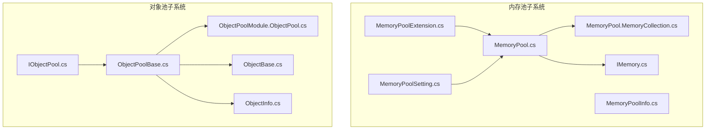
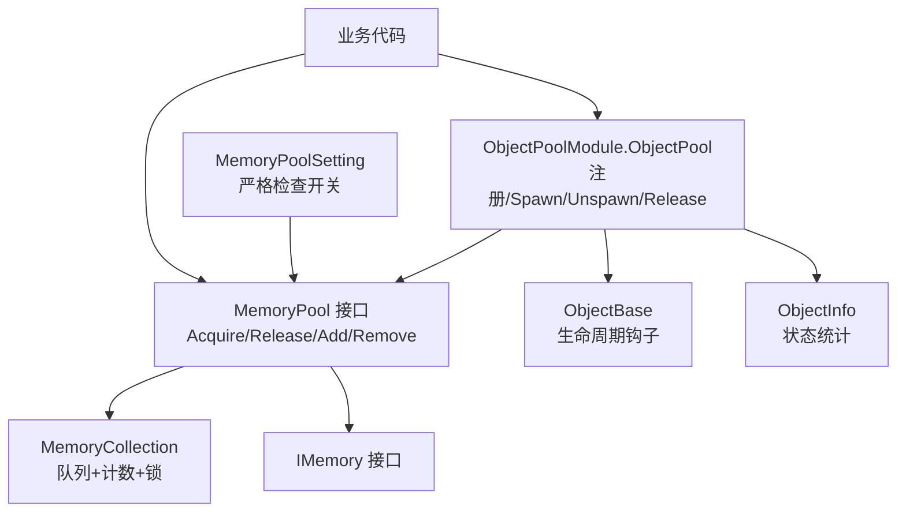
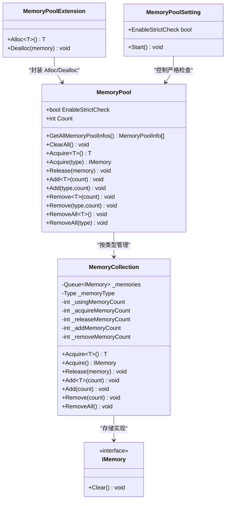
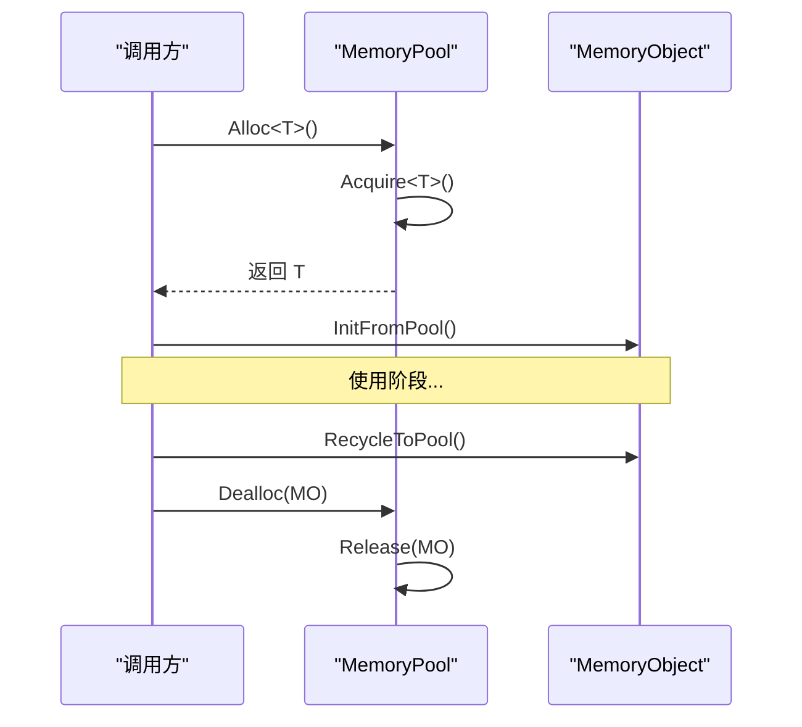
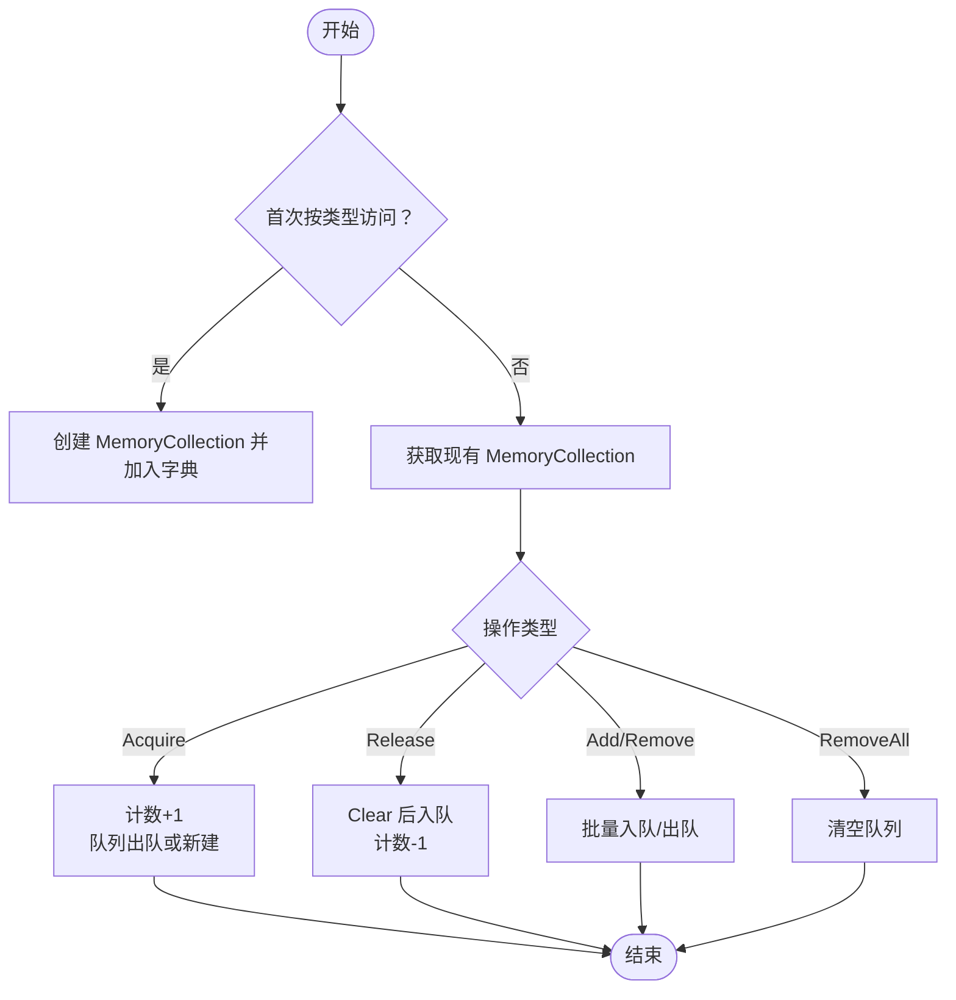
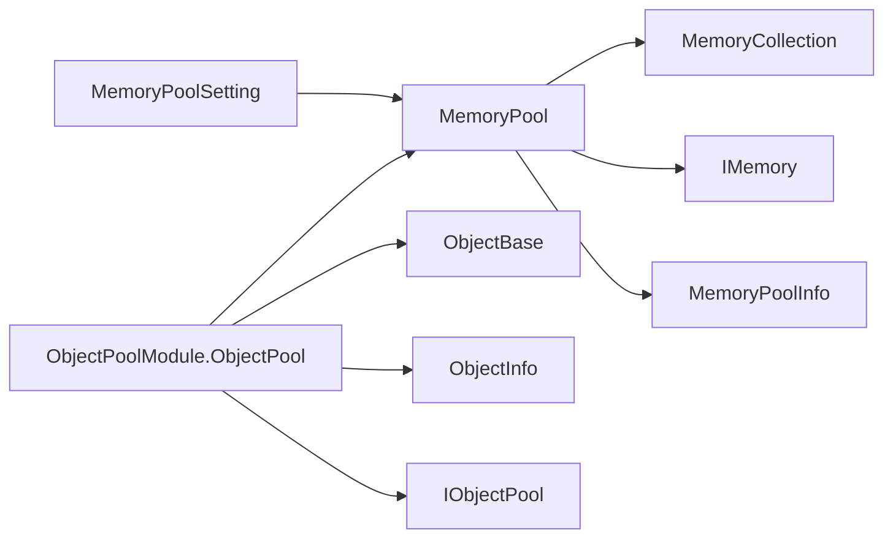

# 内存优化策略

<cite>
**本文引用的文件**
- [MemoryPool.cs](file://Assets/TEngine/Runtime/Core/MemoryPool/MemoryPool.cs)
- [MemoryPool.MemoryCollection.cs](file://Assets/TEngine/Runtime/Core/MemoryPool/MemoryPool.MemoryCollection.cs)
- [MemoryPoolExtension.cs](file://Assets/TEngine/Runtime/Core/MemoryPool/MemoryPoolExtension.cs)
- [MemoryPoolSetting.cs](file://Assets/TEngine/Runtime/Core/MemoryPool/MemoryPoolSetting.cs)
- [MemoryPoolInfo.cs](file://Assets/TEngine/Runtime/Core/MemoryPool/MemoryPoolInfo.cs)
- [IMemory.cs](file://Assets/TEngine/Runtime/Core/MemoryPool/IMemory.cs)
- [IObjectPool.cs](file://Assets/TEngine/Runtime/Module/ObjectPoolModule/IObjectPool.cs)
- [ObjectPoolBase.cs](file://Assets/TEngine/Runtime/Module/ObjectPoolModule/ObjectPoolBase.cs)
- [ObjectPoolModule.ObjectPool.cs](file://Assets/TEngine/Runtime/Module/ObjectPoolModule/ObjectPoolModule.ObjectPool.cs)
- [ObjectInfo.cs](file://Assets/TEngine/Runtime/Module/ObjectPoolModule/ObjectInfo.cs)
- [ObjectBase.cs](file://Assets/TEngine/Runtime/Module/ObjectPoolModule/ObjectBase.cs)
</cite>

## 目录
1. [引言](#引言)
2. [项目结构](#项目结构)
3. [核心组件](#核心组件)
4. [架构总览](#架构总览)
5. [详细组件分析](#详细组件分析)
6. [依赖关系分析](#依赖关系分析)
7. [性能考量](#性能考量)
8. [故障排查指南](#故障排查指南)
9. [结论](#结论)
10. [附录](#附录)

## 引言
本技术文档围绕 TEngine 的内存优化策略展开，系统性阐述内存池与对象池的设计原理、实现机制与最佳实践。重点覆盖 MemoryPool 类的核心能力：内存分配优化、垃圾回收减少、对象复用策略；并解释其生命周期管理、线程安全机制、严格检查模式等高级特性。同时给出对象池在游戏开发中的典型应用场景（如子弹池、敌人池、特效池），并提供可直接参考的使用路径与示例方法（Acquire、Release、Add、Remove 等）。最后，提供性能测试方法与效果评估标准，以及常见内存泄漏问题的排查与解决方案。

## 项目结构
TEngine 在运行时模块中提供了两套关键的内存优化设施：
- 内存池（MemoryPool）：面向轻量、无泛型约束的内存对象复用，统一管理生命周期与统计信息。
- 对象池（ObjectPool）：面向复杂对象（继承 ObjectBase）的注册、获取、回收与释放，支持容量、过期、优先级、锁定等策略。



图表来源
- [MemoryPool.cs:1-208](file://Assets/TEngine/Runtime/Core/MemoryPool/MemoryPool.cs#L1-L208)
- [MemoryPool.MemoryCollection.cs:1-157](file://Assets/TEngine/Runtime/Core/MemoryPool/MemoryPool.MemoryCollection.cs#L1-L157)
- [MemoryPoolExtension.cs:1-57](file://Assets/TEngine/Runtime/Core/MemoryPool/MemoryPoolExtension.cs#L1-L57)
- [MemoryPoolInfo.cs:1-119](file://Assets/TEngine/Runtime/Core/MemoryPool/MemoryPoolInfo.cs#L1-L119)
- [MemoryPoolSetting.cs:1-80](file://Assets/TEngine/Runtime/Core/MemoryPool/MemoryPoolSetting.cs#L1-L80)
- [IMemory.cs:1-14](file://Assets/TEngine/Runtime/Core/MemoryPool/IMemory.cs#L1-L14)
- [IObjectPool.cs:1-212](file://Assets/TEngine/Runtime/Module/ObjectPoolModule/IObjectPool.cs#L1-L212)
- [ObjectPoolBase.cs:1-134](file://Assets/TEngine/Runtime/Module/ObjectPoolModule/ObjectPoolBase.cs#L1-L134)
- [ObjectPoolModule.ObjectPool.cs:1-602](file://Assets/TEngine/Runtime/Module/ObjectPoolModule/ObjectPoolModule.ObjectPool.cs#L1-L602)
- [ObjectBase.cs:1-164](file://Assets/TEngine/Runtime/Module/ObjectPoolModule/ObjectBase.cs#L1-L164)
- [ObjectInfo.cs:1-73](file://Assets/TEngine/Runtime/Module/ObjectPoolModule/ObjectInfo.cs#L1-L73)

章节来源
- [MemoryPool.cs:1-208](file://Assets/TEngine/Runtime/Core/MemoryPool/MemoryPool.cs#L1-L208)
- [ObjectPoolModule.ObjectPool.cs:1-602](file://Assets/TEngine/Runtime/Module/ObjectPoolModule/ObjectPoolModule.ObjectPool.cs#L1-L602)

## 核心组件
- 内存池（MemoryPool）
  - 提供静态入口，按类型管理内存集合，支持 Acquire、Release、Add、Remove、RemoveAll、ClearAll、统计查询等。
  - 支持严格检查模式（EnableStrictCheck），在开发/编辑器环境下增强健壮性但会降低性能。
  - 通过 MemoryPoolExtension 提供 Alloc/Dealloc 快捷封装，便于与 MemoryObject 协作。
- 对象池（ObjectPool）
  - 面向复杂对象（ObjectBase），提供注册、多键名管理、锁定、优先级、过期释放、容量控制等。
  - 内部以字典与链表结构组织对象，支持自动释放与自定义筛选回调。
  - 与内存池联动：对象池内部对象在释放时会调用 MemoryPool.Release 归还到内存池。

章节来源
- [MemoryPool.cs:1-208](file://Assets/TEngine/Runtime/Core/MemoryPool/MemoryPool.cs#L1-L208)
- [MemoryPoolExtension.cs:1-57](file://Assets/TEngine/Runtime/Core/MemoryPool/MemoryPoolExtension.cs#L1-L57)
- [ObjectPoolModule.ObjectPool.cs:1-602](file://Assets/TEngine/Runtime/Module/ObjectPoolModule/ObjectPoolModule.ObjectPool.cs#L1-L602)

## 架构总览
下图展示了内存池与对象池的整体交互关系，以及与严格检查配置的关系。



图表来源
- [MemoryPool.cs:1-208](file://Assets/TEngine/Runtime/Core/MemoryPool/MemoryPool.cs#L1-L208)
- [MemoryPool.MemoryCollection.cs:1-157](file://Assets/TEngine/Runtime/Core/MemoryPool/MemoryPool.MemoryCollection.cs#L1-L157)
- [MemoryPoolSetting.cs:1-80](file://Assets/TEngine/Runtime/Core/MemoryPool/MemoryPoolSetting.cs#L1-L80)
- [IMemory.cs:1-14](file://Assets/TEngine/Runtime/Core/MemoryPool/IMemory.cs#L1-L14)
- [ObjectPoolModule.ObjectPool.cs:1-602](file://Assets/TEngine/Runtime/Module/ObjectPoolModule/ObjectPoolModule.ObjectPool.cs#L1-L602)
- [ObjectBase.cs:1-164](file://Assets/TEngine/Runtime/Module/ObjectPoolModule/ObjectBase.cs#L1-L164)
- [ObjectInfo.cs:1-73](file://Assets/TEngine/Runtime/Module/ObjectPoolModule/ObjectInfo.cs#L1-L73)

## 详细组件分析

### MemoryPool 组件分析
- 设计要点
  - 类型隔离：每个类型维护独立的 MemoryCollection，避免跨类型污染。
  - 复用优先：Acquire 优先从队列取出，不足时才新增。
  - 统计可观测：提供内存池信息结构体，记录使用/未使用/获取/归还/新增/移除计数。
  - 严格检查：可按构建类型或编辑器环境动态启用，提升开发期稳定性但牺牲性能。
- 关键流程
  - Acquire：计数+1，若队列为空则新增对象，否则出队。
  - Release：清空后入队，计数-1。
  - Add/Remove/RemoveAll：批量预热或收缩，用于平滑帧耗时。
  - ClearAll：清理全部类型集合。
- 线程安全
  - 使用互斥锁保护共享字典与队列，保证并发安全。
- 严格检查
  - 可在运行时由 MemoryPoolSetting 控制，日志提示性能影响。



图表来源
- [MemoryPool.cs:1-208](file://Assets/TEngine/Runtime/Core/MemoryPool/MemoryPool.cs#L1-L208)
- [MemoryPool.MemoryCollection.cs:1-157](file://Assets/TEngine/Runtime/Core/MemoryPool/MemoryPool.MemoryCollection.cs#L1-L157)
- [MemoryPoolExtension.cs:1-57](file://Assets/TEngine/Runtime/Core/MemoryPool/MemoryPoolExtension.cs#L1-L57)
- [MemoryPoolSetting.cs:1-80](file://Assets/TEngine/Runtime/Core/MemoryPool/MemoryPoolSetting.cs#L1-L80)
- [IMemory.cs:1-14](file://Assets/TEngine/Runtime/Core/MemoryPool/IMemory.cs#L1-L14)

章节来源
- [MemoryPool.cs:1-208](file://Assets/TEngine/Runtime/Core/MemoryPool/MemoryPool.cs#L1-L208)
- [MemoryPool.MemoryCollection.cs:1-157](file://Assets/TEngine/Runtime/Core/MemoryPool/MemoryPool.MemoryCollection.cs#L1-L157)
- [MemoryPoolExtension.cs:1-57](file://Assets/TEngine/Runtime/Core/MemoryPool/MemoryPoolExtension.cs#L1-L57)
- [MemoryPoolSetting.cs:1-80](file://Assets/TEngine/Runtime/Core/MemoryPool/MemoryPoolSetting.cs#L1-L80)
- [MemoryPoolInfo.cs:1-119](file://Assets/TEngine/Runtime/Core/MemoryPool/MemoryPoolInfo.cs#L1-L119)
- [IMemory.cs:1-14](file://Assets/TEngine/Runtime/Core/MemoryPool/IMemory.cs#L1-L14)

### MemoryPoolExtension 与 MemoryObject
- MemoryObject 抽象类提供 Clear、InitFromPool、RecycleToPool 三段式生命周期，配合 MemoryPool 的 Alloc/Dealloc 实现“从池中初始化—使用—回收”的闭环。
- Alloc<T>() 获取对象后立即调用 InitFromPool，Dealloc 则先调用 RecycleToPool 再 Release，确保状态重置与归还顺序正确。



图表来源
- [MemoryPoolExtension.cs:1-57](file://Assets/TEngine/Runtime/Core/MemoryPool/MemoryPoolExtension.cs#L1-L57)
- [MemoryPool.cs:1-208](file://Assets/TEngine/Runtime/Core/MemoryPool/MemoryPool.cs#L1-L208)

章节来源
- [MemoryPoolExtension.cs:1-57](file://Assets/TEngine/Runtime/Core/MemoryPool/MemoryPoolExtension.cs#L1-L57)

### ObjectPool 组件分析
- 设计要点
  - 多键名管理：同一类型对象可按名称分组，支持多实例并行使用。
  - 可用性控制：AllowMultiSpawn 控制是否允许多次获取；Locked 锁定防止释放；Priority 与 LastUseTime 用于释放排序。
  - 自动释放：基于 AutoReleaseInterval 定时触发 Release；ExpireTime 支持过期对象优先释放。
  - 与内存池集成：对象池内部对象在释放时调用 MemoryPool.Release，实现对象与内存的双重复用。
- 关键流程
  - Register：登记对象并建立映射，超容时触发释放。
  - Spawn/Unspawn：获取/回收对象，更新使用计数与时间戳。
  - Release/ReleaseAllUnused：按策略释放可释放对象，支持自定义筛选回调。
- 数据结构
  - 字典映射：object -> Object<T>，快速定位。
  - 多值字典：name -> 链表范围，支持同名对象集合。
  - 缓存列表：候选释放对象与待释放对象，减少重复计算。

```mermaid
classDiagram
class IObjectPool~T~ {
<<interface>>
+Name string
+FullName string
+ObjectType Type
+Count int
+CanReleaseCount int
+AllowMultiSpawn bool
+AutoReleaseInterval float
+Capacity int
+ExpireTime float
+Priority int
+Register(obj,spawned) void
+CanSpawn() bool
+CanSpawn(name) bool
+Spawn() T
+Spawn(name) T
+Unspawn(obj) void
+Unspawn(target) void
+SetLocked(obj,locked) void
+SetLocked(target,locked) void
+SetPriority(obj,priority) void
+SetPriority(target,priority) void
+ReleaseObject(obj) bool
+ReleaseObject(target) bool
+Release() void
+Release(toReleaseCount) void
+Release(releaseObjectFilterCallback) void
+Release(toReleaseCount,filter) void
+ReleaseAllUnused() void
}
class ObjectPoolBase {
<<abstract>>
+Name string
+FullName string
+ObjectType Type
+Count int
+CanReleaseCount int
+AllowMultiSpawn bool
+AutoReleaseInterval float
+Capacity int
+ExpireTime float
+Priority int
+Release() void
+Release(toReleaseCount) void
+ReleaseAllUnused() void
+GetAllObjectInfos() ObjectInfo[]
+Update(elapseSeconds,realElapseSeconds) void
+Shutdown() void
}
class ObjectPool~T~ {
-GameFrameworkMultiDictionary~string,Object<T>~ _objects
-Dictionary~object,Object<T>~ _objectMap
-T[] _cachedCanReleaseObjects
-T[] _cachedToReleaseObjects
-bool _allowMultiSpawn
-float _autoReleaseInterval
-int _capacity
-float _expireTime
-int _priority
-float _autoReleaseTime
+Register(obj,spawned) void
+CanSpawn(name) bool
+Spawn(name) T
+Unspawn(target) void
+SetLocked(target,locked) void
+SetPriority(target,priority) void
+ReleaseObject(target) bool
+Release() void
+ReleaseAllUnused() void
+GetAllObjectInfos() ObjectInfo[]
+Update(elapseSeconds,realElapseSeconds) void
+Shutdown() void
}
class ObjectBase {
<<abstract>>
+Name string
+Target object
+Locked bool
+Priority int
+CustomCanReleaseFlag bool
+LastUseTime DateTime
+Initialize(...) void
+Clear() void
+OnSpawn() void
+OnUnspawn() void
+Release(isShutdown) void
}
class ObjectInfo {
+Name string
+Locked bool
+CustomCanReleaseFlag bool
+Priority int
+LastUseTime DateTime
+SpawnCount int
+IsInUse bool
}
IObjectPool~T~ <|.. ObjectPool~T~
ObjectPoolBase <|-- ObjectPool~T~
ObjectBase <|-- ObjectPool~T~.Object
ObjectPool~T~ --> ObjectBase : "持有"
ObjectPool~T~ --> ObjectInfo : "统计"
```

图表来源
- [IObjectPool.cs:1-212](file://Assets/TEngine/Runtime/Module/ObjectPoolModule/IObjectPool.cs#L1-L212)
- [ObjectPoolBase.cs:1-134](file://Assets/TEngine/Runtime/Module/ObjectPoolModule/ObjectPoolBase.cs#L1-L134)
- [ObjectPoolModule.ObjectPool.cs:1-602](file://Assets/TEngine/Runtime/Module/ObjectPoolModule/ObjectPoolModule.ObjectPool.cs#L1-L602)
- [ObjectBase.cs:1-164](file://Assets/TEngine/Runtime/Module/ObjectPoolModule/ObjectBase.cs#L1-L164)
- [ObjectInfo.cs:1-73](file://Assets/TEngine/Runtime/Module/ObjectPoolModule/ObjectInfo.cs#L1-L73)

章节来源
- [IObjectPool.cs:1-212](file://Assets/TEngine/Runtime/Module/ObjectPoolModule/IObjectPool.cs#L1-L212)
- [ObjectPoolBase.cs:1-134](file://Assets/TEngine/Runtime/Module/ObjectPoolModule/ObjectPoolBase.cs#L1-L134)
- [ObjectPoolModule.ObjectPool.cs:1-602](file://Assets/TEngine/Runtime/Module/ObjectPoolModule/ObjectPoolModule.ObjectPool.cs#L1-L602)
- [ObjectBase.cs:1-164](file://Assets/TEngine/Runtime/Module/ObjectPoolModule/ObjectBase.cs#L1-L164)
- [ObjectInfo.cs:1-73](file://Assets/TEngine/Runtime/Module/ObjectPoolModule/ObjectInfo.cs#L1-L73)

### MemoryPool 生命周期与线程安全
- 生命周期
  - 初始化：首次按类型访问时创建 MemoryCollection。
  - 运行期：Acquire/Release 循环复用；Add/Remove 预热/收缩；统计计数持续更新。
  - 关闭：ClearAll 清空全部集合；MemoryPoolSetting 在启动时根据配置决定严格检查开关。
- 线程安全
  - 所有共享结构（字典、队列）均使用锁保护，避免竞态条件。
  - 严格检查在 Release 时对重复归还进行校验，保障资源回收一致性。



图表来源
- [MemoryPool.cs:1-208](file://Assets/TEngine/Runtime/Core/MemoryPool/MemoryPool.cs#L1-L208)
- [MemoryPool.MemoryCollection.cs:1-157](file://Assets/TEngine/Runtime/Core/MemoryPool/MemoryPool.MemoryCollection.cs#L1-L157)

章节来源
- [MemoryPool.cs:1-208](file://Assets/TEngine/Runtime/Core/MemoryPool/MemoryPool.cs#L1-L208)
- [MemoryPool.MemoryCollection.cs:1-157](file://Assets/TEngine/Runtime/Core/MemoryPool/MemoryPool.MemoryCollection.cs#L1-L157)
- [MemoryPoolSetting.cs:1-80](file://Assets/TEngine/Runtime/Core/MemoryPool/MemoryPoolSetting.cs#L1-L80)

### 对象池使用场景与最佳实践
- 子弹池：高频率创建销毁，建议预热一定数量，设置合理 ExpireTime 与 AutoReleaseInterval，避免频繁 GC。
- 敌人池：允许多实例，设置 AllowMultiSpawn=true；对 Boss 等重要对象可提高 Priority，延长存活时间。
- 特效池：大量短生命周期对象，建议使用 MemoryObject + MemoryPoolExtension 的 Alloc/Dealloc 流程，确保 Clear 逻辑完备。
- 最佳实践
  - 明确对象生命周期：Spawn/Unspawn 成对出现，避免悬挂引用。
  - 合理设置容量与过期：容量决定峰值占用，过期时间平衡内存与延迟。
  - 使用筛选回调：针对不同对象类型定制释放策略，优先释放低优先级或长时间未使用对象。
  - 与内存池协同：对象池内部对象释放时会归还到 MemoryPool，形成两级复用。

章节来源
- [ObjectPoolModule.ObjectPool.cs:1-602](file://Assets/TEngine/Runtime/Module/ObjectPoolModule/ObjectPoolModule.ObjectPool.cs#L1-L602)
- [ObjectBase.cs:1-164](file://Assets/TEngine/Runtime/Module/ObjectPoolModule/ObjectBase.cs#L1-L164)
- [MemoryPoolExtension.cs:1-57](file://Assets/TEngine/Runtime/Core/MemoryPool/MemoryPoolExtension.cs#L1-L57)

## 依赖关系分析
- 内存池
  - MemoryPool 依赖 MemoryCollection、IMemory、MemoryPoolInfo、MemoryPoolSetting。
  - MemoryCollection 依赖队列与互斥锁，内部维护计数与类型信息。
- 对象池
  - ObjectPool<T> 依赖 ObjectBase、ObjectInfo、IObjectPool、ObjectPoolBase。
  - 与 MemoryPool 的耦合体现在对象释放时调用 MemoryPool.Release。



图表来源
- [MemoryPool.cs:1-208](file://Assets/TEngine/Runtime/Core/MemoryPool/MemoryPool.cs#L1-L208)
- [MemoryPool.MemoryCollection.cs:1-157](file://Assets/TEngine/Runtime/Core/MemoryPool/MemoryPool.MemoryCollection.cs#L1-L157)
- [MemoryPoolInfo.cs:1-119](file://Assets/TEngine/Runtime/Core/MemoryPool/MemoryPoolInfo.cs#L1-L119)
- [MemoryPoolSetting.cs:1-80](file://Assets/TEngine/Runtime/Core/MemoryPool/MemoryPoolSetting.cs#L1-L80)
- [ObjectPoolModule.ObjectPool.cs:1-602](file://Assets/TEngine/Runtime/Module/ObjectPoolModule/ObjectPoolModule.ObjectPool.cs#L1-L602)
- [ObjectBase.cs:1-164](file://Assets/TEngine/Runtime/Module/ObjectPoolModule/ObjectBase.cs#L1-L164)
- [ObjectInfo.cs:1-73](file://Assets/TEngine/Runtime/Module/ObjectPoolModule/ObjectInfo.cs#L1-L73)
- [IObjectPool.cs:1-212](file://Assets/TEngine/Runtime/Module/ObjectPoolModule/IObjectPool.cs#L1-L212)

章节来源
- [MemoryPool.cs:1-208](file://Assets/TEngine/Runtime/Core/MemoryPool/MemoryPool.cs#L1-L208)
- [ObjectPoolModule.ObjectPool.cs:1-602](file://Assets/TEngine/Runtime/Module/ObjectPoolModule/ObjectPoolModule.ObjectPool.cs#L1-L602)

## 性能考量
- 分配优化
  - 队列复用优先于频繁 new，显著降低 GC 压力。
  - 批量 Add 预热，避免运行期突发分配。
- 垃圾回收减少
  - Clear 重置状态，避免对象持有大对象导致晋升老年代。
  - 对象池自动释放与过期释放，控制峰值内存。
- 线程安全成本
  - 严格检查模式会引入额外校验与日志开销，建议仅在开发/编辑器环境启用。
- 评估指标
  - GC 次数与暂停时间（Profiler）、内存峰值与常驻内存、对象池命中率（未使用计数/新增计数）、对象池吞吐（每秒获取/归还次数）。
- 优化建议
  - 合理设置容量与过期时间，避免过度预热或释放不及时。
  - 使用筛选回调按优先级与时间排序，提升释放效率。
  - 对热点对象采用 MemoryObject + MemoryPoolExtension 的 Alloc/Dealloc 流程，确保 Clear 逻辑最小化。

[本节为通用性能指导，无需特定文件引用]

## 故障排查指南
- 常见问题
  - 重复归还：严格检查模式下，若同一对象被重复 Release，将抛出异常。排查点：是否在 Unspawn 后再次 Release。
  - 类型不匹配：Acquire<T>/Add<T>/Remove<T> 与内部类型不一致会抛异常。排查点：T 是否与注册时一致。
  - 未找到目标：Unspawn/ReleaseObject 传入不存在的目标对象会抛异常。排查点：是否已 Register 或是否被提前释放。
  - 内存泄漏：对象未正确 Unspawn 导致计数不降，最终无法释放。排查点：检查使用路径是否成对调用。
- 定位手段
  - 使用 MemoryPool.GetAllMemoryPoolInfos 获取当前各类型的使用/未使用计数，观察趋势。
  - 使用 ObjectPool 的 GetAllObjectInfos 获取对象池内对象的锁定、优先级、最近使用时间等，定位异常对象。
  - 在开发/编辑器环境开启严格检查，捕获更多边界错误。
- 解决方案
  - 规范生命周期：Spawn/Unspawn 成对出现，必要时在 finally 中回收。
  - 清理逻辑：确保 Clear/RecycleToPool 完整，避免残留引用。
  - 容量与过期：根据实际负载调整容量与过期时间，避免内存积压。

章节来源
- [MemoryPool.cs:1-208](file://Assets/TEngine/Runtime/Core/MemoryPool/MemoryPool.cs#L1-L208)
- [MemoryPool.MemoryCollection.cs:1-157](file://Assets/TEngine/Runtime/Core/MemoryPool/MemoryPool.MemoryCollection.cs#L1-L157)
- [ObjectPoolModule.ObjectPool.cs:1-602](file://Assets/TEngine/Runtime/Module/ObjectPoolModule/ObjectPoolModule.ObjectPool.cs#L1-L602)
- [ObjectInfo.cs:1-73](file://Assets/TEngine/Runtime/Module/ObjectPoolModule/ObjectInfo.cs#L1-L73)

## 结论
TEngine 的内存优化策略通过“内存池 + 对象池”双层复用机制，在保证开发期稳定性的同时，有效降低 GC 压力与内存抖动。MemoryPool 提供轻量、统一的内存对象复用与统计；ObjectPool 提供复杂对象的全生命周期管理与策略化释放。结合严格检查模式与合理的容量/过期/优先级配置，可在性能与稳定性之间取得良好平衡。建议在实际项目中按场景选择合适的池化策略，并配套监控与回归测试，持续优化内存表现。

[本节为总结性内容，无需特定文件引用]

## 附录
- 使用路径参考（不含代码片段）
  - 内存池
    - 获取对象：[MemoryPool.cs:71-74](file://Assets/TEngine/Runtime/Core/MemoryPool/MemoryPool.cs#L71-L74)
    - 归还对象：[MemoryPool.cs:91-101](file://Assets/TEngine/Runtime/Core/MemoryPool/MemoryPool.cs#L91-L101)
    - 批量新增：[MemoryPool.cs:108-111](file://Assets/TEngine/Runtime/Core/MemoryPool/MemoryPool.cs#L108-L111)
    - 批量移除：[MemoryPool.cs:129-132](file://Assets/TEngine/Runtime/Core/MemoryPool/MemoryPool.cs#L129-L132)
    - 清空全部：[MemoryPool.cs:53-64](file://Assets/TEngine/Runtime/Core/MemoryPool/MemoryPool.cs#L53-L64)
    - 统计查询：[MemoryPool.cs:33-48](file://Assets/TEngine/Runtime/Core/MemoryPool/MemoryPool.cs#L33-L48)
  - 对象池
    - 注册对象：[ObjectPoolModule.ObjectPool.cs:148-163](file://Assets/TEngine/Runtime/Module/ObjectPoolModule/ObjectPoolModule.ObjectPool.cs#L148-L163)
    - 获取对象：[ObjectPoolModule.ObjectPool.cs:215-235](file://Assets/TEngine/Runtime/Module/ObjectPoolModule/ObjectPoolModule.ObjectPool.cs#L215-L235)
    - 回收对象：[ObjectPoolModule.ObjectPool.cs:255-277](file://Assets/TEngine/Runtime/Module/ObjectPoolModule/ObjectPoolModule.ObjectPool.cs#L255-L277)
    - 释放对象：[ObjectPoolModule.ObjectPool.cs:379-403](file://Assets/TEngine/Runtime/Module/ObjectPoolModule/ObjectPoolModule.ObjectPool.cs#L379-L403)
    - 自动释放：[ObjectPoolModule.ObjectPool.cs:500-509](file://Assets/TEngine/Runtime/Module/ObjectPoolModule/ObjectPoolModule.ObjectPool.cs#L500-L509)
    - 关闭释放：[ObjectPoolModule.ObjectPool.cs:511-523](file://Assets/TEngine/Runtime/Module/ObjectPoolModule/ObjectPoolModule.ObjectPool.cs#L511-L523)

[本节为附录，仅提供路径索引，无需特定文件引用]