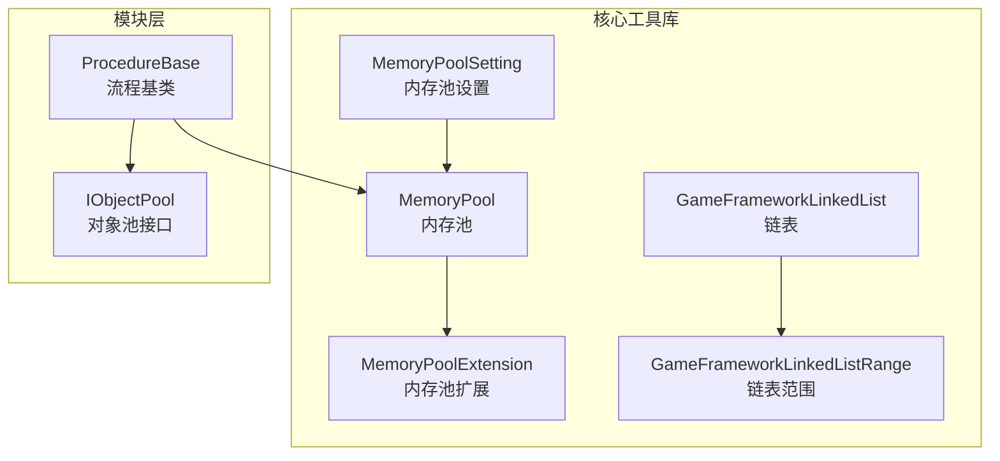
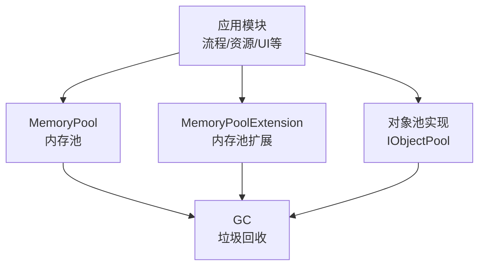
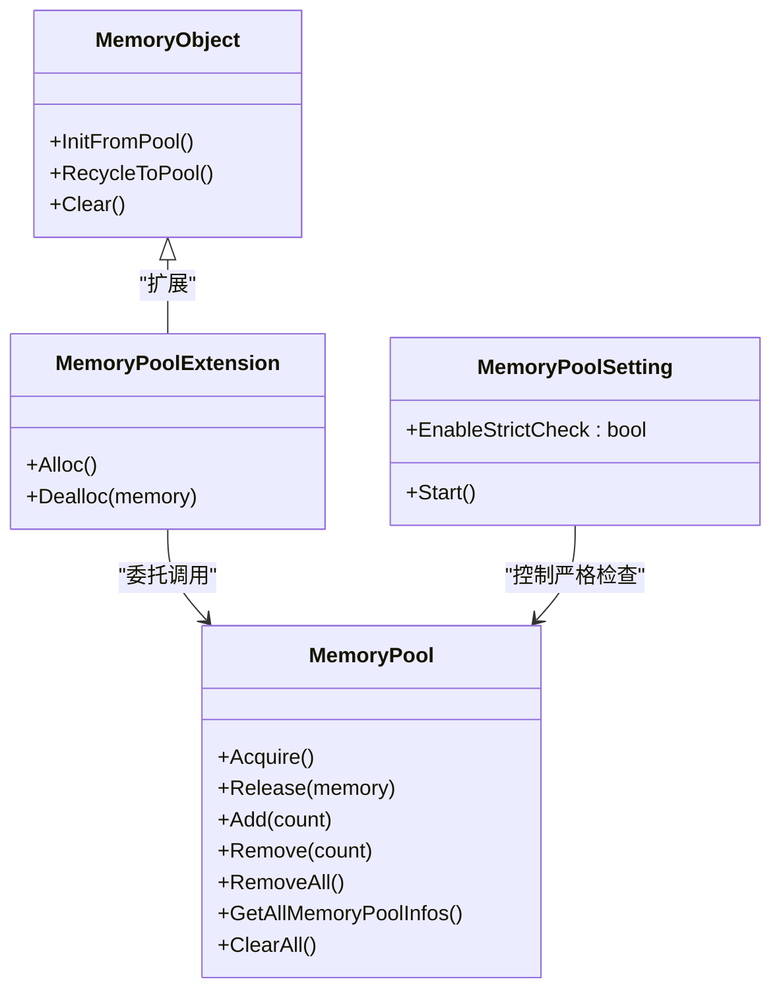
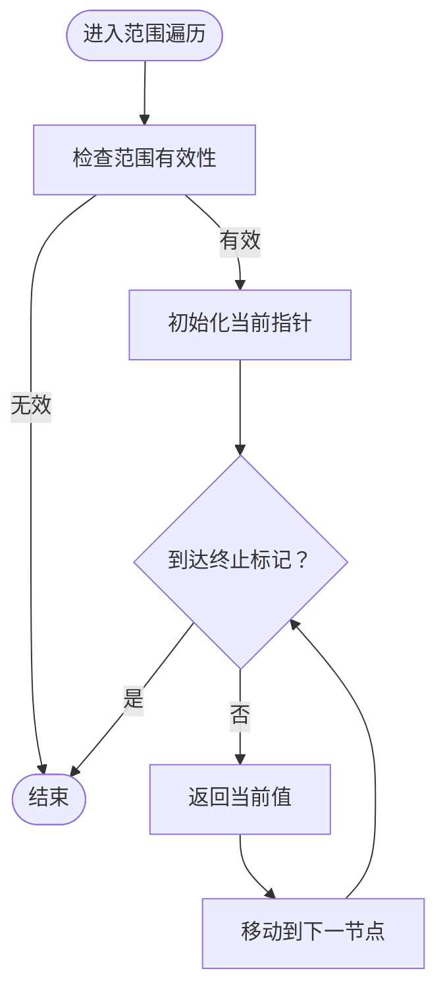
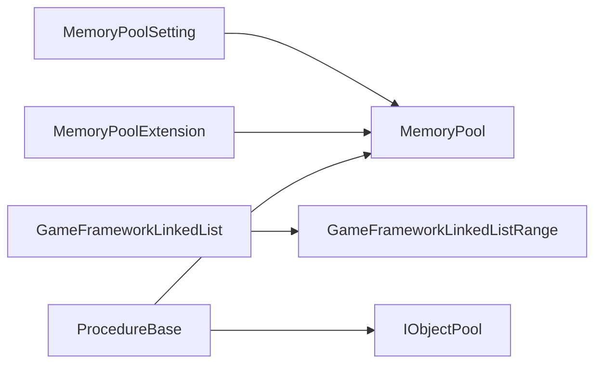

# 性能优化策略

<cite>
**本文引用的文件**
- [MemoryPool.cs](file://Assets/TEngine/Runtime/Core/MemoryPool/MemoryPool.cs)
- [MemoryPoolExtension.cs](file://Assets/TEngine/Runtime/Core/MemoryPool/MemoryPoolExtension.cs)
- [MemoryPoolSetting.cs](file://Assets/TEngine/Runtime/Core/MemoryPool/MemoryPoolSetting.cs)
- [GameFrameworkLinkedList.cs](file://Assets/TEngine/Runtime/Core/DataStruct/GameFrameworkLinkedList.cs)
- [GameFrameworkLinkedListRange.cs](file://Assets/TEngine/Runtime/Core/DataStruct/GameFrameworkLinkedListRange.cs)
- [IObjectPool.cs](file://Assets/TEngine/Runtime/Module/ObjectPoolModule/IObjectPool.cs)
- [ProcedureBase.cs](file://Assets/TEngine/Runtime/Module/ProcedureModule/ProcedureBase.cs)
</cite>

## 目录
1. [简介](#简介)
2. [项目结构](#项目结构)
3. [核心组件](#核心组件)
4. [架构总览](#架构总览)
5. [详细组件分析](#详细组件分析)
6. [依赖分析](#依赖分析)
7. [性能考虑](#性能考虑)
8. [故障排查指南](#故障排查指南)
9. [结论](#结论)
10. [附录](#附录)

## 简介
本文件面向TEngine引擎的性能优化，系统化阐述CPU、内存、渲染与网络优化策略，并重点解析内存池与对象池的设计原理与使用方法；同时给出渲染管线优化（批处理、LOD、剔除、材质优化）、资源管理优化（预加载、异步加载、释放时机控制）以及性能测试与评估方法（基准测试、压力测试、回归测试），并提供可执行的优化实施步骤与效果评估标准。

## 项目结构
TEngine采用“模块化+核心工具库”的分层组织方式：
- 核心工具库：内存池、数据结构（如链表与范围迭代器）、日志、事件系统等
- 模块层：流程模块、资源模块、音频模块、UI模块等
- 编辑器扩展与工具：本地化、图集构建、HybridCLR等

下图展示与性能优化直接相关的核心模块与文件关系：

图表来源
- [MemoryPool.cs:1-208](file://Assets/TEngine/Runtime/Core/MemoryPool/MemoryPool.cs#L1-L208)
- [MemoryPoolExtension.cs:1-57](file://Assets/TEngine/Runtime/Core/MemoryPool/MemoryPoolExtension.cs#L1-L57)
- [MemoryPoolSetting.cs:1-80](file://Assets/TEngine/Runtime/Core/MemoryPool/MemoryPoolSetting.cs#L1-L80)
- [GameFrameworkLinkedList.cs:1-393](file://Assets/TEngine/Runtime/Core/DataStruct/GameFrameworkLinkedList.cs#L1-L393)
- [GameFrameworkLinkedListRange.cs:1-181](file://Assets/TEngine/Runtime/Core/DataStruct/GameFrameworkLinkedListRange.cs#L1-L181)
- [IObjectPool.cs](file://Assets/TEngine/Runtime/Module/ObjectPoolModule/IObjectPool.cs)
- [ProcedureBase.cs:1-59](file://Assets/TEngine/Runtime/Module/ProcedureModule/ProcedureBase.cs#L1-L59)

章节来源
- [MemoryPool.cs:1-208](file://Assets/TEngine/Runtime/Core/MemoryPool/MemoryPool.cs#L1-L208)
- [MemoryPoolExtension.cs:1-57](file://Assets/TEngine/Runtime/Core/MemoryPool/MemoryPoolExtension.cs#L1-L57)
- [MemoryPoolSetting.cs:1-80](file://Assets/TEngine/Runtime/Core/MemoryPool/MemoryPoolSetting.cs#L1-L80)
- [GameFrameworkLinkedList.cs:1-393](file://Assets/TEngine/Runtime/Core/DataStruct/GameFrameworkLinkedList.cs#L1-L393)
- [GameFrameworkLinkedListRange.cs:1-181](file://Assets/TEngine/Runtime/Core/DataStruct/GameFrameworkLinkedListRange.cs#L1-L181)
- [IObjectPool.cs](file://Assets/TEngine/Runtime/Module/ObjectPoolModule/IObjectPool.cs)
- [ProcedureBase.cs:1-59](file://Assets/TEngine/Runtime/Module/ProcedureModule/ProcedureBase.cs#L1-L59)

## 核心组件
- 内存池（MemoryPool）：统一管理各类可复用对象的分配与回收，支持统计信息查询、批量增删、严格校验开关
- 内存池扩展（MemoryPoolExtension）：提供基于MemoryObject的分配/回收入口，简化生命周期管理
- 内存池设置（MemoryPoolSetting）：根据构建类型自动控制严格检查开关，避免生产环境性能损失
- 链表与范围迭代器（GameFrameworkLinkedList、GameFrameworkLinkedListRange）：提供节点缓存与范围遍历，降低GC与提升遍历效率
- 对象池接口（IObjectPool）：定义对象池契约，便于实现具体对象池
- 流程基类（ProcedureBase）：作为模块生命周期与更新调度的载体，影响CPU调度与帧内负载

章节来源
- [MemoryPool.cs:66-162](file://Assets/TEngine/Runtime/Core/MemoryPool/MemoryPool.cs#L66-L162)
- [MemoryPoolExtension.cs:28-56](file://Assets/TEngine/Runtime/Core/MemoryPool/MemoryPoolExtension.cs#L28-L56)
- [MemoryPoolSetting.cs:35-78](file://Assets/TEngine/Runtime/Core/MemoryPool/MemoryPoolSetting.cs#L35-L78)
- [GameFrameworkLinkedList.cs:289-309](file://Assets/TEngine/Runtime/Core/DataStruct/GameFrameworkLinkedList.cs#L289-L309)
- [GameFrameworkLinkedListRange.cs:118-178](file://Assets/TEngine/Runtime/Core/DataStruct/GameFrameworkLinkedListRange.cs#L118-L178)
- [IObjectPool.cs](file://Assets/TEngine/Runtime/Module/ObjectPoolModule/IObjectPool.cs)
- [ProcedureBase.cs:8-56](file://Assets/TEngine/Runtime/Module/ProcedureModule/ProcedureBase.cs#L8-L56)

## 架构总览
下图展示内存池与对象池在系统中的位置及交互关系，体现“分配—使用—回收—复用”的闭环，支撑低GC与高吞吐的运行时行为。

图表来源
- [MemoryPool.cs:1-208](file://Assets/TEngine/Runtime/Core/MemoryPool/MemoryPool.cs#L1-L208)
- [MemoryPoolExtension.cs:1-57](file://Assets/TEngine/Runtime/Core/MemoryPool/MemoryPoolExtension.cs#L1-L57)
- [IObjectPool.cs](file://Assets/TEngine/Runtime/Module/ObjectPoolModule/IObjectPool.cs)

## 详细组件分析

### 内存池与对象池设计与使用
- 设计要点
  - 类型隔离：按类型维护独立的MemoryCollection，避免跨类型干扰
  - 统计可观测：提供Unused/Using/Add/Release等计数，便于容量规划与异常定位
  - 严格校验：可选的类型与实例合法性检查，开发阶段用于捕获误用
  - 扩展入口：MemoryObject派生类通过Alloc/Dealloc实现生命周期钩子
- 使用建议
  - 在高频创建/销毁场景（如子弹、特效、UI项）优先使用对象池
  - 配置合适的初始容量与增长策略，避免运行期频繁扩容
  - 生产环境关闭严格校验，避免额外分支带来的CPU开销
- 关键路径参考
  - 分配：[Acquire<T>:71-74](file://Assets/TEngine/Runtime/Core/MemoryPool/MemoryPool.cs#L71-L74)
  - 归还：[Release:91-101](file://Assets/TEngine/Runtime/Core/MemoryPool/MemoryPool.cs#L91-L101)
  - 扩容：[Add<T>:108-111](file://Assets/TEngine/Runtime/Core/MemoryPool/MemoryPool.cs#L108-L111)
  - 分配扩展：[Alloc<T>:35-40](file://Assets/TEngine/Runtime/Core/MemoryPool/MemoryPoolExtension.cs#L35-L40)
  - 回收扩展：[Dealloc:46-55](file://Assets/TEngine/Runtime/Core/MemoryPool/MemoryPoolExtension.cs#L46-L55)
  - 设置开关：[EnableStrictCheck:43-54](file://Assets/TEngine/Runtime/Core/MemoryPool/MemoryPoolSetting.cs#L43-L54)

图表来源
- [MemoryPool.cs:1-208](file://Assets/TEngine/Runtime/Core/MemoryPool/MemoryPool.cs#L1-L208)
- [MemoryPoolExtension.cs:1-57](file://Assets/TEngine/Runtime/Core/MemoryPool/MemoryPoolExtension.cs#L1-L57)
- [MemoryPoolSetting.cs:1-80](file://Assets/TEngine/Runtime/Core/MemoryPool/MemoryPoolSetting.cs#L1-L80)

章节来源
- [MemoryPool.cs:66-162](file://Assets/TEngine/Runtime/Core/MemoryPool/MemoryPool.cs#L66-L162)
- [MemoryPoolExtension.cs:28-56](file://Assets/TEngine/Runtime/Core/MemoryPool/MemoryPoolExtension.cs#L28-L56)
- [MemoryPoolSetting.cs:35-78](file://Assets/TEngine/Runtime/Core/MemoryPool/MemoryPoolSetting.cs#L35-L78)

### 链表与范围迭代器的性能优化
- 设计要点
  - 节点缓存：内部队列缓存已分配节点，避免频繁GC
  - 范围遍历：以“起止标记”表达范围，减少中间容器创建
  - 枚举器：结构体枚举器，降低装箱与堆分配
- 使用建议
  - 高频插入/删除场景优先使用链表
  - 使用范围迭代器替代临时列表拷贝
- 关键路径参考
  - 节点获取：[AcquireNode:289-303](file://Assets/TEngine/Runtime/Core/DataStruct/GameFrameworkLinkedList.cs#L289-L303)
  - 节点回收：[ReleaseNode:305-309](file://Assets/TEngine/Runtime/Core/DataStruct/GameFrameworkLinkedList.cs#L305-L309)
  - 范围计数：[Count:51-68](file://Assets/TEngine/Runtime/Core/DataStruct/GameFrameworkLinkedListRange.cs#L51-L68)
  - 范围遍历：[Enumerator.MoveNext:158-168](file://Assets/TEngine/Runtime/Core/DataStruct/GameFrameworkLinkedListRange.cs#L158-L168)

图表来源
- [GameFrameworkLinkedListRange.cs:118-178](file://Assets/TEngine/Runtime/Core/DataStruct/GameFrameworkLinkedListRange.cs#L118-L178)

章节来源
- [GameFrameworkLinkedList.cs:289-309](file://Assets/TEngine/Runtime/Core/DataStruct/GameFrameworkLinkedList.cs#L289-L309)
- [GameFrameworkLinkedListRange.cs:51-68](file://Assets/TEngine/Runtime/Core/DataStruct/GameFrameworkLinkedListRange.cs#L51-L68)
- [GameFrameworkLinkedListRange.cs:158-168](file://Assets/TEngine/Runtime/Core/DataStruct/GameFrameworkLinkedListRange.cs#L158-L168)

### 渲染优化策略
- 批处理优化
  - 合并相同材质与纹理的相邻绘制调用，减少DrawCall
  - 使用静态/动态批处理，合理安排网格拓扑与UV布局
- LOD技术
  - 基于距离/视角的多级细节模型切换，降低面数与贴图分辨率
- 剔除算法
  - 视锥剔除（Frustum Culling）与遮挡剔除（Occlusion Culling）
  - 可见性缓存与增量更新，避免每帧全量计算
- 材质优化
  - 减少通道数与复杂着色器函数，合并纹理到图集
  - 使用Shader变体裁剪，避免不必要的分支

### 资源管理优化策略
- 预加载
  - 在进入场景前预热关键资源，降低首帧卡顿
- 异步加载
  - 使用异步API与分片加载，避免主线程阻塞
- 释放时机控制
  - 生命周期结束即回收，配合对象池实现无缝复用
  - 大资源（纹理、音频）在场景切换或不再需要时及时卸载

### CPU优化策略
- 更新调度
  - 利用流程模块（ProcedureBase）进行分阶段更新，避免单帧过载
- 任务拆分
  - 将耗时操作拆分为多帧，使用状态机推进
- 数据结构选择
  - 高频插入/删除使用链表；顺序访问使用数组/列表

章节来源
- [ProcedureBase.cs:8-56](file://Assets/TEngine/Runtime/Module/ProcedureModule/ProcedureBase.cs#L8-L56)

### 网络优化策略
- 连接复用
  - 复用TCP连接，减少握手与上下文切换
- 压缩与打包
  - 对消息体进行压缩，合并小包，降低带宽占用
- 心跳与保活
  - 合理的心跳周期与超时阈值，平衡能耗与稳定性
- 错误恢复
  - 断线重连与消息重发机制，保障可靠性

## 依赖分析
- 内存池与扩展
  - MemoryPoolExtension依赖MemoryPool进行分配/回收
  - MemoryPoolSetting在启动时决定严格检查开关
- 链表与范围迭代器
  - GameFrameworkLinkedListRange依赖GameFrameworkLinkedList的节点结构
- 模块层
  - 流程模块（ProcedureBase）作为调度中枢，间接影响CPU与内存使用

图表来源
- [MemoryPool.cs:1-208](file://Assets/TEngine/Runtime/Core/MemoryPool/MemoryPool.cs#L1-L208)
- [MemoryPoolExtension.cs:1-57](file://Assets/TEngine/Runtime/Core/MemoryPool/MemoryPoolExtension.cs#L1-L57)
- [MemoryPoolSetting.cs:1-80](file://Assets/TEngine/Runtime/Core/MemoryPool/MemoryPoolSetting.cs#L1-L80)
- [GameFrameworkLinkedList.cs:1-393](file://Assets/TEngine/Runtime/Core/DataStruct/GameFrameworkLinkedList.cs#L1-L393)
- [GameFrameworkLinkedListRange.cs:1-181](file://Assets/TEngine/Runtime/Core/DataStruct/GameFrameworkLinkedListRange.cs#L1-L181)
- [IObjectPool.cs](file://Assets/TEngine/Runtime/Module/ObjectPoolModule/IObjectPool.cs)
- [ProcedureBase.cs:1-59](file://Assets/TEngine/Runtime/Module/ProcedureModule/ProcedureBase.cs#L1-L59)

章节来源
- [MemoryPool.cs:1-208](file://Assets/TEngine/Runtime/Core/MemoryPool/MemoryPool.cs#L1-L208)
- [MemoryPoolExtension.cs:1-57](file://Assets/TEngine/Runtime/Core/MemoryPool/MemoryPoolExtension.cs#L1-L57)
- [MemoryPoolSetting.cs:1-80](file://Assets/TEngine/Runtime/Core/MemoryPool/MemoryPoolSetting.cs#L1-L80)
- [GameFrameworkLinkedList.cs:1-393](file://Assets/TEngine/Runtime/Core/DataStruct/GameFrameworkLinkedList.cs#L1-L393)
- [GameFrameworkLinkedListRange.cs:1-181](file://Assets/TEngine/Runtime/Core/DataStruct/GameFrameworkLinkedListRange.cs#L1-L181)
- [IObjectPool.cs](file://Assets/TEngine/Runtime/Module/ObjectPoolModule/IObjectPool.cs)
- [ProcedureBase.cs:1-59](file://Assets/TEngine/Runtime/Module/ProcedureModule/ProcedureBase.cs#L1-L59)

## 性能考虑
- 内存优化
  - 使用对象池与内存池降低GC频率与峰值
  - 启动阶段预热常用类型内存池，避免运行期抖动
  - 生产环境关闭严格检查，避免分支带来的CPU损耗
- CPU优化
  - 将长任务拆分到多帧，利用流程模块进行有序推进
  - 选择合适的数据结构（链表/数组/字典）以匹配访问模式
- 渲染优化
  - 批处理与剔除优先，材质与纹理尽量合并
  - LOD与视锥剔除结合，显著降低渲染负载
- 网络优化
  - 合理的连接复用与消息打包策略，降低带宽与CPU消耗

## 故障排查指南
- 内存池问题
  - 症状：运行期频繁GC、内存抖动
  - 排查：查看内存池统计信息，确认Add/Remove比例与容量配置
  - 参考：[GetAllMemoryPoolInfos:33-48](file://Assets/TEngine/Runtime/Core/MemoryPool/MemoryPool.cs#L33-L48)
- 严格检查导致的性能下降
  - 症状：开发模式正常，发布版本明显卡顿
  - 排查：确认MemoryPoolSetting的启用策略与构建类型
  - 参考：[EnableStrictCheck:43-54](file://Assets/TEngine/Runtime/Core/MemoryPool/MemoryPoolSetting.cs#L43-L54)
- 链表遍历异常
  - 症状：范围遍历抛出异常或死循环
  - 排查：确认范围构造参数与终止标记一致性
  - 参考：[GameFrameworkLinkedListRange构造:22-31](file://Assets/TEngine/Runtime/Core/DataStruct/GameFrameworkLinkedListRange.cs#L22-L31)

章节来源
- [MemoryPool.cs:33-48](file://Assets/TEngine/Runtime/Core/MemoryPool/MemoryPool.cs#L33-L48)
- [MemoryPoolSetting.cs:43-54](file://Assets/TEngine/Runtime/Core/MemoryPool/MemoryPoolSetting.cs#L43-L54)
- [GameFrameworkLinkedListRange.cs:22-31](file://Assets/TEngine/Runtime/Core/DataStruct/GameFrameworkLinkedListRange.cs#L22-L31)

## 结论
通过内存池与对象池的系统化应用、高效数据结构的选择、渲染管线的批处理与剔除优化、资源管理的预加载与异步加载策略，以及完善的性能测试与回归机制，TEngine可在保证功能完整性的同时获得稳定且可预期的性能表现。建议在各模块上线前完成基准与回归测试，并持续监控内存池统计与帧时间指标。

## 附录
- 性能测试与评估方法
  - 基准测试：固定场景与脚本，测量平均帧时间、内存占用、GC次数
  - 压力测试：逐步增加并发与资源密度，观察稳定性与退化点
  - 回归测试：建立自动化脚本，定期对比关键指标，防止性能倒退
- 实施步骤
  - 识别热点模块与数据结构
  - 应用对象池/内存池与批处理/剔除策略
  - 配置资源预加载与异步加载
  - 建立性能监控与告警
  - 持续回归测试与指标追踪