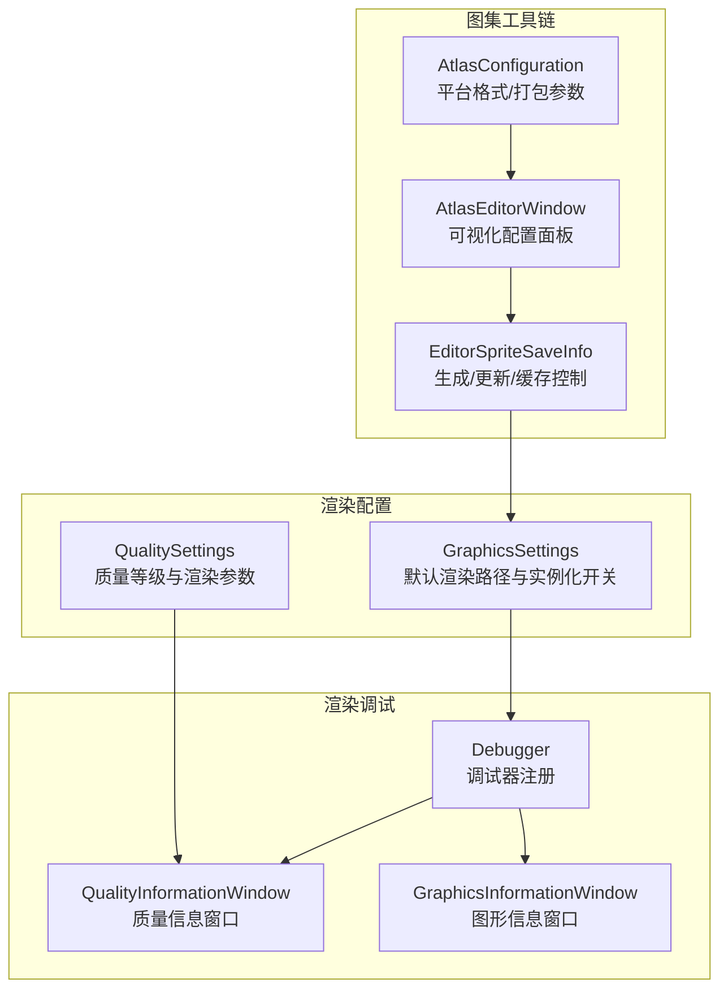
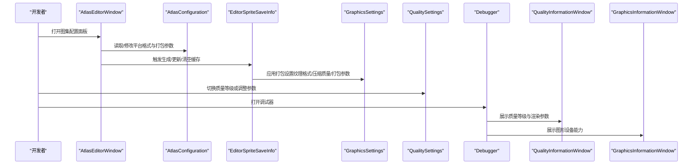
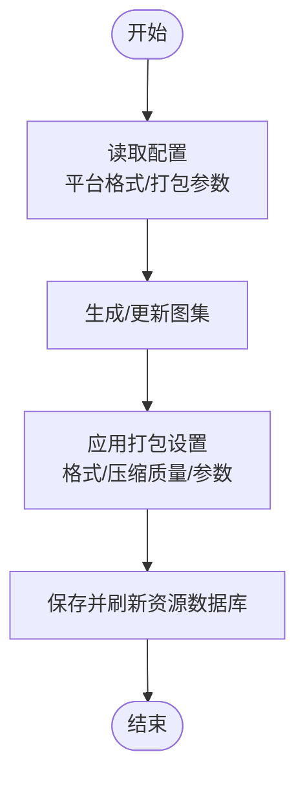
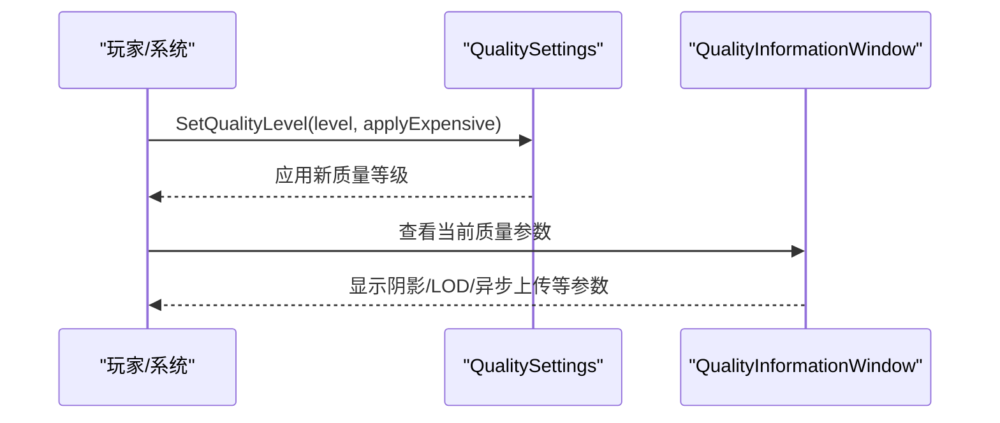
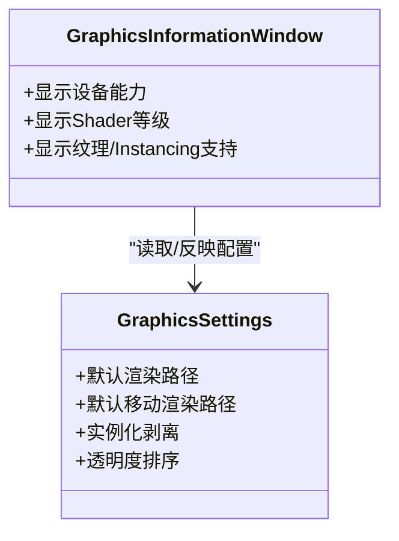
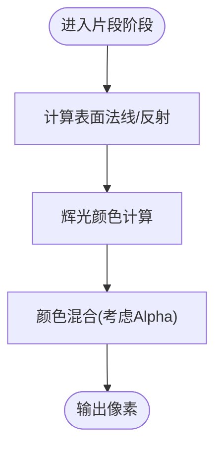
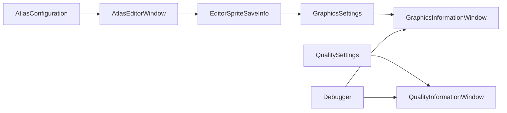

# 渲染优化策略

<cite>
**本文引用的文件**
- [GraphicsSettings.asset](file://ProjectSettings/GraphicsSettings.asset)
- [QualitySettings.asset](file://ProjectSettings/QualitySettings.asset)
- [AtlasConfiguration.cs](file://Assets/TEngine/Editor/AtlasMakerEditor/AtlasConfiguration.cs)
- [AtlasEditorWindow.cs](file://Assets/TEngine/Editor/AtlasMakerEditor/AtlasEditorWindow.cs)
- [EditorSpriteSaveInfo.cs](file://Assets/TEngine/Editor/AtlasMakerEditor/EditorSpriteSaveInfo.cs)
- [DebuggerModule.QualityInformationWindow.cs](file://Assets/TEngine/Runtime/Module/DebugerModule/Component/DebuggerModule.QualityInformationWindow.cs)
- [DebuggerModule.GraphicsInformationWindow.cs](file://Assets/TEngine/Runtime/Module/DebugerModule/Component/DebuggerModule.GraphicsInformationWindow.cs)
- [Debugger.cs](file://Assets/TEngine/Runtime/Module/DebugerModule/Debugger.cs)
- [TMPro.cginc](file://Assets/TextMesh Pro/Shaders/TMPro.cginc)
</cite>

## 目录
1. [引言](#引言)
2. [项目结构](#项目结构)
3. [核心组件](#核心组件)
4. [架构总览](#架构总览)
5. [详细组件分析](#详细组件分析)
6. [依赖关系分析](#依赖关系分析)
7. [性能考量](#性能考量)
8. [故障排查指南](#故障排查指南)
9. [结论](#结论)
10. [附录](#附录)

## 引言
本技术文档面向TEngine项目的渲染优化，系统化阐述Unity渲染管线在批处理、LOD、剔除、材质与着色器等方面的优化方法，并结合项目中已有的图集工具链、质量等级与图形信息调试能力，给出可落地的实践建议。内容涵盖：
- 批处理优化（静态/动态批处理、GPU Instancing）
- LOD与剔除（视锥剔除、遮挡剔除、LOD策略）
- 材质与着色器优化（变体控制、属性合并）
- 资源优化（纹理压缩、贴图大小、UV优化）
- 渲染调试（图形信息、帧率、内存监控）
- 移动端与PC端差异化策略与最佳实践

## 项目结构
TEngine在渲染优化方面主要涉及以下模块与设置：
- 项目质量等级与图形设置：通过QualitySettings与GraphicsSettings进行全局渲染参数控制
- 图集工具链：用于纹理打包、压缩格式与打包参数配置，降低Draw Call与内存占用
- 渲染调试：通过内置调试器窗口查看图形设备能力、质量等级参数与运行时内存情况

图表来源
- [QualitySettings.asset:1-240](file://ProjectSettings/QualitySettings.asset#L1-L240)
- [GraphicsSettings.asset:1-65](file://ProjectSettings/GraphicsSettings.asset#L1-L65)
- [AtlasConfiguration.cs:1-55](file://Assets/TEngine/Editor/AtlasMakerEditor/AtlasConfiguration.cs#L1-L55)
- [AtlasEditorWindow.cs:1-269](file://Assets/TEngine/Editor/AtlasMakerEditor/AtlasEditorWindow.cs#L1-L269)
- [EditorSpriteSaveInfo.cs:307-506](file://Assets/TEngine/Editor/AtlasMakerEditor/EditorSpriteSaveInfo.cs#L307-L506)
- [Debugger.cs:61-204](file://Assets/TEngine/Runtime/Module/DebugerModule/Debugger.cs#L61-L204)
- [DebuggerModule.QualityInformationWindow.cs:1-107](file://Assets/TEngine/Runtime/Module/DebugerModule/Component/DebuggerModule.QualityInformationWindow.cs#L1-L107)
- [DebuggerModule.GraphicsInformationWindow.cs:1-163](file://Assets/TEngine/Runtime/Module/DebugerModule/Component/DebuggerModule.GraphicsInformationWindow.cs#L1-L163)

章节来源
- [QualitySettings.asset:1-240](file://ProjectSettings/QualitySettings.asset#L1-L240)
- [GraphicsSettings.asset:1-65](file://ProjectSettings/GraphicsSettings.asset#L1-L65)
- [AtlasConfiguration.cs:1-55](file://Assets/TEngine/Editor/AtlasMakerEditor/AtlasConfiguration.cs#L1-L55)
- [AtlasEditorWindow.cs:1-269](file://Assets/TEngine/Editor/AtlasMakerEditor/AtlasEditorWindow.cs#L1-L269)
- [EditorSpriteSaveInfo.cs:307-506](file://Assets/TEngine/Editor/AtlasMakerEditor/EditorSpriteSaveInfo.cs#L307-L506)
- [Debugger.cs:61-204](file://Assets/TEngine/Runtime/Module/DebugerModule/Debugger.cs#L61-L204)
- [DebuggerModule.QualityInformationWindow.cs:1-107](file://Assets/TEngine/Runtime/Module/DebugerModule/Component/DebuggerModule.QualityInformationWindow.cs#L1-L107)
- [DebuggerModule.GraphicsInformationWindow.cs:1-163](file://Assets/TEngine/Runtime/Module/DebugerModule/Component/DebuggerModule.GraphicsInformationWindow.cs#L1-L163)

## 核心组件
- 质量等级与渲染参数：通过QualitySettings统一管理阴影、抗锯齿、LOD、异步上传等参数，支持按平台默认值与手动切换
- 图形设置与实例化：GraphicsSettings控制默认渲染路径与Instancing开关，影响批处理与Draw Call
- 图集配置与打包：AtlasConfiguration定义平台纹理格式、打包参数；AtlasEditorWindow提供可视化配置；EditorSpriteSaveInfo负责生成、更新与缓存
- 渲染调试：Debugger注册多个调试窗口，QualityInformationWindow与GraphicsInformationWindow分别展示质量参数与图形设备能力

章节来源
- [QualitySettings.asset:1-240](file://ProjectSettings/QualitySettings.asset#L1-L240)
- [GraphicsSettings.asset:1-65](file://ProjectSettings/GraphicsSettings.asset#L1-L65)
- [AtlasConfiguration.cs:1-55](file://Assets/TEngine/Editor/AtlasMakerEditor/AtlasConfiguration.cs#L1-L55)
- [AtlasEditorWindow.cs:1-269](file://Assets/TEngine/Editor/AtlasMakerEditor/AtlasEditorWindow.cs#L1-L269)
- [EditorSpriteSaveInfo.cs:307-506](file://Assets/TEngine/Editor/AtlasMakerEditor/EditorSpriteSaveInfo.cs#L307-L506)
- [Debugger.cs:61-204](file://Assets/TEngine/Runtime/Module/DebugerModule/Debugger.cs#L61-L204)
- [DebuggerModule.QualityInformationWindow.cs:1-107](file://Assets/TEngine/Runtime/Module/DebugerModule/Component/DebuggerModule.QualityInformationWindow.cs#L1-L107)
- [DebuggerModule.GraphicsInformationWindow.cs:1-163](file://Assets/TEngine/Runtime/Module/DebugerModule/Component/DebuggerModule.GraphicsInformationWindow.cs#L1-L163)

## 架构总览
下图展示了从配置到执行再到调试的整体流程：

图表来源
- [AtlasEditorWindow.cs:1-269](file://Assets/TEngine/Editor/AtlasMakerEditor/AtlasEditorWindow.cs#L1-L269)
- [AtlasConfiguration.cs:1-55](file://Assets/TEngine/Editor/AtlasMakerEditor/AtlasConfiguration.cs#L1-L55)
- [EditorSpriteSaveInfo.cs:307-506](file://Assets/TEngine/Editor/AtlasMakerEditor/EditorSpriteSaveInfo.cs#L307-L506)
- [GraphicsSettings.asset:1-65](file://ProjectSettings/GraphicsSettings.asset#L1-L65)
- [QualitySettings.asset:1-240](file://ProjectSettings/QualitySettings.asset#L1-L240)
- [Debugger.cs:61-204](file://Assets/TEngine/Runtime/Module/DebugerModule/Debugger.cs#L61-L204)
- [DebuggerModule.QualityInformationWindow.cs:1-107](file://Assets/TEngine/Runtime/Module/DebugerModule/Component/DebuggerModule.QualityInformationWindow.cs#L1-L107)
- [DebuggerModule.GraphicsInformationWindow.cs:1-163](file://Assets/TEngine/Runtime/Module/DebugerModule/Component/DebuggerModule.GraphicsInformationWindow.cs#L1-L163)

## 详细组件分析

### 组件A：图集工具链（纹理打包与压缩）
- 功能要点
  - 可视化配置平台纹理格式（Android/iOS/WebGL）与压缩质量
  - 打包参数（Padding、旋转、紧致填充、Block Offset）
  - 自动/增量生成与缓存清理
- 性能影响
  - 合理的纹理格式与压缩质量可显著降低显存占用与带宽压力
  - 紧致填充与Padding设置影响Draw Call与采样精度平衡
- 使用建议
  - 针对移动端优先采用ASTC等现代压缩格式
  - 大量小图建议启用紧致填充，减少边缘采样开销
  - 定期清理缓存，避免过期图集导致资源膨胀

图表来源
- [AtlasConfiguration.cs:1-55](file://Assets/TEngine/Editor/AtlasMakerEditor/AtlasConfiguration.cs#L1-L55)
- [AtlasEditorWindow.cs:1-269](file://Assets/TEngine/Editor/AtlasMakerEditor/AtlasEditorWindow.cs#L1-L269)
- [EditorSpriteSaveInfo.cs:307-506](file://Assets/TEngine/Editor/AtlasMakerEditor/EditorSpriteSaveInfo.cs#L307-L506)

章节来源
- [AtlasConfiguration.cs:1-55](file://Assets/TEngine/Editor/AtlasMakerEditor/AtlasConfiguration.cs#L1-L55)
- [AtlasEditorWindow.cs:1-269](file://Assets/TEngine/Editor/AtlasMakerEditor/AtlasEditorWindow.cs#L1-L269)
- [EditorSpriteSaveInfo.cs:307-506](file://Assets/TEngine/Editor/AtlasMakerEditor/EditorSpriteSaveInfo.cs#L307-L506)

### 组件B：质量等级与渲染参数（QualitySettings）
- 功能要点
  - 提供多级质量预设，覆盖阴影、抗锯齿、LOD、异步上传等
  - 支持按平台默认质量等级
- 性能影响
  - 调整阴影距离、级联数、像素光照数直接影响GPU负载
  - LOD Bias与最大LOD级别影响远距离对象细节与带宽
- 使用建议
  - 在低端设备上降低阴影质量与级联数
  - 通过动态切换质量等级适配实时帧率

图表来源
- [QualitySettings.asset:1-240](file://ProjectSettings/QualitySettings.asset#L1-L240)
- [DebuggerModule.QualityInformationWindow.cs:1-107](file://Assets/TEngine/Runtime/Module/DebugerModule/Component/DebuggerModule.QualityInformationWindow.cs#L1-L107)

章节来源
- [QualitySettings.asset:1-240](file://ProjectSettings/QualitySettings.asset#L1-L240)
- [DebuggerModule.QualityInformationWindow.cs:1-107](file://Assets/TEngine/Runtime/Module/DebugerModule/Component/DebuggerModule.QualityInformationWindow.cs#L1-L107)

### 组件C：图形设备能力与渲染管线（GraphicsSettings + GraphicsInformationWindow）
- 功能要点
  - 默认渲染路径与实例化开关
  - 图形设备能力检测（Shader Level、纹理尺寸、Instancing支持等）
- 性能影响
  - Instancing开启可显著降低Draw Call
  - 设备能力决定可用特性与优化空间
- 使用建议
  - 在支持Instancing的设备上启用Instancing
  - 根据设备能力选择合适的渲染路径与特性

图表来源
- [GraphicsSettings.asset:1-65](file://ProjectSettings/GraphicsSettings.asset#L1-L65)
- [DebuggerModule.GraphicsInformationWindow.cs:1-163](file://Assets/TEngine/Runtime/Module/DebugerModule/Component/DebuggerModule.GraphicsInformationWindow.cs#L1-L163)

章节来源
- [GraphicsSettings.asset:1-65](file://ProjectSettings/GraphicsSettings.asset#L1-L65)
- [DebuggerModule.GraphicsInformationWindow.cs:1-163](file://Assets/TEngine/Runtime/Module/DebugerModule/Component/DebuggerModule.GraphicsInformationWindow.cs#L1-L163)

### 组件D：材质与着色器（TMPro.cginc）
- 功能要点
  - 表面法线与反射计算、辉光混合等通用片段函数
- 性能影响
  - 减少不必要的高成本运算（如高次幂、复杂插值）
  - 控制着色器分支与变体数量
- 使用建议
  - 合理使用属性与条件编译，避免过多变体
  - 对UI文本等高频对象，优先使用轻量着色器

图表来源
- [TMPro.cginc:57-83](file://Assets/TextMesh Pro/Shaders/TMPro.cginc#L57-L83)

章节来源
- [TMPro.cginc:57-83](file://Assets/TextMesh Pro/Shaders/TMPro.cginc#L57-L83)

## 依赖关系分析
- 图集工具链依赖GraphicsSettings中的打包设置生效
- 调试器窗口依赖QualitySettings与SystemInfo能力查询
- 质量等级变更直接影响渲染参数与帧率表现

图表来源
- [AtlasConfiguration.cs:1-55](file://Assets/TEngine/Editor/AtlasMakerEditor/AtlasConfiguration.cs#L1-L55)
- [AtlasEditorWindow.cs:1-269](file://Assets/TEngine/Editor/AtlasMakerEditor/AtlasEditorWindow.cs#L1-L269)
- [EditorSpriteSaveInfo.cs:307-506](file://Assets/TEngine/Editor/AtlasMakerEditor/EditorSpriteSaveInfo.cs#L307-L506)
- [GraphicsSettings.asset:1-65](file://ProjectSettings/GraphicsSettings.asset#L1-L65)
- [QualitySettings.asset:1-240](file://ProjectSettings/QualitySettings.asset#L1-L240)
- [Debugger.cs:61-204](file://Assets/TEngine/Runtime/Module/DebugerModule/Debugger.cs#L61-L204)
- [DebuggerModule.QualityInformationWindow.cs:1-107](file://Assets/TEngine/Runtime/Module/DebugerModule/Component/DebuggerModule.QualityInformationWindow.cs#L1-L107)
- [DebuggerModule.GraphicsInformationWindow.cs:1-163](file://Assets/TEngine/Runtime/Module/DebugerModule/Component/DebuggerModule.GraphicsInformationWindow.cs#L1-L163)

章节来源
- [AtlasConfiguration.cs:1-55](file://Assets/TEngine/Editor/AtlasMakerEditor/AtlasConfiguration.cs#L1-L55)
- [AtlasEditorWindow.cs:1-269](file://Assets/TEngine/Editor/AtlasMakerEditor/AtlasEditorWindow.cs#L1-L269)
- [EditorSpriteSaveInfo.cs:307-506](file://Assets/TEngine/Editor/AtlasMakerEditor/EditorSpriteSaveInfo.cs#L307-L506)
- [GraphicsSettings.asset:1-65](file://ProjectSettings/GraphicsSettings.asset#L1-L65)
- [QualitySettings.asset:1-240](file://ProjectSettings/QualitySettings.asset#L1-L240)
- [Debugger.cs:61-204](file://Assets/TEngine/Runtime/Module/DebugerModule/Debugger.cs#L61-L204)
- [DebuggerModule.QualityInformationWindow.cs:1-107](file://Assets/TEngine/Runtime/Module/DebugerModule/Component/DebuggerModule.QualityInformationWindow.cs#L1-L107)
- [DebuggerModule.GraphicsInformationWindow.cs:1-163](file://Assets/TEngine/Runtime/Module/DebugerModule/Component/DebuggerModule.GraphicsInformationWindow.cs#L1-L163)

## 性能考量
- 批处理优化
  - 静态批处理：尽量合并静态场景对象，减少Draw Call
  - 动态批处理：控制材质差异与顶点属性，避免中断批处理
  - GPU Instancing：在支持设备上启用，合并相同网格与材质的实例绘制
- LOD与剔除
  - 视锥剔除：合理设置相机裁剪面与LOD过渡
  - 遮挡剔除：在复杂场景中启用遮挡剔除，减少不可见对象渲染
  - LOD策略：根据距离与屏幕占比动态切换模型细节
- 材质与着色器
  - 控制变体数量，避免过多分支
  - 合理使用属性，减少每帧状态切换
- 资源优化
  - 纹理压缩：移动端优先ASTC/ETC，PC端BC系列
  - 贴图大小：按分辨率与用途选择合适尺寸，避免过度放大
  - UV优化：减少拉伸与浪费，提高采样效率
- 移动端与PC端差异化
  - 移动端：降低阴影质量、关闭软阴影、减少粒子与后处理
  - PC端：可适当提高阴影与抗锯齿质量，启用更丰富的后处理

## 故障排查指南
- 使用调试器窗口定位问题
  - 质量信息窗口：检查阴影、LOD、异步上传等参数是否符合预期
  - 图形信息窗口：确认设备能力（Instancing、纹理尺寸、Shader等级）
- 快速验证
  - 临时切换低质量等级验证帧率变化
  - 检查图集生成是否成功，确认纹理格式与压缩质量设置
- 常见问题
  - 帧率骤降：优先检查阴影与粒子预算、批处理中断原因
  - 内存飙升：核查图集打包参数与纹理尺寸，清理缓存

章节来源
- [DebuggerModule.QualityInformationWindow.cs:1-107](file://Assets/TEngine/Runtime/Module/DebugerModule/Component/DebuggerModule.QualityInformationWindow.cs#L1-L107)
- [DebuggerModule.GraphicsInformationWindow.cs:1-163](file://Assets/TEngine/Runtime/Module/DebugerModule/Component/DebuggerModule.GraphicsInformationWindow.cs#L1-L163)
- [Debugger.cs:61-204](file://Assets/TEngine/Runtime/Module/DebugerModule/Debugger.cs#L61-L204)

## 结论
TEngine的渲染优化应围绕“配置—执行—调试”闭环展开：通过图集工具链与质量等级参数实现资源与渲染参数的精细化控制，借助调试器窗口持续观测设备能力与运行时表现，最终在不同平台上取得稳定且高效的渲染效果。

## 附录
- 参考文件路径与行号（用于快速定位）
  - [QualitySettings资产:1-240](file://ProjectSettings/QualitySettings.asset#L1-L240)
  - [GraphicsSettings资产:1-65](file://ProjectSettings/GraphicsSettings.asset#L1-L65)
  - [图集配置类:1-55](file://Assets/TEngine/Editor/AtlasMakerEditor/AtlasConfiguration.cs#L1-L55)
  - [图集编辑器窗口:1-269](file://Assets/TEngine/Editor/AtlasMakerEditor/AtlasEditorWindow.cs#L1-L269)
  - [图集生成逻辑:307-506](file://Assets/TEngine/Editor/AtlasMakerEditor/EditorSpriteSaveInfo.cs#L307-L506)
  - [质量信息窗口:1-107](file://Assets/TEngine/Runtime/Module/DebugerModule/Component/DebuggerModule.QualityInformationWindow.cs#L1-L107)
  - [图形信息窗口:1-163](file://Assets/TEngine/Runtime/Module/DebugerModule/Component/DebuggerModule.GraphicsInformationWindow.cs#L1-L163)
  - [调试器注册:61-204](file://Assets/TEngine/Runtime/Module/DebugerModule/Debugger.cs#L61-L204)
  - [着色器通用函数:57-83](file://Assets/TextMesh Pro/Shaders/TMPro.cginc#L57-L83)