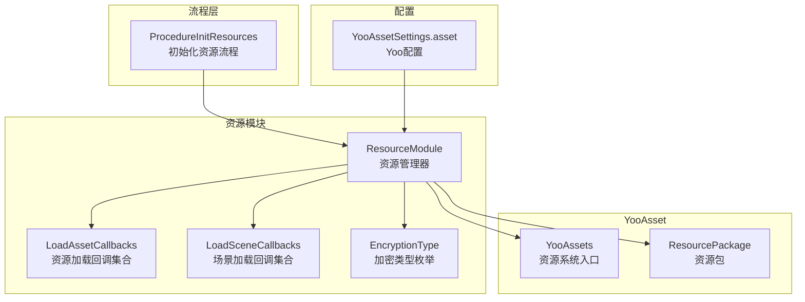
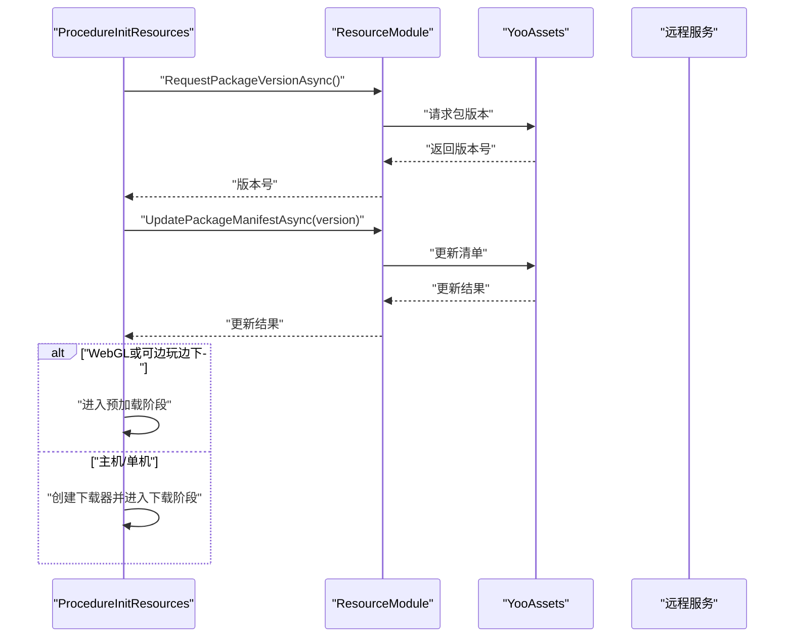
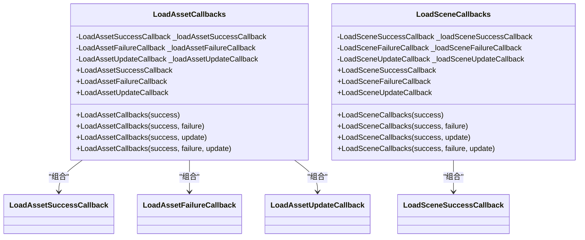
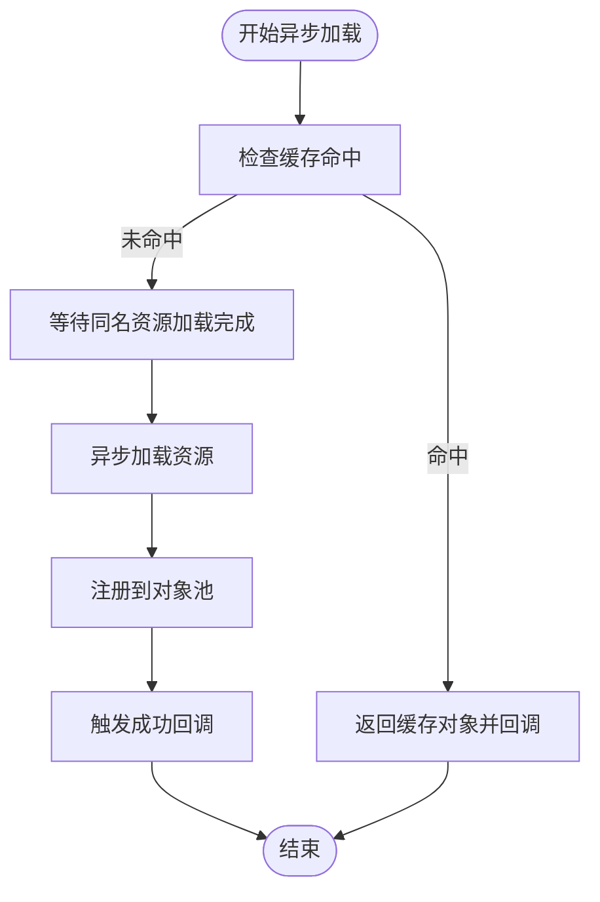
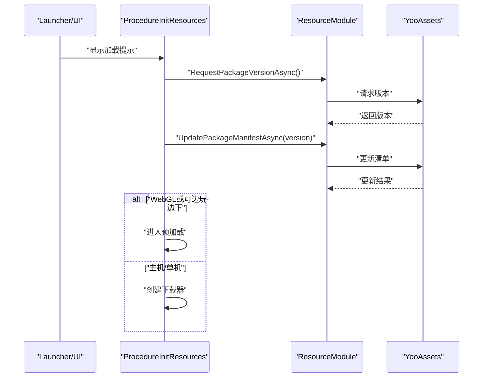
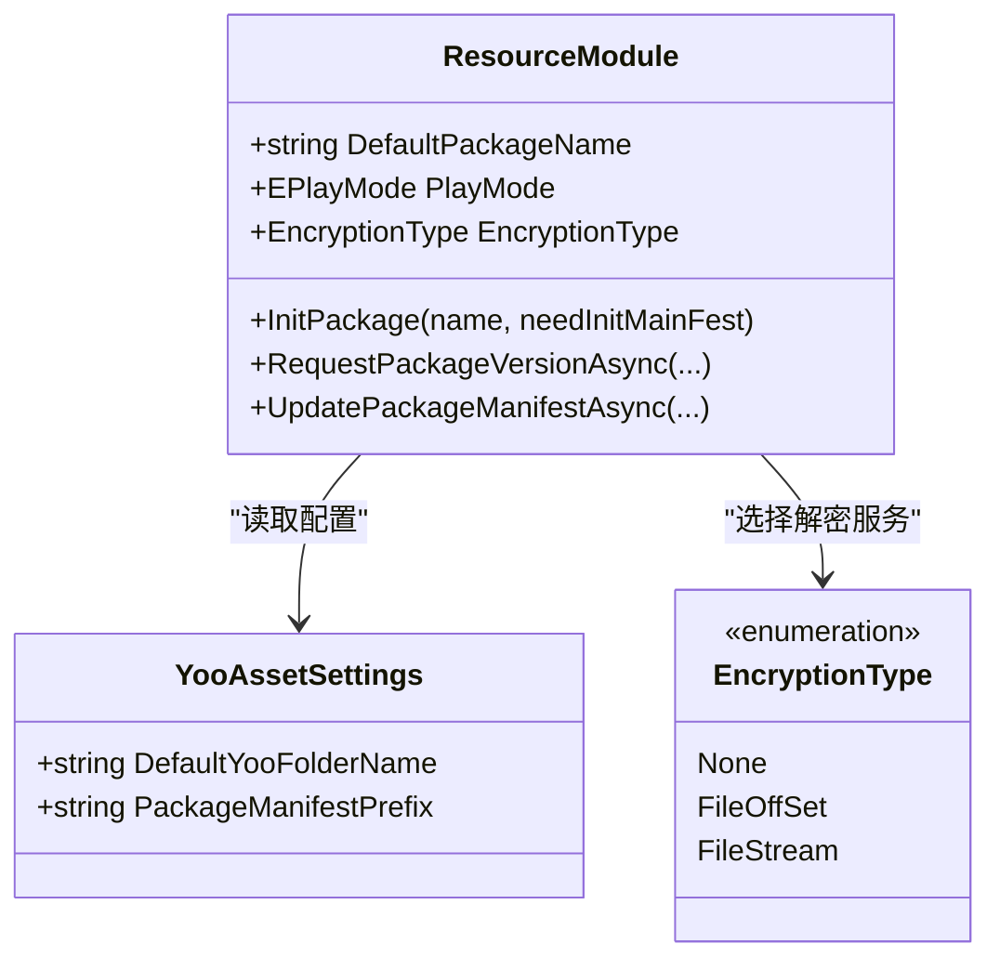
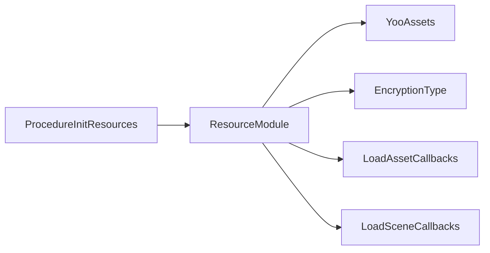

# 资源管理优化

<cite>
**本文引用的文件**
- [LoadAssetCallbacks.cs](file://Assets/TEngine/Runtime/Module/ResourceModule/Callback/LoadAssetCallbacks.cs)
- [LoadSceneCallbacks.cs](file://Assets/TEngine/Runtime/Module/ResourceModule/Callback/LoadSceneCallbacks.cs)
- [LoadAssetSuccessCallback.cs](file://Assets/TEngine/Runtime/Module/ResourceModule/Callback/LoadAssetSuccessCallback.cs)
- [LoadAssetFailureCallback.cs](file://Assets/TEngine/Runtime/Module/ResourceModule/Callback/LoadAssetFailureCallback.cs)
- [LoadAssetUpdateCallback.cs](file://Assets/TEngine/Runtime/Module/ResourceModule/Callback/LoadAssetUpdateCallback.cs)
- [LoadSceneSuccessCallback.cs](file://Assets/TEngine/Runtime/Module/ResourceModule/Callback/LoadSceneSuccessCallback.cs)
- [ResourceModule.cs](file://Assets/TEngine/Runtime/Module/ResourceModule/ResourceModule.cs)
- [ProcedureInitResources.cs](file://Assets/GameScripts/Procedure/ProcedureInitResources.cs)
- [YooAssetSettings.asset](file://Assets/TEngine/Settings/Resources/YooAssetSettings.asset)
- [EncryptionType.cs](file://Assets/TEngine/Runtime/Module/ResourceModule/EncryptionType.cs)
</cite>

## 目录
1. [简介](#简介)
2. [项目结构](#项目结构)
3. [核心组件](#核心组件)
4. [架构总览](#架构总览)
5. [详细组件分析](#详细组件分析)
6. [依赖分析](#依赖分析)
7. [性能考虑](#性能考虑)
8. [故障排查指南](#故障排查指南)
9. [结论](#结论)
10. [附录](#附录)

## 简介
本文件面向TEngine资源管理优化，系统阐述资源加载与卸载优化、缓存策略、异步加载机制（含LoadAssetCallbacks、LoadSceneCallbacks等回调）、资源包管理与依赖处理、预加载策略、生命周期管理与内存峰值控制、YooAsset集成配置（包配置、加密、版本管理），以及资源加载性能测试与内存监控方法，并给出多平台优化策略与打包发布最佳实践。

## 项目结构
TEngine采用模块化组织，资源管理位于TEngine/Runtime/Module/ResourceModule下，围绕YooAsset实现跨平台资源加载与管理；流程层通过Procedure模块驱动资源初始化、清单更新、下载器创建与预加载阶段切换。

**图表来源**
- [ProcedureInitResources.cs:10-172](file://Assets/GameScripts/Procedure/ProcedureInitResources.cs#L10-L172)
- [ResourceModule.cs:17-138](file://Assets/TEngine/Runtime/Module/ResourceModule/ResourceModule.cs#L17-L138)
- [LoadAssetCallbacks.cs:6-91](file://Assets/TEngine/Runtime/Module/ResourceModule/Callback/LoadAssetCallbacks.cs#L6-L91)
- [LoadSceneCallbacks.cs:6-91](file://Assets/TEngine/Runtime/Module/ResourceModule/Callback/LoadSceneCallbacks.cs#L6-L91)
- [YooAssetSettings.asset:1-17](file://Assets/TEngine/Settings/Resources/YooAssetSettings.asset#L1-L17)

**章节来源**
- [ProcedureInitResources.cs:10-172](file://Assets/GameScripts/Procedure/ProcedureInitResources.cs#L10-L172)
- [ResourceModule.cs:17-138](file://Assets/TEngine/Runtime/Module/ResourceModule/ResourceModule.cs#L17-L138)

## 核心组件
- 资源管理器（ResourceModule）
  - 支持多种运行模式（编辑器模拟、单机、主机、WebGL），按模式选择文件系统参数与解密服务。
  - 提供包初始化、版本请求与清单更新、下载器创建、缓存清理、低内存回收等能力。
  - 内置资源池与缓存键管理，减少重复加载与GC压力。
- 回调体系
  - LoadAssetCallbacks/LoadSceneCallbacks：封装成功、失败、更新三类回调，便于统一管理。
  - LoadAssetSuccessCallback/LoadAssetFailureCallback/LoadAssetUpdateCallback：资源加载回调委托。
  - LoadSceneSuccessCallback等：场景加载回调委托。
- 配置与加密
  - YooAssetSettings：默认Yoo文件夹名等基础配置。
  - EncryptionType：None/FileOffSet/FileStream三种加密策略，分别对应不同解密服务。

**章节来源**
- [ResourceModule.cs:17-138](file://Assets/TEngine/Runtime/Module/ResourceModule/ResourceModule.cs#L17-L138)
- [LoadAssetCallbacks.cs:6-91](file://Assets/TEngine/Runtime/Module/ResourceModule/Callback/LoadAssetCallbacks.cs#L6-L91)
- [LoadSceneCallbacks.cs:6-91](file://Assets/TEngine/Runtime/Module/ResourceModule/Callback/LoadSceneCallbacks.cs#L6-L91)
- [YooAssetSettings.asset:1-17](file://Assets/TEngine/Settings/Resources/YooAssetSettings.asset#L1-L17)
- [EncryptionType.cs:7-26](file://Assets/TEngine/Runtime/Module/ResourceModule/EncryptionType.cs#L7-L26)

## 架构总览
TEngine资源系统以ResourceModule为核心，贯穿“流程层（Procedure）—资源模块—YooAsset—文件系统/解密服务”的链路。初始化流程负责请求远端版本、更新清单、决定后续状态（直接预加载或创建下载器）。

**图表来源**
- [ProcedureInitResources.cs:71-105](file://Assets/GameScripts/Procedure/ProcedureInitResources.cs#L71-L105)
- [ResourceModule.cs:314-341](file://Assets/TEngine/Runtime/Module/ResourceModule/ResourceModule.cs#L314-L341)

## 详细组件分析

### 组件A：资源加载回调体系（LoadAssetCallbacks/LoadSceneCallbacks）
- 设计要点
  - 将成功、失败、更新三类回调聚合为单一对象，便于传递与复用。
  - 构造函数支持部分回调为空，增强灵活性。
  - 对空的成功回调进行防御式校验，避免运行期异常。
- 使用建议
  - 在异步加载时，优先提供LoadAssetUpdateCallback以显示进度。
  - 失败回调中结合LoadResourceStatus进行分级处理（如重试/降级）。
  - 场景加载使用LoadSceneCallbacks，确保场景切换的可控与可观测。

**图表来源**
- [LoadAssetCallbacks.cs:6-91](file://Assets/TEngine/Runtime/Module/ResourceModule/Callback/LoadAssetCallbacks.cs#L6-L91)
- [LoadSceneCallbacks.cs:6-91](file://Assets/TEngine/Runtime/Module/ResourceModule/Callback/LoadSceneCallbacks.cs#L6-L91)
- [LoadAssetSuccessCallback.cs:10](file://Assets/TEngine/Runtime/Module/ResourceModule/Callback/LoadAssetSuccessCallback.cs#L10)
- [LoadAssetFailureCallback.cs:10](file://Assets/TEngine/Runtime/Module/ResourceModule/Callback/LoadAssetFailureCallback.cs#L10)
- [LoadAssetUpdateCallback.cs:9](file://Assets/TEngine/Runtime/Module/ResourceModule/Callback/LoadAssetUpdateCallback.cs#L9)
- [LoadSceneSuccessCallback.cs:10](file://Assets/TEngine/Runtime/Module/ResourceModule/Callback/LoadSceneSuccessCallback.cs#L10)

**章节来源**
- [LoadAssetCallbacks.cs:6-91](file://Assets/TEngine/Runtime/Module/ResourceModule/Callback/LoadAssetCallbacks.cs#L6-L91)
- [LoadSceneCallbacks.cs:6-91](file://Assets/TEngine/Runtime/Module/ResourceModule/Callback/LoadSceneCallbacks.cs#L6-L91)

### 组件B：资源模块（ResourceModule）与异步加载
- 关键能力
  - 包初始化：根据运行模式选择文件系统参数与解密服务，支持编辑器模拟、单机、主机、WebGL等。
  - 版本与清单：异步请求远端版本并更新清单，保障资源一致性。
  - 下载器：创建资源下载器，控制并发与失败重试次数。
  - 回收与释放：低内存回调触发资源回收；支持强制卸载全部/未使用资源。
  - 缓存与池化：基于资源定位地址与包名生成缓存键，配合对象池减少分配与GC。
- 异步加载流程
  - 先检查缓存命中，若未命中则发起异步加载，完成后注册到对象池并回调通知。
  - 支持等待其他同名资源加载完成，避免重复加载。

**图表来源**
- [ResourceModule.cs:769-825](file://Assets/TEngine/Runtime/Module/ResourceModule/ResourceModule.cs#L769-L825)

**章节来源**
- [ResourceModule.cs:139-261](file://Assets/TEngine/Runtime/Module/ResourceModule/ResourceModule.cs#L139-L261)
- [ResourceModule.cs:346-388](file://Assets/TEngine/Runtime/Module/ResourceModule/ResourceModule.cs#L346-L388)
- [ResourceModule.cs:412-447](file://Assets/TEngine/Runtime/Module/ResourceModule/ResourceModule.cs#L412-L447)
- [ResourceModule.cs:692-760](file://Assets/TEngine/Runtime/Module/ResourceModule/ResourceModule.cs#L692-L760)
- [ResourceModule.cs:769-825](file://Assets/TEngine/Runtime/Module/ResourceModule/ResourceModule.cs#L769-L825)

### 组件C：流程层（ProcedureInitResources）与资源初始化
- 流程职责
  - 显示加载UI，请求远端版本，更新清单，根据模式与网络状态决定进入预加载或下载器创建。
  - 可选更新策略：离线可用、可选更新、网络不可达时的降级策略。
- 性能与稳定性
  - 使用协程串行化异步操作，避免并发冲突。
  - 错误时提供重试与退出选项，保证用户体验。

**图表来源**
- [ProcedureInitResources.cs:18-105](file://Assets/GameScripts/Procedure/ProcedureInitResources.cs#L18-L105)

**章节来源**
- [ProcedureInitResources.cs:18-172](file://Assets/GameScripts/Procedure/ProcedureInitResources.cs#L18-L172)

### 组件D：YooAsset集成与配置
- 包配置
  - 默认包名与清单前缀由YooAssetSettings定义，影响打包与加载路径。
- 加密设置
  - 通过EncryptionType选择解密服务（None/FileOffSet/FileStream），在不同平台选择对应的Web解密服务。
- 版本管理
  - RequestPackageVersionAsync与UpdatePackageManifestAsync配合，实现远端版本拉取与本地清单更新。

**图表来源**
- [YooAssetSettings.asset:15-16](file://Assets/TEngine/Settings/Resources/YooAssetSettings.asset#L15-L16)
- [EncryptionType.cs:7-26](file://Assets/TEngine/Runtime/Module/ResourceModule/EncryptionType.cs#L7-L26)
- [ResourceModule.cs:119-138](file://Assets/TEngine/Runtime/Module/ResourceModule/ResourceModule.cs#L119-L138)
- [ResourceModule.cs:266-287](file://Assets/TEngine/Runtime/Module/ResourceModule/ResourceModule.cs#L266-L287)

**章节来源**
- [YooAssetSettings.asset:1-17](file://Assets/TEngine/Settings/Resources/YooAssetSettings.asset#L1-L17)
- [EncryptionType.cs:7-26](file://Assets/TEngine/Runtime/Module/ResourceModule/EncryptionType.cs#L7-L26)
- [ResourceModule.cs:266-287](file://Assets/TEngine/Runtime/Module/ResourceModule/ResourceModule.cs#L266-L287)

## 依赖分析
- 模块耦合
  - ProcedureInitResources依赖ResourceModule进行资源初始化与状态切换。
  - ResourceModule依赖YooAssets进行包管理、版本与清单操作。
  - 回调体系独立于具体加载逻辑，降低耦合度。
- 外部依赖
  - YooAsset：资源包、文件系统、解密服务、下载器等。
  - UniTask：异步任务扩展（与YooAsset集成）。

**图表来源**
- [ProcedureInitResources.cs:10-172](file://Assets/GameScripts/Procedure/ProcedureInitResources.cs#L10-L172)
- [ResourceModule.cs:17-138](file://Assets/TEngine/Runtime/Module/ResourceModule/ResourceModule.cs#L17-L138)

**章节来源**
- [ProcedureInitResources.cs:10-172](file://Assets/GameScripts/Procedure/ProcedureInitResources.cs#L10-L172)
- [ResourceModule.cs:17-138](file://Assets/TEngine/Runtime/Module/ResourceModule/ResourceModule.cs#L17-L138)

## 性能考虑
- 异步加载与时间片
  - 通过设置操作系统的最大时间片，平衡帧内CPU占用与加载吞吐。
- 缓存与对象池
  - 基于定位地址+包名生成缓存键，命中即返回，避免重复加载。
  - 对象池注册与自动回收，降低GC频率与峰值。
- 并发与重试
  - 下载器支持并发数量与失败重试次数配置，提升网络环境下的成功率与稳定性。
- 低内存回收
  - 低内存回调触发未使用资源卸载，必要时可强制回收，保障运行稳定。
- 平台差异
  - WebGL不支持强制全量卸载，需采用渐进式回收策略。

**章节来源**
- [ResourceModule.cs:34-34, 122-123:34-34](file://Assets/TEngine/Runtime/Module/ResourceModule/ResourceModule.cs#L34-L34)
- [ResourceModule.cs:119-138](file://Assets/TEngine/Runtime/Module/ResourceModule/ResourceModule.cs#L119-L138)
- [ResourceModule.cs:412-447](file://Assets/TEngine/Runtime/Module/ResourceModule/ResourceModule.cs#L412-L447)

## 故障排查指南
- 版本请求失败
  - 检查网络与远程服务可达性；根据错误信息提示进行重试或降级。
- 清单更新失败
  - 确认远端版本号有效，检查本地存储与权限。
- 资源定位无效
  - 使用HasAsset与CheckLocationValid进行前置校验，避免无效定位导致的错误。
- 回收与泄漏
  - 定期调用UnloadUnusedAssets；确保不再使用的资源被及时释放。
  - 避免持有静态引用或长生命周期容器导致的泄漏。

**章节来源**
- [ProcedureInitResources.cs:112-134](file://Assets/GameScripts/Procedure/ProcedureInitResources.cs#L112-L134)
- [ResourceModule.cs:577-620](file://Assets/TEngine/Runtime/Module/ResourceModule/ResourceModule.cs#L577-L620)
- [ResourceModule.cs:412-447](file://Assets/TEngine/Runtime/Module/ResourceModule/ResourceModule.cs#L412-L447)

## 结论
TEngine通过ResourceModule与YooAsset的深度集成，提供了跨平台、可配置、可观测的资源管理体系。结合回调体系、缓存与对象池、低内存回收与平台适配，能够显著优化加载性能与内存占用。建议在实际项目中：
- 明确资源定位与包划分，充分利用缓存与对象池；
- 合理设置异步时间片与下载并发，兼顾流畅度与效率；
- 在WebGL等受限平台采用渐进式回收策略；
- 建立版本与清单更新的自动化流程，确保资源一致性。

## 附录

### A. 资源加载性能测试方法
- 指标采集
  - 加载耗时、首次/重复命中率、帧内CPU占比、GC次数与峰值。
- 方法建议
  - 使用Unity Profiler与Frame Debugger观测帧内开销。
  - 通过LoadAssetUpdateCallback输出实时进度，统计平均与P95分位耗时。
  - 对比不同包划分与缓存策略的效果。

### B. 内存使用监控工具
- Unity Profiler
  - 监控Mono/GC Heap、GC.Alloc、未使用资源回收情况。
- 平台特定工具
  - Android：Perfetto/Android Studio Memory Profiler。
  - iOS：Instruments Allocations/Leaks。
  - WebGL：浏览器开发者工具与Unity WebGL内存报告。

### C. 资源优化自动化检测机制
- 规则基线
  - 资源定位有效性检查、重复加载检测、缓存命中率阈值告警。
- 工具集成
  - 在打包流程中加入资源扫描与依赖分析，输出报告并阻断低质量资源进入正式版本。

### D. 不同平台的资源优化策略与打包发布最佳实践
- 移动端（Android/iOS）
  - 包体瘦身：剔除冗余资源、纹理压缩、音频格式优化。
  - 分包与热更：按场景/关卡拆分资源包，结合YooAsset版本管理。
- WebGL
  - 优先使用远程文件系统，避免一次性加载大资源；启用渐进式回收。
  - 控制同时在线加载数量，使用LoadAssetUpdateCallback反馈进度。
- 打包发布
  - 固定资源定位与命名规范，统一清单生成与版本号策略。
  - 发布前进行资源完整性与兼容性验证，建立回滚预案。