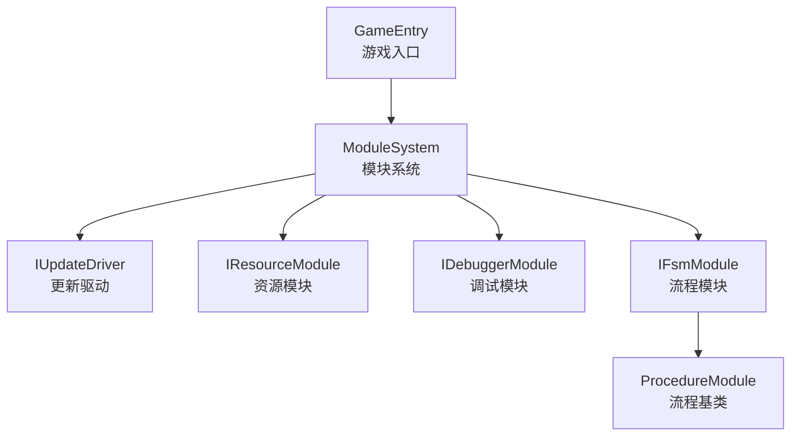
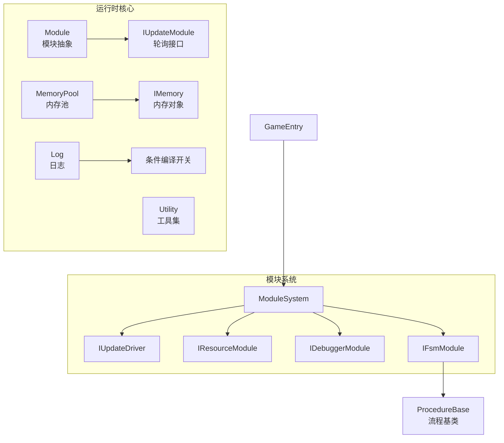
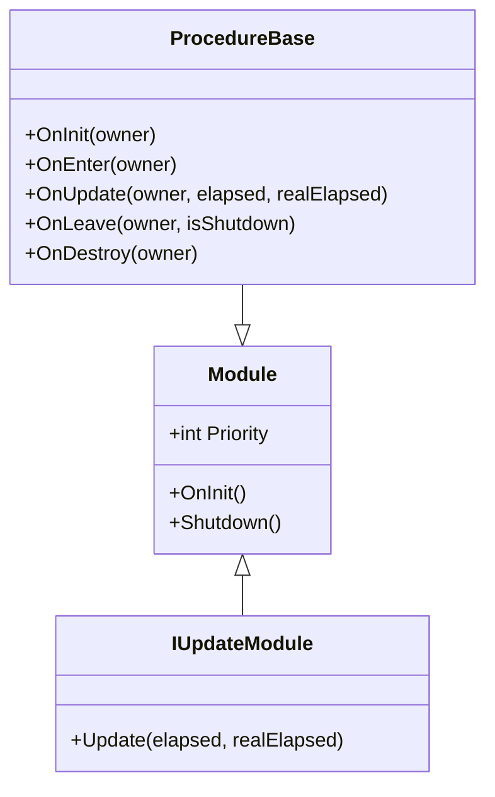
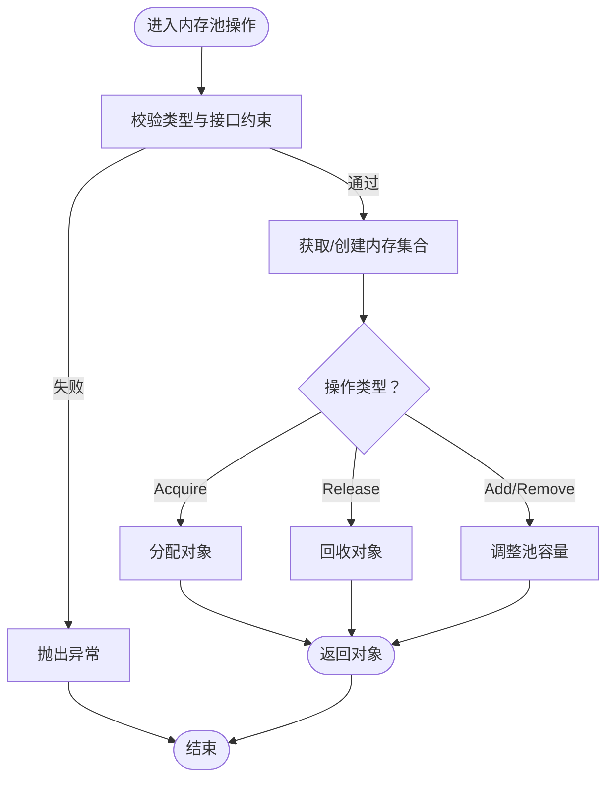
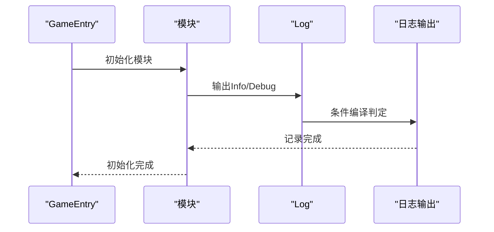
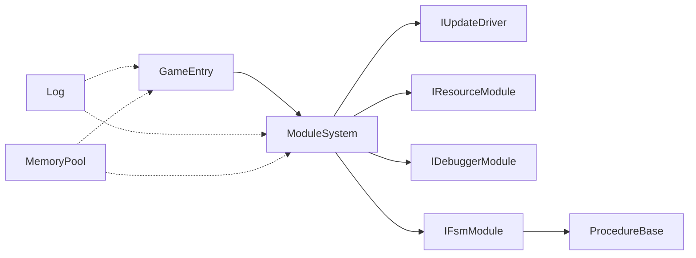

# 性能最佳实践

<cite>
**本文引用的文件**
- [GameEntry.cs](file://Assets/GameScripts/GameEntry.cs)
- [Module.cs](file://Assets/TEngine/Runtime/Core/Module.cs)
- [MemoryPool.cs](file://Assets/TEngine/Runtime/Core/MemoryPool/MemoryPool.cs)
- [ProcedureBase.cs](file://Assets/TEngine/Runtime/Module/ProcedureModule/ProcedureBase.cs)
- [Log.cs](file://Assets/TEngine/Runtime/Core/Log/Log.cs)
- [Utility.cs](file://Assets/TEngine/Runtime/Core/Utility/Utility.cs)
</cite>

## 目录
1. [引言](#引言)
2. [项目结构](#项目结构)
3. [核心组件](#核心组件)
4. [架构总览](#架构总览)
5. [详细组件分析](#详细组件分析)
6. [依赖分析](#依赖分析)
7. [性能考量](#性能考量)
8. [故障排查指南](#故障排查指南)
9. [结论](#结论)
10. [附录](#附录)

## 引言
本文件面向TEngine框架下的性能优化实践，结合仓库现有实现与通用工程化规范，系统性梳理代码编写、资源管理、内存使用、线程安全等方面的最佳实践；并给出常见性能问题（内存泄漏、卡顿、资源加载、UI性能）的排查思路与解决路径；最后提供可落地的优化流程、检查清单与案例研究模板，帮助团队建立可持续的质量保障机制。

## 项目结构
TEngine项目采用“模块化+驱动轮询”的架构组织方式：游戏入口通过模块系统启动各子系统；模块通过统一的更新驱动参与主循环；资源与日志等基础设施由框架层提供；热更逻辑位于独立脚本域，便于快速迭代与回滚。

图示来源
- [GameEntry.cs:6-14](file://Assets/GameScripts/GameEntry.cs#L6-L14)
- [Module.cs:8-39](file://Assets/TEngine/Runtime/Core/Module.cs#L8-L39)
- [ProcedureBase.cs:8-56](file://Assets/TEngine/Runtime/Module/ProcedureModule/ProcedureBase.cs#L8-L56)

章节来源
- [GameEntry.cs:1-15](file://Assets/GameScripts/GameEntry.cs#L1-L15)
- [Module.cs:1-40](file://Assets/TEngine/Runtime/Core/Module.cs#L1-L40)
- [ProcedureBase.cs:1-59](file://Assets/TEngine/Runtime/Module/ProcedureModule/ProcedureBase.cs#L1-L59)

## 核心组件
- 模块接口与抽象：定义统一的轮询与生命周期接口，确保模块按优先级有序执行与释放。
- 更新驱动：作为主循环的承载者，驱动各模块在每帧/每逻辑步长内完成工作。
- 内存池：集中化管理对象分配与回收，降低GC压力与抖动风险。
- 日志系统：基于条件编译的日志开关，避免生产环境冗余输出带来的性能损耗。
- 工具集：提供通用辅助能力，支撑性能测量与诊断。

章节来源
- [Module.cs:8-39](file://Assets/TEngine/Runtime/Core/Module.cs#L8-L39)
- [MemoryPool.cs:9-205](file://Assets/TEngine/Runtime/Core/MemoryPool/MemoryPool.cs#L9-L205)
- [Log.cs:8-800](file://Assets/TEngine/Runtime/Core/Log/Log.cs#L8-L800)
- [Utility.cs:6-9](file://Assets/TEngine/Runtime/Core/Utility/Utility.cs#L6-L9)

## 架构总览
TEngine通过模块化与驱动式更新实现解耦与可控的性能开销。模块注册到模块系统，由更新驱动统一调度；资源模块负责资源生命周期与加载策略；调试模块提供运行期观测手段；日志系统在不同构建配置下控制输出成本。

图示来源
- [Module.cs:8-39](file://Assets/TEngine/Runtime/Core/Module.cs#L8-L39)
- [MemoryPool.cs:9-205](file://Assets/TEngine/Runtime/Core/MemoryPool/MemoryPool.cs#L9-L205)
- [Log.cs:8-800](file://Assets/TEngine/Runtime/Core/Log/Log.cs#L8-L800)
- [GameEntry.cs:6-14](file://Assets/GameScripts/GameEntry.cs#L6-L14)
- [ProcedureBase.cs:8-56](file://Assets/TEngine/Runtime/Module/ProcedureModule/ProcedureBase.cs#L8-L56)

## 详细组件分析

### 模块与更新驱动
- 设计要点
  - 模块实现统一的轮询接口，按优先级参与主循环，避免在模块内部自行创建额外线程。
  - 更新驱动承担帧驱动职责，模块应尽量将耗时任务拆分为多帧增量处理。
- 性能建议
  - 将重任务切片化，避免单帧长时间占用CPU。
  - 使用事件/状态机减少不必要的轮询频率。
  - 在模块关闭时确保资源回收与订阅解除，防止隐式引用导致泄漏。

图示来源
- [Module.cs:8-39](file://Assets/TEngine/Runtime/Core/Module.cs#L8-L39)
- [ProcedureBase.cs:8-56](file://Assets/TEngine/Runtime/Module/ProcedureModule/ProcedureBase.cs#L8-L56)

章节来源
- [Module.cs:1-40](file://Assets/TEngine/Runtime/Core/Module.cs#L1-L40)
- [ProcedureBase.cs:1-59](file://Assets/TEngine/Runtime/Module/ProcedureModule/ProcedureBase.cs#L1-L59)

### 内存池
- 设计要点
  - 统一的对象分配与回收，支持批量追加/移除，减少频繁new与GC。
  - 提供严格校验开关，便于在开发阶段发现误用。
- 性能建议
  - 明确对象生命周期，避免跨作用域持有已释放对象。
  - 对热点路径上的临时对象优先使用内存池，减少短生命周期对象的分配。
  - 定期统计内存池指标，识别异常增长趋势。

图示来源
- [MemoryPool.cs:9-205](file://Assets/TEngine/Runtime/Core/MemoryPool/MemoryPool.cs#L9-L205)

章节来源
- [MemoryPool.cs:1-208](file://Assets/TEngine/Runtime/Core/MemoryPool/MemoryPool.cs#L1-L208)

### 日志与诊断
- 设计要点
  - 基于条件编译的日志开关，生产构建默认关闭高成本日志。
  - 提供多级日志接口，便于区分调试与运行期信息。
- 性能建议
  - 生产版本禁用Debug/Info过多输出，必要时仅保留关键路径日志。
  - 使用结构化日志字段，避免字符串拼接带来的额外开销。
  - 结合调试模块进行采样观测，定位热点与瓶颈。

图示来源
- [Log.cs:8-800](file://Assets/TEngine/Runtime/Core/Log/Log.cs#L8-L800)
- [GameEntry.cs:6-14](file://Assets/GameScripts/GameEntry.cs#L6-L14)

章节来源
- [Log.cs:1-800](file://Assets/TEngine/Runtime/Core/Log/Log.cs#L1-L800)
- [Utility.cs:1-9](file://Assets/TEngine/Runtime/Core/Utility/Utility.cs#L1-L9)

## 依赖分析
- 模块系统依赖更新驱动与资源模块，流程模块依赖FSM与模块系统。
- 日志系统与工具集为横切关注点，被各模块间接使用。
- 内存池作为基础设施，被高频对象创建路径依赖。

图示来源
- [GameEntry.cs:6-14](file://Assets/GameScripts/GameEntry.cs#L6-L14)
- [Module.cs:8-39](file://Assets/TEngine/Runtime/Core/Module.cs#L8-L39)
- [ProcedureBase.cs:8-56](file://Assets/TEngine/Runtime/Module/ProcedureModule/ProcedureBase.cs#L8-L56)
- [MemoryPool.cs:9-205](file://Assets/TEngine/Runtime/Core/MemoryPool/MemoryPool.cs#L9-L205)
- [Log.cs:8-800](file://Assets/TEngine/Runtime/Core/Log/Log.cs#L8-L800)

章节来源
- [GameEntry.cs:1-15](file://Assets/GameScripts/GameEntry.cs#L1-L15)
- [Module.cs:1-40](file://Assets/TEngine/Runtime/Core/Module.cs#L1-L40)
- [ProcedureBase.cs:1-59](file://Assets/TEngine/Runtime/Module/ProcedureModule/ProcedureBase.cs#L1-L59)
- [MemoryPool.cs:1-208](file://Assets/TEngine/Runtime/Core/MemoryPool/MemoryPool.cs#L1-L208)
- [Log.cs:1-800](file://Assets/TEngine/Runtime/Core/Log/Log.cs#L1-L800)

## 性能考量
- 代码编写规范
  - 避免在模块轮询中执行阻塞或高延迟操作；将长任务切片化。
  - 使用事件/状态机替代轮询，降低无效计算。
  - 控制字符串拼接与临时对象创建，优先使用缓冲与格式化工具。
- 资源管理规范
  - 采用异步加载与分批加载策略，避免首屏卡顿。
  - 对大资源进行懒加载与按需卸载，及时释放不再使用的资源。
  - 利用资源池与对象池复用，减少频繁分配。
- 内存使用规范
  - 热点路径使用内存池，明确对象生命周期，避免跨作用域持有。
  - 开启严格校验以尽早暴露误用，上线前关闭严格校验以降低成本。
  - 定期巡检内存池指标，识别异常增长。
- 线程安全规范
  - 模块轮询在主线程执行，避免跨线程共享可变状态。
  - 如需多线程处理，使用无锁队列或主线程调度器回传结果。
- 日志与诊断
  - 生产构建禁用高成本日志；仅保留关键路径日志。
  - 使用采样与阈值告警，避免日志风暴影响性能。

## 故障排查指南
- 内存泄漏检测与修复
  - 步骤
    - 启用严格校验，定位非法类型或重复释放。
    - 使用内存池指标观察“正在使用数”与“获取/释放次数”是否平衡。
    - 通过引用链分析工具定位未释放对象的持有者。
  - 修复要点
    - 明确生命周期边界，确保释放路径可达。
    - 避免循环引用与静态缓存长期持有对象。
- 卡顿问题排查
  - 步骤
    - 使用帧时间采样，识别帧间抖动峰值。
    - 分析模块轮询耗时，定位超时任务。
    - 检查资源加载与UI刷新是否集中在同一帧。
  - 修复要点
    - 将长任务切片化，分散到多帧执行。
    - 采用异步加载与预加载策略，平滑资源消耗。
- 资源加载优化
  - 步骤
    - 统计加载耗时与并发度，避免过度并发导致抖动。
    - 分析资源包粒度，合并小资源，减少包体数量。
  - 修复要点
    - 使用流式加载与渐进式显示，改善感知性能。
- UI性能优化
  - 步骤
    - 检查UI刷新频率与重绘区域，避免无效刷新。
    - 优化UI组件层级与渲染批次。
  - 修复要点
    - 使用UI对象池与延迟创建，减少瞬时峰值。

章节来源
- [MemoryPool.cs:164-185](file://Assets/TEngine/Runtime/Core/MemoryPool/MemoryPool.cs#L164-L185)
- [MemoryPool.cs:33-48](file://Assets/TEngine/Runtime/Core/MemoryPool/MemoryPool.cs#L33-L48)
- [Log.cs:15-310](file://Assets/TEngine/Runtime/Core/Log/Log.cs#L15-L310)

## 结论
TEngine通过模块化与驱动式更新实现了清晰的性能边界与可控的成本。结合内存池、日志与流程模块等基础设施，团队可在开发阶段即建立完善的性能基线，并通过严格的流程与检查清单持续优化。建议将性能审查纳入常规迭代流程，形成“发现问题—制定方案—验证效果—固化规范”的闭环。

## 附录
- 性能优化实施流程与检查清单
  - 审查要点
    - 模块轮询是否存在长任务；是否已切片化。
    - 是否存在未释放对象或循环引用。
    - 资源加载是否异步与分批；是否存在集中加载。
    - 日志级别与输出量是否符合生产要求。
  - 优化优先级排序
    - 高优先：卡顿与掉帧明显的问题；内存泄漏。
    - 中优先：资源加载慢；UI刷新频繁。
    - 低优先：冗余日志与小范围性能损耗。
  - 效果验证方法
    - 帧时间、GC次数与内存峰值等指标对比。
    - A/B测试或灰度发布验证用户感知改善。
- 案例研究与效果对比（模板）
  - 优化背景：描述问题现象与影响范围。
  - 优化策略：选择的优化手段与理由。
  - 实施过程：关键步骤与注意事项。
  - 效果对比：优化前后指标对比与收益评估。
  - 团队协作规范
    - 性能审查会议制度与责任人分工。
    - 知识分享机制：定期复盘与文档沉淀。
    - 工具与自动化：CI集成性能回归检测。