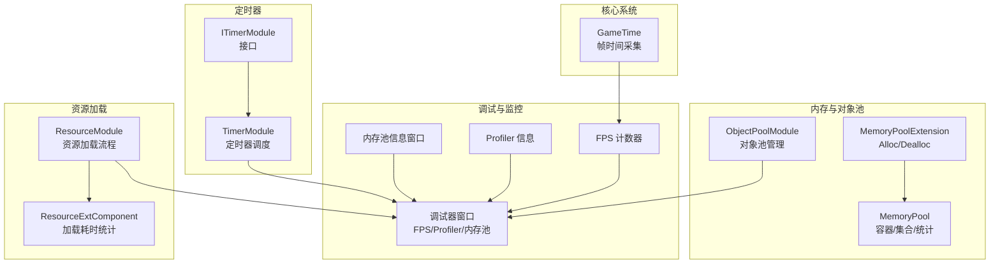
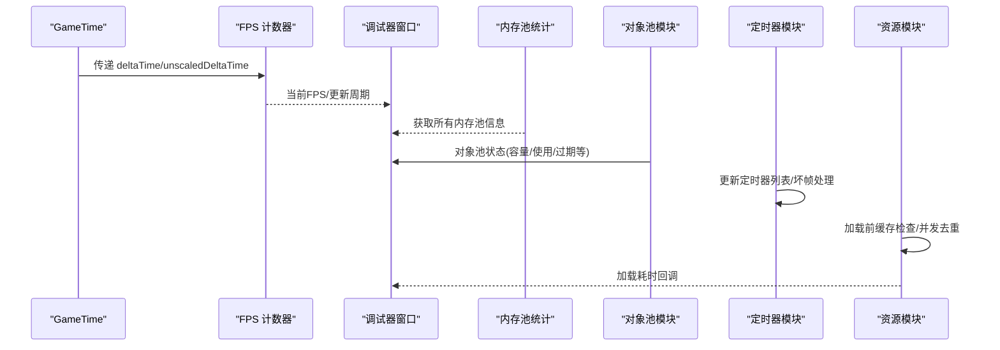
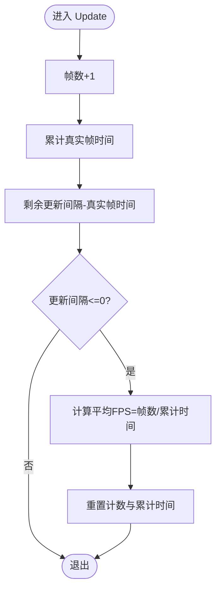
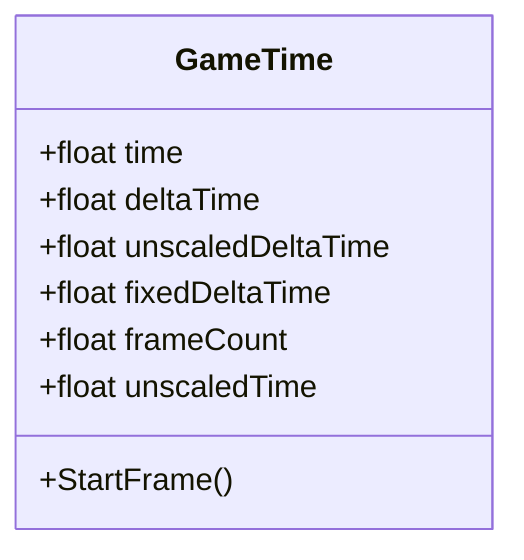
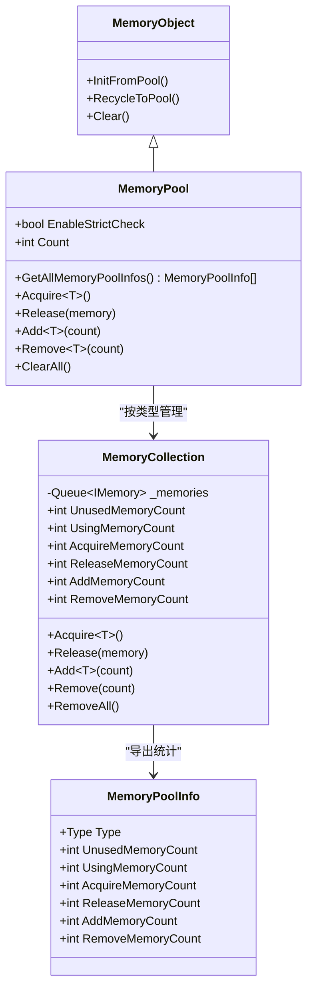
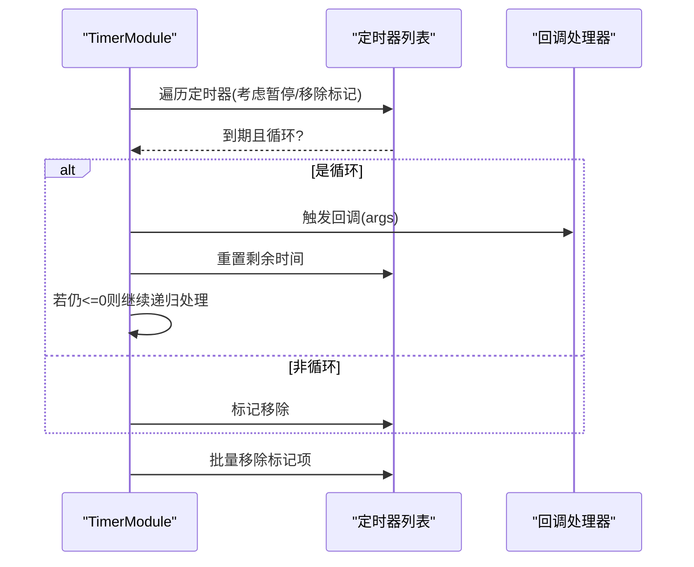
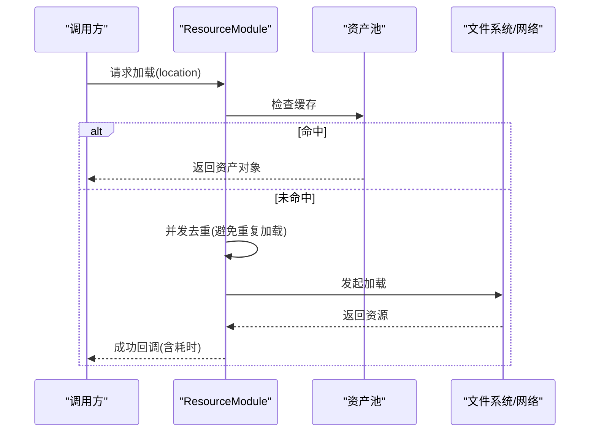
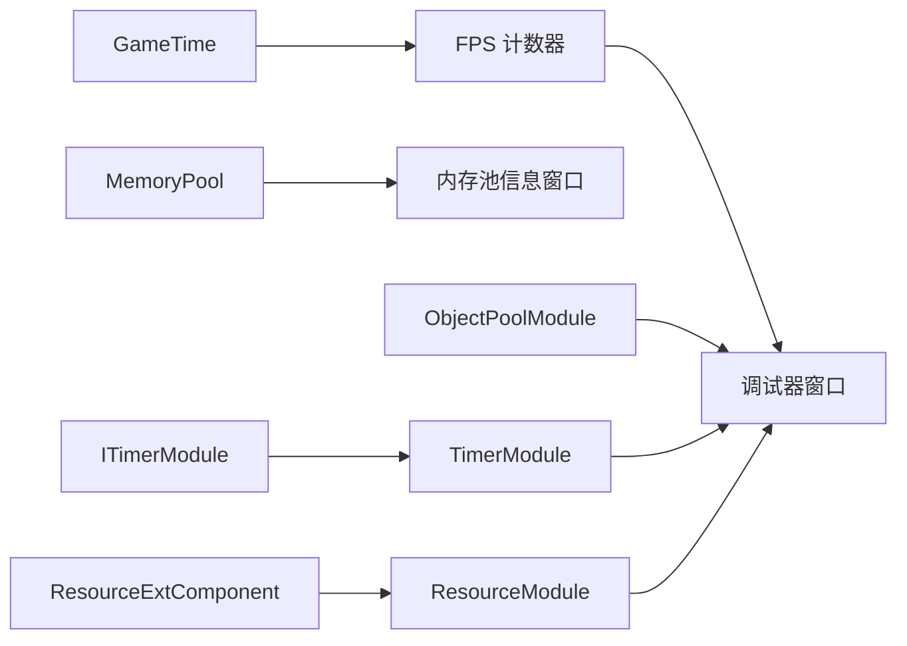

# 性能指标分析

<cite>
**本文引用的文件**
- [GameTime.cs](file://Assets/TEngine/Runtime/Core/GameTime/GameTime.cs)
- [DebuggerComponent.FpsCounter.cs](file://Assets/TEngine/Runtime/Module/DebugerModule/DebuggerComponent.FpsCounter.cs)
- [DebuggerModule.ProfilerInformationWindow.cs](file://Assets/TEngine/Runtime/Module/DebugerModule/Component/DebuggerModule.ProfilerInformationWindow.cs)
- [DebuggerModule.MemoryPoolInformationWindow.cs](file://Assets/TEngine/Runtime/Module/DebugerModule/Component/DebuggerModule.MemoryPoolInformationWindow.cs)
- [MemoryPool.cs](file://Assets/TEngine/Runtime/Core/MemoryPool/MemoryPool.cs)
- [MemoryPool.MemoryCollection.cs](file://Assets/TEngine/Runtime/Core/MemoryPool/MemoryPool.MemoryCollection.cs)
- [MemoryPoolInfo.cs](file://Assets/TEngine/Runtime/Core/MemoryPool/MemoryPoolInfo.cs)
- [MemoryPoolExtension.cs](file://Assets/TEngine/Runtime/Core/MemoryPool/MemoryPoolExtension.cs)
- [ObjectPoolModule.cs](file://Assets/TEngine/Runtime/Module/ObjectPoolModule/ObjectPoolModule.cs)
- [TimerModule.cs](file://Assets/TEngine/Runtime/Module/TimerModule/TimerModule.cs)
- [ITimerModule.cs](file://Assets/TEngine/Runtime/Module/TimerModule/ITimerModule.cs)
- [ResourceModule.cs](file://Assets/TEngine/Runtime/Module/ResourceModule/ResourceModule.cs)
- [ResourceExtComponent.Resource.cs](file://Assets/TEngine/Runtime/Module/ResourceModule/Extension/ResourceExtComponent.Resource.cs)
</cite>

## 目录
1. [引言](#引言)
2. [项目结构](#项目结构)
3. [核心组件](#核心组件)
4. [架构总览](#架构总览)
5. [详细组件分析](#详细组件分析)
6. [依赖关系分析](#依赖关系分析)
7. [性能考量](#性能考量)
8. [故障排查指南](#故障排查指南)
9. [结论](#结论)
10. [附录](#附录)

## 引言
本技术文档围绕 TEngine 的性能指标分析系统展开，聚焦以下关键能力与实现：
- 帧率采集与统计：基于帧时间与累计帧数的 FPS 计算与波动分析
- 时间系统 GameTime 的性能监控：帧时间、非缩放时间、固定时间步长的采集与使用
- 内存池与对象池的性能优化：分配统计、回收与复用、GC 压力缓解
- 定时器模块的性能监控：执行效率、延迟统计、超时检测与坏帧处理
- 资源加载性能分析：加载耗时、并发控制、缓存命中与去重
- 数据处理与可视化：调试器窗口展示、历史数据存储与趋势分析、性能告警建议

## 项目结构
TEngine 将性能相关能力分布在多个模块与核心子系统中：
- 核心时间系统：GameTime 提供统一的帧时间采集入口
- 调试器模块：FPS 计数器、Profiler 信息、内存池信息等可视化窗口
- 内存池系统：内存池容器、集合统计、扩展分配/回收
- 对象池模块：对象池生命周期与更新
- 定时器模块：定时器调度、循环调用与坏帧处理
- 资源模块：资源加载流程、耗时统计与并发控制

图表来源
- [GameTime.cs:9-54](file://Assets/TEngine/Runtime/Core/GameTime/GameTime.cs#L9-L54)
- [DebuggerComponent.FpsCounter.cs:5-66](file://Assets/TEngine/Runtime/Module/DebugerModule/DebuggerComponent.FpsCounter.cs#L5-L66)
- [DebuggerModule.ProfilerInformationWindow.cs:10-57](file://Assets/TEngine/Runtime/Module/DebugerModule/Component/DebuggerModule.ProfilerInformationWindow.cs#L10-L57)
- [DebuggerModule.MemoryPoolInformationWindow.cs:9-106](file://Assets/TEngine/Runtime/Module/DebugerModule/Component/DebuggerModule.MemoryPoolInformationWindow.cs#L9-L106)
- [MemoryPool.cs:9-207](file://Assets/TEngine/Runtime/Core/MemoryPool/MemoryPool.cs#L9-L207)
- [MemoryPoolExtension.cs:28-56](file://Assets/TEngine/Runtime/Core/MemoryPool/MemoryPoolExtension.cs#L28-L56)
- [ObjectPoolModule.cs:9-70](file://Assets/TEngine/Runtime/Module/ObjectPoolModule/ObjectPoolModule.cs#L9-L70)
- [TimerModule.cs:8-478](file://Assets/TEngine/Runtime/Module/TimerModule/TimerModule.cs#L8-L478)
- [ITimerModule.cs:3-65](file://Assets/TEngine/Runtime/Module/TimerModule/ITimerModule.cs#L3-L65)
- [ResourceModule.cs:224-1073](file://Assets/TEngine/Runtime/Module/ResourceModule/ResourceModule.cs#L224-L1073)
- [ResourceExtComponent.Resource.cs:102-138](file://Assets/TEngine/Runtime/Module/ResourceModule/Extension/ResourceExtComponent.Resource.cs#L102-L138)

章节来源
- [GameTime.cs:9-54](file://Assets/TEngine/Runtime/Core/GameTime/GameTime.cs#L9-L54)
- [DebuggerComponent.FpsCounter.cs:5-66](file://Assets/TEngine/Runtime/Module/DebugerModule/DebuggerComponent.FpsCounter.cs#L5-L66)
- [DebuggerModule.ProfilerInformationWindow.cs:10-57](file://Assets/TEngine/Runtime/Module/DebugerModule/Component/DebuggerModule.ProfilerInformationWindow.cs#L10-L57)
- [DebuggerModule.MemoryPoolInformationWindow.cs:9-106](file://Assets/TEngine/Runtime/Module/DebugerModule/Component/DebuggerModule.MemoryPoolInformationWindow.cs#L9-L106)
- [MemoryPool.cs:9-207](file://Assets/TEngine/Runtime/Core/MemoryPool/MemoryPool.cs#L9-L207)
- [MemoryPoolExtension.cs:28-56](file://Assets/TEngine/Runtime/Core/MemoryPool/MemoryPoolExtension.cs#L28-L56)
- [ObjectPoolModule.cs:9-70](file://Assets/TEngine/Runtime/Module/ObjectPoolModule/ObjectPoolModule.cs#L9-L70)
- [TimerModule.cs:8-478](file://Assets/TEngine/Runtime/Module/TimerModule/TimerModule.cs#L8-L478)
- [ITimerModule.cs:3-65](file://Assets/TEngine/Runtime/Module/TimerModule/ITimerModule.cs#L3-L65)
- [ResourceModule.cs:224-1073](file://Assets/TEngine/Runtime/Module/ResourceModule/ResourceModule.cs#L224-L1073)
- [ResourceExtComponent.Resource.cs:102-138](file://Assets/TEngine/Runtime/Module/ResourceModule/Extension/ResourceExtComponent.Resource.cs#L102-L138)

## 核心组件
- 帧率与时间系统
  - GameTime 提供 time、deltaTime、unscaledDeltaTime、fixedDeltaTime、frameCount、unscaledTime 等字段，作为统一的帧时间采集入口
  - FPS 计数器通过累计帧数与累计时间间隔计算当前 FPS，并支持可配置更新周期
- 内存池与对象池
  - MemoryPool 提供按类型分组的内存池集合，记录获取/释放/新增/移除次数与使用/空闲数量
  - MemoryPoolExtension 提供 Alloc/Dealloc 快捷方法，封装初始化与回收流程
  - ObjectPoolModule 维护对象池集合，统一 Update 生命周期
- 定时器模块
  - TimerModule 支持缩放/非缩放两种时间轴，维护两个定时器列表；支持循环定时器与坏帧场景下的连续回调
- 资源加载性能
  - ResourceModule 在加载前进行缓存检查与并发去重，加载完成后统计耗时并回调
  - ResourceExtComponent.Resource 在缓存命中与异步等待阶段进行耗时统计

章节来源
- [GameTime.cs:9-54](file://Assets/TEngine/Runtime/Core/GameTime/GameTime.cs#L9-L54)
- [DebuggerComponent.FpsCounter.cs:5-66](file://Assets/TEngine/Runtime/Module/DebugerModule/DebuggerComponent.FpsCounter.cs#L5-L66)
- [MemoryPool.cs:33-47](file://Assets/TEngine/Runtime/Core/MemoryPool/MemoryPool.cs#L33-L47)
- [MemoryPoolExtension.cs:35-55](file://Assets/TEngine/Runtime/Core/MemoryPool/MemoryPoolExtension.cs#L35-L55)
- [ObjectPoolModule.cs:35-41](file://Assets/TEngine/Runtime/Module/ObjectPoolModule/ObjectPoolModule.cs#L35-L41)
- [TimerModule.cs:340-434](file://Assets/TEngine/Runtime/Module/TimerModule/TimerModule.cs#L340-L434)
- [ResourceModule.cs:961-968](file://Assets/TEngine/Runtime/Module/ResourceModule/ResourceModule.cs#L961-L968)
- [ResourceExtComponent.Resource.cs:102-138](file://Assets/TEngine/Runtime/Module/ResourceModule/Extension/ResourceExtComponent.Resource.cs#L102-L138)

## 架构总览
下图展示了性能指标采集与分析的关键路径：从 GameTime 采集帧时间，到 FPS 计数器统计，再到调试器窗口展示；同时内存池与对象池的统计信息通过调试器窗口呈现；定时器模块负责周期性任务与坏帧处理；资源模块负责加载耗时统计。

图表来源
- [GameTime.cs:45-53](file://Assets/TEngine/Runtime/Core/GameTime/GameTime.cs#L45-L53)
- [DebuggerComponent.FpsCounter.cs:43-56](file://Assets/TEngine/Runtime/Module/DebugerModule/DebuggerComponent.FpsCounter.cs#L43-L56)
- [DebuggerModule.MemoryPoolInformationWindow.cs:32-44](file://Assets/TEngine/Runtime/Module/DebugerModule/Component/DebuggerModule.MemoryPoolInformationWindow.cs#L32-L44)
- [ObjectPoolModule.cs:35-41](file://Assets/TEngine/Runtime/Module/ObjectPoolModule/ObjectPoolModule.cs#L35-L41)
- [TimerModule.cs:472-476](file://Assets/TEngine/Runtime/Module/TimerModule/TimerModule.cs#L472-L476)
- [ResourceModule.cs:961-968](file://Assets/TEngine/Runtime/Module/ResourceModule/ResourceModule.cs#L961-L968)

## 详细组件分析

### 帧率计算与波动分析
- 实现要点
  - FPS 计数器以固定更新周期累加帧数与时间，周期结束时计算平均帧率
  - 支持动态调整更新周期，避免频繁刷新带来的额外开销
- 性能意义
  - 用于实时监控帧率稳定性，结合波动阈值可触发性能告警
  - 可与 GameTime 的 deltaTime/unscaledDeltaTime 结合，区分缩放与非缩放帧时间对帧率的影响

图表来源
- [DebuggerComponent.FpsCounter.cs:43-56](file://Assets/TEngine/Runtime/Module/DebugerModule/DebuggerComponent.FpsCounter.cs#L43-L56)

章节来源
- [DebuggerComponent.FpsCounter.cs:5-66](file://Assets/TEngine/Runtime/Module/DebugerModule/DebuggerComponent.FpsCounter.cs#L5-L66)

### GameTime 时间系统与帧时间监控
- 实现要点
  - GameTime.StartFrame() 采集 time、deltaTime、unscaledDeltaTime、fixedDeltaTime、frameCount、unscaledTime
  - 作为统一入口，供 FPS 计数器、定时器、资源加载等模块使用
- 性能意义
  - 区分缩放与非缩放时间，便于在暂停/慢放等场景下进行准确的性能度量
  - 固定时间步长用于物理/固定频率更新，有助于稳定性能分析

图表来源
- [GameTime.cs:9-54](file://Assets/TEngine/Runtime/Core/GameTime/GameTime.cs#L9-L54)

章节来源
- [GameTime.cs:9-54](file://Assets/TEngine/Runtime/Core/GameTime/GameTime.cs#L9-L54)

### 内存池与对象池的性能优化效果
- 内存池统计维度
  - 未使用数量、正在使用数量、获取次数、释放次数、新增次数、移除次数
  - 通过 MemoryPool.GetAllMemoryPoolInfos() 汇总各类型内存池状态
- 对象池状态
  - 容量、已使用数量、可释放数量、过期时间、优先级等
- 性能意义
  - 降低 GC 压力：减少临时对象分配与销毁
  - 提升对象复用率：通过统计指标评估复用效果，指导预热与容量规划

图表来源
- [MemoryPool.cs:9-207](file://Assets/TEngine/Runtime/Core/MemoryPool/MemoryPool.cs#L9-L207)
- [MemoryPool.MemoryCollection.cs:11-154](file://Assets/TEngine/Runtime/Core/MemoryPool/MemoryPool.MemoryCollection.cs#L11-L154)
- [MemoryPoolInfo.cs:10-118](file://Assets/TEngine/Runtime/Core/MemoryPool/MemoryPoolInfo.cs#L10-L118)
- [MemoryPoolExtension.cs:8-26](file://Assets/TEngine/Runtime/Core/MemoryPool/MemoryPoolExtension.cs#L8-L26)

章节来源
- [MemoryPool.cs:33-47](file://Assets/TEngine/Runtime/Core/MemoryPool/MemoryPool.cs#L33-L47)
- [MemoryPool.MemoryCollection.cs:46-98](file://Assets/TEngine/Runtime/Core/MemoryPool/MemoryPool.MemoryCollection.cs#L46-L98)
- [MemoryPoolInfo.cs:30-116](file://Assets/TEngine/Runtime/Core/MemoryPool/MemoryPoolInfo.cs#L30-L116)
- [MemoryPoolExtension.cs:35-55](file://Assets/TEngine/Runtime/Core/MemoryPool/MemoryPoolExtension.cs#L35-L55)
- [DebuggerModule.MemoryPoolInformationWindow.cs:25-93](file://Assets/TEngine/Runtime/Module/DebugerModule/Component/DebuggerModule.MemoryPoolInformationWindow.cs#L25-L93)

### 定时器模块的性能监控
- 功能特性
  - 支持缩放/非缩放两种时间轴，分别维护独立列表
  - 循环定时器在“坏帧”场景下进行连续回调，避免任务堆积
  - 提供暂停/恢复/重置/移除等控制接口
- 性能意义
  - 通过 UpdateTimer/UpdateUnscaledTimer 的批量处理与延迟回收，降低每帧开销
  - 坏帧处理避免长时间阻塞导致的连锁反应

图表来源
- [TimerModule.cs:340-434](file://Assets/TEngine/Runtime/Module/TimerModule/TimerModule.cs#L340-L434)
- [ITimerModule.cs:14-59](file://Assets/TEngine/Runtime/Module/TimerModule/ITimerModule.cs#L14-L59)

章节来源
- [TimerModule.cs:340-434](file://Assets/TEngine/Runtime/Module/TimerModule/TimerModule.cs#L340-L434)
- [ITimerModule.cs:14-59](file://Assets/TEngine/Runtime/Module/TimerModule/ITimerModule.cs#L14-L59)

### 资源加载性能分析
- 流程要点
  - 缓存命中直接返回，避免 IO 与解析开销
  - 并发加载去重，防止重复 IO
  - 加载完成统计耗时并通过回调上报
- 性能意义
  - 通过缓存命中率与平均加载耗时评估资源策略
  - 与 FPS/内存池统计联动，定位加载高峰对帧率与内存的影响

图表来源
- [ResourceModule.cs:961-968](file://Assets/TEngine/Runtime/Module/ResourceModule/ResourceModule.cs#L961-L968)
- [ResourceExtComponent.Resource.cs:102-138](file://Assets/TEngine/Runtime/Module/ResourceModule/Extension/ResourceExtComponent.Resource.cs#L102-L138)

章节来源
- [ResourceModule.cs:961-968](file://Assets/TEngine/Runtime/Module/ResourceModule/ResourceModule.cs#L961-L968)
- [ResourceExtComponent.Resource.cs:102-138](file://Assets/TEngine/Runtime/Module/ResourceModule/Extension/ResourceExtComponent.Resource.cs#L102-L138)

## 依赖关系分析
- 组件耦合
  - FPS 计数器依赖 GameTime 的帧时间
  - 调试器窗口依赖内存池统计与对象池状态
  - 定时器模块与对象池模块均实现 IUpdateModule，参与统一更新循环
  - 资源模块与扩展组件共同完成加载耗时统计
- 外部依赖
  - Unity Time API（Time.time/deltaTime 等）
  - Unity Profiler API（用于内存与堆栈统计）

图表来源
- [GameTime.cs:45-53](file://Assets/TEngine/Runtime/Core/GameTime/GameTime.cs#L45-L53)
- [DebuggerComponent.FpsCounter.cs:43-56](file://Assets/TEngine/Runtime/Module/DebugerModule/DebuggerComponent.FpsCounter.cs#L43-L56)
- [DebuggerModule.MemoryPoolInformationWindow.cs:32-44](file://Assets/TEngine/Runtime/Module/DebugerModule/Component/DebuggerModule.MemoryPoolInformationWindow.cs#L32-L44)
- [ObjectPoolModule.cs:35-41](file://Assets/TEngine/Runtime/Module/ObjectPoolModule/ObjectPoolModule.cs#L35-L41)
- [TimerModule.cs:472-476](file://Assets/TEngine/Runtime/Module/TimerModule/TimerModule.cs#L472-L476)
- [ResourceModule.cs:961-968](file://Assets/TEngine/Runtime/Module/ResourceModule/ResourceModule.cs#L961-L968)
- [ResourceExtComponent.Resource.cs:102-138](file://Assets/TEngine/Runtime/Module/ResourceModule/Extension/ResourceExtComponent.Resource.cs#L102-L138)

章节来源
- [GameTime.cs:45-53](file://Assets/TEngine/Runtime/Core/GameTime/GameTime.cs#L45-L53)
- [DebuggerComponent.FpsCounter.cs:43-56](file://Assets/TEngine/Runtime/Module/DebugerModule/DebuggerComponent.FpsCounter.cs#L43-L56)
- [DebuggerModule.MemoryPoolInformationWindow.cs:32-44](file://Assets/TEngine/Runtime/Module/DebugerModule/Component/DebuggerModule.MemoryPoolInformationWindow.cs#L32-L44)
- [ObjectPoolModule.cs:35-41](file://Assets/TEngine/Runtime/Module/ObjectPoolModule/ObjectPoolModule.cs#L35-L41)
- [TimerModule.cs:472-476](file://Assets/TEngine/Runtime/Module/TimerModule/TimerModule.cs#L472-L476)
- [ResourceModule.cs:961-968](file://Assets/TEngine/Runtime/Module/ResourceModule/ResourceModule.cs#L961-L968)
- [ResourceExtComponent.Resource.cs:102-138](file://Assets/TEngine/Runtime/Module/ResourceModule/Extension/ResourceExtComponent.Resource.cs#L102-L138)

## 性能考量
- 帧率与时间
  - 使用 GameTime 的 unscaledDeltaTime 进行与时间缩放无关的性能度量
  - 结合 FPS 计数器的更新周期，平衡精度与开销
- 内存与GC
  - 通过 MemoryPool 统计获取/释放次数与新增/移除数量，评估复用效果
  - 启用严格检查可提前发现异常回收问题
- 定时器
  - 合理设置循环定时器间隔，避免在坏帧场景下过度回调
  - 使用非缩放时间轴处理不受暂停影响的任务
- 资源加载
  - 优先提升缓存命中率，减少并发加载
  - 对热点资源进行预热，降低首帧加载抖动

## 故障排查指南
- FPS 波动大
  - 检查是否存在大量循环定时器在坏帧场景下连续触发
  - 对比缩放与非缩放帧时间，确认是否存在时间缩放导致的误判
- 内存增长异常
  - 查看内存池统计中新增/移除次数与使用峰值，定位泄漏点
  - 开启严格检查捕获重复释放
- 定时器延迟/超时
  - 检查定时器列表长度与到期频率，必要时拆分任务或调整间隔
  - 使用非缩放时间轴处理关键任务
- 加载卡顿
  - 关注资源模块回调中的耗时分布，识别大资源或网络瓶颈
  - 检查并发去重是否生效，避免重复加载

章节来源
- [DebuggerComponent.FpsCounter.cs:43-56](file://Assets/TEngine/Runtime/Module/DebugerModule/DebuggerComponent.FpsCounter.cs#L43-L56)
- [MemoryPool.cs:164-185](file://Assets/TEngine/Runtime/Core/MemoryPool/MemoryPool.cs#L164-L185)
- [TimerModule.cs:286-311](file://Assets/TEngine/Runtime/Module/TimerModule/TimerModule.cs#L286-L311)
- [ResourceModule.cs:961-968](file://Assets/TEngine/Runtime/Module/ResourceModule/ResourceModule.cs#L961-L968)

## 结论
TEngine 的性能指标分析体系以 GameTime 为核心时间源，结合 FPS 计数器、内存池/对象池统计、定时器模块与资源加载耗时统计，形成完整的性能观测闭环。通过调试器窗口可视化展示关键指标，并辅以严格检查与坏帧处理机制，能够有效识别性能瓶颈并指导优化策略。

## 附录
- 数据处理与可视化建议
  - 历史数据存储：将 FPS、内存池统计、定时器延迟、资源加载耗时持久化至本地或云端
  - 趋势分析：基于滑动窗口计算移动平均与标准差，识别异常波动
  - 性能告警：设定阈值（如 FPS 下降、内存新增速率突增、加载耗时超限），触发日志与通知
- 最佳实践
  - 预热关键资源与对象池，降低首帧抖动
  - 合理划分定时器任务，避免集中在同一帧
  - 使用非缩放时间轴处理与时间无关的性能监控任务
  - 定期审查内存池统计，优化容量与预热策略