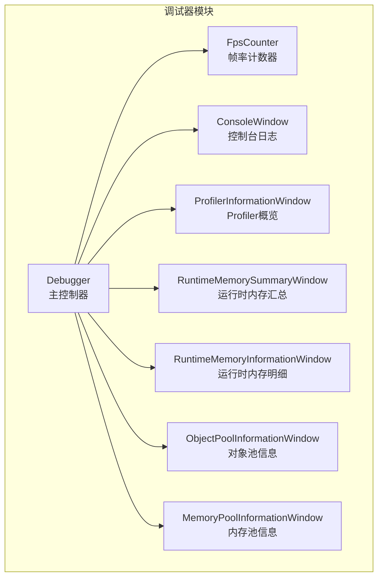
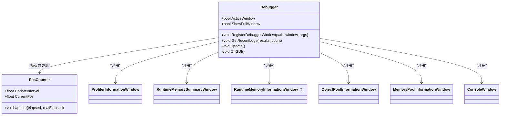
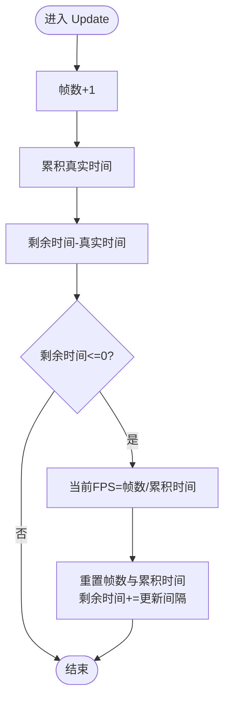
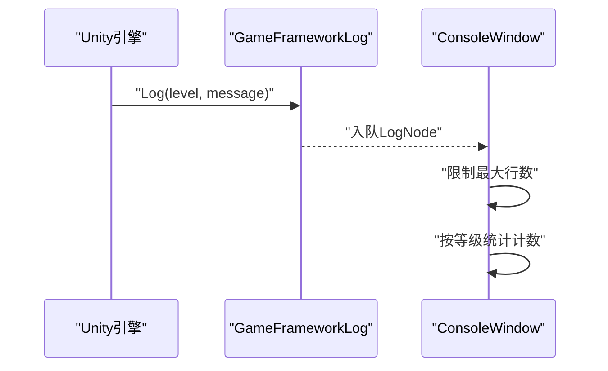
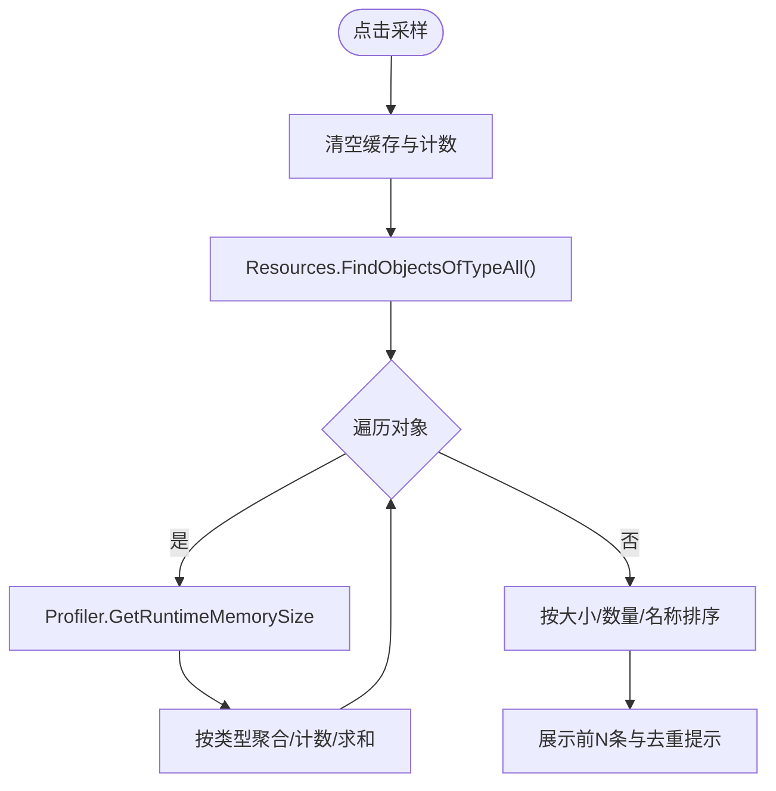
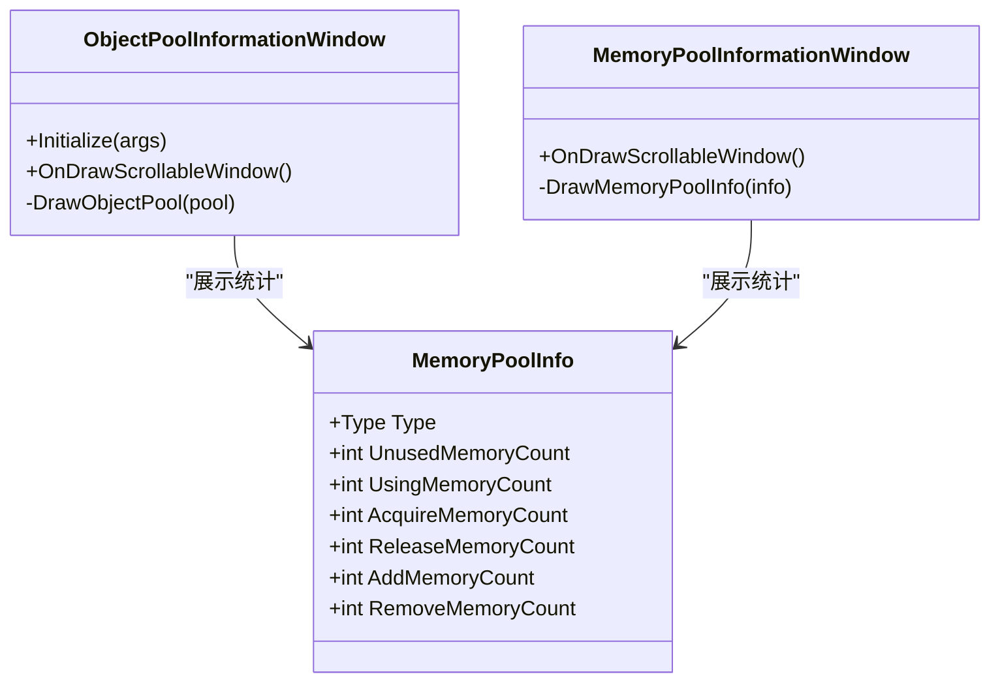
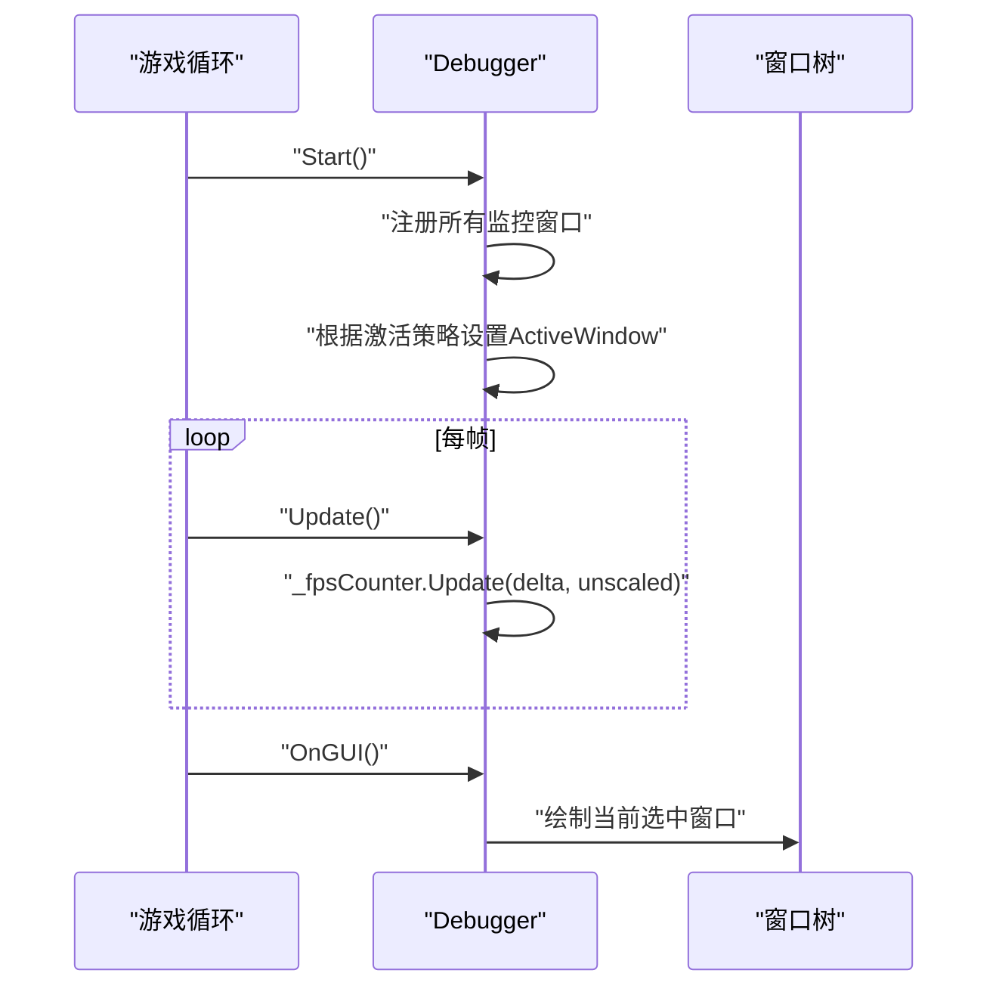
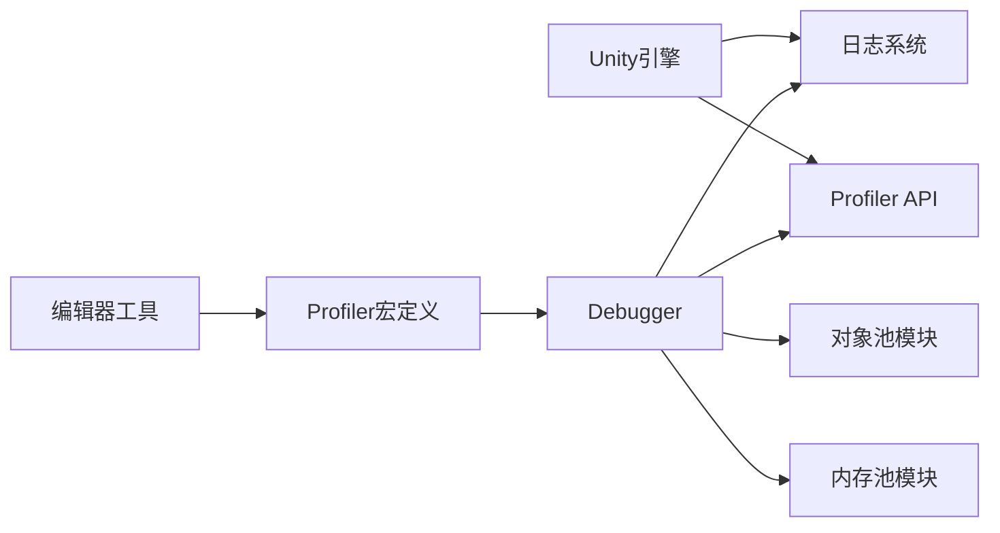

# 性能监控系统

<cite>
**本文档引用的文件**
- [Debugger.cs](file://Assets/TEngine/Runtime/Module/DebugerModule/Debugger.cs)
- [DebuggerComponent.FpsCounter.cs](file://Assets/TEngine/Runtime/Module/DebugerModule/DebuggerComponent.FpsCounter.cs)
- [DebuggerModule.ProfilerInformationWindow.cs](file://Assets/TEngine/Runtime/Module/DebugerModule/Component/DebuggerModule.ProfilerInformationWindow.cs)
- [DebuggerModule.RuntimeMemorySummaryWindow.cs](file://Assets/TEngine/Runtime/Module/DebugerModule/Component/DebuggerModule.RuntimeMemorySummaryWindow.cs)
- [DebuggerModule.RuntimeMemoryInformationWindow.cs](file://Assets/TEngine/Runtime/Module/DebugerModule/Component/DebuggerModule.RuntimeMemoryInformationWindow.cs)
- [ProfilerDefineSymbols.cs](file://Assets/TEngine/Editor/DefineSymbols/ProfilerDefineSymbols.cs)
- [GameFrameworkLog.cs](file://Assets/TEngine/Runtime/Core/Lib/Log/GameFrameworkLog.cs)
- [GameFrameworkLogLevel.cs](file://Assets/TEngine/Runtime/Core/Lib/Log/GameFrameworkLogLevel.cs)
- [DebuggerModule.ObjectPoolInformationWindow.cs](file://Assets/TEngine/Runtime/Module/DebugerModule/Component/DebuggerModule.ObjectPoolInformationWindow.cs)
- [DebuggerModule.MemoryPoolInformationWindow.cs](file://Assets/TEngine/Runtime/Module/DebugerModule/Component/DebuggerModule.MemoryPoolInformationWindow.cs)
- [MemoryPoolInfo.cs](file://Assets/TEngine/Runtime/Core/MemoryPool/MemoryPoolInfo.cs)
- [DebuggerModule.ConsoleWindow.cs](file://Assets/TEngine/Runtime/Module/DebugerModule/Component/DebuggerModule.ConsoleWindow.cs)
</cite>

## 目录
1. [简介](#简介)
2. [项目结构](#项目结构)
3. [核心组件](#核心组件)
4. [架构总览](#架构总览)
5. [详细组件分析](#详细组件分析)
6. [依赖关系分析](#依赖关系分析)
7. [性能考量](#性能考量)
8. [故障排查指南](#故障排查指南)
9. [结论](#结论)
10. [附录](#附录)

## 简介
本技术文档围绕 TEngine 的性能监控系统展开，重点覆盖以下方面：
- 日志系统的分级管理（Debug、Info、Warning、Error、Fatal）
- 性能指标采集机制（帧率、内存、对象池、内存池、Profiler 概览）
- 实时监控面板设计与交互
- 调试器模块的监控能力与使用方式
- 数据采样频率、历史数据保留策略、阈值设置建议
- 配置选项与使用方法（含 Profiler 宏定义开关）
- 最佳实践与常见问题解决方案

## 项目结构
TEngine 将性能监控能力集成在“调试器模块”中，通过统一的 Debugger 组件挂载于场景中，提供可折叠的浮动图标与完整窗口两种模式，并以“窗口树”的形式组织各类监控面板。

图表来源
- [Debugger.cs:11-181](file://Assets/TEngine/Runtime/Module/DebugerModule/Debugger.cs#L11-L181)
- [DebuggerComponent.FpsCounter.cs:5-65](file://Assets/TEngine/Runtime/Module/DebugerModule/DebuggerComponent.FpsCounter.cs#L5-L65)
- [DebuggerModule.ProfilerInformationWindow.cs:10-56](file://Assets/TEngine/Runtime/Module/DebugerModule/Component/DebuggerModule.ProfilerInformationWindow.cs#L10-L56)
- [DebuggerModule.RuntimeMemorySummaryWindow.cs:12-102](file://Assets/TEngine/Runtime/Module/DebugerModule/Component/DebuggerModule.RuntimeMemorySummaryWindow.cs#L12-L102)
- [DebuggerModule.RuntimeMemoryInformationWindow.cs:12-114](file://Assets/TEngine/Runtime/Module/DebugerModule/Component/DebuggerModule.RuntimeMemoryInformationWindow.cs#L12-L114)
- [DebuggerModule.ObjectPoolInformationWindow.cs:8-35](file://Assets/TEngine/Runtime/Module/DebugerModule/Component/DebuggerModule.ObjectPoolInformationWindow.cs#L8-L35)
- [DebuggerModule.MemoryPoolInformationWindow.cs:54-103](file://Assets/TEngine/Runtime/Module/DebugerModule/Component/DebuggerModule.MemoryPoolInformationWindow.cs#L54-L103)

章节来源
- [Debugger.cs:11-181](file://Assets/TEngine/Runtime/Module/DebugerModule/Debugger.cs#L11-L181)

## 核心组件
- 调试器主控：负责窗口注册、布局、激活状态与渲染流程。
- 帧率计数器：按固定更新间隔统计当前帧率。
- 日志系统：支持多级日志输出，配合控制台窗口展示与过滤。
- Profiler 概览：展示 Unity Profiler 支持状态、启用状态、内存指标等。
- 运行时内存：支持对全量对象与指定类型对象进行采样与排序展示。
- 对象池与内存池：展示池化对象的使用情况与统计信息。

章节来源
- [Debugger.cs:11-181](file://Assets/TEngine/Runtime/Module/DebugerModule/Debugger.cs#L11-L181)
- [DebuggerComponent.FpsCounter.cs:5-65](file://Assets/TEngine/Runtime/Module/DebugerModule/DebuggerComponent.FpsCounter.cs#L5-L65)
- [GameFrameworkLog.cs:1-200](file://Assets/TEngine/Runtime/Core/Lib/Log/GameFrameworkLog.cs#L1-L200)
- [GameFrameworkLogLevel.cs:6-32](file://Assets/TEngine/Runtime/Core/Lib/Log/GameFrameworkLogLevel.cs#L6-L32)
- [DebuggerModule.ProfilerInformationWindow.cs:10-56](file://Assets/TEngine/Runtime/Module/DebugerModule/Component/DebuggerModule.ProfilerInformationWindow.cs#L10-L56)
- [DebuggerModule.RuntimeMemorySummaryWindow.cs:12-102](file://Assets/TEngine/Runtime/Module/DebugerModule/Component/DebuggerModule.RuntimeMemorySummaryWindow.cs#L12-L102)
- [DebuggerModule.RuntimeMemoryInformationWindow.cs:12-114](file://Assets/TEngine/Runtime/Module/DebugerModule/Component/DebuggerModule.RuntimeMemoryInformationWindow.cs#L12-L114)
- [DebuggerModule.ObjectPoolInformationWindow.cs:8-35](file://Assets/TEngine/Runtime/Module/DebugerModule/Component/DebuggerModule.ObjectPoolInformationWindow.cs#L8-L35)
- [DebuggerModule.MemoryPoolInformationWindow.cs:54-103](file://Assets/TEngine/Runtime/Module/DebugerModule/Component/DebuggerModule.MemoryPoolInformationWindow.cs#L54-L103)

## 架构总览
调试器采用“主控 + 多窗口面板”的分层架构。主控负责生命周期与窗口树导航；各面板独立负责特定指标的采集与展示。

图表来源
- [Debugger.cs:11-181](file://Assets/TEngine/Runtime/Module/DebugerModule/Debugger.cs#L11-L181)
- [DebuggerComponent.FpsCounter.cs:5-65](file://Assets/TEngine/Runtime/Module/DebugerModule/DebuggerComponent.FpsCounter.cs#L5-L65)
- [DebuggerModule.ProfilerInformationWindow.cs:10-56](file://Assets/TEngine/Runtime/Module/DebugerModule/Component/DebuggerModule.ProfilerInformationWindow.cs#L10-L56)
- [DebuggerModule.RuntimeMemorySummaryWindow.cs:12-102](file://Assets/TEngine/Runtime/Module/DebugerModule/Component/DebuggerModule.RuntimeMemorySummaryWindow.cs#L12-L102)
- [DebuggerModule.RuntimeMemoryInformationWindow.cs:12-114](file://Assets/TEngine/Runtime/Module/DebugerModule/Component/DebuggerModule.RuntimeMemoryInformationWindow.cs#L12-L114)
- [DebuggerModule.ObjectPoolInformationWindow.cs:8-35](file://Assets/TEngine/Runtime/Module/DebugerModule/Component/DebuggerModule.ObjectPoolInformationWindow.cs#L8-L35)
- [DebuggerModule.MemoryPoolInformationWindow.cs:54-103](file://Assets/TEngine/Runtime/Module/DebugerModule/Component/DebuggerModule.MemoryPoolInformationWindow.cs#L54-L103)

## 详细组件分析

### 帧率监控（FpsCounter）
- 更新逻辑：每帧累加真实时间与帧数，当累计时间超过更新间隔时，计算当前帧率并重置计数器。
- 关键点：更新间隔可配置；异常输入会被记录日志并拒绝更新。

图表来源
- [DebuggerComponent.FpsCounter.cs:43-56](file://Assets/TEngine/Runtime/Module/DebugerModule/DebuggerComponent.FpsCounter.cs#L43-L56)

章节来源
- [DebuggerComponent.FpsCounter.cs:5-65](file://Assets/TEngine/Runtime/Module/DebugerModule/DebuggerComponent.FpsCounter.cs#L5-L65)
- [Debugger.cs:237-240](file://Assets/TEngine/Runtime/Module/DebugerModule/Debugger.cs#L237-L240)

### 日志系统与控制台（Console）
- 日志等级：Debug、Info、Warning、Error、Fatal，分别对应不同颜色与优先级。
- 控制台：接收 Unity 日志回调，维护环形队列，限制最大行数，支持按等级计数与高亮。
- 使用建议：开发阶段开启更细粒度日志，发布版本降低到 Info 或 Warning。

图表来源
- [GameFrameworkLog.cs:1-200](file://Assets/TEngine/Runtime/Core/Lib/Log/GameFrameworkLog.cs#L1-L200)
- [GameFrameworkLogLevel.cs:6-32](file://Assets/TEngine/Runtime/Core/Lib/Log/GameFrameworkLogLevel.cs#L6-L32)
- [DebuggerModule.ConsoleWindow.cs:362-380](file://Assets/TEngine/Runtime/Module/DebugerModule/Component/DebuggerModule.ConsoleWindow.cs#L362-L380)

章节来源
- [GameFrameworkLog.cs:1-200](file://Assets/TEngine/Runtime/Core/Lib/Log/GameFrameworkLog.cs#L1-L200)
- [GameFrameworkLogLevel.cs:6-32](file://Assets/TEngine/Runtime/Core/Lib/Log/GameFrameworkLogLevel.cs#L6-L32)
- [DebuggerModule.ConsoleWindow.cs:362-380](file://Assets/TEngine/Runtime/Module/DebugerModule/Component/DebuggerModule.ConsoleWindow.cs#L362-L380)

### Profiler 概览（ProfilerInformationWindow）
- 展示内容：Profiler 支持状态、启用状态、二进制日志、分配调用栈、区域数量、最大使用内存、Mono/堆内存、总分配/保留/未用保留内存、显存驱动占用、临时分配器大小等。
- 适配版本：针对不同 Unity 版本提供兼容字段。

章节来源
- [DebuggerModule.ProfilerInformationWindow.cs:10-56](file://Assets/TEngine/Runtime/Module/DebugerModule/Component/DebuggerModule.ProfilerInformationWindow.cs#L10-L56)

### 运行时内存（RuntimeMemorySummaryWindow / RuntimeMemoryInformationWindow<T>）
- 汇总视图：扫描所有对象，按类型聚合统计数量与内存大小，支持排序与时间戳记录。
- 类型视图：针对 Texture、Mesh、Material、Shader、AnimationClip、AudioClip、Font、TextAsset、ScriptableObject 等类型进行采样与高亮重复项。
- 采样策略：使用 Unity Profiler 接口获取对象运行时内存大小；默认限制展示条目数量。

图表来源
- [DebuggerModule.RuntimeMemorySummaryWindow.cs:61-102](file://Assets/TEngine/Runtime/Module/DebugerModule/Component/DebuggerModule.RuntimeMemorySummaryWindow.cs#L61-L102)
- [DebuggerModule.RuntimeMemoryInformationWindow.cs:82-114](file://Assets/TEngine/Runtime/Module/DebugerModule/Component/DebuggerModule.RuntimeMemoryInformationWindow.cs#L82-L114)

章节来源
- [DebuggerModule.RuntimeMemorySummaryWindow.cs:12-102](file://Assets/TEngine/Runtime/Module/DebugerModule/Component/DebuggerModule.RuntimeMemorySummaryWindow.cs#L12-L102)
- [DebuggerModule.RuntimeMemoryInformationWindow.cs:12-114](file://Assets/TEngine/Runtime/Module/DebugerModule/Component/DebuggerModule.RuntimeMemoryInformationWindow.cs#L12-L114)

### 对象池与内存池（ObjectPoolInformationWindow / MemoryPoolInformationWindow）
- 对象池：展示池数量、容量、可释放数量、过期时间、优先级等；列出每个对象的名称、锁定状态、使用计数/状态、标志位、优先级与最后使用时间。
- 内存池：展示每个类型的未使用/使用数量、获取/归还次数、增删次数；支持按短名或全名排序。

图表来源
- [DebuggerModule.ObjectPoolInformationWindow.cs:8-35](file://Assets/TEngine/Runtime/Module/DebugerModule/Component/DebuggerModule.ObjectPoolInformationWindow.cs#L8-L35)
- [DebuggerModule.MemoryPoolInformationWindow.cs:54-103](file://Assets/TEngine/Runtime/Module/DebugerModule/Component/DebuggerModule.MemoryPoolInformationWindow.cs#L54-L103)
- [MemoryPoolInfo.cs:10-85](file://Assets/TEngine/Runtime/Core/MemoryPool/MemoryPoolInfo.cs#L10-L85)

章节来源
- [DebuggerModule.ObjectPoolInformationWindow.cs:8-35](file://Assets/TEngine/Runtime/Module/DebugerModule/Component/DebuggerModule.ObjectPoolInformationWindow.cs#L8-L35)
- [DebuggerModule.MemoryPoolInformationWindow.cs:54-103](file://Assets/TEngine/Runtime/Module/DebugerModule/Component/DebuggerModule.MemoryPoolInformationWindow.cs#L54-L103)
- [MemoryPoolInfo.cs:10-85](file://Assets/TEngine/Runtime/Core/MemoryPool/MemoryPoolInfo.cs#L10-L85)

### 调试器主控（Debugger）
- 生命周期：Awake 初始化、Start 注册窗口、Update 更新帧率、OnGUI 渲染窗口。
- 窗口树：通过路径注册窗口，支持根目录下多层级子窗口；支持选择与切换。
- 激活策略：支持始终打开、仅开发构建、仅编辑器、关闭等模式。

图表来源
- [Debugger.cs:183-266](file://Assets/TEngine/Runtime/Module/DebugerModule/Debugger.cs#L183-L266)

章节来源
- [Debugger.cs:11-181](file://Assets/TEngine/Runtime/Module/DebugerModule/Debugger.cs#L11-L181)
- [Debugger.cs:183-266](file://Assets/TEngine/Runtime/Module/DebugerModule/Debugger.cs#L183-L266)

## 依赖关系分析
- 调试器主控依赖 Unity Profiler API 进行内存采样与概览展示。
- 控制台依赖 Unity 日志系统回调，实现日志采集与展示。
- 对象池与内存池依赖模块系统查询实际池化组件状态。
- Profiler 宏定义由编辑器工具提供，便于在构建时开启/关闭 Profiler 相关代码路径。

图表来源
- [ProfilerDefineSymbols.cs:8-42](file://Assets/TEngine/Editor/DefineSymbols/ProfilerDefineSymbols.cs#L8-L42)
- [Debugger.cs:161-181](file://Assets/TEngine/Runtime/Module/DebugerModule/Debugger.cs#L161-L181)

章节来源
- [ProfilerDefineSymbols.cs:8-42](file://Assets/TEngine/Editor/DefineSymbols/ProfilerDefineSymbols.cs#L8-L42)
- [Debugger.cs:161-181](file://Assets/TEngine/Runtime/Module/DebugerModule/Debugger.cs#L161-L181)

## 性能考量
- 采样频率
  - 帧率：默认更新间隔为 0.5 秒，可在构造函数或属性设置中调整。
  - 内存采样：建议在面板内手动触发采样，避免频繁扫描全量对象带来的开销。
- 历史数据保留
  - 控制台采用环形队列，最大行数受面板内部限制；超出则自动丢弃最旧条目。
  - 内存采样结果按时间戳记录，建议定期清理或导出后重置。
- 阈值设置
  - 建议在开发阶段设置较低阈值以便及时发现异常；发布版本提高阈值减少误报。
  - 可结合日志等级与告警策略，将严重级别日志映射为告警事件。
- 资源加载监控
  - 可通过控制台观察资源加载相关日志；结合对象池/内存池面板检查对象复用与泄漏风险。
- 导出与分析
  - 控制台支持复制日志内容；建议将关键日志导出到外部分析工具进行趋势分析。

章节来源
- [DebuggerComponent.FpsCounter.cs:13-39](file://Assets/TEngine/Runtime/Module/DebugerModule/DebuggerComponent.FpsCounter.cs#L13-L39)
- [DebuggerModule.ConsoleWindow.cs:362-380](file://Assets/TEngine/Runtime/Module/DebugerModule/Component/DebuggerModule.ConsoleWindow.cs#L362-L380)
- [DebuggerModule.RuntimeMemorySummaryWindow.cs:61-102](file://Assets/TEngine/Runtime/Module/DebugerModule/Component/DebuggerModule.RuntimeMemorySummaryWindow.cs#L61-L102)

## 故障排查指南
- 调试器不显示
  - 检查激活策略：确认当前构建环境满足“始终打开/开发构建/编辑器”条件。
  - 检查窗口树：确保已正确注册所需面板。
- 帧率显示异常
  - 检查更新间隔设置：无效值会被拒绝并记录错误日志。
  - 检查时间参数：确保传入的是真实时间而非帧时间。
- 内存采样无结果
  - 确认 Unity Profiler 支持与启用状态；某些版本字段可能不可用。
  - 确认采样按钮已被点击；首次采样前会提示先采样。
- 日志过多导致卡顿
  - 提升日志等级阈值；限制控制台最大行数；必要时关闭实时日志输出。
- Profiler 宏定义未生效
  - 在编辑器菜单中执行“TEngine/Profiler Define Symbols/Enable All Profiler”或“Disable All Profiler”，然后重新编译。

章节来源
- [Debugger.cs:217-234](file://Assets/TEngine/Runtime/Module/DebugerModule/Debugger.cs#L217-L234)
- [DebuggerComponent.FpsCounter.cs:13-39](file://Assets/TEngine/Runtime/Module/DebugerModule/DebuggerComponent.FpsCounter.cs#L13-L39)
- [DebuggerModule.ProfilerInformationWindow.cs:17-53](file://Assets/TEngine/Runtime/Module/DebugerModule/Component/DebuggerModule.ProfilerInformationWindow.cs#L17-L53)
- [DebuggerModule.ConsoleWindow.cs:362-380](file://Assets/TEngine/Runtime/Module/DebugerModule/Component/DebuggerModule.ConsoleWindow.cs#L362-L380)
- [ProfilerDefineSymbols.cs:22-42](file://Assets/TEngine/Editor/DefineSymbols/ProfilerDefineSymbols.cs#L22-L42)

## 结论
TEngine 的性能监控系统以调试器为核心，整合了帧率、日志、Profiler 概览、运行时内存、对象池与内存池等关键指标，形成一套轻量、可扩展且易于使用的实时监控方案。通过合理的采样策略、阈值设置与导出流程，能够在开发与发布阶段有效支撑性能优化工作。

## 附录
- 配置选项
  - 激活窗口模式：AlwaysOpen、OnlyOpenWhenDevelopment、OnlyOpenInEditor、关闭
  - 窗口布局：浮动图标位置、窗口尺寸、缩放比例，保存于 PlayerPref
  - Profiler 宏定义：通过编辑器菜单一键启用/禁用
- 使用方法
  - 启动游戏后点击浮动图标进入完整面板，或直接拖拽图标移动位置
  - 在各面板内点击“Take Sample”进行采样，查看统计结果
  - 在控制台筛选不同日志等级，定位问题
- 最佳实践
  - 开发阶段：开启详细日志与内存采样；使用对象池/内存池面板监控资源复用
  - 发布阶段：提升日志等级阈值；定期导出关键日志与内存快照
  - 性能回归：对比不同版本的 Profiler 概览与内存采样，识别异常波动