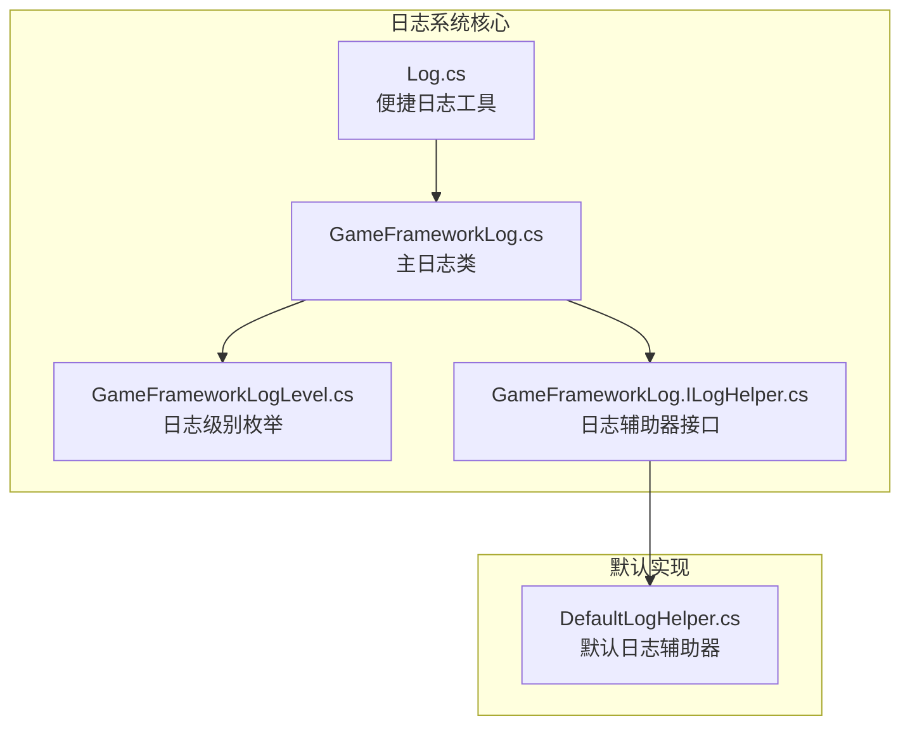
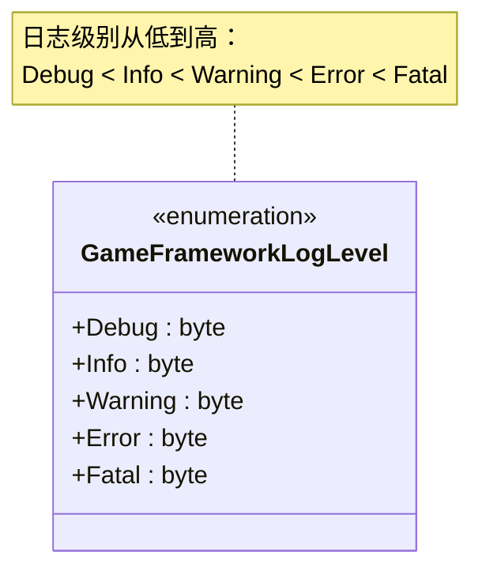
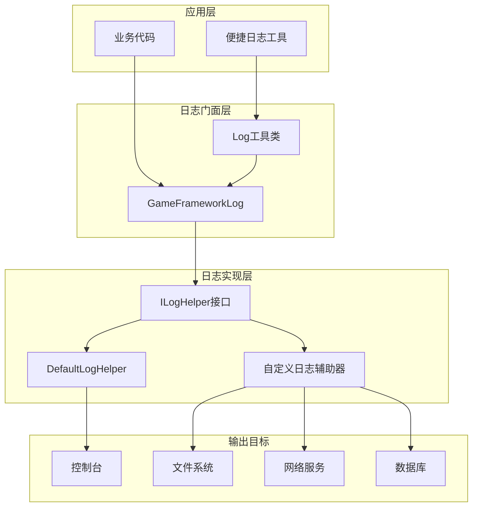
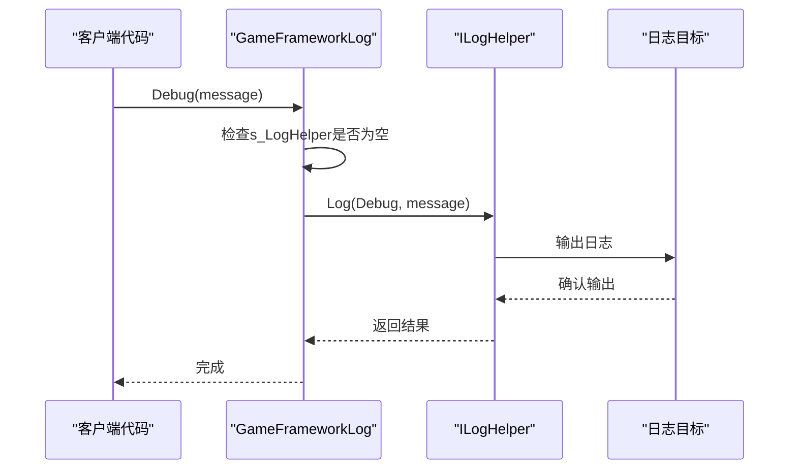
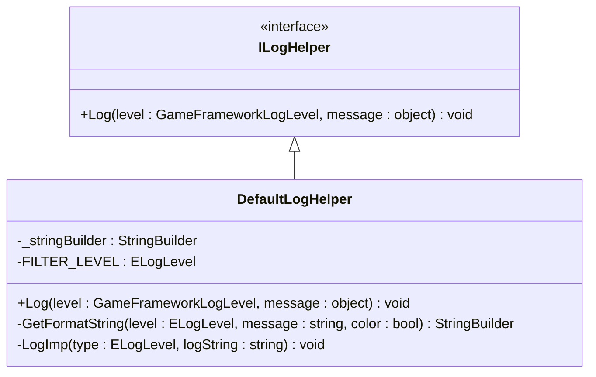
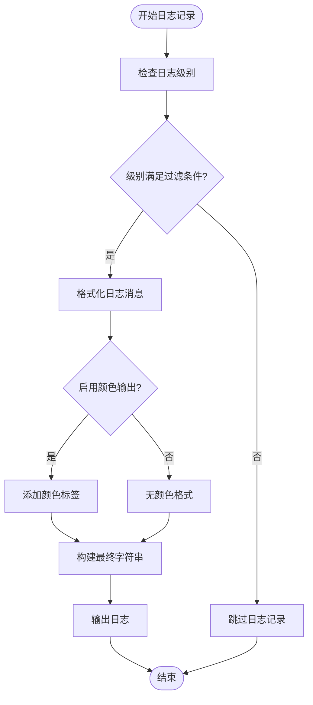
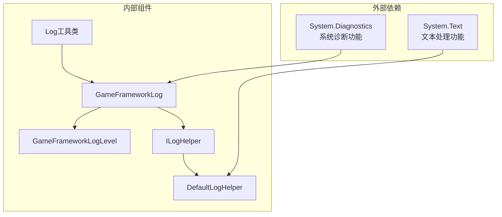
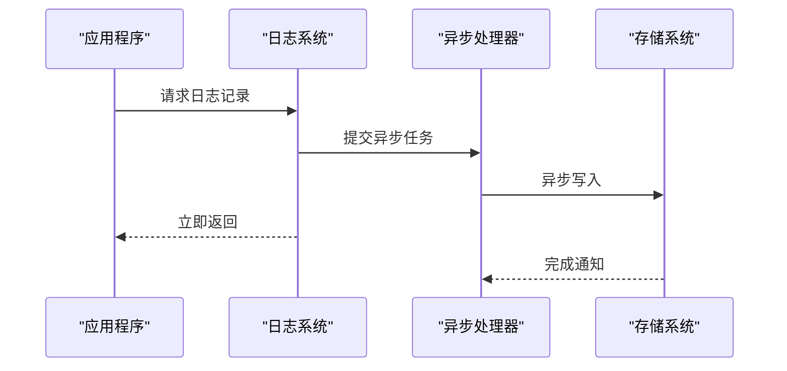

# 日志系统架构

<cite>
**本文档引用的文件**
- [GameFrameworkLog.cs](file://Assets/TEngine/Runtime/Core/Lib/GameFrameworkLog.cs)
- [GameFrameworkLog.ILogHelper.cs](file://Assets/TEngine/Runtime/Core/Lib/GameFrameworkLog.ILogHelper.cs)
- [GameFrameworkLogLevel.cs](file://Assets/TEngine/Runtime/Core/Lib/GameFrameworkLogLevel.cs)
- [Log.cs](file://Assets/TEngine/Runtime/Core/Lib/Log.cs)
- [DefaultLogHelper.cs](file://Assets/TEngine/Runtime/Core/Utility/DefaultHelper/DefaultLogHelper.cs)
</cite>

## 目录
1. [简介](#简介)
2. [项目结构](#项目结构)
3. [核心组件](#核心组件)
4. [架构概览](#架构概览)
5. [详细组件分析](#详细组件分析)
6. [依赖关系分析](#依赖关系分析)
7. [性能考虑](#性能考虑)
8. [故障排除指南](#故障排除指南)
9. [结论](#结论)

## 简介

TEngine日志系统是一个基于GameFramework的日志架构，提供了完整的日志记录解决方案。该系统采用静态类设计模式，通过ILogHelper接口实现日志辅助器的抽象化，支持多种日志级别和灵活的扩展机制。

## 项目结构

TEngine日志系统主要包含以下核心文件：



**图表来源**
- [GameFrameworkLog.cs:1-800](file://Assets/TEngine/Runtime/Core/Lib/GameFrameworkLog.cs#L1-L800)
- [GameFrameworkLogLevel.cs:1-34](file://Assets/TEngine/Runtime/Core/Lib/GameFrameworkLogLevel.cs#L1-L34)
- [GameFrameworkLog.ILogHelper.cs:1-19](file://Assets/TEngine/Runtime/Core/Lib/GameFrameworkLog.ILogHelper.cs#L1-L19)
- [Log.cs:1-800](file://Assets/TEngine/Runtime/Core/Lib/Log.cs#L1-L800)

**章节来源**
- [GameFrameworkLog.cs:1-800](file://Assets/TEngine/Runtime/Core/Lib/GameFrameworkLog.cs#L1-L800)
- [GameFrameworkLogLevel.cs:1-34](file://Assets/TEngine/Runtime/Core/Lib/GameFrameworkLogLevel.cs#L1-L34)
- [GameFrameworkLog.ILogHelper.cs:1-19](file://Assets/TEngine/Runtime/Core/Lib/GameFrameworkLog.ILogHelper.cs#L1-L19)
- [Log.cs:1-800](file://Assets/TEngine/Runtime/Core/Lib/Log.cs#L1-L800)

## 核心组件

### GameFrameworkLog静态类

GameFrameworkLog是日志系统的核心入口，采用静态类设计模式，提供了统一的日志记录接口。该类包含以下关键特性：

- **单例模式**：通过静态字段维护唯一的日志辅助器实例
- **工厂方法**：提供多种重载的Log方法，支持不同数量的参数
- **条件编译**：通过预编译符号控制日志输出的启用状态

### ILogHelper接口

ILogHelper定义了日志辅助器的标准接口，具有以下特点：

- **抽象化设计**：将日志记录的具体实现与调用逻辑分离
- **单一职责**：只负责日志的记录和输出
- **可扩展性**：允许开发者实现自定义的日志输出方式

### GameFrameworkLogLevel枚举

日志级别枚举定义了完整的日志分级体系：



**图表来源**
- [GameFrameworkLogLevel.cs:1-34](file://Assets/TEngine/Runtime/Core/Lib/GameFrameworkLogLevel.cs#L1-L34)

**章节来源**
- [GameFrameworkLog.cs:1-800](file://Assets/TEngine/Runtime/Core/Lib/GameFrameworkLog.cs#L1-L800)
- [GameFrameworkLog.ILogHelper.cs:1-19](file://Assets/TEngine/Runtime/Core/Lib/GameFrameworkLog.ILogHelper.cs#L1-L19)
- [GameFrameworkLogLevel.cs:1-34](file://Assets/TEngine/Runtime/Core/Lib/GameFrameworkLogLevel.cs#L1-L34)

## 架构概览

TEngine日志系统采用分层架构设计，实现了关注点分离和高度的可扩展性：



**图表来源**
- [GameFrameworkLog.cs:1-800](file://Assets/TEngine/Runtime/Core/Lib/GameFrameworkLog.cs#L1-L800)
- [Log.cs:1-800](file://Assets/TEngine/Runtime/Core/Lib/Log.cs#L1-L800)
- [DefaultLogHelper.cs:1-200](file://Assets/TEngine/Runtime/Core/Utility/DefaultHelper/DefaultLogHelper.cs#L1-L200)

### 设计模式应用

系统采用了多种设计模式：

1. **门面模式（Facade Pattern）**：GameFrameworkLog作为统一入口，简化了日志使用的复杂性
2. **策略模式（Strategy Pattern）**：通过ILogHelper接口实现不同的日志输出策略
3. **工厂模式（Factory Pattern）**：静态工厂方法创建和管理日志辅助器实例
4. **模板方法模式（Template Method Pattern）**：定义日志处理的标准流程

## 详细组件分析

### GameFrameworkLog静态类实现

GameFrameworkLog类实现了完整的日志记录功能，包含以下核心方法：

#### 日志级别方法

系统为每种日志级别提供了丰富的重载方法：



**图表来源**
- [GameFrameworkLog.cs:1-800](file://Assets/TEngine/Runtime/Core/Lib/GameFrameworkLog.cs#L1-L800)

#### 参数化日志记录

系统支持最多16个参数的日志记录，提供了灵活的数据格式化能力：

| 方法类型 | 参数数量 | 使用场景 |
|---------|---------|---------|
| 基础方法 | 1个 | 简单消息记录 |
| 格式化方法 | 2-16个 | 复杂数据格式化 |
| 泛型方法 | 1-16个 | 类型安全的参数传递 |

**章节来源**
- [GameFrameworkLog.cs:1-2640](file://Assets/TEngine/Runtime/Core/Lib/GameFrameworkLog.cs#L1-L2640)

### ILogHelper接口设计

ILogHelper接口定义了日志辅助器的标准契约：



**图表来源**
- [GameFrameworkLog.ILogHelper.cs:1-19](file://Assets/TEngine/Runtime/Core/Lib/GameFrameworkLog.ILogHelper.cs#L1-L19)
- [DefaultLogHelper.cs:1-200](file://Assets/TEngine/Runtime/Core/Utility/DefaultHelper/DefaultLogHelper.cs#L1-L200)

#### 接口方法详解

ILogHelper接口只包含一个核心方法`Log`，该方法接受两个参数：
- `level`: 日志级别枚举值
- `message`: 日志内容对象

这种简洁的设计确保了接口的稳定性和可扩展性。

**章节来源**
- [GameFrameworkLog.ILogHelper.cs:1-19](file://Assets/TEngine/Runtime/Core/Lib/GameFrameworkLog.ILogHelper.cs#L1-L19)

### DefaultLogHelper实现

DefaultLogHelper是日志系统的默认实现，提供了完整的日志记录功能：

#### 日志格式化机制

DefaultLogHelper实现了智能的日志格式化功能：



**图表来源**
- [DefaultLogHelper.cs:76-136](file://Assets/TEngine/Runtime/Core/Utility/DefaultHelper/DefaultLogHelper.cs#L76-L136)

#### 过滤机制

DefaultLogHelper内置了日志过滤功能，通过`FILTER_LEVEL`常量控制日志输出的最低级别：

- **调试模式**：输出Debug及以上级别的所有日志
- **发布模式**：默认输出Info及以上级别的日志
- **自定义配置**：支持动态调整过滤级别

**章节来源**
- [DefaultLogHelper.cs:1-200](file://Assets/TEngine/Runtime/Core/Utility/DefaultHelper/DefaultLogHelper.cs#L1-L200)

### Log便捷工具类

Log类提供了更简洁的日志使用接口，通过条件编译指令实现了性能优化：

#### 条件编译优化

Log类使用了多个`Conditional`属性来控制日志输出：

```csharp
[Conditional("ENABLE_LOG")]
[Conditional("ENABLE_DEBUG_LOG")]
[Conditional("ENABLE_DEBUG_AND_ABOVE_LOG")]
public static void Debug(object message)
```

这种设计确保了在生产环境中不会产生额外的性能开销。

**章节来源**
- [Log.cs:1-800](file://Assets/TEngine/Runtime/Core/Lib/Log.cs#L1-L800)

## 依赖关系分析

日志系统的依赖关系清晰且层次分明：



**图表来源**
- [GameFrameworkLog.cs:1-800](file://Assets/TEngine/Runtime/Core/Lib/GameFrameworkLog.cs#L1-L800)
- [Log.cs:1-800](file://Assets/TEngine/Runtime/Core/Lib/Log.cs#L1-L800)
- [DefaultLogHelper.cs:1-200](file://Assets/TEngine/Runtime/Core/Utility/DefaultHelper/DefaultLogHelper.cs#L1-L200)

### 组件耦合度分析

- **低耦合设计**：GameFrameworkLog与具体实现通过接口分离
- **高内聚性**：每个组件专注于特定的功能领域
- **可替换性**：默认实现可以被完全替换而不影响上层代码

**章节来源**
- [GameFrameworkLog.cs:1-800](file://Assets/TEngine/Runtime/Core/Lib/GameFrameworkLog.cs#L1-L800)
- [Log.cs:1-800](file://Assets/TEngine/Runtime/Core/Lib/Log.cs#L1-L800)

## 性能考虑

TEngine日志系统在设计时充分考虑了性能优化：

### 编译时优化

通过条件编译指令，系统能够在编译时移除不需要的日志代码：

```csharp
// 调试版本包含所有日志方法
[Conditional("ENABLE_LOG")]
[Conditional("ENABLE_DEBUG_LOG")] 
[Conditional("ENABLE_DEBUG_AND_ABOVE_LOG")]

// 发布版本可能移除大部分日志调用
```

### 内存管理优化

DefaultLogHelper使用StringBuilder进行字符串拼接，避免了频繁的对象创建：

- **对象复用**：StringBuilder实例在类级别复用
- **缓冲区管理**：动态调整缓冲区大小以适应不同长度的日志消息
- **内存回收**：及时清理StringBuilder中的内容

### 异步处理支持

虽然当前实现是同步的，但接口设计为未来的异步处理预留了空间：



## 故障排除指南

### 常见问题及解决方案

#### 日志不显示问题

**问题描述**：设置了日志级别但没有看到输出

**可能原因**：
1. 日志级别过滤设置过高
2. 预编译符号未正确配置
3. 自定义日志辅助器未正确实现

**解决方案**：
1. 检查`FILTER_LEVEL`常量设置
2. 验证编译时的预编译符号
3. 确认自定义辅助器的实现正确性

#### 性能问题

**问题描述**：日志记录影响了应用程序性能

**排查步骤**：
1. 检查日志调用频率
2. 分析日志消息的复杂度
3. 考虑使用条件编译优化

**优化建议**：
- 减少不必要的日志调用
- 使用更高效的消息格式化方式
- 在高频调用场景中谨慎使用复杂对象

#### 内存泄漏问题

**问题描述**：长时间运行后出现内存使用增加

**排查要点**：
1. 检查StringBuilder的使用情况
2. 确认日志消息的生命周期管理
3. 验证自定义辅助器的资源释放

**预防措施**：
- 及时清理StringBuilder内容
- 合理管理日志文件句柄
- 实现适当的资源回收机制

**章节来源**
- [DefaultLogHelper.cs:76-136](file://Assets/TEngine/Runtime/Core/Utility/DefaultHelper/DefaultLogHelper.cs#L76-L136)

## 结论

TEngine日志系统通过精心设计的架构实现了高性能、高可扩展性的日志记录解决方案。系统采用的门面模式、策略模式和工厂模式确保了良好的代码组织和扩展能力。

### 主要优势

1. **设计优雅**：静态类设计简化了使用复杂度
2. **高度可扩展**：通过接口抽象实现了完全的可替换性
3. **性能优化**：条件编译和内存管理优化确保了高效运行
4. **功能完整**：支持多种日志级别和灵活的格式化选项

### 最佳实践建议

1. **合理选择日志级别**：根据场景选择合适的日志级别
2. **避免过度日志**：在性能敏感区域谨慎使用日志
3. **自定义实现**：根据需求实现专门的日志辅助器
4. **配置管理**：通过配置文件管理日志行为

该日志系统为TEngine框架提供了坚实的基础，支持各种规模的应用程序开发需求。