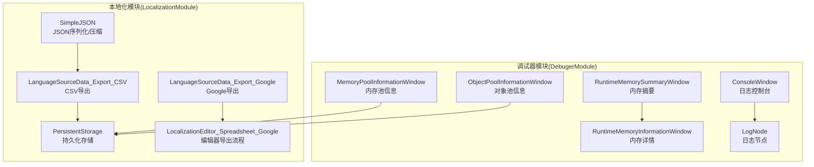
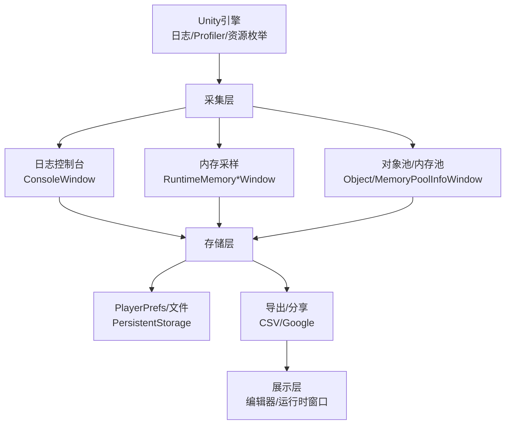
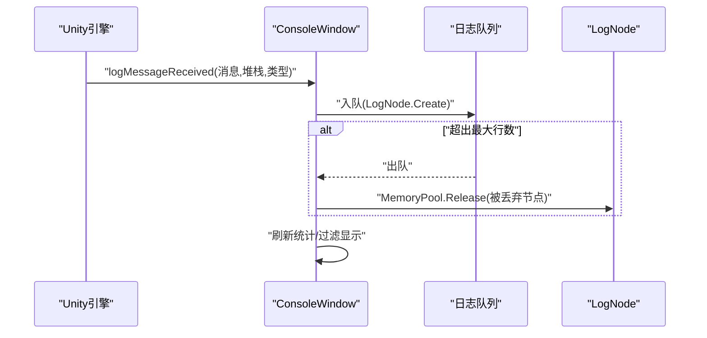
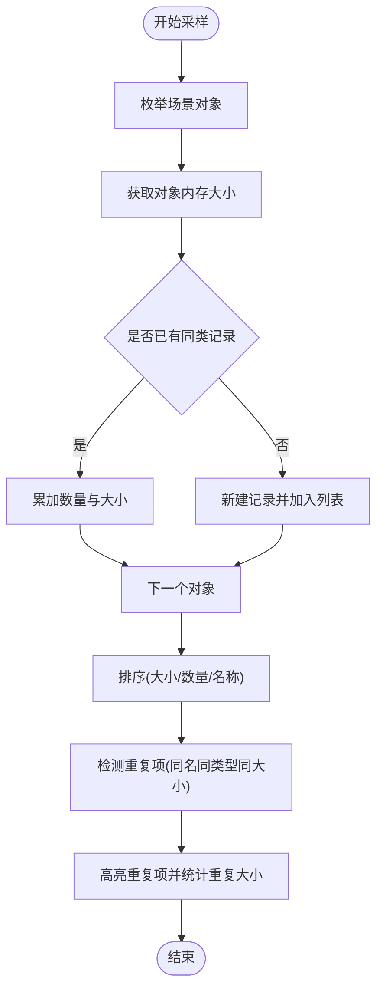
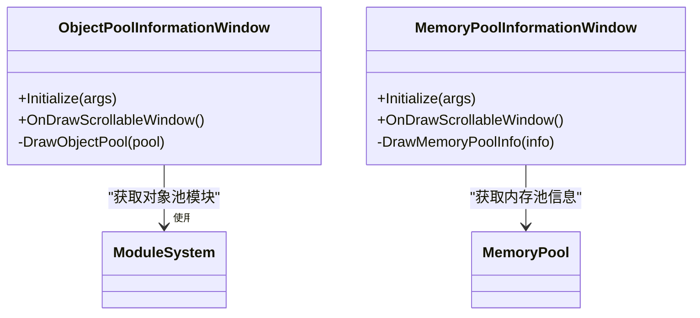
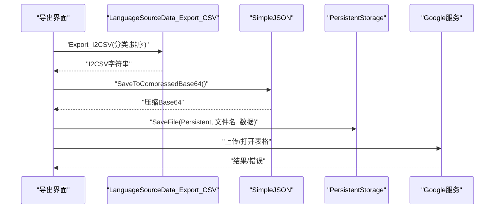
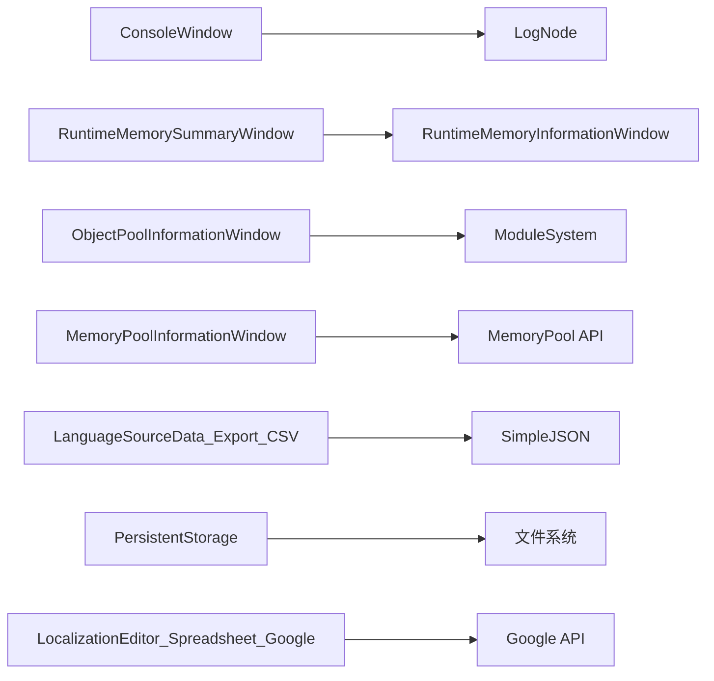

# 监控数据管理

<cite>
**本文引用的文件**
- [Assets/TEngine/Runtime/Module/DebugerModule/DebuggerComponent.ConsoleWindow.cs](file://Assets/TEngine/Runtime/Module/DebugerModule/DebuggerComponent.ConsoleWindow.cs)
- [Assets/TEngine/Runtime/Module/DebugerModule/Component/DebuggerModule.LogNode.cs](file://Assets/TEngine/Runtime/Module/DebugerModule/Component/DebuggerModule.LogNode.cs)
- [Assets/TEngine/Runtime/Module/DebugerModule/Component/DebuggerModule.RuntimeMemorySummaryWindow.cs](file://Assets/TEngine/Runtime/Module/DebugerModule/Component/DebuggerModule.RuntimeMemorySummaryWindow.cs)
- [Assets/TEngine/Runtime/Module/DebugerModule/Component/DebuggerModule.RuntimeMemoryInformationWindow.cs](file://Assets/TEngine/Runtime/Module/DebugerModule/Component/DebuggerModule.RuntimeMemoryInformationWindow.cs)
- [Assets/TEngine/Runtime/Module/DebugerModule/Component/DebuggerModule.MemoryPoolInformationWindow.cs](file://Assets/TEngine/Runtime/Module/DebugerModule/Component/DebuggerModule.MemoryPoolInformationWindow.cs)
- [Assets/TEngine/Runtime/Module/DebugerModule/Component/DebuggerModule.ObjectPoolInformationWindow.cs](file://Assets/TEngine/Runtime/Module/DebugerModule/Component/DebuggerModule.ObjectPoolInformationWindow.cs)
- [Assets/TEngine/Runtime/Module/LocalizationModule/Core/Configurables/PersistentStorage.cs](file://Assets/TEngine/Runtime/Module/LocalizationModule/Core/Configurables/PersistentStorage.cs)
- [Assets/TEngine/Runtime/Module/LocalizationModule/Core/LanguageSource/LanguageSourceData_Export_CSV.cs](file://Assets/TEngine/Runtime/Module/LocalizationModule/Core/LanguageSource/LanguageSourceData_Export_CSV.cs)
- [Assets/TEngine/Runtime/Module/LocalizationModule/Core/LanguageSource/LanguageSourceData_Export_Google.cs](file://Assets/TEngine/Runtime/Module/LocalizationModule/Core/LanguageSource/LanguageSourceData_Export_Google.cs)
- [Assets/TEngine/Runtime/Module/LocalizationModule/Core/Google/SimpleJSON.cs](file://Assets/TEngine/Runtime/Module/LocalizationModule/Core/Google/SimpleJSON.cs)
- [Assets/TEngine/Editor/Localization/Localization/LocalizationEditor_Spreadsheet_Google.cs](file://Assets/TEngine/Editor/Localization/Localization/LocalizationEditor_Spreadsheet_Google.cs)
</cite>

## 目录
1. [简介](#简介)
2. [项目结构](#项目结构)
3. [核心组件](#核心组件)
4. [架构总览](#架构总览)
5. [详细组件分析](#详细组件分析)
6. [依赖关系分析](#依赖关系分析)
7. [性能考量](#性能考量)
8. [故障排查指南](#故障排查指南)
9. [结论](#结论)
10. [附录](#附录)

## 简介
本技术文档围绕 TEngine 监控数据管理系统进行系统化梳理，重点覆盖以下方面：
- 监控数据采集：日志采集、内存采样、对象池与内存池状态采集
- 数据存储：本地持久化（PlayerPrefs、文件）、导出与分享（CSV、Google 表格）
- 数据处理与展示：控制台窗口过滤与滚动、内存摘要与详情、对象池/内存池统计
- 数据清理与容量控制：队列长度限制、重复项高亮、文件存在性检查
- 安全与隐私：敏感字段处理建议、最小化数据暴露原则

## 项目结构
TEngine 的监控数据管理主要分布在以下模块：
- 调试器模块（DebugerModule）：提供日志控制台、内存采样、对象池/内存池信息展示
- 本地化模块（LocalizationModule）：提供配置持久化、数据导出（CSV/Google）

图表来源
- [Assets/TEngine/Runtime/Module/DebugerModule/DebuggerComponent.ConsoleWindow.cs:1-409](file://Assets/TEngine/Runtime/Module/DebugerModule/DebuggerComponent.ConsoleWindow.cs#L1-L409)
- [Assets/TEngine/Runtime/Module/DebugerModule/Component/DebuggerModule.LogNode.cs:1-118](file://Assets/TEngine/Runtime/Module/DebugerModule/Component/DebuggerModule.LogNode.cs#L1-L118)
- [Assets/TEngine/Runtime/Module/DebugerModule/Component/DebuggerModule.RuntimeMemorySummaryWindow.cs:1-123](file://Assets/TEngine/Runtime/Module/DebugerModule/Component/DebuggerModule.RuntimeMemorySummaryWindow.cs#L1-L123)
- [Assets/TEngine/Runtime/Module/DebugerModule/Component/DebuggerModule.RuntimeMemoryInformationWindow.cs:1-135](file://Assets/TEngine/Runtime/Module/DebugerModule/Component/DebuggerModule.RuntimeMemoryInformationWindow.cs#L1-L135)
- [Assets/TEngine/Runtime/Module/DebugerModule/Component/DebuggerModule.MemoryPoolInformationWindow.cs:1-107](file://Assets/TEngine/Runtime/Module/DebugerModule/Component/DebuggerModule.MemoryPoolInformationWindow.cs#L1-L107)
- [Assets/TEngine/Runtime/Module/DebugerModule/Component/DebuggerModule.ObjectPoolInformationWindow.cs:1-88](file://Assets/TEngine/Runtime/Module/DebugerModule/Component/DebuggerModule.ObjectPoolInformationWindow.cs#L1-L88)
- [Assets/TEngine/Runtime/Module/LocalizationModule/Core/Configurables/PersistentStorage.cs:1-286](file://Assets/TEngine/Runtime/Module/LocalizationModule/Core/Configurables/PersistentStorage.cs#L1-L286)
- [Assets/TEngine/Runtime/Module/LocalizationModule/Core/LanguageSource/LanguageSourceData_Export_CSV.cs:1-75](file://Assets/TEngine/Runtime/Module/LocalizationModule/Core/LanguageSource/LanguageSourceData_Export_CSV.cs#L1-L75)
- [Assets/TEngine/Runtime/Module/LocalizationModule/Core/LanguageSource/LanguageSourceData_Export_Google.cs:1-63](file://Assets/TEngine/Runtime/Module/LocalizationModule/Core/LanguageSource/LanguageSourceData_Export_Google.cs#L1-L63)
- [Assets/TEngine/Runtime/Module/LocalizationModule/Core/Google/SimpleJSON.cs:417-463](file://Assets/TEngine/Runtime/Module/LocalizationModule/Core/Google/SimpleJSON.cs#L417-L463)
- [Assets/TEngine/Editor/Localization/Localization/LocalizationEditor_Spreadsheet_Google.cs:487-523](file://Assets/TEngine/Editor/Localization/Localization/LocalizationEditor_Spreadsheet_Google.cs#L487-L523)

章节来源
- [Assets/TEngine/Runtime/Module/DebugerModule/DebuggerComponent.ConsoleWindow.cs:1-409](file://Assets/TEngine/Runtime/Module/DebugerModule/DebuggerComponent.ConsoleWindow.cs#L1-L409)
- [Assets/TEngine/Runtime/Module/LocalizationModule/Core/Configurables/PersistentStorage.cs:1-286](file://Assets/TEngine/Runtime/Module/LocalizationModule/Core/Configurables/PersistentStorage.cs#L1-L286)

## 核心组件
- 日志控制台（ConsoleWindow）：负责接收 Unity 日志、维护环形队列、按级别过滤显示、统计各类日志数量、支持复制堆栈
- 日志节点（LogNode）：封装单条日志的时间、帧号、类型、消息与堆栈，并通过内存池复用
- 内存采样（RuntimeMemorySummaryWindow / RuntimeMemoryInformationWindow<T>）：对场景中对象进行采样，统计总量与类型分布，识别重复项并高亮
- 对象池/内存池信息（ObjectPoolInformationWindow / MemoryPoolInformationWindow）：展示对象池与内存池的使用统计与详情
- 持久化存储（PersistentStorage）：提供 PlayerPrefs 与文件系统访问能力，支持分段存储大值、路径解析与文件 CRUD
- 导出与分享（CSV/Google）：将语言源数据导出为 CSV 或上传至 Google 表格，编辑器侧提供打开在线表格与错误处理

章节来源
- [Assets/TEngine/Runtime/Module/DebugerModule/DebuggerComponent.ConsoleWindow.cs:1-409](file://Assets/TEngine/Runtime/Module/DebugerModule/DebuggerComponent.ConsoleWindow.cs#L1-L409)
- [Assets/TEngine/Runtime/Module/DebugerModule/Component/DebuggerModule.LogNode.cs:1-118](file://Assets/TEngine/Runtime/Module/DebugerModule/Component/DebuggerModule.LogNode.cs#L1-L118)
- [Assets/TEngine/Runtime/Module/DebugerModule/Component/DebuggerModule.RuntimeMemorySummaryWindow.cs:1-123](file://Assets/TEngine/Runtime/Module/DebugerModule/Component/DebuggerModule.RuntimeMemorySummaryWindow.cs#L1-L123)
- [Assets/TEngine/Runtime/Module/DebugerModule/Component/DebuggerModule.RuntimeMemoryInformationWindow.cs:1-135](file://Assets/TEngine/Runtime/Module/DebugerModule/Component/DebuggerModule.RuntimeMemoryInformationWindow.cs#L1-L135)
- [Assets/TEngine/Runtime/Module/DebugerModule/Component/DebuggerModule.MemoryPoolInformationWindow.cs:1-107](file://Assets/TEngine/Runtime/Module/DebugerModule/Component/DebuggerModule.MemoryPoolInformationWindow.cs#L1-L107)
- [Assets/TEngine/Runtime/Module/DebugerModule/Component/DebuggerModule.ObjectPoolInformationWindow.cs:1-88](file://Assets/TEngine/Runtime/Module/DebugerModule/Component/DebuggerModule.ObjectPoolInformationWindow.cs#L1-L88)
- [Assets/TEngine/Runtime/Module/LocalizationModule/Core/Configurables/PersistentStorage.cs:1-286](file://Assets/TEngine/Runtime/Module/LocalizationModule/Core/Configurables/PersistentStorage.cs#L1-L286)
- [Assets/TEngine/Runtime/Module/LocalizationModule/Core/LanguageSource/LanguageSourceData_Export_CSV.cs:1-75](file://Assets/TEngine/Runtime/Module/LocalizationModule/Core/LanguageSource/LanguageSourceData_Export_CSV.cs#L1-L75)
- [Assets/TEngine/Runtime/Module/LocalizationModule/Core/LanguageSource/LanguageSourceData_Export_Google.cs:1-63](file://Assets/TEngine/Runtime/Module/LocalizationModule/Core/LanguageSource/LanguageSourceData_Export_Google.cs#L1-L63)
- [Assets/TEngine/Runtime/Module/LocalizationModule/Core/Google/SimpleJSON.cs:417-463](file://Assets/TEngine/Runtime/Module/LocalizationModule/Core/Google/SimpleJSON.cs#L417-L463)
- [Assets/TEngine/Editor/Localization/Localization/LocalizationEditor_Spreadsheet_Google.cs:487-523](file://Assets/TEngine/Editor/Localization/Localization/LocalizationEditor_Spreadsheet_Google.cs#L487-L523)

## 架构总览
监控数据管理采用“采集-存储-处理-展示”的分层架构：
- 采集层：Unity 日志回调、Profiler 内存采样、对象池/内存池枚举
- 存储层：PlayerPrefs（小数据）、文件系统（大数据/结构化数据）、导出（CSV/Google）
- 处理层：日志过滤与统计、内存排序与去重、对象池统计聚合
- 展示层：调试器窗口（控制台、内存、池信息）、编辑器导出流程

图表来源
- [Assets/TEngine/Runtime/Module/DebugerModule/DebuggerComponent.ConsoleWindow.cs:1-409](file://Assets/TEngine/Runtime/Module/DebugerModule/DebuggerComponent.ConsoleWindow.cs#L1-L409)
- [Assets/TEngine/Runtime/Module/DebugerModule/Component/DebuggerModule.RuntimeMemorySummaryWindow.cs:1-123](file://Assets/TEngine/Runtime/Module/DebugerModule/Component/DebuggerModule.RuntimeMemorySummaryWindow.cs#L1-L123)
- [Assets/TEngine/Runtime/Module/DebugerModule/Component/DebuggerModule.RuntimeMemoryInformationWindow.cs:1-135](file://Assets/TEngine/Runtime/Module/DebugerModule/Component/DebuggerModule.RuntimeMemoryInformationWindow.cs#L1-L135)
- [Assets/TEngine/Runtime/Module/DebugerModule/Component/DebuggerModule.MemoryPoolInformationWindow.cs:1-107](file://Assets/TEngine/Runtime/Module/DebugerModule/Component/DebuggerModule.MemoryPoolInformationWindow.cs#L1-L107)
- [Assets/TEngine/Runtime/Module/DebugerModule/Component/DebuggerModule.ObjectPoolInformationWindow.cs:1-88](file://Assets/TEngine/Runtime/Module/DebugerModule/Component/DebuggerModule.ObjectPoolInformationWindow.cs#L1-L88)
- [Assets/TEngine/Runtime/Module/LocalizationModule/Core/Configurables/PersistentStorage.cs:1-286](file://Assets/TEngine/Runtime/Module/LocalizationModule/Core/Configurables/PersistentStorage.cs#L1-L286)
- [Assets/TEngine/Runtime/Module/LocalizationModule/Core/LanguageSource/LanguageSourceData_Export_CSV.cs:1-75](file://Assets/TEngine/Runtime/Module/LocalizationModule/Core/LanguageSource/LanguageSourceData_Export_CSV.cs#L1-L75)
- [Assets/TEngine/Runtime/Module/LocalizationModule/Core/LanguageSource/LanguageSourceData_Export_Google.cs:1-63](file://Assets/TEngine/Runtime/Module/LocalizationModule/Core/LanguageSource/LanguageSourceData_Export_Google.cs#L1-L63)

## 详细组件分析

### 日志控制台与日志节点
- 日志控制台通过 Unity 回调接收日志，入队到环形队列，超过最大行数时从头部出队并释放节点
- 支持按级别过滤（Info/Warning/Error/Fatal），统计各类型数量，锁定滚动、颜色区分
- 日志节点包含时间戳、帧号、类型、消息与堆栈，使用内存池避免频繁 GC

图表来源
- [Assets/TEngine/Runtime/Module/DebugerModule/DebuggerComponent.ConsoleWindow.cs:362-374](file://Assets/TEngine/Runtime/Module/DebugerModule/DebuggerComponent.ConsoleWindow.cs#L362-L374)
- [Assets/TEngine/Runtime/Module/DebugerModule/Component/DebuggerModule.LogNode.cs:93-114](file://Assets/TEngine/Runtime/Module/DebugerModule/Component/DebuggerModule.LogNode.cs#L93-L114)

章节来源
- [Assets/TEngine/Runtime/Module/DebugerModule/DebuggerComponent.ConsoleWindow.cs:1-409](file://Assets/TEngine/Runtime/Module/DebugerModule/DebuggerComponent.ConsoleWindow.cs#L1-L409)
- [Assets/TEngine/Runtime/Module/DebugerModule/Component/DebuggerModule.LogNode.cs:1-118](file://Assets/TEngine/Runtime/Module/DebugerModule/Component/DebuggerModule.LogNode.cs#L1-L118)

### 内存采样与重复项检测
- 内存摘要窗口：遍历场景对象，按类型汇总数量与大小，按大小/数量/名称排序
- 内存详情窗口：针对特定类型进行采样，计算总量与重复项（同名同类型同大小），高亮重复项并统计重复大小

图表来源
- [Assets/TEngine/Runtime/Module/DebugerModule/Component/DebuggerModule.RuntimeMemorySummaryWindow.cs:61-102](file://Assets/TEngine/Runtime/Module/DebugerModule/Component/DebuggerModule.RuntimeMemorySummaryWindow.cs#L61-L102)
- [Assets/TEngine/Runtime/Module/DebugerModule/Component/DebuggerModule.RuntimeMemoryInformationWindow.cs:82-114](file://Assets/TEngine/Runtime/Module/DebugerModule/Component/DebuggerModule.RuntimeMemoryInformationWindow.cs#L82-L114)

章节来源
- [Assets/TEngine/Runtime/Module/DebugerModule/Component/DebuggerModule.RuntimeMemorySummaryWindow.cs:1-123](file://Assets/TEngine/Runtime/Module/DebugerModule/Component/DebuggerModule.RuntimeMemorySummaryWindow.cs#L1-L123)
- [Assets/TEngine/Runtime/Module/DebugerModule/Component/DebuggerModule.RuntimeMemoryInformationWindow.cs:1-135](file://Assets/TEngine/Runtime/Module/DebugerModule/Component/DebuggerModule.RuntimeMemoryInformationWindow.cs#L1-L135)

### 对象池与内存池信息
- 对象池信息窗口：列出所有对象池，展示名称、类型、容量、使用计数、可释放计数、优先级、最后使用时间等
- 内存池信息窗口：按程序集分组展示内存池统计，支持显示完整类名，按不同键排序

图表来源
- [Assets/TEngine/Runtime/Module/DebugerModule/Component/DebuggerModule.ObjectPoolInformationWindow.cs:1-88](file://Assets/TEngine/Runtime/Module/DebugerModule/Component/DebuggerModule.ObjectPoolInformationWindow.cs#L1-L88)
- [Assets/TEngine/Runtime/Module/DebugerModule/Component/DebuggerModule.MemoryPoolInformationWindow.cs:1-107](file://Assets/TEngine/Runtime/Module/DebugerModule/Component/DebuggerModule.MemoryPoolInformationWindow.cs#L1-L107)

章节来源
- [Assets/TEngine/Runtime/Module/DebugerModule/Component/DebuggerModule.ObjectPoolInformationWindow.cs:1-88](file://Assets/TEngine/Runtime/Module/DebugerModule/Component/DebuggerModule.ObjectPoolInformationWindow.cs#L1-L88)
- [Assets/TEngine/Runtime/Module/DebugerModule/Component/DebuggerModule.MemoryPoolInformationWindow.cs:1-107](file://Assets/TEngine/Runtime/Module/DebugerModule/Component/DebuggerModule.MemoryPoolInformationWindow.cs#L1-L107)

### 持久化存储与导出
- 持久化存储：统一入口 PersistentStorage 提供 PlayerPrefs 与文件操作；PlayerPrefs 大值自动分段存储；文件路径根据类型解析到持久化/临时/流式目录
- 导出 CSV：将语言源数据导出为 I2CSV 格式字符串，支持分类、排序与语言列
- 导出 Google：编辑器侧连接 Google 服务，上传/下载数据，打开在线表格并处理错误
- JSON 序列化/压缩：提供 Base64/流压缩保存能力（需启用相应宏定义）

图表来源
- [Assets/TEngine/Runtime/Module/LocalizationModule/Core/LanguageSource/LanguageSourceData_Export_CSV.cs:45-75](file://Assets/TEngine/Runtime/Module/LocalizationModule/Core/LanguageSource/LanguageSourceData_Export_CSV.cs#L45-L75)
- [Assets/TEngine/Runtime/Module/LocalizationModule/Core/Google/SimpleJSON.cs:421-443](file://Assets/TEngine/Runtime/Module/LocalizationModule/Core/Google/SimpleJSON.cs#L421-L443)
- [Assets/TEngine/Runtime/Module/LocalizationModule/Core/Configurables/PersistentStorage.cs:196-231](file://Assets/TEngine/Runtime/Module/LocalizationModule/Core/Configurables/PersistentStorage.cs#L196-L231)
- [Assets/TEngine/Editor/Localization/Localization/LocalizationEditor_Spreadsheet_Google.cs:487-523](file://Assets/TEngine/Editor/Localization/Localization/LocalizationEditor_Spreadsheet_Google.cs#L487-L523)

章节来源
- [Assets/TEngine/Runtime/Module/LocalizationModule/Core/Configurables/PersistentStorage.cs:1-286](file://Assets/TEngine/Runtime/Module/LocalizationModule/Core/Configurables/PersistentStorage.cs#L1-L286)
- [Assets/TEngine/Runtime/Module/LocalizationModule/Core/LanguageSource/LanguageSourceData_Export_CSV.cs:1-75](file://Assets/TEngine/Runtime/Module/LocalizationModule/Core/LanguageSource/LanguageSourceData_Export_CSV.cs#L1-L75)
- [Assets/TEngine/Runtime/Module/LocalizationModule/Core/LanguageSource/LanguageSourceData_Export_Google.cs:1-63](file://Assets/TEngine/Runtime/Module/LocalizationModule/Core/LanguageSource/LanguageSourceData_Export_Google.cs#L1-L63)
- [Assets/TEngine/Runtime/Module/LocalizationModule/Core/Google/SimpleJSON.cs:417-463](file://Assets/TEngine/Runtime/Module/LocalizationModule/Core/Google/SimpleJSON.cs#L417-L463)
- [Assets/TEngine/Editor/Localization/Localization/LocalizationEditor_Spreadsheet_Google.cs:487-523](file://Assets/TEngine/Editor/Localization/Localization/LocalizationEditor_Spreadsheet_Google.cs#L487-L523)

## 依赖关系分析
- 组件内聚与耦合
  - ConsoleWindow 与 LogNode 高内聚，通过内存池解耦 GC 压力
  - 内存采样窗口依赖 Unity Profiler 与 Resources 枚举，排序与去重逻辑集中
  - 对象池/内存池窗口依赖模块系统与内存池 API，按程序集分组提升可读性
- 外部依赖
  - Unity 日志回调与 Profiler API
  - 文件系统与 PlayerPrefs（受平台限制）
  - Google 服务（编辑器端）

图表来源
- [Assets/TEngine/Runtime/Module/DebugerModule/DebuggerComponent.ConsoleWindow.cs:1-409](file://Assets/TEngine/Runtime/Module/DebugerModule/DebuggerComponent.ConsoleWindow.cs#L1-L409)
- [Assets/TEngine/Runtime/Module/DebugerModule/Component/DebuggerModule.LogNode.cs:1-118](file://Assets/TEngine/Runtime/Module/DebugerModule/Component/DebuggerModule.LogNode.cs#L1-L118)
- [Assets/TEngine/Runtime/Module/DebugerModule/Component/DebuggerModule.RuntimeMemorySummaryWindow.cs:1-123](file://Assets/TEngine/Runtime/Module/DebugerModule/Component/DebuggerModule.RuntimeMemorySummaryWindow.cs#L1-L123)
- [Assets/TEngine/Runtime/Module/DebugerModule/Component/DebuggerModule.RuntimeMemoryInformationWindow.cs:1-135](file://Assets/TEngine/Runtime/Module/DebugerModule/Component/DebuggerModule.RuntimeMemoryInformationWindow.cs#L1-L135)
- [Assets/TEngine/Runtime/Module/DebugerModule/Component/DebuggerModule.ObjectPoolInformationWindow.cs:1-88](file://Assets/TEngine/Runtime/Module/DebugerModule/Component/DebuggerModule.ObjectPoolInformationWindow.cs#L1-L88)
- [Assets/TEngine/Runtime/Module/DebugerModule/Component/DebuggerModule.MemoryPoolInformationWindow.cs:1-107](file://Assets/TEngine/Runtime/Module/DebugerModule/Component/DebuggerModule.MemoryPoolInformationWindow.cs#L1-L107)
- [Assets/TEngine/Runtime/Module/LocalizationModule/Core/LanguageSource/LanguageSourceData_Export_CSV.cs:1-75](file://Assets/TEngine/Runtime/Module/LocalizationModule/Core/LanguageSource/LanguageSourceData_Export_CSV.cs#L1-L75)
- [Assets/TEngine/Runtime/Module/LocalizationModule/Core/Google/SimpleJSON.cs:417-463](file://Assets/TEngine/Runtime/Module/LocalizationModule/Core/Google/SimpleJSON.cs#L417-L463)
- [Assets/TEngine/Runtime/Module/LocalizationModule/Core/Configurables/PersistentStorage.cs:1-286](file://Assets/TEngine/Runtime/Module/LocalizationModule/Core/Configurables/PersistentStorage.cs#L1-L286)
- [Assets/TEngine/Editor/Localization/Localization/LocalizationEditor_Spreadsheet_Google.cs:487-523](file://Assets/TEngine/Editor/Localization/Localization/LocalizationEditor_Spreadsheet_Google.cs#L487-L523)

## 性能考量
- 日志队列容量控制：通过最大行数限制避免无限增长，超出时及时释放节点，降低内存峰值
- 内存采样复杂度：对象枚举与排序为 O(n log n)，重复项检测线性扫描，整体开销与对象数量线性相关
- 持久化写入：PlayerPrefs 分段写入减少单键过大风险；文件写入使用 UTF-8，建议在批量写入时合并请求
- 导出性能：CSV 导出与 JSON 压缩在编辑器端执行，运行时建议仅在必要时触发

## 故障排查指南
- 日志不显示或丢失
  - 检查过滤开关与最大行数设置
  - 确认 Unity 回调已注册并在关闭时正确注销
- 内存采样结果异常
  - 确认 Unity 版本对 Profiler 接口的支持
  - 注意重复项高亮可能掩盖真实泄漏，应结合其他指标分析
- 文件读写失败
  - 平台限制（如 Switch/WSA）可能导致无法访问文件系统
  - 使用 HasFile/CanAccessFiles 进行前置检查
- 导出到 Google 失败
  - 编辑器侧检查网络与权限，关注错误信息中的“rewind”提示
  - 成功后可选择自动打开在线表格

章节来源
- [Assets/TEngine/Runtime/Module/DebugerModule/DebuggerComponent.ConsoleWindow.cs:125-180](file://Assets/TEngine/Runtime/Module/DebugerModule/DebuggerComponent.ConsoleWindow.cs#L125-L180)
- [Assets/TEngine/Runtime/Module/LocalizationModule/Core/Configurables/PersistentStorage.cs:176-183](file://Assets/TEngine/Runtime/Module/LocalizationModule/Core/Configurables/PersistentStorage.cs#L176-L183)
- [Assets/TEngine/Editor/Localization/Localization/LocalizationEditor_Spreadsheet_Google.cs:492-505](file://Assets/TEngine/Editor/Localization/Localization/LocalizationEditor_Spreadsheet_Google.cs#L492-L505)

## 结论
TEngine 的监控数据管理以调试器为核心，结合日志、内存与池信息的可视化展示，并通过本地化模块实现数据的导出与分享。系统在采集、存储、处理与展示层面均具备清晰的职责划分与良好的扩展性。建议在生产环境中配合日志分级、采样周期与导出策略，确保监控数据的可用性与性能平衡。

## 附录
- 安全与隐私建议
  - 最小化采集：仅采集必要的运行时指标与日志上下文
  - 敏感信息脱敏：对日志中的敏感字段进行脱敏或过滤
  - 访问控制：导出与分享需明确权限范围，避免泄露内部数据
  - 合规存储：遵循平台与地区数据保护法规，合理设置数据保留期限