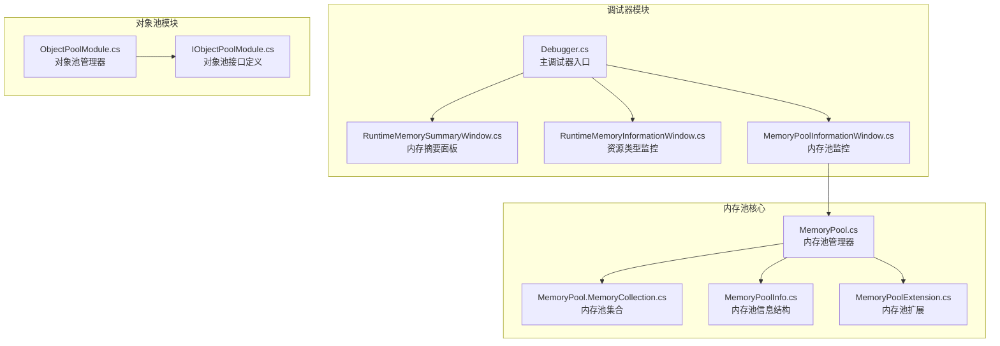
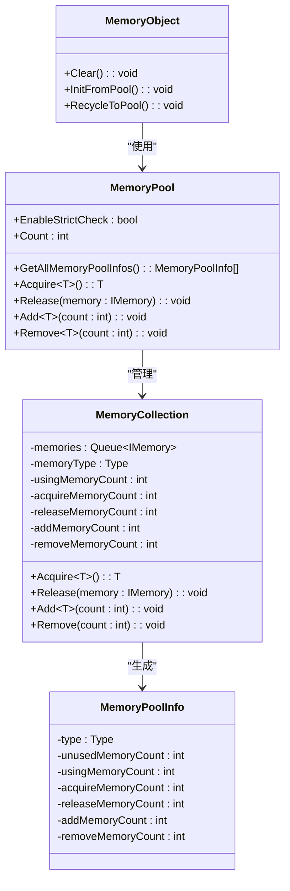
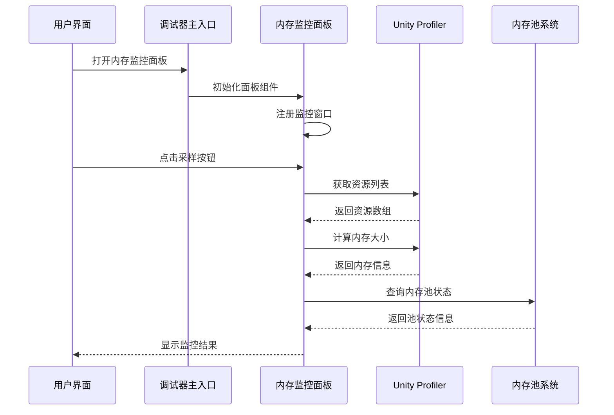
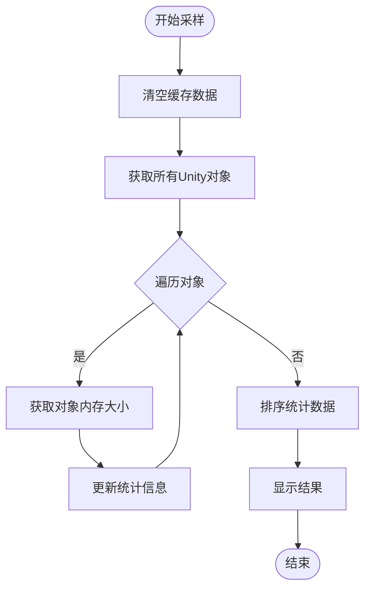
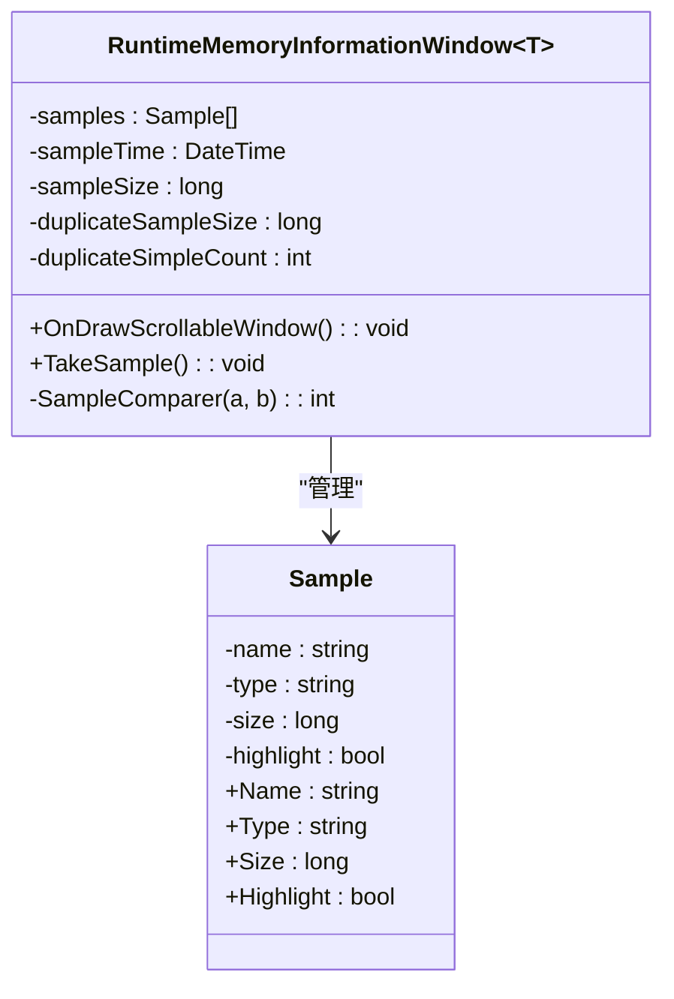
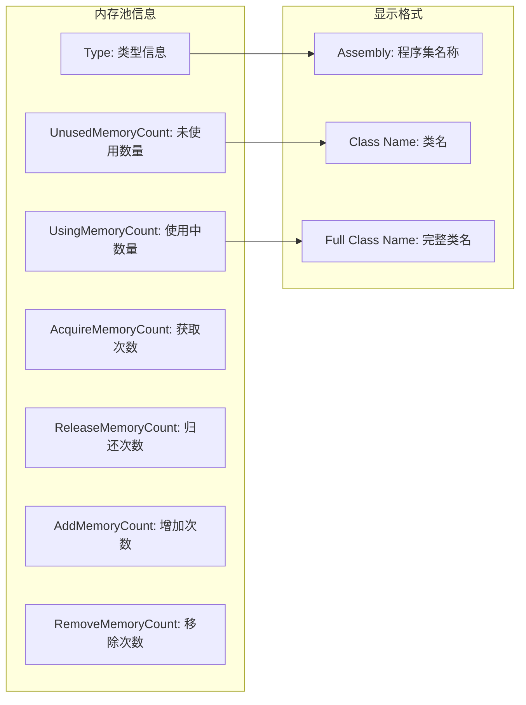
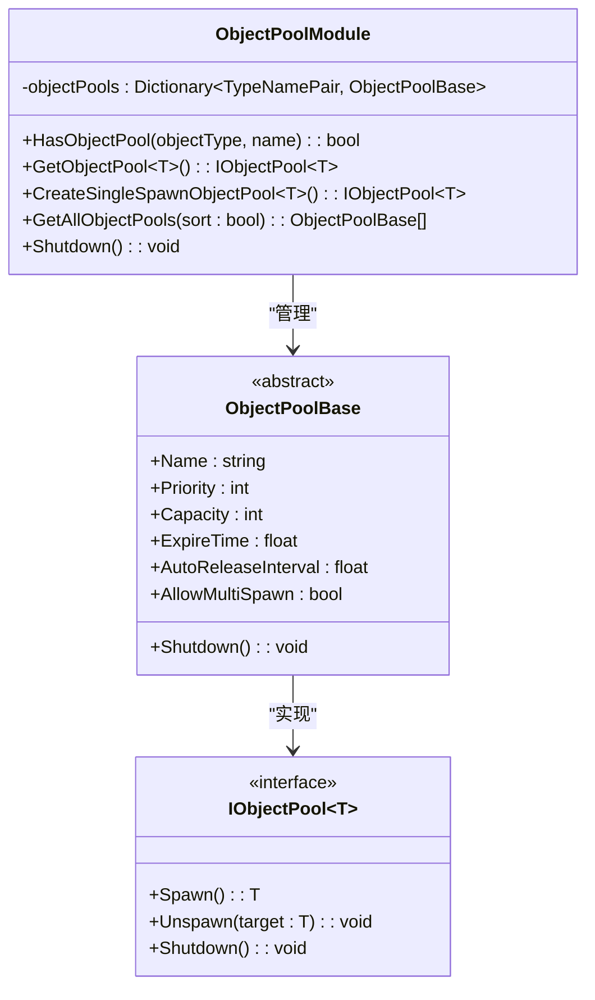
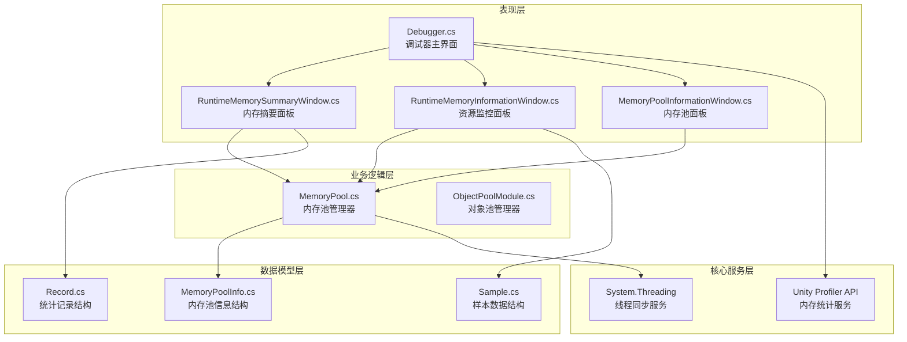

# 内存监控面板

<cite>
**本文档引用的文件**
- [Debugger.cs](file://Assets/TEngine/Runtime/Module/DebugerModule/Debugger.cs)
- [RuntimeMemorySummaryWindow.cs](file://Assets/TEngine/Runtime/Module/DebugerModule/Component/DebuggerModule.RuntimeMemorySummaryWindow.cs)
- [RuntimeMemorySummaryWindow.Record.cs](file://Assets/TEngine/Runtime/Module/DebugerModule/Component/DebuggerModule.RuntimeMemorySummaryWindow.Record.cs)
- [RuntimeMemoryInformationWindow.cs](file://Assets/TEngine/Runtime/Module/DebugerModule/Component/DebuggerModule.RuntimeMemoryInformationWindow.cs)
- [RuntimeMemoryInformationWindow.Sample.cs](file://Assets/TEngine/Runtime/Module/DebugerModule/Component/DebuggerModule.RuntimeMemoryInformationWindow.Sample.cs)
- [MemoryPoolInformationWindow.cs](file://Assets/TEngine/Runtime/Module/DebugerModule/Component/DebuggerModule.MemoryPoolInformationWindow.cs)
- [MemoryPool.cs](file://Assets/TEngine/Runtime/Core/MemoryPool/MemoryPool.cs)
- [MemoryPool.MemoryCollection.cs](file://Assets/TEngine/Runtime/Core/MemoryPool/MemoryPool.MemoryCollection.cs)
- [MemoryPoolInfo.cs](file://Assets/TEngine/Runtime/Core/MemoryPool/MemoryPoolInfo.cs)
- [MemoryPoolExtension.cs](file://Assets/TEngine/Runtime/Core/MemoryPool/MemoryPoolExtension.cs)
- [ObjectPoolModule.cs](file://Assets/TEngine/Runtime/Module/ObjectPoolModule/ObjectPoolModule.cs)
- [IObjectPoolModule.cs](file://Assets/TEngine/Runtime/Module/ObjectPoolModule/IObjectPoolModule.cs)
</cite>

## 目录
1. [简介](#简介)
2. [项目结构](#项目结构)
3. [核心组件](#核心组件)
4. [架构概览](#架构概览)
5. [详细组件分析](#详细组件分析)
6. [依赖关系分析](#依赖关系分析)
7. [性能考虑](#性能考虑)
8. [故障排除指南](#故障排除指南)
9. [结论](#结论)
10. [附录](#附录)

## 简介

TEngine内存监控面板是一个强大的调试工具集，专门用于监控和分析Unity游戏运行时的内存使用情况。该系统提供了多层次的内存监控功能，包括实时内存统计、资源类型分析、内存池监控以及对象池管理等功能。

本系统的核心目标是帮助开发者：
- 实时监控各类Unity资源的内存占用情况（Texture、Mesh、Material、Shader、AnimationClip、AudioClip、Font、TextAsset等）
- 分析内存摘要信息，包括总内存使用量、GC统计信息
- 监控内存分配趋势和潜在的内存泄漏
- 评估对象池和引用池的使用效率
- 提供内存优化策略和泄漏排查方法

## 项目结构

TEngine内存监控系统主要分布在以下模块中：

**图表来源**
- [Debugger.cs:61-222](file://Assets/TEngine/Runtime/Module/DebugerModule/Debugger.cs#L61-L222)
- [MemoryPool.cs:1-208](file://Assets/TEngine/Runtime/Core/MemoryPool/MemoryPool.cs#L1-L208)

**章节来源**
- [Debugger.cs:61-222](file://Assets/TEngine/Runtime/Module/DebugerModule/Debugger.cs#L61-L222)
- [MemoryPool.cs:1-208](file://Assets/TEngine/Runtime/Core/MemoryPool/MemoryPool.cs#L1-L208)

## 核心组件

### 内存监控面板体系

TEngine内存监控系统包含四个主要的监控面板：

1. **内存摘要面板** - 提供全局内存使用概览
2. **资源类型监控面板** - 针对特定Unity资源类型的详细分析
3. **内存池监控面板** - 监控引用池的使用情况
4. **对象池监控面板** - 监控对象池的使用效率

每个组件都提供了独立的采样功能和可视化界面，支持实时数据更新和历史趋势分析。

**章节来源**
- [Debugger.cs:69-80](file://Assets/TEngine/Runtime/Module/DebugerModule/Debugger.cs#L69-L80)
- [Debugger.cs:204-214](file://Assets/TEngine/Runtime/Module/DebugerModule/Debugger.cs#L204-L214)

### 内存池架构

内存池系统采用分层设计，通过泛型类型确保类型安全和编译时检查：

**图表来源**
- [MemoryPool.cs:9-208](file://Assets/TEngine/Runtime/Core/MemoryPool/MemoryPool.cs#L9-L208)
- [MemoryPool.MemoryCollection.cs:11-157](file://Assets/TEngine/Runtime/Core/MemoryPool/MemoryPool.MemoryCollection.cs#L11-L157)
- [MemoryPoolInfo.cs:10-119](file://Assets/TEngine/Runtime/Core/MemoryPool/MemoryPoolInfo.cs#L10-L119)
- [MemoryPoolExtension.cs:8-56](file://Assets/TEngine/Runtime/Core/MemoryPool/MemoryPoolExtension.cs#L8-L56)

**章节来源**
- [MemoryPool.cs:9-208](file://Assets/TEngine/Runtime/Core/MemoryPool/MemoryPool.cs#L9-L208)
- [MemoryPool.MemoryCollection.cs:11-157](file://Assets/TEngine/Runtime/Core/MemoryPool/MemoryPool.MemoryCollection.cs#L11-L157)
- [MemoryPoolInfo.cs:10-119](file://Assets/TEngine/Runtime/Core/MemoryPool/MemoryPoolInfo.cs#L10-L119)

## 架构概览

TEngine内存监控系统采用模块化架构设计，各组件之间通过清晰的接口进行交互：

**图表来源**
- [Debugger.cs:204-214](file://Assets/TEngine/Runtime/Module/DebugerModule/Debugger.cs#L204-L214)
- [RuntimeMemoryInformationWindow.cs:82-114](file://Assets/TEngine/Runtime/Module/DebugerModule/Component/DebuggerModule.RuntimeMemoryInformationWindow.cs#L82-L114)

系统架构的关键特点：

1. **模块分离**：内存监控功能与核心逻辑完全分离，便于维护和扩展
2. **类型安全**：通过泛型和接口确保类型安全
3. **线程安全**：内存池操作采用锁机制保证并发安全
4. **可扩展性**：支持自定义监控面板和资源类型

**章节来源**
- [Debugger.cs:61-222](file://Assets/TEngine/Runtime/Module/DebugerModule/Debugger.cs#L61-L222)

## 详细组件分析

### 内存摘要面板

内存摘要面板提供全局内存使用概览，是整个内存监控系统的核心组件之一。

#### 功能特性

1. **实时采样**：支持随时进行内存快照采集
2. **分类统计**：按资源类型自动分类统计内存使用
3. **时间戳记录**：记录每次采样的具体时间
4. **排序展示**：支持按内存使用量排序显示

#### 数据处理流程

**图表来源**
- [RuntimeMemorySummaryWindow.cs:61-102](file://Assets/TEngine/Runtime/Module/DebugerModule/Component/DebuggerModule.RuntimeMemorySummaryWindow.cs#L61-L102)

#### 关键实现要点

- 使用Unity Profiler API获取准确的内存使用数据
- 支持不同Unity版本的兼容性处理
- 实现了高效的内存统计算法
- 提供用户友好的数据展示格式

**章节来源**
- [RuntimeMemorySummaryWindow.cs:1-123](file://Assets/TEngine/Runtime/Module/DebugerModule/Component/DebuggerModule.RuntimeMemorySummaryWindow.cs#L1-L123)
- [RuntimeMemorySummaryWindow.Record.cs:7-54](file://Assets/TEngine/Runtime/Module/DebugerModule/Component/DebuggerModule.RuntimeMemorySummaryWindow.Record.cs#L7-L54)

### 资源类型监控面板

资源类型监控面板针对特定的Unity资源类型提供详细的内存分析，支持以下资源类型：

- **Texture**：纹理资源内存分析
- **Mesh**：网格资源内存分析  
- **Material**：材质资源内存分析
- **Shader**：着色器资源内存分析
- **AnimationClip**：动画剪辑内存分析
- **AudioClip**：音频剪辑内存分析
- **Font**：字体资源内存分析
- **TextAsset**：文本资源内存分析
- **ScriptableObject**：脚本对象内存分析

#### 监控机制

每个资源类型都有独立的监控窗口，采用相同的实现模式：

**图表来源**
- [RuntimeMemoryInformationWindow.cs:12-135](file://Assets/TEngine/Runtime/Module/DebugerModule/Component/DebuggerModule.RuntimeMemoryInformationWindow.cs#L12-L135)
- [RuntimeMemoryInformationWindow.Sample.cs:7-61](file://Assets/TEngine/Runtime/Module/DebugerModule/Component/DebuggerModule.RuntimeMemoryInformationWindow.Sample.cs#L7-L61)

#### 重复检测机制

系统内置智能重复检测功能，能够识别可能重复的资源实例：

1. **自动去重**：基于名称、类型和大小进行重复检测
2. **高亮显示**：重复的资源会在界面中高亮显示
3. **统计汇总**：提供重复资源的总数和总内存占用

**章节来源**
- [RuntimeMemoryInformationWindow.cs:14-135](file://Assets/TEngine/Runtime/Module/DebugerModule/Component/DebuggerModule.RuntimeMemoryInformationWindow.cs#L14-L135)
- [RuntimeMemoryInformationWindow.Sample.cs:7-61](file://Assets/TEngine/Runtime/Module/DebugerModule/Component/DebuggerModule.RuntimeMemoryInformationWindow.Sample.cs#L7-L61)

### 内存池监控面板

内存池监控面板专门用于监控引用池的使用情况，提供详细的内存池统计信息。

#### 监控指标

1. **池状态信息**：
   - 强制检查开关状态
   - 内存池数量统计

2. **池使用统计**：
   - 未使用内存对象数量
   - 正在使用内存对象数量
   - 获取内存对象次数
   - 归还内存对象次数
   - 增加内存对象次数
   - 移除内存对象次数

#### 组织结构

**图表来源**
- [MemoryPoolInfo.cs:10-119](file://Assets/TEngine/Runtime/Core/MemoryPool/MemoryPoolInfo.cs#L10-L119)
- [MemoryPoolInformationWindow.cs:80-103](file://Assets/TEngine/Runtime/Module/DebugerModule/Component/DebuggerModule.MemoryPoolInformationWindow.cs#L80-L103)

**章节来源**
- [MemoryPoolInformationWindow.cs:1-107](file://Assets/TEngine/Runtime/Module/DebugerModule/Component/DebuggerModule.MemoryPoolInformationWindow.cs#L1-L107)
- [MemoryPoolInfo.cs:10-119](file://Assets/TEngine/Runtime/Core/MemoryPool/MemoryPoolInfo.cs#L10-L119)

### 对象池监控面板

对象池监控面板用于监控游戏中的对象池使用情况，提供对象池的使用效率分析。

#### 对象池管理器

对象池模块提供了完整的企业级对象池管理系统：

**图表来源**
- [ObjectPoolModule.cs:282-1296](file://Assets/TEngine/Runtime/Module/ObjectPoolModule/ObjectPoolModule.cs#L282-L1296)
- [IObjectPoolModule.cs:43-142](file://Assets/TEngine/Runtime/Module/ObjectPoolModule/IObjectPoolModule.cs#L43-L142)

#### 监控功能

1. **池状态监控**：实时显示对象池的使用状态
2. **性能指标**：提供对象创建和销毁的统计信息
3. **容量管理**：监控对象池的容量使用情况
4. **生命周期管理**：跟踪对象的生命周期和回收情况

**章节来源**
- [ObjectPoolModule.cs:282-1296](file://Assets/TEngine/Runtime/Module/ObjectPoolModule/ObjectPoolModule.cs#L282-L1296)
- [IObjectPoolModule.cs:43-142](file://Assets/TEngine/Runtime/Module/ObjectPoolModule/IObjectPoolModule.cs#L43-L142)

## 依赖关系分析

TEngine内存监控系统的依赖关系呈现清晰的层次结构：

**图表来源**
- [Debugger.cs:61-222](file://Assets/TEngine/Runtime/Module/DebugerModule/Debugger.cs#L61-L222)
- [MemoryPool.cs:1-208](file://Assets/TEngine/Runtime/Core/MemoryPool/MemoryPool.cs#L1-L208)

### 关键依赖点

1. **Unity Profiler集成**：所有内存统计都依赖于Unity的Profiler API
2. **类型系统依赖**：内存池系统依赖于C#的泛型和接口系统
3. **线程安全依赖**：内存池操作需要严格的线程同步机制
4. **反射依赖**：对象池系统使用反射来创建和管理对象

**章节来源**
- [MemoryPool.cs:164-185](file://Assets/TEngine/Runtime/Core/MemoryPool/MemoryPool.cs#L164-L185)
- [MemoryPool.MemoryCollection.cs:83-98](file://Assets/TEngine/Runtime/Core/MemoryPool/MemoryPool.MemoryCollection.cs#L83-L98)

## 性能考虑

### 内存使用优化

1. **采样频率控制**：系统默认限制每批显示的样本数量（300个），避免大量数据导致的性能问题
2. **延迟加载**：内存池信息采用延迟加载机制，只在需要时才创建和初始化
3. **缓存策略**：使用字典和队列结构优化数据访问性能
4. **内存复用**：通过内存池减少频繁的内存分配和垃圾回收

### 并发性能

1. **锁粒度优化**：内存池操作使用细粒度锁，减少锁竞争
2. **批量操作**：支持批量添加和移除内存对象，提高操作效率
3. **异步处理**：监控面板支持异步数据更新，避免阻塞主线程

### 监控开销

1. **采样成本**：内存采样操作相对昂贵，建议合理控制采样频率
2. **UI更新**：大量数据的UI更新可能影响帧率，系统已实现分页显示
3. **日志输出**：调试信息输出可能产生额外开销，建议在生产环境中关闭

## 故障排除指南

### 常见问题及解决方案

#### 内存池异常

**问题**：内存池抛出类型验证异常
**原因**：尝试释放非内存池创建的对象
**解决方案**：
1. 确保所有对象都通过内存池API创建
2. 检查对象的生命周期管理
3. 开启严格检查模式进行调试

#### 对象池泄漏

**问题**：对象池中存在未正确回收的对象
**解决步骤**：
1. 检查对象的`Clear()`方法实现
2. 确保所有对象最终都会被归还到池中
3. 使用内存监控面板定期检查池状态

#### 性能问题

**问题**：内存监控影响游戏性能
**优化建议**：
1. 减少采样频率
2. 关闭不必要的监控面板
3. 使用更精确的采样范围

**章节来源**
- [MemoryPool.cs:164-185](file://Assets/TEngine/Runtime/Core/MemoryPool/MemoryPool.cs#L164-L185)
- [MemoryPoolExtension.cs:46-55](file://Assets/TEngine/Runtime/Core/MemoryPool/MemoryPoolExtension.cs#L46-L55)

### 调试技巧

1. **启用严格检查**：通过设置`MemoryPool.EnableStrictCheck = true`来捕获更多潜在问题
2. **监控内存趋势**：定期比较不同时间点的内存使用情况
3. **分析重复资源**：利用重复检测功能识别可能的资源泄漏
4. **对象生命周期追踪**：监控对象的创建和销毁频率

## 结论

TEngine内存监控面板是一个功能完善、设计合理的内存分析工具集。它通过模块化的架构设计，提供了从全局概览到细节分析的全方位内存监控能力。

### 主要优势

1. **全面覆盖**：支持多种Unity资源类型的内存监控
2. **实时性强**：提供实时的内存使用数据和趋势分析
3. **易于使用**：直观的界面设计和丰富的交互功能
4. **性能友好**：经过优化的设计，尽量减少对游戏性能的影响
5. **扩展性强**：模块化设计便于添加新的监控功能

### 应用场景

- **开发阶段**：日常内存监控和性能调优
- **测试阶段**：内存泄漏检测和回归测试
- **发布前**：内存使用情况的最终验证
- **运行时**：生产环境的内存监控和预警

该系统为TEngine项目提供了强大的内存管理支持，有助于开发者构建更加稳定和高性能的游戏应用。

## 附录

### 快速开始指南

1. **启动调试器**：在游戏运行时打开调试器界面
2. **选择监控面板**：根据需要选择相应的监控面板
3. **执行采样**：点击采样按钮获取当前内存状态
4. **分析结果**：查看监控面板提供的详细信息
5. **优化调整**：根据分析结果进行相应的优化

### 最佳实践

1. **定期监控**：建立定期内存监控的习惯
2. **基准测试**：建立内存使用的基准数据
3. **趋势分析**：关注内存使用的变化趋势
4. **及时优化**：发现问题及时进行优化
5. **文档记录**：记录重要的内存优化成果