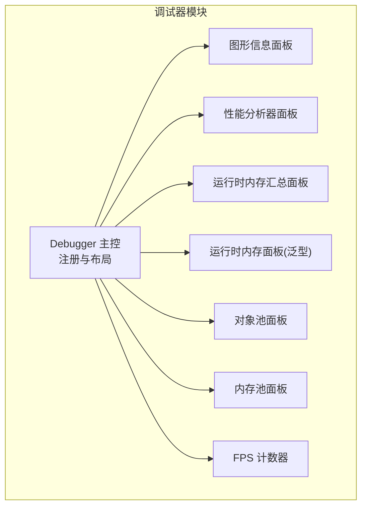
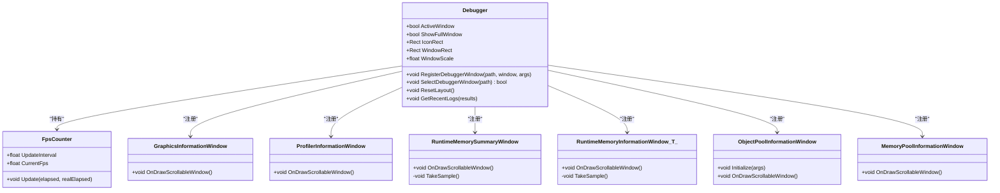
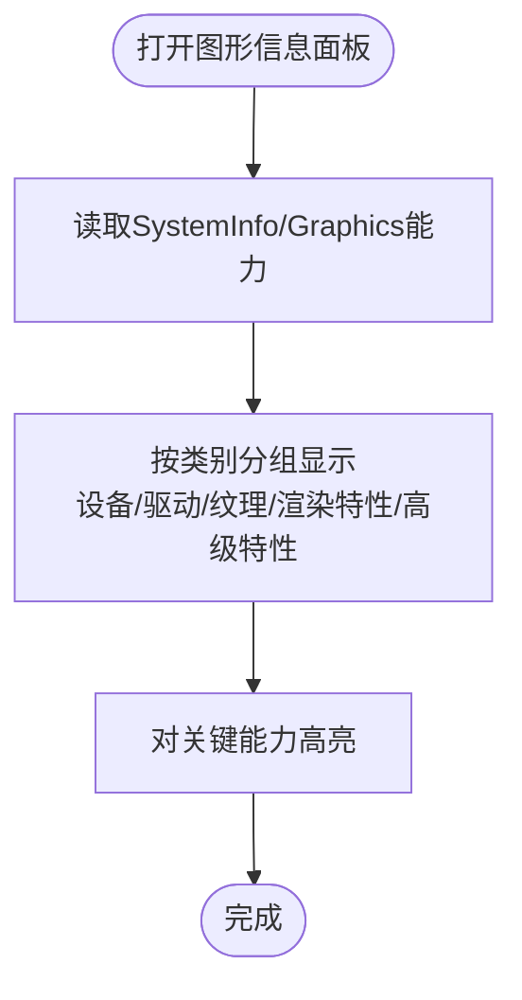
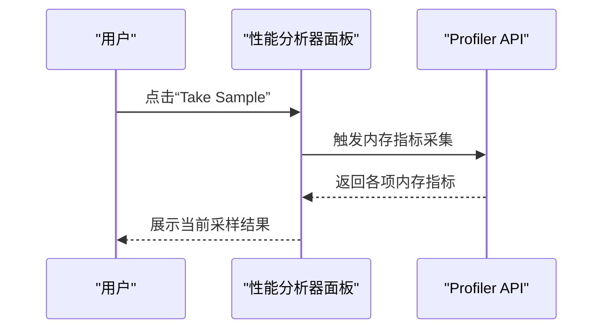
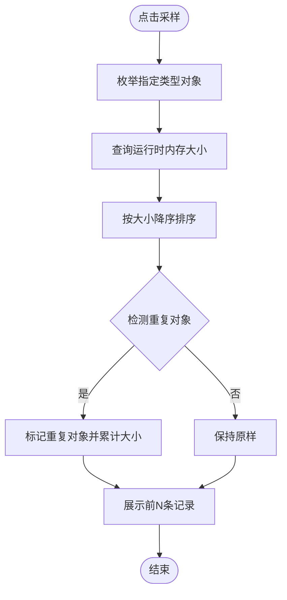
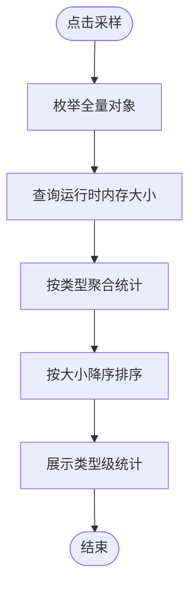
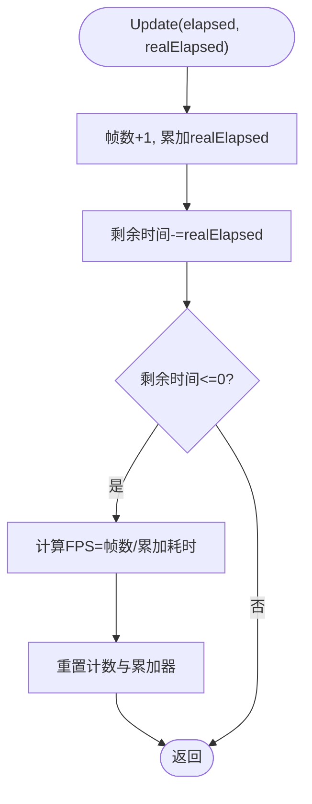
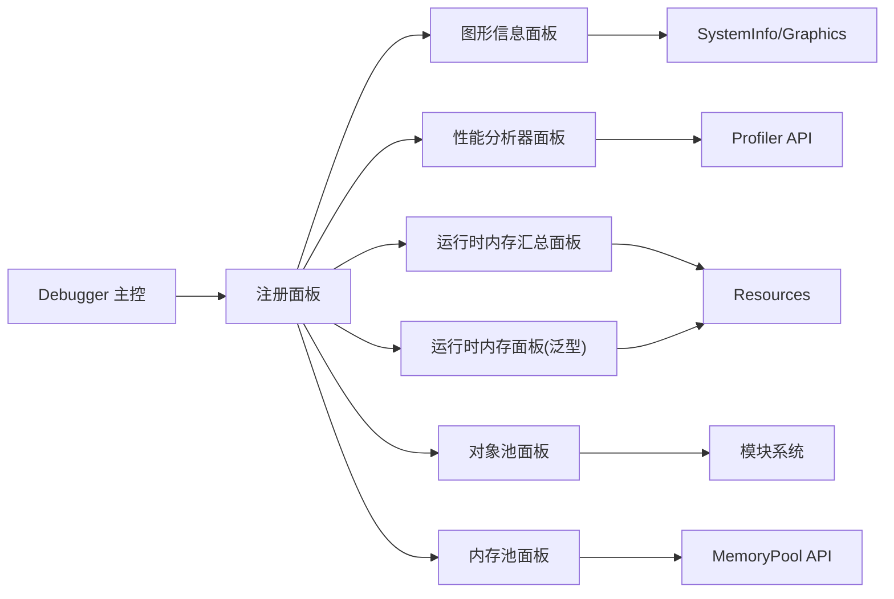

# 图形监控面板

<cite>
**本文档引用的文件**
- [Debugger.cs](file://Assets/TEngine/Runtime/Module/DebugerModule/Debugger.cs)
- [DebuggerComponent.FpsCounter.cs](file://Assets/TEngine/Runtime/Module/DebugerModule/DebuggerComponent.FpsCounter.cs)
- [DebuggerModule.GraphicsInformationWindow.cs](file://Assets/TEngine/Runtime/Module/DebugerModule/Component/DebuggerModule.GraphicsInformationWindow.cs)
- [DebuggerModule.ProfilerInformationWindow.cs](file://Assets/TEngine/Runtime/Module/DebugerModule/Component/DebuggerModule.ProfilerInformationWindow.cs)
- [DebuggerModule.RuntimeMemoryInformationWindow.cs](file://Assets/TEngine/Runtime/Module/DebugerModule/Component/DebuggerModule.RuntimeMemoryInformationWindow.cs)
- [DebuggerModule.RuntimeMemorySummaryWindow.cs](file://Assets/TEngine/Runtime/Module/DebugerModule/Component/DebuggerModule.RuntimeMemorySummaryWindow.cs)
- [DebuggerModule.ObjectPoolInformationWindow.cs](file://Assets/TEngine/Runtime/Module/DebugerModule/Component/DebuggerModule.ObjectPoolInformationWindow.cs)
- [DebuggerModule.MemoryPoolInformationWindow.cs](file://Assets/TEngine/Runtime/Module/DebugerModule/Component/DebuggerModule.MemoryPoolInformationWindow.cs)
- [Utility.MaterialHelper.cs](file://Assets/TEngine/Runtime/Extension/Material/Utility.MaterialHelper.cs)
- [TMPro.cginc](file://Assets/TextMesh Pro/Shaders/TMPro.cginc)
- [zd_img_light.png.meta](file://Assets/AssetRaw/UIRaw/Atlas/Battle/zd_img_light.png.meta)
- [Slider11_Fill_Red.png.meta](file://Assets/AssetRaw/UIRaw/Atlas/Battle/Slider11_Fill_Red.png.meta)
- [Slider11_Frame.png.meta](file://Assets/AssetRaw/UIRaw/Atlas/Battle/Slider11_Frame.png.meta)
- [Slider11_Fill_Yellow.png.meta](file://Assets/AssetRaw/UIRaw/Atlas/Battle/Slider11_Fill_Yellow.png.meta)
- [Play_Joystick_bg.png.meta](file://Assets/AssetRaw/UIRaw/Atlas/Battle/Play_Joystick_bg.png.meta)
- [Play_Joystick_handle.png.meta](file://Assets/AssetRaw/UIRaw/Atlas/Battle/Play_Joystick_handle.png.meta)
- [Slider11_Fill_Blue.png.meta](file://Assets/AssetRaw/UIRaw/Atlas/Battle/Slider11_Fill_Blue.png.meta)
</cite>

## 目录
1. [简介](#简介)
2. [项目结构](#项目结构)
3. [核心组件](#核心组件)
4. [架构总览](#架构总览)
5. [详细组件分析](#详细组件分析)
6. [依赖关系分析](#依赖关系分析)
7. [性能考量](#性能考量)
8. [故障排查指南](#故障排查指南)
9. [结论](#结论)
10. [附录](#附录)

## 简介
本文件面向TEngine图形监控面板的技术文档，系统性阐述图形信息面板的实现机制与性能分析器面板的功能特性，并给出图形资源监控策略、优化建议与可视化展示方案。重点覆盖以下方面：
- 图形信息面板：渲染管线信息、材质数量统计、纹理使用情况、DrawCall次数、三角形数量、着色器编译信息等
- 性能分析器面板：GPU内存使用、CPU/GPU时间线、渲染性能瓶颈分析、帧时间统计等
- 图形资源监控：纹理压缩格式、材质属性分析、渲染队列统计等
- 实用建议：性能优化策略、常见问题诊断方法、监控数据可视化展示

## 项目结构
TEngine的调试器模块以“窗口化”方式组织，通过统一的Debugger入口注册并管理各类调试面板（信息面板、性能面板、内存面板等）。图形监控相关功能主要集中在以下文件：
- 调试器主控：[Debugger.cs](file://Assets/TEngine/Runtime/Module/DebugerModule/Debugger.cs)
- FPS计数器：[DebuggerComponent.FpsCounter.cs](file://Assets/TEngine/Runtime/Module/DebugerModule/DebuggerComponent.FpsCounter.cs)
- 图形信息面板：[DebuggerModule.GraphicsInformationWindow.cs](file://Assets/TEngine/Runtime/Module/DebugerModule/Component/DebuggerModule.GraphicsInformationWindow.cs)
- 性能分析器面板：[DebuggerModule.ProfilerInformationWindow.cs](file://Assets/TEngine/Runtime/Module/DebugerModule/Component/DebuggerModule.ProfilerInformationWindow.cs)
- 运行时内存面板（泛型）：[DebuggerModule.RuntimeMemoryInformationWindow.cs](file://Assets/TEngine/Runtime/Module/DebugerModule/Component/DebuggerModule.RuntimeMemoryInformationWindow.cs)
- 运行时内存汇总面板：[DebuggerModule.RuntimeMemorySummaryWindow.cs](file://Assets/TEngine/Runtime/Module/DebugerModule/Component/DebuggerModule.RuntimeMemorySummaryWindow.cs)
- 对象池面板：[DebuggerModule.ObjectPoolInformationWindow.cs](file://Assets/TEngine/Runtime/Module/DebugerModule/Component/DebuggerModule.ObjectPoolInformationWindow.cs)
- 内存池面板：[DebuggerModule.MemoryPoolInformationWindow.cs](file://Assets/TEngine/Runtime/Module/DebugerModule/Component/DebuggerModule.MemoryPoolInformationWindow.cs)
- 材质工具辅助：[Utility.MaterialHelper.cs](file://Assets/TEngine/Runtime/Extension/Material/Utility.MaterialHelper.cs)
- 文本网格着色器辅助：[TMPro.cginc](file://Assets/TextMesh Pro/Shaders/TMPro.cginc)
- 纹理元数据示例：[zd_img_light.png.meta](file://Assets/AssetRaw/UIRaw/Atlas/Battle/zd_img_light.png.meta) 等

**图表来源**
- [Debugger.cs:183-235](file://Assets/TEngine/Runtime/Module/DebugerModule/Debugger.cs#L183-L235)
- [DebuggerComponent.FpsCounter.cs:1-68](file://Assets/TEngine/Runtime/Module/DebugerModule/DebuggerComponent.FpsCounter.cs#L1-L68)
- [DebuggerModule.GraphicsInformationWindow.cs:1-163](file://Assets/TEngine/Runtime/Module/DebugerModule/Component/DebuggerModule.GraphicsInformationWindow.cs#L1-L163)
- [DebuggerModule.ProfilerInformationWindow.cs:1-60](file://Assets/TEngine/Runtime/Module/DebugerModule/Component/DebuggerModule.ProfilerInformationWindow.cs#L1-L60)
- [DebuggerModule.RuntimeMemorySummaryWindow.cs:1-123](file://Assets/TEngine/Runtime/Module/DebugerModule/Component/DebuggerModule.RuntimeMemorySummaryWindow.cs#L1-L123)
- [DebuggerModule.RuntimeMemoryInformationWindow.cs:1-135](file://Assets/TEngine/Runtime/Module/DebugerModule/Component/DebuggerModule.RuntimeMemoryInformationWindow.cs#L1-L135)
- [DebuggerModule.ObjectPoolInformationWindow.cs:1-88](file://Assets/TEngine/Runtime/Module/DebugerModule/Component/DebuggerModule.ObjectPoolInformationWindow.cs#L1-L88)
- [DebuggerModule.MemoryPoolInformationWindow.cs:1-107](file://Assets/TEngine/Runtime/Module/DebugerModule/Component/DebuggerModule.MemoryPoolInformationWindow.cs#L1-L107)

**章节来源**
- [Debugger.cs:183-235](file://Assets/TEngine/Runtime/Module/DebugerModule/Debugger.cs#L183-L235)

## 核心组件
- 调试器主控（Debugger）
  - 负责注册所有调试面板、维护窗口状态、绘制UI、保存布局配置
  - 提供FPS计数器集成，实时显示帧率
  - 统一管理调试器窗口树与当前选中面板
- FPS计数器（FpsCounter）
  - 按固定更新间隔计算平均帧率，避免频繁刷新带来的抖动
- 图形信息面板（GraphicsInformationWindow）
  - 展示设备能力、渲染特性、纹理支持、着色器级别等硬件/驱动信息
- 性能分析器面板（ProfilerInformationWindow）
  - 展示Profiler支持状态、启用状态、内存占用等运行时性能指标
- 运行时内存面板（RuntimeMemoryInformationWindow<T>）
  - 针对任意Unity Object类型进行采样，按大小排序展示对象列表
- 运行时内存汇总面板（RuntimeMemorySummaryWindow）
  - 对全量对象按类型聚合统计，展示类型维度的计数与内存占用
- 对象池面板（ObjectPoolInformationWindow）
  - 展示对象池集合与每个对象池的使用详情
- 内存池面板（MemoryPoolInformationWindow）
  - 展示内存池的使用统计与类名维度的分配释放计数

**章节来源**
- [Debugger.cs:116-141](file://Assets/TEngine/Runtime/Module/DebugerModule/Debugger.cs#L116-L141)
- [DebuggerComponent.FpsCounter.cs:43-56](file://Assets/TEngine/Runtime/Module/DebugerModule/DebuggerComponent.FpsCounter.cs#L43-L56)
- [DebuggerModule.GraphicsInformationWindow.cs:9-160](file://Assets/TEngine/Runtime/Module/DebugerModule/Component/DebuggerModule.GraphicsInformationWindow.cs#L9-L160)
- [DebuggerModule.ProfilerInformationWindow.cs:12-56](file://Assets/TEngine/Runtime/Module/DebugerModule/Component/DebuggerModule.ProfilerInformationWindow.cs#L12-L56)
- [DebuggerModule.RuntimeMemoryInformationWindow.cs:23-114](file://Assets/TEngine/Runtime/Module/DebugerModule/Component/DebuggerModule.RuntimeMemoryInformationWindow.cs#L23-L114)
- [DebuggerModule.RuntimeMemorySummaryWindow.cs:20-102](file://Assets/TEngine/Runtime/Module/DebugerModule/Component/DebuggerModule.RuntimeMemorySummaryWindow.cs#L20-L102)
- [DebuggerModule.ObjectPoolInformationWindow.cs:12-35](file://Assets/TEngine/Runtime/Module/DebugerModule/Component/DebuggerModule.ObjectPoolInformationWindow.cs#L12-L35)
- [DebuggerModule.MemoryPoolInformationWindow.cs:20-78](file://Assets/TEngine/Runtime/Module/DebugerModule/Component/DebuggerModule.MemoryPoolInformationWindow.cs#L20-L78)

## 架构总览
调试器采用“主控-面板”的分层架构，主控负责生命周期与UI布局，各面板独立实现具体监控项。

**图表来源**
- [Debugger.cs:183-235](file://Assets/TEngine/Runtime/Module/DebugerModule/Debugger.cs#L183-L235)
- [DebuggerComponent.FpsCounter.cs:5-68](file://Assets/TEngine/Runtime/Module/DebugerModule/DebuggerComponent.FpsCounter.cs#L5-L68)
- [DebuggerModule.GraphicsInformationWindow.cs:7-160](file://Assets/TEngine/Runtime/Module/DebugerModule/Component/DebuggerModule.GraphicsInformationWindow.cs#L7-L160)
- [DebuggerModule.ProfilerInformationWindow.cs:10-56](file://Assets/TEngine/Runtime/Module/DebugerModule/Component/DebuggerModule.ProfilerInformationWindow.cs#L10-L56)
- [DebuggerModule.RuntimeMemorySummaryWindow.cs:12-102](file://Assets/TEngine/Runtime/Module/DebugerModule/Component/DebuggerModule.RuntimeMemorySummaryWindow.cs#L12-L102)
- [DebuggerModule.RuntimeMemoryInformationWindow.cs:12-114](file://Assets/TEngine/Runtime/Module/DebugerModule/Component/DebuggerModule.RuntimeMemoryInformationWindow.cs#L12-L114)
- [DebuggerModule.ObjectPoolInformationWindow.cs:8-35](file://Assets/TEngine/Runtime/Module/DebugerModule/Component/DebuggerModule.ObjectPoolInformationWindow.cs#L8-L35)
- [DebuggerModule.MemoryPoolInformationWindow.cs:9-78](file://Assets/TEngine/Runtime/Module/DebugerModule/Component/DebuggerModule.MemoryPoolInformationWindow.cs#L9-L78)

## 详细组件分析

### 图形信息面板（渲染管线与设备能力）
- 功能要点
  - 设备与驱动信息：设备ID/名称/厂商、设备类型、设备版本、显存容量、多线程渲染、渲染线程模式等
  - 着色器与渲染特性：着色器级别（Shader Model）、全局最大LOD、全局渲染管线、OpenGLES最低版本、活动纹理层级、色彩空间、帧缓冲Alpha保留等
  - 纹理与渲染目标：NPOT支持、最大纹理尺寸、支持的渲染目标数量、随机写入目标数量、拷贝纹理支持、反转Z缓冲、立方体/3D纹理支持、阴影支持、图像特效支持、渲染到立方体贴图支持等
  - 计算着色器与高级特性：计算着色器支持、实例化支持、2D数组纹理、运动矢量、立方体数组纹理、3D渲染纹理、纹理镜像重复一次、图形围栏/GPU围栏、异步计算、多重采样纹理、异步GPU回读、32位索引缓冲、硬件四边形拓扑、Mip流、自动解析多重采样、分离式渲染目标混合、设置常量缓冲区、几何着色器、光线追踪、细分着色器、保守光栅、GPU录制器、多重视图、从顶点着色器输出渲染目标数组索引等
- 数据来源
  - 使用Unity SystemInfo与Graphics静态属性进行查询，覆盖多个Unity版本差异
- 可视化建议
  - 将能力项按类别分组折叠显示，支持搜索与筛选
  - 对关键能力（如实例化、计算着色器、光线追踪）高亮提示

**图表来源**
- [DebuggerModule.GraphicsInformationWindow.cs:9-160](file://Assets/TEngine/Runtime/Module/DebugerModule/Component/DebuggerModule.GraphicsInformationWindow.cs#L9-L160)

**章节来源**
- [DebuggerModule.GraphicsInformationWindow.cs:9-160](file://Assets/TEngine/Runtime/Module/DebugerModule/Component/DebuggerModule.GraphicsInformationWindow.cs#L9-L160)

### 性能分析器面板（Profiler指标）
- 功能要点
  - Profiler支持与启用状态、二进制日志、分配调用栈（部分版本）
  - 内存指标：Mono使用大小、Mono堆大小、Used Heap Size、总分配/保留/未用保留内存、图形驱动分配内存、临时分配器大小、Marshal缓存HGlobal大小等
- 数据来源
  - 使用Unity Profiler API进行查询，兼容不同Unity版本的接口差异
- 可视化建议
  - 提供“采样”按钮触发一次快照，对比前后变化
  - 将关键指标以趋势线或柱状图展示（在上层UI中扩展）

**图表来源**
- [DebuggerModule.ProfilerInformationWindow.cs:12-56](file://Assets/TEngine/Runtime/Module/DebugerModule/Component/DebuggerModule.ProfilerInformationWindow.cs#L12-L56)

**章节来源**
- [DebuggerModule.ProfilerInformationWindow.cs:12-56](file://Assets/TEngine/Runtime/Module/DebugerModule/Component/DebuggerModule.ProfilerInformationWindow.cs#L12-L56)

### 运行时内存面板（对象级采样）
- 功能要点
  - 支持任意Unity Object类型（Texture、Mesh、Material、Shader、AnimationClip、AudioClip、Font、TextAsset、ScriptableObject等）
  - 采样后按对象大小降序排列，高亮重复对象（同名同类型同大小）
  - 限制每页展示数量，避免大数据集导致UI卡顿
- 数据来源
  - 使用Resources.FindObjectsOfTypeAll<T>()与Profiler.GetRuntimeMemorySizeLong/GetRuntimeMemorySize进行采样
- 可视化建议
  - 提供“去重高亮”与“排序规则”切换
  - 支持导出采样结果为文本或CSV

**图表来源**
- [DebuggerModule.RuntimeMemoryInformationWindow.cs:82-114](file://Assets/TEngine/Runtime/Module/DebugerModule/Component/DebuggerModule.RuntimeMemoryInformationWindow.cs#L82-L114)

**章节来源**
- [DebuggerModule.RuntimeMemoryInformationWindow.cs:23-114](file://Assets/TEngine/Runtime/Module/DebugerModule/Component/DebuggerModule.RuntimeMemoryInformationWindow.cs#L23-L114)

### 运行时内存汇总面板（类型级聚合）
- 功能要点
  - 对全量UnityEngine.Object进行采样，按类型聚合统计
  - 展示类型名称、对象数量、总内存占用
- 数据来源
  - 使用Resources.FindObjectsOfTypeAll<UnityEngine.Object>()与Profiler.GetRuntimeMemorySizeLong/GetRuntimeMemorySize进行聚合
- 可视化建议
  - 类型维度的饼图/柱状图展示占比
  - 支持按大小/数量排序与筛选

**图表来源**
- [DebuggerModule.RuntimeMemorySummaryWindow.cs:61-102](file://Assets/TEngine/Runtime/Module/DebugerModule/Component/DebuggerModule.RuntimeMemorySummaryWindow.cs#L61-L102)

**章节来源**
- [DebuggerModule.RuntimeMemorySummaryWindow.cs:20-102](file://Assets/TEngine/Runtime/Module/DebugerModule/Component/DebuggerModule.RuntimeMemorySummaryWindow.cs#L20-L102)

### FPS计数器（帧时间统计）
- 功能要点
  - 固定更新间隔内累计帧数与耗时，计算平均帧率
  - 提供更新间隔可调，避免过频刷新
- 可视化建议
  - 在调试器图标上直接显示当前FPS
  - 扩展为折线图展示帧时间序列

**图表来源**
- [DebuggerComponent.FpsCounter.cs:43-56](file://Assets/TEngine/Runtime/Module/DebugerModule/DebuggerComponent.FpsCounter.cs#L43-L56)

**章节来源**
- [DebuggerComponent.FpsCounter.cs:43-56](file://Assets/TEngine/Runtime/Module/DebugerModule/DebuggerComponent.FpsCounter.cs#L43-L56)

### 对象池与内存池面板（资源生命周期监控）
- 功能要点
  - 对象池：展示池总数、每个池的容量、使用计数、可释放计数、优先级、对象使用信息
  - 内存池：展示启用严格检查、池总数；按程序集分组展示类名维度的unused/using/acquire/release/add/remove计数
- 可视化建议
  - 对象池：表格+状态颜色（超限/长期未释放）
  - 内存池：按程序集折叠，支持切换显示完整类名

**章节来源**
- [DebuggerModule.ObjectPoolInformationWindow.cs:22-84](file://Assets/TEngine/Runtime/Module/DebugerModule/Component/DebuggerModule.ObjectPoolInformationWindow.cs#L22-L84)
- [DebuggerModule.MemoryPoolInformationWindow.cs:20-103](file://Assets/TEngine/Runtime/Module/DebugerModule/Component/DebuggerModule.MemoryPoolInformationWindow.cs#L20-L103)

### 材质与纹理监控策略
- 材质修复与着色器同步
  - 场景加载后修复材质着色器，确保与当前渲染管线一致
- 纹理压缩与平台适配
  - 通过纹理meta文件查看压缩质量、压缩方式、平台设置
  - 建议：针对不同平台选择合适的压缩格式与质量，平衡体积与画质
- 纹理元数据示例
  - 示例展示了DefaultTexturePlatform/Standalone/Android/Server等平台的压缩质量与格式设置

**章节来源**
- [Utility.MaterialHelper.cs:75-96](file://Assets/TEngine/Runtime/Extension/Material/Utility.MaterialHelper.cs#L75-L96)
- [zd_img_light.png.meta:67-103](file://Assets/AssetRaw/UIRaw/Atlas/Battle/zd_img_light.png.meta#L67-L103)
- [Slider11_Fill_Red.png.meta:67-103](file://Assets/AssetRaw/UIRaw/Atlas/Battle/Slider11_Fill_Red.png.meta#L67-L103)
- [Slider11_Frame.png.meta:67-103](file://Assets/AssetRaw/UIRaw/Atlas/Battle/Slider11_Frame.png.meta#L67-L103)
- [Slider11_Fill_Yellow.png.meta:67-103](file://Assets/AssetRaw/UIRaw/Atlas/Battle/Slider11_Fill_Yellow.png.meta#L67-L103)
- [Play_Joystick_bg.png.meta:67-103](file://Assets/AssetRaw/UIRaw/Atlas/Battle/Play_Joystick_bg.png.meta#L67-L103)
- [Play_Joystick_handle.png.meta:67-103](file://Assets/AssetRaw/UIRaw/Atlas/Battle/Play_Joystick_handle.png.meta#L67-L103)
- [Slider11_Fill_Blue.png.meta:67-103](file://Assets/AssetRaw/UIRaw/Atlas/Battle/Slider11_Fill_Blue.png.meta#L67-L103)

## 依赖关系分析
- 调试器主控依赖于模块系统获取调试器模块，注册各子面板
- 各面板依赖Unity API（SystemInfo、Graphics、Profiler、Resources）进行数据采集
- 材质与纹理监控依赖资源系统与平台设置

**图表来源**
- [Debugger.cs:183-235](file://Assets/TEngine/Runtime/Module/DebugerModule/Debugger.cs#L183-L235)
- [DebuggerModule.GraphicsInformationWindow.cs:14-90](file://Assets/TEngine/Runtime/Module/DebugerModule/Component/DebuggerModule.GraphicsInformationWindow.cs#L14-L90)
- [DebuggerModule.ProfilerInformationWindow.cs:17-54](file://Assets/TEngine/Runtime/Module/DebugerModule/Component/DebuggerModule.ProfilerInformationWindow.cs#L17-L54)
- [DebuggerModule.RuntimeMemorySummaryWindow.cs:68-99](file://Assets/TEngine/Runtime/Module/DebugerModule/Component/DebuggerModule.RuntimeMemorySummaryWindow.cs#L68-L99)
- [DebuggerModule.RuntimeMemoryInformationWindow.cs:90-101](file://Assets/TEngine/Runtime/Module/DebugerModule/Component/DebuggerModule.RuntimeMemoryInformationWindow.cs#L90-L101)
- [DebuggerModule.ObjectPoolInformationWindow.cs:14-20](file://Assets/TEngine/Runtime/Module/DebugerModule/Component/DebuggerModule.ObjectPoolInformationWindow.cs#L14-L20)
- [DebuggerModule.MemoryPoolInformationWindow.cs:32-44](file://Assets/TEngine/Runtime/Module/DebugerModule/Component/DebuggerModule.MemoryPoolInformationWindow.cs#L32-L44)

**章节来源**
- [Debugger.cs:183-235](file://Assets/TEngine/Runtime/Module/DebugerModule/Debugger.cs#L183-L235)

## 性能考量
- FPS与帧时间
  - FPS由固定更新间隔内的帧数与累计耗时决定，建议将更新间隔设为0.5~1秒，避免频繁刷新
- 内存采样开销
  - 采样全量对象会带来一定开销，建议在开发阶段使用，发布版本谨慎开启
- UI渲染压力
  - 大量对象列表展示时，建议限制每页展示数量并提供分页/筛选
- 平台差异
  - 不同Unity版本的Profiler API存在差异，需注意条件编译与兼容处理

## 故障排查指南
- 调试器不显示
  - 检查ActiveWindow类型与构建环境（开发构建/编辑器）
  - 确认UIRoot/EventSystem存在且可激活
- FPS异常
  - 检查UpdateInterval是否合理，确认unscaledDeltaTime使用正确
- 内存采样无数据
  - 确认Profiler.supported与Profiler.enabled状态
  - 检查目标类型是否存在实例
- 材质着色器不匹配
  - 使用材质修复工具等待场景根对象加载完成后再执行修复

**章节来源**
- [Debugger.cs:217-234](file://Assets/TEngine/Runtime/Module/DebugerModule/Debugger.cs#L217-L234)
- [DebuggerComponent.FpsCounter.cs:13-23](file://Assets/TEngine/Runtime/Module/DebugerModule/DebuggerComponent.FpsCounter.cs#L13-L23)
- [DebuggerModule.ProfilerInformationWindow.cs:17-18](file://Assets/TEngine/Runtime/Module/DebugerModule/Component/DebuggerModule.ProfilerInformationWindow.cs#L17-L18)
- [Utility.MaterialHelper.cs:92-96](file://Assets/TEngine/Runtime/Extension/Material/Utility.MaterialHelper.cs#L92-L96)

## 结论
TEngine图形监控面板通过“主控-面板”架构实现了对图形设备能力、运行时内存、对象池/内存池以及帧率的全面监控。结合材质与纹理的平台适配策略，可有效支撑图形性能优化与问题诊断。建议在开发阶段充分利用这些面板进行迭代优化，并在发布版本中谨慎启用高开销的监控项。

## 附录
- 文本网格着色器辅助（TMPro.cginc）可用于理解字体/文本渲染的内部实现细节，便于定位文本相关性能问题
- 纹理meta文件展示了不同平台的压缩设置，便于制定纹理优化策略

**章节来源**
- [TMPro.cginc:57-83](file://Assets/TextMesh Pro/Shaders/TMPro.cginc#L57-L83)