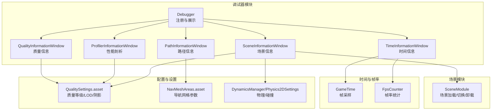
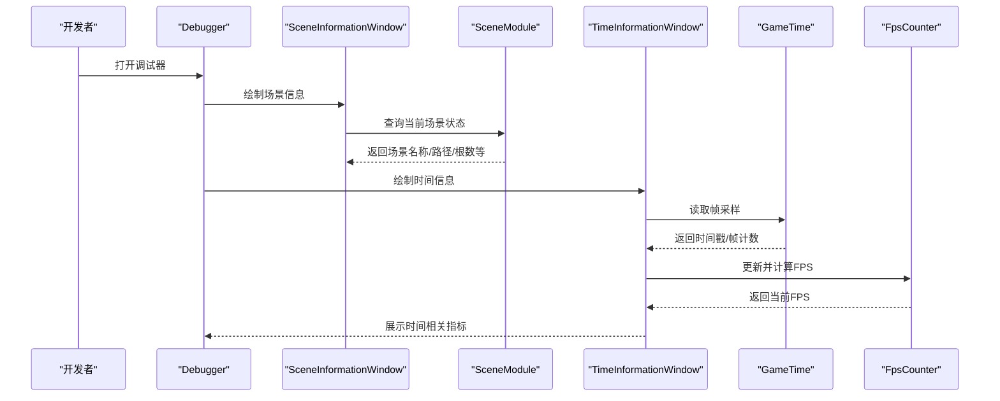
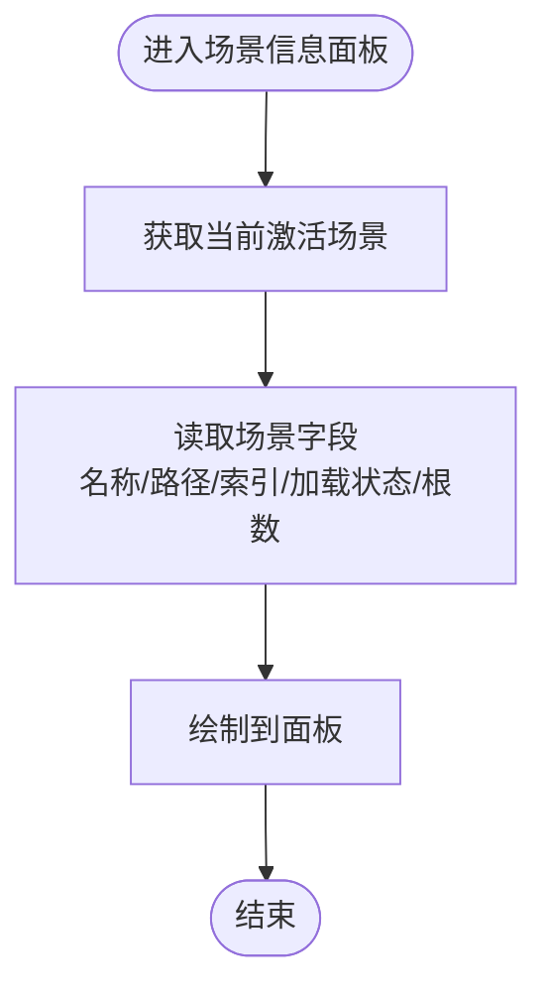
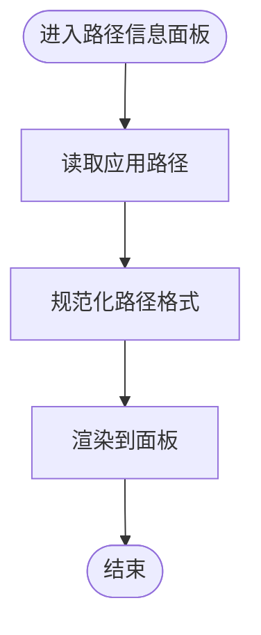
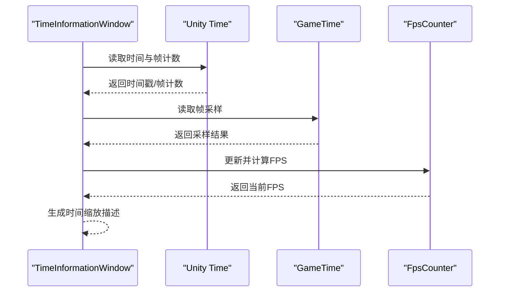
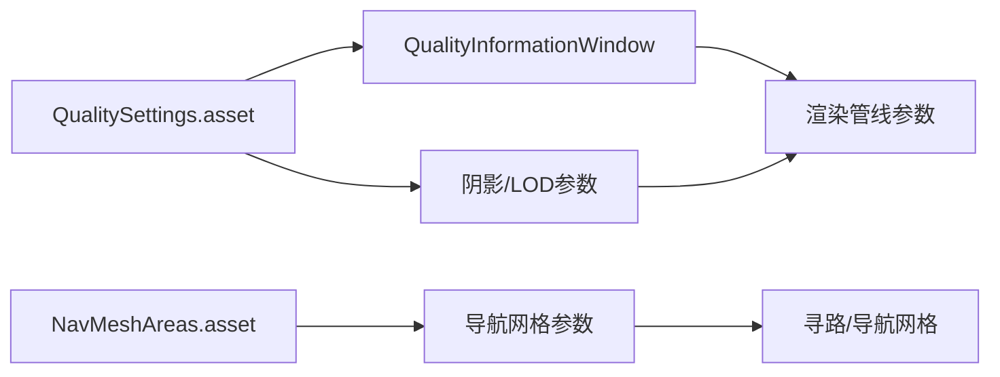
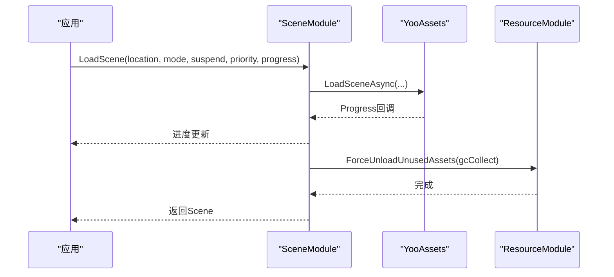
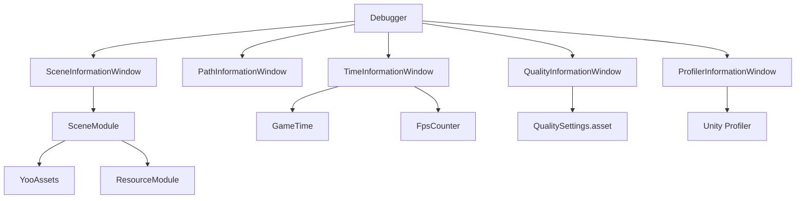

# 场景监控面板

<cite>
**本文档引用的文件**
- [Assets/TEngine/Runtime/Module/DebugerModule/Debugger.cs](file://Assets/TEngine/Runtime/Module/DebugerModule/Debugger.cs)
- [Assets/TEngine/Runtime/Module/DebugerModule/Component/DebuggerModule.SceneInformationWindow.cs](file://Assets/TEngine/Runtime/Module/DebugerModule/Component/DebuggerModule.SceneInformationWindow.cs)
- [Assets/TEngine/Runtime/Module/DebugerModule/Component/DebuggerModule.PathInformationWindow.cs](file://Assets/TEngine/Runtime/Module/DebugerModule/Component/DebuggerModule.PathInformationWindow.cs)
- [Assets/TEngine/Runtime/Module/DebugerModule/Component/DebuggerModule.TimeInformationWindow.cs](file://Assets/TEngine/Runtime/Module/DebugerModule/Component/DebuggerModule.TimeInformationWindow.cs)
- [Assets/TEngine/Runtime/Module/DebugerModule/Component/DebuggerModule.QualityInformationWindow.cs](file://Assets/TEngine/Runtime/Module/DebugerModule/Component/DebuggerModule.QualityInformationWindow.cs)
- [Assets/TEngine/Runtime/Module/DebugerModule/Component/DebuggerModule.ProfilerInformationWindow.cs](file://Assets/TEngine/Runtime/Module/DebugerModule/Component/DebuggerModule.ProfilerInformationWindow.cs)
- [Assets/TEngine/Runtime/Module/DebugerModule/DebuggerComponent.FpsCounter.cs](file://Assets/TEngine/Runtime/Module/DebugerModule/DebuggerComponent.FpsCounter.cs)
- [Assets/TEngine/Runtime/Module/SceneModule/SceneModule.cs](file://Assets/TEngine/Runtime/Module/SceneModule/SceneModule.cs)
- [Assets/TEngine/Runtime/Core/GameTime/GameTime.cs](file://Assets/TEngine/Runtime/Core/GameTime/GameTime.cs)
- [ProjectSettings/NavMeshAreas.asset](file://ProjectSettings/NavMeshAreas.asset)
- [ProjectSettings/QualitySettings.asset](file://ProjectSettings/QualitySettings.asset)
- [ProjectSettings/DynamicsManager.asset](file://ProjectSettings/DynamicsManager.asset)
- [ProjectSettings/Physics2DSettings.asset](file://ProjectSettings/Physics2DSettings.asset)
- [Assets/TEngine/Runtime/Module/ResourceModule/ResourceModule.cs](file://Assets/TEngine/Runtime/Module/ResourceModule/ResourceModule.cs)
</cite>

## 目录
1. [简介](#简介)
2. [项目结构](#项目结构)
3. [核心组件](#核心组件)
4. [架构总览](#架构总览)
5. [详细组件分析](#详细组件分析)
6. [依赖关系分析](#依赖关系分析)
7. [性能考量](#性能考量)
8. [故障排查指南](#故障排查指南)
9. [结论](#结论)
10. [附录](#附录)

## 简介
本文件围绕 TEngine 的场景监控面板展开，系统性梳理“场景信息面板”“路径信息面板”“时间信息面板”的实现机制与数据来源，覆盖场景名称、加载状态、对象数量统计、LOD 与质量设置、碰撞与物理、光照与阴影、寻路与导航网格、帧率与时间缩放等关键主题。同时提供大型场景管理策略、场景切换优化技巧与性能优化建议，帮助开发者在复杂场景中实现稳定、可观测、可调优的运行时表现。

## 项目结构
TEngine 将调试器作为独立模块集成，场景监控面板由调试器模块统一注册与呈现；场景加载与切换由 SceneModule 提供；时间与帧率统计由 Debugger 内部的 FPS 计数器与 GameTime 采样共同支撑；质量与渲染参数由 QualitySettings 与 ProjectSettings 配置驱动；物理与碰撞由 DynamicsManager/Physics2DSettings 控制；导航网格与寻路参数由 NavMeshAreas 配置。

图示来源
- [Assets/TEngine/Runtime/Module/DebugerModule/Debugger.cs:183-204](file://Assets/TEngine/Runtime/Module/DebugerModule/Debugger.cs#L183-L204)
- [Assets/TEngine/Runtime/Module/DebugerModule/Component/DebuggerModule.SceneInformationWindow.cs:10-34](file://Assets/TEngine/Runtime/Module/DebugerModule/Component/DebuggerModule.SceneInformationWindow.cs#L10-L34)
- [Assets/TEngine/Runtime/Module/DebugerModule/Component/DebuggerModule.PathInformationWindow.cs:10-25](file://Assets/TEngine/Runtime/Module/DebugerModule/Component/DebuggerModule.PathInformationWindow.cs#L10-L25)
- [Assets/TEngine/Runtime/Module/DebugerModule/Component/DebuggerModule.TimeInformationWindow.cs:10-46](file://Assets/TEngine/Runtime/Module/DebugerModule/Component/DebuggerModule.TimeInformationWindow.cs#L10-L46)
- [Assets/TEngine/Runtime/Module/DebugerModule/Component/DebuggerModule.QualityInformationWindow.cs:11-103](file://Assets/TEngine/Runtime/Module/DebugerModule/Component/DebuggerModule.QualityInformationWindow.cs#L11-L103)
- [Assets/TEngine/Runtime/Module/DebugerModule/Component/DebuggerModule.ProfilerInformationWindow.cs:12-55](file://Assets/TEngine/Runtime/Module/DebugerModule/Component/DebuggerModule.ProfilerInformationWindow.cs#L12-L55)
- [Assets/TEngine/Runtime/Module/SceneModule/SceneModule.cs:49-200](file://Assets/TEngine/Runtime/Module/SceneModule/SceneModule.cs#L49-L200)
- [Assets/TEngine/Runtime/Core/GameTime/GameTime.cs:45-53](file://Assets/TEngine/Runtime/Core/GameTime/GameTime.cs#L45-L53)
- [ProjectSettings/QualitySettings.asset:45-91](file://ProjectSettings/QualitySettings.asset#L45-L91)
- [ProjectSettings/NavMeshAreas.asset:1-93](file://ProjectSettings/NavMeshAreas.asset#L1-L93)
- [ProjectSettings/DynamicsManager.asset:1-37](file://ProjectSettings/DynamicsManager.asset#L1-L37)
- [ProjectSettings/Physics2DSettings.asset:44-56](file://ProjectSettings/Physics2DSettings.asset#L44-L56)

章节来源
- [Assets/TEngine/Runtime/Module/DebugerModule/Debugger.cs:183-204](file://Assets/TEngine/Runtime/Module/DebugerModule/Debugger.cs#L183-L204)

## 核心组件
- 场景信息面板：展示当前激活场景的名称、路径、构建索引、是否已加载、根节点数量、子场景标记等基础信息。
- 路径信息面板：展示应用数据目录、持久化数据目录、流式资源目录、临时缓存目录等路径信息，便于定位资源与日志。
- 时间信息面板：展示时间缩放、实时时间、帧计数、Delta 时间、最大 Delta、捕获帧率等，支持时间缩放描述（暂停/正常/变快/变慢）。
- 质量信息面板：展示质量等级、颜色空间、像素光数量、纹理限制、各向异性过滤、抗锯齿、软粒子、软植被、反射探头、阴影质量与距离等。
- 性能剖析面板：展示 Profiler 支持状态、启用状态、二进制日志、内存占用、图形驱动分配等。
- 场景模块：提供场景加载（单场景/叠加）、进度回调、挂起/解除挂起、激活场景切换、卸载子场景等能力。

章节来源
- [Assets/TEngine/Runtime/Module/DebugerModule/Component/DebuggerModule.SceneInformationWindow.cs:10-34](file://Assets/TEngine/Runtime/Module/DebugerModule/Component/DebuggerModule.SceneInformationWindow.cs#L10-L34)
- [Assets/TEngine/Runtime/Module/DebugerModule/Component/DebuggerModule.PathInformationWindow.cs:10-25](file://Assets/TEngine/Runtime/Module/DebugerModule/Component/DebuggerModule.PathInformationWindow.cs#L10-L25)
- [Assets/TEngine/Runtime/Module/DebugerModule/Component/DebuggerModule.TimeInformationWindow.cs:10-46](file://Assets/TEngine/Runtime/Module/DebugerModule/Component/DebuggerModule.TimeInformationWindow.cs#L10-L46)
- [Assets/TEngine/Runtime/Module/DebugerModule/Component/DebuggerModule.QualityInformationWindow.cs:11-103](file://Assets/TEngine/Runtime/Module/DebugerModule/Component/DebuggerModule.QualityInformationWindow.cs#L11-L103)
- [Assets/TEngine/Runtime/Module/DebugerModule/Component/DebuggerModule.ProfilerInformationWindow.cs:12-55](file://Assets/TEngine/Runtime/Module/DebugerModule/Component/DebuggerModule.ProfilerInformationWindow.cs#L12-L55)
- [Assets/TEngine/Runtime/Module/SceneModule/SceneModule.cs:49-200](file://Assets/TEngine/Runtime/Module/SceneModule/SceneModule.cs#L49-L200)

## 架构总览
调试器模块通过统一入口注册各监控面板，面板以滚动窗口形式展示数据；场景模块负责场景生命周期与状态；时间模块通过 GameTime 采样与 Debugger 的 FPS 计数器提供帧率统计；质量与物理设置来自 ProjectSettings 与 QualitySettings；导航网格参数来自 NavMeshAreas。

图示来源
- [Assets/TEngine/Runtime/Module/DebugerModule/Debugger.cs:183-204](file://Assets/TEngine/Runtime/Module/DebugerModule/Debugger.cs#L183-L204)
- [Assets/TEngine/Runtime/Module/DebugerModule/Component/DebuggerModule.SceneInformationWindow.cs:10-34](file://Assets/TEngine/Runtime/Module/DebugerModule/Component/DebuggerModule.SceneInformationWindow.cs#L10-L34)
- [Assets/TEngine/Runtime/Module/SceneModule/SceneModule.cs:276-305](file://Assets/TEngine/Runtime/Module/SceneModule/SceneModule.cs#L276-L305)
- [Assets/TEngine/Runtime/Module/DebugerModule/Component/DebuggerModule.TimeInformationWindow.cs:10-46](file://Assets/TEngine/Runtime/Module/DebugerModule/Component/DebuggerModule.TimeInformationWindow.cs#L10-L46)
- [Assets/TEngine/Runtime/Core/GameTime/GameTime.cs:45-53](file://Assets/TEngine/Runtime/Core/GameTime/GameTime.cs#L45-L53)
- [Assets/TEngine/Runtime/Module/DebugerModule/DebuggerComponent.FpsCounter.cs:43-56](file://Assets/TEngine/Runtime/Module/DebugerModule/DebuggerComponent.FpsCounter.cs#L43-L56)

## 详细组件分析

### 场景信息面板
- 数据来源
  - 场景计数与构建设置中的场景总数
  - 当前激活场景的句柄、名称、路径、构建索引、脏标记、加载状态、有效性、根节点数量、子场景标记（若可用）
- 实现要点
  - 使用 Unity 的 SceneManager 获取当前场景与场景集合信息
  - 面板以只读形式展示，便于快速核验当前场景状态
- 可扩展方向
  - 增加场景内对象数量统计（根节点遍历或资源引用统计）
  - 增加场景加载进度与耗时统计（结合 SceneModule 的进度回调）

图示来源
- [Assets/TEngine/Runtime/Module/DebugerModule/Component/DebuggerModule.SceneInformationWindow.cs:10-34](file://Assets/TEngine/Runtime/Module/DebugerModule/Component/DebuggerModule.SceneInformationWindow.cs#L10-L34)

章节来源
- [Assets/TEngine/Runtime/Module/DebugerModule/Component/DebuggerModule.SceneInformationWindow.cs:10-34](file://Assets/TEngine/Runtime/Module/DebugerModule/Component/DebuggerModule.SceneInformationWindow.cs#L10-L34)

### 路径信息面板
- 功能特性
  - 展示应用工作目录、数据目录、持久化数据目录、流式资源目录、临时缓存目录
  - 在特定 Unity 版本下展示控制台日志目录
- 实现要点
  - 使用 Application 与 Utility.Path 工具类获取并规范化路径
- 实用价值
  - 定位资源加载路径、日志输出位置、缓存清理目标

图示来源
- [Assets/TEngine/Runtime/Module/DebugerModule/Component/DebuggerModule.PathInformationWindow.cs:10-25](file://Assets/TEngine/Runtime/Module/DebugerModule/Component/DebuggerModule.PathInformationWindow.cs#L10-L25)

章节来源
- [Assets/TEngine/Runtime/Module/DebugerModule/Component/DebuggerModule.PathInformationWindow.cs:10-25](file://Assets/TEngine/Runtime/Module/DebugerModule/Component/DebuggerModule.PathInformationWindow.cs#L10-L25)

### 时间信息面板
- 功能实现
  - 展示时间缩放、实时时间、关卡加载以来时间、时间、固定时间、非缩放时间、各类 Delta 时间、平滑 Delta、最大 Delta、粒子最大 Delta、帧计数、渲染帧计数、捕获帧率、固定时间步状态等
  - 时间缩放描述：暂停/正常/变快/变慢
- 实现要点
  - 依赖 Unity Time 与 Debugger 的时间描述逻辑
  - 通过 GameTime 采样与 FPS 计数器提供帧率统计

图示来源
- [Assets/TEngine/Runtime/Module/DebugerModule/Component/DebuggerModule.TimeInformationWindow.cs:10-46](file://Assets/TEngine/Runtime/Module/DebugerModule/Component/DebuggerModule.TimeInformationWindow.cs#L10-L46)
- [Assets/TEngine/Runtime/Core/GameTime/GameTime.cs:45-53](file://Assets/TEngine/Runtime/Core/GameTime/GameTime.cs#L45-L53)
- [Assets/TEngine/Runtime/Module/DebugerModule/DebuggerComponent.FpsCounter.cs:43-56](file://Assets/TEngine/Runtime/Module/DebugerModule/DebuggerComponent.FpsCounter.cs#L43-L56)

章节来源
- [Assets/TEngine/Runtime/Module/DebugerModule/Component/DebuggerModule.TimeInformationWindow.cs:10-46](file://Assets/TEngine/Runtime/Module/DebugerModule/Component/DebuggerModule.TimeInformationWindow.cs#L10-L46)
- [Assets/TEngine/Runtime/Core/GameTime/GameTime.cs:45-53](file://Assets/TEngine/Runtime/Core/GameTime/GameTime.cs#L45-L53)
- [Assets/TEngine/Runtime/Module/DebugerModule/DebuggerComponent.FpsCounter.cs:13-56](file://Assets/TEngine/Runtime/Module/DebugerModule/DebuggerComponent.FpsCounter.cs#L13-L56)

### 质量信息面板与LOD/光照
- 质量等级与渲染
  - 质量等级切换、颜色空间、最大排队帧、像素光数量、纹理主限制、各向异性过滤、抗锯齿、软粒子、软植被、实时反射探头、公告牌朝向相机、分辨率缩放因子、纹理流式传输参数等
- LOD 与阴影
  - LOD 偏置、最大 LOD 等级、阴影质量/分辨率/投影/距离/近平面偏移/级联与分割等
- 导航网格
  - 导航网格区域成本、代理尺寸、瓦片/单元大小、放置精度、作业工作者数、调试标志等

图示来源
- [Assets/TEngine/Runtime/Module/DebugerModule/Component/DebuggerModule.QualityInformationWindow.cs:11-103](file://Assets/TEngine/Runtime/Module/DebugerModule/Component/DebuggerModule.QualityInformationWindow.cs#L11-L103)
- [ProjectSettings/QualitySettings.asset:45-91](file://ProjectSettings/QualitySettings.asset#L45-L91)
- [ProjectSettings/NavMeshAreas.asset:1-93](file://ProjectSettings/NavMeshAreas.asset#L1-L93)

章节来源
- [Assets/TEngine/Runtime/Module/DebugerModule/Component/DebuggerModule.QualityInformationWindow.cs:11-103](file://Assets/TEngine/Runtime/Module/DebugerModule/Component/DebuggerModule.QualityInformationWindow.cs#L11-L103)
- [ProjectSettings/QualitySettings.asset:45-91](file://ProjectSettings/QualitySettings.asset#L45-L91)
- [ProjectSettings/NavMeshAreas.asset:1-93](file://ProjectSettings/NavMeshAreas.asset#L1-L93)

### 性能剖析面板
- 展示内容
  - Profiler 支持与启用状态、二进制日志开关与文件名、分配调用堆栈、区域数量、最大使用内存、Mono/堆内存、总分配/保留/未用保留内存、图形驱动分配、临时分配器大小、Marshal 缓存大小等
- 应用场景
  - 内存峰值定位、GC 触发分析、GPU/显存压力评估

章节来源
- [Assets/TEngine/Runtime/Module/DebugerModule/Component/DebuggerModule.ProfilerInformationWindow.cs:12-55](file://Assets/TEngine/Runtime/Module/DebugerModule/Component/DebuggerModule.ProfilerInformationWindow.cs#L12-L55)

### 场景模块与场景切换
- 加载流程
  - 支持单场景与叠加场景加载，带进度回调与挂起/解除挂起
  - 主场景加载后触发资源强制卸载以回收内存
- 切换与激活
  - ActivateScene 用于多场景环境下的激活切换
- 卸载
  - 子场景异步卸载，支持进度回调

图示来源
- [Assets/TEngine/Runtime/Module/SceneModule/SceneModule.cs:49-200](file://Assets/TEngine/Runtime/Module/SceneModule/SceneModule.cs#L49-L200)
- [Assets/TEngine/Runtime/Module/ResourceModule/ResourceModule.cs:444-448](file://Assets/TEngine/Runtime/Module/ResourceModule/ResourceModule.cs#L444-L448)

章节来源
- [Assets/TEngine/Runtime/Module/SceneModule/SceneModule.cs:49-200](file://Assets/TEngine/Runtime/Module/SceneModule/SceneModule.cs#L49-L200)
- [Assets/TEngine/Runtime/Module/ResourceModule/ResourceModule.cs:444-448](file://Assets/TEngine/Runtime/Module/ResourceModule/ResourceModule.cs#L444-L448)

## 依赖关系分析
- 调试器模块对各面板的依赖为组合关系，面板通过统一注册接口接入调试器窗口树
- 场景信息面板依赖 SceneModule 的当前场景状态查询
- 时间信息面板依赖 GameTime 采样与 FPS 计数器
- 质量信息面板依赖 ProjectSettings 中的质量与渲染配置
- 性能剖析面板依赖 Unity Profiler API
- 场景模块依赖 YooAssets 与 ResourceModule 的资源回收

图示来源
- [Assets/TEngine/Runtime/Module/DebugerModule/Debugger.cs:183-204](file://Assets/TEngine/Runtime/Module/DebugerModule/Debugger.cs#L183-L204)
- [Assets/TEngine/Runtime/Module/DebugerModule/Component/DebuggerModule.SceneInformationWindow.cs:10-34](file://Assets/TEngine/Runtime/Module/DebugerModule/Component/DebuggerModule.SceneInformationWindow.cs#L10-L34)
- [Assets/TEngine/Runtime/Module/DebugerModule/Component/DebuggerModule.TimeInformationWindow.cs:10-46](file://Assets/TEngine/Runtime/Module/DebugerModule/Component/DebuggerModule.TimeInformationWindow.cs#L10-L46)
- [Assets/TEngine/Runtime/Module/DebugerModule/Component/DebuggerModule.QualityInformationWindow.cs:11-103](file://Assets/TEngine/Runtime/Module/DebugerModule/Component/DebuggerModule.QualityInformationWindow.cs#L11-L103)
- [Assets/TEngine/Runtime/Module/DebugerModule/Component/DebuggerModule.ProfilerInformationWindow.cs:12-55](file://Assets/TEngine/Runtime/Module/DebugerModule/Component/DebuggerModule.ProfilerInformationWindow.cs#L12-L55)
- [Assets/TEngine/Runtime/Module/SceneModule/SceneModule.cs:49-200](file://Assets/TEngine/Runtime/Module/SceneModule/SceneModule.cs#L49-L200)
- [Assets/TEngine/Runtime/Module/ResourceModule/ResourceModule.cs:444-448](file://Assets/TEngine/Runtime/Module/ResourceModule/ResourceModule.cs#L444-L448)

## 性能考量
- 帧率统计
  - 使用 FPS 计数器按固定间隔累积帧数与累计时间，计算平均帧率，避免每帧高成本计算
- 时间缩放与固定时间步
  - 合理设置 Time.timeScale 与 Time.maximumDeltaTime，避免极端缩放导致 UI 或动画异常
- 资源回收与场景切换
  - 主场景切换后及时调用资源强制卸载，减少内存峰值
- 质量与LOD
  - 根据设备能力动态调整质量等级与 LOD 偏置，平衡画质与性能
- 物理与碰撞
  - 合理设置 Solver 迭代次数、接触偏移、层碰撞矩阵，降低不必要的射线检测与回调
- 导航网格
  - 调整瓦片大小与单元大小，减少寻路计算开销；在大场景中采用分块/分层寻路策略

## 故障排查指南
- 场景加载卡住
  - 检查 SceneModule 的加载进度回调是否持续推进；确认是否存在重复加载同一场景
- 帧率抖动
  - 查看 TimeInformationWindow 的 Delta/最大 Delta 与 Smooth Delta；检查是否存在长时间任务阻塞主线程
- 内存上涨
  - 使用 ProfilerInformationWindow 观察总分配/保留内存与 Mono 堆；触发资源强制卸载
- 物理/碰撞异常
  - 检查 DynamicsManager/Physics2DSettings 的层碰撞矩阵与 QueriesHitTriggers；确认触发器与碰撞体配置
- 导航网格问题
  - 检查 NavMeshAreas 的区域成本与代理尺寸；确认寻路目标可达性与遮挡

章节来源
- [Assets/TEngine/Runtime/Module/SceneModule/SceneModule.cs:49-200](file://Assets/TEngine/Runtime/Module/SceneModule/SceneModule.cs#L49-L200)
- [Assets/TEngine/Runtime/Module/DebugerModule/Component/DebuggerModule.TimeInformationWindow.cs:10-46](file://Assets/TEngine/Runtime/Module/DebugerModule/Component/DebuggerModule.TimeInformationWindow.cs#L10-L46)
- [Assets/TEngine/Runtime/Module/DebugerModule/Component/DebuggerModule.ProfilerInformationWindow.cs:12-55](file://Assets/TEngine/Runtime/Module/DebugerModule/Component/DebuggerModule.ProfilerInformationWindow.cs#L12-L55)
- [ProjectSettings/DynamicsManager.asset:1-37](file://ProjectSettings/DynamicsManager.asset#L1-L37)
- [ProjectSettings/Physics2DSettings.asset:44-56](file://ProjectSettings/Physics2DSettings.asset#L44-L56)
- [ProjectSettings/NavMeshAreas.asset:1-93](file://ProjectSettings/NavMeshAreas.asset#L1-L93)

## 结论
TEngine 的场景监控面板以调试器模块为核心，串联场景、路径、时间、质量与性能剖析等关键维度，配合 SceneModule 的场景生命周期管理与 ResourceModule 的资源回收机制，形成一套可观测、可诊断、可调优的运行时体系。通过合理配置质量与 LOD、优化场景切换与资源回收、关注帧率与时间缩放、以及利用 Profiler 与物理/导航网格参数，可在大型场景中获得稳定流畅的体验。

## 附录
- 大型场景管理策略
  - 分层/分块加载，延迟加载远距离对象
  - 使用叠加场景分离不同区域，按需激活/卸载
  - 启用纹理/音频流式加载，降低瞬时内存峰值
- 场景切换优化技巧
  - 主场景切换后立即触发资源强制卸载
  - 使用进度回调与挂起/解除挂起控制加载节奏
  - 对静态资源采用预热与缓存策略
- 寻路与导航网格
  - 根据场景规模调整瓦片/单元大小与最大工作者数
  - 在复杂地形中采用多级寻路与路径点抽稀