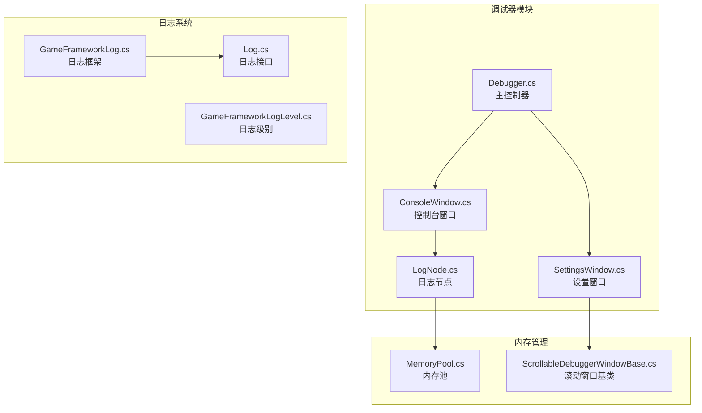
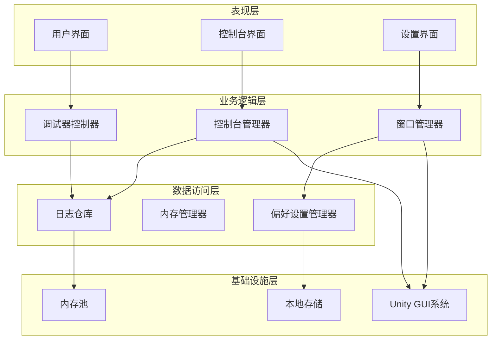
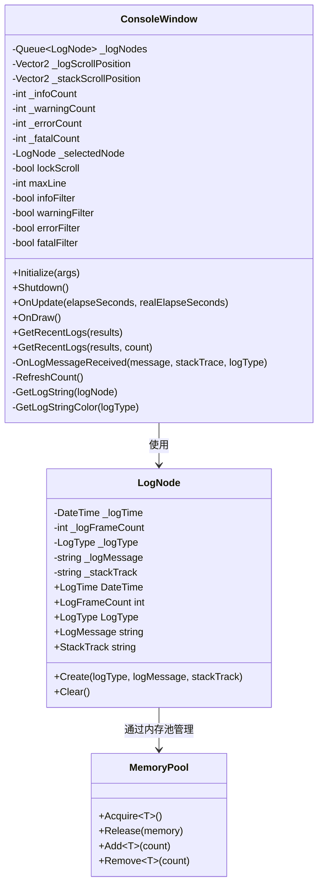
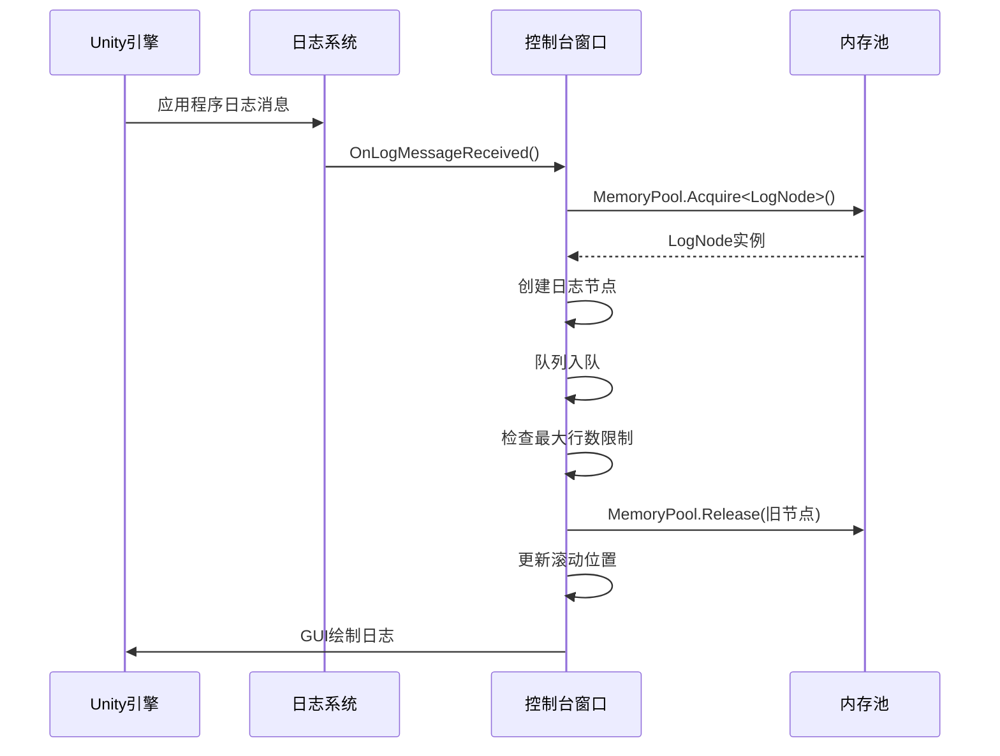
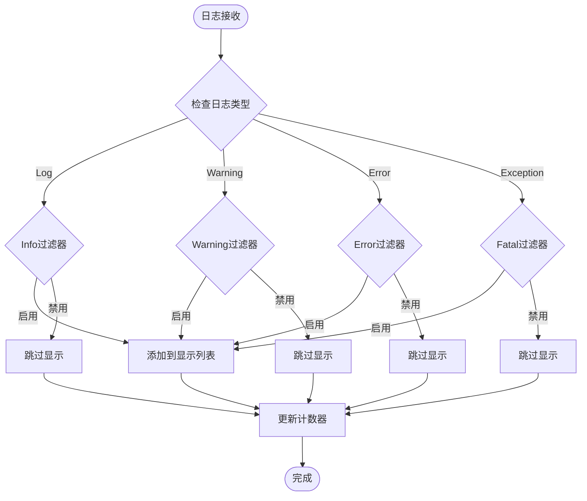
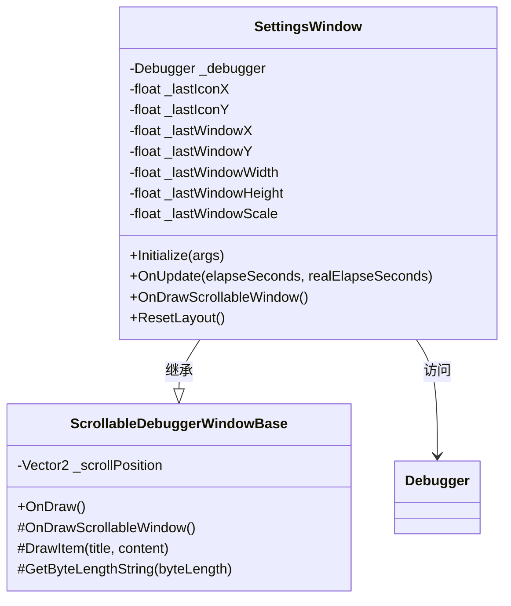
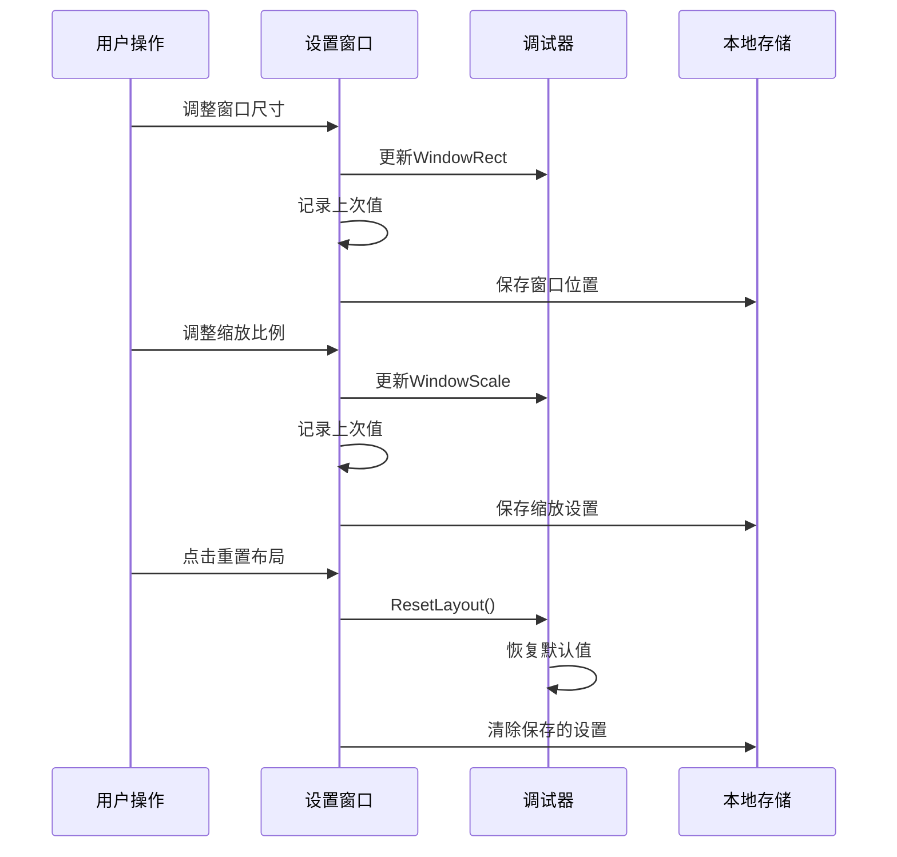
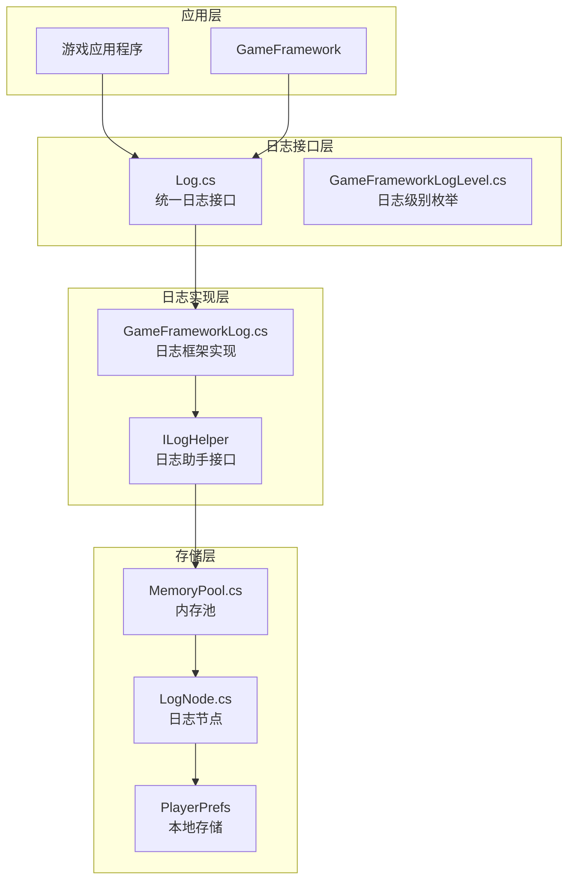
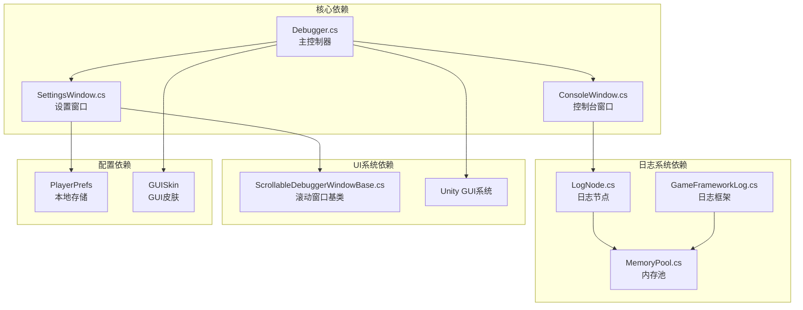

# 控制台设置面板

<cite>
**本文档引用的文件**
- [DebuggerComponent.ConsoleWindow.cs](file://Assets/TEngine/Runtime/Module/DebugerModule/DebuggerComponent.ConsoleWindow.cs)
- [DebuggerModule.SettingsWindow.cs](file://Assets/TEngine/Runtime/Module/DebugerModule/Component/DebuggerModule.SettingsWindow.cs)
- [DebuggerModule.LogNode.cs](file://Assets/TEngine/Runtime/Module/DebugerModule/Component/DebuggerModule.LogNode.cs)
- [GameFrameworkLog.cs](file://Assets/TEngine/Runtime/Core/Log/GameFrameworkLog.cs)
- [GameFrameworkLogLevel.cs](file://Assets/TEngine/Runtime/Core/Log/GameFrameworkLogLevel.cs)
- [Log.cs](file://Assets/TEngine/Runtime/Core/Log/Log.cs)
- [Debugger.cs](file://Assets/TEngine/Runtime/Module/DebugerModule/Debugger.cs)
- [MemoryPool.cs](file://Assets/TEngine/Runtime/Core/MemoryPool/MemoryPool.cs)
- [DebuggerModule.ScrollableDebuggerWindowBase.cs](file://Assets/TEngine/Runtime/Module/DebugerModule/Component/DebuggerModule.ScrollableDebuggerWindowBase.cs)
</cite>

## 目录
1. [简介](#简介)
2. [项目结构](#项目结构)
3. [核心组件](#核心组件)
4. [架构概览](#架构概览)
5. [详细组件分析](#详细组件分析)
6. [依赖关系分析](#依赖关系分析)
7. [性能考虑](#性能考虑)
8. [故障排除指南](#故障排除指南)
9. [结论](#结论)

## 简介

TEngine控制台设置面板是游戏开发过程中的重要调试工具，提供了完整的日志管理系统和可视化界面。该系统支持实时日志输出、多级过滤、搜索功能以及导出能力，同时提供灵活的窗口布局配置和显示模式切换。

本系统采用模块化设计，通过内存池优化内存使用，通过事件驱动机制实现实时日志捕获，并提供丰富的调试信息展示功能。

## 项目结构

TEngine控制台设置面板位于调试器模块中，主要包含以下核心文件：

**图表来源**
- [Debugger.cs:1-429](file://Assets/TEngine/Runtime/Module/DebugerModule/Debugger.cs#L1-L429)
- [DebuggerComponent.ConsoleWindow.cs:1-409](file://Assets/TEngine/Runtime/Module/DebugerModule/DebuggerComponent.ConsoleWindow.cs#L1-L409)
- [DebuggerModule.SettingsWindow.cs:1-226](file://Assets/TEngine/Runtime/Module/DebugerModule/Component/DebuggerModule.SettingsWindow.cs#L1-L226)

**章节来源**
- [Debugger.cs:1-429](file://Assets/TEngine/Runtime/Module/DebugerModule/Debugger.cs#L1-L429)
- [DebuggerComponent.ConsoleWindow.cs:1-409](file://Assets/TEngine/Runtime/Module/DebugerModule/DebuggerComponent.ConsoleWindow.cs#L1-L409)
- [DebuggerModule.SettingsWindow.cs:1-226](file://Assets/TEngine/Runtime/Module/DebugerModule/Component/DebuggerModule.SettingsWindow.cs#L1-L226)

## 核心组件

### 控制台窗口组件

控制台窗口是日志系统的核心界面组件，负责实时显示和管理日志信息。

**主要功能特性：**
- 实时日志捕获和显示
- 多级日志过滤（Info、Warning、Error、Fatal）
- 自动滚动锁定机制
- 日志颜色标识系统
- 最大行数限制和内存优化

### 设置窗口组件

设置窗口提供调试器的布局和显示配置功能。

**配置选项：**
- 窗口位置调整（拖拽移动）
- 窗口尺寸调节（宽度、高度）
- 缩放比例控制（0.5x 到 4.0x）
- 快速预设按钮
- 布局重置功能

### 日志节点管理

日志节点是日志系统的基础数据结构，采用内存池管理模式。

**数据结构特性：**
- 时间戳记录（DateTime）
- 帧计数跟踪（int）
- 日志类型标识（LogType）
- 消息内容存储（string）
- 堆栈跟踪信息（string）

**章节来源**
- [DebuggerComponent.ConsoleWindow.cs:1-409](file://Assets/TEngine/Runtime/Module/DebugerModule/DebuggerComponent.ConsoleWindow.cs#L1-L409)
- [DebuggerModule.SettingsWindow.cs:1-226](file://Assets/TEngine/Runtime/Module/DebugerModule/Component/DebuggerModule.SettingsWindow.cs#L1-L226)
- [DebuggerModule.LogNode.cs:1-118](file://Assets/TEngine/Runtime/Module/DebugerModule/Component/DebuggerModule.LogNode.cs#L1-L118)

## 架构概览

TEngine控制台设置面板采用分层架构设计，实现了清晰的关注点分离：

**图表来源**
- [Debugger.cs:1-429](file://Assets/TEngine/Runtime/Module/DebugerModule/Debugger.cs#L1-L429)
- [GameFrameworkLog.cs:1-800](file://Assets/TEngine/Runtime/Core/Log/GameFrameworkLog.cs#L1-L800)
- [MemoryPool.cs:1-208](file://Assets/TEngine/Runtime/Core/MemoryPool/MemoryPool.cs#L1-L208)

## 详细组件分析

### 控制台窗口实现机制

控制台窗口通过队列数据结构管理日志节点，实现了高效的日志显示和过滤功能：

**图表来源**
- [DebuggerComponent.ConsoleWindow.cs:1-409](file://Assets/TEngine/Runtime/Module/DebugerModule/DebuggerComponent.ConsoleWindow.cs#L1-L409)
- [DebuggerModule.LogNode.cs:1-118](file://Assets/TEngine/Runtime/Module/DebugerModule/Component/DebuggerModule.LogNode.cs#L1-L118)
- [MemoryPool.cs:1-208](file://Assets/TEngine/Runtime/Core/MemoryPool/MemoryPool.cs#L1-L208)

#### 日志输出管理流程

**图表来源**
- [DebuggerComponent.ConsoleWindow.cs:362-374](file://Assets/TEngine/Runtime/Module/DebugerModule/DebuggerComponent.ConsoleWindow.cs#L362-L374)
- [MemoryPool.cs:66-85](file://Assets/TEngine/Runtime/Core/MemoryPool/MemoryPool.cs#L66-L85)

#### 日志级别过滤机制

控制台窗口实现了多级日志过滤功能，支持独立控制每种日志级别的显示：

**图表来源**
- [DebuggerComponent.ConsoleWindow.cs:210-252](file://Assets/TEngine/Runtime/Module/DebugerModule/DebuggerComponent.ConsoleWindow.cs#L210-L252)

**章节来源**
- [DebuggerComponent.ConsoleWindow.cs:1-409](file://Assets/TEngine/Runtime/Module/DebugerModule/DebuggerComponent.ConsoleWindow.cs#L1-L409)
- [DebuggerModule.LogNode.cs:1-118](file://Assets/TEngine/Runtime/Module/DebugerModule/Component/DebuggerModule.LogNode.cs#L1-L118)

### 设置窗口功能特性

设置窗口提供了全面的调试器布局和显示配置选项：

**图表来源**
- [DebuggerModule.SettingsWindow.cs:1-226](file://Assets/TEngine/Runtime/Module/DebugerModule/Component/DebuggerModule.SettingsWindow.cs#L1-L226)
- [DebuggerModule.ScrollableDebuggerWindowBase.cs:1-93](file://Assets/TEngine/Runtime/Module/DebugerModule/Component/DebuggerModule.ScrollableDebuggerWindowBase.cs#L1-L93)

#### 窗口布局设置流程

设置窗口实现了动态布局管理，支持实时调整和持久化保存：

**图表来源**
- [DebuggerModule.SettingsWindow.cs:40-83](file://Assets/TEngine/Runtime/Module/DebugerModule/Component/DebuggerModule.SettingsWindow.cs#L40-L83)
- [Debugger.cs:312-317](file://Assets/TEngine/Runtime/Module/DebugerModule/Debugger.cs#L312-L317)

**章节来源**
- [DebuggerModule.SettingsWindow.cs:1-226](file://Assets/TEngine/Runtime/Module/DebugerModule/Component/DebuggerModule.SettingsWindow.cs#L1-L226)
- [DebuggerModule.ScrollableDebuggerWindowBase.cs:1-93](file://Assets/TEngine/Runtime/Module/DebugerModule/Component/DebuggerModule.ScrollableDebuggerWindowBase.cs#L1-L93)

### 日志系统架构设计

TEngine的日志系统采用了分层架构设计，实现了高性能的日志处理和存储：

**图表来源**
- [Log.cs:1-800](file://Assets/TEngine/Runtime/Core/Log/Log.cs#L1-L800)
- [GameFrameworkLog.cs:1-800](file://Assets/TEngine/Runtime/Core/Log/GameFrameworkLog.cs#L1-L800)
- [GameFrameworkLogLevel.cs:1-34](file://Assets/TEngine/Runtime/Core/Log/GameFrameworkLogLevel.cs#L1-L34)
- [MemoryPool.cs:1-208](file://Assets/TEngine/Runtime/Core/MemoryPool/MemoryPool.cs#L1-L208)

#### 日志节点管理机制

日志节点采用内存池管理模式，实现了高效的内存分配和回收：

**内存池优化策略：**
- 对象重用减少垃圾回收压力
- 批量分配提高内存利用率
- 引用计数管理避免内存泄漏
- 类型安全检查确保数据完整性

**章节来源**
- [Log.cs:1-800](file://Assets/TEngine/Runtime/Core/Log/Log.cs#L1-L800)
- [GameFrameworkLog.cs:1-800](file://Assets/TEngine/Runtime/Core/Log/GameFrameworkLog.cs#L1-L800)
- [GameFrameworkLogLevel.cs:1-34](file://Assets/TEngine/Runtime/Core/Log/GameFrameworkLogLevel.cs#L1-L34)
- [MemoryPool.cs:1-208](file://Assets/TEngine/Runtime/Core/MemoryPool/MemoryPool.cs#L1-L208)

## 依赖关系分析

TEngine控制台设置面板的组件间依赖关系如下：

**图表来源**
- [Debugger.cs:1-429](file://Assets/TEngine/Runtime/Module/DebugerModule/Debugger.cs#L1-L429)
- [DebuggerComponent.ConsoleWindow.cs:1-409](file://Assets/TEngine/Runtime/Module/DebugerModule/DebuggerComponent.ConsoleWindow.cs#L1-L409)
- [DebuggerModule.SettingsWindow.cs:1-226](file://Assets/TEngine/Runtime/Module/DebugerModule/Component/DebuggerModule.SettingsWindow.cs#L1-L226)

**章节来源**
- [Debugger.cs:1-429](file://Assets/TEngine/Runtime/Module/DebugerModule/Debugger.cs#L1-L429)
- [MemoryPool.cs:1-208](file://Assets/TEngine/Runtime/Core/MemoryPool/MemoryPool.cs#L1-L208)

## 性能考虑

### 内存优化策略

1. **内存池管理**
   - 使用内存池减少频繁的对象分配
   - 实现对象重用机制避免垃圾回收
   - 提供批量分配和回收功能

2. **日志缓冲区优化**
   - 限制最大日志行数防止内存溢出
   - 实现自动清理机制释放旧日志
   - 使用队列数据结构保证先进先出

3. **渲染性能优化**
   - 实现虚拟滚动只渲染可见区域
   - 减少GUI绘制调用频率
   - 优化颜色和字体渲染

### 线程安全考虑

- 日志捕获通过Unity的Application.logMessageReceived事件机制
- UI更新在主线程中执行确保线程安全
- 使用PlayerPrefs进行配置持久化

## 故障排除指南

### 常见问题及解决方案

**问题1：日志不显示**
- 检查ActiveWindow属性是否为true
- 验证日志级别过滤设置
- 确认调试器是否在当前构建版本中启用

**问题2：内存使用过高**
- 调整maxLine参数限制日志数量
- 检查是否有大量重复日志
- 定期清理历史日志数据

**问题3：窗口布局异常**
- 使用ResetLayout恢复默认设置
- 检查PlayerPrefs中的配置数据
- 验证屏幕分辨率变化影响

**章节来源**
- [Debugger.cs:89-114](file://Assets/TEngine/Runtime/Module/DebugerModule/Debugger.cs#L89-L114)
- [DebuggerComponent.ConsoleWindow.cs:36-67](file://Assets/TEngine/Runtime/Module/DebugerModule/DebuggerComponent.ConsoleWindow.cs#L36-L67)

## 结论

TEngine控制台设置面板是一个功能完善、架构清晰的调试工具系统。它通过模块化设计实现了日志管理、窗口配置和性能监控的有机结合。

**主要优势：**
- 高效的日志处理和内存管理
- 灵活的配置选项和用户界面
- 完善的错误处理和故障排除机制
- 良好的性能表现和扩展性

**适用场景：**
- 游戏开发过程中的调试和测试
- 生产环境的问题诊断和分析
- 性能监控和优化工作
- 团队协作中的问题排查

该系统为开发者提供了强大的工具支持，能够有效提升开发效率和产品质量。